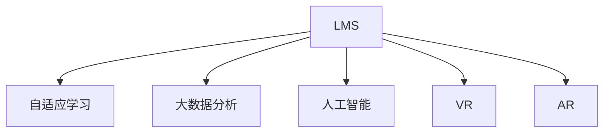

                 

# 如何利用技术能力创建在线课程

> 关键词：在线课程, 教育技术, 学习管理系统(LMS), 人工智能(AI), 大数据分析, 自适应学习, 虚拟现实(VR)

## 1. 背景介绍

### 1.1 问题由来

随着互联网和数字技术的普及，在线教育已逐渐成为现代社会的一个重要组成部分。特别是在全球疫情的影响下，线上教育得到了前所未有的推动。然而，传统的在线教育模式往往缺乏互动性和个性化，难以满足不同学习者的多样化需求。

在线课程的创建需要综合运用教育学、心理学、技术开发等多个领域的知识。当前，许多在线教育平台在课程设计、教学效果评估、学习体验优化等方面存在诸多挑战，亟需结合先进技术手段，打造更加高效、智能、个性化的在线教育系统。

### 1.2 问题核心关键点

创建一个高效、智能、个性化的在线课程，主要需要考虑以下几个关键点：

1. **学习管理系统(LMS)**：选择或设计符合课程需求的LMS平台，提供内容上传、作业批改、学习进度跟踪等基础功能。
2. **学习数据驱动**：利用大数据分析技术，对学习者行为数据进行挖掘分析，生成个性化的学习路径和推荐。
3. **自适应学习**：基于人工智能技术，实现对学习者的动态评估和自适应调整。
4. **交互性和沉浸感**：引入虚拟现实、增强现实、交互式模拟等技术，提升课程的沉浸感和交互性。
5. **课程内容创新**：结合前沿技术，创新课程内容，如数据科学、编程、AI等高需求技能课程。

### 1.3 问题研究意义

创建高效、智能、个性化的在线课程，有助于：

1. **提高教育资源可及性**：突破地理限制，让更多人有机会接触优质教育资源。
2. **提升学习效率**：通过数据分析和自适应学习，个性化推荐学习内容，提升学习效果。
3. **增强学习体验**：引入交互式和沉浸式学习体验，激发学习者的兴趣和参与感。
4. **促进技能培养**：结合前沿技术，为学习者提供与时俱进的课程内容，提升就业竞争力。
5. **推动教育创新**：利用技术手段，探索新的教育模式，推动教育事业的持续进步。

## 2. 核心概念与联系

### 2.1 核心概念概述

为更好地理解在线课程的创建过程，本节将介绍几个密切相关的核心概念：

- **学习管理系统(Learning Management System, LMS)**：提供课程设计、发布、管理、评估等功能，支持教师和学生互动。常见的LMS包括Moodle、Blackboard、Canvas等。
- **自适应学习(Adaptive Learning)**：根据学习者的实时表现，动态调整课程内容和难度，提供个性化学习路径。
- **大数据分析(Big Data Analytics)**：通过收集和分析学习数据，生成对学习者行为和需求的洞察，以支持个性化推荐和干预。
- **人工智能(Artificial Intelligence, AI)**：提供自动评分、智能推荐、情感分析等功能，提升课程的智能化水平。
- **虚拟现实(Virtual Reality, VR)**：提供沉浸式学习体验，通过虚拟环境增强学习者参与感。
- **增强现实(Augmented Reality, AR)**：在现实世界中叠加虚拟信息，提供互动式学习体验。

这些核心概念之间的逻辑关系可以通过以下Mermaid流程图来展示：



这个流程图展示了大语言模型微调的关键概念及其之间的关系：

1. LMS是课程创建的基础平台，提供基本的管理和互动功能。
2. 自适应学习、大数据分析和人工智能技术相互协作，提供个性化和智能化的学习体验。
3. VR和AR技术为课程增加了沉浸感和交互性，进一步提升了学习效果。

## 3. 核心算法原理 & 具体操作步骤
### 3.1 算法原理概述

创建一个高效、智能、个性化的在线课程，其核心算法原理包括：

1. **学习数据分析**：收集和分析学习者行为数据，如点击率、完成率、回答时间等，以了解学习者的学习进度和效果。
2. **自适应学习算法**：根据学习者的实时表现，动态调整课程内容和难度，提供个性化的学习路径。
3. **推荐算法**：基于学习者的历史行为和偏好，推荐合适的学习资源和内容。
4. **情感分析**：分析学习者反馈和情绪变化，及时调整教学策略和内容，提升学习体验。

这些算法共同构成了一个完整的在线课程创建框架，能够根据学习者的个性化需求，动态调整课程内容，提升学习效果。

### 3.2 算法步骤详解

创建高效、智能、个性化的在线课程，主要包括以下几个关键步骤：

**Step 1: 课程设计**

1. 定义课程目标：明确课程的主题、知识点和技能目标。
2. 制定教学大纲：列出课程内容、学习目标、评估方法等。
3. 设计学习活动：规划课程中的教学活动，如视频、互动问答、实践项目等。

**Step 2: 内容开发**

1. 制作教学视频：录制或导入视频资源，提供课程讲解和演示。
2. 编写学习材料：编写课程讲义、练习题、案例分析等学习材料，供学生参考。
3. 开发互动环节：设计互动环节，如在线讨论、小组项目、测试等。

**Step 3: 学习管理系统部署**

1. 选择合适的LMS平台，安装和配置系统环境。
2. 导入课程内容：将教学视频、学习材料等上传至LMS，设置课程结构。
3. 设置课程规则：定义课程的时间表、截止日期、成绩评估方式等。

**Step 4: 学习数据分析与自适应学习**

1. 收集学习数据：通过LMS系统收集学生的学习行为数据，如点击率、观看时间、答题情况等。
2. 分析学习数据：使用大数据分析工具，分析学习者的行为和表现，生成个性化报告。
3. 自适应调整：根据个性化报告，动态调整课程内容和难度，提供个性化的学习路径。

**Step 5: 智能化教学**

1. 智能推荐：基于学习者的历史行为和偏好，推荐合适的学习资源和内容。
2. 自动评分：利用人工智能技术，自动批改作业、测试等，提供即时反馈。
3. 情感分析：分析学习者反馈和情绪变化，及时调整教学策略和内容，提升学习体验。

**Step 6: 技术集成与优化**

1. 集成VR/AR技术：引入虚拟现实、增强现实技术，提升课程的沉浸感和互动性。
2. 优化系统性能：优化LMS平台的性能，确保课程运行流畅。
3. 用户反馈与迭代：收集用户反馈，不断改进课程内容和教学方法。

### 3.3 算法优缺点

创建高效、智能、个性化的在线课程，具有以下优点：

1. **提升学习效果**：通过个性化推荐和自适应学习，提升学习者的学习效率和理解深度。
2. **增强学习体验**：引入虚拟现实、增强现实技术，提升课程的沉浸感和互动性。
3. **降低教育成本**：突破地理限制，让更多人能够接触优质教育资源。
4. **支持大规模教学**：通过LMS平台，支持大规模在线教学，降低人力成本。

同时，该方法也存在一定的局限性：

1. **资源投入高**：课程开发需要大量的人力和时间，尤其是在技术集成方面。
2. **数据隐私问题**：学习者数据的安全性和隐私保护是一个重要问题，需要严格的数据管理和隐私保护措施。
3. **技术依赖性强**：课程的智能化和个性化依赖于先进的技术手段，对技术资源的投入要求较高。
4. **教学内容单一**：课程内容的设计需要综合考虑多个方面的知识，仅依赖单一学科的知识难以覆盖所有学习需求。

尽管存在这些局限性，但整体而言，创建高效、智能、个性化的在线课程仍然具有广泛的应用前景。

### 3.4 算法应用领域

基于技术能力创建的在线课程，广泛应用于各个教育领域，包括但不限于：

1. **K-12教育**：通过个性化学习路径和资源推荐，提升中小学生的学习效果。
2. **高等教育**：提供专业课程和前沿技术，提升学生的就业竞争力。
3. **职业培训**：通过实践项目和在线实验，提升职业技能。
4. **企业培训**：提供在线课程和培训，提升员工的专业技能和团队协作能力。
5. **终身学习**：提供丰富多样的学习资源，支持成年人继续教育和职业发展。

这些领域的在线课程开发，可以推动教育的普及和公平，提升个人和社会的整体素质和竞争力。

## 4. 数学模型和公式 & 详细讲解 & 举例说明

### 4.1 数学模型构建

创建一个高效、智能、个性化的在线课程，其数学模型可以抽象为：

1. **学习者模型**：描述学习者的特征和行为，如学习风格、知识水平、学习速度等。
2. **课程模型**：描述课程内容和结构，如知识点的难易程度、学习活动的设计等。
3. **推荐模型**：根据学习者模型和课程模型，生成个性化的学习资源和内容推荐。
4. **自适应模型**：根据学习者的实时表现，动态调整课程内容和难度，提供个性化的学习路径。

这些模型共同构成了一个完整的在线课程创建框架，能够根据学习者的个性化需求，动态调整课程内容，提升学习效果。

### 4.2 公式推导过程

以下以自适应学习算法为例，推导其数学模型和优化目标。

设学习者的学习进度为 $x_t$，课程难度为 $d_t$，学习目标为 $y_t$，学习效果为 $e_t$。自适应学习算法通过动态调整学习进度和课程难度，最大化学习效果 $e_t$。

假设学习进度和课程难度之间的关系为 $x_t = f(d_t)$，则优化目标为：

$$
\max_{d_t} \sum_{t=1}^T e_t
$$

其中 $T$ 为总的学习时间。根据最大化目标，求解 $d_t$ 的最优值，生成个性化的学习路径。

### 4.3 案例分析与讲解

以在线编程课程为例，分析自适应学习算法的具体应用。

1. **学习者模型**：通过学习者的历史编程作业、测试成绩等数据，生成学习者的知识水平和学习风格。
2. **课程模型**：定义编程课程的知识点、难度分布和学习活动，如算法实现、代码调试、项目实践等。
3. **推荐模型**：根据学习者的知识水平和当前学习进度，推荐适合的编程题目和资源，如在线教程、视频教程、代码示例等。
4. **自适应模型**：根据学习者的编程表现和代码运行结果，动态调整课程难度，提供个性化的学习路径。

在具体实现中，可以采用基于遗传算法的自适应算法，通过模拟遗传进化过程，动态调整课程难度和学习路径。

## 5. 项目实践：代码实例和详细解释说明
### 5.1 开发环境搭建

在进行在线课程创建实践前，我们需要准备好开发环境。以下是使用Python进行Django开发的环境配置流程：

1. 安装Anaconda：从官网下载并安装Anaconda，用于创建独立的Python环境。

2. 创建并激活虚拟环境：
```bash
conda create -n django-env python=3.8 
conda activate django-env
```

3. 安装Django：
```bash
pip install django
```

4. 安装相关的第三方库：
```bash
pip install markdown django-markdown django-templates django-crispy-forms django-formsets django-celery
```

5. 安装Django-Course：
```bash
pip install django-course
```

6. 安装Python可视化工具：
```bash
pip install matplotlib numpy pandas scikit-learn
```

完成上述步骤后，即可在`django-env`环境中开始在线课程创建实践。

### 5.2 源代码详细实现

以下是一个使用Django-Course框架创建在线课程的示例代码。

1. 创建课程：

```python
from django_courses.models import Course
from django_courses.utils import generate_courses
from django_courses.views import course_list, course_detail

def create_course(request):
    course_name = request.POST['course_name']
    course_description = request.POST['course_description']
    course_start_date = request.POST['course_start_date']
    course_end_date = request.POST['course_end_date']
    course_instructor = request.POST['course_instructor']
    course_learning_type = request.POST['course_learning_type']
    
    # 创建课程对象
    course = Course.objects.create(
        name=course_name,
        description=course_description,
        start_date=course_start_date,
        end_date=course_end_date,
        instructor=course_instructor,
        learning_type=course_learning_type
    )
    
    # 生成课程
    generate_courses(course)
    
    return HttpResponse("Course created successfully!")
```

2. 创建课程内容：

```python
from django_courses.models import Lesson, LessonContent

def create_lesson(request, course_id):
    course = get_object_or_404(Course, id=course_id)
    lesson_name = request.POST['lesson_name']
    lesson_description = request.POST['lesson_description']
    
    # 创建课程内容对象
    lesson = Lesson.objects.create(course=course, name=lesson_name, description=lesson_description)
    
    return HttpResponse("Lesson created successfully!")
```

3. 创建课程活动：

```python
from django_courses.models import LessonContent, Activity

def create_activity(request, lesson_id):
    lesson = get_object_or_404(Lesson, id=lesson_id)
    activity_name = request.POST['activity_name']
    activity_description = request.POST['activity_description']
    activity_type = request.POST['activity_type']
    
    # 创建课程活动对象
    activity = Activity.objects.create(lesson=lesson, name=activity_name, description=activity_description, activity_type=activity_type)
    
    return HttpResponse("Activity created successfully!")
```

### 5.3 代码解读与分析

让我们再详细解读一下关键代码的实现细节：

**create_course函数**：
- 定义了创建课程的函数，通过POST请求获取课程的基本信息，并创建Course模型对象。
- 调用generate_courses函数生成课程，该函数会从数据库中读取模板数据，生成HTML页面并存入Course对象中。

**create_lesson函数**：
- 定义了创建课程内容的函数，通过POST请求获取课程内容的基本信息，并创建Lesson模型对象。
- 返回一个成功信息，告诉用户课程内容创建成功。

**create_activity函数**：
- 定义了创建课程活动的函数，通过POST请求获取课程活动的基本信息，并创建Activity模型对象。
- 返回一个成功信息，告诉用户课程活动创建成功。

**Django-Course框架**：
- 该框架提供了一套完整的在线课程管理解决方案，包括课程管理、课程内容管理、课程活动管理等功能。
- 可以通过简单的配置，快速搭建在线课程系统，支持多种学习类型的课程设计。

### 5.4 运行结果展示

在Django-Course的示例中，我们可以在浏览器中访问创建的课程、课程内容和课程活动，并进行相应的操作。例如，创建一个名为“Python基础”的课程，并在其中添加三个课程内容“Python基础”、“Python高级”、“Python实战”，每个课程内容下面可以添加多个课程活动，如“编程作业”、“在线讨论”、“视频教程”等。

## 6. 实际应用场景

### 6.1 智能教育平台

智能教育平台通过综合运用大数据分析、自适应学习和人工智能技术，能够提供个性化的学习体验和教学效果。例如，智能教育平台可以根据学习者的历史数据，生成个性化的学习路径和推荐，动态调整课程难度，提升学习效果。

### 6.2 企业培训系统

企业培训系统通过在线课程和虚拟课堂，提升员工的专业技能和团队协作能力。例如，企业可以根据员工的技能需求，设计个性化的培训课程，通过在线测试和作业，评估员工的学习效果。

### 6.3 在线教育创业

在线教育创业可以通过创建精品课程和高质量的教学内容，吸引用户注册和付费。例如，在线教育平台可以通过数据分析和自适应学习技术，提升课程的质量和用户体验，扩大用户规模。

### 6.4 未来应用展望

未来，在线课程将更加智能化、个性化，能够满足不同学习者的多样化需求。以下是一些未来的应用展望：

1. **自适应学习技术**：通过深入分析学习者的行为和反馈，提供更加个性化的学习路径和推荐。
2. **智能辅导系统**：引入AI助手，实时解答学习者的疑问，提供个性化的学习支持。
3. **虚拟现实课堂**：通过虚拟现实技术，提供沉浸式的学习体验，提升课程的互动性和趣味性。
4. **跨平台学习**：支持多设备、多平台的学习，提升学习体验的便捷性和灵活性。
5. **智能评测系统**：通过智能评测技术，提升作业和测试的自动化水平，减轻教师的批改负担。

## 7. 工具和资源推荐

### 7.1 学习资源推荐

为了帮助开发者系统掌握在线课程创建的理论基础和实践技巧，这里推荐一些优质的学习资源：

1. **Coursera在线课程**：提供广泛的课程选择，涵盖各个学科和技能，是学习新技术的重要资源。
2. **edX在线课程**：由麻省理工学院、哈佛大学等名校开设，提供高质量的在线教育资源。
3. **Udacity纳米学位**：专注于技能培训和职业发展，提供实战项目和行业认证。
4. **Khan Academy**：提供免费的K-12教育资源，涵盖数学、科学、历史等多个领域。
5. **Google Coursera数据科学专业证书**：由谷歌和IBM合作开设，涵盖数据科学的核心技能和工具。

通过对这些资源的学习实践，相信你一定能够快速掌握在线课程创建的方法和技巧，为更多用户提供优质的学习资源。

### 7.2 开发工具推荐

高效的开发离不开优秀的工具支持。以下是几款用于在线课程创建开发的常用工具：

1. **Django**：一款流行的Python Web框架，支持多种模板引擎和第三方插件，适合快速搭建在线课程系统。
2. **Django-Course**：基于Django的在线课程管理框架，提供课程设计、内容管理、活动管理等功能。
3. **Google Colab**：谷歌提供的在线Jupyter Notebook环境，免费提供GPU/TPU算力，方便开发者快速上手实验最新技术。
4. **AWS SageMaker**：亚马逊提供的机器学习平台，支持在线课程的部署和优化。
5. **Kaggle**：提供大量的数据集和竞赛平台，支持数据挖掘和数据分析技术的学习和应用。

合理利用这些工具，可以显著提升在线课程创建的开发效率，加快创新迭代的步伐。

### 7.3 相关论文推荐

在线课程创建的研究源于学界的持续研究。以下是几篇奠基性的相关论文，推荐阅读：

1. **《自适应学习：一种个性化学习系统框架》**：探讨自适应学习系统的设计和实现，提出多种自适应算法和技术。
2. **《基于大数据的在线教育推荐系统》**：研究基于大数据的在线教育推荐算法，提升学习资源的推荐效果。
3. **《虚拟现实在教育中的应用》**：探讨虚拟现实技术在教育中的潜在应用，提供基于VR的课程设计案例。
4. **《智能辅导系统的设计与实现》**：研究智能辅导系统的设计和实现，提出多种智能辅导算法和技术。
5. **《跨平台学习系统的设计与实现》**：研究跨平台学习系统的设计和实现，支持多设备、多平台的学习体验。

这些论文代表了大语言模型微调技术的发展脉络。通过学习这些前沿成果，可以帮助研究者把握学科前进方向，激发更多的创新灵感。

## 8. 总结：未来发展趋势与挑战

### 8.1 总结

本文对利用技术能力创建在线课程的方法进行了全面系统的介绍。首先阐述了在线课程创建的背景和意义，明确了在线课程创建的核心算法原理和操作步骤，提供了完整的代码实例和详细解读。通过本文的系统梳理，可以看到，利用技术能力创建在线课程需要综合运用多种技术和工具，通过科学的设计和实现，才能打造高效、智能、个性化的在线教育系统。

通过本文的系统梳理，可以看到，利用技术能力创建在线课程需要综合运用多种技术和工具，通过科学的设计和实现，才能打造高效、智能、个性化的在线教育系统。未来，在线课程将更加智能化、个性化，能够满足不同学习者的多样化需求。

### 8.2 未来发展趋势

展望未来，在线课程创建将呈现以下几个发展趋势：

1. **智能化水平提升**：通过大数据分析和自适应学习技术，提升课程的智能化水平，提供个性化的学习体验。
2. **互动性和沉浸感增强**：引入虚拟现实、增强现实技术，提升课程的互动性和沉浸感。
3. **跨平台学习普及**：支持多设备、多平台的学习，提升学习体验的便捷性和灵活性。
4. **智能评测系统发展**：引入智能评测技术，提升作业和测试的自动化水平，减轻教师的批改负担。
5. **个性化学习路径生成**：通过深入分析学习者的行为和反馈，提供更加个性化的学习路径和推荐。

这些趋势将推动在线教育的发展，提升学习者的学习效果和体验，为教育事业带来深远的影响。

### 8.3 面临的挑战

尽管在线课程创建技术已经取得了一定的进展，但在迈向更加智能化、普适化应用的过程中，它仍面临着诸多挑战：

1. **技术资源投入高**：课程创建需要大量的人力和时间，尤其是在技术集成方面。
2. **数据隐私问题**：学习者数据的安全性和隐私保护是一个重要问题，需要严格的数据管理和隐私保护措施。
3. **技术依赖性强**：课程的智能化和个性化依赖于先进的技术手段，对技术资源的投入要求较高。
4. **教学内容单一**：课程内容的设计需要综合考虑多个方面的知识，仅依赖单一学科的知识难以覆盖所有学习需求。
5. **教学效果评估**：如何科学地评估学习者的学习效果，并及时调整教学策略，是课程创建过程中的重要挑战。

尽管存在这些挑战，但整体而言，在线课程创建仍然具有广泛的应用前景。相信随着学界和产业界的共同努力，这些挑战终将一一被克服，在线课程创建技术将不断进步，推动教育事业的持续发展。

### 8.4 研究展望

面向未来，在线课程创建技术需要进一步探索和优化：

1. **自适应学习算法改进**：通过深入研究学习者的行为和反馈，提出更加智能和自适应的算法，提升个性化学习效果。
2. **虚拟现实和增强现实技术应用**：进一步探索VR和AR技术在教育中的应用，提升课程的沉浸感和互动性。
3. **跨平台学习系统设计**：设计和实现更加灵活和便捷的跨平台学习系统，支持多种设备和平台的学习体验。
4. **智能评测系统优化**：优化智能评测系统的设计，提升作业和测试的自动化水平，减轻教师的批改负担。
5. **数据隐私保护机制**：设计和实现有效的数据隐私保护机制，确保学习者数据的安全性和隐私性。

这些研究方向的探索，将引领在线课程创建技术迈向更高的台阶，为教育事业带来更多的创新和突破。

## 9. 附录：常见问题与解答

**Q1：在线课程的开发和维护需要哪些关键资源？**

A: 在线课程的开发和维护需要以下关键资源：

1. **技术团队**：包括前端开发、后端开发、数据工程师等，负责课程设计、开发和维护。
2. **内容团队**：包括课程设计师、讲师、编辑等，负责课程内容的制作和更新。
3. **学习数据**：收集和分析学习者的行为数据，生成个性化报告和推荐。
4. **教学资源**：包括视频、PPT、文档等，提供课程讲解和演示。
5. **用户反馈**：收集用户反馈和建议，持续改进课程内容和教学方法。

**Q2：如何设计个性化的学习路径？**

A: 设计个性化的学习路径需要以下步骤：

1. **数据分析**：通过大数据分析工具，收集和分析学习者的行为数据，生成学习者的知识水平和学习风格。
2. **课程设计**：根据学习者的特点，设计课程内容和难度分布，提供个性化的学习路径。
3. **推荐算法**：根据学习者的历史数据和实时表现，推荐合适的学习资源和内容。
4. **自适应调整**：根据学习者的实时表现，动态调整课程难度和内容，提供个性化的学习体验。

**Q3：如何保障在线课程的数据隐私？**

A: 保障在线课程的数据隐私需要以下措施：

1. **数据加密**：对学习者的数据进行加密处理，防止数据泄露和篡改。
2. **访问控制**：限制对学习者数据的访问权限，防止未经授权的数据访问。
3. **数据匿名化**：对学习者数据进行匿名化处理，保护学习者的隐私。
4. **隐私政策**：制定并公布数据隐私政策，告知学习者数据的使用方式和保护措施。
5. **合规审核**：定期进行隐私合规审核，确保数据处理符合相关法律法规。

**Q4：如何提升在线课程的互动性？**

A: 提升在线课程的互动性需要以下措施：

1. **虚拟现实技术**：引入虚拟现实技术，提供沉浸式的学习体验，提升课程的互动性和趣味性。
2. **增强现实技术**：在现实世界中叠加虚拟信息，提供互动式学习体验。
3. **在线讨论**：设置在线讨论区，鼓励学习者之间的互动和交流。
4. **小组项目**：设计小组项目，增强学习者的团队合作能力。
5. **实时反馈**：利用AI技术，提供实时反馈和答疑服务。

这些措施能够提升学习者的参与感和互动性，增强学习效果。

**Q5：如何提升在线课程的学习效果？**

A: 提升在线课程的学习效果需要以下措施：

1. **个性化学习**：通过数据分析和自适应学习，提供个性化的学习路径和推荐。
2. **互动式学习**：引入虚拟现实、增强现实技术，提升课程的互动性和趣味性。
3. **智能辅导系统**：引入AI助手，实时解答学习者的疑问，提供个性化的学习支持。
4. **多设备学习**：支持多设备、多平台的学习，提升学习体验的便捷性和灵活性。
5. **跨平台学习**：设计和实现更加灵活和便捷的跨平台学习系统，支持多种设备和平台的学习体验。

这些措施能够提升学习者的学习效果和体验，为教育事业带来深远的影响。

**Q6：如何评估在线课程的效果？**

A: 评估在线课程的效果需要以下指标：

1. **完成率**：计算课程的完成率，评估学习者的学习进度和效果。
2. **成绩分布**：分析学习者的成绩分布，评估课程的教学效果。
3. **学习时间**：计算学习者的学习时间，评估学习者的投入和效率。
4. **反馈满意度**：收集学习者的反馈和满意度，评估课程的互动性和教学效果。
5. **知识点掌握情况**：设计测试和测验，评估学习者对知识点的掌握情况。

通过这些指标，可以科学地评估在线课程的效果，并及时调整教学策略和内容。

---

作者：禅与计算机程序设计艺术 / Zen and the Art of Computer Programming

