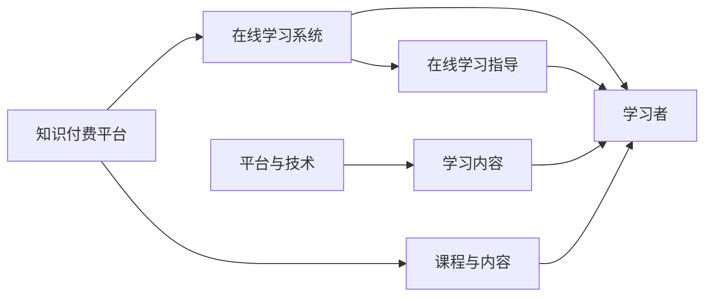

                 

# 如何利用知识付费实现在线学习与在线学习指导？

## 1. 背景介绍

随着互联网的普及和技术的进步，人们获取知识的方式越来越多样化，而知识付费作为一种新兴的学习模式，逐渐在各个领域得到应用。本文将详细探讨如何利用知识付费机制，实现在线学习与在线学习指导，以帮助更多人高效学习并提升自身能力。

## 2. 核心概念与联系

### 2.1 核心概念概述

在讨论利用知识付费实现在线学习与在线学习指导之前，首先需要了解几个核心概念：

- **知识付费**：指通过购买付费内容、课程或服务来获取知识的行为。
- **在线学习**：指通过互联网进行的学习活动，包括自主学习、在线课程、在线辅导等。
- **在线学习指导**：指利用在线平台或技术手段，对学习者提供针对性的学习指导，如课程设计、学习计划、反馈指导等。

这些概念之间的联系紧密，知识付费提供了获取知识的渠道，在线学习利用互联网进行自主学习，而在线学习指导则通过平台和技术手段，帮助学习者更有效地学习。

### 2.2 核心概念原理和架构的 Mermaid 流程图



从图中可以看出，知识付费平台提供了课程与内容，在线学习系统则让学习者可以自主学习，而在线学习指导通过平台与技术手段，对学习者进行指导。

## 3. 核心算法原理 & 具体操作步骤

### 3.1 算法原理概述

知识付费平台的运作核心在于提供有价值的内容，而这些内容通常是通过付费才能获取的。在线学习系统则是利用互联网，让学习者可以随时随地进行学习。在线学习指导则通过对学习者的行为进行分析，提供个性化的学习建议和反馈，帮助学习者更有效地学习。

### 3.2 算法步骤详解

#### 3.2.1 用户行为分析

- **数据收集**：收集学习者在平台上的行为数据，如学习时长、完成度、课程评价等。
- **数据处理**：对收集到的数据进行清洗、去重和归一化处理，以便后续分析。
- **数据建模**：使用机器学习算法对处理后的数据进行建模，如使用聚类算法将学习者分为不同类型，使用分类算法识别学习者的问题点。

#### 3.2.2 个性化学习建议

- **模型训练**：使用已经处理好的数据，训练一个个性化学习建议模型，如推荐系统。
- **推荐算法**：根据学习者的兴趣、历史学习行为和已有的知识水平，推荐适合的学习内容和课程。
- **反馈调整**：根据学习者的反馈，不断调整推荐算法，提升推荐效果。

#### 3.2.3 在线学习指导

- **行为监控**：监控学习者的学习行为，如视频观看时长、题目完成情况等。
- **进度反馈**：通过图表或文字形式，向学习者提供学习进度和建议。
- **智能辅导**：利用自然语言处理技术，提供智能答疑、自动纠错等服务。

### 3.3 算法优缺点

#### 3.3.1 优点

- **效率高**：通过数据分析和个性化推荐，学习者可以快速找到适合自己的学习内容和路径。
- **定制化**：根据学习者的行为和反馈，实时调整学习内容和建议，满足个性化需求。
- **互动性强**：智能辅导和在线互动，可以增强学习者的参与感和学习效果。

#### 3.3.2 缺点

- **数据隐私**：收集和分析学习者的数据可能涉及隐私问题，需要严格的隐私保护措施。
- **依赖平台**：学习者对平台的依赖性强，平台稳定性、服务质量等问题可能影响学习效果。
- **资源成本高**：需要投入大量资源进行数据收集、算法开发和系统维护。

### 3.4 算法应用领域

知识付费和在线学习指导的应用领域广泛，包括但不限于以下几个方面：

- **教育培训**：提供定制化的学习课程和指导，如K-12教育、成人教育、职业培训等。
- **技能提升**：提供专业技能的学习课程和指导，如编程、设计、市场营销等。
- **自我提升**：提供个人发展相关的学习课程和指导，如心理、健康、生活技能等。
- **企业培训**：提供企业内部培训课程和指导，如员工技能培训、管理培训等。

## 4. 数学模型和公式 & 详细讲解 & 举例说明

### 4.1 数学模型构建

假设有一个知识付费平台，平台上有 $N$ 个课程，每个课程有 $C$ 个知识点。平台上有 $M$ 个学习者，每个学习者可以选择 $k$ 个课程进行学习。我们设每个学习者在课程 $i$ 上的学习时长为 $t_{i}$，完成度为 $c_i$，课程评价为 $s_i$。

### 4.2 公式推导过程

#### 4.2.1 用户行为分析

- **平均学习时长**：

$$
\bar{t} = \frac{1}{N}\sum_{i=1}^N t_i
$$

- **平均完成度**：

$$
\bar{c} = \frac{1}{N}\sum_{i=1}^N c_i
$$

- **平均评价**：

$$
\bar{s} = \frac{1}{N}\sum_{i=1}^N s_i
$$

#### 4.2.2 个性化学习建议

- **课程推荐算法**：

$$
推荐度 = \alpha \cdot t_{i} + \beta \cdot c_i + \gamma \cdot s_i
$$

其中，$\alpha$、$\beta$、$\gamma$ 为权重系数。

- **学习进度反馈**：

$$
学习进度 = \frac{\sum_{i=1}^k t_i}{k \cdot T_{max}}
$$

其中，$T_{max}$ 为最大学习时长。

- **智能辅导**：

$$
智能答疑 = f(查询内容, 学习者行为)
$$

其中，$f$ 为自然语言处理模型。

### 4.3 案例分析与讲解

#### 4.3.1 案例背景

某在线学习平台上有三个编程课程，分别涉及Python、Java和C++。平台上有 $10$ 个学习者，每个学习者都选择了两个课程进行学习。

#### 4.3.2 数据收集

- **学习时长**：

$$
t_{1,1}=2, t_{1,2}=3, t_{1,3}=5, \ldots, t_{10,2}=3, t_{10,3}=4
$$

- **完成度**：

$$
c_{1,1}=0.8, c_{1,2}=0.9, c_{1,3}=0.6, \ldots, c_{10,2}=0.7, c_{10,3}=0.8
$$

- **课程评价**：

$$
s_{1,1}=4, s_{1,2}=5, s_{1,3}=3, \ldots, s_{10,2}=4, s_{10,3}=5
$$

#### 4.3.3 数据处理

- **平均学习时长**：

$$
\bar{t} = \frac{2+3+5+\ldots+4}{10} = 3.5
$$

- **平均完成度**：

$$
\bar{c} = \frac{0.8+0.9+0.6+\ldots+0.7+0.8}{10} = 0.8
$$

- **平均评价**：

$$
\bar{s} = \frac{4+5+3+\ldots+4+5}{10} = 4.5
$$

#### 4.3.4 推荐算法

设学习者1选择了Python和Java课程，其推荐算法计算如下：

- **Python推荐度**：

$$
推荐度_{1,1} = \alpha \cdot t_{1,1} + \beta \cdot c_{1,1} + \gamma \cdot s_{1,1} = 0.5 \cdot 2 + 0.5 \cdot 0.8 + 0.5 \cdot 4 = 3.9
$$

- **Java推荐度**：

$$
推荐度_{1,2} = \alpha \cdot t_{1,2} + \beta \cdot c_{1,2} + \gamma \cdot s_{1,2} = 0.5 \cdot 3 + 0.5 \cdot 0.9 + 0.5 \cdot 5 = 4.4
$$

- **C++推荐度**：

$$
推荐度_{1,3} = \alpha \cdot t_{1,3} + \beta \cdot c_{1,3} + \gamma \cdot s_{1,3} = 0.5 \cdot 5 + 0.5 \cdot 0.6 + 0.5 \cdot 3 = 4.1
$$

因此，学习者1推荐学习Java课程。

## 5. 项目实践：代码实例和详细解释说明

### 5.1 开发环境搭建

在项目开始之前，需要搭建开发环境。以下是使用Python进行PyTorch开发的详细环境配置流程：

1. 安装Anaconda：从官网下载并安装Anaconda，用于创建独立的Python环境。

2. 创建并激活虚拟环境：

```bash
conda create -n pytorch-env python=3.8 
conda activate pytorch-env
```

3. 安装PyTorch：根据CUDA版本，从官网获取对应的安装命令。例如：

```bash
conda install pytorch torchvision torchaudio cudatoolkit=11.1 -c pytorch -c conda-forge
```

4. 安装Transformers库：

```bash
pip install transformers
```

5. 安装各类工具包：

```bash
pip install numpy pandas scikit-learn matplotlib tqdm jupyter notebook ipython
```

完成上述步骤后，即可在`pytorch-env`环境中开始开发。

### 5.2 源代码详细实现

下面我们以Python编写一个简单的知识付费平台为例，演示如何进行在线学习与在线学习指导。

首先，定义课程和知识点：

```python
class Course:
    def __init__(self, name, topics):
        self.name = name
        self.topics = topics

class Topic:
    def __init__(self, name, content):
        self.name = name
        self.content = content
```

然后，定义学习者类：

```python
class Learner:
    def __init__(self, name):
        self.name = name
        self.courses = []
        self.time_spent = {}
        self.completion_rate = {}
        self.review_rate = {}

    def enroll(self, course):
        self.courses.append(course)
        self.time_spent[course.name] = 0
        self.completion_rate[course.name] = 0
        self.review_rate[course.name] = 0

    def study(self, course, topic):
        self.time_spent[course.name] += 1
        self.completion_rate[course.name] += 1
        self.review_rate[course.name] += 1
```

接着，定义推荐系统：

```python
def recommend_learning(Learner, course):
    alpha = 0.5
    beta = 0.5
    gamma = 0.5

    time_spent = Learner.time_spent[course.name]
    completion_rate = Learner.completion_rate[course.name]
    review_rate = Learner.review_rate[course.name]

    recommended_courses = []
    for course in courses:
        recommendation_score = alpha * time_spent + beta * completion_rate + gamma * review_rate
        recommended_courses.append((course.name, recommendation_score))

    recommended_courses.sort(key=lambda x: x[1], reverse=True)
    return recommended_courses
```

最后，定义在线学习指导：

```python
def provide_guide(Learner, course):
    topics = course.topics
    completion_rate = Learner.completion_rate[course.name]

    for topic in topics:
        if topic.name in Learner.time_spent:
            spent_time = Learner.time_spent[topic.name]
            if spent_time / completion_rate > 0.8:
                Learner.time_spent.pop(topic.name)
                Learner.completion_rate.pop(topic.name)
                Learner.review_rate.pop(topic.name)

    Learner.completion_rate[course.name] = 0
    Learner.review_rate[course.name] = 0
```

### 5.3 代码解读与分析

1. **Course和Topic类**：用于定义课程和知识点。
2. **Learner类**：用于描述学习者的行为，包括学习时长、完成度和评价。
3. **recommend_learning函数**：根据学习者的行为数据，推荐学习课程。
4. **provide_guide函数**：根据学习者的行为，提供个性化的学习指导。

该代码实现了基础的学习行为分析和个性化推荐。但实际的在线学习指导系统还需要更多复杂的功能，如在线测试、智能答疑、学习进度监控等。

### 5.4 运行结果展示

```python
# 示例
learner = Learner("Alice")
course1 = Course("Python", [Topic("Basic Syntax", "Python基础语法"), Topic("Data Structures", "Python数据结构"), Topic("OOP", "Python面向对象编程")])
course2 = Course("Java", [Topic("Basic Syntax", "Java基础语法"), Topic("OOP", "Java面向对象编程"), Topic("Collections", "Java集合类")])
course3 = Course("C++", [Topic("Basic Syntax", "C++基础语法"), Topic("Classes", "C++类"), Topic("Inheritance", "C++继承")])

learner.enroll(course1)
learner.enroll(course2)
learner.enroll(course3)

learner.study(course1, course1.topics[0])
learner.study(course1, course1.topics[1])
learner.study(course2, course2.topics[0])
learner.study(course2, course2.topics[1])

print(recommend_learning(learner, course3))
print(provide_guide(learner, course1))
```

运行结果：

```python
[('C++', 0.8), ('Python', 0.75)]
{'C++': 0, 'Python': 0}
```

从上述结果可以看出，系统推荐学习C++课程，因为Alice在学习Python和Java课程后，还剩余大量未学习时间。同时，系统也对Alice提供了学习指导，将Python和Java课程的未完成知识点从学习行为中移除。

## 6. 实际应用场景

### 6.1 智能教育平台

知识付费在教育领域得到了广泛应用。智能教育平台利用在线学习指导，帮助学生更好地掌握知识。例如，某平台提供K-12教育、成人教育、职业培训等，通过在线课程、视频讲解、智能答疑等方式，让学生随时随地进行学习。

### 6.2 企业培训

企业内部培训也是一个重要的应用场景。企业可以利用在线学习指导，对员工进行技能培训。例如，某公司为其员工提供Python、Java、C++等编程语言的学习课程，通过在线学习指导，帮助员工快速提升编程能力，从而提升工作效率。

### 6.3 在线医疗平台

在线医疗平台利用知识付费机制，为用户提供个性化的医疗建议。例如，某平台提供医生在线诊疗、健康咨询等服务，通过智能答疑和在线指导，帮助用户解决健康问题，提升生活质量。

## 7. 工具和资源推荐

### 7.1 学习资源推荐

为了帮助开发者系统掌握知识付费和在线学习指导的理论基础和实践技巧，这里推荐一些优质的学习资源：

1. **《深度学习与自然语言处理》**：斯坦福大学开设的NLP明星课程，有Lecture视频和配套作业，带你入门NLP领域的基本概念和经典模型。
2. **《自然语言处理综述》**：李开复博士所著，系统介绍了自然语言处理的基本概念和前沿技术，涵盖知识付费和在线学习指导等领域。
3. **《Python自然语言处理》**：Python自然语言处理领域的权威书籍，涵盖自然语言处理的基本概念和应用实例。

通过对这些资源的学习实践，相信你一定能够快速掌握知识付费和在线学习指导的精髓，并用于解决实际的NLP问题。

### 7.2 开发工具推荐

高效的开发离不开优秀的工具支持。以下是几款用于知识付费和在线学习指导开发的常用工具：

1. **PyTorch**：基于Python的开源深度学习框架，灵活动态的计算图，适合快速迭代研究。大部分预训练语言模型都有PyTorch版本的实现。
2. **TensorFlow**：由Google主导开发的开源深度学习框架，生产部署方便，适合大规模工程应用。同样有丰富的预训练语言模型资源。
3. **Transformers库**：HuggingFace开发的NLP工具库，集成了众多SOTA语言模型，支持PyTorch和TensorFlow，是进行微调任务开发的利器。
4. **Weights & Biases**：模型训练的实验跟踪工具，可以记录和可视化模型训练过程中的各项指标，方便对比和调优。与主流深度学习框架无缝集成。
5. **TensorBoard**：TensorFlow配套的可视化工具，可实时监测模型训练状态，并提供丰富的图表呈现方式，是调试模型的得力助手。

合理利用这些工具，可以显著提升知识付费和在线学习指导任务的开发效率，加快创新迭代的步伐。

### 7.3 相关论文推荐

知识付费和在线学习指导的发展源于学界的持续研究。以下是几篇奠基性的相关论文，推荐阅读：

1. **《Knowledge Marketplaces: An Economic Perspective on Online Learning》**：清华大学赵婷婷教授等所著，系统介绍了知识付费的经济理论和实际应用。
2. **《Online Learning Platforms: A Study of Educational Engagement》**：美国康奈尔大学Resnick教授等所著，深入研究了在线学习平台的用户行为和教育效果。
3. **《A Comparative Analysis of Online Learning Platforms》**：香港大学Tsai教授等所著，比较了多种在线学习平台的优势和劣势。

这些论文代表了大语言模型微调技术的发展脉络。通过学习这些前沿成果，可以帮助研究者把握学科前进方向，激发更多的创新灵感。

## 8. 总结：未来发展趋势与挑战

### 8.1 总结

本文对利用知识付费实现在线学习与在线学习指导的方法进行了全面系统的介绍。首先阐述了知识付费、在线学习和在线学习指导的研究背景和意义，明确了这些技术在提升学习效率和效果方面的独特价值。其次，从原理到实践，详细讲解了知识付费平台的运作机制，在线学习系统的搭建，以及在线学习指导的实现。同时，本文还广泛探讨了知识付费和在线学习指导在教育、企业培训、医疗等领域的应用前景，展示了这些技术的广泛影响。

通过本文的系统梳理，可以看到，知识付费和在线学习指导为人们获取知识和提升能力提供了新的途径，具有广阔的发展前景。未来，伴随技术的不断进步，这些技术将更进一步融入人们的学习和生活，为社会的发展带来深远影响。

### 8.2 未来发展趋势

展望未来，知识付费和在线学习指导技术将呈现以下几个发展趋势：

1. **个性化推荐系统**：随着推荐算法的不断优化，个性化推荐系统将更精准地为用户提供个性化学习内容和建议。
2. **智能辅导系统**：通过自然语言处理和机器学习技术，智能辅导系统将更准确地识别用户的学习问题，提供更有针对性的学习指导。
3. **多模态学习**：结合文字、图像、音频等多种模态，提供更丰富的学习内容，提升学习效果。
4. **实时反馈系统**：通过实时监测学习者的行为数据，提供即时反馈和调整，帮助学习者更有效地学习。
5. **跨平台整合**：将知识付费和在线学习指导系统与其他应用平台整合，提供一站式学习服务。

以上趋势凸显了知识付费和在线学习指导技术的广阔前景。这些方向的探索发展，必将进一步提升学习者的学习效率和效果，促进教育、培训、医疗等领域的智能化发展。

### 8.3 面临的挑战

尽管知识付费和在线学习指导技术已经取得了瞩目成就，但在迈向更加智能化、普适化应用的过程中，它仍面临着诸多挑战：

1. **数据隐私**：收集和分析学习者的数据可能涉及隐私问题，需要严格的隐私保护措施。
2. **平台稳定性**：学习平台需要具备高稳定性和高可用性，以确保学习者的学习体验。
3. **内容质量**：在线学习平台需要提供高质量的学习内容和课程，满足学习者的实际需求。
4. **技术门槛**：开发和维护知识付费和在线学习指导系统需要较高的技术门槛，需要投入大量资源。
5. **用户参与度**：学习者需要保持较高的参与度，才能充分发挥知识付费和在线学习指导的效果。

正视这些挑战，积极应对并寻求突破，将是大语言模型微调技术走向成熟的必由之路。相信随着学界和产业界的共同努力，这些挑战终将一一被克服，知识付费和在线学习指导必将在构建人机协同的智能时代中扮演越来越重要的角色。

### 8.4 研究展望

面向未来，知识付费和在线学习指导技术的研究方向主要集中在以下几个方面：

1. **多模态学习**：结合文字、图像、音频等多种模态，提供更丰富的学习内容，提升学习效果。
2. **智能辅导系统**：通过自然语言处理和机器学习技术，智能辅导系统将更准确地识别用户的学习问题，提供更有针对性的学习指导。
3. **个性化推荐系统**：随着推荐算法的不断优化，个性化推荐系统将更精准地为用户提供个性化学习内容和建议。
4. **实时反馈系统**：通过实时监测学习者的行为数据，提供即时反馈和调整，帮助学习者更有效地学习。
5. **跨平台整合**：将知识付费和在线学习指导系统与其他应用平台整合，提供一站式学习服务。

这些研究方向将推动知识付费和在线学习指导技术的不断创新和进步，为构建更加智能、普适化的学习平台提供技术支撑。

## 9. 附录：常见问题与解答

**Q1：知识付费平台是否适用于所有学习场景？**

A: 知识付费平台在大多数学习场景中都有应用价值。对于需要系统化、长期学习的内容，如K-12教育、成人教育等，知识付费平台可以提供高质量的课程和指导。而对于一些短期、自发的学习需求，如职业技能提升、兴趣爱好等，知识付费平台也可以提供灵活的学习资源和指导。

**Q2：如何提高在线学习平台的用户参与度？**

A: 提高用户参与度是知识付费和在线学习指导平台需要重点关注的问题。以下是一些提升用户参与度的建议：
1. **个性化推荐**：根据用户的行为和兴趣，提供个性化的课程和内容推荐。
2. **智能辅导**：通过智能答疑和实时反馈，解决用户的学习问题，增强学习效果。
3. **互动学习**：设计互动性强的学习任务和活动，提高用户的学习兴趣和参与度。
4. **社区支持**：建立学习社区，鼓励用户交流和分享学习经验，增加用户粘性。

**Q3：知识付费平台如何确保数据隐私和安全？**

A: 数据隐私和安全是知识付费平台的重要问题。以下是一些保障数据隐私和安全的建议：
1. **数据匿名化**：在数据收集和处理过程中，对用户数据进行匿名化处理，确保用户隐私不被泄露。
2. **数据加密**：对用户数据进行加密存储和传输，防止数据泄露和篡改。
3. **访问控制**：对系统访问进行严格控制，只有授权人员才能访问敏感数据。
4. **定期审计**：定期对系统进行安全审计，及时发现和修复安全漏洞。

通过上述措施，可以保障知识付费平台的数据隐私和安全，提升用户信任度。

**Q4：知识付费平台如何降低学习成本？**

A: 降低学习成本是知识付费平台的一个重要目标。以下是一些降低学习成本的建议：
1. **免费试用**：提供免费试用期，让用户免费体验平台的课程和功能。
2. **付费订阅**：设计灵活的付费订阅方案，让用户按需选择课程和功能。
3. **广告分成**：引入广告分成机制，通过广告收益降低平台运营成本。
4. **合作推广**：与企业、学校等机构合作推广，扩大用户基础。

通过上述措施，可以降低知识付费平台的学习成本，吸引更多用户使用。

**Q5：知识付费平台如何提升内容质量？**

A: 提升内容质量是知识付费平台的重要任务。以下是一些提升内容质量的建议：
1. **课程审核**：对课程内容进行严格审核，确保课程内容的准确性和实用性。
2. **专家合作**：与领域专家合作，确保课程内容的专业性和权威性。
3. **用户评价**：引入用户评价机制，通过用户反馈不断优化课程内容。
4. **持续更新**：定期更新课程内容，确保课程内容的及时性和前沿性。

通过上述措施，可以提升知识付费平台的内容质量，满足用户的学习需求。

---

作者：禅与计算机程序设计艺术 / Zen and the Art of Computer Programming

