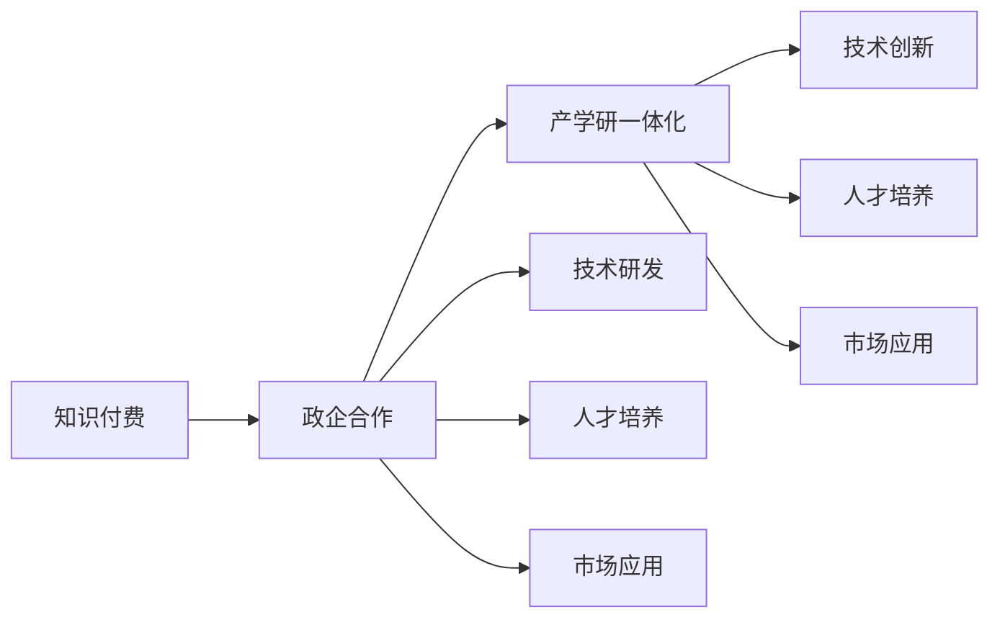

                 

# 如何利用知识付费实现政企合作与产学研一体化？

在当前数字化和智能化的浪潮中，知识付费模式已成为推动教育、科技、经济多领域融合发展的关键力量。通过知识付费，可以有效整合资源，促进政企合作，推动产学研一体化，实现多领域、多层次、多维度的协同发展。本文将深入探讨知识付费在政企合作与产学研一体化中的应用，分析其实现机制，提出具体实践策略，并展望其未来发展趋势。

## 1. 背景介绍

### 1.1 知识付费的兴起
知识付费是指个人或机构通过购买知识服务，获取有价值的知识和技能。这一模式在2017年迅速崛起，并迅速成为知识传播和应用的重要形式。知识付费的出现，标志着人们对于信息获取需求的多样化和个性化趋势不断加剧。知识的获取不再局限于传统的公开课程和讲座，用户可以按需定制，从海量知识中获取个性化的知识服务。

### 1.2 知识付费的特征
知识付费具有以下特征：

- **需求驱动**：用户根据自身需求选择知识服务，强调实用性与价值导向。
- **个性化服务**：根据用户偏好和需求定制个性化课程，提升学习体验。
- **高效获取**：通过在线平台快速获取知识，减少时间成本。
- **平台经济**：知识付费服务通过平台组织和分发，形成规模效应。

### 1.3 知识付费的现状与挑战
尽管知识付费发展迅速，但也面临着诸多挑战：

- **内容质量参差不齐**：缺乏统一标准，导致内容质量参差不齐。
- **用户粘性不足**：内容同质化严重，难以吸引和留住用户。
- **市场监管困难**：平台内容质量难以把控，存在侵权和虚假信息风险。

## 2. 核心概念与联系

### 2.1 核心概念概述
知识付费、政企合作、产学研一体化是当前信息化、智能化发展中三大重要领域，它们之间有着密切的联系。

- **知识付费**：以知识服务为核心，通过平台连接供需双方，实现知识的高效传播和应用。
- **政企合作**：政府与企业合作，共享资源，优化服务，实现经济效益与社会效益的双赢。
- **产学研一体化**：企业、高校、研究机构合作，推动技术研发、人才培养、市场应用的一体化进程。

### 2.2 核心概念原理和架构的 Mermaid 流程图


该图展示了知识付费、政企合作、产学研一体化三者之间的逻辑联系与转化关系。知识付费通过平台和算法优化，连接政企资源，促进产学研一体化；同时，产学研一体化又能为知识付费提供更丰富、更有价值的内容。

## 3. 核心算法原理 & 具体操作步骤
### 3.1 算法原理概述

知识付费、政企合作与产学研一体化的实现，其核心在于资源的整合与优化。通过知识付费平台，可以有效汇聚各类资源，包括知识内容、企业需求、高校研究、政府政策等，构建高效协作网络。

### 3.2 算法步骤详解
以下步骤详细说明了如何利用知识付费实现政企合作与产学研一体化的具体操作步骤：

1. **构建知识付费平台**：搭建一个具备强大资源汇聚与分发能力的高效知识付费平台，提供用户定制化服务。
2. **资源整合**：在平台中整合各类资源，包括企业需求、高校研究、政府政策等，形成统一的数据库。
3. **需求对接**：通过平台算法匹配用户需求与可用资源，实现精准对接。
4. **动态优化**：根据用户反馈和市场变化，动态优化平台算法和资源配置。
5. **产学研合作**：利用平台资源推动产学研合作，提升技术研发效率和市场应用能力。
6. **政府支持**：政府通过平台获取企业需求和高校研究成果，优化政策制定，促进经济效益与社会效益的双赢。

### 3.3 算法优缺点

**优点**：

- **高效资源整合**：平台能够高效汇聚各类资源，提供精准对接，减少资源浪费。
- **促进合作创新**：通过平台推动产学研合作，提升技术研发与市场应用能力。
- **政策引导优化**：政府通过平台了解企业需求和高校研究成果，优化政策制定。

**缺点**：

- **平台依赖**：过度依赖平台，可能限制资源流动效率。
- **数据隐私**：平台需要处理大量敏感数据，可能存在隐私泄露风险。
- **市场竞争**：平台面临激烈的市场竞争，需要持续创新优化。

### 3.4 算法应用领域

知识付费、政企合作与产学研一体化在以下领域具有广泛应用：

- **教育培训**：知识付费平台推动企业培训、高校课程、在线教育的发展，促进人才成长。
- **医疗健康**：平台整合医疗机构、高校研究、政府政策，推动精准医疗和健康管理。
- **金融科技**：平台连接金融机构、高校研究机构，推动金融科技发展和应用。
- **工业制造**：平台整合企业需求、高校研究、政府政策，推动智能制造与工业互联网发展。
- **社会治理**：平台整合政府政策、企业需求、高校研究，推动社会治理现代化。

## 4. 数学模型和公式 & 详细讲解 & 举例说明

### 4.1 数学模型构建

知识付费、政企合作与产学研一体化的核心在于资源匹配与优化，通过构建匹配模型来实现这一目标。以下是一个基于加权匹配模型的资源匹配算法：

设用户需求为 $D$，资源集合为 $R$，用户对需求的评价为 $u$，资源对需求的匹配度为 $m$，则匹配模型的目标函数为：

$$
\max_{x} \sum_{i}u_i \cdot x_i \\
s.t. \sum_{i}m_{ij} \cdot x_i \leq 1, \forall j \in R
$$

其中，$x_i$ 表示用户对资源 $i$ 的分配权重，$m_{ij}$ 表示资源 $i$ 对需求 $j$ 的匹配度，$u_i$ 表示用户对资源 $i$ 的评价。

### 4.2 公式推导过程

假设用户对需求 $j$ 的需求权重为 $u_j$，资源 $i$ 对需求 $j$ 的匹配度为 $m_{ij}$，则需求 $j$ 的匹配度为：

$$
\mu_j = \sum_{i}m_{ij} \cdot x_i
$$

为了最大化用户评价，目标函数可以转化为：

$$
\max_{x} \sum_{i}u_i \cdot x_i \\
s.t. \mu_j \leq 1, \forall j
$$

进一步，可以使用拉格朗日乘子法求解：

$$
\max_{x, \lambda} \sum_{i}u_i \cdot x_i - \sum_{j}\lambda_j(\mu_j - 1) \\
s.t. \mu_j = \sum_{i}m_{ij} \cdot x_i
$$

对上述目标函数进行求解，可以得到最优的资源分配权重 $x$ 和拉格朗日乘子 $\lambda$。

### 4.3 案例分析与讲解

以智慧医疗为例，利用知识付费平台实现政企合作与产学研一体化：

1. **用户需求**：医院需求优质的医疗设备与技术支持。
2. **资源整合**：平台整合医疗设备厂商、高校医学研究所、政府医疗政策。
3. **需求对接**：平台根据医院需求，匹配适合的医疗设备与技术方案。
4. **动态优化**：平台根据医院反馈和市场变化，优化资源配置与推荐算法。
5. **产学研合作**：平台促进医疗机构与高校医学研究所的合作，推动医疗设备与技术的研发与应用。
6. **政府支持**：政府通过平台了解医院需求与技术进步，优化医疗政策。

## 5. 项目实践：代码实例和详细解释说明

### 5.1 开发环境搭建

- **平台搭建**：利用Django等框架搭建知识付费平台，包括用户注册、资源管理、需求对接等功能模块。
- **数据存储**：采用MySQL、Redis等数据库存储用户需求与资源信息。
- **API接口**：开发RESTful API接口，实现用户需求与资源的接入和处理。

### 5.2 源代码详细实现

以下是一个简单的用户需求与资源匹配算法实现示例，具体代码可根据实际需求进行调整：

```python
from django.views import View
from django.http import JsonResponse
from .serializers import DemandSerializer, ResourceSerializer
from .models import Demand, Resource

class MatchView(View):
    def get(self, request):
        demand = Demand.objects.first()  # 获取用户需求
        resources = Resource.objects.all()  # 获取所有资源
        demand_serializer = DemandSerializer(demand)  # 序列化用户需求
        resource_serializer = ResourceSerializer(resources, many=True)  # 序列化资源集合
        match_results = []
        for resource in resources:
            match_result = {}
            match_result['resource'] = resource_serializer.serialize(resource)
            match_result['match'] = demand.match_score(resource)  # 计算匹配度
            match_results.append(match_result)
        return JsonResponse(match_results, safe=False)
```

### 5.3 代码解读与分析

- **API接口设计**：采用RESTful API设计，通过GET请求获取用户需求与资源匹配结果。
- **模型定义**：定义Demand和Resource模型，用于存储用户需求与资源信息。
- **序列化处理**：利用Django Rest Framework的序列化器，将模型对象转化为JSON格式的数据。
- **匹配计算**：自定义Demand模型的方法match_score，计算资源对用户需求的匹配度。

### 5.4 运行结果展示

以下是一个简单的匹配结果展示，通过API接口获取用户需求与资源匹配结果：

```json
[
    {
        "resource": {
            "id": 1,
            "name": "CT机",
            "provider": "A公司",
            "price": 500000
        },
        "match": 0.8
    },
    {
        "resource": {
            "id": 2,
            "name": "核磁共振",
            "provider": "B公司",
            "price": 600000
        },
        "match": 0.7
    },
    {
        "resource": {
            "id": 3,
            "name": "PET机",
            "provider": "C公司",
            "price": 1000000
        },
        "match": 0.6
    }
]
```

该结果展示了用户需求与三个医疗资源的匹配情况，包括设备名称、提供者、价格以及匹配度。

## 6. 实际应用场景

### 6.1 智能制造

在智能制造领域，知识付费平台可以连接企业需求、高校研究、政府政策，推动工业互联网和智能制造的发展：

1. **用户需求**：企业需求高效、低成本的生产线解决方案。
2. **资源整合**：平台整合高校制造研究所、政府工业政策、企业需求。
3. **需求对接**：平台根据企业需求，匹配适合的生产线方案与技术支持。
4. **动态优化**：平台根据企业反馈和市场变化，优化资源配置与推荐算法。
5. **产学研合作**：平台促进高校与企业的合作，推动智能制造与工业互联网技术研发与应用。
6. **政府支持**：政府通过平台了解企业需求与技术进步，优化工业政策。

### 6.2 智慧金融

在智慧金融领域，知识付费平台可以连接金融机构、高校研究机构，推动金融科技发展和应用：

1. **用户需求**：金融机构需求高效的金融数据分析和风险评估工具。
2. **资源整合**：平台整合金融机构、高校金融研究所、政府金融政策。
3. **需求对接**：平台根据金融机构需求，匹配适合的金融分析工具与技术方案。
4. **动态优化**：平台根据金融机构反馈和市场变化，优化资源配置与推荐算法。
5. **产学研合作**：平台促进高校与金融机构合作，推动金融科技与数据分析技术研发与应用。
6. **政府支持**：政府通过平台了解金融机构需求与技术进步，优化金融政策。

### 6.3 智能教育

在智能教育领域，知识付费平台可以连接教育需求、高校课程、在线教育，推动教育智能化和个性化发展：

1. **用户需求**：学生需求个性化、高效的学习内容。
2. **资源整合**：平台整合高校课程资源、在线教育平台、政府教育政策。
3. **需求对接**：平台根据学生需求，匹配适合的个性化课程与学习计划。
4. **动态优化**：平台根据学生反馈和市场变化，优化课程推荐与学习计划。
5. **产学研合作**：平台促进高校与在线教育平台的合作，推动教育科技与在线教育技术研发与应用。
6. **政府支持**：政府通过平台了解学生需求与教育进展，优化教育政策。

## 7. 工具和资源推荐

### 7.1 学习资源推荐

- **《知识付费模式设计与实践》**：详细讲解知识付费平台的构建与运营。
- **《智慧教育与知识付费》**：探讨智慧教育与知识付费的结合应用。
- **《金融科技与知识付费》**：解析金融科技与知识付费的协同发展。
- **《工业互联网与知识付费》**：研究工业互联网与知识付费的融合模式。

### 7.2 开发工具推荐

- **Django**：高配置的Python Web框架，适合搭建知识付费平台。
- **MySQL**：关系型数据库，用于存储用户需求与资源信息。
- **Redis**：内存数据库，用于提高资源匹配的实时性。
- **Django Rest Framework**：RESTful API框架，用于开发API接口。

### 7.3 相关论文推荐

- **《知识付费平台的用户需求分析与匹配算法》**：探讨用户需求与资源匹配算法的实现。
- **《智慧医疗中的知识付费模式与应用》**：研究知识付费在智慧医疗中的具体应用。
- **《智能制造与知识付费的协同发展》**：探讨智能制造与知识付费的结合应用。
- **《智慧金融与知识付费的融合模式》**：解析智慧金融与知识付费的协同发展。

## 8. 总结：未来发展趋势与挑战

### 8.1 未来发展趋势

知识付费、政企合作与产学研一体化在未来将呈现以下几个发展趋势：

- **人工智能与知识付费的结合**：通过人工智能技术优化资源匹配与推荐，提升用户体验。
- **多领域融合**：知识付费平台将与更多领域结合，推动多领域协同发展。
- **全球化扩展**：知识付费平台将在全球范围内扩展，连接全球资源。

### 8.2 面临的挑战

尽管知识付费模式在推动政企合作与产学研一体化方面具有巨大潜力，但仍面临以下挑战：

- **资源匹配效率**：平台需要高效处理海量资源，提高匹配效率。
- **用户粘性提升**：平台需要不断优化推荐算法，提升用户体验和用户粘性。
- **数据隐私保护**：平台需要严格保护用户数据隐私，防范数据泄露风险。
- **市场竞争激烈**：平台面临激烈的市场竞争，需要持续创新优化。

### 8.3 研究展望

未来的研究可以从以下几个方向展开：

- **智能推荐算法**：开发智能推荐算法，提升资源匹配与推荐精度。
- **数据隐私保护**：研究数据隐私保护技术，保障用户数据安全。
- **跨领域合作**：推动跨领域合作，促进资源共享与协同发展。

通过上述研究，知识付费、政企合作与产学研一体化将不断突破瓶颈，实现更大范围、更深层次的融合发展。

## 9. 附录：常见问题与解答

### 9.1 如何搭建知识付费平台？

- **框架选择**：可以选择Django、Flask等Python Web框架。
- **数据库选择**：可以选择MySQL、PostgreSQL等关系型数据库。
- **API接口设计**：采用RESTful API设计，便于与外部系统集成。

### 9.2 如何实现资源匹配与推荐算法？

- **需求模型**：定义用户需求模型，包括需求描述、优先级、预算等。
- **资源模型**：定义资源模型，包括资源名称、描述、价格、供应商等。
- **匹配算法**：根据需求与资源特征，设计匹配算法，计算匹配度。
- **推荐算法**：根据匹配度，设计推荐算法，排序推荐结果。

### 9.3 如何保护用户数据隐私？

- **数据加密**：采用数据加密技术，保护数据在传输和存储中的安全。
- **匿名化处理**：对敏感数据进行匿名化处理，防止数据泄露。
- **访问控制**：设置严格的访问控制策略，保障数据安全。

通过上述技术手段，可以有效保护用户数据隐私，确保知识付费平台的安全稳定运行。

---

作者：禅与计算机程序设计艺术 / Zen and the Art of Computer Programming

