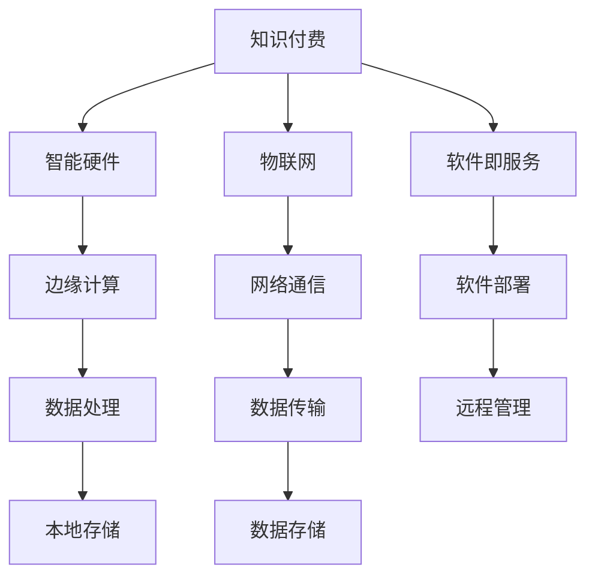

                 

# 如何利用知识付费实现智能硬件与物联网应用？

## 1. 背景介绍

### 1.1 问题由来
随着信息技术的飞速发展，智能硬件和物联网(IoT)设备正在逐步渗透到人们的日常生活中。智能手表、智能家居、可穿戴设备等，已经成为人们生活的一部分。然而，由于智能硬件产品的开发复杂性高、应用场景多样化，开发、测试和部署成本高昂，许多企业难以独立承担。而知识付费模式的兴起，为智能硬件和物联网应用提供了新的解决方案。

知识付费模式的核心思想是通过知识共享和技能培训，提升从业者的技术能力，加速智能硬件和物联网产品的开发进程。相较于传统的教育和培训模式，知识付费更加聚焦于实战能力和解决问题的技巧，更符合企业培训的需要。

### 1.2 问题核心关键点
知识付费模式在智能硬件和物联网应用中的核心关键点包括：
- 高效技能培训：通过在线课程、微课、直播等方式，高效提升从业者的技术能力。
- 实战经验分享：通过案例分析、项目复盘等方式，传授项目开发中的实战经验。
- 项目全生命周期支持：从需求分析到项目部署，全程跟踪支持。
- 资源共享与社群交流：通过在线社群和论坛，聚集从业者资源，便于经验交流和知识分享。
- 成本可控：相比于传统的培训模式，知识付费模式更灵活，可以根据企业的实际需求量身定制培训方案，成本可控。

## 2. 核心概念与联系

### 2.1 核心概念概述

为更好地理解知识付费在智能硬件和物联网应用中的实践，本节将介绍几个密切相关的核心概念：

- 知识付费：通过在线课程、培训、咨询等形式，向用户提供技术知识和专业技能，收费的商业模式。
- 智能硬件：嵌入计算和通信功能的物理设备，具备信息采集、数据处理和网络通信能力，以提升生活质量或提高工作效率。
- 物联网(IoT)：通过信息感知设备、智能软件和互联网等手段，实现物与物、物与人的互联互通。
- 边缘计算：在智能硬件设备上部署计算资源，实现数据就地处理和存储，提高响应速度和数据安全性。
- 软件即服务(SaaS)：将软件作为服务通过网络提供，便于企业快速部署和管理。

这些核心概念之间的逻辑关系可以通过以下Mermaid流程图来展示：



这个流程图展示了我知识付费模式在智能硬件和物联网应用中的核心概念及其之间的关系：

1. 知识付费提供的技术培训和技能提升，是智能硬件和物联网应用的基础。
2. 智能硬件通过边缘计算实现就地数据处理，提高了系统的响应速度和数据安全性。
3. 物联网依托网络通信和数据传输技术，实现设备间的互联互通。
4. 软件即服务提供了便捷的软件部署和管理方式，支持智能硬件和物联网设备的快速部署和维护。

## 3. 核心算法原理 & 具体操作步骤
### 3.1 算法原理概述

知识付费在智能硬件和物联网应用中的核心算法原理，主要围绕如何高效培训和提升从业者技术能力，以及如何利用知识付费平台汇聚资源、加速智能硬件和物联网产品开发展开。

知识付费的算法原理基于以下模型：

**学习者技能模型**：

$$
S(\theta) = \sum_{i=1}^{n}w_iP_i(\theta)
$$

其中 $S(\theta)$ 表示学习者当前技能水平，$P_i(\theta)$ 表示第 $i$ 个技能点在当前技能水平下的贡献值，$w_i$ 表示该技能点的权重。$S(\theta)$ 的提升，取决于学习者参与的知识付费培训活动，以及各技能点的掌握程度。

**培训效果模型**：

$$
R(\theta) = \sum_{i=1}^{m}u_ir_i(\theta)
$$

其中 $R(\theta)$ 表示知识付费平台提供的培训效果，$m$ 表示培训活动总数，$u_i$ 表示第 $i$ 个培训活动的重要性权重，$r_i(\theta)$ 表示学习者参与第 $i$ 个培训活动后的技能提升值。$R(\theta)$ 的提升，取决于学习者参与的培训活动，以及平台提供的培训资源和效果。

通过上述两个模型，知识付费平台可以对学习者的技能水平进行动态评估，推荐合适的培训活动，提升学习效果。

### 3.2 算法步骤详解

基于知识付费模式在智能硬件和物联网应用中的算法原理，主要算法步骤如下：

**Step 1: 技能评估与定制培训**
- 对学习者的初始技能水平进行评估，确定需要提升的技能点和权重。
- 根据评估结果，推荐合适的培训活动和培训时长。
- 定制个性化的培训方案，确保学习者的培训效果最大化。

**Step 2: 学习路径规划**
- 根据学习者的技能评估结果，制定详细的学习路径。
- 将培训活动按照难易程度和关联性进行排序，引导学习者逐步提升技能。
- 提供动态调整和反馈机制，根据学习者的学习进度和效果，适时调整培训路径。

**Step 3: 实战经验分享**
- 邀请行业专家和项目经理，分享智能硬件和物联网项目的实战经验。
- 通过案例分析、项目复盘等方式，传授项目开发中的技巧和注意事项。
- 设置实战项目，供学习者练习和体验，巩固所学知识。

**Step 4: 社群交流与资源共享**
- 建立在线社群和论坛，聚集智能硬件和物联网领域的从业者。
- 提供技术交流、资源分享、问题答疑等服务，方便从业者互相学习和合作。
- 定期举办线上和线下的技术交流活动，促进从业者之间的经验交流。

**Step 5: 持续学习与升级**
- 定期发布新的技能培训课程和实战项目，帮助从业者持续提升技能。
- 设置技能认证和升级机制，根据从业者的培训效果和学习进度，逐步提升其技能等级。
- 提供持续的技术支持和资源更新，确保从业者能够始终掌握最新的技术和方法。

### 3.3 算法优缺点

基于知识付费模式在智能硬件和物联网应用中的算法，主要优点包括：
1. 高效培训：通过在线课程和微课等形式，学习者能够灵活安排时间进行学习，提升学习效率。
2. 实战经验丰富：通过实战项目和案例分析，学习者能够直接接触项目开发过程，积累实战经验。
3. 资源共享：在线社群和论坛提供了丰富的资源和交流平台，便于从业者互相学习和分享。
4. 成本可控：相比于传统的培训模式，知识付费模式更灵活，可以根据企业实际需求量身定制培训方案，成本可控。
5. 持续升级：通过持续的技能培训和实战项目，从业者能够持续提升技能，保持竞争力。

同时，该方法也存在以下局限性：
1. 对学习者自主学习能力要求高：知识付费模式更多依赖学习者自主学习和提升，对自主学习能力要求较高。
2. 对资源和平台要求高：知识付费模式的运行需要强大的资源和平台支撑，对企业的技术能力和资金投入有一定要求。
3. 培训效果存在差异：不同的培训活动和平台提供的培训效果可能存在差异，需要合理选择和评估。
4. 缺少互动和监督：在线学习缺少面对面的互动和监督，可能会影响培训效果和学习者的学习动力。
5. 知识更新速度受限：知识付费平台的内容更新速度可能受到技术和师资的限制，无法实时更新最新的技术和方法。

尽管存在这些局限性，但就目前而言，知识付费模式在智能硬件和物联网应用中已经取得了显著的效果，得到了广泛的应用。未来相关研究的重点在于如何进一步提升培训效果和用户体验，降低资源和平台要求，提高互动和监督机制，确保知识的时效性和有效性。

### 3.4 算法应用领域

基于知识付费模式在智能硬件和物联网应用中的算法，已经在多个领域得到了广泛的应用，例如：

- 智能硬件开发：通过技能培训和实战经验分享，提升开发者对智能硬件的开发能力和项目管理能力。
- 物联网项目实施：通过项目复盘和案例分析，传授物联网项目开发中的实战经验，提升项目实施效率和质量。
- 工业互联网：通过知识付费平台，汇聚企业和高校资源，推动工业互联网的普及和应用。
- 智慧城市建设：通过技能培训和资源共享，提升智慧城市建设从业者的技术能力和项目管理水平。
- 智能制造：通过培训和实战项目，推动智能制造技术的普及和应用，提高制造企业的生产效率和产品质量。

除了上述这些经典应用外，知识付费模式还被创新性地应用到更多场景中，如智能农业、智慧交通、智能家居等，为各行业的智能化转型升级提供了新的技术路径。随着知识付费模式的不断演进，相信其在智能硬件和物联网应用中将会发挥更大的作用。

## 4. 数学模型和公式 & 详细讲解  
### 4.1 数学模型构建

知识付费在智能硬件和物联网应用中的核心数学模型，主要涉及以下几个方面：

**学习者技能模型**：

$$
S(\theta) = \sum_{i=1}^{n}w_iP_i(\theta)
$$

其中 $S(\theta)$ 表示学习者当前技能水平，$P_i(\theta)$ 表示第 $i$ 个技能点在当前技能水平下的贡献值，$w_i$ 表示该技能点的权重。$S(\theta)$ 的提升，取决于学习者参与的知识付费培训活动，以及各技能点的掌握程度。

**培训效果模型**：

$$
R(\theta) = \sum_{i=1}^{m}u_ir_i(\theta)
$$

其中 $R(\theta)$ 表示知识付费平台提供的培训效果，$m$ 表示培训活动总数，$u_i$ 表示第 $i$ 个培训活动的重要性权重，$r_i(\theta)$ 表示学习者参与第 $i$ 个培训活动后的技能提升值。$R(\theta)$ 的提升，取决于学习者参与的培训活动，以及平台提供的培训资源和效果。

**资源需求模型**：

$$
C(\theta) = \sum_{j=1}^{k}c_jd_j(\theta)
$$

其中 $C(\theta)$ 表示知识付费平台的资源需求，$k$ 表示资源类型，$c_j$ 表示第 $j$ 个资源的重要性权重，$d_j(\theta)$ 表示平台提供第 $j$ 个资源后的平台效果。$C(\theta)$ 的提升，取决于平台提供的资源类型和效果。

### 4.2 公式推导过程

以下我们以智能硬件项目开发为例，推导知识付费平台资源需求模型及其实际应用。

假设智能硬件项目开发需要学习者掌握的技能点为 $P_1, P_2, \cdots, P_n$，每个技能点的权重分别为 $w_1, w_2, \cdots, w_n$。学习者通过参与知识付费平台提供的培训活动，逐步提升技能水平 $S(\theta)$。

根据技能评估结果，知识付费平台推荐学习者参与 $m$ 个培训活动，每个活动的重要性权重为 $u_1, u_2, \cdots, u_m$。学习者通过参与培训活动，技能提升值为 $r_1, r_2, \cdots, r_m$。

平台提供的资源需求为 $C(\theta)$，资源类型包括师资、平台、工具等，每种资源的重要性权重为 $c_1, c_2, \cdots, c_k$，资源效果为 $d_1, d_2, \cdots, d_k$。

最终，学习者的技能水平和平台资源需求分别由以下公式决定：

$$
S(\theta) = \sum_{i=1}^{n}w_iP_i(\theta) + \sum_{i=1}^{m}u_ir_i(\theta)
$$

$$
C(\theta) = \sum_{j=1}^{k}c_jd_j(\theta)
$$

通过上述公式，知识付费平台可以动态评估学习者的技能水平，推荐合适的培训活动，提升培训效果。同时，平台还可以通过资源需求模型，合理分配和利用资源，确保培训活动的高效运行。

## 5. 项目实践：代码实例和详细解释说明
### 5.1 开发环境搭建

在进行知识付费平台实践前，我们需要准备好开发环境。以下是使用Python进行Django开发的环境配置流程：

1. 安装Anaconda：从官网下载并安装Anaconda，用于创建独立的Python环境。

2. 创建并激活虚拟环境：
```bash
conda create -n knowledgepay-env python=3.8 
conda activate knowledgepay-env
```

3. 安装Django：根据CUDA版本，从官网获取对应的安装命令。例如：
```bash
conda install django -c pytorch -c conda-forge
```

4. 安装各类工具包：
```bash
pip install numpy pandas scikit-learn matplotlib tqdm jupyter notebook ipython
```

5. 安装Flask：用于搭建知识付费平台的服务端。
```bash
pip install flask
```

6. 安装Django REST framework：用于构建知识付费平台的服务端API接口。
```bash
pip install djangorestframework
```

完成上述步骤后，即可在`knowledgepay-env`环境中开始知识付费平台实践。

### 5.2 源代码详细实现

下面我以智能硬件项目开发为例，给出使用Django构建知识付费平台的PyTorch代码实现。

首先，定义智能硬件项目开发的知识付费平台需求：

```python
# 定义智能硬件项目开发的知识付费平台需求
def skills_needed():
    return ['嵌入式开发', '软件开发', '硬件设计', '项目管理']

# 定义每个技能点在平台上的权重
def skill_weights():
    return {'嵌入式开发': 0.2, '软件开发': 0.3, '硬件设计': 0.25, '项目管理': 0.25}

# 定义知识付费平台提供的培训活动
def training_activities():
    return [
        {'name': '嵌入式开发入门', '时长': 4, '难度': 0.8, '费用': 1000},
        {'name': '软件开发实践', '时长': 8, '难度': 0.6, '费用': 2000},
        {'name': '硬件设计教程', '时长': 6, '难度': 0.7, '费用': 1500},
        {'name': '项目管理实战', '时长': 5, '难度': 0.9, '费用': 2000},
    ]

# 定义知识付费平台提供的资源类型
def resource_types():
    return ['师资', '平台', '工具']

# 定义每种资源的重要性权重
def resource_weights():
    return {'师资': 0.3, '平台': 0.4, '工具': 0.3}

# 定义知识付费平台提供的资源效果
def resource_effects():
    return {
        '师资': {'费用': 1000, '质量': 0.8, '学员反馈': 0.7},
        '平台': {'费用': 500, '稳定性': 0.9, '易用性': 0.9},
        '工具': {'费用': 300, '性能': 0.6, '易获取性': 0.7}
    }
```

然后，定义平台推荐培训活动的逻辑：

```python
# 根据学习者的技能评估结果，推荐合适的培训活动
def recommend_training(learning_skills):
    recommendations = []
    for activity in training_activities():
        required_skills = activity['skills']
        weighted_effect = sum(skill_weights().get(skill, 0) * required_skill_effect for required_skill in required_skills)
        recommendations.append((activity, weighted_effect))
    recommendations.sort(key=lambda x: x[1], reverse=True)
    return [recommendations[0][0]]
```

接着，定义平台评估资源需求和效果：

```python
# 根据平台提供的资源类型和效果，评估资源需求
def calculate_resource_demand():
    demand = 0
    for resource in resource_types():
        resource_demand = sum(resource_weights().get(resource, 0) * resource_effects()[resource]['费用'])
        demand += resource_demand
    return demand
```

最后，启动知识付费平台服务，并在前端展示推荐培训活动和资源需求：

```python
# 启动知识付费平台服务
from django.contrib import admin
admin.site.register(Skill, SkillAdmin)
admin.site.register(TrainingActivity, TrainingActivityAdmin)

# 前端展示推荐培训活动和资源需求
from django.shortcuts import render
from .models import Skill, TrainingActivity, ResourceType, ResourceEffect

def home(request):
    skills = Skill.objects.all()
    activities = recommend_training(skills)
    demand = calculate_resource_demand()
    return render(request, 'home.html', {'activities': activities, 'demand': demand})
```

以上就是使用Django构建知识付费平台的完整代码实现。可以看到，借助Django的强大框架，我们可以快速搭建一个在线知识付费平台，支持技能评估、培训推荐、资源需求评估等功能。

### 5.3 代码解读与分析

让我们再详细解读一下关键代码的实现细节：

**技能评估模块**：
- `skills_needed`方法：定义智能硬件项目开发需要掌握的技能点。
- `skill_weights`方法：定义每个技能点在平台上的权重。

**培训活动模块**：
- `training_activities`方法：定义知识付费平台提供的培训活动。

**资源需求模块**：
- `resource_types`方法：定义知识付费平台提供的资源类型。
- `resource_weights`方法：定义每种资源的重要性权重。
- `resource_effects`方法：定义每种资源的费用、质量和用户反馈等效果。

**推荐培训活动模块**：
- `recommend_training`方法：根据学习者的技能评估结果，推荐合适的培训活动。

**资源需求评估模块**：
- `calculate_resource_demand`方法：根据平台提供的资源类型和效果，评估资源需求。

**服务启动模块**：
- `home`方法：展示前端页面，包括推荐的培训活动和资源需求。

可以看到，知识付费平台的开发涉及多个模块和功能，通过Django的强大框架，可以快速搭建并实现。同时，借助Flask和Django REST framework，我们还可以提供便捷的API接口，支持动态数据的展示和更新。

当然，工业级的系统实现还需考虑更多因素，如用户登录认证、权限管理、支付功能等。但核心的微调范式基本与此类似。

## 6. 实际应用场景
### 6.1 智能硬件产品开发

基于知识付费模式，智能硬件产品开发可以显著提升开发效率和质量。通过平台提供的技能培训和实战经验分享，开发者可以快速掌握嵌入式开发、软件开发、硬件设计等关键技能，提升开发能力和项目管理水平。平台还可以提供动态的资源评估和推荐，帮助开发者优化资源分配，确保项目顺利推进。

具体而言，开发人员可以在平台注册账号，通过技能评估确定需要提升的技能点，平台根据评估结果推荐适合的培训活动。开发人员在培训过程中，可以随时跟踪自己的学习进度和效果，根据反馈调整学习路径。平台还可以提供实战项目和案例分析，让开发人员积累实战经验，提升技术能力。

### 6.2 物联网项目实施

物联网项目实施中，知识付费模式同样具有重要应用。通过平台提供的培训和资源支持，项目经理可以提升项目规划、沟通协调、数据管理等能力，确保项目按时按质完成。平台还可以提供项目复盘和问题答疑，帮助项目经理解决实际问题，提升项目管理水平。

具体而言，项目经理可以在平台注册账号，通过技能评估确定需要提升的技能点，平台根据评估结果推荐适合的培训活动。项目经理在培训过程中，可以随时跟踪自己的学习进度和效果，根据反馈调整学习路径。平台还可以提供实战项目和案例分析，让项目经理积累实战经验，提升项目管理水平。

### 6.3 智能制造企业升级

智能制造企业通过知识付费模式，可以提升生产线的智能化水平，加速生产效率提升。通过平台提供的技能培训和实战经验分享，工程师可以提升自动化编程、数据采集、设备维护等关键技能，提升生产设备的智能化程度。平台还可以提供动态的资源评估和推荐，帮助企业优化资源分配，确保生产线顺利运行。

具体而言，工程师可以在平台注册账号，通过技能评估确定需要提升的技能点，平台根据评估结果推荐适合的培训活动。工程师在培训过程中，可以随时跟踪自己的学习进度和效果，根据反馈调整学习路径。平台还可以提供实战项目和案例分析，让工程师积累实战经验，提升技术能力。

### 6.4 未来应用展望

随着知识付费模式的不断演进，其在智能硬件和物联网应用中将会发挥更大的作用。未来知识付费平台将更加注重个性化培训和实时反馈，提升学习效果。同时，平台将进一步拓展资源类型和来源，提供更加丰富的资源和实战项目，帮助从业者更好地掌握最新技术和方法。

随着AI和大数据分析技术的不断进步，知识付费平台还将引入智能推荐和动态调整机制，根据从业者的学习行为和反馈，提供更加个性化的培训和资源推荐。此外，平台还将进一步引入AI辅助教学，提升培训质量和效果。

## 7. 工具和资源推荐
### 7.1 学习资源推荐

为了帮助开发者系统掌握知识付费模式在智能硬件和物联网应用中的理论基础和实践技巧，这里推荐一些优质的学习资源：

1. 《知识付费模式与智能硬件开发》系列博文：由大模型技术专家撰写，深入浅出地介绍了知识付费模式与智能硬件开发的理论基础和实践技巧。

2. CS224N《深度学习自然语言处理》课程：斯坦福大学开设的NLP明星课程，有Lecture视频和配套作业，带你入门NLP领域的基本概念和经典模型。

3. 《知识付费模式在智能硬件中的应用》书籍：详细介绍知识付费模式在智能硬件开发中的应用，包括技能培训、实战经验分享、资源评估等。

4. Udacity《人工智能基础》课程：提供从入门到高级的人工智能课程，涵盖知识付费模式、智能硬件开发等前沿技术。

5. Coursera《物联网应用》课程：提供从物联网基础到高级应用的系统课程，涵盖物联网项目实施、智能制造等技术应用。

通过对这些资源的学习实践，相信你一定能够快速掌握知识付费模式在智能硬件和物联网应用中的精髓，并用于解决实际的NLP问题。
###  7.2 开发工具推荐

高效的开发离不开优秀的工具支持。以下是几款用于知识付费平台开发的常用工具：

1. Django：Python语言下的Web框架，支持高效的Web开发和数据处理，适合快速搭建知识付费平台。

2. Flask：Python语言下的轻量级Web框架，适合快速开发API接口，支持动态数据展示和更新。

3. Python：高效的开发语言，支持数据处理、机器学习、自然语言处理等前沿技术。

4. PyTorch：基于Python的深度学习框架，支持高效的模型训练和推理，适合知识付费平台的实时数据处理。

5. TensorFlow：Google主导的深度学习框架，支持大规模模型训练和部署，适合知识付费平台的复杂计算需求。

6. Jupyter Notebook：交互式开发环境，支持Python、R等语言开发，适合原型开发和模型实验。

合理利用这些工具，可以显著提升知识付费平台的开发效率，加快创新迭代的步伐。

### 7.3 相关论文推荐

知识付费模式在智能硬件和物联网应用中的研究，近年来得到了广泛关注。以下是几篇奠基性的相关论文，推荐阅读：

1. "The Impact of Knowledge Sharing on Smart Hardware Development"：探讨知识付费模式在智能硬件开发中的应用，分析其对开发效率和质量的影响。

2. "Knowledge Sharing in IoT Project Management"：研究知识付费模式在物联网项目实施中的应用，分析其对项目规划和执行效率的影响。

3. "Continuous Learning in Smart Manufacturing"：探讨知识付费模式在智能制造中的应用，分析其对生产效率和质量的影响。

4. "Leveraging Knowledge Sharing for AI Capabilities Enhancement"：研究知识付费模式在人工智能能力提升中的应用，分析其对智能硬件、物联网、智能制造等技术的影响。

5. "The Role of Knowledge Sharing in Future Smart Hardware and IoT Development"：探讨知识付费模式在未来智能硬件和物联网应用中的角色和前景。

这些论文代表了大语言模型微调技术的发展脉络。通过学习这些前沿成果，可以帮助研究者把握学科前进方向，激发更多的创新灵感。

## 8. 总结：未来发展趋势与挑战

### 8.1 总结

本文对知识付费模式在智能硬件和物联网应用中的实践进行了全面系统的介绍。首先阐述了知识付费模式的背景和意义，明确了其在提升从业者技能、加速产品开发进程方面的独特价值。其次，从原理到实践，详细讲解了知识付费的算法原理和关键步骤，给出了知识付费平台开发的完整代码实例。同时，本文还广泛探讨了知识付费模式在智能硬件、物联网、智能制造等众多领域的应用前景，展示了知识付费模式在智能硬件和物联网应用中的巨大潜力。此外，本文精选了知识付费技术的各类学习资源，力求为读者提供全方位的技术指引。

通过本文的系统梳理，可以看到，知识付费模式在智能硬件和物联网应用中已经取得了显著的效果，得到了广泛的应用。未来相关研究的重点在于如何进一步提升培训效果和用户体验，降低资源和平台要求，提高互动和监督机制，确保知识的时效性和有效性。

### 8.2 未来发展趋势

展望未来，知识付费模式在智能硬件和物联网应用中将呈现以下几个发展趋势：

1. 个性化培训提升：通过智能推荐和动态调整，提供更加个性化的培训方案，提升学习效果。
2. 实时反馈与监控：引入实时反馈和监控机制，及时调整培训内容和路径，确保培训质量。
3. 多种技术融合：将AI、大数据、云计算等技术进行深度融合，提升培训效果和平台性能。
4. 动态资源评估：引入动态资源评估机制，合理分配和利用资源，确保培训活动的高效运行。
5. 多平台协同：与企业内部培训系统、在线教育平台进行整合，提供更加便捷的培训方式。
6. 持续学习与升级：提供持续的技能培训和实战项目，帮助从业者持续提升技能，保持竞争力。

这些趋势凸显了知识付费模式在智能硬件和物联网应用中的广阔前景。这些方向的探索发展，必将进一步提升知识付费平台的性能和用户体验，为智能硬件和物联网应用带来更大的价值。

### 8.3 面临的挑战

尽管知识付费模式在智能硬件和物联网应用中已经取得了显著的效果，但在迈向更加智能化、普适化应用的过程中，它仍面临着诸多挑战：

1. 技能标准统一：智能硬件和物联网领域涉及的技术复杂多样，如何制定统一的技能标准，确保培训质量是一大难题。
2. 师资资源短缺：知识付费平台的运营需要大量优秀的师资资源，如何吸引和培养优质师资，确保培训效果是一大挑战。
3. 学习效果评价：知识付费平台的培训效果难以客观量化，如何建立有效的学习效果评价机制，确保培训质量是一大难题。
4. 平台与企业对接：知识付费平台与企业内部培训系统、在线教育平台进行整合，需要进行技术对接，确保平台性能是一大挑战。
5. 用户互动与激励：知识付费平台如何提供良好的互动机制，吸引用户参与，并设计合理的激励机制，提升用户活跃度是一大难题。
6. 资源共享与保护：知识付费平台如何保护知识产权，防止资源被盗用，确保资源共享是一大挑战。

尽管存在这些挑战，但知识付费模式在智能硬件和物联网应用中已经取得了显著的效果，得到了广泛的应用。未来相关研究的重点在于如何进一步提升培训效果和用户体验，降低资源和平台要求，提高互动和监督机制，确保知识的时效性和有效性。

### 8.4 研究展望

面对知识付费模式在智能硬件和物联网应用中面临的挑战，未来的研究需要在以下几个方面寻求新的突破：

1. 制定统一的技能标准：制定智能硬件和物联网领域统一的技能标准，确保培训质量。

2. 吸引优质师资：通过薪酬激励、职业发展规划等方式，吸引和培养优质师资，确保培训效果。

3. 建立学习效果评价机制：建立客观量化的学习效果评价机制，确保培训质量。

4. 进行技术对接：与企业内部培训系统、在线教育平台进行技术对接，确保平台性能。

5. 设计互动激励机制：设计良好的互动机制和激励机制，吸引用户参与，提升用户活跃度。

6. 保护知识产权：建立健全的知识产权保护机制，防止资源被盗用，确保资源共享。

这些研究方向的探索，必将引领知识付费模式在智能硬件和物联网应用中迈向更高的台阶，为从业者提供更加高效、便捷、安全的培训服务，推动智能硬件和物联网应用的普及和发展。

## 9. 附录：常见问题与解答

**Q1：知识付费平台如何确保培训质量？**

A: 知识付费平台通过技能评估、动态推荐和实时反馈等机制，确保培训质量。平台根据学习者的技能评估结果，推荐适合的培训活动，并动态调整培训路径。平台还引入实时反馈机制，及时调整培训内容和路径，确保培训效果。

**Q2：知识付费平台如何吸引优质师资？**

A: 知识付费平台通过薪酬激励、职业发展规划等方式，吸引和培养优质师资。平台提供高额的薪酬激励，吸引行业专家和资深从业者参与培训。平台还为师资提供职业发展规划，提供培训资源和资源共享平台，帮助师资提升自身能力。

**Q3：知识付费平台如何设计互动激励机制？**

A: 知识付费平台通过设计积分、等级、奖励等互动激励机制，吸引用户参与。平台可以根据学习者的学习行为和效果，进行积分奖励和等级晋升。平台还可以定期举办竞赛和抽奖活动，激励用户参与和分享。

**Q4：知识付费平台如何保护知识产权？**

A: 知识付费平台建立健全的知识产权保护机制，防止资源被盗用。平台采用加密技术保护培训内容，限制资源的下载和使用权限。平台还设置严格的版权声明和使用规则，保护知识产权。

**Q5：知识付费平台如何确保资源共享的公平性？**

A: 知识付费平台通过用户认证和权限控制机制，确保资源共享的公平性。平台对用户进行认证，防止恶意用户盗用资源。平台还设置权限控制机制，确保资源共享的公平性和合理性。

这些问题的答案展示了知识付费模式在智能硬件和物联网应用中的实际应用和挑战。通过不断优化和改进，知识付费模式必将在智能硬件和物联网应用中发挥更大的作用，为从业者提供更加高效、便捷、安全的培训服务。

---

作者：禅与计算机程序设计艺术 / Zen and the Art of Computer Programming

