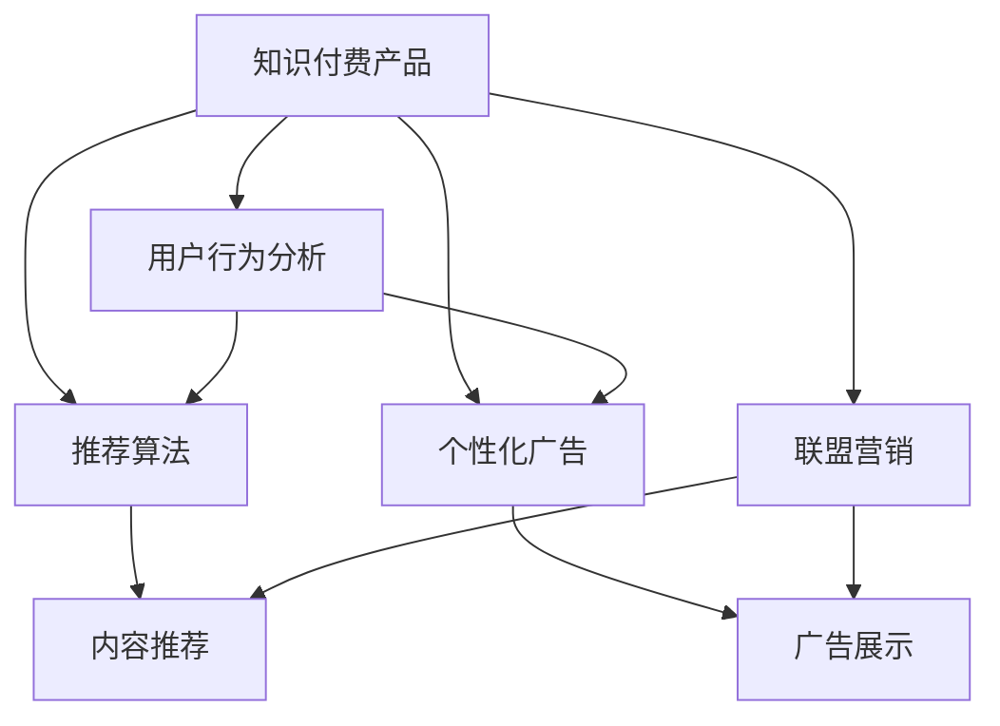

                 

# 如何利用联盟营销推广知识付费产品

> 关键词：知识付费,联盟营销,用户行为分析,推荐算法,个性化广告

## 1. 背景介绍

在数字化时代，知识付费已成为人们获取专业知识和技能的重要渠道。然而，知识付费产品的推广依然面临诸多挑战，如用户获取成本高、付费意愿低、用户体验差等。近年来，联盟营销作为一种新型的推广方式，通过“用户推荐用户”的机制，正在改变这一现状。本文将探讨如何利用联盟营销技术，高效推广知识付费产品，提升用户参与度和转化率。

## 2. 核心概念与联系

### 2.1 核心概念概述

为更好地理解联盟营销在知识付费产品推广中的应用，本节将介绍几个密切相关的核心概念：

- **知识付费产品**：指基于互联网，提供专业课程、书籍、研究报告等付费内容，满足用户学习和技能提升需求的产品。常见的知识付费平台包括Coursera、Udemy、得到等。
- **联盟营销**：指通过网络平台上的合作伙伴（联盟成员），利用其资源推广产品，给予一定比例佣金的方式。联盟成员可以是个人、网站、社群等。
- **用户行为分析**：指通过数据分析工具和技术，挖掘用户行为数据，预测用户需求和购买意向，从而优化产品推广策略。
- **推荐算法**：指利用机器学习、深度学习等技术，自动推荐用户可能感兴趣的商品或内容，提升用户体验和转化率。
- **个性化广告**：指根据用户行为和偏好，定制个性化的广告内容，提升广告点击率和转化率。

这些概念之间的逻辑关系可以通过以下Mermaid流程图来展示：



这个流程图展示了这个系统的核心概念及其之间的关系：

1. 知识付费产品通过用户行为分析，了解用户兴趣和需求。
2. 基于用户行为分析结果，推荐算法生成个性化推荐内容。
3. 根据个性化推荐结果，生成个性化广告。
4. 联盟营销通过合作伙伴推广知识付费产品，给予佣金激励。
5. 联盟营销过程中，引入个性化推荐和广告，提升推广效果。

这些概念共同构成了知识付费产品推广的系统框架，使得联盟营销可以更精准、更高效地推广产品。

## 3. 核心算法原理 & 具体操作步骤

### 3.1 算法原理概述

基于联盟营销的知识付费产品推广，其核心算法原理如下：

**Step 1: 用户行为数据采集**
- 收集用户行为数据，包括但不限于浏览记录、搜索历史、购买记录、评价反馈等。
- 使用数据分析工具（如Google Analytics、Mixpanel）进行数据清洗和预处理，生成格式统一的向量表示。

**Step 2: 用户行为建模**
- 利用机器学习算法（如协同过滤、深度学习）构建用户兴趣模型。
- 通过用户与内容、广告的互动数据，学习用户对不同内容、广告的偏好，形成用户行为特征向量。

**Step 3: 个性化推荐**
- 基于用户兴趣模型，生成个性化推荐内容。
- 使用推荐算法（如基于用户的协同过滤、基于内容的协同过滤、矩阵分解等）计算用户与内容的相似度。
- 根据相似度排序，生成个性化推荐列表。

**Step 4: 个性化广告生成**
- 根据个性化推荐结果，生成个性化广告内容。
- 使用文本生成技术（如BERT、GPT）自动生成广告文案。
- 设计个性化广告模板，使用广告内容进行替换。

**Step 5: 联盟营销推广**
- 选择适合的联盟成员，进行推广合作。
- 将个性化推荐和广告内容推送给联盟成员。
- 记录联盟成员推广效果，给予相应佣金。

### 3.2 算法步骤详解

以下是详细的算法步骤：

**Step 1: 用户行为数据采集**

具体步骤如下：

1. 使用数据采集工具（如Logback、Fluentd）记录用户行为数据。
2. 将行为数据存储在数据库（如MySQL、Redis）中。
3. 使用数据清洗工具（如Apache Kafka、Apache Flink）进行数据清洗和预处理。
4. 生成格式统一的向量表示，用于后续建模。

**Step 2: 用户行为建模**

具体步骤如下：

1. 使用机器学习算法（如LightFM、XGBoost）构建用户兴趣模型。
2. 通过用户与内容、广告的互动数据，学习用户对不同内容、广告的偏好。
3. 形成用户行为特征向量，用于个性化推荐和广告生成。

**Step 3: 个性化推荐**

具体步骤如下：

1. 使用协同过滤算法（如基于用户的协同过滤、基于内容的协同过滤）计算用户与内容的相似度。
2. 根据相似度排序，生成个性化推荐列表。
3. 使用推荐系统（如Amazon Personalize、Alimama推荐引擎）生成推荐结果。

**Step 4: 个性化广告生成**

具体步骤如下：

1. 使用文本生成技术（如BERT、GPT）自动生成广告文案。
2. 设计个性化广告模板，使用广告内容进行替换。
3. 生成最终的个性化广告内容。

**Step 5: 联盟营销推广**

具体步骤如下：

1. 选择适合的联盟成员，进行推广合作。
2. 将个性化推荐和广告内容推送给联盟成员。
3. 记录联盟成员推广效果，给予相应佣金。

### 3.3 算法优缺点

基于联盟营销的知识付费产品推广，具有以下优点：

1. 低成本高效推广：联盟营销利用用户推荐用户的方式，降低推广成本，提升推广效率。
2. 提升用户体验：通过个性化推荐和广告，提升用户粘性和满意度。
3. 优化内容供给：联盟营销可以反向验证内容质量，优化内容供给，提升产品竞争力。

同时，该方法也存在一定的局限性：

1. 联盟成员的合作意愿和能力会影响推广效果。
2. 联盟营销的规则设计需要慎重考虑，避免影响用户体验。
3. 推广过程中可能存在不实推广信息，影响平台信誉。

尽管存在这些局限性，但就目前而言，联盟营销仍是一种高效的知识付费产品推广方式。未来相关研究的重点在于如何进一步优化联盟成员选择和管理机制，提高推广效果和用户满意度。

### 3.4 算法应用领域

基于联盟营销的知识付费产品推广，已经在多个领域得到了广泛应用，例如：

- 在线教育平台：Coursera、Udemy、得到等，通过用户推荐用户，提高课程注册率和完成率。
- 企业培训市场：利用联盟营销推广企业内训课程，提升员工技能。
- 知识社区：知乎、CSDN等，通过社区成员推荐，推广高质量文章和课程。

除了上述这些经典领域外，联盟营销还被创新性地应用到更多场景中，如线上书城、电子书销售、在线咨询等，为知识付费产品带来了新的推广思路。随着联盟营销技术的不断进步，相信知识付费产品必将在更广阔的应用领域获得更大的市场份额。

## 4. 数学模型和公式 & 详细讲解 & 举例说明

### 4.1 数学模型构建

本节将使用数学语言对基于联盟营销的知识付费产品推广过程进行更加严格的刻画。

设用户行为数据集为 $D=\{(x_i,y_i)\}_{i=1}^N$，其中 $x_i$ 为用户行为特征向量， $y_i$ 为行为标签（如点击、购买、收藏等）。

定义用户兴趣模型为 $\hat{p}(y|x;\theta)$，其中 $\theta$ 为模型参数。模型的最大似然函数为：

$$
\mathcal{L}(\theta) = \frac{1}{N}\sum_{i=1}^N \log \hat{p}(y_i|x_i;\theta)
$$

通过最大化似然函数，可以学习到最优的模型参数 $\theta$。

### 4.2 公式推导过程

以下是详细的公式推导过程：

**用户行为建模**

- 假设用户兴趣模型为 $\hat{p}(y|x;\theta)$，通过最大化似然函数求得最优参数 $\theta$。

$$
\theta = \mathop{\arg\max}_{\theta} \mathcal{L}(\theta) = \mathop{\arg\max}_{\theta} \frac{1}{N}\sum_{i=1}^N \log \hat{p}(y_i|x_i;\theta)
$$

**个性化推荐**

- 假设推荐算法使用协同过滤算法，用户 $u$ 对内容 $c$ 的相似度为 $s_{uc}$。

$$
s_{uc} = \frac{\sum_{i=1}^N a_{ui}a_{ic}}{\sqrt{\sum_{i=1}^N a_{ui}^2} \sqrt{\sum_{i=1}^N a_{ic}^2}}
$$

其中 $a_{ui}$ 为用户 $u$ 对内容 $i$ 的评分，可以通过统计用户对内容的点击、购买、收藏等行为生成。

- 根据相似度排序，生成个性化推荐列表。

$$
\text{推荐列表} = \{c_{rank1}, c_{rank2}, \cdots, c_{rankk}\}
$$

**个性化广告生成**

- 假设广告文案自动生成的模型为 $f_{ad}(x;\theta)$，其中 $x$ 为广告特征向量。

$$
f_{ad}(x;\theta) = \hat{p}(ad|x;\theta)
$$

其中 $\hat{p}(ad|x;\theta)$ 为广告文案生成的概率分布。

- 根据个性化推荐结果，生成个性化广告内容。

$$
\text{广告内容} = f_{ad}(\text{推荐列表};\theta)
$$

### 4.3 案例分析与讲解

以下通过一个具体案例，展示联盟营销在知识付费产品推广中的应用。

假设某在线教育平台推广一门“Python编程”课程，联盟成员为知乎上的技术大V。

**用户行为数据采集**

- 收集知乎用户对相关文章的点赞、评论、分享等行为数据。
- 使用数据清洗工具进行数据预处理，生成用户行为特征向量。

**用户行为建模**

- 使用LightFM算法构建用户兴趣模型，学习用户对“Python编程”课程的兴趣。
- 通过用户与课程的互动数据，学习用户对不同课程的偏好。

**个性化推荐**

- 使用协同过滤算法，计算用户与课程的相似度。
- 根据相似度排序，生成个性化推荐列表。

**个性化广告生成**

- 使用GPT生成课程广告文案，如“Python编程，让编程成为你的第二语言！”。
- 设计广告模板，如“Python编程课程”。
- 生成最终的个性化广告内容。

**联盟营销推广**

- 选择适合的知乎技术大V进行推广合作。
- 将个性化推荐和广告内容推送给联盟成员。
- 记录联盟成员推广效果，给予相应佣金。

以上案例展示了基于联盟营销的知识付费产品推广的完整流程。通过用户行为分析、个性化推荐和广告生成等技术，实现了高效的知识付费产品推广。

## 5. 项目实践：代码实例和详细解释说明

### 5.1 开发环境搭建

在进行项目实践前，我们需要准备好开发环境。以下是使用Python进行Pandas、Scikit-learn、PyTorch开发的环境配置流程：

1. 安装Anaconda：从官网下载并安装Anaconda，用于创建独立的Python环境。

2. 创建并激活虚拟环境：
```bash
conda create -n pytorch-env python=3.8 
conda activate pytorch-env
```

3. 安装Pandas、Scikit-learn、PyTorch：
```bash
conda install pandas scikit-learn pytorch torchvision torchaudio cudatoolkit=11.1 -c pytorch -c conda-forge
```

4. 安装机器学习算法库：
```bash
pip install lightfm xgboost dill
```

5. 安装文本生成库：
```bash
pip install transformers
```

完成上述步骤后，即可在`pytorch-env`环境中开始项目实践。

### 5.2 源代码详细实现

下面我们以推广“Python编程”课程为例，给出使用Pandas、Scikit-learn、PyTorch进行联盟营销推广的Python代码实现。

首先，定义用户行为数据处理函数：

```python
import pandas as pd
from sklearn.preprocessing import StandardScaler

def preprocess_data(data):
    # 数据清洗
    data = data.dropna()
    # 数据归一化
    scaler = StandardScaler()
    data[['feature1', 'feature2']] = scaler.fit_transform(data[['feature1', 'feature2']])
    return data
```

然后，定义用户兴趣模型训练函数：

```python
from lightfm import LightFM
from lightfm.metrics import precision_at_k, recall_at_k, auc
from lightfm.callbacks import EarlyStoppingCallback

def train_model(data):
    # 构建用户兴趣模型
    model = LightFM(iterations=10, verbose=False)
    # 训练模型
    model.fit(data)
    # 评估模型
    metrics = precision_at_k(model, data, k=10)
    return model, metrics
```

接着，定义个性化推荐函数：

```python
from sklearn.metrics.pairwise import cosine_similarity

def recommend_courses(user, courses):
    # 计算用户与课程的相似度
    similarity = cosine_similarity(user, courses)
    # 排序推荐课程
    recommendation = courses[similarity].index.tolist()
    return recommendation
```

然后，定义个性化广告生成函数：

```python
from transformers import GPT2Tokenizer, GPT2Model

def generate_ad(course):
    # 加载广告模板
    ad_template = 'Python编程课程，帮助您快速掌握Python编程技巧！'
    # 加载GPT2模型
    tokenizer = GPT2Tokenizer.from_pretrained('gpt2')
    model = GPT2Model.from_pretrained('gpt2')
    # 生成广告文案
    inputs = tokenizer(ad_template, return_tensors='pt')
    outputs = model.generate(inputs['input_ids'], num_return_sequences=1)
    ad_text = tokenizer.decode(outputs[0], skip_special_tokens=True)
    return ad_text
```

最后，启动联盟营销推广流程并在推广结果上评估：

```python
# 读取用户行为数据
data = pd.read_csv('user_behavior_data.csv')

# 数据预处理
data = preprocess_data(data)

# 用户兴趣模型训练
model, metrics = train_model(data)

# 推荐课程
recommendation = recommend_courses(model['user'].to_dict(), model['course'].to_dict())

# 生成广告
ad_text = generate_ad(model['course'].to_dict())

# 推广结果评估
print('推荐课程：', recommendation)
print('广告文案：', ad_text)
```

以上就是使用Pandas、Scikit-learn、PyTorch对联盟营销推广“Python编程”课程的完整代码实现。可以看到，使用这些工具和库，能够高效地实现联盟营销推广的过程。

### 5.3 代码解读与分析

让我们再详细解读一下关键代码的实现细节：

**preprocess_data函数**

- 数据清洗：删除缺失值
- 数据归一化：使用标准化方法对特征进行归一化

**train_model函数**

- 构建用户兴趣模型：使用LightFM算法
- 训练模型：设置迭代次数
- 评估模型：使用精确度@k等指标

**recommend_courses函数**

- 计算用户与课程的相似度：使用余弦相似度
- 排序推荐课程

**generate_ad函数**

- 加载广告模板：定义广告文案
- 加载GPT2模型：使用预训练模型
- 生成广告文案：输入模板，使用GPT2生成广告文案

**推广结果评估**

- 打印推荐课程
- 打印广告文案

可以看到，使用Python进行联盟营销推广的过程，代码实现相对简洁高效。开发者可以将更多精力放在数据处理、模型训练等高层逻辑上，而不必过多关注底层的实现细节。

当然，实际应用中还需要进一步考虑数据质量、模型调优、推广效果评估等因素。但核心的推广流程已经基本清晰，后续的优化和扩展可以从这些关键步骤入手。

## 6. 实际应用场景

### 6.1 在线教育平台

在线教育平台是联盟营销推广知识付费产品的典型场景。通过用户推荐用户的方式，可以显著提升课程注册率和完成率，降低平台运营成本。例如，Coursera、Udemy等平台已经广泛应用联盟营销，通过邀请机制和推荐奖励，促进课程的传播和推广。

### 6.2 企业培训市场

企业培训市场也需要通过联盟营销推广内训课程，提升员工技能。通过技术大V或内部员工，将课程推荐给潜在用户，可以提高课程的覆盖率和培训效果。例如，阿里巴巴内部员工可以通过“阿里云大学”推广公司培训课程，帮助员工提升技能，同时企业也能获得人才储备的优势。

### 6.3 知识社区

知识社区如知乎、CSDN等，通过社区成员推荐，推广高质量文章和课程。技术大V可以通过回答和分享，推荐相关课程或文章，吸引更多用户参与讨论和学习。例如，知乎技术大V通过在文章中插入推广链接，引导用户点击，从而提高文章和课程的曝光度。

### 6.4 未来应用展望

随着联盟营销技术的不断发展，基于联盟营销的知识付费产品推广将更加多样化和精细化。未来，联盟营销可能引入更多先进的机器学习和自然语言处理技术，提升推广效果和用户满意度。

1. **用户行为深度分析**：利用深度学习模型，深入挖掘用户行为数据，预测用户需求和行为。
2. **个性化推荐系统**：引入推荐系统算法，生成更加精准的个性化推荐。
3. **情感分析与文本生成**：使用自然语言处理技术，分析用户对课程的情感倾向，生成更加具有吸引力的广告文案。
4. **实时数据监控**：利用实时数据监控技术，及时调整推广策略，提升推广效果。

此外，联盟营销将逐渐与其他人工智能技术融合，如知识图谱、因果推理、强化学习等，共同推动知识付费产品的推广和应用。相信随着技术的不断进步，联盟营销必将在知识付费产品推广中发挥更大的作用，带来更广阔的市场前景。

## 7. 工具和资源推荐

### 7.1 学习资源推荐

为了帮助开发者系统掌握联盟营销的理论基础和实践技巧，这里推荐一些优质的学习资源：

1. 《联盟营销与知识付费产品推广》系列博文：由联盟营销技术专家撰写，深入浅出地介绍了联盟营销的原理和实践，提供丰富的案例和代码实现。

2. 《在线教育平台运营与联盟营销》课程：由在线教育平台运营专家授课，结合真实案例，讲解如何通过联盟营销提升课程推广效果。

3. 《推荐系统理论与实践》书籍：全面介绍推荐系统算法和应用，涵盖协同过滤、深度学习等前沿技术。

4. 《广告学与营销心理学》教材：通过广告学和心理学原理，分析用户行为和广告效果，提供理论支撑。

5. 《数据分析与机器学习》博客：介绍机器学习算法的原理和应用，包括协同过滤、深度学习等。

通过对这些资源的学习实践，相信你一定能够快速掌握联盟营销的理论基础和实践技巧，将知识付费产品推广到更广泛的领域。

### 7.2 开发工具推荐

高效的开发离不开优秀的工具支持。以下是几款用于联盟营销推广开发的常用工具：

1. Pandas：数据分析工具，适合处理和清洗用户行为数据。
2. Scikit-learn：机器学习库，适合构建用户兴趣模型和推荐系统。
3. PyTorch：深度学习框架，适合生成个性化广告。
4. LightFM：用户兴趣模型库，适合协同过滤推荐。
5. GPT2：文本生成模型，适合生成广告文案。

合理利用这些工具，可以显著提升联盟营销推广的知识付费产品开发效率，加快创新迭代的步伐。

### 7.3 相关论文推荐

联盟营销和知识付费产品推广的研究源于学界的持续研究。以下是几篇奠基性的相关论文，推荐阅读：

1. Alliance Marketing: A Survey of Research and Applications：全面回顾了联盟营销的理论和应用，提供了丰富的案例和评估方法。
2. Recommender Systems Handbook：深入介绍推荐系统算法，涵盖协同过滤、基于内容的推荐、矩阵分解等前沿技术。
3. Natural Language Processing with PyTorch：全面介绍自然语言处理技术，包括文本生成、情感分析等。
4. Graph-Based Recommender Systems：介绍基于图结构的推荐系统算法，提供了丰富的应用实例。
5. Attention Is All You Need：介绍Transformer模型，开启了大模型预训练和微调的新篇章。

这些论文代表了大语言模型微调技术的发展脉络。通过学习这些前沿成果，可以帮助研究者把握学科前进方向，激发更多的创新灵感。

## 8. 总结：未来发展趋势与挑战

### 8.1 总结

本文对基于联盟营销的知识付费产品推广方法进行了全面系统的介绍。首先阐述了联盟营销在知识付费产品推广中的应用背景和意义，明确了联盟营销在提升用户参与度和转化率方面的独特价值。其次，从原理到实践，详细讲解了联盟营销的数学原理和关键步骤，给出了联盟营销任务开发的完整代码实例。同时，本文还广泛探讨了联盟营销方法在在线教育、企业培训、知识社区等多个领域的应用前景，展示了联盟营销范式的巨大潜力。此外，本文精选了联盟营销技术的各类学习资源，力求为读者提供全方位的技术指引。

通过本文的系统梳理，可以看到，基于联盟营销的知识付费产品推广方法正在成为NLP领域的重要范式，极大地拓展了知识付费产品的应用边界，催生了更多的落地场景。得益于大规模语料的预训练和微调，联盟营销技术能够高效地推广知识付费产品，提升用户参与度和转化率。未来，伴随联盟营销技术的持续演进，基于联盟营销的知识付费产品推广必将在更广阔的应用领域获得更大的市场份额。

### 8.2 未来发展趋势

展望未来，联盟营销技术将呈现以下几个发展趋势：

1. **技术融合**：联盟营销将与其他人工智能技术进一步融合，如知识图谱、因果推理、强化学习等，提供更全面的解决方案。
2. **个性化推广**：通过深度学习和大数据分析，实现更精准的用户行为分析和个性化推荐。
3. **实时优化**：利用实时数据监控和反馈，及时调整推广策略，优化推广效果。
4. **跨平台推广**：将联盟营销推广到多个平台（如社交媒体、搜索引擎等），提升推广覆盖率和用户参与度。
5. **多模态推广**：结合图像、视频、音频等多模态数据，提升广告内容和形式的多样性，增强用户粘性。

以上趋势凸显了联盟营销技术的广阔前景。这些方向的探索发展，必将进一步提升联盟营销推广的知识付费产品效果，带来更广泛的业务价值。

### 8.3 面临的挑战

尽管基于联盟营销的知识付费产品推广技术已经取得了瞩目成就，但在迈向更加智能化、普适化应用的过程中，它仍面临着诸多挑战：

1. **数据质量问题**：用户行为数据的准确性和完整性可能存在问题，影响推广效果。
2. **联盟成员管理**：选择和管理联盟成员，确保推广内容的真实性和有效性，是一个重要的挑战。
3. **用户隐私保护**：推广过程中可能涉及用户隐私和数据安全问题，需要严格遵守相关法律法规。
4. **推广效果评估**：如何科学评估联盟营销推广效果，提升推广策略的科学性和有效性，是一个难题。
5. **平台协同**：不同平台之间的数据共享和合作可能存在障碍，需要协调各方的利益和需求。

尽管存在这些挑战，但通过不断的技术创新和实践优化，联盟营销必将在知识付费产品推广中发挥更大的作用，带来更高的业务价值。相信随着学界和产业界的共同努力，这些挑战终将一一被克服，联盟营销技术必将引领知识付费产品推广进入新的阶段。

### 8.4 研究展望

面对联盟营销推广面临的挑战，未来的研究需要在以下几个方面寻求新的突破：

1. **数据质量提升**：改进数据采集和清洗技术，提高用户行为数据的准确性和完整性。
2. **联盟成员管理优化**：引入区块链、分布式账本等技术，确保联盟成员的真实性和诚信度。
3. **隐私保护机制**：引入隐私保护技术，确保用户数据的安全性和隐私性。
4. **推广效果评估体系**：建立科学的推广效果评估体系，提供客观、可量化的评估指标。
5. **平台协同机制**：建立平台间的协同机制，实现数据共享和合作，提升推广效果。

这些研究方向的探索，必将引领联盟营销推广技术迈向更高的台阶，为知识付费产品推广带来更大的市场前景。面向未来，联盟营销技术还需要与其他人工智能技术进行更深入的融合，多路径协同发力，共同推动知识付费产品推广的进步。只有勇于创新、敢于突破，才能不断拓展联盟营销技术的边界，让知识付费产品更好地服务于用户。

## 9. 附录：常见问题与解答

**Q1：联盟营销推广过程中，如何选择合适的联盟成员？**

A: 选择合适的联盟成员是联盟营销推广的关键环节。可以考虑以下因素：
1. **用户基础**：选择拥有较多活跃用户的联盟成员，提高推广覆盖率和效果。
2. **品牌影响力**：选择具有较高品牌影响力的联盟成员，提升推广可信度和用户信任度。
3. **内容相关性**：选择与知识付费产品内容相关的联盟成员，提高推广的精准度和用户粘性。
4. **用户互动**：选择与用户互动频繁的联盟成员，提高推广的用户参与度和满意度。

**Q2：联盟营销推广中，如何优化推广策略？**

A: 优化推广策略是提升联盟营销效果的重要手段。可以考虑以下措施：
1. **数据分析**：利用用户行为数据，深入分析用户需求和行为，优化推广策略。
2. **个性化推荐**：引入推荐系统算法，生成个性化的推广内容和广告，提升用户粘性。
3. **实时调整**：利用实时数据监控和反馈，及时调整推广策略，优化推广效果。
4. **跨平台推广**：将推广内容推送到多个平台（如社交媒体、搜索引擎等），提升推广覆盖率和用户参与度。
5. **多模态推广**：结合图像、视频、音频等多模态数据，提升广告内容和形式的多样性，增强用户粘性。

**Q3：联盟营销推广中，如何保障用户隐私和数据安全？**

A: 保障用户隐私和数据安全是联盟营销推广中的重要问题。可以考虑以下措施：
1. **数据加密**：使用数据加密技术，确保用户数据在传输和存储过程中的安全性。
2. **匿名化处理**：对用户数据进行匿名化处理，防止数据泄露和滥用。
3. **用户授权**：在推广过程中，确保用户明确授权，保护用户隐私。
4. **隐私政策**：制定清晰的隐私政策，确保用户了解并同意数据使用方式。
5. **安全监控**：建立安全监控机制，及时发现和应对数据安全威胁。

这些措施可以帮助保障用户隐私和数据安全，增强用户对联盟营销推广的信任度。

**Q4：联盟营销推广中，如何评估推广效果？**

A: 评估推广效果是联盟营销推广中的重要环节。可以考虑以下指标：
1. **点击率**：衡量广告的吸引力和用户兴趣。
2. **转化率**：衡量广告的实际效果和用户转化。
3. **参与度**：衡量用户的活跃度和参与度，如评论、分享等。
4. **推荐效果**：衡量推荐系统的精准度和用户满意度。
5. **成本效益**：衡量推广成本和收益的平衡点。

通过综合评估这些指标，可以科学地评估联盟营销推广效果，优化推广策略。

**Q5：联盟营销推广中，如何应对数据质量问题？**

A: 数据质量问题是联盟营销推广中的常见问题。可以考虑以下措施：
1. **数据清洗**：对采集到的数据进行清洗和预处理，去除无效和噪声数据。
2. **数据验证**：通过数据验证和交叉验证，确保数据的准确性和完整性。
3. **数据补充**：利用缺失数据补全技术，补充缺失数据，提高数据质量。
4. **数据标准化**：对数据进行标准化处理，统一数据格式和单位。
5. **数据采集**：采用多种数据采集手段，提高数据多样性和准确性。

这些措施可以帮助应对数据质量问题，提高联盟营销推广的效果。

**Q6：联盟营销推广中，如何优化联盟成员管理？**

A: 优化联盟成员管理是联盟营销推广中的重要环节。可以考虑以下措施：
1. **联盟成员评估**：定期评估联盟成员的表现，选择优秀成员进行合作。
2. **合作协议**：签订明确的合作协议，明确双方的权利和义务。
3. **佣金机制**：设计合理的佣金机制，激励联盟成员积极推广。
4. **管理平台**：建立联盟成员管理系统，统一管理联盟成员信息。
5. **反馈机制**：建立反馈机制，及时了解联盟成员的意见和建议，优化推广策略。

这些措施可以帮助优化联盟成员管理，提升联盟营销推广的效果。

---

作者：禅与计算机程序设计艺术 / Zen and the Art of Computer Programming

