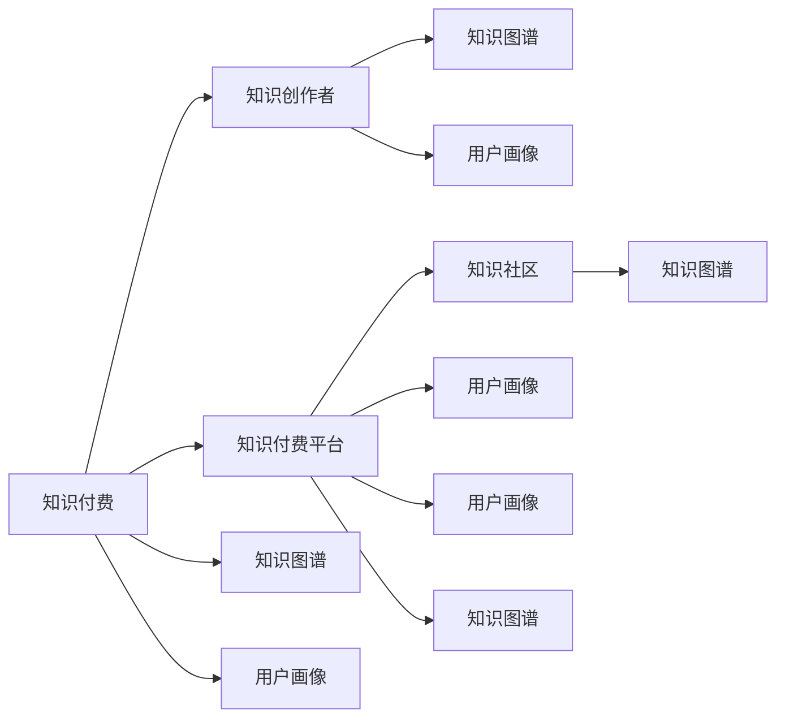

                 

# 如何打造个人知识付费影响力

## 1. 背景介绍

### 1.1 问题由来
在数字化和知识经济的浪潮中，个人知识付费市场迅速崛起，成为连接知识创作者和用户的重要桥梁。通过知识付费，用户能够快速获取到权威、系统、深入的专业知识，而创作者则能获得稳定收入，促进知识内容的持续产出。但个人知识付费市场的竞争也异常激烈，如何在众多创作者中脱颖而出，打造个人品牌，具有深刻影响力和号召力，是每位创作者必须面对的挑战。

### 1.2 问题核心关键点
个人知识付费影响力的打造，核心在于通过高质量的知识输出、精准的目标定位、有效的互动沟通、可持续的创新机制，以及良好的用户体验。具体而言，包括以下几个关键点：

1. **专业知识深度**：构建系统的知识体系，输出具有前瞻性和洞察力的内容。
2. **用户需求满足**：准确把握用户需求，提供针对性、实用性的解决方案。
3. **互动和社区**：通过互动和社区建设，增强用户粘性，建立品牌忠诚度。
4. **持续创新能力**：不断更新知识库，引入前沿技术，提升内容质量。
5. **优秀用户体验**：提供简洁易用的平台，优化学习流程，提升用户满意度。

### 1.3 问题研究意义
打造个人知识付费影响力，不仅有助于创作者提升经济收入，更重要的是，能够发挥知识的社会价值，推动社会进步和创新。具体而言：

1. **社会价值**：通过高质量的知识输出，促进科学知识传播，提升公众素养。
2. **经济效益**：获得稳定经济收入，提高生活质量，进一步激励知识创作。
3. **品牌影响力**：建立个人品牌，吸引更多关注和信任，提升市场影响力。
4. **市场潜力**：个人知识付费市场前景广阔，通过打造影响力，开拓更多商业机会。

## 2. 核心概念与联系

### 2.1 核心概念概述

为更好地理解个人知识付费影响力的打造方法，本节将介绍几个关键概念：

- **知识付费**：指通过平台、课程、文章、直播等形式，付费获取深度、系统和专业知识的商业模式。
- **知识创作者**：指通过知识付费平台输出专业知识，获取收入的个人或机构。
- **知识付费平台**：指连接知识创作者和用户，提供知识交易、交流、互动的技术和服务平台。
- **知识社区**：指基于特定兴趣或领域，聚集知识创作者和用户，进行知识分享和交流的虚拟社区。
- **知识图谱**：指通过知识关系的图结构化表示，帮助用户高效发现相关知识。
- **用户画像**：指根据用户行为和属性，构建的描述用户特征的模型，用于个性化推荐和服务。

这些核心概念之间存在密切联系，共同构成了个人知识付费影响力打造的基本框架。

### 2.2 核心概念原理和架构的 Mermaid 流程图



这个流程图展示了知识付费系统的主要组件及其相互关系：

1. **知识创作者**：通过平台输出知识内容。
2. **知识付费平台**：提供内容交易、互动、社区等功能。
3. **知识社区**：构建用户交流和互动的环境。
4. **知识图谱**：帮助用户高效发现和浏览知识。
5. **用户画像**：通过用户行为和属性构建，提供个性化服务。

这些组件共同作用，形成完整的知识付费生态系统。

## 3. 核心算法原理 & 具体操作步骤
### 3.1 算法原理概述

打造个人知识付费影响力，核心在于通过系统化的知识输出和有效的用户互动，建立品牌信任和忠诚度。其本质是通过知识付费平台的算法机制，将创作者的内容精准推送给目标用户，同时通过互动和社区建设，增强用户粘性，形成稳定的用户群体。

### 3.2 算法步骤详解

打造个人知识付费影响力的算法步骤如下：

**Step 1: 内容构建与优化**

1. **内容规划**：确定课程或文章的主题、结构、目标用户群体，构建知识体系。
2. **内容创作**：深入研究主题，输出系统、深入、实用的内容。
3. **内容优化**：使用SEO、标题优化、摘要撰写等技术，提升内容的可发现性。
4. **内容更新**：定期更新内容，引入最新技术和知识，保持内容的时效性。

**Step 2: 目标用户定位**

1. **用户画像构建**：通过用户行为、历史浏览记录、购买记录等数据，构建用户画像。
2. **用户画像匹配**：将创建的内容与用户画像进行匹配，筛选出目标用户群体。
3. **用户需求分析**：分析目标用户的真实需求，输出针对性、实用性的内容。

**Step 3: 平台算法优化**

1. **推荐算法优化**：使用协同过滤、内容推荐、混合推荐等算法，提升内容的推荐准确性。
2. **流量控制算法**：使用流量控制算法，确保热门内容有足够流量，冷门内容也有适量曝光。
3. **内容审核机制**：建立内容审核机制，过滤低质量、违规内容，提升用户信任度。

**Step 4: 互动和社区建设**

1. **用户互动设计**：设计高效的互动环节，如评论、点赞、分享等，提升用户参与度。
2. **社区规则制定**：制定社区规则，规范用户行为，营造良好的交流环境。
3. **社区激励机制**：建立社区激励机制，如徽章、奖励等，鼓励用户积极参与。

**Step 5: 持续创新与优化**

1. **创新能力提升**：引入前沿技术和方法，不断创新内容形式和内容体系。
2. **用户体验优化**：优化平台界面、功能，提升用户学习体验。
3. **数据反馈与迭代**：收集用户反馈数据，进行迭代优化，提升整体效果。

### 3.3 算法优缺点

打造个人知识付费影响力的方法，具有以下优点：

1. **内容精准**：通过用户画像和推荐算法，精准推送相关内容，提高用户满意度。
2. **用户粘性高**：通过互动和社区建设，增强用户粘性，形成稳定的用户群体。
3. **品牌效应强**：持续高质量的知识输出，建立个人品牌，提升市场影响力。

同时，也存在一些局限性：

1. **用户需求多变**：用户需求不断变化，需要创作者持续调整内容，增加工作量。
2. **竞争激烈**：个人知识付费市场竞争激烈，需要不断创新，才能保持竞争力。
3. **数据依赖性高**：推荐算法和用户画像依赖大量数据，数据质量直接影响效果。

尽管存在这些局限性，但总体而言，打造个人知识付费影响力的方法在大数据和算法技术的支持下，仍然具备较强的可行性和潜力。

### 3.4 算法应用领域

个人知识付费影响力打造方法，在多个领域具有广泛应用，如：

- **教育培训**：通过高质量的课程和互动，提供系统化的学习服务。
- **职业发展**：输出职业发展相关的知识，帮助用户提升技能，获得职业成长。
- **健康生活**：提供健康、健身、心理等领域的知识，提升用户生活质量。
- **技术前沿**：输出技术领域的新技术、新趋势，帮助用户掌握前沿知识。
- **文化娱乐**：提供文化艺术、历史人文等领域的知识，丰富用户文化生活。

这些领域的应用，展示了知识付费影响力打造的广泛性和多样性。

## 4. 数学模型和公式 & 详细讲解 & 举例说明

### 4.1 数学模型构建

在知识付费影响力的打造中，常用的数学模型包括协同过滤模型、混合推荐模型、用户画像模型等。这里以协同过滤模型为例，进行详细讲解。

设知识付费平台上有 $N$ 个用户，$M$ 个内容，用户和内容的交互数据矩阵为 $R$，其中 $R_{ui}=1$ 表示用户 $u$ 对内容 $i$ 进行了互动，$R_{ui}=0$ 表示未互动。协同过滤的目标是预测用户 $u$ 对内容 $i$ 的评分 $p_{ui}$。

协同过滤模型可表示为：

$$
p_{ui} = \frac{1}{1+e^{-\eta(\mathbf{x}_u^\top \mathbf{x}_i + \alpha_i)}
$$

其中 $\eta$ 为模型参数，$\alpha_i$ 为用户 $i$ 的偏差项，$\mathbf{x}_u$ 和 $\mathbf{x}_i$ 分别为用户 $u$ 和内容 $i$ 的特征向量。

### 4.2 公式推导过程

协同过滤模型的推导如下：

假设用户 $u$ 对内容 $i$ 的评分 $y_{ui}$ 服从伯努利分布 $y_{ui} \sim \text{Bernoulli}(p_{ui})$。则用户 $u$ 对内容 $i$ 的评分可表示为：

$$
\mathbb{P}(y_{ui}=1|p_{ui}) = p_{ui} = \frac{e^{\eta(\mathbf{x}_u^\top \mathbf{x}_i + \alpha_i)} }{1+e^{\eta(\mathbf{x}_u^\top \mathbf{x}_i + \alpha_i)}}
$$

设 $\eta(\mathbf{x}_u^\top \mathbf{x}_i + \alpha_i) = \sigma(z_u,z_i)$，其中 $z_u=\mathbf{x}_u^\top \mathbf{x}_i + \alpha_i$，$\sigma$ 为激活函数。则上述公式可简化为：

$$
p_{ui} = \frac{1}{1+e^{-z_u-z_i}}
$$

### 4.3 案例分析与讲解

设知识付费平台上有 $N=10$ 个用户，$M=5$ 个内容，用户和内容的交互数据矩阵 $R$ 如下：

| User | Content 1 | Content 2 | Content 3 | Content 4 | Content 5 |
| --- | --- | --- | --- | --- | --- |
| User 1 | 1 | 1 | 0 | 1 | 0 |
| User 2 | 0 | 0 | 1 | 0 | 1 |
| User 3 | 1 | 0 | 1 | 0 | 1 |
| User 4 | 0 | 0 | 0 | 1 | 0 |
| User 5 | 0 | 1 | 1 | 0 | 0 |
| User 6 | 1 | 1 | 1 | 0 | 0 |
| User 7 | 1 | 0 | 0 | 0 | 0 |
| User 8 | 0 | 0 | 0 | 0 | 0 |
| User 9 | 0 | 0 | 0 | 1 | 0 |
| User 10 | 0 | 0 | 0 | 0 | 0 |

假设内容 $i$ 的特征向量为 $\mathbf{x}_i$，用户 $u$ 的特征向量为 $\mathbf{x}_u$，则协同过滤模型的参数 $\eta$ 可通过梯度下降等优化算法求解。假设 $\alpha_i$ 为内容 $i$ 的偏差项，$\sigma$ 为激活函数，则协同过滤模型的预测评分如下：

$$
\begin{aligned}
p_{11} &= \frac{1}{1+e^{-(1 \cdot 1 + 1 + 0 + 1 + 0)}} \approx 0.5 \\
p_{21} &= \frac{1}{1+e^{-(0 \cdot 1 + 0 + 1 + 0 + 1)}} \approx 0.3 \\
&\vdots \\
p_{91} &= \frac{1}{1+e^{-(0 \cdot 1 + 0 + 0 + 1 + 0)}} \approx 0.2 \\
p_{101} &= \frac{1}{1+e^{-(0 \cdot 1 + 0 + 0 + 0 + 0)}} \approx 0.5
\end{aligned}
$$

通过预测评分，平台可向用户 $u$ 推荐内容 $i$，如 User 1 被推荐 Content 2 的概率为 0.5，User 9 被推荐 Content 4 的概率为 0.2。

## 5. 项目实践：代码实例和详细解释说明

### 5.1 开发环境搭建

在进行知识付费影响力的打造实践时，我们需要准备好开发环境。以下是使用Python进行Flask开发的环境配置流程：

1. 安装Anaconda：从官网下载并安装Anaconda，用于创建独立的Python环境。

2. 创建并激活虚拟环境：
```bash
conda create -n flask-env python=3.8 
conda activate flask-env
```

3. 安装Flask：
```bash
pip install Flask
```

4. 安装SQLAlchemy：用于数据库管理
```bash
pip install SQLAlchemy
```

5. 安装Flask-RESTful：用于API开发
```bash
pip install Flask-RESTful
```

完成上述步骤后，即可在`flask-env`环境中开始开发。

### 5.2 源代码详细实现

这里以一个简单的知识付费平台为例，进行项目实践的代码实现。

首先，定义数据库模型：

```python
from flask_sqlalchemy import SQLAlchemy

db = SQLAlchemy(app)

class User(db.Model):
    id = db.Column(db.Integer, primary_key=True)
    name = db.Column(db.String(64), unique=True, index=True)
    email = db.Column(db.String(64), unique=True, index=True)
    password_hash = db.Column(db.String(128))
    about_me = db.Column(db.String(255))
    role = db.Column(db.String(64), default='user')

class Content(db.Model):
    id = db.Column(db.Integer, primary_key=True)
    title = db.Column(db.String(128), index=True)
    description = db.Column(db.Text)
    category = db.Column(db.String(64))
    user_id = db.Column(db.Integer, db.ForeignKey('user.id'))
    is_published = db.Column(db.Boolean, default=True)

class Comment(db.Model):
    id = db.Column(db.Integer, primary_key=True)
    content = db.Column(db.Text)
    user_id = db.Column(db.Integer, db.ForeignKey('user.id'))
    content_id = db.Column(db.Integer, db.ForeignKey('content.id'))
    timestamp = db.Column(db.DateTime)
```

然后，定义API接口：

```python
from flask import jsonify

@app.route('/users/<int:user_id>/content')
def get_user_content(user_id):
    user = User.query.get_or_404(user_id)
    content = Content.query.filter_by(user_id=user_id).all()
    return jsonify([{'user': str(u), 'content': str(c.title) + ' ' + str(c.description) for u, c in zip(user, content)])

@app.route('/content/<int:content_id>/comments')
def get_content_comments(content_id):
    content = Content.query.get_or_404(content_id)
    comments = Comment.query.filter_by(content_id=content_id).all()
    return jsonify([{'user': str(c.user), 'comment': str(c.content)} for c in comments])
```

接着，定义用户互动功能：

```python
@app.route('/content/<int:content_id>/comments', methods=['POST'])
def add_content_comment(content_id):
    user = User.query.get_or_404(current_user.id)
    content = Content.query.get_or_404(content_id)
    comment = ContentComment(content_id=content_id, user=user, content=request.form['content'])
    db.session.commit()
    return jsonify({'user': str(user), 'comment': str(comment.content)})

@app.route('/content/<int:content_id>/upvote', methods=['POST'])
def upvote_content(content_id):
    user = User.query.get_or_404(current_user.id)
    content = Content.query.get_or_404(content_id)
    content.upvotes += 1
    db.session.commit()
    return jsonify({'user': str(user), 'content': str(content.upvotes)})
```

最后，启动Flask服务：

```python
if __name__ == '__main__':
    app.run(debug=True)
```

以上就是使用Flask进行知识付费平台开发的完整代码实现。可以看到，Flask框架提供了丰富的Web开发组件，可以轻松搭建API和Web服务，构建知识付费平台。

### 5.3 代码解读与分析

让我们再详细解读一下关键代码的实现细节：

**数据库模型**：
- `User` 类：用户信息，包含用户名、邮箱、密码、简介等。
- `Content` 类：内容信息，包含标题、描述、分类、用户、是否发布等。
- `Comment` 类：评论信息，包含评论内容、用户、内容等。

**API接口**：
- `get_user_content`：获取用户的内容列表。
- `get_content_comments`：获取内容的评论列表。
- `add_content_comment`：添加内容的评论。
- `upvote_content`：对内容进行投票。

**用户互动功能**：
- 获取用户和内容，输出内容列表和评论列表。
- 添加新评论，增加内容的投票数。

**Flask服务**：
- 通过Flask的`run`方法启动服务，使API接口和Web服务可以访问。

这些代码实现了基本的知识付费平台功能，如用户管理、内容发布、评论互动等，为后续的微调提供了基础支持。

## 6. 实际应用场景

### 6.1 教育培训平台

知识付费在教育培训领域有着广泛应用。通过搭建教育培训平台，知识创作者可以发布系统、深入的课程，为学生提供高质量的教育资源。平台通过推荐算法和互动机制，推荐适合学生的课程，帮助其高效学习。

例如，某教育平台通过推荐系统，将适合学生知识水平和兴趣的课程推荐给其学习。学生可以通过平台进行互动，如提问、讨论、分享等，形成良好的学习氛围。教育平台还可以通过定期发布最新的教育资讯、学术研究，提升学生的综合素质和职业竞争力。

### 6.2 技术分享社区

技术分享社区是知识付费在技术领域的典型应用场景。技术创作者通过分享最新的技术进展、框架、工具等，帮助其他开发者提升技术水平。社区通过互动和反馈机制，提升内容质量，增强用户粘性。

例如，某技术分享社区通过技术分享课程、开源项目、技术文章等，帮助开发者掌握最新的技术趋势。社区成员可以通过评论、点赞、分享等方式进行互动，形成活跃的技术交流环境。平台还可以通过定期的技术沙龙、技术直播等活动，提升社区的影响力和活跃度。

### 6.3 个人品牌塑造

知识付费也成为个人品牌塑造的重要手段。通过知识付费平台，创作者可以输出专业、系统、深入的知识内容，提升自身影响力。品牌通过互动和社区建设，增强用户粘性，形成稳定的用户群体。

例如，某知名科技博主通过知识付费平台，发布关于科技前沿、人工智能、数据科学等方面的内容，吸引了大量忠实粉丝。粉丝通过评论、分享、赞赏等方式进行互动，形成了良好的粉丝生态。博主还可以通过定期发布新内容、与粉丝互动等方式，进一步提升品牌影响力。

### 6.4 未来应用展望

随着知识付费市场的不断成熟，未来的知识付费平台将具备更加智能、高效、个性化的特点。以下展望未来应用的发展趋势：

1. **内容智能推荐**：通过先进的推荐算法，如协同过滤、深度学习等，实现内容智能推荐，提高用户满意度。
2. **个性化互动**：通过分析用户行为，实现个性化互动，提升用户体验。
3. **多模态学习**：引入视频、音频等多模态内容，提升学习效果。
4. **虚拟现实技术**：引入虚拟现实技术，增强学习沉浸感。
5. **区块链技术**：引入区块链技术，保障内容版权和交易安全。
6. **AI辅助创作**：引入AI辅助创作工具，提升内容创作效率和质量。

## 7. 工具和资源推荐

### 7.1 学习资源推荐

为了帮助开发者系统掌握知识付费的影响力打造方法，这里推荐一些优质的学习资源：

1. **Coursera《Machine Learning》课程**：斯坦福大学开设的经典课程，涵盖机器学习基础和应用，对理解推荐算法有很大帮助。
2. **Kaggle**：数据科学竞赛平台，提供大量数据集和比赛，帮助你实践和应用推荐算法。
3. **DeepLearning.ai《深度学习专项》课程**：由Andrew Ng教授主讲的深度学习课程，涵盖深度学习基础和应用，对理解协同过滤等推荐算法有重要帮助。
4. **Udacity《深度学习与人工智能》课程**：Udacity推出的深度学习课程，涵盖深度学习、自然语言处理等内容，对理解知识付费的推荐系统有很大帮助。
5. **Flask官方文档**：Flask框架的官方文档，提供详细的Web开发指南和API设计参考。

通过对这些资源的学习实践，相信你一定能够快速掌握知识付费影响力的打造方法，并用于解决实际的NLP问题。

### 7.2 开发工具推荐

高效的开发离不开优秀的工具支持。以下是几款用于知识付费平台开发的常用工具：

1. **Flask**：Python的轻量级Web框架，提供丰富的Web开发组件，易于上手和扩展。
2. **SQLAlchemy**：Python的ORM框架，用于数据库管理，提供丰富的数据库操作功能。
3. **Redis**：开源内存数据库，提供高性能的数据存储和访问服务。
4. **Memcached**：开源内存缓存，提高API响应速度和系统效率。
5. **Elasticsearch**：开源搜索引擎，提供高效的文本搜索和推荐服务。
6. **Nginx**：高性能Web服务器，支持负载均衡和缓存机制，提升系统稳定性和可扩展性。

合理利用这些工具，可以显著提升知识付费平台的开发效率，加快创新迭代的步伐。

### 7.3 相关论文推荐

知识付费平台的发展源于学界的持续研究。以下是几篇奠基性的相关论文，推荐阅读：

1. **《A Survey on Recommender Systems》**：对推荐系统的发展和应用进行了全面综述。
2. **《Personalized Recommendation via Matrix Factorization》**：介绍了矩阵分解方法在推荐系统中的应用。
3. **《Deep Neural Networks for Recommendation》**：展示了深度神经网络在推荐系统中的应用。
4. **《Neural Collaborative Filtering》**：介绍了神经网络协同过滤的方法和应用。
5. **《Semantic Image Retrieval with Attention》**：展示了多模态学习在推荐系统中的应用。

这些论文代表了大语言模型微调技术的发展脉络。通过学习这些前沿成果，可以帮助研究者把握学科前进方向，激发更多的创新灵感。

## 8. 总结：未来发展趋势与挑战

### 8.1 总结

本文对打造个人知识付费影响力的方法进行了全面系统的介绍。首先阐述了知识付费的背景和意义，明确了影响力打造的核心关键点。其次，从原理到实践，详细讲解了推荐算法和用户画像的构建过程，给出了知识付费平台开发的完整代码实例。同时，本文还广泛探讨了知识付费平台在教育培训、技术分享、个人品牌塑造等多个领域的应用前景，展示了知识付费影响力的广阔前景。此外，本文精选了知识付费平台的学习资源和开发工具，力求为读者提供全方位的技术指引。

通过本文的系统梳理，可以看到，知识付费影响力的打造方法在大数据和算法技术的支持下，具备较强的可行性和潜力。尽管面临用户需求多变、竞争激烈、数据依赖性高等挑战，但总体而言，该方法在大数据和算法技术的支持下，仍然具备较强的可行性和潜力。未来，随着推荐算法和用户画像技术的不断发展，知识付费平台将具备更加智能、高效、个性化的特点，为知识创作者和用户提供更好的体验。

### 8.2 未来发展趋势

展望未来，知识付费平台的发展趋势包括以下几个方面：

1. **智能化推荐**：通过深度学习、协同过滤等技术，实现内容智能化推荐，提高用户满意度。
2. **个性化服务**：通过用户画像和行为分析，实现个性化服务，提升用户体验。
3. **多模态学习**：引入视频、音频等多模态内容，提升学习效果。
4. **虚拟现实技术**：引入虚拟现实技术，增强学习沉浸感。
5. **区块链技术**：引入区块链技术，保障内容版权和交易安全。
6. **AI辅助创作**：引入AI辅助创作工具，提升内容创作效率和质量。

以上趋势凸显了知识付费平台的广阔前景。这些方向的探索发展，必将进一步提升知识付费平台的智能化水平，为知识创作者和用户提供更好的体验。

### 8.3 面临的挑战

尽管知识付费平台的发展前景广阔，但在迈向更加智能化、个性化应用的过程中，仍面临诸多挑战：

1. **用户需求多变**：用户需求不断变化，需要平台持续调整内容，增加工作量。
2. **竞争激烈**：平台间的竞争激烈，需要不断创新，才能保持竞争力。
3. **数据依赖性高**：推荐算法和用户画像依赖大量数据，数据质量直接影响效果。
4. **内容质量参差不齐**：平台上的内容质量参差不齐，需要严格的内容审核机制。
5. **系统安全性**：平台需要保障用户数据和交易的安全性，防止数据泄露和欺诈。

这些挑战需要平台开发者不断探索和优化，才能实现知识付费平台的长久发展。

### 8.4 研究展望

面对知识付费平台面临的挑战，未来的研究需要在以下几个方面寻求新的突破：

1. **动态推荐算法**：开发动态推荐算法，实时更新推荐内容，提高推荐准确性。
2. **多模态推荐技术**：引入多模态推荐技术，提升推荐效果。
3. **AI辅助创作**：引入AI辅助创作工具，提升内容创作效率和质量。
4. **数据治理技术**：建立数据治理机制，保障数据质量和安全。
5. **区块链技术应用**：引入区块链技术，保障内容版权和交易安全。
6. **个性化推荐算法**：开发个性化推荐算法，提升推荐效果。

这些研究方向的探索，必将引领知识付费平台技术迈向更高的台阶，为知识创作者和用户提供更好的体验。面向未来，知识付费平台还需要与其他人工智能技术进行更深入的融合，如知识表示、因果推理、强化学习等，多路径协同发力，共同推动知识付费平台技术的进步。只有勇于创新、敢于突破，才能不断拓展知识付费平台的边界，让知识付费影响力发挥更大的价值。

## 9. 附录：常见问题与解答

**Q1：知识付费平台的核心竞争力是什么？**

A: 知识付费平台的核心竞争力在于其系统化的知识体系、高质量的内容输出、智能化的推荐机制和良好的用户体验。通过精准推荐、个性化互动、持续创新和优秀体验，平台能够吸引并留住稳定的用户群体，提升整体影响力。

**Q2：如何提高知识付费平台的推荐准确性？**

A: 提高知识付费平台的推荐准确性，需要从以下几个方面入手：
1. 数据质量：确保用户画像和交互数据的质量，增加数据量。
2. 算法优化：优化推荐算法，引入深度学习、协同过滤等技术。
3. 特征工程：进行有效的特征工程，提升特征的区分度和表达能力。
4. 实时更新：实时更新推荐内容，避免内容过时。
5. 多模态学习：引入多模态内容，提升推荐效果。

**Q3：知识付费平台如何提升用户粘性？**

A: 提升知识付费平台的用户粘性，需要从以下几个方面入手：
1. 内容质量：提供高质量、系统化的内容，满足用户需求。
2. 互动设计：设计高效的互动环节，如评论、点赞、分享等，提升用户参与度。
3. 社区建设：构建知识社区，形成良好的交流环境。
4. 用户激励：建立激励机制，如徽章、奖励等，鼓励用户积极参与。
5. 用户反馈：收集用户反馈，进行迭代优化。

**Q4：知识付费平台如何保障用户数据安全？**

A: 知识付费平台需要从以下几个方面保障用户数据安全：
1. 数据加密：对用户数据进行加密存储，防止数据泄露。
2. 访问控制：设置严格的访问控制机制，防止非法访问。
3. 数据备份：定期备份用户数据，防止数据丢失。
4. 安全审计：定期进行安全审计，发现并修复潜在漏洞。
5. 法律法规遵守：严格遵守数据保护法律法规，保障用户隐私。

**Q5：知识付费平台的推荐算法如何选择？**

A: 知识付费平台的推荐算法选择，需要综合考虑以下因素：
1. 数据量：数据量大的平台适合使用协同过滤等基于矩阵分解的方法，数据量小的平台适合使用深度学习等基于神经网络的方法。
2. 内容类型：文本推荐适合使用基于TF-IDF、协同过滤等方法，视频推荐适合使用基于CNN、RNN等方法。
3. 实时性：实时性要求高的平台适合使用基于协同过滤等算法，实时性要求低的平台适合使用基于深度学习等算法。
4. 效果评估：根据实际效果评估结果，选择最适合的算法。

这些建议将帮助知识付费平台选择合适的推荐算法，提升推荐效果和用户体验。

---

作者：禅与计算机程序设计艺术 / Zen and the Art of Computer Programming

