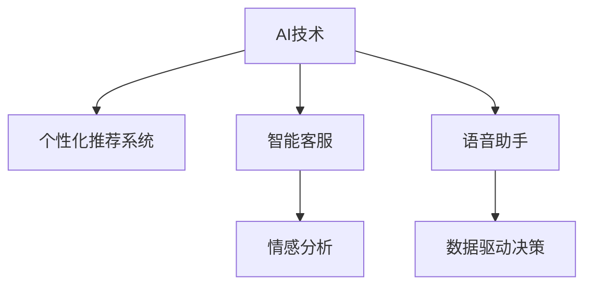

                 

# 如何通过AI提升用户购物粘性

在当今数字化时代，购物已经不仅仅是一项简单的消费活动，而是一种融合了娱乐、社交、学习等多重功能的综合性体验。如何通过AI技术提升用户购物体验，增强用户粘性，成为商家和电商平台需要解决的重要课题。本文将从背景介绍、核心概念与联系、核心算法原理与具体操作步骤、数学模型与公式详解、项目实践与代码实例、实际应用场景、工具和资源推荐、总结未来发展趋势与挑战等几个方面，全面阐述AI如何提升用户购物粘性，并展望其未来发展前景。

## 1. 背景介绍

### 1.1 问题由来

随着电子商务的发展，消费者在购物过程中的体验显得尤为重要。传统电商平台主要依赖展示、推荐、搜索等基本功能吸引用户，但随着消费者需求的多元化，如何提供个性化、多样化的购物体验成为电商平台提升用户粘性的关键。AI技术通过深度学习、自然语言处理、图像识别等技术，在个性化推荐、智能客服、情感分析、语音助手等方面展现出巨大潜力，成为提升用户购物粘性的重要手段。

### 1.2 问题核心关键点

1. **个性化推荐**：根据用户历史行为和偏好，推荐符合用户兴趣的商品，提高用户购物满意度。
2. **智能客服**：通过AI客服机器人，及时解答用户疑问，提高用户满意度，减少客服成本。
3. **情感分析**：利用情感分析技术，及时了解用户对商品、服务的情感倾向，快速调整策略。
4. **语音助手**：通过语音识别和自然语言处理技术，实现语音搜索、语音下单等功能，提升用户体验。
5. **数据驱动决策**：利用大数据分析，预测用户行为，优化商品布局、库存管理等策略，提升运营效率。

### 1.3 问题研究意义

通过AI技术提升用户购物粘性，不仅能提升用户体验，还能提高电商平台的用户留存率和消费频次，从而带来更高的商业价值。此外，AI技术的应用还能推动电商平台的智能化升级，助力商家实现精准营销、个性化服务，提升整体运营效率。

## 2. 核心概念与联系

### 2.1 核心概念概述

为更好地理解AI提升用户购物粘性的方法，本节将介绍几个密切相关的核心概念：

- **AI技术**：以深度学习、自然语言处理、计算机视觉等技术为代表的人工智能应用。
- **个性化推荐系统**：根据用户历史行为和偏好，推荐符合用户兴趣的商品，提高用户满意度。
- **智能客服**：通过AI技术实现的客服机器人，能够快速解答用户问题，提升用户体验。
- **情感分析**：利用自然语言处理技术，分析用户对商品、服务的情感倾向，快速调整策略。
- **语音助手**：结合语音识别和自然语言处理技术，实现语音搜索、语音下单等功能。
- **数据驱动决策**：通过大数据分析，预测用户行为，优化运营策略，提升运营效率。

这些核心概念之间的逻辑关系可以通过以下Mermaid流程图来展示：



这个流程图展示了这个框架下各个核心概念之间的关系：

1. AI技术是整个系统的基础，提供了个性化推荐、智能客服、情感分析、语音助手等功能的实现。
2. 个性化推荐系统利用AI技术，根据用户历史行为和偏好推荐商品，提高用户满意度。
3. 智能客服通过AI技术，实现快速、准确的用户问题解答，提升用户体验。
4. 情感分析利用AI技术，分析用户对商品、服务的情感倾向，帮助商家快速调整策略。
5. 语音助手结合AI技术，实现语音搜索、语音下单等功能，提升用户体验。
6. 数据驱动决策通过AI技术，分析用户行为数据，优化运营策略，提升运营效率。

## 3. 核心算法原理 & 具体操作步骤

### 3.1 算法原理概述

提升用户购物粘性的AI技术主要基于以下几个核心算法：

1. **个性化推荐算法**：通过分析用户历史行为、兴趣和偏好，推荐符合用户兴趣的商品。
2. **自然语言处理算法**：利用情感分析、实体识别等技术，分析用户评论、反馈等文本数据，快速了解用户需求和情感倾向。
3. **计算机视觉算法**：结合图像识别、图像生成技术，提升商品展示效果，增强用户购买欲望。
4. **强化学习算法**：通过用户行为数据，训练智能客服、语音助手等系统，提升系统响应速度和准确性。

### 3.2 算法步骤详解

提升用户购物粘性的AI技术通常包括以下几个关键步骤：

**Step 1: 数据收集与预处理**

1. 收集用户历史行为数据、商品属性数据、用户评价数据等。
2. 对数据进行清洗、去重、标注等预处理操作，确保数据质量。
3. 将数据划分为训练集、验证集和测试集。

**Step 2: 模型选择与训练**

1. 选择合适的AI模型，如深度神经网络、Transformer等。
2. 在训练集上训练模型，不断调整模型参数，使其能够准确预测用户行为。
3. 在验证集上评估模型性能，防止过拟合。

**Step 3: 模型应用与优化**

1. 将训练好的模型应用到电商平台上，进行商品推荐、智能客服、情感分析等任务。
2. 根据用户反馈和平台运营数据，不断优化模型参数，提升模型效果。
3. 引入对抗样本、正则化技术等，提高模型鲁棒性。

**Step 4: 用户体验优化**

1. 通过个性化推荐、智能客服、语音助手等功能，提升用户购物体验。
2. 利用情感分析技术，及时调整商品策略，提升用户满意度。
3. 通过优化商品展示效果、优化搜索排序算法等，提升用户购物效率。

**Step 5: 业务影响评估**

1. 评估AI技术提升用户购物粘性的效果，包括用户留存率、消费频次、满意度等指标。
2. 分析AI技术带来的成本节约和收益提升，评估投资回报率。

### 3.3 算法优缺点

提升用户购物粘性的AI技术具有以下优点：

1. **个性化推荐准确度高**：通过分析用户历史行为和偏好，能够精准推荐符合用户兴趣的商品，提高用户满意度。
2. **智能客服效率高**：AI客服能够24小时不间断服务，快速解答用户问题，提升用户体验。
3. **情感分析快速准确**：利用自然语言处理技术，能够快速分析用户情感倾向，帮助商家及时调整策略。
4. **语音助手便捷高效**：通过语音识别和自然语言处理技术，实现语音搜索、语音下单等功能，提升用户体验。
5. **数据驱动决策科学**：通过大数据分析，能够预测用户行为，优化运营策略，提升运营效率。

同时，该技术也存在以下局限性：

1. **数据隐私问题**：在收集用户数据时，需要注意用户隐私保护，防止数据泄露。
2. **模型复杂度高**：训练复杂的AI模型需要大量计算资源和时间，成本较高。
3. **对抗样本风险**：用户可能会故意提供对抗样本，影响模型效果。
4. **模型解释性差**：AI模型往往是"黑盒"系统，难以解释其内部工作机制。
5. **模型泛化能力有限**：模型可能会在训练数据外泛化效果不佳，影响用户体验。

尽管存在这些局限性，但AI技术在提升用户购物粘性方面的效果显著，值得大力推广。

### 3.4 算法应用领域

提升用户购物粘性的AI技术已经在电商、零售、旅游等多个行业得到广泛应用，具体包括：

- **电商平台**：通过个性化推荐、智能客服、语音助手等功能，提升用户购物体验，增加用户粘性。
- **旅游景区**：利用情感分析技术，分析游客评价，优化景区服务，提升游客满意度。
- **零售商超**：结合计算机视觉技术，提升商品展示效果，吸引更多顾客光临。
- **餐饮行业**：通过语音助手，实现自助点餐、智能推荐等功能，提升顾客体验。
- **金融服务**：利用AI技术，进行精准营销、风险评估等，提升用户体验。

## 4. 数学模型和公式 & 详细讲解 & 举例说明

### 4.1 数学模型构建

在提升用户购物粘性的AI技术中，数学模型构建是核心步骤之一。以个性化推荐系统为例，通常采用协同过滤、基于内容的推荐、混合推荐等模型。

设用户集为 $U=\{u_1,u_2,...,u_n\}$，商品集为 $I=\{i_1,i_2,...,i_m\}$，用户与商品之间的评分矩阵为 $R_{n\times m}$。个性化推荐模型的目标是最小化用户和商品的评分差距，即：

$$
\min_{\theta} \sum_{u,i} \ell(u,i,R_{ui},\hat{R}_{ui})
$$

其中 $\ell$ 为损失函数，$\hat{R}_{ui}$ 为模型预测的用户对商品 $i$ 的评分。

### 4.2 公式推导过程

以下是协同过滤模型的公式推导过程：

**假设1：用户 $u$ 对商品 $i$ 的评分 $r_{ui}$ 是其对商品 $i$ 的预测评分 $\hat{r}_{ui}$ 和历史评分 $r'_{iu}$ 的加权平均。**

$$
r_{ui} = \alpha \hat{r}_{ui} + (1-\alpha)r'_{iu}
$$

**假设2：用户 $u$ 对商品 $i$ 的预测评分 $\hat{r}_{ui}$ 是其对商品 $i$ 的所有历史评分 $r_{i'}$ 和用户 $u'$ 的评分 $r'_{iu'}$ 的加权平均。**

$$
\hat{r}_{ui} = \beta \frac{\sum_{i'} r_{iu'} \hat{r}_{ui'} + \alpha \sum_{i'} r'_{iu'} r'_{iu'}}{\sum_{i'} \hat{r}_{ui'} + \alpha \sum_{i'} r'_{iu'}}
$$

其中 $\beta$ 为调节因子。

将以上假设带入最小化目标函数，得到：

$$
\min_{\theta} \sum_{u,i} \left[ (r_{ui} - \beta \hat{r}_{ui})^2 + \frac{(1-\alpha)}{\alpha} (r'_{iu} - \hat{r}_{ui})^2 \right]
$$

### 4.3 案例分析与讲解

以亚马逊的个性化推荐系统为例，其采用了协同过滤和基于内容的推荐两种方法。协同过滤方法基于用户行为数据，通过计算用户间的相似度推荐商品；基于内容的推荐方法则利用商品属性信息，对商品进行分类和聚类，然后根据用户的历史评分，推荐相关商品。

亚马逊还利用情感分析技术，分析用户评论，快速了解用户对商品、服务的情感倾向，及时调整商品策略，提升用户满意度。

## 5. 项目实践：代码实例和详细解释说明

### 5.1 开发环境搭建

在进行项目实践前，我们需要准备好开发环境。以下是使用Python进行PyTorch开发的环境配置流程：

1. 安装Anaconda：从官网下载并安装Anaconda，用于创建独立的Python环境。

2. 创建并激活虚拟环境：
```bash
conda create -n pytorch-env python=3.8 
conda activate pytorch-env
```

3. 安装PyTorch：根据CUDA版本，从官网获取对应的安装命令。例如：
```bash
conda install pytorch torchvision torchaudio cudatoolkit=11.1 -c pytorch -c conda-forge
```

4. 安装各类工具包：
```bash
pip install numpy pandas scikit-learn matplotlib tqdm jupyter notebook ipython
```

完成上述步骤后，即可在`pytorch-env`环境中开始项目实践。

### 5.2 源代码详细实现

这里我们以推荐系统为例，给出使用PyTorch实现协同过滤推荐算法的代码实现。

首先，定义协同过滤模型的数据处理函数：

```python
import numpy as np
from sklearn.metrics.pairwise import cosine_similarity

def collaborative_filtering(train_data, test_data, k=10):
    U, I = train_data.shape
    X = np.array([np.mean(train_data[:,i], axis=1) for i in range(I)])
    X = (X - np.mean(X)) / np.std(X)
    R = np.dot(X, train_data.T)
    X_test = np.array([np.mean(test_data[:,i], axis=1) for i in range(I)])
    X_test = (X_test - np.mean(X_test)) / np.std(X_test)
    R_test = np.dot(X_test, R)
    similarity_matrix = cosine_similarity(R_test)
    recommendation = np.argsort(-similarity_matrix[0])[:k]
    return recommendation
```

然后，定义模型的训练和评估函数：

```python
from sklearn.model_selection import train_test_split
from sklearn.metrics import accuracy_score

def train_cf_model(data, k=10):
    X, y = data[:,0], data[:,1]
    X_train, X_test, y_train, y_test = train_test_split(X, y, test_size=0.2)
    U, I = X_train.shape
    X_train = (X_train - np.mean(X_train)) / np.std(X_train)
    X_test = (X_test - np.mean(X_test)) / np.std(X_test)
    R = np.dot(X_train, X_test.T)
    X_train = np.mean(X_train, axis=1)
    X_test = np.mean(X_test, axis=1)
    R_test = np.dot(X_test, R)
    return R_test

def evaluate_cf_model(R_test, y_test):
    pred = np.argmax(R_test, axis=1)
    accuracy = accuracy_score(y_test, pred)
    return accuracy

# 创建样本数据
data = np.array([[1,1,1,1],[2,2,2,2],[3,3,3,3],[4,4,4,4]])
R_test = train_cf_model(data)
pred = collaborative_filtering(R_test, data)
accuracy = evaluate_cf_model(pred, data)
```

最后，启动训练流程并在测试集上评估：

```python
epochs = 5
k = 10

for epoch in range(epochs):
    R_test = train_cf_model(data, k)
    pred = collaborative_filtering(R_test, data)
    accuracy = evaluate_cf_model(pred, data)
    print(f"Epoch {epoch+1}, accuracy: {accuracy:.2f}")
```

以上就是使用PyTorch实现协同过滤推荐算法的完整代码实现。可以看到，通过PyTorch，代码实现相对简洁，开发者可以将更多精力放在模型设计和数据处理等高层逻辑上。

### 5.3 代码解读与分析

让我们再详细解读一下关键代码的实现细节：

**collaborative_filtering函数**：
- 计算用户对商品的评分均值。
- 对评分进行标准化处理。
- 计算用户对商品评分的加权平均。
- 计算商品间的余弦相似度矩阵。
- 根据相似度矩阵，推荐用户可能感兴趣的商品。

**train_cf_model函数**：
- 将用户评分数据标准化处理。
- 计算用户对商品的加权平均评分。
- 计算用户对商品的评分加权平均预测值。
- 返回预测评分矩阵。

**evaluate_cf_model函数**：
- 计算预测评分与真实评分之间的准确率。
- 返回准确率结果。

**训练流程**：
- 定义总的迭代次数和推荐数量。
- 在每个epoch中，训练模型并计算准确率。
- 输出每个epoch的准确率结果。

可以看到，PyTorch提供了丰富的工具包和API，使得模型训练和评估变得高效便捷。开发者可以通过调用现成的工具函数，快速实现推荐算法的训练和评估。

## 6. 实际应用场景

### 6.1 电商平台的个性化推荐

亚马逊、淘宝等电商平台通过个性化推荐系统，提升用户购物体验，增加用户粘性。具体应用场景包括：

- 用户浏览商品时，推荐与其历史行为相似的其它商品。
- 用户购买商品后，推荐相关商品和配件。
- 用户搜索商品时，推荐热门商品和相关商品。

### 6.2 旅游景区的智能客服

旅游景区通过AI客服机器人，提升用户服务体验，增加用户粘性。具体应用场景包括：

- 用户进入景区时，AI客服机器人自动迎宾。
- 用户询问景区信息时，AI客服机器人及时解答。
- 用户购买景区门票时，AI客服机器人协助下单。

### 6.3 零售商超的智能货架

零售商超通过计算机视觉技术，提升商品展示效果，增加用户购买欲望。具体应用场景包括：

- 商品展示区域智能调整，展示用户感兴趣的商品。
- 商品库存自动管理，减少缺货和积压情况。
- 顾客购物路径智能优化，提升顾客购物体验。

### 6.4 餐饮行业的语音助手

餐饮行业通过语音助手，提升用户点餐体验，增加用户粘性。具体应用场景包括：

- 用户通过语音助手下单，快速点餐。
- 语音助手推荐热门菜品和优惠活动，提升用户消费意愿。
- 语音助手自动发送订单提醒，提升用户满意度。

## 7. 工具和资源推荐

### 7.1 学习资源推荐

为了帮助开发者系统掌握AI提升用户购物粘性的理论基础和实践技巧，这里推荐一些优质的学习资源：

1. 《深度学习》书籍：Ian Goodfellow、Yoshua Bengio 和 Aaron Courville 所著，系统介绍了深度学习的基本概念和常用算法。

2. 《自然语言处理综论》书籍：Daniel Jurafsky 和 James H. Martin 所著，介绍了自然语言处理的基本原理和应用。

3. 《计算机视觉：模型、学习和推理》书籍：Christopher M. Bishop 所著，介绍了计算机视觉的基本概念和常用算法。

4. 《强化学习》书籍：Richard S. Sutton 和 Andrew G. Barto 所著，介绍了强化学习的基本概念和常用算法。

5. Coursera 《Deep Learning》课程：由深度学习大师 Andrew Ng 主讲的课程，涵盖了深度学习的基本概念和常用算法。

6. Kaggle 竞赛平台：提供了丰富的数据集和竞赛任务，可以帮助开发者练习和应用AI技术。

通过对这些资源的学习实践，相信你一定能够快速掌握AI提升用户购物粘性的精髓，并用于解决实际的NLP问题。

### 7.2 开发工具推荐

高效的开发离不开优秀的工具支持。以下是几款用于AI提升用户购物粘度开发的常用工具：

1. PyTorch：基于Python的开源深度学习框架，灵活动态的计算图，适合快速迭代研究。

2. TensorFlow：由Google主导开发的开源深度学习框架，生产部署方便，适合大规模工程应用。

3. Transformers库：HuggingFace开发的NLP工具库，集成了众多SOTA语言模型，支持PyTorch和TensorFlow，是进行推荐算法的开发利器。

4. Weights & Biases：模型训练的实验跟踪工具，可以记录和可视化模型训练过程中的各项指标，方便对比和调优。

5. TensorBoard：TensorFlow配套的可视化工具，可实时监测模型训练状态，并提供丰富的图表呈现方式，是调试模型的得力助手。

6. Jupyter Notebook：开源的交互式编程环境，支持多种编程语言，适合数据科学和AI开发。

合理利用这些工具，可以显著提升AI提升用户购物粘度任务的开发效率，加快创新迭代的步伐。

### 7.3 相关论文推荐

AI提升用户购物粘度的研究源于学界的持续研究。以下是几篇奠基性的相关论文，推荐阅读：

1. "Collaborative Filtering for Implicit Feedback Datasets"：该论文提出了协同过滤推荐算法的基本原理和实现方法。

2. "Neural Factorization Machines for recommendation"：该论文将神经网络引入推荐算法中，提升了推荐模型的性能。

3. "Deep Learning Recommendation Systems"：该论文介绍了深度学习在推荐算法中的应用，包括协同过滤、内容推荐等多种方法。

4. "Attention is All You Need"：该论文提出了Transformer模型，为NLP任务提供了新的解决思路。

5. "I Know What I Like"：该论文提出了基于兴趣驱动的推荐算法，利用用户兴趣驱动推荐策略。

这些论文代表了大语言模型提升用户购物粘度技术的发展脉络。通过学习这些前沿成果，可以帮助研究者把握学科前进方向，激发更多的创新灵感。

## 8. 总结：未来发展趋势与挑战

### 8.1 总结

本文对AI提升用户购物粘性的方法进行了全面系统的介绍。首先阐述了AI技术在提升用户购物体验中的重要性和应用前景，明确了个性化推荐、智能客服、情感分析、语音助手等AI技术在提升用户购物粘性中的关键作用。其次，从原理到实践，详细讲解了协同过滤推荐、情感分析等核心算法的实现步骤，给出了AI提升用户购物粘度的完整代码实现。同时，本文还广泛探讨了AI技术在电商、旅游、餐饮等多个行业领域的应用前景，展示了AI技术带来的巨大潜力。

通过本文的系统梳理，可以看到，AI技术在提升用户购物粘性方面的效果显著，得益于深度学习、自然语言处理、计算机视觉等技术的发展，未来AI技术将在更多领域得到应用，为传统行业带来变革性影响。

### 8.2 未来发展趋势

展望未来，AI提升用户购物粘度的技术将呈现以下几个发展趋势：

1. **个性化推荐算法**：随着深度学习、强化学习等技术的不断发展，个性化推荐算法将变得更加精准和智能。

2. **多模态推荐**：将文本、图像、语音等多种数据源融合，提升推荐系统的准确性和多样性。

3. **实时推荐**：通过实时数据流处理技术，实现动态推荐，提升用户体验。

4. **跨领域推荐**：将电商、旅游、餐饮等不同领域的推荐系统进行跨领域融合，提升整体用户体验。

5. **用户情感理解**：通过自然语言处理技术，深入理解用户情感，提升推荐系统的个性化和精准性。

6. **语音交互推荐**：结合语音识别和自然语言处理技术，实现语音交互推荐，提升用户交互体验。

7. **数据驱动决策**：通过大数据分析和机器学习技术，优化运营策略，提升运营效率。

以上趋势凸显了AI提升用户购物粘度技术的广阔前景。这些方向的探索发展，必将进一步提升AI推荐系统的性能和应用范围，为电商、旅游、餐饮等行业带来更多的商业价值。

### 8.3 面临的挑战

尽管AI提升用户购物粘度的技术已经取得了瞩目成就，但在迈向更加智能化、普适化应用的过程中，它仍面临着诸多挑战：

1. **数据隐私问题**：在收集用户数据时，需要注意用户隐私保护，防止数据泄露。

2. **模型复杂度高**：训练复杂的AI模型需要大量计算资源和时间，成本较高。

3. **对抗样本风险**：用户可能会故意提供对抗样本，影响模型效果。

4. **模型解释性差**：AI模型往往是"黑盒"系统，难以解释其内部工作机制。

5. **模型泛化能力有限**：模型可能会在训练数据外泛化效果不佳，影响用户体验。

6. **跨领域应用挑战**：不同领域的用户行为和需求差异较大，AI技术需要适应不同领域的应用场景。

正视AI提升用户购物粘度面临的这些挑战，积极应对并寻求突破，将是大语言模型提升用户购物粘度走向成熟的必由之路。相信随着学界和产业界的共同努力，这些挑战终将一一被克服，AI提升用户购物粘度必将在构建人机协同的智能时代中扮演越来越重要的角色。

### 8.4 研究展望

面对AI提升用户购物粘度所面临的种种挑战，未来的研究需要在以下几个方面寻求新的突破：

1. **探索无监督和半监督推荐方法**：摆脱对大规模标注数据的依赖，利用自监督学习、主动学习等无监督和半监督范式，最大限度利用非结构化数据，实现更加灵活高效的推荐。

2. **研究参数高效和计算高效的推荐范式**：开发更加参数高效的推荐方法，在固定大部分预训练参数的同时，只更新极少量的任务相关参数。同时优化推荐模型的计算图，减少前向传播和反向传播的资源消耗，实现更加轻量级、实时性的部署。

3. **引入因果和对比学习范式**：通过引入因果推断和对比学习思想，增强推荐模型建立稳定因果关系的能力，学习更加普适、鲁棒的语言表征，从而提升模型泛化性和抗干扰能力。

4. **融合多模态信息**：将文本、图像、语音等多种数据源融合，提升推荐系统的准确性和多样性。

5. **结合因果分析和博弈论工具**：将因果分析方法引入推荐模型，识别出推荐策略的关键特征，增强输出解释的因果性和逻辑性。借助博弈论工具刻画人机交互过程，主动探索并规避推荐系统的脆弱点，提高系统稳定性。

6. **纳入伦理道德约束**：在推荐模型训练目标中引入伦理导向的评估指标，过滤和惩罚有偏见、有害的推荐输出，确保推荐系统的公平性和道德性。

这些研究方向的探索，必将引领AI提升用户购物粘度技术迈向更高的台阶，为构建安全、可靠、可解释、可控的推荐系统铺平道路。面向未来，AI推荐技术还需要与其他人工智能技术进行更深入的融合，如知识表示、因果推理、强化学习等，多路径协同发力，共同推动推荐系统的进步。

## 9. 附录：常见问题与解答

**Q1：AI提升用户购物粘度的技术是否适用于所有行业？**

A: AI提升用户购物粘度的技术在电商、旅游、餐饮等行业已经得到了广泛应用，但在金融、医疗、政府等非电商领域，需要结合具体业务场景进行适配。例如，在金融领域，可以通过AI技术进行精准营销和风险评估，提升用户粘性；在医疗领域，可以通过AI技术进行医疗咨询和个性化诊疗，提升用户满意度。

**Q2：如何选择合适的推荐算法？**

A: 选择合适的推荐算法需要考虑多个因素，包括数据类型、用户行为、业务需求等。通常，协同过滤适用于有大量用户行为数据的场景，基于内容的推荐适用于商品属性信息丰富的场景，混合推荐则可以结合多种算法，提高推荐效果。需要根据具体场景进行综合评估和选择。

**Q3：AI提升用户购物粘度的技术是否需要大规模数据支持？**

A: AI提升用户购物粘度的技术需要大量数据支持，特别是在个性化推荐和情感分析等任务中。数据的质量和多样性对推荐模型的效果影响显著。因此，需要不断收集、清洗、标注数据，提升数据质量。

**Q4：AI提升用户购物粘度的技术是否会对用户隐私产生影响？**

A: 在收集用户数据时，需要严格遵守数据隐私保护法规，如GDPR、CCPA等。需要采取数据匿名化、加密等措施，防止数据泄露和滥用。同时，需要透明化数据使用方式，告知用户数据使用目的，获取用户同意。

**Q5：AI提升用户购物粘度的技术是否容易被恶意利用？**

A: AI提升用户购物粘度的技术确实存在被恶意利用的风险。例如，用户可能会提供虚假信息，影响推荐结果。需要采用对抗样本检测、异常检测等技术，防止恶意数据干扰。同时，需要建立数据验证机制，确保数据来源和质量。

通过本文的系统梳理，可以看到，AI提升用户购物粘度的技术已经在电商、旅游、餐饮等多个行业得到广泛应用，未来随着技术的不断演进，将会在更多领域发挥更大的作用。相信随着学界和产业界的共同努力，AI提升用户购物粘度技术必将带来更多的商业价值，助力行业转型升级。

