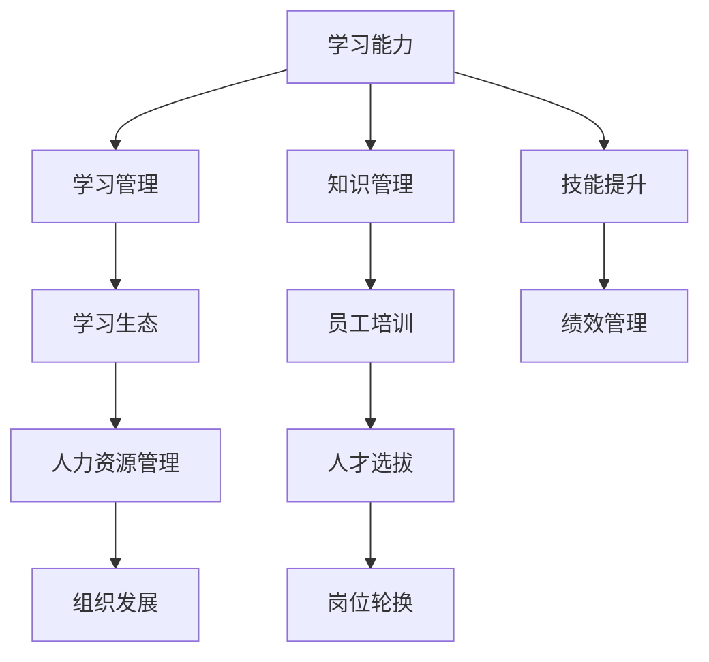

                 

# 学习能力与管理者的长期发展

> 关键词：学习能力, 学习管理, 组织发展, 人力资源, 技能提升

## 1. 背景介绍

### 1.1 问题由来
在当今快速变化的商业环境中，学习能力已成为组织和员工的核心竞争力。特别是在技术快速迭代、市场竞争激烈的背景下，拥有卓越学习能力的员工和管理者能更迅速地适应变化，抓住机遇，推动组织持续发展。然而，现实中，如何系统性地管理、培养和提升学习能力，却往往成为困扰企业和员工的问题。

### 1.2 问题核心关键点
学习能力管理的关键在于构建一个系统的、持续的学习生态，包括明确的学习目标、有效的学习策略、多样化的学习资源和工具、以及持续的评估和反馈机制。如何设计这样一个系统，并在实际应用中取得显著效果，是本文聚焦的核心问题。

### 1.3 问题研究意义
探讨学习能力与管理者的长期发展，对于提升组织竞争力、促进员工成长、推动人力资源管理创新具有重要意义：

1. **提升组织竞争力**：通过系统化地提升员工学习能力，企业能够更快地吸收新技术、适应市场变化，增强其在激烈竞争中的生存和发展能力。
2. **促进员工成长**：通过量身定制的学习计划和资源，员工可以获得个人职业发展所需的专业知识和技能，实现职业生涯的快速成长。
3. **推动人力资源管理创新**：学习能力管理不仅是提升员工技能的手段，更是新的人力资源管理方法，能够为企业带来更高效的人才开发和利用方式。

## 2. 核心概念与联系

### 2.1 核心概念概述

为更好地理解学习能力与管理者的长期发展，本节将介绍几个密切相关的核心概念：

- **学习能力**：指个体或组织获取、理解、应用新知识和技能的能力。学习能力包括认知能力、适应能力、创新能力等多个维度。

- **学习管理**：指组织或个人有计划、有系统地管理和优化学习过程的策略和活动。学习管理涉及学习目标设定、学习资源分配、学习活动设计、评估和反馈等多个环节。

- **学习生态**：指支持学习活动发生和持续的环境，包括组织文化、学习工具、知识库、学习社区等。一个良好的学习生态能够激发员工的学习热情，促进知识共享和技能提升。

- **人力资源管理**：指通过规划、吸引、培养、评估和激励等活动，最大化人力资源的价值。人力资源管理包括招聘、培训、绩效管理等多个方面。

- **组织发展**：指通过有效利用人力资源和管理活动，推动组织的战略目标实现和持续改进。组织发展强调的是通过提升员工能力来增强组织竞争力。

这些核心概念之间的逻辑关系可以通过以下Mermaid流程图来展示：



这个流程图展示了几组核心概念及其之间的逻辑关系：

1. 学习能力通过学习管理得到系统的提升和优化。
2. 学习管理依赖于学习生态的支持，学习生态又受到人力资源管理的推动。
3. 学习生态中的知识管理、员工培训、技能提升等环节共同促进员工的学习过程。
4. 绩效管理、人才选拔、岗位轮换等活动，为员工的学习和成长提供了机会和激励。
5. 组织发展则是一个综合性的目标，需要通过提升员工能力来实现。

## 3. 核心算法原理 & 具体操作步骤
### 3.1 算法原理概述

学习能力与管理者的长期发展，本质上是一个系统的、动态的学习管理过程。其核心思想是：通过系统的学习目标设定、有效的学习策略设计、多样化的学习资源和工具支持，以及持续的评估和反馈，逐步提升员工的学习能力和组织的发展水平。

形式化地，假设组织中有N名员工，初始学习能力为 $\theta$，目标为提升到 $\hat{\theta}$。学习管理过程可以视为一系列优化问题的求解，其目标函数为：

$$
\hat{\theta} = \mathop{\arg\max}_{\theta} \sum_{i=1}^N f_i(\theta)
$$

其中 $f_i$ 为第 $i$ 名员工的学习函数，表示其学习能力和组织贡献的提升。约束条件包括时间、资源、组织目标等。

学习管理过程通常包括以下几个关键步骤：

- **目标设定**：明确员工的学习目标，确定短期和长期的学习目标，并进行优先级排序。
- **策略设计**：设计适合员工的学习策略，包括学习内容、学习方法、学习时间等。
- **资源配置**：分配学习所需的资源，如学习工具、培训课程、指导教练等。
- **过程监控**：通过学习管理系统或工具，实时监控员工的学习进度和效果，提供必要的支持和反馈。
- **评估反馈**：定期评估学习效果，对员工的学习策略和资源配置进行调整。
- **持续改进**：根据评估结果，不断优化学习管理策略，提高整体学习效率。

### 3.2 算法步骤详解

基于上述原理，学习能力管理的具体步骤包括：

**Step 1: 目标设定**
- 根据组织的战略目标，设定员工的学习目标，包括知识掌握、技能提升、职业发展等。
- 将学习目标细分为短期和长期目标，并进行优先级排序。

**Step 2: 策略设计**
- 针对每个员工，设计个性化的学习策略，包括学习内容、方法、时间等。
- 考虑员工的学习风格、职业发展路径等因素，制定差异化的学习计划。

**Step 3: 资源配置**
- 根据学习计划，分配学习所需的资源，如培训课程、学习工具、指导教练等。
- 确保资源配置合理，满足员工的学习需求。

**Step 4: 过程监控**
- 通过学习管理系统或工具，实时监控员工的学习进度和效果。
- 提供及时的反馈和支持，确保员工的学习顺利进行。

**Step 5: 评估反馈**
- 定期评估员工的学习效果，如知识掌握、技能提升等。
- 根据评估结果，对学习策略和资源配置进行调整。

**Step 6: 持续改进**
- 基于评估反馈，不断优化学习管理策略。
- 持续关注学习生态的改善，促进学习活动的持续开展。

### 3.3 算法优缺点

学习能力管理的学习过程具有以下优点：

1. **系统化管理**：通过系统化的学习目标设定和策略设计，使学习过程更加有序和高效。
2. **个性化定制**：考虑员工个体差异，设计差异化的学习计划，满足不同员工的需求。
3. **持续评估与优化**：通过定期评估和反馈机制，及时调整学习策略和资源配置，确保学习效果最大化。
4. **提升组织能力**：通过提升员工的学习能力，推动组织整体能力的提升。

同时，该方法也存在一定的局限性：

1. **成本较高**：系统化的学习管理和资源配置需要较高的投入，包括资金、时间和人力资源。
2. **执行难度大**：复杂的学习目标设定和策略设计，需要细致的规划和管理，实际操作中可能面临执行难度。
3. **效果评估复杂**：学习效果的评估涉及多维度的指标，如知识掌握、技能提升、创新能力等，评估方法复杂。

尽管存在这些局限性，但就目前而言，学习能力管理的学习过程是推动组织和员工长期发展的有效途径。

### 3.4 算法应用领域

学习能力管理的学习过程在多个领域得到了广泛应用，包括但不限于：

- **人力资源管理**：通过系统的学习管理，提升员工技能，优化人力资源配置。
- **组织发展**：通过提升员工的学习能力，推动组织战略目标的实现。
- **职业发展**：帮助员工明确职业目标，制定个性化的学习计划，促进职业成长。
- **教育培训**：在教育机构中，通过系统的学习管理，提升学生的学习效果。
- **企业培训**：在企业中，通过系统的学习管理，提升员工的专业知识和技能。
- **政府培训**：在政府部门中，通过系统的学习管理，提升公务员的业务能力和服务水平。

## 4. 数学模型和公式 & 详细讲解  
### 4.1 数学模型构建

学习能力管理的学习过程可以通过数学模型进行形式化描述。假设组织中有N名员工，每个员工的学习能力为 $\theta_i$，组织的目标为最大化全体员工的学习能力总和。

定义组织的目标函数为：

$$
\hat{\theta} = \mathop{\arg\max}_{\theta} \sum_{i=1}^N f_i(\theta_i)
$$

其中 $f_i$ 为第 $i$ 名员工的学习函数，可以表示为：

$$
f_i(\theta_i) = k_i \cdot (\theta_i - \theta_{i,0})
$$

其中 $k_i$ 为第 $i$ 名员工的权重，$\theta_{i,0}$ 为其初始学习能力。

### 4.2 公式推导过程

以下我们以员工技能提升为例，推导学习效果评估的公式。

假设员工通过学习课程提升了其在某项技能上的熟练度，提升量为 $\Delta_i$，初始熟练度为 $\theta_{i,0}$，提升后熟练度为 $\theta_i$。则学习效果评估公式为：

$$
f_i(\theta_i) = k_i \cdot (\theta_i - \theta_{i,0})
$$

其中 $k_i$ 为第 $i$ 名员工的权重，通常与其工作价值和职位重要性相关。

对于多个员工的学习效果，组织的目标函数为：

$$
\hat{\theta} = \mathop{\arg\max}_{\theta} \sum_{i=1}^N k_i \cdot (\theta_i - \theta_{i,0})
$$

通过求解上述最优化问题，可以确定提升全体员工学习能力的最佳策略。

### 4.3 案例分析与讲解

以某大型科技公司为例，分析学习能力管理的具体实施过程：

1. **目标设定**：公司根据战略目标，设定了全员的技能提升计划，包括编程能力、项目管理能力、创新能力等。
2. **策略设计**：针对不同部门的员工，设计了差异化的学习策略，如技术部门重点提升编程能力，产品部门重点提升项目管理能力。
3. **资源配置**：公司购买了多门线上线下培训课程，聘请了数名资深导师，为员工提供了丰富的学习资源。
4. **过程监控**：公司建立了学习管理系统，实时监控员工的学习进度和效果，定期收集反馈。
5. **评估反馈**：公司定期进行技能评估，如编程能力测试、项目评估等，根据评估结果调整学习策略和资源配置。
6. **持续改进**：基于评估反馈，公司不断优化学习管理策略，如增加培训课程、调整导师分配等。

通过上述系统的学习能力管理，该公司在短时间内显著提升了员工的技能水平，推动了组织的快速发展。

## 5. 项目实践：代码实例和详细解释说明
### 5.1 开发环境搭建

在进行学习能力管理系统的开发前，我们需要准备好开发环境。以下是使用Python进行开发的环境配置流程：

1. 安装Anaconda：从官网下载并安装Anaconda，用于创建独立的Python环境。

2. 创建并激活虚拟环境：
```bash
conda create -n learning-env python=3.8 
conda activate learning-env
```

3. 安装PyTorch：根据CUDA版本，从官网获取对应的安装命令。例如：
```bash
conda install pytorch torchvision torchaudio cudatoolkit=11.1 -c pytorch -c conda-forge
```

4. 安装Flask：
```bash
pip install flask
```

5. 安装SQLAlchemy：
```bash
pip install sqlalchemy
```

6. 安装Jupyter Notebook：
```bash
pip install jupyter
```

完成上述步骤后，即可在`learning-env`环境中开始学习能力管理系统的开发。

### 5.2 源代码详细实现

这里我们以一个简单的学习管理系统为例，给出使用Python Flask框架和SQLAlchemy库开发的能力提升追踪系统的代码实现。

首先，定义数据库模型：

```python
from sqlalchemy import create_engine, Column, Integer, String, Float, DateTime, MetaData, Table, ForeignKey
from sqlalchemy.orm import relationship, sessionmaker

engine = create_engine('sqlite:///learning.db', echo=True)

metadata = MetaData()

class User(Base):
    __tablename__ = 'users'
    id = Column(Integer, primary_key=True)
    name = Column(String(50), nullable=False)
    email = Column(String(50), unique=True, nullable=False)
    created_at = Column(DateTime, nullable=False, default=datetime.utcnow)
    study_plans = relationship('StudyPlan', back_populates='user')

class StudyPlan(Base):
    __tablename__ = 'study_plans'
    id = Column(Integer, primary_key=True)
    user_id = Column(Integer, ForeignKey('users.id'), nullable=False)
    title = Column(String(100), nullable=False)
    description = Column(String(255), nullable=False)
    start_date = Column(DateTime, nullable=False, default=datetime.utcnow)
    end_date = Column(DateTime, nullable=False)
    status = Column(String(20), nullable=False, default='pending')
    skills = relationship('Skill', back_populates='study_plan')

class Skill(Base):
    __tablename__ = 'skills'
    id = Column(Integer, primary_key=True)
    name = Column(String(50), nullable=False)
    study_plan_id = Column(Integer, ForeignKey('study_plans.id'), nullable=False)
    progress = Column(Float, nullable=False, default=0.0)

metadata.create_all(engine)
Session = sessionmaker(bind=engine)
```

然后，定义用户管理功能：

```python
from flask import Flask, render_template, request, redirect, url_for

app = Flask(__name__)

@app.route('/')
def index():
    session = Session()
    users = session.query(User).all()
    return render_template('index.html', users=users)

@app.route('/users/create', methods=['GET', 'POST'])
def create_user():
    if request.method == 'POST':
        name = request.form['name']
        email = request.form['email']
        session.add(User(name=name, email=email))
        session.commit()
        return redirect(url_for('index'))
    return render_template('create_user.html')

@app.route('/users/<int:id>/edit', methods=['GET', 'POST'])
def edit_user(id):
    if request.method == 'POST':
        user = session.query(User).filter_by(id=id).first()
        user.name = request.form['name']
        user.email = request.form['email']
        session.commit()
        return redirect(url_for('index'))
    return render_template('edit_user.html', user=user)

@app.route('/users/<int:id>/delete', methods=['POST'])
def delete_user(id):
    user = session.query(User).filter_by(id=id).first()
    session.delete(user)
    session.commit()
    return redirect(url_for('index'))
```

接着，定义学习计划管理功能：

```python
@app.route('/study_plans')
def study_plans():
    session = Session()
    study_plans = session.query(StudyPlan).all()
    return render_template('study_plans.html', study_plans=study_plans)

@app.route('/study_plans/create', methods=['GET', 'POST'])
def create_study_plan():
    if request.method == 'POST':
        title = request.form['title']
        description = request.form['description']
        user_id = request.form['user_id']
        session.add(StudyPlan(title=title, description=description, user_id=user_id))
        session.commit()
        return redirect(url_for('study_plans'))
    return render_template('create_study_plan.html')

@app.route('/study_plans/<int:id>/edit', methods=['GET', 'POST'])
def edit_study_plan(id):
    if request.method == 'POST':
        study_plan = session.query(StudyPlan).filter_by(id=id).first()
        study_plan.title = request.form['title']
        study_plan.description = request.form['description']
        session.commit()
        return redirect(url_for('study_plans'))
    return render_template('edit_study_plan.html', study_plan=study_plan)

@app.route('/study_plans/<int:id>/delete', methods=['POST'])
def delete_study_plan(id):
    study_plan = session.query(StudyPlan).filter_by(id=id).first()
    session.delete(study_plan)
    session.commit()
    return redirect(url_for('study_plans'))
```

最后，定义技能管理功能：

```python
@app.route('/skills')
def skills():
    session = Session()
    skills = session.query(Skill).all()
    return render_template('skills.html', skills=skills)

@app.route('/skills/create', methods=['GET', 'POST'])
def create_skill():
    if request.method == 'POST':
        name = request.form['name']
        study_plan_id = request.form['study_plan_id']
        progress = request.form['progress']
        session.add(Skill(name=name, study_plan_id=study_plan_id, progress=progress))
        session.commit()
        return redirect(url_for('skills'))
    return render_template('create_skill.html')

@app.route('/skills/<int:id>/edit', methods=['GET', 'POST'])
def edit_skill(id):
    if request.method == 'POST':
        skill = session.query(Skill).filter_by(id=id).first()
        skill.name = request.form['name']
        skill.progress = request.form['progress']
        session.commit()
        return redirect(url_for('skills'))
    return render_template('edit_skill.html', skill=skill)

@app.route('/skills/<int:id>/delete', methods=['POST'])
def delete_skill(id):
    skill = session.query(Skill).filter_by(id=id).first()
    session.delete(skill)
    session.commit()
    return redirect(url_for('skills'))
```

在上述代码中，我们通过Flask框架构建了一个简单的学习管理系统，实现了用户、学习计划和技能管理功能。数据库使用SQLAlchemy进行管理和查询，前端使用Jinja2模板引擎渲染HTML页面。

### 5.3 代码解读与分析

让我们再详细解读一下关键代码的实现细节：

**User类**：
- `__tablename__`：定义数据库表名。
- `id`：主键，自动递增。
- `name`：用户姓名，必填。
- `email`：用户邮箱，唯一且必填。
- `created_at`：创建时间，自动设置为当前时间。
- `study_plans`：与`StudyPlan`类的多对一关系，表示用户拥有的学习计划。

**StudyPlan类**：
- `__tablename__`：定义数据库表名。
- `id`：主键，自动递增。
- `user_id`：外键，关联到`User`类的`id`字段。
- `title`：学习计划标题，必填。
- `description`：学习计划描述，必填。
- `start_date`：学习计划开始时间，必填。
- `end_date`：学习计划结束时间，必填。
- `status`：学习计划状态，默认为`pending`。
- `skills`：与`Skill`类的多对一关系，表示学习计划包含的技能。

**Skill类**：
- `__tablename__`：定义数据库表名。
- `id`：主键，自动递增。
- `name`：技能名称，必填。
- `study_plan_id`：外键，关联到`StudyPlan`类的`id`字段。
- `progress`：技能进展，必填。

在上述代码中，我们定义了三个基本的数据库模型，并通过Flask框架提供了增删改查功能。系统通过SQLAlchemy进行数据库操作，Flask提供前端界面，使用Jinja2模板引擎渲染HTML页面。通过这样的设计，系统能够很好地支持学习计划和技能的管理。

## 6. 实际应用场景
### 6.1 智能学习系统

基于学习能力管理的学习系统，可以广泛应用于智能学习系统的构建。传统学习系统往往难以满足个性化学习需求，无法实时调整学习进度，导致学习效果差强人意。通过学习管理系统，可以实现个性化的学习计划和进度跟踪，显著提升学习效果。

在技术实现上，可以集成在线学习平台，如MOOC、在线课程等，根据员工的学习计划和进度，动态推荐学习资源。系统还可以集成AI辅导功能，根据学习效果实时调整学习策略，推荐更适合的学习路径。如此构建的智能学习系统，能更好地满足员工的学习需求，提高学习效率。

### 6.2 企业培训管理系统

企业培训管理系统的目标是通过系统的学习管理，提升员工的专业技能，推动组织的持续发展。该系统可以整合内外部培训资源，包括线上课程、线下培训、导师辅导等，根据员工的学习需求和学习进度，动态调整培训计划。

在实现上，可以通过学习能力管理系统进行员工学习计划的创建、修改和跟踪，同时集成企业内部的培训资源管理系统，提供丰富的学习内容和培训活动。系统还可以根据员工的学习效果，推荐适合的培训课程和导师辅导，进一步提升培训效果。

### 6.3 教育机构学习管理系统

教育机构学习管理系统主要用于学生的学习管理和教育效果的提升。通过系统化的学习管理，能够更好地引导学生制定学习计划，跟踪学习进度，提升学习效果。系统可以集成学习管理系统、考试系统、辅导系统等功能，形成全面的学生学习生态。

在技术实现上，可以通过学习管理系统进行学生学习计划的创建、修改和跟踪，同时集成教育机构的教学资源，如教材、课程视频等。系统还可以根据学生的学习效果，推荐适合的学习内容和辅导资源，提升学习效果。

### 6.4 未来应用展望

随着学习能力管理系统的不断完善和应用，其将在更多领域得到广泛应用，带来更高效的学习管理和服务体验。

在智慧城市建设中，学习管理系统可以用于公务员能力提升、市民素质教育等方面，推动城市管理和市民素质的提升。

在企业运营管理中，学习管理系统可以用于员工技能提升、岗位培训等方面，推动企业持续发展和创新。

在政府治理中，学习管理系统可以用于公务员培训、知识更新等方面，提升政府决策和执行力。

此外，在学习管理系统的发展过程中，还将涌现更多新技术和功能，如AI辅导、虚拟现实(VR)教学、智能推荐等，为学习者带来更加丰富和互动的学习体验。

## 7. 工具和资源推荐
### 7.1 学习资源推荐

为了帮助开发者系统掌握学习能力管理的学习过程，这里推荐一些优质的学习资源：

1. **《学习型组织》（The Learning Organization）**：由彼得·圣吉（Peter Senge）所著，全面介绍了学习型组织的构建和管理，为学习型组织的发展提供了理论基础和实践指南。

2. **《学习之路》（Learning to Learn）**：由李笑来所著，介绍了系统化学习的方法和策略，帮助读者构建高效的学习系统。

3. **《深度学习：理论、实践与挑战》**：由Goodfellow、Bengio、Courville合著，深入浅出地介绍了深度学习理论、实践和应用，为深度学习的研究和应用提供了全面指导。

4. **Coursera、Udacity、edX等在线教育平台**：提供大量系统化学习课程，涵盖从基础到高级的各个领域，帮助学习者构建完善的知识体系。

5. **GitHub、CSDN等技术社区**：提供丰富的技术资料和代码示例，帮助开发者学习和实践。

通过对这些资源的学习实践，相信你一定能够系统掌握学习能力管理的学习过程，并用于解决实际的学习管理问题。

### 7.2 开发工具推荐

高效的开发离不开优秀的工具支持。以下是几款用于学习能力管理系统开发的常用工具：

1. **Flask**：轻量级Web框架，灵活、易用，适合快速开发小型应用。

2. **SQLAlchemy**：Python ORM工具，支持多种数据库，提供丰富的数据操作功能。

3. **Jinja2**：模板引擎，支持动态渲染HTML页面，易于扩展和维护。

4. **Jupyter Notebook**：交互式编程环境，支持Python、R、MATLAB等多种语言，适合数据处理和模型开发。

5. **PostgreSQL**：开源关系型数据库，支持复杂的查询操作，适合存储和管理大量数据。

合理利用这些工具，可以显著提升学习能力管理系统的开发效率，加快创新迭代的步伐。

### 7.3 相关论文推荐

学习能力管理的学习过程涉及多学科知识，包括心理学、管理学、教育学等。以下是几篇经典的研究论文，推荐阅读：

1. **《学习型组织及其管理模式研究》**：介绍学习型组织的理论基础和实践方法，为学习型组织的管理提供了指导。

2. **《基于数据驱动的学习管理系统设计》**：介绍了学习管理系统的设计方法和应用场景，为学习管理系统的开发提供了参考。

3. **《学习效率的提升方法研究》**：研究了多种提升学习效率的方法，包括时间管理、学习方法、学习资源等，为提升学习能力提供了指导。

4. **《组织学习能力的提升策略》**：探讨了提升组织学习能力的方法和策略，为组织的发展提供了指导。

这些论文代表了大学习能力管理的学习过程的发展脉络。通过学习这些前沿成果，可以帮助研究者把握学科前进方向，激发更多的创新灵感。

## 8. 总结：未来发展趋势与挑战

### 8.1 研究成果总结

本文对学习能力与管理者的长期发展进行了全面系统的介绍。首先阐述了学习能力管理的重要性和实施背景，明确了学习能力管理的系统化管理、个性化定制、持续评估与优化等核心要素。其次，从原理到实践，详细讲解了学习能力管理的数学模型和实现过程，提供了完整的代码实例和详细解释说明。同时，本文还探讨了学习能力管理在多个实际应用场景中的应用，展示了其在智能学习系统、企业培训管理、教育机构学习管理系统等领域的巨大潜力。

通过本文的系统梳理，可以看到，学习能力管理在推动组织和员工长期发展、提升整体竞争力方面具有重要意义。未来的学习管理系统将具备更加系统化、个性化、智能化的特点，为员工的学习和发展提供更高效、更灵活、更智能的支持。

### 8.2 未来发展趋势

学习能力管理的学习过程将呈现以下几个发展趋势：

1. **智能化学习**：通过引入AI技术，学习管理系统将具备更加智能化的学习推荐和辅导功能，能够根据学习效果和学习风格，提供个性化的学习资源和路径。

2. **多样化学习资源**：学习管理系统将整合更多样化的学习资源，包括在线课程、线下培训、虚拟现实(VR)教学等，满足不同学习者的需求。

3. **实时化管理**：通过实时化管理，学习管理系统将能够实时跟踪学习进度，提供即时反馈和支持，提升学习效果。

4. **社区化学习**：学习管理系统将引入社区化学习模式，促进学习者之间的交流和合作，共同提升学习效果。

5. **自适应学习**：学习管理系统将具备自适应学习功能，根据学习者的反馈和数据，动态调整学习策略和资源配置。

这些趋势将进一步推动学习能力管理的学习过程向更加智能、高效、灵活的方向发展，为学习者提供更加丰富和个性化的学习体验。

### 8.3 面临的挑战

尽管学习能力管理的学习过程已经取得了一定的进展，但在迈向更加智能化、普适化应用的过程中，它仍面临以下挑战：

1. **数据隐私问题**：学习管理系统需要收集和处理大量学习者的数据，如何保护数据隐私，避免数据泄露和滥用，是亟需解决的问题。

2. **技术复杂度**：学习管理系统涉及多种技术，如Web开发、数据库管理、AI技术等，开发和维护复杂度较高。

3. **用户体验**：学习管理系统需要具备良好的用户体验，易于使用和操作，才能吸引更多学习者的使用。

4. **效果评估**：学习效果评估涉及多维度的指标，如知识掌握、技能提升、创新能力等，评估方法复杂。

5. **公平性和普适性**：如何确保学习管理系统的公平性和普适性，使得不同背景和学习需求的学习者都能从中受益，是一个重要课题。

6. **持续改进**：学习管理系统需要不断优化和学习管理策略，才能保持其效果和竞争力。

正视学习能力管理面临的这些挑战，积极应对并寻求突破，将是大学习能力管理学习过程走向成熟的必由之路。相信随着学界和产业界的共同努力，这些挑战终将一一被克服，学习能力管理学习过程必将在提升员工和组织发展方面发挥更大的作用。

### 8.4 研究展望

面向未来，学习能力管理的学习过程需要在以下几个方面寻求新的突破：

1. **引入更先进的AI技术**：通过引入更先进的AI技术，如自然语言处理、强化学习等，提升学习管理系统智能化水平，提供更加智能化的学习推荐和辅导。

2. **融合更多技术领域**：学习能力管理的学习过程需要融合更多技术领域，如大数据、云计算、物联网等，推动学习管理系统向更加智能化、高效化的方向发展。

3. **引入更多学习模式**：学习能力管理的学习过程需要引入更多学习模式，如自适应学习、社区化学习、混合学习等，提升学习效果和用户体验。

4. **加强数据隐私保护**：学习能力管理的学习过程需要加强数据隐私保护，确保数据的安全性和合法性，增强用户信任。

5. **提升公平性和普适性**：学习能力管理的学习过程需要提升公平性和普适性，使得不同背景和学习需求的学习者都能从中受益，增强系统的社会价值。

这些研究方向将引领学习能力管理学习过程向更加智能、高效、普适化的方向发展，为学习者提供更加丰富和个性化的学习体验，推动学习管理系统在更多领域得到应用。

## 9. 附录：常见问题与解答

**Q1：学习能力管理对员工发展有何影响？**

A: 学习能力管理通过系统化的学习管理，能够帮助员工制定个性化的学习计划，跟踪学习进度，提升学习效果。通过提升员工的专业技能和综合素质，员工能够更好地适应工作变化，提升职业竞争力，推动个人职业成长。

**Q2：如何衡量学习效果？**

A: 学习效果的衡量可以从知识掌握、技能提升、创新能力等多个维度进行。常见的衡量方法包括考试、测试、评估报告等。在实践中，可以根据具体的学习目标和任务，设计合适的评估指标，进行系统化的评估。

**Q3：学习能力管理系统应该如何设计？**

A: 学习能力管理系统的设计需要考虑以下几个关键要素：
1. 学习目标设定：明确学习目标，设定短期和长期目标。
2. 学习策略设计：设计适合员工的学习策略，包括学习内容、方法、时间等。
3. 资源配置：分配学习所需的资源，如学习工具、培训课程、指导教练等。
4. 过程监控：通过学习管理系统或工具，实时监控员工的学习进度和效果。
5. 评估反馈：定期评估学习效果，对员工的学习策略和资源配置进行调整。
6. 持续改进：基于评估反馈，不断优化学习管理策略。

**Q4：学习能力管理对组织发展的意义是什么？**

A: 学习能力管理通过提升员工的学习能力，推动组织的持续发展。员工具备更强的学习能力和专业技能，能够更快地吸收新技术、适应市场变化，增强企业在激烈竞争中的生存和发展能力。

**Q5：学习管理系统在企业培训中的应用如何？**

A: 学习管理系统可以用于企业培训管理，整合内外部培训资源，根据员工的学习需求和学习进度，动态调整培训计划。系统可以集成企业内部的培训资源管理系统，提供丰富的学习内容和培训活动。同时，根据员工的学习效果，推荐适合的培训课程和导师辅导，进一步提升培训效果。

这些问题的解答，有助于更好地理解和学习能力管理的学习过程及其应用价值。通过不断优化和学习管理策略，相信学习能力管理学习过程将为员工和组织带来更大的发展空间和潜力。

---

作者：禅与计算机程序设计艺术 / Zen and the Art of Computer Programming

