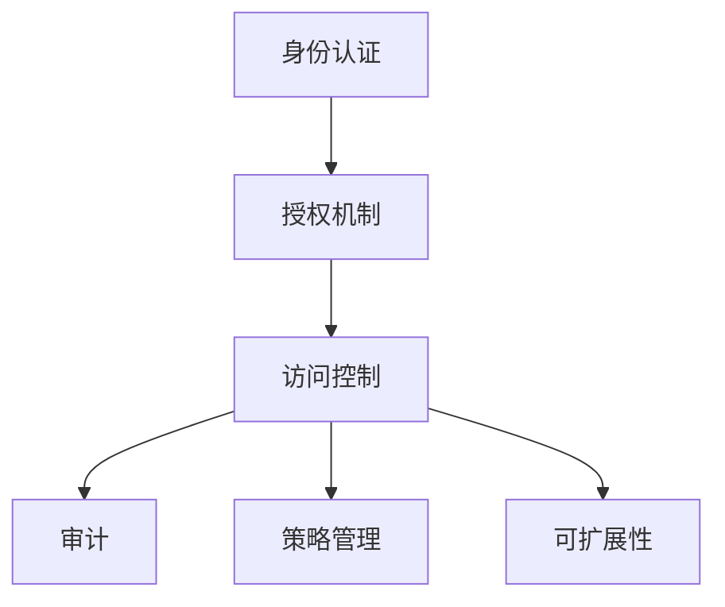

                 

## 1. 背景介绍

### 1.1 问题由来
在当今数字化时代，应用程序的访问控制成为保障信息安全、保护用户隐私、防止数据泄露的关键措施。特别是对于金融、医疗、政府等敏感领域，用户数据的安全性和隐私保护显得尤为重要。应用程序的访问控制机制不完善，可能会导致数据泄露、身份盗窃、服务中断等严重后果。因此，研究和优化访问控制策略，确保应用程序的安全性，已成为信息安全领域的重要任务。

### 1.2 问题核心关键点
应用程序访问控制（Access Control, AC）主要涉及以下几个核心问题：

1. **身份验证（Authentication）**：确定用户身份的有效性，防止非法用户进入系统。
2. **授权（Authorization）**：根据用户身份和访问请求，决定用户是否有权限访问某个资源。
3. **审计（Audit）**：记录和监控所有访问操作，以便事后追溯和分析。
4. **策略管理（Policy Management）**：管理和维护访问控制策略，以应对动态的访问需求和变化的用户角色。
5. **可扩展性（Scalability）**：系统应能够适应不断增长的用户和资源规模。

### 1.3 问题研究意义
研究应用程序访问控制技术，对于提升信息系统的安全性、保障用户隐私、优化资源利用、增强系统可维护性具有重要意义：

1. **增强系统安全性**：通过严格的访问控制策略，防止未授权访问，保护敏感数据不被窃取或篡改。
2. **保障用户隐私**：确保用户数据仅在合法授权下被访问，避免个人隐私泄露。
3. **优化资源利用**：合理分配资源，防止资源浪费和滥用。
4. **提高系统可维护性**：灵活的策略管理机制，便于对系统进行调整和优化。
5. **支持合规性**：符合各种法律法规和行业标准，如GDPR、HIPAA等，提升系统的合规性。

## 2. 核心概念与联系

### 2.1 核心概念概述

为更好地理解应用程序访问控制方法，本节将介绍几个密切相关的核心概念：

- **访问控制（Access Control）**：管理访问权限的过程，确保只有授权用户才能访问系统资源。
- **身份认证（Authentication）**：验证用户身份的过程，通过密码、生物识别等方式确认用户真实身份。
- **授权机制（Authorization）**：根据用户身份和访问请求，决定用户是否被授权访问资源。
- **RBAC模型**：基于角色的访问控制模型，将用户与权限分离，简化授权管理。
- **ABAC模型**：基于属性的访问控制模型，根据用户属性（如地理位置、设备状态等）动态调整权限。
- **LDAP协议**：轻量级目录访问协议，用于管理用户和权限信息，支持单点登录。

这些概念之间的逻辑关系可以通过以下Mermaid流程图来展示：



这个流程图展示了的核心概念及其之间的关系：

1. 身份认证是访问控制的前提，用于验证用户的真实身份。
2. 授权机制根据用户身份和访问请求，决定用户是否被授权访问资源。
3. 访问控制是整个系统的核心，负责管理和监控用户访问行为。
4. 审计记录和监控所有访问操作，以便事后追溯和分析。
5. 策略管理用于管理和维护访问控制策略，支持动态调整和优化。
6. 可扩展性确保系统能够适应不断增长的用户和资源规模。

这些概念共同构成了应用程序访问控制系统的基本框架，帮助开发者构建安全、高效、可扩展的应用程序。

## 3. 核心算法原理 & 具体操作步骤

### 3.1 算法原理概述

应用程序访问控制的核心算法原理是利用身份认证和授权机制，结合审计和策略管理，确保只有授权用户才能访问系统资源。以下是访问控制的几个核心步骤：

1. **身份认证**：通过密码、生物识别等方式验证用户身份，确保其合法性。
2. **授权决策**：根据用户身份和访问请求，使用策略引擎进行授权决策，确定用户是否有权限访问资源。
3. **访问控制**：根据授权决策结果，允许或拒绝用户访问请求。
4. **审计记录**：记录和监控所有访问操作，包括用户身份、访问时间、资源信息等，以便事后追溯和分析。
5. **策略管理**：管理和维护访问控制策略，包括用户角色、权限、策略规则等，支持动态调整和优化。

### 3.2 算法步骤详解

以下是一个典型的应用程序访问控制系统的算法步骤详解：

**Step 1: 身份认证**
- 用户输入用户名和密码。
- 系统验证用户名和密码的正确性。
- 如果验证通过，生成身份令牌。
- 将身份令牌存储在会话中，以便后续授权决策使用。

**Step 2: 授权决策**
- 用户发起访问请求，携带身份令牌。
- 系统从会话中获取身份令牌，并进行解析。
- 根据用户角色和访问请求，使用策略引擎进行授权决策。
- 如果用户有权限访问，则进行下一步；否则拒绝访问。

**Step 3: 访问控制**
- 根据授权决策结果，允许或拒绝用户访问请求。
- 记录访问操作信息，包括用户身份、访问时间、资源信息等。

**Step 4: 审计记录**
- 记录所有访问操作信息，存储在日志文件中。
- 定期生成审计报告，进行安全分析。

**Step 5: 策略管理**
- 管理员定义访问控制策略，包括用户角色、权限、策略规则等。
- 策略引擎根据策略规则进行授权决策。
- 定期对策略进行审核和更新，确保策略的有效性和安全性。

### 3.3 算法优缺点

应用程序访问控制方法具有以下优点：

1. **安全性高**：通过严格的授权机制，防止未授权访问，保护系统资源。
2. **灵活性高**：支持基于角色的访问控制和基于属性的访问控制，灵活应对各种场景。
3. **可扩展性好**：系统能够适应不断增长的用户和资源规模，支持动态调整和优化。
4. **可维护性强**：策略管理机制简单，便于管理员对系统进行调整和优化。

同时，该方法也存在一定的局限性：

1. **复杂性高**：授权决策和策略管理复杂，需要专业的知识和技能。
2. **性能开销大**：频繁的授权决策和策略计算，可能会影响系统性能。
3. **单点故障**：授权决策和策略管理依赖于中央服务器，单点故障可能导致系统瘫痪。

尽管存在这些局限性，但就目前而言，应用程序访问控制方法是保障系统安全性的重要手段。未来相关研究的重点在于如何进一步降低授权决策和策略管理的复杂性，提高系统性能和可扩展性，同时兼顾安全性和可维护性等因素。

### 3.4 算法应用领域

应用程序访问控制在多个领域中都有广泛应用，例如：

- 金融行业：保护用户金融数据安全，防止非法交易和欺诈。
- 医疗行业：保护患者隐私，防止医疗数据泄露。
- 政府机构：保护政府数据安全，防止敏感信息泄露。
- 企业内部系统：保护企业数据安全，防止内部数据泄露和滥用。
- 公共服务：保护用户隐私，防止数据滥用和泄露。

此外，应用程序访问控制方法还适用于各种类型的应用场景，如Web应用、移动应用、物联网设备等，为不同领域的系统提供了强有力的安全保障。

## 4. 数学模型和公式 & 详细讲解 & 举例说明

### 4.1 数学模型构建

应用程序访问控制的核心数学模型包括以下几个部分：

- **用户（User）**：系统中的用户实体，可以是一个组织、一个部门或一个个人。
- **角色（Role）**：系统中的角色实体，代表一组用户的集合，通常与特定的任务或职责相关。
- **权限（Permission）**：系统中的权限实体，表示对特定资源的访问权限，如读取、写入、删除等。
- **策略（Policy）**：系统中的策略实体，定义了用户、角色和权限之间的关系，控制着授权决策的逻辑。

定义用户集合 $U=\{u_1, u_2, ..., u_n\}$，角色集合 $R=\{r_1, r_2, ..., r_m\}$，权限集合 $P=\{p_1, p_2, ..., p_k\}$，策略集合 $\Sigma=\{\sigma_1, \sigma_2, ..., \sigma_l\}$。策略 $\sigma_i$ 表示为 $(u_i, r_j, p_k)$，其中 $u_i$ 表示用户 $u_i$，$r_j$ 表示角色 $r_j$，$p_k$ 表示权限 $p_k$。

定义访问控制矩阵 $A$，其中 $A_{ij}$ 表示用户 $u_i$ 是否拥有角色 $r_j$ 的权限。$A_{ij}=1$ 表示用户 $u_i$ 拥有角色 $r_j$ 的权限，否则 $A_{ij}=0$。

定义访问控制策略 $\Pi$，其中 $\Pi_i$ 表示角色 $r_i$ 的权限集，即 $\Pi_i=\{p_1, p_2, ..., p_{k_i}\}$。

定义访问控制策略库 $\Phi$，其中 $\Phi=\{\Pi_1, \Pi_2, ..., \Pi_m\}$。

### 4.2 公式推导过程

根据上述定义，可以推导出如下的访问控制数学模型：

$$
\begin{aligned}
A &= \{A_{ij}\}_{i,j=1}^{n,m} \\
\Pi &= \{\{p_{1,j}\}_{j=1}^{k}\}_{i=1}^{m} \\
\Phi &= \{\{p_{i,1}, p_{i,2}, ..., p_{i,k_i}\}_{i=1}^{m}\}_{i=1}^{l}
\end{aligned}
$$

其中 $A_{ij}=1$ 表示用户 $u_i$ 拥有角色 $r_j$ 的权限，即用户 $u_i$ 属于角色 $r_j$ 的权限集 $\Pi_j$。策略 $\Pi_i$ 表示角色 $r_i$ 的权限集，即 $\Pi_i=\{p_{i,1}, p_{i,2}, ..., p_{i,k_i}\}$。策略库 $\Phi$ 表示所有策略的集合。

### 4.3 案例分析与讲解

以一个简单的示例来说明应用程序访问控制的数学模型：

假设有一个公司，有三个部门：销售部、财务部和IT部。每个部门都有一组用户和一组权限。销售部的用户包括张三、李四和王五，财务部的用户包括赵六和孙七，IT部的用户包括小李和小王。销售部的用户只能读取销售数据，财务部的用户只能读取财务数据，IT部的用户只能访问IT系统。公司的访问控制策略如下：

- 销售部用户 $u_1$ 只能读取销售数据 $p_1$。
- 财务部用户 $u_2$ 只能读取财务数据 $p_2$。
- IT部用户 $u_3$ 只能访问IT系统 $p_3$。

根据上述策略，可以构建访问控制矩阵 $A$：

$$
A = \begin{pmatrix}
0 & 1 & 0 \\
1 & 0 & 0 \\
0 & 0 & 1
\end{pmatrix}
$$

其中 $A_{11}=0$ 表示张三不拥有销售部的权限，$A_{12}=1$ 表示李四拥有销售部的权限，$A_{13}=0$ 表示王五不拥有销售部的权限。以此类推。

接下来，可以定义策略 $\Pi$ 和策略库 $\Phi$：

- 销售部策略 $\Pi_1=\{p_1\}$
- 财务部策略 $\Pi_2=\{p_2\}$
- IT部策略 $\Pi_3=\{p_3\}$
- 访问控制策略库 $\Phi=\{\Pi_1, \Pi_2, \Pi_3\}$

通过上述数学模型和公式，可以清晰地定义和描述应用程序访问控制的逻辑和规则，为系统的授权决策提供依据。

## 5. 项目实践：代码实例和详细解释说明

### 5.1 开发环境搭建

在进行应用程序访问控制系统的开发之前，我们需要准备好开发环境。以下是使用Python进行Django开发的环境配置流程：

1. 安装Anaconda：从官网下载并安装Anaconda，用于创建独立的Python环境。

2. 创建并激活虚拟环境：
```bash
conda create -n django-env python=3.8 
conda activate django-env
```

3. 安装Django：使用以下命令安装Django：
```bash
pip install Django
```

4. 安装其他依赖库：
```bash
pip install Pillow pytz django-axes
```

5. 安装MySQL数据库：从官网下载安装包，按照安装向导进行安装。

完成上述步骤后，即可在`django-env`环境中开始访问控制系统的开发。

### 5.2 源代码详细实现

这里我们以基于角色的访问控制为例，给出使用Django进行权限管理的PyTorch代码实现。

首先，定义权限管理模型：

```python
from django.db import models

class Permission(models.Model):
    name = models.CharField(max_length=255)
    description = models.TextField(null=True, blank=True)
    created_at = models.DateTimeField(auto_now_add=True)
    updated_at = models.DateTimeField(auto_now=True)

    def __str__(self):
        return self.name

class Role(models.Model):
    name = models.CharField(max_length=255)
    description = models.TextField(null=True, blank=True)
    created_at = models.DateTimeField(auto_now_add=True)
    updated_at = models.DateTimeField(auto_now=True)

    def __str__(self):
        return self.name

class User(models.Model):
    username = models.CharField(max_length=255, unique=True)
    password = models.CharField(max_length=255)
    roles = models.ManyToManyField(Role)
    created_at = models.DateTimeField(auto_now_add=True)
    updated_at = models.DateTimeField(auto_now=True)

    def __str__(self):
        return self.username
```

然后，定义视图和权限装饰器：

```python
from django.contrib.auth.decorators import login_required
from django.shortcuts import render
from django.http import HttpResponseForbidden

@login_required
def dashboard(request):
    return render(request, 'dashboard.html')

@login_required
def user_profile(request, user_id):
    user = User.objects.get(pk=user_id)
    return render(request, 'user_profile.html', {'user': user})

@login_required
def edit_user(request, user_id):
    user = User.objects.get(pk=user_id)
    if request.method == 'POST':
        user.username = request.POST['username']
        user.password = request.POST['password']
        user.save()
        return HttpResponse('User updated.')
    return render(request, 'edit_user.html', {'user': user})

@login_required
def assign_role(request, user_id):
    user = User.objects.get(pk=user_id)
    if request.method == 'POST':
        role_id = request.POST['role_id']
        user.roles.add(Role.objects.get(pk=role_id))
        return HttpResponse('Role assigned.')
    return render(request, 'assign_role.html', {'user': user})

@login_required
def remove_role(request, user_id):
    user = User.objects.get(pk=user_id)
    if request.method == 'POST':
        role_id = request.POST['role_id']
        user.roles.remove(Role.objects.get(pk=role_id))
        return HttpResponse('Role removed.')
    return render(request, 'remove_role.html', {'user': user})

@login_required
def permission_list(request):
    permissions = Permission.objects.all()
    return render(request, 'permission_list.html', {'permissions': permissions})

@login_required
def add_permission(request):
    if request.method == 'POST':
        name = request.POST['name']
        description = request.POST['description']
        Permission.objects.create(name=name, description=description)
        return HttpResponse('Permission added.')
    return render(request, 'add_permission.html')
```

最后，定义URL映射：

```python
from django.urls import path
from . import views

urlpatterns = [
    path('dashboard/', views.dashboard, name='dashboard'),
    path('user/<int:user_id>/', views.user_profile, name='user_profile'),
    path('user/<int:user_id>/edit/', views.edit_user, name='edit_user'),
    path('user/<int:user_id>/assign-role/', views.assign_role, name='assign_role'),
    path('user/<int:user_id>/remove-role/', views.remove_role, name='remove_role'),
    path('permission/', views.permission_list, name='permission_list'),
    path('permission/add/', views.add_permission, name='add_permission'),
]
```

以上代码实现了基于角色的访问控制，包括用户管理、角色管理和权限管理等功能。开发者可以根据具体需求，进一步扩展权限控制机制，如基于属性的访问控制、多层次的角色层级关系等。

### 5.3 代码解读与分析

让我们再详细解读一下关键代码的实现细节：

**Permission、Role和User模型**：
- `Permission` 模型定义了权限，包括权限名称和描述。
- `Role` 模型定义了角色，包括角色名称和描述。
- `User` 模型定义了用户，包括用户名、密码和角色信息。

**视图函数**：
- `dashboard` 视图函数展示仪表盘页面，仅授权用户才能访问。
- `user_profile` 视图函数展示用户个人资料页面，仅授权用户才能访问。
- `edit_user` 视图函数允许用户修改个人信息，仅授权用户才能访问。
- `assign_role` 视图函数允许管理员为用户分配角色，仅授权管理员才能访问。
- `remove_role` 视图函数允许管理员为用户撤销角色，仅授权管理员才能访问。
- `permission_list` 视图函数展示所有权限列表，仅授权管理员才能访问。
- `add_permission` 视图函数允许管理员添加权限，仅授权管理员才能访问。

**权限装饰器`@login_required`**：
- 使用 `@login_required` 装饰器，确保只有登录用户才能访问相关视图函数。

通过以上代码实现，我们可以看到Django提供了灵活、易用的权限管理机制，能够有效控制用户对系统的访问权限。

当然，工业级的系统实现还需考虑更多因素，如详细的用户身份认证机制、加密机制、异常处理等。但核心的访问控制范式基本与此类似。

## 6. 实际应用场景

### 6.1 金融行业

在金融行业中，应用程序访问控制主要应用于以下几个场景：

- **交易系统**：保护客户交易数据，防止非法交易和欺诈。
- **客户服务**：保护客户信息，防止信息泄露和身份盗窃。
- **风险管理**：保护敏感数据，防止内部和外部风险。

以交易系统为例，系统设计了多层次的访问控制策略，确保只有授权用户才能访问交易数据和执行交易操作。通过严格的身份认证和授权决策，确保系统的安全性。

### 6.2 医疗行业

在医疗行业中，应用程序访问控制主要应用于以下几个场景：

- **电子病历系统**：保护患者隐私，防止医疗数据泄露。
- **医疗设备管理**：保护医疗设备数据，防止设备被非法访问和操作。
- **药品管理系统**：保护药品数据，防止药品滥用和盗窃。

以电子病历系统为例，系统设计了细粒度的访问控制策略，确保只有授权用户才能访问患者的病历信息。通过严格的授权决策和审计机制，确保系统的安全性。

### 6.3 政府机构

在政府机构中，应用程序访问控制主要应用于以下几个场景：

- **政府数据平台**：保护政府数据，防止数据泄露和滥用。
- **公共服务平台**：保护公民信息，防止信息泄露和身份盗窃。
- **内部管理系统**：保护内部数据，防止内部数据泄露和滥用。

以政府数据平台为例，系统设计了严格的访问控制策略，确保只有授权用户才能访问政府数据。通过严格的身份认证和授权决策，确保系统的安全性。

## 7. 工具和资源推荐

### 7.1 学习资源推荐

为了帮助开发者系统掌握应用程序访问控制的技术基础和实践技巧，这里推荐一些优质的学习资源：

1. **《访问控制》（Access Control）一书**：详细介绍了访问控制的基本原理、模型和实现方法，适合初学者入门。
2. **《访问控制技术》（Access Control Technologies）一书**：介绍了多种访问控制技术，包括基于角色的访问控制、基于属性的访问控制等，适合高级读者。
3. **《信息安全入门》（Introduction to Information Security）一书**：介绍了信息安全的各个方面，包括访问控制、加密、认证等，适合系统学习。
4. **Django官方文档**：提供了详细的权限管理文档和样例代码，适合Django开发者。
5. **Spring Security官方文档**：提供了详细的权限管理文档和样例代码，适合Spring开发者。

通过对这些资源的学习实践，相信你一定能够快速掌握应用程序访问控制的精髓，并用于解决实际的系统安全问题。

### 7.2 开发工具推荐

高效的开发离不开优秀的工具支持。以下是几款用于应用程序访问控制开发的常用工具：

1. **Django**：一个流行的Web框架，提供了灵活的权限管理机制，适合快速开发。
2. **Spring Security**：一个开源的安全框架，提供了详细的权限管理文档和样例代码，适合Spring开发者。
3. **Angular Access Control**：一个基于Angular的权限管理库，支持基于角色的访问控制和基于属性的访问控制，适合Web开发者。
4. **Flask-Login**：一个基于Flask的身份认证库，支持详细的权限管理，适合Flask开发者。
5. **OAuth2**：一个开放标准，支持身份认证和授权，适合多种应用场景。

合理利用这些工具，可以显著提升应用程序访问控制系统的开发效率，加快创新迭代的步伐。

### 7.3 相关论文推荐

应用程序访问控制技术的发展源于学界的持续研究。以下是几篇奠基性的相关论文，推荐阅读：

1. **《基于角色的访问控制模型》（Role-Based Access Control Model）**：提出了RBAC模型，成为主流访问控制模型之一。
2. **《基于属性的访问控制模型》（Attribute-Based Access Control Model）**：提出了ABAC模型，支持动态调整访问控制策略。
3. **《基于OAuth2的身份认证和授权》（OAuth2 for Authentication and Authorization）**：介绍了OAuth2的原理和实现方法，成为互联网标准之一。
4. **《分布式系统的访问控制》（Access Control in Distributed Systems）**：介绍了分布式系统中的访问控制策略和实现方法，适合大规模系统设计。
5. **《安全的Web应用》（Secure Web Applications）**：介绍了Web应用中的安全机制和实现方法，适合Web开发者。

这些论文代表了大访问控制技术的发展脉络。通过学习这些前沿成果，可以帮助研究者把握学科前进方向，激发更多的创新灵感。

## 8. 总结：未来发展趋势与挑战

### 8.1 总结

本文对应用程序访问控制技术进行了全面系统的介绍。首先阐述了访问控制技术的研究背景和意义，明确了访问控制在保障系统安全性、保护用户隐私、优化资源利用等方面的重要性。其次，从原理到实践，详细讲解了访问控制的核心算法和操作步骤，给出了具体的代码实现。同时，本文还广泛探讨了访问控制技术在多个行业领域的应用前景，展示了访问控制范式的巨大潜力。此外，本文精选了访问控制技术的各类学习资源，力求为读者提供全方位的技术指引。

通过本文的系统梳理，可以看到，应用程序访问控制技术正在成为信息系统安全性的重要手段。它能够有效防止未授权访问，保护敏感数据，确保系统的稳定性和可靠性。未来，伴随技术的不断进步，访问控制技术将在更多领域得到应用，为信息系统安全性的提升带来新的突破。

### 8.2 未来发展趋势

展望未来，应用程序访问控制技术将呈现以下几个发展趋势：

1. **云计算环境下的访问控制**：随着云计算的普及，访问控制技术将更加关注云平台的安全性和可扩展性。
2. **物联网设备的访问控制**：随着物联网设备的普及，访问控制技术将更加关注设备的安全性和隐私保护。
3. **细粒度访问控制**：未来的访问控制技术将更加细粒度，支持更灵活的权限分配和动态调整。
4. **零信任架构**：零信任架构将成为未来的主流安全策略，访问控制技术将更加强调端到端的安全性。
5. **多因素身份认证**：未来的访问控制技术将更加重视多因素身份认证，确保用户身份的真实性。
6. **自动化策略管理**：未来的访问控制技术将更加自动化，支持策略的自动化生成和调整。

这些趋势凸显了访问控制技术的广阔前景。这些方向的探索发展，必将进一步提升信息系统的安全性，保障用户隐私，优化资源利用。

### 8.3 面临的挑战

尽管应用程序访问控制技术已经取得了不小的成就，但在迈向更加智能化、普适化应用的过程中，它仍面临着诸多挑战：

1. **复杂性高**：访问控制策略的复杂性，需要专业的知识和技能。
2. **性能开销大**：频繁的授权决策和策略计算，可能会影响系统性能。
3. **单点故障**：授权决策和策略管理依赖于中央服务器，单点故障可能导致系统瘫痪。
4. **隐私保护**：访问控制策略需要考虑用户隐私保护，防止数据泄露和滥用。
5. **跨平台兼容性**：访问控制技术需要在不同平台和系统间保持一致性和兼容性。

尽管存在这些挑战，但通过不断创新和优化，访问控制技术有望克服这些障碍，迈向更高的台阶。

### 8.4 研究展望

面对访问控制面临的种种挑战，未来的研究需要在以下几个方面寻求新的突破：

1. **自动化策略管理**：开发更加智能化的策略生成和调整工具，减少管理员的工作量。
2. **细粒度访问控制**：开发更加细粒度的访问控制机制，支持更灵活的权限分配和动态调整。
3. **多因素身份认证**：开发更加安全的身份认证机制，确保用户身份的真实性。
4. **零信任架构**：研究零信任架构的访问控制策略，提高系统的安全性。
5. **跨平台兼容性**：开发跨平台访问控制解决方案，确保系统的兼容性和一致性。
6. **隐私保护**：研究隐私保护技术，确保用户数据的隐私性和安全性。

这些研究方向将为访问控制技术的未来发展提供新的动力，进一步提升信息系统的安全性，保护用户隐私，优化资源利用。

## 9. 附录：常见问题与解答

**Q1：应用程序访问控制是否适用于所有应用场景？**

A: 应用程序访问控制适用于大多数应用场景，特别是对于需要保护敏感数据和用户隐私的系统。但对于一些特定领域的系统，如医疗、政府等，访问控制策略需要考虑更多的安全需求和合规要求。

**Q2：如何选择合适的访问控制模型？**

A: 选择合适的访问控制模型需要考虑系统的安全需求、复杂性、可扩展性等因素。一般而言，基于角色的访问控制（RBAC）适用于大多数场景，而基于属性的访问控制（ABAC）则更加灵活，适用于需要细粒度控制和动态调整的场景。

**Q3：如何在访问控制中防止SQL注入攻击？**

A: 防止SQL注入攻击，需要在应用层进行严格的输入验证和过滤。使用ORM框架如Django或Spring Security，可以自动过滤掉恶意输入，确保数据的合法性和安全性。

**Q4：如何在访问控制中防止跨站脚本攻击（XSS）？**

A: 防止跨站脚本攻击（XSS），需要在应用层进行严格的输出编码和验证。使用模板引擎如Django的模板语言，可以自动对输出内容进行编码，避免恶意脚本注入。

**Q5：如何在访问控制中防止跨站请求伪造（CSRF）？**

A: 防止跨站请求伪造（CSRF），需要在应用层进行严格的请求验证和签名。使用CSRF防护库如Django CSRF或Spring Security的CSRF防护机制，可以防止恶意请求攻击。

通过本文的系统梳理，可以看到，应用程序访问控制技术正在成为信息系统安全性的重要手段。通过严格的授权决策和策略管理，保障用户数据的安全性和隐私保护，未来访问控制技术将在更多领域得到应用，为信息系统的安全性提升带来新的突破。

---

作者：禅与计算机程序设计艺术 / Zen and the Art of Computer Programming

