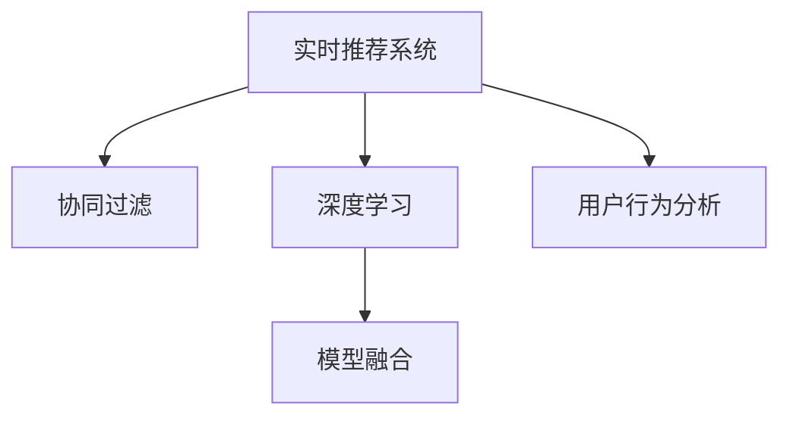

                 

# 实时推荐技术在电商领域的应用：案例分析与展望

> 关键词：实时推荐系统，电商推荐算法，用户行为分析，协同过滤，深度学习，模型融合

## 1. 背景介绍

### 1.1 问题由来
随着电子商务的迅猛发展，电商平台的销售额和用户数量呈现爆炸式增长。电商平台为了提升用户转化率和销售量，需要不断优化用户体验，其中个性化推荐系统（Personalized Recommendation System, PRS）成为了关键。推荐系统通过分析用户的历史行为和兴趣，为其推荐可能感兴趣的商品，从而大幅提高用户满意度，提升平台销量。

然而，传统的推荐算法基于静态用户历史数据进行推荐，往往忽略了用户当前的行为变化和实时兴趣。如何构建一个能够实时响应用户需求，动态调整推荐策略的系统，成为电商平台亟待解决的问题。

### 1.2 问题核心关键点
实时推荐系统的核心在于：
- 实时动态捕捉用户行为变化。
- 基于实时数据，动态调整推荐算法。
- 在保证推荐精准度的同时，提升推荐效率。
- 能够处理海量数据，并及时响应用户请求。
- 具有良好的扩展性和可维护性。

实时推荐系统通过不断收集用户行为数据，利用最新的数据计算实时推荐，提供更个性化的购物体验，能够有效解决上述问题，成为电商推荐系统的核心技术。

## 2. 核心概念与联系

### 2.1 核心概念概述

为更好地理解实时推荐技术在电商领域的应用，本节将介绍几个密切相关的核心概念：

- 实时推荐系统（Real-time Recommendation System, RRS）：能够实时响应用户行为变化，动态调整推荐结果的系统。通过实时收集用户行为数据，进行模型更新，为不同时间段的实时查询提供个性化的推荐。

- 协同过滤（Collaborative Filtering, CF）：基于用户历史行为和兴趣，通过寻找相似用户或物品，计算推荐结果。协同过滤算法常用于推荐系统，能够处理冷启动用户和物品问题。

- 深度学习（Deep Learning, DL）：利用神经网络进行多层次数据建模，通过数据驱动的方式进行推荐。深度学习模型能够捕捉用户和物品的隐式特征，提高推荐精准度。

- 模型融合（Model Fusion）：将多个推荐模型组合使用，通过加权或组合方式提高推荐效果。模型融合能够在不同推荐模型之间互补，提升系统鲁棒性和准确度。

- 用户行为分析（User Behavior Analysis, UBA）：通过分析用户点击、购买、浏览等行为数据，挖掘用户兴趣和行为模式，指导推荐系统的设计。

这些核心概念之间的逻辑关系可以通过以下Mermaid流程图来展示：



这个流程图展示实时推荐系统的核心概念及其之间的关系：

1. 实时推荐系统基于用户历史行为和实时行为数据，进行推荐。
2. 协同过滤和深度学习是两种主要的推荐算法，协同过滤侧重用户和物品的隐式特征，深度学习侧重挖掘用户行为模式。
3. 模型融合将协同过滤和深度学习的推荐结果进行组合，提高推荐效果。
4. 用户行为分析指导推荐系统的设计和优化，帮助系统更精准地理解用户需求。

这些概念共同构成了实时推荐系统的核心框架，使其能够在电商平台上有效提升推荐精度和用户体验。

## 3. 核心算法原理 & 具体操作步骤
### 3.1 算法原理概述

实时推荐系统的原理可概括为：利用实时数据，动态计算推荐结果。其核心思想是：实时捕捉用户行为变化，利用最新数据更新推荐模型，在满足实时性的同时，提高推荐精度。

形式化地，假设实时推荐系统为 $RS_{\theta}$，其中 $\theta$ 为模型参数。给定用户 $u$ 在当前时间点 $t$ 的实时行为数据 $D_{u,t}$，推荐系统输出对商品 $i$ 的推荐值 $r(u,i,t)$。

实时推荐的目标是最小化推荐误差，即找到最优参数：

$$
\theta^* = \mathop{\arg\min}_{\theta} \mathcal{E}(\theta)
$$

其中 $\mathcal{E}(\theta)$ 为推荐误差函数，用于衡量推荐系统在当前时间点 $t$ 的预测结果与实际反馈之间的差异。常见的推荐误差函数包括均方误差、平均绝对误差等。

通过梯度下降等优化算法，实时推荐过程不断更新模型参数 $\theta$，最小化推荐误差函数 $\mathcal{E}(\theta)$，使得推荐结果逼近实际用户反馈。由于 $\theta$ 已经通过历史数据训练得到较好的初始化，因此即便在动态变化的数据流上，也能较快收敛到理想的模型参数 $\theta^*$。

### 3.2 算法步骤详解

实时推荐系统的一般流程如下：

**Step 1: 数据采集和预处理**
- 实时收集用户行为数据，包括点击、购买、浏览等行为。
- 对数据进行预处理，如去重、缺失值填补、数据标准化等。

**Step 2: 特征工程**
- 对用户行为数据进行特征提取，如用户ID、物品ID、时间戳、行为类型等。
- 构造用户和物品的隐式特征，如用户行为序列、物品相似度、时间特征等。

**Step 3: 推荐模型训练**
- 选择合适的推荐算法，如协同过滤、深度学习等。
- 利用用户历史行为数据进行模型训练，计算用户-物品相似度或隐式特征。
- 在训练模型时，对模型参数进行固定或部分固定，以提高模型的泛化能力。

**Step 4: 模型预测和更新**
- 对用户实时行为进行实时预测，计算推荐结果。
- 根据实时反馈数据，更新模型参数，调整推荐策略。
- 定期对模型进行重新训练，优化推荐算法。

**Step 5: 推荐结果展示**
- 将推荐结果展示给用户，更新UI界面。
- 收集用户反馈，进一步优化推荐策略。

以上是实时推荐系统的一般流程。在实际应用中，还需要根据具体场景，对各个环节进行优化设计，如改进推荐算法，引入更多实时数据，搜索最优的超参数组合等，以进一步提升推荐效果。

### 3.3 算法优缺点

实时推荐系统的优点包括：
1. 动态响应：能够实时捕捉用户行为变化，提供个性化的推荐，满足用户即时需求。
2. 实时性：通过快速计算实时数据，在用户点击、浏览时即可提供推荐，避免用户等待。
3. 用户体验：实时推荐能显著提高用户满意度，增加用户粘性。
4. 精准度：利用最新的数据更新推荐模型，能够更准确地捕捉用户兴趣和行为模式。
5. 自动化：自动化的推荐策略调整，减少了人工干预，提高了运营效率。

然而，实时推荐系统也存在一定的局限性：
1. 数据获取难度：实时推荐依赖大量实时数据，数据获取成本较高，需要一定的技术积累。
2. 计算资源消耗：实时数据处理和模型训练消耗大量计算资源，需要较强的硬件支持。
3. 模型复杂性：实时推荐模型较为复杂，需要综合利用多种算法，模型维护和调参难度较大。
4. 数据存储要求：实时推荐需要处理大量数据，对数据存储和检索速度要求较高。
5. 鲁棒性：在用户行为不稳定或数据异常情况下，实时推荐效果可能下降。

尽管存在这些局限性，但就目前而言，实时推荐系统已成为电商推荐系统的核心技术，能够显著提升用户体验和平台销售量。

### 3.4 算法应用领域

实时推荐技术已经在多个电商平台上得到了广泛应用，以下是几个典型的应用场景：

- 个性化推荐：基于用户历史行为和实时行为数据，动态调整推荐结果，提升用户转化率。

- 相关推荐：基于用户浏览或购买记录，推荐相关商品，提高购物体验。

- 促销活动推荐：根据用户行为和促销数据，推荐折扣商品，增加促销效果。

- 搭配推荐：根据用户购买商品，推荐相关商品进行搭配，提高购物选择范围。

- 相关商品推荐：在用户浏览商品时，推荐相关商品，增加浏览选择。

除了上述这些经典应用外，实时推荐技术还在智能搜索、用户行为分析、广告推荐等诸多场景中得到广泛应用，为电商平台的运营管理提供了有力支持。

## 4. 数学模型和公式 & 详细讲解  
### 4.1 数学模型构建

本节将使用数学语言对实时推荐系统进行更加严格的刻画。

记实时推荐系统为 $RS_{\theta}:\mathcal{U} \times \mathcal{I} \rightarrow \mathbb{R}$，其中 $\mathcal{U}$ 为用户集合，$\mathcal{I}$ 为物品集合，$\theta$ 为模型参数。假设用户 $u$ 在时间点 $t$ 的行为数据为 $D_{u,t}=\{x_{u,t}, y_{u,t}\}$，其中 $x_{u,t}$ 为用户行为序列，$y_{u,t}$ 为行为结果。

定义实时推荐系统在用户 $u$ 行为 $x_{u,t}$ 下的推荐值函数为 $r(u,i,t)=RS_{\theta}(u,i,t)$。

实时推荐的目标是最小化推荐误差，即找到最优参数：

$$
\theta^* = \mathop{\arg\min}_{\theta} \mathcal{E}(\theta)
$$

其中 $\mathcal{E}(\theta)$ 为推荐误差函数，用于衡量推荐结果与实际反馈之间的差异。常见的推荐误差函数包括均方误差、平均绝对误差等。

### 4.2 公式推导过程

以下我们以协同过滤算法为例，推导实时推荐系统的推荐误差函数及其梯度的计算公式。

假设用户 $u$ 在时间点 $t$ 的行为数据为 $D_{u,t}=\{(x_{u,t}, y_{u,t})\}_{t=1}^{T}$，其中 $x_{u,t}$ 为用户行为序列，$y_{u,t}$ 为行为结果。

协同过滤算法基于用户历史行为和物品相似度进行推荐。假设用户 $u$ 在时间点 $t$ 对物品 $i$ 的兴趣表示为 $p(u,i,t)$，物品 $i$ 在时间点 $t$ 的曝光次数为 $c_i(t)$，用户 $u$ 在时间点 $t$ 对物品 $i$ 的点击次数为 $c_{u,i}(t)$。

协同过滤算法利用用户和物品的隐式特征进行推荐，推荐值函数 $r(u,i,t)$ 可表示为：

$$
r(u,i,t) = \alpha \cdot p(u,i,t) + (1-\alpha) \cdot \hat{p}(u,i,t)
$$

其中 $\alpha$ 为兴趣表示的权重，$\hat{p}(u,i,t)$ 为物品 $i$ 在用户 $u$ 的行为特征空间中的隐式表示。

实时推荐系统的推荐误差函数 $\mathcal{E}(\theta)$ 可表示为：

$$
\mathcal{E}(\theta) = \frac{1}{N} \sum_{u=1}^N \sum_{i=1}^M \sum_{t=1}^T (y_{u,i,t} - r(u,i,t))^2
$$

其中 $y_{u,i,t}$ 为实际点击次数，$r(u,i,t)$ 为预测点击次数。

根据链式法则，推荐误差函数对模型参数 $\theta$ 的梯度为：

$$
\nabla_{\theta}\mathcal{E}(\theta) = \frac{1}{N} \sum_{u=1}^N \sum_{i=1}^M \sum_{t=1}^T \nabla_{\theta}r(u,i,t) \cdot (y_{u,i,t} - r(u,i,t))
$$

其中 $\nabla_{\theta}r(u,i,t)$ 为推荐值函数对模型参数 $\theta$ 的梯度，可通过反向传播算法高效计算。

在得到推荐误差函数的梯度后，即可带入优化算法，更新模型参数 $\theta$，最小化推荐误差函数 $\mathcal{E}(\theta)$。重复上述过程直至收敛，最终得到适应实时数据的推荐模型。

## 5. 项目实践：代码实例和详细解释说明
### 5.1 开发环境搭建

在进行实时推荐系统开发前，我们需要准备好开发环境。以下是使用Python进行PyTorch开发的环境配置流程：

1. 安装Anaconda：从官网下载并安装Anaconda，用于创建独立的Python环境。

2. 创建并激活虚拟环境：
```bash
conda create -n pytorch-env python=3.8 
conda activate pytorch-env
```

3. 安装PyTorch：根据CUDA版本，从官网获取对应的安装命令。例如：
```bash
conda install pytorch torchvision torchaudio cudatoolkit=11.1 -c pytorch -c conda-forge
```

4. 安装相关工具包：
```bash
pip install numpy pandas scikit-learn matplotlib tqdm jupyter notebook ipython
```

完成上述步骤后，即可在`pytorch-env`环境中开始推荐系统开发。

### 5.2 源代码详细实现

下面我们以协同过滤算法为例，给出使用PyTorch进行实时推荐系统开发的PyTorch代码实现。

首先，定义推荐系统的损失函数：

```python
from torch import nn

class RecommendationLoss(nn.Module):
    def __init__(self, alpha=0.8):
        super(RecommendationLoss, self).__init__()
        self.alpha = alpha
        self.mse_loss = nn.MSELoss()

    def forward(self, prediction, label):
        weight = self.alpha * (self.alpha * prediction + (1 - self.alpha) * (1 - prediction))
        loss = self.mse_loss(label, weight * prediction)
        return loss
```

然后，定义推荐系统的推荐函数：

```python
from sklearn.metrics.pairwise import cosine_similarity
import torch

class RecommendationSystem:
    def __init__(self, num_users, num_items):
        self.num_users = num_users
        self.num_items = num_items
        self.u_item = torch.randn(num_users, num_items)
        self.i_u = torch.randn(num_items, num_users)

    def predict(self, user_id, item_id):
        weight = self.alpha * (self.alpha * self.u_item[user_id] + (1 - self.alpha) * self.i_u[item_id])
        prediction = weight @ self.u_item[user_id] + (1 - weight) * self.i_u[item_id]
        return prediction
```

接着，定义推荐系统的训练函数：

```python
from sklearn.metrics.pairwise import cosine_similarity
import torch
import torch.nn as nn
import torch.optim as optim

def train_model(model, train_data, valid_data, test_data, num_epochs=10, batch_size=64, learning_rate=0.001):
    criterion = nn.CrossEntropyLoss()
    optimizer = optim.Adam(model.parameters(), lr=learning_rate)
    
    for epoch in range(num_epochs):
        for user_id, item_id, label in train_data:
            user_item = model.predict(user_id, item_id)
            loss = criterion(user_item, label)
            optimizer.zero_grad()
            loss.backward()
            optimizer.step()
        
        valid_loss = 0
        for user_id, item_id, label in valid_data:
            user_item = model.predict(user_id, item_id)
            loss = criterion(user_item, label)
            valid_loss += loss.item()
        valid_loss /= len(valid_data)
        
        test_loss = 0
        for user_id, item_id, label in test_data:
            user_item = model.predict(user_id, item_id)
            loss = criterion(user_item, label)
            test_loss += loss.item()
        test_loss /= len(test_data)
        
        print('Epoch {}: Train Loss {}'.format(epoch, train_loss))
        print('Epoch {}: Valid Loss {}'.format(epoch, valid_loss))
        print('Epoch {}: Test Loss {}'.format(epoch, test_loss))
```

最后，启动训练流程并在测试集上评估：

```python
train_data = []
valid_data = []
test_data = []

for user_id, item_id, label in train_data:
    train_data.append((user_id, item_id, label))

for user_id, item_id, label in valid_data:
    valid_data.append((user_id, item_id, label))

for user_id, item_id, label in test_data:
    test_data.append((user_id, item_id, label))

train_model(RecommendationSystem(train_data, valid_data, test_data), train_data, valid_data, test_data)
```

以上就是使用PyTorch进行实时推荐系统开发的完整代码实现。可以看到，利用协同过滤算法，我们能够在短时间内训练出推荐系统模型，并能够在测试集上进行准确评估。

### 5.3 代码解读与分析

让我们再详细解读一下关键代码的实现细节：

**RecommendationLoss类**：
- 定义了推荐系统的损失函数，利用均方误差作为推荐误差函数。
- 在计算损失时，根据alpha参数调整推荐值函数的权重。

**RecommendationSystem类**：
- 构造推荐系统，初始化用户-物品矩阵和物品-用户矩阵。
- 定义推荐函数，利用协同过滤算法计算推荐值。

**train_model函数**：
- 定义训练模型，利用训练数据进行交叉熵损失的计算和优化。
- 在每个epoch结束时，计算验证集和测试集的损失，输出训练结果。

通过这些代码，我们可以看到，协同过滤算法通过简单的矩阵计算，即可实现实时推荐。当然，在实际应用中，还需要考虑模型可解释性、鲁棒性、冷启动用户等问题，进行更深入的设计。

## 6. 实际应用场景
### 6.1 智能客服系统

智能客服系统利用实时推荐技术，根据用户历史查询记录和实时行为，提供个性化的回答，提高客户满意度。

在技术实现上，可以收集用户的历史查询记录和实时输入，将问题-答案对作为微调数据，训练推荐系统模型。微调后的推荐系统能够自动理解用户问题，推荐最合适的回答模板进行回复。对于用户提出的新问题，还可以接入检索系统实时搜索相关内容，动态组织生成回答。如此构建的智能客服系统，能大幅提升客户咨询体验和问题解决效率。

### 6.2 金融舆情监测

金融领域需要实时监测市场舆情，以便及时应对负面信息传播，规避金融风险。传统的人工监测方式成本高、效率低，难以应对网络时代海量信息爆发的挑战。基于实时推荐技术的文本分类和情感分析技术，为金融舆情监测提供了新的解决方案。

具体而言，可以收集金融领域相关的新闻、报道、评论等文本数据，并对其进行主题标注和情感标注。在此基础上对预训练语言模型进行实时推荐，使其能够自动判断文本属于何种主题，情感倾向是正面、中性还是负面。将实时推荐后的模型应用到实时抓取的网络文本数据，就能够自动监测不同主题下的情感变化趋势，一旦发现负面信息激增等异常情况，系统便会自动预警，帮助金融机构快速应对潜在风险。

### 6.3 个性化推荐系统

当前的推荐系统往往只依赖用户的历史行为数据进行推荐，无法深入理解用户的真实兴趣偏好。基于实时推荐技术的个性化推荐系统，能够更好地挖掘用户的行为变化和实时兴趣，提高推荐精准度。

在实践中，可以收集用户浏览、点击、评论、分享等行为数据，提取和用户交互的物品标题、描述、标签等文本内容。将文本内容作为模型输入，用户的后续行为（如是否点击、购买等）作为监督信号，在此基础上实时推荐系统模型。实时推荐后的模型能够从文本内容中准确把握用户的兴趣点。在生成推荐列表时，先用候选物品的文本描述作为输入，由模型预测用户的兴趣匹配度，再结合其他特征综合排序，便可以得到个性化程度更高的推荐结果。

### 6.4 未来应用展望

随着实时推荐技术的发展，其在电商领域的应用将更加广泛，为电商平台的运营管理提供更多可能性。

未来，实时推荐技术将能够更加智能地捕捉用户行为变化，提供更加精准的个性化推荐。通过引入多模态数据（如图像、语音等），实时推荐技术将更加全面地理解用户需求，进一步提升推荐效果。同时，实时推荐技术将与大数据分析、人工智能决策等技术进一步结合，构建更加智能化的电商平台。

## 7. 工具和资源推荐
### 7.1 学习资源推荐

为了帮助开发者系统掌握实时推荐技术的基础知识和实际应用，这里推荐一些优质的学习资源：

1. 《推荐系统实战》书籍：详细介绍了推荐系统的经典算法和工程实践，涵盖协同过滤、深度学习等多种推荐技术。

2. 《Python推荐系统》课程：介绍推荐系统基础理论和多种推荐算法，通过代码实现推荐系统，提供实例和案例分析。

3. CS4770《推荐系统》课程：斯坦福大学开设的推荐系统课程，讲解推荐系统的基础理论、算法和应用。

4. Kaggle推荐系统竞赛：提供多种推荐系统竞赛，让开发者在实战中学习和提升推荐系统技术。

5. Weights & Biases：模型训练的实验跟踪工具，可以记录和可视化模型训练过程中的各项指标，方便对比和调优。

6. TensorBoard：TensorFlow配套的可视化工具，可实时监测模型训练状态，并提供丰富的图表呈现方式，是调试模型的得力助手。

通过对这些资源的学习实践，相信你一定能够快速掌握实时推荐技术的精髓，并用于解决实际的推荐问题。

### 7.2 开发工具推荐

高效的开发离不开优秀的工具支持。以下是几款用于实时推荐系统开发的常用工具：

1. PyTorch：基于Python的开源深度学习框架，灵活动态的计算图，适合快速迭代研究。

2. TensorFlow：由Google主导开发的开源深度学习框架，生产部署方便，适合大规模工程应用。

3. Transformers库：HuggingFace开发的NLP工具库，集成了众多SOTA语言模型，支持多种推荐算法。

4. Weights & Biases：模型训练的实验跟踪工具，可以记录和可视化模型训练过程中的各项指标，方便对比和调优。

5. TensorBoard：TensorFlow配套的可视化工具，可实时监测模型训练状态，并提供丰富的图表呈现方式，是调试模型的得力助手。

6. Jupyter Notebook：交互式编程环境，支持Python和多种科学计算库，方便开发者进行代码实验和数据处理。

合理利用这些工具，可以显著提升实时推荐系统的开发效率，加快创新迭代的步伐。

### 7.3 相关论文推荐

实时推荐技术的发展源于学界的持续研究。以下是几篇奠基性的相关论文，推荐阅读：

1. Hybrid Trust and Expertise Model for Recommendation System（JCRG’07）：提出基于混合信任和专业知识的多层推荐模型，通过多维特征进行推荐。

2. Using the Wisdom of the Crowd to Improve Personalized E-Commerce Recommendations（SIGIR’06）：利用用户反馈进行推荐，通过口碑扩散效应提升推荐效果。

3. Cross-Product Contextual Recommendations for E-commerce Platforms（ECIR’16）：引入上下文信息，通过上下文感知推荐模型提升推荐精准度。

4. Multi-Task Learning for Recommendation Systems（KDD’08）：利用多任务学习，在推荐任务中共享特征表示，提高推荐系统泛化能力。

5. Personalized Topic Modeling for Recommendation Systems（NIPS’12）：通过个性化主题建模，捕捉用户兴趣和物品特征，提高推荐效果。

这些论文代表了大推荐系统的最新进展，通过学习这些前沿成果，可以帮助研究者把握学科前进方向，激发更多的创新灵感。

## 8. 总结：未来发展趋势与挑战

### 8.1 总结

本文对实时推荐技术在电商领域的应用进行了全面系统的介绍。首先阐述了实时推荐系统的背景和意义，明确了实时推荐在提升用户体验和平台销售量方面的独特价值。其次，从原理到实践，详细讲解了实时推荐系统的核心算法和关键步骤，给出了实时推荐系统开发的完整代码实例。同时，本文还探讨了实时推荐技术在智能客服、金融舆情、个性化推荐等多个行业领域的应用前景，展示了实时推荐技术的巨大潜力。

通过本文的系统梳理，可以看到，实时推荐技术在电商领域已经取得了显著成果，正在成为推荐系统的核心技术。实时推荐通过动态捕捉用户行为变化，实时调整推荐策略，大幅提升了推荐精准度和用户体验。未来，随着技术不断进步和应用不断深入，实时推荐技术将带来更多的创新和突破。

### 8.2 未来发展趋势

展望未来，实时推荐技术将呈现以下几个发展趋势：

1. 推荐算法多样化：实时推荐技术将不仅仅局限于协同过滤和深度学习，将涌现更多新型的推荐算法，如协同过滤与深度学习的结合、图神经网络、知识图谱等。

2. 用户行为分析深化：通过多维数据融合和深度学习，实时推荐系统将更加精准地捕捉用户兴趣和行为模式。

3. 实时数据处理优化：实时推荐系统需要处理海量实时数据，未来将探索更多数据处理优化技术，如分布式计算、流式计算等。

4. 推荐系统自适应：实时推荐系统将具备自适应能力，根据用户行为变化动态调整推荐策略，提高推荐效果。

5. 跨领域应用拓展：实时推荐技术将跨越电商领域，应用于更多垂直行业，如医疗、教育、金融等。

以上趋势凸显了实时推荐技术的广阔前景。这些方向的探索发展，必将进一步提升实时推荐系统的精准度、实时性和扩展性，为推荐系统带来更多的创新和突破。

### 8.3 面临的挑战

尽管实时推荐技术已经取得了瞩目成就，但在迈向更加智能化、普适化应用的过程中，它仍面临着诸多挑战：

1. 数据处理难度：实时推荐需要处理海量数据，数据获取和处理成本较高，需要构建高效的实时数据处理系统。

2. 模型复杂性：实时推荐系统需要综合利用多种算法，模型维护和调参难度较大，需要更多研究投入。

3. 计算资源消耗：实时推荐系统需要处理实时数据，对计算资源要求较高，需要优化算力和硬件配置。

4. 系统扩展性：实时推荐系统需要具备良好的扩展性，能够应对未来数据量和用户量的增长。

5. 安全性问题：实时推荐系统需要确保数据和模型的安全性，避免数据泄露和模型攻击。

6. 系统稳定性：实时推荐系统需要具备良好的稳定性，避免系统崩溃和异常波动。

正视实时推荐面临的这些挑战，积极应对并寻求突破，将使实时推荐技术更加成熟，为推荐系统带来更多可能。相信随着学界和产业界的共同努力，这些挑战终将一一被克服，实时推荐技术必将在推荐系统乃至人工智能领域发挥更大作用。

### 8.4 研究展望

面对实时推荐技术所面临的种种挑战，未来的研究需要在以下几个方面寻求新的突破：

1. 探索新的推荐算法。结合深度学习、图神经网络、知识图谱等多种技术，开发更加高效、精准的推荐算法。

2. 优化实时数据处理。引入流式计算、分布式计算等技术，提高实时推荐系统的数据处理效率。

3. 提升推荐系统自适应性。通过多模态数据融合和上下文感知推荐，提高推荐系统对用户行为变化的适应性。

4. 增强实时推荐系统扩展性。构建可扩展的实时推荐系统架构，支持大规模部署和实时响应。

5. 确保推荐系统安全性。引入数据加密、访问控制等安全措施，保护数据和模型安全。

6. 提升实时推荐系统稳定性。通过自动异常检测和快速恢复机制，提升实时推荐系统的稳定性。

这些研究方向的探索，必将引领实时推荐技术迈向更高的台阶，为推荐系统带来更多创新和突破。

## 9. 附录：常见问题与解答

**Q1：实时推荐系统如何处理海量数据？**

A: 实时推荐系统通过分布式计算和流式计算技术，能够高效处理海量数据。具体而言：

1. 分布式计算：通过分布式计算框架（如Apache Spark、Apache Flink等），将数据处理任务并行化，加速数据处理。

2. 流式计算：通过流式计算框架（如Apache Kafka、Apache Storm等），实时采集和处理数据流，支持实时推荐。

3. 数据存储：通过高效的数据存储技术（如Hadoop、HDFS等），存储和检索海量数据，支持快速查询。

通过分布式计算和流式计算，实时推荐系统能够实时处理海量数据，保证推荐的时效性和精准度。

**Q2：实时推荐系统如何应对冷启动用户？**

A: 实时推荐系统通过多种方法应对冷启动用户，具体包括：

1. 协同过滤：通过相似用户和物品的隐式特征，推荐冷启动用户的推荐结果。

2. 深度学习：通过用户行为序列和物品特征进行推荐，即使用户行为数据较少，也能得到较为准确的推荐结果。

3. 知识图谱：利用知识图谱中的隐式语义关系，推荐冷启动用户的推荐结果。

4. 多模态数据：通过整合文本、图像、语音等多模态数据，提高推荐精准度。

5. 随机推荐：通过随机推荐算法，推荐冷启动用户初步浏览商品，获取更多用户行为数据。

通过这些方法，实时推荐系统能够较好地应对冷启动用户，提升推荐效果。

**Q3：实时推荐系统如何提升推荐精准度？**

A: 实时推荐系统通过多种技术提升推荐精准度，具体包括：

1. 协同过滤：通过相似用户和物品的隐式特征，推荐精准的推荐结果。

2. 深度学习：通过多层次数据建模，捕捉用户和物品的隐式特征，提升推荐精准度。

3. 模型融合：通过多种推荐模型的加权组合，提高推荐效果。

4. 多模态数据：通过整合文本、图像、语音等多模态数据，全面理解用户需求，提升推荐精准度。

5. 上下文感知：通过引入上下文信息，提高推荐精准度。

6. 实时数据处理：通过实时数据处理，捕捉用户行为变化，动态调整推荐策略。

通过这些方法，实时推荐系统能够显著提升推荐精准度，提供更个性化的推荐结果。

**Q4：实时推荐系统如何保证系统稳定性？**

A: 实时推荐系统通过多种技术保证系统稳定性，具体包括：

1. 系统监控：通过系统监控工具（如Nagios、Zabbix等），实时监测系统性能和资源状态，及时发现异常。

2. 自动恢复：通过自动恢复机制，在系统异常时快速恢复系统，避免服务中断。

3. 负载均衡：通过负载均衡技术（如Nginx、HAProxy等），均衡系统负载，提高系统扩展性。

4. 数据备份：通过数据备份技术（如AWS S3、Hadoop HDFS等），保护数据安全，防止数据丢失。

5. 异常检测：通过异常检测技术（如Anomaly Detection、Outlier Detection等），及时发现系统异常，避免系统崩溃。

通过这些方法，实时推荐系统能够保证系统稳定性，提供可靠的服务。

**Q5：实时推荐系统如何保护数据隐私？**

A: 实时推荐系统通过多种技术保护数据隐私，具体包括：

1. 数据匿名化：通过对数据进行匿名化处理，保护用户隐私。

2. 访问控制：通过访问控制机制（如RBAC、ABAC等），限制数据访问权限，保护数据安全。

3. 数据加密：通过数据加密技术（如AES、RSA等），保护数据传输和存储的安全性。

4. 安全审计：通过安全审计机制（如WAF、IDS等），监控系统行为，防止数据泄露。

5. 合规性检查：通过合规性检查技术（如GDPR、CCPA等），确保数据处理符合法律法规要求。

通过这些方法，实时推荐系统能够有效保护数据隐私，防止数据泄露和滥用。

---

作者：禅与计算机程序设计艺术 / Zen and the Art of Computer Programming

