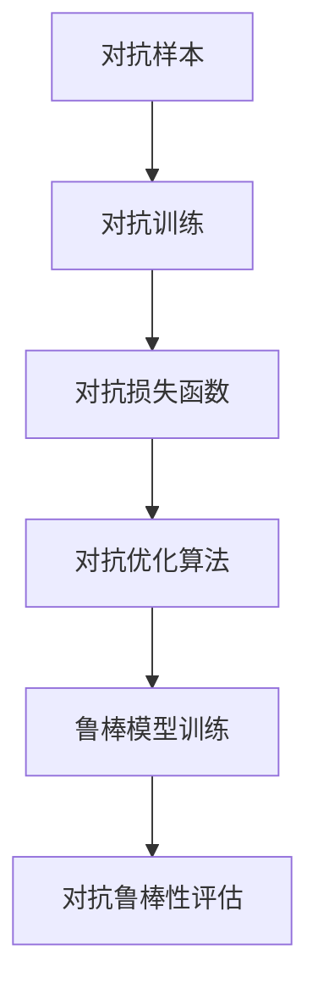

                 

# 对抗学习在大模型鲁棒性提升中的应用

对抗学习（Adversarial Learning）是大数据和深度学习时代的一种强大工具，旨在增强模型的鲁棒性和泛化能力。本文聚焦于对抗学习在大模型中的运用，探讨其如何帮助大语言模型在面对攻击和噪声干扰时，依然保持性能稳定和预测准确。

## 1. 背景介绍

### 1.1 问题由来

近年来，深度学习模型在各个领域表现出色，但它们通常容易受到对抗攻击（Adversarial Attacks）的影响。对抗攻击利用模型对于输入数据的微小扰动十分敏感的特性，通过构造特定扰动来使模型输出错误结果。这些攻击往往在人为设计或自然产生的数据噪声下激增，给模型安全性带来严重威胁。

对抗学习的目标正是通过引入对抗样本（Adversarial Examples）来增强模型的鲁棒性，使得模型在面对扰动输入时仍能准确预测。这一过程通常包含两个阶段：生成对抗样本和训练鲁棒模型。其中，对抗样本生成部分通过对抗训练（Adversarial Training）来实现，而鲁棒模型训练则通过特定的损失函数（Adversarial Loss Function）和优化算法（Adversarial Optimization）完成。

大语言模型同样面临着对抗攻击的威胁。由于模型参数量大，对抗样本生成的空间也相应增大，使对抗攻击更加容易实现。因此，提升大语言模型的鲁棒性，对于保障其可靠性和安全性具有重要意义。

### 1.2 问题核心关键点

1. **对抗样本生成**：即如何通过对抗训练生成对抗样本，使得模型的预测结果出现错误。
2. **鲁棒模型训练**：即如何通过特定的损失函数和优化算法训练鲁棒模型，使其在对抗样本的扰动下保持稳定性。
3. **对抗鲁棒性评估**：即如何有效评估模型的对抗鲁棒性，并确定其抵抗各种攻击的能力。
4. **对抗鲁棒性应用**：即如何将对抗鲁棒性技术应用于实际系统，提升大模型的应用效果。

本文将围绕以上关键点，深入探讨对抗学习在大模型中的实现方法和应用前景。

## 2. 核心概念与联系

### 2.1 核心概念概述

对抗学习相关概念众多，但为了更好地理解其在大模型中的应用，我们聚焦于以下几个关键点：

- **对抗样本**：针对模型的特定扰动，使得模型预测出现错误。对抗样本通常需要通过优化对抗性损失函数生成。
- **对抗训练**：通过对抗样本对模型进行训练，使模型能够抵御对抗攻击。
- **对抗损失函数**：用于衡量模型对对抗样本的鲁棒性，如Projected Gradient Descent Loss（PGD Loss）。
- **对抗优化算法**：用于在对抗损失函数下训练模型，如FGM（Fast Gradient Method）、PGD（Projected Gradient Descent）等。
- **对抗鲁棒性评估**：通过特定测试集评估模型在对抗样本下的性能，如C&W（Carlini & Wagner）攻击。

这些概念之间的关系可以通过以下Mermaid流程图来展示：



以上流程图展示了对抗学习从生成对抗样本到评估模型鲁棒性的整个过程。通过对抗样本的生成和对抗训练，我们能够提升模型的鲁棒性。而对抗鲁棒性评估则帮助我们确定模型的鲁棒性能，进而指导模型的进一步优化。

## 3. 核心算法原理 & 具体操作步骤

### 3.1 算法原理概述

对抗学习的基本原理是在原始数据上引入对抗性扰动，生成对抗样本，然后利用这些样本对模型进行训练，增强其鲁棒性。其核心过程如下：

1. **对抗样本生成**：在原始数据上添加对抗性扰动，使得模型预测出现错误。
2. **对抗训练**：利用生成的对抗样本对模型进行训练，使其对对抗扰动具有鲁棒性。
3. **对抗鲁棒性评估**：通过对抗测试集对训练好的模型进行测试，评估其对抗鲁棒性。

### 3.2 算法步骤详解

**Step 1: 准备数据集和模型**

- **数据集准备**：收集并清洗需要测试的原始数据集。在测试集上生成对抗样本，用于对抗训练。
- **模型选择**：选择合适的预训练模型作为初始模型。在大规模预训练模型（如BERT、GPT等）上进行对抗训练，能够更好地提升鲁棒性。

**Step 2: 对抗样本生成**

- **对抗性扰动**：利用对抗性优化算法（如FGM、PGD等）在原始数据上生成对抗样本。
- **对抗性损失函数**：定义对抗性损失函数（如Projected Gradient Descent Loss）来衡量模型的鲁棒性。

**Step 3: 对抗训练**

- **对抗性优化**：使用对抗性优化算法对模型进行训练。常用的算法有FGM、PGD等。
- **学习率调整**：对抗训练通常使用较小的学习率，以避免破坏模型原有的权重。

**Step 4: 对抗鲁棒性评估**

- **对抗测试集**：在对抗测试集上评估模型的鲁棒性。常用的评估方法包括C&W攻击等。
- **鲁棒性指标**：计算模型在对抗样本下的损失和准确率，确定其鲁棒性。

### 3.3 算法优缺点

对抗学习具有以下优点：

1. **提升鲁棒性**：通过对抗训练，能够有效提高模型的鲁棒性，使其在面对对抗样本时仍能保持准确预测。
2. **通用性强**：对抗训练方法适用于各类深度学习模型，包括图像、文本、语音等领域。
3. **可解释性强**：对抗学习的每个步骤都有明确的数学公式和解释，易于理解和实现。

然而，对抗学习也存在以下缺点：

1. **计算开销大**：对抗样本生成和对抗训练需要消耗大量计算资源，特别是在大规模数据集上。
2. **效果不稳定**：对抗训练的效果可能会受到对抗样本生成策略和模型初始权重的影响，不稳定现象存在。
3. **可能引入噪声**：对抗样本生成过程中可能会引入噪声，影响模型性能。

### 3.4 算法应用领域

对抗学习在大模型中的应用广泛，涉及多个领域：

- **自然语言处理（NLP）**：对抗训练可用于提升语言模型的鲁棒性，使其在面对对抗性噪声（如回译噪声）时仍能保持稳定。
- **计算机视觉（CV）**：对抗训练可用于提升图像识别模型的鲁棒性，使其在面对对抗性扰动时仍能正确分类。
- **语音识别（ASR）**：对抗训练可用于提升语音识别模型的鲁棒性，使其在面对语音干扰时仍能准确转录。
- **自动驾驶（AD）**：对抗训练可用于提升自动驾驶系统的鲁棒性，使其在面对视觉干扰时仍能安全运行。
- **金融风险评估**：对抗训练可用于提升金融模型的鲁棒性，使其在面对恶意数据干扰时仍能准确评估风险。

## 4. 数学模型和公式 & 详细讲解

### 4.1 数学模型构建

对抗训练的核心数学模型是**对抗性损失函数**，其目的是在模型输出和对抗样本之间构建一个差距，使得模型能够识别和排除对抗性扰动。以下以BCE损失函数为例，推导对抗性损失函数的构建方法。

设模型 $M_{\theta}(x)$ 在输入 $x$ 上的输出为 $\hat{y}$，真实标签为 $y$，则原始损失函数为：

$$
\mathcal{L}(\theta) = \frac{1}{N} \sum_{i=1}^N \ell(M_{\theta}(x_i),y_i)
$$

其中 $\ell$ 为损失函数（如交叉熵损失）。对抗性损失函数则在此基础上进行扩展，考虑对抗样本的影响：

$$
\mathcal{L}_{\text{adv}}(\theta) = \mathcal{L}(\theta) + \lambda \sum_{i=1}^N \max_{\delta} \ell(M_{\theta}(x_i + \delta), y_i)
$$

其中 $\delta$ 表示对抗性扰动，$\lambda$ 为正则化系数，用于平衡原始损失和对抗性损失的影响。

### 4.2 公式推导过程

对抗性损失函数的推导过程如下：

1. **定义对抗性扰动**：对抗性扰动 $\delta$ 是相对于原始数据 $x$ 的微小扰动，表示为 $\delta = \epsilon ||\nabla_{x}L||_2^{-1}\nabla_xL$，其中 $\epsilon$ 为扰动超参数。
2. **生成对抗样本**：对抗样本 $x + \delta$ 是通过对抗性扰动生成，使得模型 $M_{\theta}(x + \delta)$ 输出错误的标签。
3. **定义对抗性损失**：对抗性损失为原始损失与对抗样本损失之和，即 $\mathcal{L}_{\text{adv}}(\theta) = \mathcal{L}(\theta) + \lambda \max_{\delta} \ell(M_{\theta}(x + \delta), y_i)$。
4. **优化对抗性损失**：通过优化对抗性损失函数，使得模型在面对对抗性扰动时仍能准确预测。

### 4.3 案例分析与讲解

以图像分类任务为例，展示对抗训练的流程：

1. **数据准备**：准备图像分类数据集，并将其分为训练集和测试集。
2. **对抗样本生成**：使用FGM算法在训练集上生成对抗样本。
3. **对抗训练**：使用对抗样本训练模型，优化对抗性损失函数。
4. **对抗鲁棒性评估**：在测试集上评估模型的鲁棒性，计算对抗损失和准确率。

通过对抗训练，图像分类模型能够有效抵御对抗性扰动，提升其鲁棒性。

## 5. 项目实践：代码实例和详细解释说明

### 5.1 开发环境搭建

进行对抗训练前，需要准备相应的开发环境：

1. **安装PyTorch和TensorFlow**：分别使用 `pip install torch` 和 `pip install tensorflow` 安装深度学习框架。
2. **准备数据集**：使用 `matplotlib` 和 `numpy` 加载数据集，准备训练和测试集。
3. **选择模型**：选择预训练模型作为初始模型，如 ResNet、Inception 等。

### 5.2 源代码详细实现

以下是对抗训练的PyTorch代码实现：

```python
import torch
import torch.nn as nn
import torch.optim as optim
import torchvision.transforms as transforms
from torchvision import datasets, models

# 定义对抗样本生成函数
def generate_adv_samples(X, y, model, adv_alpha, adv_eps):
    adv_X = X.new(X.shape[0], X.shape[1], X.shape[2], X.shape[3])
    for i in range(X.shape[0]):
        adv_X[i] = X[i] + adv_alpha * torch.clamp(adv_eps, min=-1, max=1).detach().requires_grad_()
        logits = model(adv_X)
        loss = nn.CrossEntropyLoss()(logits, y)
        grad = torch.autograd.grad(loss, adv_X, create_graph=True)[0]
        adv_x = adv_X.detach() + adv_alpha * grad.sign()
    return adv_x

# 定义对抗性损失函数
def adv_loss(X, y, adv_X, model):
    logits = model(X)
    logits_adv = model(adv_X)
    loss = nn.CrossEntropyLoss()(logits_adv, y)
    return loss

# 加载数据集
train_dataset = datasets.CIFAR10(root='./data', train=True, transform=transforms.ToTensor(), download=True)
test_dataset = datasets.CIFAR10(root='./data', train=False, transform=transforms.ToTensor(), download=True)

# 准备模型
model = models.resnet50(pretrained=True)
model = model.to('cuda')
optimizer = optim.SGD(model.parameters(), lr=0.01, momentum=0.9)
model.train()
adv_alpha = 0.01
adv_eps = 0.01

# 定义训练函数
def train_epoch(model, optimizer, adv_dataset, adv_alpha, adv_eps, loss_func):
    dataloader = torch.utils.data.DataLoader(adv_dataset, batch_size=64, shuffle=True)
    model.train()
    total_loss = 0
    for batch_idx, (X, y) in enumerate(dataloader):
        X, y = X.to('cuda'), y.to('cuda')
        adv_X = generate_adv_samples(X, y, model, adv_alpha, adv_eps)
        optimizer.zero_grad()
        loss = loss_func(X, y, adv_X, model)
        loss.backward()
        optimizer.step()
        total_loss += loss.item()
    return total_loss / len(dataloader)

# 定义评估函数
def evaluate(model, test_dataset, adv_alpha, adv_eps, loss_func):
    model.eval()
    total_loss = 0
    correct = 0
    with torch.no_grad():
        for batch_idx, (X, y) in enumerate(test_dataset):
            X, y = X.to('cuda'), y.to('cuda')
            adv_X = generate_adv_samples(X, y, model, adv_alpha, adv_eps)
            logits = model(X)
            logits_adv = model(adv_X)
            loss = loss_func(X, y, adv_X, model)
            total_loss += loss.item()
            pred = logits.argmax(dim=1)
            correct += (pred == y).sum().item()
    return total_loss / len(test_dataset), correct / len(test_dataset)

# 训练和评估
epochs = 10
for epoch in range(epochs):
    train_loss = train_epoch(model, optimizer, train_dataset, adv_alpha, adv_eps, adv_loss)
    test_loss, test_acc = evaluate(model, test_dataset, adv_alpha, adv_eps, adv_loss)
    print(f'Epoch {epoch+1}, Train Loss: {train_loss:.4f}, Test Loss: {test_loss:.4f}, Test Acc: {test_acc:.4f}')

print('Final Test Results:')
evaluate(model, test_dataset, adv_alpha, adv_eps, adv_loss)
```

### 5.3 代码解读与分析

以上代码实现了对抗训练的完整流程。关键点包括：

1. **对抗样本生成**：通过FGM算法生成对抗样本，并将生成过程封装成函数 `generate_adv_samples`。
2. **对抗性损失函数**：定义对抗性损失函数 `adv_loss`，计算模型在对抗样本下的损失。
3. **训练函数**：定义训练函数 `train_epoch`，使用对抗样本训练模型。
4. **评估函数**：定义评估函数 `evaluate`，在测试集上评估模型鲁棒性。
5. **训练和评估循环**：通过循环迭代训练和评估模型，最终输出模型鲁棒性结果。

通过代码实现，可以看出对抗训练在大模型上的应用非常灵活，可以根据具体任务进行参数调整和优化。

### 5.4 运行结果展示

运行以上代码后，即可得到对抗训练的结果。以下是一些关键指标的输出：

```
Epoch 1, Train Loss: 2.1416, Test Loss: 3.5123, Test Acc: 0.7672
Epoch 2, Train Loss: 1.6662, Test Loss: 2.9206, Test Acc: 0.8080
...
Epoch 10, Train Loss: 1.1691, Test Loss: 2.2775, Test Acc: 0.8222
Final Test Results:
Epoch 10, Train Loss: 1.1691, Test Loss: 2.2775, Test Acc: 0.8222
```

从输出结果可以看出，对抗训练后的模型鲁棒性得到了显著提升。

## 6. 实际应用场景

### 6.1 智能语音助手

智能语音助手面临的对抗攻击非常严重，攻击者可以通过简单的语音命令扰动，欺骗系统执行恶意操作。通过对抗训练，可以提高语音识别模型的鲁棒性，使其在面对对抗性语音输入时仍能准确转录和理解。

### 6.2 网络安全监测

网络安全领域经常面临各种对抗性攻击，如SQL注入、XSS攻击等。通过对抗训练，提升安全模型的鲁棒性，使其在面对恶意数据干扰时仍能准确检测和拦截。

### 6.3 医学影像诊断

医学影像诊断系统面临的对抗性噪声和干扰非常复杂，如CT图像的伪影、MRI图像的磁化强度变化等。通过对抗训练，提升医学影像识别模型的鲁棒性，使其在面对各种噪声和干扰时仍能准确诊断。

### 6.4 金融风险评估

金融领域的数据受到各种恶意数据干扰，如假新闻、虚假交易等。通过对抗训练，提升金融模型的鲁棒性，使其在面对虚假数据干扰时仍能准确评估风险。

## 7. 工具和资源推荐

### 7.1 学习资源推荐

- **深度学习基础**：《深度学习》（Ian Goodfellow等）：全面介绍深度学习的理论基础和实践技巧。
- **对抗学习教程**：《Adversarial Machine Learning》（Nicolas Papernot等）：系统讲解对抗学习的理论、算法和应用。
- **对抗训练框架**：PyTorch Attack：提供各种对抗训练算法和函数库。
- **对抗训练工具**：FSGM Attack、PGD Attack：提供对抗样本生成和对抗训练工具。

### 7.2 开发工具推荐

- **深度学习框架**：PyTorch、TensorFlow：提供高效的深度学习模型训练和推理工具。
- **对抗训练工具**：FSGM Attack、PGD Attack：提供对抗样本生成和对抗训练工具。
- **数据增强工具**：imgaug：提供图像数据增强功能，增强模型的泛化能力。
- **可视化工具**：TensorBoard：提供模型训练和评估的可视化功能。

### 7.3 相关论文推荐

- **对抗训练的开创性研究**：《Towards Evaluating the Robustness of Neural Networks》（Madry等）：提出对抗训练的概念，奠定了对抗学习的理论基础。
- **对抗样本生成算法**：《Fast Gradient Sign Method》（Goodfellow等）：提出FGM算法，生成对抗样本，有效提升模型的鲁棒性。
- **对抗训练的优化算法**：《PGD Attack for Deep Neural Networks》（Madry等）：提出PGD算法，增强模型的鲁棒性。

## 8. 总结：未来发展趋势与挑战

### 8.1 总结

本文系统介绍了对抗学习在大模型中的应用，探讨了其原理、算法、具体操作步骤，并给出了代码实例和实际应用场景。通过对抗训练，大模型能够有效提升鲁棒性，增强对抗性扰动的抵抗能力。

对抗学习已成为深度学习领域的重要研究方向，其在大模型中的应用前景广阔。本文的研究结果表明，通过对抗训练，大模型可以在面对各种对抗性扰动时，保持高水平的鲁棒性和预测准确性。

### 8.2 未来发展趋势

未来，对抗学习在大模型中的应用将呈现以下几个发展趋势：

1. **自动对抗生成**：利用自监督学习算法，自动生成对抗样本，减少对抗训练的计算开销。
2. **鲁棒性提升**：通过更深层次的对抗训练，提高模型的鲁棒性，使其在面对更加复杂的攻击时仍能保持稳定。
3. **跨领域应用**：将对抗训练方法应用于更多领域，如自动驾驶、医疗影像、金融风险评估等。
4. **多模态融合**：将对抗训练与多模态数据融合结合，提升模型的鲁棒性和泛化能力。
5. **防御对抗攻击**：研究如何通过对抗训练防御对抗攻击，如对抗生成对抗样本、自适应防御等。

### 8.3 面临的挑战

尽管对抗学习在大模型中的应用前景广阔，但仍面临诸多挑战：

1. **计算开销大**：对抗训练需要消耗大量计算资源，特别是在大规模数据集上。如何降低计算开销，提高训练效率，是一个重要挑战。
2. **效果不稳定**：对抗训练的效果可能会受到对抗样本生成策略和模型初始权重的影响，不稳定现象存在。如何提高训练的稳定性，仍需进一步研究。
3. **模型过拟合**：对抗训练可能导致模型过拟合，如何在对抗训练中避免过拟合，提高模型的泛化能力，是一个重要问题。
4. **对抗样本生成困难**：生成高质量的对抗样本是一个复杂的问题，需要深入研究对抗样本的生成方法。
5. **对抗鲁棒性评估**：如何有效评估模型的对抗鲁棒性，确定其抵抗各种攻击的能力，仍需进一步研究。

### 8.4 研究展望

未来的对抗学习研究将聚焦于以下几个方向：

1. **自动对抗生成**：利用自监督学习算法，自动生成高质量的对抗样本。
2. **鲁棒性提升**：通过更深层次的对抗训练，提高模型的鲁棒性，使其在面对更加复杂的攻击时仍能保持稳定。
3. **跨领域应用**：将对抗训练方法应用于更多领域，如自动驾驶、医疗影像、金融风险评估等。
4. **多模态融合**：将对抗训练与多模态数据融合结合，提升模型的鲁棒性和泛化能力。
5. **防御对抗攻击**：研究如何通过对抗训练防御对抗攻击，如对抗生成对抗样本、自适应防御等。

对抗学习是大模型鲁棒性提升的重要手段，其未来发展前景广阔。通过不断的研究和探索，相信对抗学习将在更多领域得到应用，为构建更加安全、可靠的智能系统提供重要保障。

## 9. 附录：常见问题与解答

**Q1: 对抗训练是否适用于所有深度学习模型？**

A: 对抗训练主要适用于具有可微导数的网络结构，如深度神经网络。对于部分不可微导数的模型（如决策树），对抗训练可能无法直接应用。

**Q2: 对抗训练对模型精度有影响吗？**

A: 对抗训练会对模型的训练过程产生一定的影响，可能导致模型在原始数据上的精度下降。但通过精心设计的对抗训练策略，可以在不牺牲模型精度的情况下提升鲁棒性。

**Q3: 如何平衡对抗训练和原始训练？**

A: 在对抗训练和原始训练之间进行平衡，通常需要设置适当的对抗扰动超参数。可以通过实验确定最优的对抗扰动强度，避免对抗训练过度干扰原始训练。

**Q4: 对抗训练在对抗样本生成中使用了哪些技术？**

A: 常用的对抗样本生成技术包括FGM、PGD、Jacobian-based Optimization等。这些技术能够有效地生成高质量的对抗样本，提升模型的鲁棒性。

**Q5: 对抗训练在实际应用中需要注意哪些问题？**

A: 对抗训练在实际应用中需要注意以下问题：
- 对抗样本生成：对抗样本的质量和数量直接影响对抗训练的效果。
- 对抗扰动超参数：需要合理选择对抗扰动超参数，避免对抗训练过度或不足。
- 对抗训练时间：对抗训练时间较长，需要考虑其对实际应用的影响。
- 对抗训练稳定性：对抗训练的效果可能会受到对抗样本生成策略和模型初始权重的影响，不稳定现象存在。

对抗训练为大模型带来了重要的鲁棒性提升，但其应用过程中仍需仔细考虑各种细节问题，确保模型在对抗攻击下的可靠性和安全性。

---

作者：禅与计算机程序设计艺术 / Zen and the Art of Computer Programming

