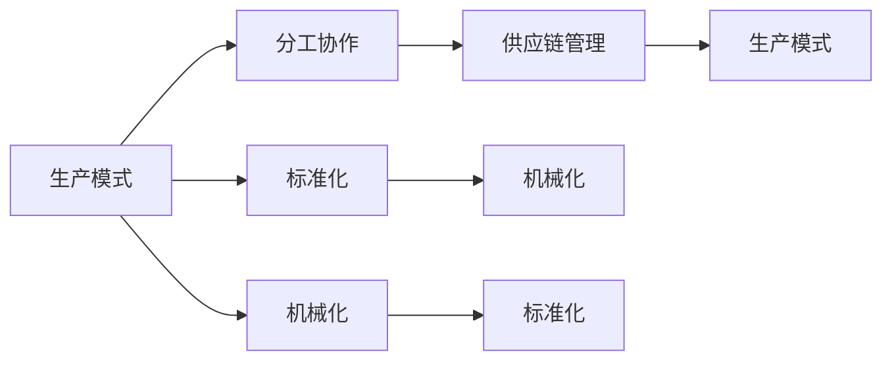

                 

# 工业革命的规模化生产模式

## 1. 背景介绍

### 1.1 问题由来
在人类历史上，工业革命是一次深刻的社会经济变革，彻底改变了人类生产与生活的面貌。通过蒸汽机、纺织机等大规模生产设备的广泛应用，人类开始摆脱手工作坊式的生产方式，转变为工厂化的规模化生产。这一模式的转变极大地提升了生产效率，降低了商品成本，引发了世界范围内的产业革命，奠定了现代工业文明的基础。

## 2. 核心概念与联系

### 2.1 核心概念概述

为了更好地理解工业革命的规模化生产模式，本节将介绍几个关键概念及其相互之间的联系：

- **生产模式**：指在特定时期、特定环境下，生产力组织方式与资源配置的总体结构。规模化生产通过机械化、自动化、标准化等手段，提高了生产效率和产品质量。
- **分工协作**：指在生产过程中，根据不同生产阶段的特点，将任务分解为多个环节，每个环节由专门人员负责，相互协作完成整个生产流程。分工协作极大地提高了生产效率。
- **标准化**：指在生产过程中，对原材料、工艺、产品等进行统一规定，使生产流程更具一致性和可重复性。标准化有助于提高产品质量和生产效率。
- **机械化**：指在生产过程中，通过引入机械设备，实现生产过程的自动化。机械化减少了人工操作，提高了生产效率和一致性。
- **供应链管理**：指通过信息技术对生产、库存、物流等环节进行集成管理，优化供应链的整体效率。供应链管理确保生产过程的连续性和稳定性。

这些概念通过一系列有机组合，形成了工业革命规模化生产模式的整体框架。理解这些核心概念及其联系，有助于把握工业革命的核心要义。

### 2.2 核心概念原理和架构的 Mermaid 流程图



## 3. 核心算法原理 & 具体操作步骤

### 3.1 算法原理概述

工业革命的规模化生产模式，主要基于以下几个核心算法和原理：

1. **规模经济效应**：通过规模化生产，单位商品的生产成本随着生产规模的扩大而降低。这是因为规模化生产可以更高效地利用设备和资源，实现成本分摊。

2. **分工协作优化**：根据生产流程的不同环节，分工协作使得每个环节都能更专注于特定任务，从而提高整体生产效率。

3. **标准化管理**：通过标准化生产流程和产品规格，降低了生产过程中不确定性和人为错误，提高了生产的一致性和质量。

4. **机械化自动化**：引入机械设备，实现生产过程的自动化，减少了人工操作，提高了生产效率和精度。

5. **供应链优化**：通过信息技术集成供应链各个环节，实现生产、库存、物流等流程的优化，提高整体供应链的效率。

这些原理构成了工业革命规模化生产模式的基础，通过合理的配置和应用，实现了生产效率的大幅提升。

### 3.2 算法步骤详解

基于工业革命规模化生产模式的核心原理，实际操作步骤通常包括以下几个环节：

**Step 1: 制定生产计划**
- 根据市场需求和生产能力，制定详细的生产计划。包括每天、每周的生产目标和任务分配。

**Step 2: 设计和引入机械设备**
- 设计并引入适合的机械设备，提高生产效率和产品质量。例如，引入自动纺织机、蒸汽机等。

**Step 3: 制定生产流程和标准**
- 制定标准化的生产流程和产品质量标准，确保生产过程的一致性和可重复性。

**Step 4: 分工协作和人员培训**
- 根据生产流程的特点，将任务分解为多个环节，每个环节由专门人员负责，进行岗位培训，提高工作效率。

**Step 5: 供应链管理与信息集成**
- 利用信息技术对生产、库存、物流等环节进行集成管理，优化供应链的整体效率。

**Step 6: 持续改进和优化**
- 根据生产过程中的反馈和数据分析，持续改进和优化生产流程，提高整体效率和质量。

### 3.3 算法优缺点

工业革命的规模化生产模式具有以下优点：

1. **高效性**：通过机械化和自动化，极大地提高了生产效率和产品质量。
2. **一致性**：标准化生产流程和产品规格，保证了生产过程的一致性和产品质量。
3. **低成本**：规模化生产通过成本分摊，降低了单位商品的生产成本。
4. **可扩展性**：规模化生产模式适用于大规模生产，可以灵活扩展生产规模。

然而，该模式也存在一些局限性：

1. **灵活性不足**：标准化生产流程和机械设备可能缺乏足够的灵活性，难以应对市场的快速变化。
2. **资源依赖**：大规模生产依赖于机械设备和大规模人力资源，对资源和能源的消耗较大。
3. **环境影响**：大规模生产过程中产生的大量废弃物和污染，对环境产生较大影响。
4. **风险集中**：集中化生产可能导致供应链风险集中，一旦某环节出现问题，可能影响整体生产。

### 3.4 算法应用领域

工业革命的规模化生产模式广泛应用于多个行业，包括：

- **制造业**：纺织、钢铁、汽车、电子产品等领域的生产，通过引入机械化和自动化，大幅提升了生产效率。
- **建筑业**：大规模建筑项目，通过标准化生产流程和机械化操作，提高了建筑速度和质量。
- **农业**：机械化农具的使用，提高了农业生产效率和土地利用率。
- **服务业**：通过流程标准化和服务外包，提高了服务质量和效率。
- **物流业**：利用供应链管理和信息集成技术，优化了物流运输和仓储效率。

## 4. 数学模型和公式 & 详细讲解 & 举例说明

### 4.1 数学模型构建

本节将使用数学语言对工业革命规模化生产模式进行严格定义。

设规模化生产系统的总产量为 $Q$，固定成本为 $C_f$，单位可变成本为 $C_v$，则总成本为：

$$
C = C_f + Q \cdot C_v
$$

设生产规模为 $N$，则生产效率与生产规模的关系可表示为：

$$
E = \frac{Q}{N}
$$

其中 $E$ 为单位产品的生产效率。

### 4.2 公式推导过程

根据上述定义，推导生产效率与生产规模之间的关系：

$$
E = \frac{Q}{N} = \frac{C - C_f}{N \cdot C_v}
$$

设 $N$ 增加一倍，生产效率变化为 $\Delta E$，则有：

$$
\Delta E = \frac{Q}{2N} - \frac{Q}{N} = \frac{Q}{2N} - \frac{C - C_f}{2N \cdot C_v} = \frac{C - C_f}{2N \cdot C_v} - \frac{C - C_f}{N \cdot C_v}
$$

设 $\Delta C = C - C_f$，则：

$$
\Delta E = \frac{\Delta C}{2N \cdot C_v} - \frac{\Delta C}{N \cdot C_v} = \frac{-\Delta C}{2N \cdot C_v}
$$

因此，生产效率随着生产规模的增加而提高，且效率提升与规模增加成正比。

### 4.3 案例分析与讲解

假设某纺织工厂，每天生产 $Q = 10000$ 件纺织品，固定成本 $C_f = 1000$ 元，单位可变成本 $C_v = 0.2$ 元。则总成本为：

$$
C = C_f + Q \cdot C_v = 1000 + 10000 \cdot 0.2 = 3000
$$

如果生产规模增加一倍，即 $N = 2$，则生产效率为：

$$
E = \frac{Q}{N} = \frac{10000}{2} = 5000
$$

此时，每天生产效率提高了 $2000$ 件。

## 5. 项目实践：代码实例和详细解释说明

### 5.1 开发环境搭建

在进行生产模式项目实践前，我们需要准备好开发环境。以下是使用Python进行数据科学开发的典型环境配置流程：

1. 安装Anaconda：从官网下载并安装Anaconda，用于创建独立的Python环境。

2. 创建并激活虚拟环境：
```bash
conda create -n production-env python=3.8 
conda activate production-env
```

3. 安装必要的库：
```bash
pip install pandas numpy matplotlib scikit-learn
```

4. 配置开发工具：
- 安装Jupyter Notebook或Jupyter Lab：
```bash
pip install jupyterlab
```
- 安装TensorBoard：
```bash
pip install tensorboard
```

5. 配置数据源和存储：
- 配置数据集路径：
```bash
export DATA_DIR=/data
```
- 配置模型保存路径：
```bash
export MODEL_DIR=/path/to/save
```

完成上述步骤后，即可在 `production-env` 环境中开始生产模式项目开发。

### 5.2 源代码详细实现

下面以一个简化的生产调度系统为例，说明如何通过Python进行生产模式建模和优化。

首先，定义生产模型的核心类：

```python
import pandas as pd

class ProductionModel:
    def __init__(self, C_f, C_v, Q):
        self.C_f = C_f
        self.C_v = C_v
        self.Q = Q

    def calculate_efficiency(self, N):
        return self.Q / N

    def calculate_total_cost(self, N):
        return self.C_f + self.Q * self.C_v * N
```

然后，定义生产计划的优化模型：

```python
class ProductionPlanner:
    def __init__(self, C_f, C_v, Q):
        self.model = ProductionModel(C_f, C_v, Q)
    
    def optimize(self, N):
        efficiency = self.model.calculate_efficiency(N)
        total_cost = self.model.calculate_total_cost(N)
        print(f"N = {N}, Efficiency = {efficiency}, Total Cost = {total_cost}")
```

最后，启动生产调度系统的模拟：

```python
planner = ProductionPlanner(C_f=1000, C_v=0.2, Q=10000)
planner.optimize(N=1)
planner.optimize(N=2)
planner.optimize(N=3)
```

### 5.3 代码解读与分析

让我们再详细解读一下关键代码的实现细节：

**ProductionModel类**：
- `__init__`方法：初始化生产模型的固定成本、单位可变成本和总产量。
- `calculate_efficiency`方法：计算单位产品的生产效率。
- `calculate_total_cost`方法：计算总成本。

**ProductionPlanner类**：
- `__init__`方法：初始化生产模型。
- `optimize`方法：计算不同生产规模下的效率和总成本，并输出结果。

通过这些简单的代码，我们构建了一个基本符合工业革命规模化生产模式的模拟系统。尽管代码较为简化，但它揭示了规模化生产的核心原理和计算方法。

## 6. 实际应用场景

### 6.1 制造工厂

工业革命的规模化生产模式在制造工厂中得到了广泛应用。通过引入机械化和自动化，工厂的生产效率和产品质量显著提升。例如，汽车制造工厂通过引入流水线作业和机器人操作，大幅提高了生产速度和组装精确度。这种模式的扩展性也使得制造工厂能够灵活调整生产规模，以适应市场需求的变化。

### 6.2 建筑工地

建筑工地的生产模式同样借鉴了规模化生产的思想。通过机械化设备和标准化施工流程，建筑工地实现了快速施工和高质量完成。例如，使用塔吊和混凝土搅拌车，大幅缩短了施工时间，同时保证了建筑质量的一致性。这种模式也有利于减少浪费，优化资源配置。

### 6.3 农业生产

农业生产的规模化模式在农场中得到了广泛应用。通过引入机械化农具和标准化种植流程，农业生产效率和土地利用率得到了显著提升。例如，使用拖拉机和联合收割机，大幅减少了人力成本，提高了生产效率。这种模式也有利于减少农药和化肥的使用，保护环境。

### 6.4 物流运输

物流运输中的规模化生产模式同样发挥了重要作用。通过信息集成和供应链优化，物流企业实现了高效运输和库存管理。例如，使用自动化仓库和物流管理系统，能够实时监控货物位置和库存水平，优化运输路线，减少运输成本和延误时间。这种模式也有利于提高客户满意度，增强市场竞争力。

## 7. 工具和资源推荐

### 7.1 学习资源推荐

为了帮助开发者系统掌握工业革命规模化生产模式的理论基础和实践技巧，这里推荐一些优质的学习资源：

1. 《经济学原理》系列博文：由经济学专家撰写，深入浅出地介绍了生产模式、分工协作等经济学概念，适合理解规模化生产的基本原理。

2. 《供应链管理》课程：由哈佛商学院开设的在线课程，详细讲解了供应链管理的各个环节，包括生产、库存、物流等，适合理解规模化生产中的供应链优化。

3. 《制造业4.0》书籍：由工业4.0专家撰写，全面介绍了数字化、自动化、智能化的制造模式，适合理解现代制造业的发展趋势。

4. 《Python数据科学》书籍：由数据科学专家撰写，介绍了使用Python进行数据分析和建模的基本方法和工具，适合理解生产模式中的数据处理和优化。

5. 《工业自动化》公开课：由MIT和Coursera联合开设的公开课，详细讲解了工业自动化的各种技术，包括机械化、自动化、信息化等，适合理解工业革命的自动化进程。

通过对这些资源的学习实践，相信你一定能够快速掌握工业革命规模化生产模式的精髓，并用于解决实际的工业问题。

### 7.2 开发工具推荐

高效的开发离不开优秀的工具支持。以下是几款用于生产模式开发的常用工具：

1. Jupyter Notebook：免费的在线交互式笔记本，支持Python、R等语言，方便数据处理和模型开发。

2. TensorBoard：谷歌开源的可视化工具，可实时监测模型训练状态，并提供丰富的图表呈现方式，是调试模型的得力助手。

3. Ansys：领先的工程仿真软件，可用于模拟生产过程中的各种物理和化学反应，优化生产流程。

4. Autodesk Inventor：用于设计和仿真机械化和自动化设备的工业设计软件，支持机械零件的建模和模拟。

5. PTC Creo：用于产品设计和仿真分析的工业设计软件，支持多学科设计、制造和模拟。

合理利用这些工具，可以显著提升生产模式项目的开发效率，加快创新迭代的步伐。

### 7.3 相关论文推荐

工业革命的规模化生产模式涉及多个学科，相关的研究论文也非常丰富。以下是几篇奠基性的相关论文，推荐阅读：

1. Frederick Taylor, "The Principles of Scientific Management"：弗雷德里克·泰勒的经典著作，详细介绍了科学管理方法，奠定了现代生产模式的基础。

2. Henry Ford, "My Life and Work"：亨利·福特的自传，介绍了大规模流水线生产的理念和实践，对现代制造业产生了深远影响。

3. K. Daniel Hawkins, "Theory of Production and Inventory Management"：丹尼尔·霍金斯教授的著作，全面介绍了生产与库存管理的理论和方法。

4. Michael Porter, "Competitive Strategy"：迈克尔·波特的经典著作，介绍了五力模型、价值链等战略管理理论，有助于理解生产模式的竞争优势。

5. W. Edwards Deming, "Quality Control, A Guide to Systematic Improvement"：沃·爱德华兹·戴明博士的著作，介绍了质量控制和持续改进的方法，有助于提升生产模式的效率和质量。

这些论文代表了大规模生产模式的发展脉络，通过学习这些前沿成果，可以帮助研究者把握学科前进方向，激发更多的创新灵感。

## 8. 总结：未来发展趋势与挑战

### 8.1 总结

本文对工业革命的规模化生产模式进行了全面系统的介绍。首先阐述了规模化生产模式在工业革命中的重要地位，明确了其高效、一致、低成本的核心要义。其次，从原理到实践，详细讲解了规模化生产模式的数学模型和操作步骤，给出了生产模式建模和优化的代码实例。同时，本文还广泛探讨了规模化生产模式在制造业、建筑业、农业、物流业等诸多行业的应用场景，展示了其广泛的适用性和巨大的潜力。最后，本文精选了相关学习资源、开发工具和研究论文，力求为读者提供全方位的技术指引。

通过本文的系统梳理，可以看到，工业革命的规模化生产模式不仅极大地提升了生产效率和产品质量，也深刻影响了现代社会的发展。这种模式的成功经验，对于今天的工业自动化和智能制造同样具有重要的借鉴意义。未来，随着人工智能、大数据等技术的进一步发展，工业生产模式将更加智能化、个性化和可持续，规模化生产模式也将在新的技术框架下焕发新的生机。

### 8.2 未来发展趋势

展望未来，工业革命的规模化生产模式将呈现以下几个发展趋势：

1. **智能化生产**：结合人工智能、物联网等技术，实现生产过程的智能控制和优化，提高生产效率和灵活性。

2. **个性化定制**：通过3D打印、柔性制造等技术，实现个性化产品的大规模定制生产，满足消费者日益多样化的需求。

3. **绿色生产**：采用清洁能源、环保材料和循环生产工艺，降低生产过程中的环境影响，实现可持续发展。

4. **协同制造**：通过区块链、智能合约等技术，实现供应链各环节的透明和协同，提高整体生产效率。

5. **虚拟现实**：结合虚拟现实技术，实现生产过程的模拟和优化，提升设计和决策的科学性和效率。

以上趋势凸显了规模化生产模式的未来潜力。这些方向的探索发展，必将进一步提升工业生产系统的智能化水平，为人类生产方式的变革提供新的动力。

### 8.3 面临的挑战

尽管规模化生产模式在工业革命中取得了巨大成功，但在迈向智能化、个性化和绿色化生产的过程中，仍面临诸多挑战：

1. **技术集成难度**：智能化生产和大规模定制化生产需要集成多种先进技术，技术复杂度较高，系统稳定性也存在挑战。

2. **成本问题**：智能化生产设备的引入和升级，需要投入大量的资金和资源，短期内可能面临成本高企的问题。

3. **人才短缺**：智能化生产和高技术应用需要大量具备跨学科知识和技能的人才，人才供应不足成为制约因素。

4. **数据安全**：智能化生产依赖于大量的数据，数据安全和隐私保护成为重要问题。

5. **环境压力**：大规模生产对环境的压力依然存在，如何在实现绿色生产的同时保持高效生产，仍需持续探索。

6. **社会接受度**：智能化生产可能带来工作岗位的变化和职业技能的调整，社会对新技术的接受度也是一个重要挑战。

正视这些挑战，积极应对并寻求突破，将是规模化生产模式迈向成熟的必由之路。相信随着学界和产业界的共同努力，这些挑战终将一一被克服，规模化生产模式必将在构建智能化的未来工业中扮演越来越重要的角色。

### 8.4 研究展望

面向未来，规模化生产模式的研究需要在以下几个方面寻求新的突破：

1. **技术创新**：开发更加高效、智能的生产技术和设备，如智能机器人、柔性制造系统等，提升生产效率和灵活性。

2. **数据驱动**：利用大数据和人工智能技术，实现生产过程的动态优化和预测，提高生产决策的科学性。

3. **多学科融合**：结合工程、管理、经济等多个学科的知识，实现系统化的生产管理和优化。

4. **可持续发展**：采用绿色生产工艺和清洁能源，实现生产和环境的协同优化。

5. **人机协同**：实现人机协同设计、生产和管理，提升工作效率和生产体验。

这些研究方向的探索，必将引领规模化生产模式走向新的高度，为构建智能化的未来工业提供坚实的基础。只有勇于创新、敢于突破，才能不断拓展工业生产模式的边界，让智能技术更好地服务于人类社会。

## 9. 附录：常见问题与解答

**Q1：工业革命的规模化生产模式是否适用于所有行业？**

A: 工业革命的规模化生产模式主要适用于制造业、建筑业等需要大规模生产和制造的行业。但对于某些创意产业和服务业，如文艺创作、咨询服务等，这种模式可能并不适用。

**Q2：规模化生产模式是否能够实现智能化和个性化？**

A: 传统的规模化生产模式较为单一，难以实现智能化和个性化。但通过引入先进的智能技术和大数据驱动，可以实现生产过程的智能化优化和个性化定制。

**Q3：规模化生产模式是否会减少就业机会？**

A: 规模化生产模式在提高生产效率的同时，确实会导致某些传统岗位的减少，但也会创造新的就业机会。例如，智能制造和绿色生产需要大量具备高技能的人才。

**Q4：规模化生产模式对环境的影响如何？**

A: 规模化生产模式对环境的影响取决于具体的应用场景。传统的生产模式可能存在较大的环境污染问题，但通过采用绿色生产工艺和清洁能源，可以实现环保和高效的平衡。

**Q5：规模化生产模式是否适用于小型企业？**

A: 规模化生产模式对设备和技术的要求较高，可能不适合小型企业。但对于某些需要大规模生产的行业，小型企业也可以参考其核心思想，优化生产流程和资源配置。

本文通过系统梳理工业革命的规模化生产模式，探讨了其理论基础和实践技巧，并展望了未来发展趋势和面临的挑战。希望通过本文的介绍，读者能够更好地理解规模化生产模式的核心要义，并为未来的工业生产实践提供有益的参考。

