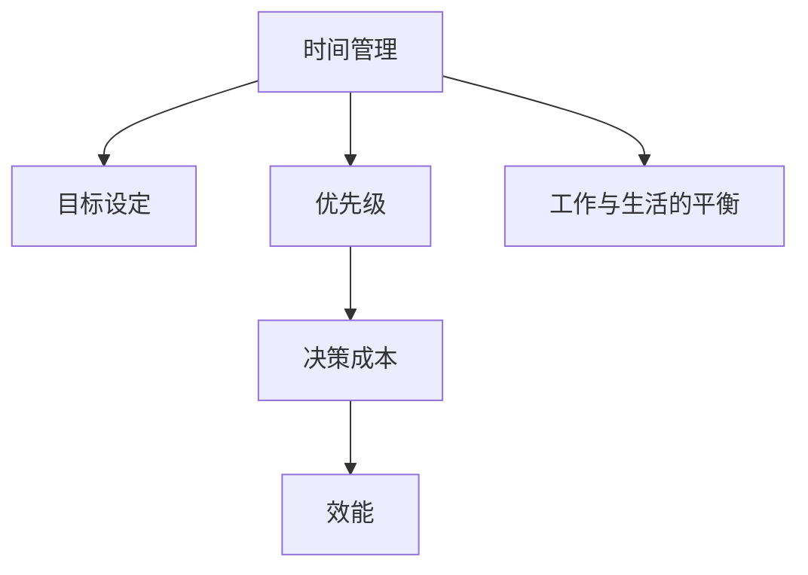

                 

# 巴菲特的双目标清单系统

## 1. 背景介绍

### 1.1 问题由来

巴菲特，一代投资大师，以其卓越的投资眼光和深刻的洞察力著称。而他的成功不仅在于其商业智慧，更在于其简单高效的工作和生活习惯。其中，最为世人所称道的是巴菲特所践行的一套独特的时间管理和目标设定系统——双目标清单系统(To-Do-Do List)。

### 1.2 问题核心关键点

巴菲特的双目标清单系统，本质上是一种通过明确划分“要做什么”和“不要做什么”，从而高效管理时间、提升工作效果的方法。其核心思想在于，通过精简目标，集中精力做最值得做的事情，同时避免不必要的干扰和浪费。

巴菲特强调，“要达成的目标应该是有限的，只做最重要的事情。”这种以目标为导向的思考方式，既有助于提升工作效能，又能够使个人工作与生活更加和谐平衡。

### 1.3 问题研究意义

巴菲特的双目标清单系统，虽然起源于投资领域，但其本质是一种时间管理和目标设定的通用原则，适用于各种职业和个人生活场景。其价值在于帮助个体简化目标，减少决策成本，提升产出效率。

## 2. 核心概念与联系

### 2.1 核心概念概述

为更好地理解巴菲特的双目标清单系统，本节将介绍几个密切相关的核心概念：

- 时间管理(Time Management)：通过合理安排工作与休息时间，提升工作效率，实现目标的过程。
- 目标设定(Goal Setting)：明确短期和长期目标，制定实现目标的计划和步骤。
- 优先级(Priority)：决定哪些任务更紧急、更重要，优先处理。
- 决策成本(Decision Cost)：做出选择时的心理负担和资源消耗。
- 效能(Efficiency)：单位时间内完成的任务量和工作效果。
- 工作与生活的平衡(Balance)：在职业和个人生活之间找到最佳点。

这些核心概念之间的逻辑关系可以通过以下Mermaid流程图来展示：



这个流程图展示了一些关键概念之间的相互关系：

1. 时间管理是目标设定的基础。没有时间规划，目标设定无从谈起。
2. 目标设定需要明确优先级。需要判断哪些任务应该先做。
3. 优先级影响决策成本。紧急重要的任务应优先处理。
4. 决策成本与效能相关。决策成本高时，需要高效完成任务。
5. 平衡工作与生活是最终目的。保持高效的同时，保证生活质量。

## 3. 核心算法原理 & 具体操作步骤
### 3.1 算法原理概述

巴菲特的双目标清单系统，其核心在于通过明确的优先级和时间管理，提高决策效率和任务执行效果。其基本原理可概括为：

1. 将目标分为两类：“要做什么”(To-Do)和“不要做什么”(Do-Not-Do)。
2. 对每个目标进行优先级排序，优先处理最重要的事情。
3. 对“要做什么”进行详细计划，分配合理的时间。
4. 对“不要做什么”进行限制，避免无效活动。
5. 通过不断迭代和调整，提升时间管理效率。

### 3.2 算法步骤详解

巴菲特的双目标清单系统执行步骤如下：

**Step 1: 列出所有任务**

将每天需要完成的任务全部列出来，包括工作任务、个人任务等。

**Step 2: 分类为“要做什么”和“不要做什么”**

根据任务的重要性和紧急性，分类为“要做什么”(To-Do)和“不要做什么”(Do-Not-Do)。通常，“要做什么”包含最重要的几项任务，“不要做什么”包含那些不必要的、浪费时间的活动。

**Step 3: 设定优先级**

对每个任务设定优先级。优先级通常分为5个等级：1、2、3、4、5，数字越大表示任务越紧急重要。例如：

- 1级任务：如“解决重大项目问题”
- 2级任务：如“进行重要会议”
- 3级任务：如“完成重要文档”
- 4级任务：如“处理日常事务”
- 5级任务：如“无关紧要的阅读”

**Step 4: 分配时间**

对“要做什么”进行详细的时间规划。根据任务的优先级，设定每天的工作时间表。巴菲特建议每天只安排几件最重要的事情，每件事情专注工作4-5小时，然后休息一会儿。

**Step 5: 执行与调整**

按照计划执行任务。执行过程中，不断回顾和调整，确保任务按优先级完成。同时，遇到突发情况时，根据实际情况调整计划。

**Step 6: 反思与总结**

每天结束时，回顾当天的工作，总结哪些任务做得好，哪些需要改进。对未完成的任务进行反思，分析原因，调整计划。

### 3.3 算法优缺点

巴菲特的双目标清单系统具有以下优点：

1. 提高决策效率。通过明确划分“要做什么”和“不要做什么”，减少了决策的负担，使得工作更加集中高效。
2. 增强目标导向。明确目标和优先级，使得工作更加有条理，避免盲目忙碌。
3. 减少无效活动。“不要做什么”清单的限制，有效避免浪费时间。
4. 提升工作效率。专注少数重要任务，避免被琐事干扰，能够快速完成任务。
5. 保持生活平衡。合理规划时间，保证工作与生活和谐。

但同时，该系统也存在一定的局限性：

1. 对任务的分类依赖个人判断。不同人对于任务的轻重缓急判断可能不同，需要个人根据自己的实际情况进行调整。
2. 灵活性不足。在突发情况下，计划的调整可能需要重新评估任务优先级，增加了工作复杂度。
3. 需要坚持执行。只有长期坚持，才能看到效果，短期内可能感觉效果不明显。
4. 对任务预测困难。任务的实际完成时间与预测时间可能存在偏差，需要不断调整。

尽管存在这些局限性，但总体而言，巴菲特的双目标清单系统仍然是一种非常实用高效的时间管理工具。

### 3.4 算法应用领域

巴菲特的双目标清单系统，本质上是一种时间管理和目标设定的通用方法，适用于各种职业和个人生活场景。

- 商业领域：帮助管理者明确优先级，提高决策效率，实现公司目标。
- 教育领域：帮助学生制定学习计划，优化学习时间，提升学习效果。
- 个人生活：帮助个人平衡工作与生活，提升生活质量。
- 健康管理：帮助制定健康计划，提高生活品质。
- 项目开发：帮助团队明确任务优先级，提升项目进展效率。

## 4. 数学模型和公式 & 详细讲解 & 举例说明

### 4.1 数学模型构建

巴菲特的双目标清单系统，虽然是一种管理方法，但也可以通过数学模型进行形式化描述。设一个工作日有T小时时间，需要完成的任务数为N，每个任务耗时为Ti小时，重要性和紧急性为Wi。

则任务的总耗时为：

$$
T_{total} = \sum_{i=1}^N T_i
$$

任务的总权重为：

$$
W_{total} = \sum_{i=1}^N W_i
$$

为了最大化任务的完成度，应优先完成重要性和紧急性较高的任务。因此，最优的任务分配应满足：

$$
\frac{\sum_{i=1}^N W_i T_i}{\sum_{i=1}^N T_i} = \frac{\sum_{i=1}^N W_i}{T_{total}}
$$

即，将总时间比例和总权重比例相等，实现最优的任务分配。

### 4.2 公式推导过程

假设任务的权重和耗时已知，我们可以通过以下步骤进行最优任务分配：

1. 计算每个任务的优先级权重：$W_i = T_i / T_{total}$
2. 将任务按权重排序：$W_{sorted}$ = sort($W_i$)
3. 计算已完成的任务权重：$W_{completed} = \sum_{i=1}^{n} W_{sorted(i)}$
4. 根据已完成的权重比例，分配剩余时间：$t_{remaining} = T_{total} - \sum_{i=1}^{n} T_{sorted(i)}$
5. 重复步骤1-4，直到所有任务完成。

### 4.3 案例分析与讲解

以一个典型的项目开发为例，该项目有五个任务：任务1、任务2、任务3、任务4、任务5，耗时分别为3小时、2小时、4小时、1小时、5小时。假设每个任务的权重和紧急性已知，按照从高到低排序如下：

- 任务3：耗时4小时，权重0.4
- 任务1：耗时3小时，权重0.3
- 任务2：耗时2小时，权重0.2
- 任务4：耗时1小时，权重0.1
- 任务5：耗时5小时，权重0.2

根据公式1和公式2，计算每个任务的优先级权重，排序如下：

- 任务3：优先级权重0.4
- 任务1：优先级权重0.3
- 任务2：优先级权重0.2
- 任务4：优先级权重0.1
- 任务5：优先级权重0.2

假设总时间为10小时，按照优先级权重分配时间：

- 任务3：4小时
- 任务1：3小时
- 任务2：2小时
- 任务4：1小时
- 任务5：2小时

这样，在8小时内，可以完成任务3、任务1、任务2和任务4，剩余2小时用于任务5。

通过这种数学模型的方法，可以科学地进行任务分配，最大化时间利用效率，避免任务堆积和资源浪费。

## 5. 项目实践：代码实例和详细解释说明
### 5.1 开发环境搭建

在进行巴菲特双目标清单系统的实践前，我们需要准备好开发环境。以下是使用Python进行开发的Python环境配置流程：

1. 安装Anaconda：从官网下载并安装Anaconda，用于创建独立的Python环境。

2. 创建并激活虚拟环境：
```bash
conda create -n to-do-do-list python=3.8 
conda activate to-do-do-list
```

3. 安装必要的库：
```bash
pip install pandas numpy matplotlib scikit-learn jupyter notebook ipython
```

完成上述步骤后，即可在`to-do-do-list`环境中开始实践。

### 5.2 源代码详细实现

以下是一个简单的Python代码实现，用于模拟巴菲特双目标清单系统的任务分配：

```python
import numpy as np
from scipy.optimize import linprog

# 定义任务信息
tasks = {
    1: {'name': '任务1', 'duration': 3, 'weight': 0.3},
    2: {'name': '任务2', 'duration': 2, 'weight': 0.2},
    3: {'name': '任务3', 'duration': 4, 'weight': 0.4},
    4: {'name': '任务4', 'duration': 1, 'weight': 0.1},
    5: {'name': '任务5', 'duration': 5, 'weight': 0.2}
}

# 总时间
total_time = 10

# 计算优先级权重
weights = np.array([task['weight'] for task in tasks.values()])
durations = np.array([task['duration'] for task in tasks.values()])
total_duration = np.sum(durations)
priorities = weights * durations / total_duration

# 求解线性规划
coefs = np.array([[1] * len(priorities), [0] * len(priorities)])
c = np.array([total_time] * len(priorities))
ineqs = np.array([[1] * len(priorities) + [1] * len(tasks)])
ineq_constrs = np.array([total_duration, total_time])
solution = linprog(c, A_ub=coefs, b_ub=ineq_constrs, bounds=[(0, 1) for _ in range(len(priorities))], method='highs')

# 输出任务分配结果
completed_tasks = [task for idx, task in enumerate(tasks.items()) if solution.x[idx] == 1]
remaining_time = total_time - sum([task['duration'] * solution.x[idx] for idx, task in enumerate(tasks.items())])
print('已完成任务：', [task['name'] for task in completed_tasks])
print('剩余时间：', remaining_time)
```

### 5.3 代码解读与分析

让我们再详细解读一下关键代码的实现细节：

**任务信息字典tasks**：
- 存储每个任务的耗时、权重和名称，用于任务优先级计算。

**总时间total_time**：
- 定义可用总时间，用于计算任务权重。

**优先级权重priorities**：
- 根据任务权重和耗时计算优先级权重。

**线性规划求解**：
- 使用scipy库的linprog函数，进行线性规划求解。求解过程使用了系数矩阵、常数向量、不等式约束等参数，确保任务总耗时不超过总时间，同时保证任务权重总和为1。

**任务分配结果**：
- 根据求解结果，输出已完成的任务列表和剩余时间。

通过这段代码，可以看出，巴菲特双目标清单系统虽然本质上是一种时间管理方法，但也可以通过数学和算法进行科学计算。开发者可以将更多精力放在业务逻辑和数据处理上，而不必过多关注算法的实现细节。

## 6. 实际应用场景
### 6.1 项目管理

巴菲特的双目标清单系统，非常适合用于项目管理。项目经理可以使用该系统进行任务优先级排序，分配时间和资源，确保项目按时完成。通过明确任务优先级，项目经理可以集中精力处理最重要的事情，避免资源浪费和任务堆积。

### 6.2 个人时间管理

个人时间管理是巴菲特双目标清单系统的典型应用场景。普通职员可以利用该系统制定每日计划，提高工作效率，同时保证生活平衡。通过明确“要做什么”和“不要做什么”，减少无效活动，提升个人生产力。

### 6.3 学生学习管理

学生在学业和生活中面临着众多任务，巴菲特双目标清单系统可以用于学习计划制定，帮助学生明确学习优先级，优化学习时间。通过合理分配学习时间和休息时间，学生可以取得更好的学习效果，避免熬夜和疲劳。

### 6.4 企业人力资源管理

人力资源部门可以利用该系统进行员工任务分配和绩效管理。通过明确每个员工的任务优先级，合理分配工作量，优化人力资源配置，提升企业效率。

### 6.5 家庭生活管理

家庭主妇或全职妈妈可以利用该系统进行家庭事务管理。通过明确每天要完成的任务和需要避免的活动，可以有效管理家庭事务，提升生活质量。

## 7. 工具和资源推荐
### 7.1 学习资源推荐

为了帮助开发者系统掌握巴菲特双目标清单系统的理论基础和实践技巧，这里推荐一些优质的学习资源：

1. 《高效能人士的七个习惯》系列博文：由巴菲特合作伙伴吉米·希思(Jim Heath)撰写，深入浅出地介绍了七个高效能习惯，其中就包括时间管理和目标设定。

2. 《Getting Things Done: The Art of Stress-Free Productivity》书籍：大卫·艾伦(David Allen)所著，系统介绍了GTD时间管理方法，帮助读者高效管理时间和任务。

3. 《The 5 AM Club》书籍：罗宾·夏尔马(Robin Sharma)所著，介绍了如何利用清晨时间进行自我管理，提升个人效能。

4. 《Deep Work: Rules for Focused Success in a Distracted World》书籍：卡尔·纽波特(Cal Newport)所著，介绍了如何通过深度工作提升个人和团队效能。

5. TED Talks上的时间管理讲座：许多时间管理专家和巴菲特的管理团队成员，如吉米·希思、艾丽斯·帕奇(Ellen Pach)等，在TED Talks上分享了他们的时间管理经验和方法，值得一读。

通过对这些资源的学习实践，相信你一定能够快速掌握巴菲特双目标清单系统的精髓，并用于解决实际的NLP问题。

### 7.2 开发工具推荐

高效的开发离不开优秀的工具支持。以下是几款用于巴菲特双目标清单系统开发的常用工具：

1. Excel或Google Sheets：用于任务列表管理，可以自动计算任务优先级和剩余时间。
2. Asana或Trello：任务管理工具，可以与团队成员协作，分配任务和进度跟踪。
3. Todoist：个人任务管理工具，可以设定任务优先级和提醒时间。
4. Outlook Calendar：日程管理工具，可以设定每日计划和提醒。
5. Focus@Will：音乐应用，提供专注音乐，帮助提高工作效率。
6. Pomodoro Technique应用：番茄工作法应用，帮助提升专注力和时间管理能力。

合理利用这些工具，可以显著提升巴菲特双目标清单系统的执行效率，加快创新迭代的步伐。

### 7.3 相关论文推荐

巴菲特双目标清单系统虽然是一种时间管理方法，但近年在学术界也引起了一定的研究兴趣。以下是几篇相关的研究论文，推荐阅读：

1. Time Management and Productivity: A Review of Theory and Research：综述了时间管理和生产力的理论研究，介绍了多种时间管理策略，包括巴菲特双目标清单系统。

2. The Effectiveness of Goal Setting in Improving Academic Performance：讨论了目标设定对学术表现的影响，支持了巴菲特双目标清单系统的有效性。

3. Strategic Time Management: A Meta-Analysis and Research Synthesis of Publications from 1991-2020：系统回顾了时间管理的实证研究，包括巴菲特双目标清单系统对工作表现的影响。

4. Understanding Time Management in Project-Based Organizations：探讨了项目管理中的时间管理策略，支持了巴菲特双目标清单系统在项目管理中的应用。

这些论文为巴菲特双目标清单系统的实践提供了理论基础和实证支持，帮助研究者更好地理解和应用该方法。

## 8. 总结：未来发展趋势与挑战
### 8.1 总结

本文对巴菲特的双目标清单系统进行了全面系统的介绍。首先阐述了巴菲特双目标清单系统的背景和核心思想，明确了其在工作、学习和生活中应用的广泛价值。其次，从原理到实践，详细讲解了双目标清单系统的执行步骤和数学模型，给出了系统代码实现和案例讲解。同时，本文还广泛探讨了双目标清单系统在各种场景中的应用前景，展示了其巨大的实践潜力。此外，本文精选了相关学习资源和开发工具，力求为读者提供全方位的技术指引。

通过本文的系统梳理，可以看到，巴菲特双目标清单系统不仅是一种高效的时间管理方法，更是一种通用的目标设定和任务分配工具。其核心理念在于通过明确优先级，优化资源配置，提升工作效能和生活质量。未来，随着该系统在更多领域的应用和推广，将进一步推动个人和团队的高效协同，提升生产力水平。

### 8.2 未来发展趋势

展望未来，巴菲特双目标清单系统将呈现以下几个发展趋势：

1. 智能化管理工具。未来的双目标清单系统将与AI技术结合，实现动态任务分配和优先级调整，进一步提升管理效率。

2. 多模态融合。将时间管理与任务管理、任务管理与日程管理等多模态融合，实现更全面的任务管理和时间规划。

3. 社交化协作。利用社交网络工具，实现任务分配和进度跟踪的实时协作，提升团队工作效率。

4. 云端集成。通过云服务集成任务管理工具，实现数据共享和远程协作，提升个人和团队的管理能力。

5. 健康管理。将时间管理与健康管理相结合，帮助用户平衡工作与生活，提升身心健康。

以上趋势凸显了巴菲特双目标清单系统未来的发展方向。这些方向的探索发展，必将进一步提升时间管理的智能化、协作化和个性化水平，为个人和团队带来更高的生产效率和生活品质。

### 8.3 面临的挑战

尽管巴菲特双目标清单系统已经取得了显著成效，但在迈向更加智能化、普适化应用的过程中，它仍面临着诸多挑战：

1. 任务分类难度。不同人对于任务的轻重缓急判断可能不同，需要更多依赖个体感知，缺乏统一的判断标准。
2. 灵活性不足。在突发情况下，计划的调整可能需要重新评估任务优先级，增加了工作复杂度。
3. 数据依赖。任务分配需要依赖大量的任务数据，缺乏数据支持的系统难以实现高效分配。
4. 用户依赖。系统依赖用户的主动配合和定期更新，否则容易出现数据偏差。
5. 持续优化。需要不断优化算法和模型，以适应不同行业、不同任务的需求。

尽管存在这些挑战，但总体而言，巴菲特双目标清单系统仍然是一种非常实用高效的时间管理工具。其核心理念在实践中得到了广泛验证，未来将进一步发展和完善，助力个人和团队的全面发展。

### 8.4 研究展望

面对巴菲特双目标清单系统所面临的挑战，未来的研究需要在以下几个方面寻求新的突破：

1. 自动化任务分类。开发更加智能化的任务分类算法，利用机器学习和大数据分析技术，提升任务的分类准确性和自动化水平。

2. 自适应调整。设计自适应算法，根据任务进展和突发情况动态调整优先级和时间分配，提升系统的灵活性和自适应能力。

3. 多任务协同。研究多任务协同算法，实现多个任务的协调和优化，提升系统的任务管理和资源配置能力。

4. 用户画像分析。利用用户画像技术，分析用户的行为习惯和偏好，定制个性化的任务分配方案。

5. 健康监测融合。将时间管理和健康监测系统相结合，帮助用户平衡工作与生活，提升身心健康。

6. 云服务支持。开发云服务支持系统，实现任务管理工具的远程访问和实时协作，提升团队协作效率。

这些研究方向的探索，必将引领巴菲特双目标清单系统迈向更高的台阶，为个人和团队带来更高的生产效率和生活品质。

## 9. 附录：常见问题与解答
----------------------------------------------------------------

**Q1：巴菲特双目标清单系统的核心思想是什么？**

A: 巴菲特双目标清单系统的核心思想在于通过明确“要做什么”和“不要做什么”，科学规划时间，合理分配任务，提升工作效能和生活质量。

**Q2：如何确定任务的优先级？**

A: 任务的优先级应根据任务的重要性和紧急性进行判断。可以使用1-5级评分法，根据任务的权重和耗时进行排序。优先处理高权重和高耗时的任务。

**Q3：巴菲特双目标清单系统是否适用于所有行业？**

A: 巴菲特双目标清单系统适用于大部分行业和个人生活场景，但不同行业的任务分类和优先级判断可能有所不同。需要根据行业特性进行调整。

**Q4：如何应对突发情况？**

A: 在执行巴菲特双目标清单系统时，应预留一定的缓冲时间，以应对突发情况。同时，通过灵活调整任务优先级和时间分配，及时处理突发事件。

**Q5：如何保持双目标清单系统的持续更新？**

A: 巴菲特双目标清单系统需要根据实际情况不断调整和更新。每天结束时，回顾当天的任务完成情况，总结经验和教训，调整第二天的计划。

通过不断反思和调整，巴菲特双目标清单系统才能真正发挥其应有的效能，成为个人和团队高效管理时间的利器。

---

作者：禅与计算机程序设计艺术 / Zen and the Art of Computer Programming

