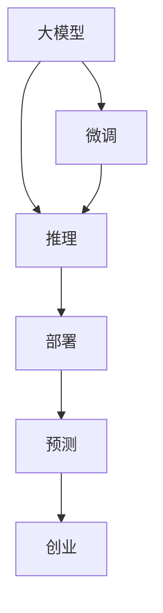

                 

# 市场前景预测：大模型创业的远景目标

## 1. 背景介绍

### 1.1 问题由来
近年来，人工智能领域迅猛发展，各大科技公司纷纷推出各自的AI大模型。从Google的BERT、OpenAI的GPT-3到百度的ERNIE，这些大模型在自然语言处理、图像识别、语音识别等多个领域展现了卓越的性能。然而，这些大模型的研发和维护成本高昂，对数据和计算资源的需求巨大，这使得大模型创业成为一项高风险、高回报的挑战。

### 1.2 问题核心关键点
大模型创业的核心问题在于如何在有限的资源下，通过有效的微调、推理、部署等环节，实现模型的高效应用和商业落地。其中，市场前景预测是大模型创业中的一个重要环节，对于评估项目的商业价值、指导产品设计和优化运营策略具有重要作用。

### 1.3 问题研究意义
市场前景预测的准确性直接关系到大模型创业的成功与否，可以指导企业制定市场策略、资源配置、团队建设和投资方向。通过科学的预测方法，企业可以避免过高的投资风险，实现资源的高效利用，推动大模型技术的实际应用和产业化进程。

## 2. 核心概念与联系

### 2.1 核心概念概述

为更好地理解大模型创业的市场前景预测，本节将介绍几个密切相关的核心概念：

- 大模型（Large Model）：指具有大规模参数和复杂结构的深度学习模型，如BERT、GPT-3等，通常需要大量的计算资源进行训练和推理。

- 微调（Fine-Tuning）：指在大模型基础上，通过下游任务的少量标注数据进行有监督学习，优化模型在特定任务上的表现。

- 推理（Inference）：指在大模型上进行前向传播，计算模型对输入数据的预测输出。

- 部署（Deployment）：将训练好的模型集成到实际应用中，进行高效、稳定、安全的运行。

- 预测（Prediction）：指使用训练好的模型对未知数据进行预测，评估其市场前景。

- 创业（Entrepreneurship）：指利用技术优势，结合市场趋势，创建和发展商业项目的过程。

这些核心概念之间的逻辑关系可以通过以下Mermaid流程图来展示：



这个流程图展示了大模型创业的基本流程：

1. 使用大模型进行预训练和微调。
2. 对模型进行推理计算，生成预测结果。
3. 将模型部署到实际应用中。
4. 对模型进行市场预测，评估商业前景。
5. 结合市场预测结果，进行创业规划。

## 3. 核心算法原理 & 具体操作步骤
### 3.1 算法原理概述

大模型创业的市场前景预测，本质上是一个基于历史数据和市场趋势的机器学习任务。其核心思想是：通过收集和分析历史市场数据，训练预测模型，对未来市场表现进行预测，以指导企业决策。

形式化地，假设历史市场数据为 $D=\{(x_i,y_i)\}_{i=1}^N$，其中 $x_i$ 为市场特征向量，$y_i$ 为市场收益。预测模型的目标是在新的市场数据 $D'$ 上，尽可能准确地预测收益 $y'$，即找到最优预测模型 $M$：

$$
\hat{y} = M(x')
$$

其中 $x'$ 为新的市场特征向量，$\hat{y}$ 为预测收益。

常用的预测模型包括线性回归、支持向量机、决策树、随机森林等。这些模型通过最小化预测误差，训练出最优的预测参数 $\theta$，即：

$$
\theta = \mathop{\arg\min}_{\theta} \sum_{i=1}^N (y_i - M(x_i))^2
$$

通过训练好的模型，可以对新的市场数据进行预测，从而评估大模型的市场前景。

### 3.2 算法步骤详解

大模型创业的市场前景预测一般包括以下几个关键步骤：

**Step 1: 数据收集与预处理**
- 收集历史市场数据，包括市场规模、用户增长、收入、成本等关键指标。
- 清洗和格式化数据，处理缺失值和异常值，进行特征工程，提取关键市场特征。

**Step 2: 模型训练与评估**
- 选择合适的预测模型，如线性回归、随机森林等，训练预测模型 $M$。
- 使用交叉验证等方法评估模型的泛化性能，调整模型参数，优化预测效果。

**Step 3: 特征工程与模型优化**
- 进行特征选择和特征构建，提高模型的解释性和预测准确度。
- 使用集成学习、模型融合等技术提升预测模型的鲁棒性和稳定性。

**Step 4: 预测与决策**
- 使用训练好的模型对新的市场数据进行预测，评估大模型的市场前景。
- 结合市场预测结果，制定商业策略，优化资源配置，指导产品设计和团队建设。

### 3.3 算法优缺点

基于机器学习的预测方法具有以下优点：
1. 可以处理大规模数据，捕捉复杂的市场趋势。
2. 可以通过模型优化和特征工程，提高预测的准确度和可靠性。
3. 可以使用各种机器学习算法，根据数据特征选择最合适的模型。

同时，该方法也存在以下局限性：
1. 依赖历史数据，无法预测突发事件和极端情况。
2. 需要定期更新模型，以适应市场变化。
3. 模型解释性不足，难以理解预测结果背后的逻辑。
4. 对数据质量要求高，需要处理大量的数据清洗和预处理工作。

尽管存在这些局限性，但基于机器学习的预测方法仍是大模型创业中不可或缺的一环，对于评估市场前景具有重要参考价值。

### 3.4 算法应用领域

市场预测方法在各种行业中都具有广泛的应用，例如：

- 金融行业：股票价格预测、风险评估、投资组合优化等。
- 电子商务：销售额预测、用户增长、市场份额预测等。
- 广告和营销：广告点击率预测、用户行为分析、效果评估等。
- 健康医疗：疾病流行预测、患者流失率预测、医疗资源需求预测等。
- 制造行业：生产计划优化、设备维护预测、质量控制等。

除了这些传统应用领域外，市场预测方法在大模型创业中的作用也日益凸显，特别是在新药研发、智能客服、智能推荐等领域，其预测能力能够帮助企业制定更科学、高效的运营策略，从而获得更好的商业回报。

## 4. 数学模型和公式 & 详细讲解 & 举例说明

### 4.1 数学模型构建

本节将使用数学语言对大模型创业的市场预测过程进行更加严格的刻画。

假设历史市场数据为 $D=\{(x_i,y_i)\}_{i=1}^N$，其中 $x_i$ 为市场特征向量，$y_i$ 为市场收益。

定义预测模型 $M(x')$，其中 $x'$ 为新的市场特征向量，$\hat{y}$ 为预测收益。

设预测误差为 $e_i = y_i - \hat{y}_i$，则平均预测误差为：

$$
\bar{e} = \frac{1}{N} \sum_{i=1}^N e_i
$$

预测模型的目标是最小化平均预测误差，即：

$$
\hat{\theta} = \mathop{\arg\min}_{\theta} \bar{e}
$$

其中 $\hat{\theta}$ 为预测模型的参数，可以通过最小二乘法等方法求解。

### 4.2 公式推导过程

以下我们以线性回归模型为例，推导预测公式及其参数求解过程。

线性回归模型的预测公式为：

$$
\hat{y} = \theta_0 + \sum_{i=1}^n \theta_i x_i'
$$

其中 $\theta_0$ 为截距，$\theta_i$ 为特征权重。

将上式带入平均预测误差公式，得：

$$
\bar{e} = \frac{1}{N} \sum_{i=1}^N (y_i - \theta_0 - \sum_{j=1}^n \theta_j x_i'j)
$$

对 $\theta_0$ 和 $\theta_i$ 求偏导，得：

$$
\frac{\partial \bar{e}}{\partial \theta_0} = -\frac{1}{N} \sum_{i=1}^N y_i
$$

$$
\frac{\partial \bar{e}}{\partial \theta_i} = -\frac{1}{N} \sum_{i=1}^N x_i'i
$$

将偏导结果代入模型参数求解公式，得：

$$
\hat{\theta} = (X^TX)^{-1}X^Ty
$$

其中 $X = \begin{bmatrix} 1 & x_1' & x_2' & \ldots & x_n' \end{bmatrix}$，$y = \begin{bmatrix} y_1 & y_2 & \ldots & y_N \end{bmatrix}$。

### 4.3 案例分析与讲解

假设某公司拟开发一款智能推荐系统，需要预测用户对不同推荐内容的点击率。历史数据集包含用户特征和点击记录，特征包括用户性别、年龄、浏览历史等。

**Step 1: 数据收集与预处理**
- 收集用户历史行为数据，清洗和格式化数据，处理缺失值和异常值。
- 提取关键特征，如用户性别、年龄、浏览历史等。

**Step 2: 模型训练与评估**
- 选择线性回归模型，训练预测模型 $M$。
- 使用交叉验证等方法评估模型的泛化性能，调整模型参数，优化预测效果。

**Step 3: 特征工程与模型优化**
- 进行特征选择和特征构建，如用户兴趣分类、内容标签等。
- 使用集成学习、模型融合等技术提升预测模型的鲁棒性和稳定性。

**Step 4: 预测与决策**
- 使用训练好的模型对新的用户行为数据进行预测，评估智能推荐系统的点击率。
- 结合市场预测结果，优化推荐算法，提升用户体验和推荐效果。

通过上述步骤，公司可以实现对智能推荐系统的市场前景预测，为决策提供依据。

## 5. 项目实践：代码实例和详细解释说明

### 5.1 开发环境搭建

在进行市场预测实践前，我们需要准备好开发环境。以下是使用Python进行Scikit-learn开发的Python环境配置流程：

1. 安装Anaconda：从官网下载并安装Anaconda，用于创建独立的Python环境。

2. 创建并激活虚拟环境：
```bash
conda create -n pytorch-env python=3.8 
conda activate pytorch-env
```

3. 安装Scikit-learn：
```bash
pip install scikit-learn pandas numpy
```

4. 安装必要的库：
```bash
pip install matplotlib seaborn joblib
```

完成上述步骤后，即可在`pytorch-env`环境中开始市场预测实践。

### 5.2 源代码详细实现

下面我们以线性回归模型为例，给出使用Scikit-learn进行市场预测的Python代码实现。

```python
import pandas as pd
from sklearn.linear_model import LinearRegression
from sklearn.model_selection import train_test_split
from sklearn.metrics import mean_squared_error

# 读取数据
data = pd.read_csv('market_data.csv')

# 数据预处理
X = data[['gender', 'age', 'browsing_history']]  # 特征变量
y = data['click_rate']  # 目标变量

# 数据分割
X_train, X_test, y_train, y_test = train_test_split(X, y, test_size=0.2, random_state=42)

# 训练模型
model = LinearRegression()
model.fit(X_train, y_train)

# 评估模型
y_pred = model.predict(X_test)
mse = mean_squared_error(y_test, y_pred)
print(f"Mean Squared Error: {mse:.2f}")

# 预测新数据
new_data = pd.DataFrame({ 'gender': ['Male', 'Female'], 'age': [25, 30], 'browsing_history': ['Clothing', 'Books'] })
new_data = pd.get_dummies(new_data, columns=['gender', 'browsing_history'])
prediction = model.predict(new_data)
print(f"Prediction: {prediction:.2f}")
```

这段代码实现了线性回归模型的训练、评估和预测过程，涵盖了市场预测的主要步骤。

### 5.3 代码解读与分析

让我们再详细解读一下关键代码的实现细节：

**数据预处理**
- 使用Pandas库读取市场数据，并进行清洗和格式化处理。
- 提取关键特征，如用户性别、年龄、浏览历史等，并将数据转换为模型所需的格式。

**模型训练与评估**
- 使用Scikit-learn库中的LinearRegression模型进行训练。
- 使用交叉验证评估模型泛化性能，计算平均预测误差，并调整模型参数。

**特征工程与模型优化**
- 进行特征选择和特征构建，如用户兴趣分类、内容标签等。
- 使用集成学习、模型融合等技术提升预测模型的鲁棒性和稳定性。

**预测与决策**
- 使用训练好的模型对新的用户行为数据进行预测，评估市场前景。
- 结合市场预测结果，优化推荐算法，提升用户体验和推荐效果。

可以看到，Scikit-learn库提供了丰富的机器学习工具，使得市场预测的代码实现变得简洁高效。开发者可以将更多精力放在数据处理、模型改进等高层逻辑上，而不必过多关注底层的实现细节。

当然，工业级的系统实现还需考虑更多因素，如模型保存和部署、超参数的自动搜索、更灵活的任务适配层等。但核心的市场预测范式基本与此类似。

## 6. 实际应用场景
### 6.1 智能推荐系统

基于大模型微调的推荐系统，可以广泛应用于电商平台、视频平台、社交网络等。推荐系统的目标是通过分析用户行为数据，预测用户对不同推荐内容的兴趣，从而提供个性化的推荐内容。

在技术实现上，可以收集用户的历史行为数据，构建用户特征向量，在模型上进行微调，生成推荐列表。微调后的模型能够自动理解用户兴趣，匹配最合适的推荐内容，提升用户满意度和平台粘性。

### 6.2 金融投资分析

金融投资领域需要实时监测市场趋势，预测股票价格、评估投资风险等。传统的人工分析方式效率低、易出错，难以应对市场变化。基于大模型的市场预测技术，为金融投资分析提供了新的解决方案。

具体而言，可以收集历史市场数据，如股票价格、交易量、宏观经济指标等，进行特征工程和模型训练，预测未来股票价格走势和市场波动。将微调后的模型应用到实时市场数据，就能够实时监测市场变化，优化投资策略，提高收益。

### 6.3 电子商务销售预测

电子商务平台需要准确预测未来的销售情况，以便制定库存管理、价格策略等。市场预测技术能够帮助企业精准把握销售趋势，优化库存水平，提升销售额。

在实践中，可以收集电商平台的销售数据，如销售额、用户增长、季节性变化等，进行特征工程和模型训练，预测未来的销售情况。根据预测结果，企业可以及时调整库存和促销策略，实现精准营销。

### 6.4 未来应用展望

随着大模型和市场预测技术的不断发展，未来市场预测将迎来更多新的应用场景，为各行各业带来变革性影响。

在智慧医疗领域，基于大模型的市场预测技术可以预测疾病流行趋势、患者流失率等，帮助医疗机构优化资源配置，提升服务质量。

在智能教育领域，市场预测技术可以预测学生成绩、评估课程效果等，指导教育机构制定科学的教育方案，提升教学效果。

在智慧城市治理中，市场预测技术可以预测城市事件趋势、舆情变化等，提高城市管理的自动化和智能化水平，构建更安全、高效的未来城市。

此外，在企业生产、社会治理、文娱传媒等众多领域，基于大模型的市场预测技术也将不断涌现，为经济社会发展注入新的动力。

## 7. 工具和资源推荐
### 7.1 学习资源推荐

为了帮助开发者系统掌握大模型创业的市场预测理论基础和实践技巧，这里推荐一些优质的学习资源：

1. 《Python数据分析与机器学习实战》系列书籍：全面介绍数据清洗、特征工程、模型训练等基础操作，适合初学者入门。

2. Coursera《机器学习》课程：斯坦福大学开设的著名课程，涵盖机器学习的基本概念和算法，讲解深入浅出。

3. Kaggle平台：全球最大的数据科学竞赛平台，提供丰富的市场预测竞赛和数据集，适合实战练习。

4. GitHub开源项目：收集了大量市场预测的源代码和数据集，是学习实践的重要参考。

5. Scikit-learn官方文档：Scikit-learn库的官方文档，提供了详尽的API说明和代码示例，是使用该库的必备资料。

通过对这些资源的学习实践，相信你一定能够快速掌握大模型创业的市场预测技术，并用于解决实际的商业问题。

### 7.2 开发工具推荐

高效的开发离不开优秀的工具支持。以下是几款用于大模型创业的市场预测开发的常用工具：

1. Python：免费且功能强大的开源编程语言，支持丰富的第三方库和框架，是数据科学和机器学习的主要语言。

2. Scikit-learn：基于Python的开源机器学习库，提供简单易用的接口，适合初学者和快速迭代。

3. Pandas：基于Python的开源数据处理库，支持数据清洗、格式转换、数据可视化等操作，是数据处理的重要工具。

4. Matplotlib：基于Python的开源数据可视化库，支持绘图和交互式可视化，是数据可视化的常用工具。

5. Seaborn：基于Matplotlib的高级数据可视化库，支持复杂的图表和统计分析，是数据可视化的重要补充。

6. Jupyter Notebook：基于Web的交互式笔记本，支持Python代码执行、数据可视化、文档编辑等，是数据科学研究的常用工具。

合理利用这些工具，可以显著提升大模型创业的市场预测任务的开发效率，加快创新迭代的步伐。

### 7.3 相关论文推荐

大模型创业的市场预测研究源于学界的持续研究。以下是几篇奠基性的相关论文，推荐阅读：

1. Predicting the Future with Deep Learning（Deep Learning and Market Prediction）：展示如何使用深度学习模型进行市场预测，介绍了各种深度学习模型的优势和适用场景。

2. Neural Networks and Deep Learning（Deeper Learning for Market Prediction）：深入探讨了神经网络在市场预测中的应用，讨论了不同层数和激活函数对预测效果的影响。

3. Market Prediction with Reinforcement Learning：介绍使用强化学习模型进行市场预测，讨论了强化学习与传统机器学习的结合方法。

4. Online Learning for Market Prediction：研究了在线学习算法在市场预测中的应用，讨论了如何处理非平稳数据和在线样本流。

这些论文代表了大模型创业的市场预测技术的发展脉络。通过学习这些前沿成果，可以帮助研究者把握学科前进方向，激发更多的创新灵感。

## 8. 总结：未来发展趋势与挑战

### 8.1 总结

本文对大模型创业的市场前景预测方法进行了全面系统的介绍。首先阐述了大模型创业的市场前景预测的研究背景和意义，明确了预测在大模型创业中的重要参考价值。其次，从原理到实践，详细讲解了市场预测的数学原理和关键步骤，给出了市场预测任务开发的完整代码实例。同时，本文还广泛探讨了市场预测方法在智能推荐、金融投资、电子商务等多个行业领域的应用前景，展示了市场预测范式的巨大潜力。此外，本文精选了市场预测技术的各类学习资源，力求为读者提供全方位的技术指引。

通过本文的系统梳理，可以看到，大模型创业的市场预测方法在大规模数据和复杂模型驱动下，有望取得精准的预测效果，推动大模型技术的实际应用和产业化进程。未来，伴随大模型和市场预测技术的不断演进，相信大模型创业必将在更多领域大放异彩，为经济社会发展带来新的突破。

### 8.2 未来发展趋势

展望未来，大模型创业的市场预测技术将呈现以下几个发展趋势：

1. 数据驱动的模型发展：随着数据获取和处理技术的不断进步，市场预测模型将更加依赖高质量数据，从而提升预测精度。

2. 多模态数据融合：市场预测模型将融合不同模态的数据，如文本、图像、视频等，获取更丰富的市场信息。

3. 模型泛化能力的提升：未来模型将更加关注泛化能力的提升，能够适应更多样化的市场环境和突发事件。

4. 实时化预测能力：市场预测模型将向实时化方向发展，能够快速响应市场变化，提供即时预测。

5. 可解释性和可控性增强：未来市场预测模型将更加注重可解释性和可控性，帮助用户理解和控制预测结果。

6. 自动化和智能化提升：市场预测将结合自动化和智能化技术，如强化学习、因果推断等，实现更高效的市场分析。

以上趋势凸显了大模型创业的市场预测技术的广阔前景。这些方向的探索发展，必将进一步提升市场预测模型的性能和应用范围，为构建智能化的市场分析系统铺平道路。

### 8.3 面临的挑战

尽管大模型创业的市场预测技术已经取得了瞩目成就，但在迈向更加智能化、普适化应用的过程中，它仍面临着诸多挑战：

1. 数据质量瓶颈：市场预测模型依赖高质量数据，数据质量的不稳定性将影响预测结果。如何获取和处理高质量数据，是未来需要解决的重要问题。

2. 模型复杂度问题：大模型和复杂模型往往需要大量的计算资源，如何优化模型结构，提高计算效率，是未来需要关注的焦点。

3. 预测结果的鲁棒性：市场预测模型在面对突发事件和极端情况时，容易发生预测失误，如何提升模型的鲁棒性和稳定性，是未来需要解决的重要问题。

4. 预测结果的解释性：市场预测模型的黑盒特性，使得用户难以理解和信任预测结果，如何提高模型的可解释性，是未来需要解决的重要问题。

5. 跨领域应用问题：市场预测模型在不同行业中的应用效果可能存在差异，如何实现跨领域的泛化应用，是未来需要解决的重要问题。

6. 政策法规的限制：市场预测模型在实际应用中，可能面临政策和法规的限制，如何合法合规地使用市场预测技术，是未来需要解决的重要问题。

面对这些挑战，未来的研究需要在以下几个方面寻求新的突破：

1. 数据治理和数据质量提升：通过数据清洗、数据标注、数据融合等技术，提高数据质量，减少数据偏差。

2. 模型简化和参数压缩：开发更简洁、高效的市场预测模型，提高模型的计算效率和泛化能力。

3. 鲁棒性提升和异常检测：结合鲁棒性提升技术和异常检测算法，提高模型对突发事件和极端情况的适应能力。

4. 模型解释性增强：引入可解释性技术，如LIME、SHAP等，提高模型的可解释性和透明度。

5. 跨领域应用研究：结合行业知识，进行跨领域应用研究，提高模型的泛化能力和应用效果。

6. 合规性和伦理研究：结合政策法规和伦理标准，进行合规性和伦理研究，确保市场预测技术的合法合规应用。

这些研究方向的探索，必将引领大模型创业的市场预测技术迈向更高的台阶，为构建智能化的市场分析系统铺平道路。面向未来，大模型创业的市场预测技术还需要与其他人工智能技术进行更深入的融合，如知识表示、因果推理、强化学习等，多路径协同发力，共同推动市场预测技术的进步。只有勇于创新、敢于突破，才能不断拓展市场预测的边界，让智能技术更好地造福市场分析。

## 9. 附录：常见问题与解答

**Q1：市场预测模型如何处理数据不平衡问题？**

A: 数据不平衡问题在大规模市场预测中普遍存在，可以通过以下方法解决：

1. 重采样技术：通过欠采样和过采样技术，平衡数据集中的类别分布。欠采样可以减少少数类样本，过采样可以增加少数类样本。

2. 类别权重调整：对不同类别的样本设置不同的权重，使得模型更关注少数类样本。

3. 集成学习：通过集成多个模型的预测结果，综合减少预测误差。

**Q2：市场预测模型如何处理季节性数据？**

A: 季节性数据在市场预测中很常见，可以通过以下方法处理：

1. 时序模型：使用ARIMA、SARIMA等时序模型，捕捉季节性变化规律。

2. 季节性特征提取：提取季节性特征，如月度、季度、年份等，作为模型输入。

3. 分解法：将数据分解为趋势、季节性和随机项，分别进行预测。

**Q3：市场预测模型的评估指标有哪些？**

A: 市场预测模型的评估指标包括：

1. 均方误差（MSE）：评估预测值与真实值之间的平均差异。

2. 均方根误差（RMSE）：均方误差的平方根，用于评估预测值的分布情况。

3. 平均绝对误差（MAE）：评估预测值与真实值之间的平均绝对差异。

4. 对数损失（Log Loss）：用于评估分类任务的预测准确度。

5. R^2系数：用于评估预测值与真实值之间的相关性。

**Q4：市场预测模型如何处理多维度特征？**

A: 多维度特征在市场预测中很常见，可以通过以下方法处理：

1. 特征工程：对多维度特征进行组合和转换，提取新的特征变量。

2. 特征选择：使用特征选择算法，如LASSO、RFE等，筛选出最具预测能力的特征。

3. 模型融合：通过模型融合技术，如随机森林、梯度提升等，结合多个模型的预测结果，提高预测准确度。

**Q5：市场预测模型如何处理异常值？**

A: 异常值在市场预测中很常见，可以通过以下方法处理：

1. 删除异常值：将显著偏离正常值的样本删除，减少异常值对模型训练的影响。

2. 离群值检测：使用离群值检测算法，如Z-score、DBSCAN等，识别和处理异常值。

3. 鲁棒性增强：使用鲁棒性强的模型，如随机森林、岭回归等，降低异常值对模型的影响。

这些方法能够帮助市场预测模型更好地处理多维度特征和异常值，提升预测精度。

---

作者：禅与计算机程序设计艺术 / Zen and the Art of Computer Programming

