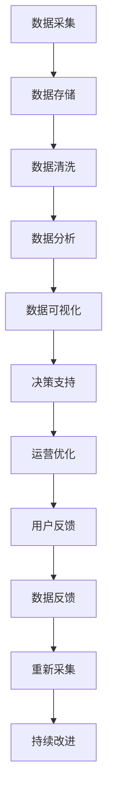

                 

# 平台经济的数据化：数据驱动平台的运营和发展

## 1. 背景介绍

### 1.1 问题由来

在数字经济蓬勃发展的当下，平台经济已经成为全球经济增长的新引擎。平台经济模式通过构建网络效应，聚集海量用户和资源，实现资源的有效匹配和利用。然而，平台经济的成功运营不仅仅依赖于资源整合，更需要精准的数据驱动。数据化运营不仅能提升平台的运营效率，还能增强平台的竞争力，为用户创造更大的价值。

平台经济的数据化主要涉及以下几个方面：

- **用户行为数据**：包括用户访问路径、点击行为、交易记录等。通过分析这些数据，可以深入了解用户需求，优化用户体验，提升转化率。
- **资源配置数据**：包括平台资源（如供给、需求、匹配算法）的使用情况和效果。通过数据分析，可以优化资源配置，提升匹配精度和效率。
- **市场环境数据**：包括宏观经济环境、行业趋势、竞争对手动态等。通过市场数据分析，可以更好地把握市场机遇，制定战略决策。

在平台经济中，数据化的关键在于如何高效地采集、存储、分析和应用数据，以便形成以数据为核心的运营策略。本文将深入探讨平台经济的数据化，阐述数据在平台运营和发展中的重要作用，提出一套基于数据驱动的平台运营策略。

## 2. 核心概念与联系

### 2.1 核心概念概述

平台经济的数据化涉及多个关键概念，主要包括：

- **平台经济**：基于网络效应构建的商业模式，通过聚集用户和资源，实现高效匹配和价值创造。
- **数据化运营**：利用数据技术手段，提升平台运营效率和用户价值，增强平台竞争力。
- **数据驱动**：以数据为核心，通过数据分析和数据应用，形成决策支持，驱动平台发展。
- **用户行为分析**：通过分析用户行为数据，了解用户需求，优化用户体验，提升转化率。
- **资源配置优化**：通过优化平台资源配置，提升匹配精度和效率，增强平台竞争力。
- **市场环境洞察**：通过分析市场环境数据，把握市场机遇，制定战略决策，保持平台领先地位。

这些概念之间存在着紧密的联系，形成一个闭环的数据驱动平台运营框架，如图1所示。


### 2.2 核心概念原理和架构的 Mermaid 流程图



## 3. 核心算法原理 & 具体操作步骤

### 3.1 算法原理概述

平台经济的数据化运营主要包括数据采集、存储、清洗、分析和应用等步骤。其中，数据分析和应用是关键。数据分析包括统计分析、机器学习、自然语言处理等方法，以发现数据中的模式和趋势。数据应用则涉及用户行为预测、资源配置优化、市场环境洞察等多个方面。

### 3.2 算法步骤详解

#### 数据采集

- **来源**：包括平台内部数据（如交易记录、用户行为数据）和外部数据（如宏观经济数据、行业报告等）。
- **工具**：使用Flume、Apache Kafka等工具进行数据采集，确保数据的及时性和完整性。

#### 数据存储

- **类型**：采用关系型数据库（如MySQL、PostgreSQL）和NoSQL数据库（如MongoDB、Redis）相结合的方式，以支持不同类型的数据存储需求。
- **方法**：利用Hadoop、Spark等大数据处理框架，对海量数据进行分布式存储和处理。

#### 数据清洗

- **目的**：去除冗余数据、处理缺失值和异常值，确保数据的准确性和一致性。
- **方法**：使用ETL工具（如Talend、DataX）进行数据清洗和转换。

#### 数据分析

- **手段**：利用统计分析、机器学习、自然语言处理等技术，对数据进行深入分析和挖掘。
- **工具**：使用R、Python、TensorFlow、PyTorch等工具进行数据分析和模型训练。

#### 数据应用

- **方向**：包括用户行为分析、资源配置优化、市场环境洞察等。
- **方法**：通过构建预测模型、推荐系统、匹配算法等，实现数据驱动的决策支持。

#### 数据反馈

- **流程**：通过A/B测试、用户反馈等方式，不断优化数据应用效果。
- **工具**：使用ABTest、用户调研工具等，收集数据应用反馈。

#### 持续改进

- **机制**：建立数据反馈机制，定期进行数据分析和应用优化。
- **手段**：利用机器学习模型进行迭代优化，确保平台运营策略的有效性和持续性。

### 3.3 算法优缺点

#### 优点

- **效率提升**：数据化运营能够大幅提升平台运营效率，降低人工成本。
- **用户体验优化**：通过用户行为分析，优化用户体验，提升转化率。
- **市场洞察能力增强**：通过市场环境数据分析，把握市场机遇，制定战略决策。
- **资源配置优化**：通过优化资源配置，提升匹配精度和效率，增强平台竞争力。

#### 缺点

- **技术复杂性高**：数据化运营需要涉及数据采集、存储、清洗、分析和应用等多个环节，技术复杂性较高。
- **数据隐私问题**：大量数据采集和存储，可能带来隐私和安全问题。
- **模型风险**：数据分析和应用依赖于模型准确性，模型风险可能导致决策失误。

### 3.4 算法应用领域

平台经济的数据化应用涵盖多个领域，包括但不限于：

- **电商**：通过用户行为分析，优化商品推荐和定价策略，提升转化率和销售额。
- **金融**：利用市场环境数据分析，把握投资机会，制定资产配置策略，降低风险。
- **出行**：通过资源配置优化，提升打车、订票等服务效率，提升用户体验。
- **医疗**：通过数据分析，优化医疗资源配置，提升诊疗效果，改善患者体验。
- **教育**：通过用户行为分析，优化课程推荐和学习路径，提升学习效果。

## 4. 数学模型和公式 & 详细讲解 & 举例说明

### 4.1 数学模型构建

平台经济的数据化运营涉及多个数学模型，包括回归模型、分类模型、聚类模型、推荐模型等。这里以回归模型为例，介绍数学模型的构建过程。

假设平台上有N个用户和M个物品，每个用户u和物品i的评分可以用$r_{ui}$表示，评分数据组成矩阵$R \in \mathbb{R}^{N\times M}$。我们的目标是预测用户u对物品i的评分$r_{ui}$。

### 4.2 公式推导过程

#### 1. 矩阵分解模型

矩阵分解模型可以将用户和物品的评分矩阵分解为两个低维矩阵的乘积，即$R \approx UV$，其中$U \in \mathbb{R}^{N\times K}, V \in \mathbb{R}^{M\times K}$，$K$为分解后的维度。

$$
r_{ui} \approx \sum_{k=1}^K U_{uk}V_{ik}
$$

#### 2. 矩阵分解优化

利用矩阵分解模型，可以对用户u对物品i的评分进行预测。模型的损失函数可以定义为均方误差：

$$
\mathcal{L} = \frac{1}{2} \sum_{i=1}^M \sum_{j=1}^N (r_{ui} - \hat{r}_{ui})^2
$$

其中$\hat{r}_{ui} = \sum_{k=1}^K U_{uk}V_{ik}$为预测评分。

### 4.3 案例分析与讲解

#### 1. 电商平台推荐系统

电商平台的推荐系统可以通过矩阵分解模型进行用户和物品评分预测，进而推荐用户可能感兴趣的商品。

##### 数据准备

- **用户数据**：包括用户ID、年龄、性别、地理位置等。
- **物品数据**：包括物品ID、价格、类别、描述等。
- **评分数据**：用户对物品的评分数据，组成矩阵$R$。

##### 模型训练

- **分解矩阵**：使用矩阵分解模型将评分矩阵$R$分解为$U$和$V$。
- **预测评分**：利用分解后的矩阵$U$和$V$，预测用户对物品的评分。
- **推荐物品**：根据预测评分，推荐用户可能感兴趣的商品。

##### 模型评估

- **准确率**：使用准确率、召回率等指标评估推荐效果。
- **用户满意度**：通过用户反馈数据，评估推荐系统的满意度。

## 5. 项目实践：代码实例和详细解释说明

### 5.1 开发环境搭建

- **环境准备**：安装Python、NumPy、Pandas、TensorFlow等工具。
- **环境配置**：配置Python环境，安装相关依赖库。

### 5.2 源代码详细实现

#### 1. 数据准备

```python
import pandas as pd

# 读取用户数据
user_data = pd.read_csv('user_data.csv')

# 读取物品数据
item_data = pd.read_csv('item_data.csv')

# 读取评分数据
rating_data = pd.read_csv('rating_data.csv')

# 数据合并
data = pd.merge(user_data, item_data, on='user_id').merge(rating_data, on='item_id')
```

#### 2. 模型训练

```python
import tensorflow as tf
from tensorflow.keras.layers import Input, Embedding, Dense, Multiply, Dot
from tensorflow.keras.models import Model

# 定义输入层
user_input = Input(shape=(user_num_features,), name='user_input')
item_input = Input(shape=(item_num_features,), name='item_input')

# 定义用户和物品嵌入层
user_embedding = Embedding(user_num_features, user_dim, input_length=user_num_features)(user_input)
item_embedding = Embedding(item_num_features, item_dim, input_length=item_num_features)(item_input)

# 定义预测层
prediction = Dot(axes=[2, 1])([user_embedding, item_embedding])

# 定义模型
model = Model(inputs=[user_input, item_input], outputs=prediction)

# 编译模型
model.compile(optimizer=tf.keras.optimizers.Adam(learning_rate=0.001),
              loss=tf.keras.losses.MeanSquaredError())
```

#### 3. 模型评估

```python
import numpy as np

# 模型预测
y_pred = model.predict([user_input_data, item_input_data])

# 计算MAE
mae = np.mean(np.abs(y_pred - y_true))
print('MAE:', mae)
```

### 5.3 代码解读与分析

- **数据处理**：使用Pandas对用户、物品和评分数据进行处理和合并。
- **模型构建**：使用TensorFlow构建矩阵分解模型，并进行预测。
- **模型评估**：计算预测评分与真实评分的均方误差（MAE）。

### 5.4 运行结果展示

运行上述代码，可以得到模型预测评分的MAE，评估推荐系统的准确性。

## 6. 实际应用场景

### 6.1 电商推荐

电商平台通过用户行为数据和物品评分数据，利用矩阵分解模型进行用户兴趣预测，优化推荐算法，提升用户购物体验。

### 6.2 金融投资

金融平台通过市场环境数据分析，利用机器学习模型预测股票市场走势，优化投资组合，降低风险。

### 6.3 出行服务

出行平台通过用户和司机的评分数据，利用回归模型进行匹配算法优化，提升打车和订票服务的匹配精度和效率。

### 6.4 未来应用展望

平台经济的数据化运营未来将在以下几个方面继续发展：

- **深度学习应用**：引入深度学习模型，提升数据预测的精度和泛化能力。
- **多模态数据融合**：将文本、图像、语音等多种模态数据融合，提升数据应用效果。
- **实时数据处理**：利用流处理框架（如Apache Kafka、Apache Flink）实现实时数据采集和处理，提升数据应用的时效性。
- **数据隐私保护**：采用隐私保护技术（如差分隐私、联邦学习），保护用户隐私和数据安全。

## 7. 工具和资源推荐

### 7.1 学习资源推荐

1. **《数据科学导论》**：系统介绍了数据科学的基础知识和应用方法，适合初学者入门。
2. **《机器学习实战》**：通过实战项目介绍了机器学习算法的实现和应用，适合进阶学习。
3. **Kaggle**：提供大量数据集和机器学习竞赛，帮助学习者实践和提升技能。
4. **Coursera**：提供多门数据分析和机器学习课程，适合在线学习。

### 7.2 开发工具推荐

1. **Python**：Python是数据科学和机器学习的主流语言，拥有丰富的第三方库和工具。
2. **NumPy**：用于高效处理数值计算。
3. **Pandas**：用于数据处理和分析。
4. **TensorFlow**：用于构建深度学习模型。
5. **Apache Kafka**：用于实时数据流处理。
6. **Apache Spark**：用于大数据处理和分析。

### 7.3 相关论文推荐

1. **《深度学习》**：Ian Goodfellow、Yoshua Bengio和Aaron Courville合著，全面介绍了深度学习的基本原理和应用。
2. **《数据分析实战》**：John W. Foreman著，通过实战项目介绍了数据分析的方法和工具。
3. **《机器学习》**：Tom Mitchell著，系统介绍了机器学习的基础理论和算法。

## 8. 总结：未来发展趋势与挑战

### 8.1 研究成果总结

平台经济的数据化运营已经取得了显著的成果，提高了平台运营效率和用户体验，增强了平台竞争力。数据化运营不仅在电商、金融、出行等领域取得了成功应用，还在医疗、教育等垂直行业逐步推广。

### 8.2 未来发展趋势

- **智能化提升**：利用深度学习和多模态数据融合，提升数据预测和分析的精度和泛化能力。
- **实时化应用**：利用流处理框架实现实时数据采集和处理，提升数据应用的时效性。
- **隐私保护强化**：采用隐私保护技术，保护用户隐私和数据安全。
- **跨领域融合**：将数据化运营技术推广到更多行业，提升整体平台运营效率和用户体验。

### 8.3 面临的挑战

- **技术复杂性高**：数据化运营涉及多个环节，技术复杂性较高，需要持续优化和改进。
- **数据隐私问题**：大量数据采集和存储，可能带来隐私和安全问题。
- **模型风险**：数据分析和应用依赖于模型准确性，模型风险可能导致决策失误。

### 8.4 研究展望

未来，平台经济的数据化运营需要在技术复杂性、数据隐私和模型风险等方面进行深入研究，进一步提升数据应用效果和平台运营效率。同时，也需要结合更多行业特点，推广数据化运营技术，提升整体平台竞争力。

## 9. 附录：常见问题与解答

### Q1：数据化运营的瓶颈是什么？

A: 数据化运营的瓶颈主要在于数据质量和数据量。高质量、全面的数据是提升数据应用效果的前提。同时，平台需要不断积累和挖掘数据，才能持续优化运营策略。

### Q2：如何提升数据采集的效率？

A: 数据采集效率的提升可以从以下几个方面入手：
- **自动化采集**：利用爬虫工具自动化采集数据，减少人工干预。
- **数据同步**：使用分布式存储和处理框架，实现数据同步和更新。
- **数据清洗**：通过数据清洗工具去除冗余数据，提高数据质量。

### Q3：数据化运营对隐私和安全的威胁有哪些？

A: 数据化运营可能带来的隐私和安全问题包括：
- **数据泄露**：大量数据存储和传输可能带来数据泄露风险。
- **隐私侵犯**：数据采集和使用可能侵犯用户隐私。
- **恶意攻击**：数据攻击和欺诈行为可能对平台造成损失。

### Q4：如何评估数据化运营的效果？

A: 数据化运营的效果评估可以从以下几个方面入手：
- **业务指标**：如转化率、订单量、满意度等。
- **用户反馈**：通过用户调研和反馈，了解用户体验和满意度。
- **模型性能**：如准确率、召回率、F1-score等。

### Q5：数据化运营的未来方向是什么？

A: 数据化运营的未来方向包括：
- **智能化提升**：利用深度学习和多模态数据融合，提升数据预测和分析的精度和泛化能力。
- **实时化应用**：利用流处理框架实现实时数据采集和处理，提升数据应用的时效性。
- **隐私保护强化**：采用隐私保护技术，保护用户隐私和数据安全。
- **跨领域融合**：将数据化运营技术推广到更多行业，提升整体平台运营效率和用户体验。

---

作者：禅与计算机程序设计艺术 / Zen and the Art of Computer Programming

