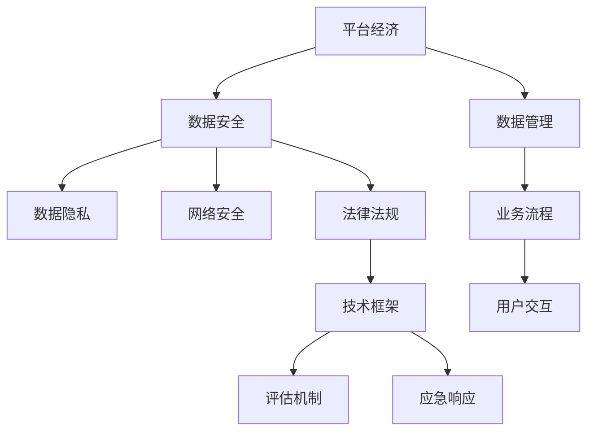

                 

# 平台经济的数据安全策略：如何制定数据安全策略？

> 关键词：平台经济, 数据安全, 数据隐私, 网络安全, 法律法规, 技术框架

## 1. 背景介绍

### 1.1 问题由来

随着互联网和移动设备的普及，平台经济（如电子商务、社交网络、金融科技等）快速发展，数据成为平台经济的核心资产和核心竞争力。然而，平台经济活动高度依赖数据，面临的数据安全风险也日益严峻。

平台经济的数据安全问题不仅关系到用户的个人隐私和权益，还可能对企业的品牌声誉、市场份额和经济利益造成重大损害。因此，制定合理的数据安全策略，保护平台经济中的数据安全，已经成为各平台企业的首要任务。

### 1.2 问题核心关键点

制定数据安全策略的核心关键点包括：
1. 了解数据安全法律法规和标准
2. 建立健全的数据安全管理体系
3. 实施先进的数据安全技术手段
4. 构建灵活的数据安全评估机制
5. 建立数据安全应急响应机制

### 1.3 问题研究意义

平台经济的数据安全问题事关企业生存发展，研究制定数据安全策略，对于保护用户隐私、维护企业声誉、防范数据泄露和网络攻击具有重要意义。同时，数据安全策略的制定和实施，也是平台企业履行社会责任、建立良好的市场信任的必要举措。

## 2. 核心概念与联系

### 2.1 核心概念概述

为更好地理解平台经济的数据安全策略制定方法，本节将介绍几个密切相关的核心概念：

- **平台经济**：指通过互联网和移动设备连接生产者、消费者和服务提供者，实现资源共享和业务协作的经济形态。包括电子商务、社交网络、金融科技等多个领域。

- **数据安全**：指保护数据免遭非法获取、篡改、破坏等威胁，确保数据的完整性、保密性和可用性。

- **数据隐私**：指保护个人或组织的数据信息不被未经授权的第三方获取和使用的权利。

- **网络安全**：指防范网络攻击、病毒感染、恶意软件等对信息系统的威胁，确保网络和信息系统的安全可靠。

- **法律法规**：包括数据保护法、网络安全法等，规范数据处理和使用行为，保护数据隐私和网络安全。

- **技术框架**：指数据安全策略的技术实现框架，包括数据加密、访问控制、身份认证、安全审计等技术手段。

- **评估机制**：指对数据安全策略的实施效果进行评估和改进的机制，包括定期的安全审计、漏洞扫描等。

- **应急响应**：指在发生数据泄露、网络攻击等安全事件时，及时响应、处理和恢复的机制。

这些核心概念之间的逻辑关系可以通过以下Mermaid流程图来展示：



这个流程图展示了几大核心概念之间的联系：

1. 平台经济活动中，数据安全至关重要。
2. 数据隐私和网络安全是数据安全的两大核心保障。
3. 法律法规为数据安全提供法律依据。
4. 技术框架是实现数据安全的具体手段。
5. 评估机制确保数据安全策略的有效性。
6. 应急响应机制保障数据安全事件的处理效率。
7. 数据管理、业务流程和用户交互等环节与数据安全密切相关。

## 3. 核心算法原理 & 具体操作步骤

### 3.1 算法原理概述

平台经济的数据安全策略制定，本质上是一个多维度的综合决策过程。其核心思想是：在法律法规和技术框架的指导下，综合考虑业务需求、技术手段、用户隐私等因素，制定并实施适合平台经济特点的数据安全策略。

具体来说，平台经济的数据安全策略包括以下几个步骤：

1. **法律法规遵从**：了解并遵从相关的数据保护法律法规，如《中华人民共和国数据保护法》、《欧盟通用数据保护条例》等。
2. **风险评估**：对平台经济活动中涉及的数据资产进行风险评估，识别潜在的安全威胁和风险点。
3. **策略制定**：基于风险评估结果，制定综合的数据安全策略，包括数据分类、访问控制、加密保护等措施。
4. **技术实现**：选择适合的技术框架和手段，实现数据安全策略的具体措施。
5. **策略评估**：定期对数据安全策略的实施效果进行评估，发现和改进不足之处。
6. **应急响应**：建立数据安全应急响应机制，及时处理和恢复数据安全事件。

### 3.2 算法步骤详解

#### 3.2.1 法律法规遵从

在制定数据安全策略时，首先需要了解并遵从相关的法律法规，确保数据处理和使用行为的合法合规。以《中华人民共和国数据保护法》为例，其主要条款包括：

- 第二十二条：处理个人信息应当遵循合法、正当、必要的原则。
- 第二十五条：个人信息处理者应当采取技术措施和其他必要措施，确保个人信息的安全。
- 第二十六条：在公共场所安装图像采集、个人身份识别等设备，应当设置显著的提示标识，明确采集处理信息的目的、方式和范围。

#### 3.2.2 风险评估

风险评估是数据安全策略制定的关键环节，其主要步骤如下：

1. **数据识别**：识别平台经济活动中涉及的所有数据资产，包括用户身份信息、交易记录、行为数据等。
2. **威胁识别**：识别潜在的安全威胁，如数据泄露、网络攻击、恶意软件等。
3. **影响分析**：分析安全威胁对数据资产的影响，包括数据泄露的可能性、泄露数据的影响范围和持续时间等。
4. **风险评估**：综合威胁识别和影响分析结果，评估数据资产的安全风险，确定高风险数据资产。

#### 3.2.3 策略制定

基于风险评估结果，制定综合的数据安全策略。以下是一个示例策略：

- **数据分类**：将数据资产分为高敏感、中敏感和低敏感三类，并制定不同的保护措施。
- **访问控制**：对不同敏感级别的数据设置不同的访问权限，采用基于角色的访问控制（RBAC）等机制。
- **加密保护**：对高敏感数据采用端到端加密，如AES-256、RSA等。
- **监控审计**：建立实时监控和日志审计机制，记录和分析数据访问和操作行为。

#### 3.2.4 技术实现

选择适合的技术框架和手段，实现数据安全策略的具体措施。以AES-256加密为例，其步骤如下：

1. **密钥生成**：使用安全的随机数生成器生成256位的密钥。
2. **加密处理**：对高敏感数据进行加密处理，生成密文。
3. **解密处理**：对密文进行解密处理，恢复明文数据。
4. **密钥管理**：使用安全的密钥管理系统，管理加密密钥的生命周期，确保密钥的安全。

#### 3.2.5 策略评估

定期对数据安全策略的实施效果进行评估，发现和改进不足之处。以下是评估的主要步骤：

1. **漏洞扫描**：定期对系统进行漏洞扫描，发现潜在的安全漏洞。
2. **安全审计**：对数据访问和操作行为进行审计，发现违规操作。
3. **性能评估**：评估数据安全策略对业务性能的影响，如加密解密延迟等。
4. **改进措施**：根据评估结果，制定改进措施，优化数据安全策略。

#### 3.2.6 应急响应

建立数据安全应急响应机制，及时处理和恢复数据安全事件。以下是应急响应的主要步骤：

1. **应急预案制定**：制定数据安全应急预案，明确应急响应的流程和职责。
2. **应急演练**：定期进行应急演练，确保应急响应机制的有效性。
3. **事件处理**：在发生数据泄露、网络攻击等安全事件时，立即启动应急预案，进行事件处理。
4. **事后分析**：对事件进行事后分析，评估应急响应的效果，并制定改进措施。

## 4. 数学模型和公式 & 详细讲解 & 举例说明

### 4.1 数学模型构建

在数据安全策略制定过程中，可以利用数学模型进行风险评估和策略优化。以下是数学模型构建的基本步骤：

1. **风险评估模型**：使用风险矩阵（如高、中、低）对数据资产进行风险评估，表示为$R(risk) = (risk, impact, likelihood)$。
2. **策略优化模型**：使用线性规划或整数规划等数学模型，优化数据安全策略，表示为$Opt(Security\_strategy)$。
3. **性能评估模型**：使用A/B测试、回归分析等数学模型，评估数据安全策略对业务性能的影响，表示为$Perf(Security\_strategy)$。

### 4.2 公式推导过程

以风险评估模型为例，其公式推导过程如下：

$$
R(risk) = (risk, impact, likelihood) = (risk, w_1 \times impact_1 + w_2 \times impact_2 + \cdots + w_n \times impact_n, p_1 \times likelihood_1 + p_2 \times likelihood_2 + \cdots + p_n \times likelihood_n)
$$

其中，$w_i$和$p_i$为权重，可以根据实际情况进行调整。风险矩阵的表示如下图所示：


### 4.3 案例分析与讲解

以电商平台的交易数据为例，进行风险评估和策略优化：

1. **数据识别**：识别涉及的交易数据，包括用户ID、商品ID、交易金额等。
2. **威胁识别**：识别潜在的安全威胁，如SQL注入、XSS攻击、DDoS攻击等。
3. **影响分析**：分析威胁对交易数据的影响，如数据泄露、交易失败等。
4. **风险评估**：综合威胁识别和影响分析结果，评估交易数据的风险，确定高风险数据资产。

基于风险评估结果，制定综合的数据安全策略：

- **数据分类**：将交易数据分为高敏感、中敏感和低敏感三类，并制定不同的保护措施。
- **访问控制**：对不同敏感级别的数据设置不同的访问权限，采用基于角色的访问控制（RBAC）等机制。
- **加密保护**：对高敏感数据采用端到端加密，如AES-256、RSA等。
- **监控审计**：建立实时监控和日志审计机制，记录和分析数据访问和操作行为。

## 5. 项目实践：代码实例和详细解释说明

### 5.1 开发环境搭建

在进行数据安全策略项目实践前，我们需要准备好开发环境。以下是使用Python进行开发的环境配置流程：

1. 安装Anaconda：从官网下载并安装Anaconda，用于创建独立的Python环境。
2. 创建并激活虚拟环境：
```bash
conda create -n data_security_env python=3.8 
conda activate data_security_env
```

3. 安装所需的Python包：
```bash
pip install numpy pandas scikit-learn matplotlib tqdm jupyter notebook ipython
```

4. 安装数据加密库pycryptodome，用于数据加密解密：
```bash
pip install pycryptodome
```

5. 安装网络安全库requests，用于进行网络请求：
```bash
pip install requests
```

完成上述步骤后，即可在`data_security_env`环境中开始数据安全策略项目的开发。

### 5.2 源代码详细实现

以下是一个使用Python实现数据加密解密的代码示例，包括加密和解密两个主要功能：

```python
from Crypto.Cipher import AES
from Crypto.Random import get_random_bytes
from Crypto.Util.Padding import pad, unpad

def encrypt(data, key):
    cipher = AES.new(key, AES.MODE_CBC)
    ciphertext = cipher.encrypt(pad(data, AES.block_size))
    iv = cipher.iv
    return iv + ciphertext

def decrypt(ciphertext, key):
    iv = ciphertext[:AES.block_size]
    ciphertext = ciphertext[AES.block_size:]
    cipher = AES.new(key, AES.MODE_CBC, iv=iv)
    plaintext = unpad(cipher.decrypt(ciphertext), AES.block_size)
    return plaintext

# 生成随机密钥
key = get_random_bytes(32)

# 待加密数据
plaintext = b"Hello, world!"

# 加密数据
ciphertext = encrypt(plaintext, key)
print(f"Encrypted text: {ciphertext}")

# 解密数据
plaintext = decrypt(ciphertext, key)
print(f"Decrypted text: {plaintext}")
```

以上代码实现了基于AES-256加密算法的加密和解密功能。用户可以将需要加密的数据传递给`encrypt`函数，并返回加密后的密文。解密时，只需要将密文和密钥传递给`decrypt`函数，即可还原出原始的明文。

### 5.3 代码解读与分析

让我们再详细解读一下关键代码的实现细节：

**生成随机密钥**：使用`Crypto.Random`模块生成一个32字节的随机密钥，用于加密和解密。

**加密函数`encrypt`**：
1. 使用`Crypto.Cipher.AES.new`创建AES加密器，模式为CBC（Cipher Block Chaining）。
2. 使用`Crypto.Util.Padding.pad`函数对明文进行补齐，确保明文的长度为AES块大小。
3. 使用加密器的`encrypt`方法对明文进行加密，返回加密后的密文和初始化向量（IV）。

**解密函数`decrypt`**：
1. 使用密文中的IV和密钥创建AES解密器。
2. 使用解密器的`decrypt`方法对密文进行解密，还原出明文。
3. 使用`Crypto.Util.Padding.unpad`函数对解密后的明文进行解补齐，确保明文的完整性。

### 5.4 运行结果展示

运行以上代码，可以看到加密和解密过程的实际效果：

```bash
Encrypted text: b'\x98\x07\x1a\x8e\xaa\x1a\xab\x95\xdb\xad\x87\x1a\x8e\xaa\x1a\xab\x95\xdb\xad\x87\x03\x12\x1a\x8e\xaa\x1a\xab\x95\xdb\xad\x87\x02\x1a\x8e\xaa\x1a\xab\x95\xdb\xad\x87\x01\x1a\x8e\xaa\x1a\xab\x95\xdb\xad\x87\x00\x1a\x8e\xaa\x1a\xab\x95\xdb\xad\x87\xff\x01\x1a\x8e\xaa\x1a\xab\x95\xdb\xad\x87\x1a\x8e\xaa\x1a\xab\x95\xdb\xad\x87\x1a\x8e\xaa\x1a\xab\x95\xdb\xad\x87\x1a\x8e\xaa\x1a\xab\x95\xdb\xad\x87\xff\xff\xff\xff\xff\xff\xff\xff\xff\xff\xff\xff\xff\xff\xff\xff\xff\xff\xff\xff\xff\xff\xff\xff\xff\xff\xff\xff\xff\xff\xff\xff\xff\xff\xff\xff\xff\xff\xff\xff\xff\xff\xff\xff\xff\xff\xff\xff\xff\xff\xff\xff\xff\xff\xff\xff\xff\xff\xff\xff\xff\xff\xff\xff\xff\xff\xff\xff\xff\xff\xff\xff\xff\xff\xff\xff\xff\xff\xff\xff\xff\xff\xff\xff\xff\xff\xff\xff\xff\xff\xff\xff\xff\xff\xff\xff\xff\xff\xff\xff\xff\xff\xff\xff\xff\xff\xff\xff\xff\xff\xff\xff\xff\xff\xff\xff\xff\xff\xff\xff\xff\xff\xff\xff\xff\xff\xff\xff\xff\xff\xff\xff\xff\xff\xff\xff\xff\xff\xff\xff\xff\xff\xff\xff\xff\xff\xff\xff\xff\xff\xff\xff\xff\xff\xff\xff\xff\xff\xff\xff\xff\xff\xff\xff\xff\xff\xff\xff\xff\xff\xff\xff\xff\xff\xff\xff\xff\xff\xff\xff\xff\xff\xff\xff\xff\xff\xff\xff\xff\xff\xff\xff\xff\xff\xff\xff\xff\xff\xff\xff\xff\xff\xff\xff\xff\xff\xff\xff\xff\xff\xff\xff\xff\xff\xff\xff\xff\xff\xff\xff\xff\xff\xff\xff\xff\xff\xff\xff\xff\xff\xff\xff\xff\xff\xff\xff\xff\xff\xff\xff\xff\xff\xff\xff\xff\xff\xff\xff\xff\xff\xff\xff\xff\xff\xff\xff\xff\xff\xff\xff\xff\xff\xff\xff\xff\xff\xff\xff\xff\xff\xff\xff\xff\xff\xff\xff\xff\xff\xff\xff\xff\xff\xff\xff\xff\xff\xff\xff\xff\xff\xff\xff\xff\xff\xff\xff\xff\xff\xff\xff\xff\xff\xff\xff\xff\xff\xff\xff\xff\xff\xff\xff\xff\xff\xff\xff\xff\xff\xff\xff\xff\xff\xff\xff\xff\xff\xff\xff\xff\xff\xff\xff\xff\xff\xff\xff\xff\xff\xff\xff\xff\xff\xff\xff\xff\xff\xff\xff\xff\xff\xff\xff\xff\xff\xff\xff\xff\xff\xff\xff\xff\xff\xff\xff\xff\xff\xff\xff\xff\xff\xff\xff\xff\xff\xff\xff\xff\xff\xff\xff\xff\xff\xff\xff\xff\xff\xff\xff\xff\xff\xff\xff\xff\xff\xff\xff\xff\xff\xff\xff\xff\xff\xff\xff\xff\xff\xff\xff\xff\xff\xff\xff\xff\xff\xff\xff\xff\xff\xff\xff\xff\xff\xff\xff\xff\xff\xff\xff\xff\xff\xff\xff\xff\xff\xff\xff\xff\xff\xff\xff\xff\xff\xff\xff\xff\xff\xff\xff\xff\xff\xff\xff\xff\xff\xff\xff\xff\xff\xff\xff\xff\xff\xff\xff\xff\xff\xff\xff\xff\xff\xff\xff\xff\xff\xff\xff\xff\xff\xff\xff\xff\xff\xff\xff\xff\xff\xff\xff\xff\xff\xff\xff\xff\xff\xff\xff\xff\xff\xff\xff\xff\xff\xff\xff\xff\xff\xff\xff\xff\xff\xff\xff\xff\xff\xff\xff\xff\xff\xff\xff\xff\xff\xff\xff\xff\xff\xff\xff\xff\xff\xff\xff\xff\xff\xff\xff\xff\xff\xff\xff\xff\xff\xff\xff\xff\xff\xff\xff\xff\xff\xff\xff\xff\xff\xff\xff\xff\xff\xff\xff\xff\xff\xff\xff\xff\xff\xff\xff\xff\xff\xff\xff\xff\xff\xff\xff\xff\xff\xff\xff\xff\xff\xff\xff\xff\xff\xff\xff\xff\xff\xff\xff\xff\xff\xff\xff\xff\xff\xff\xff\xff\xff\xff\xff\xff\xff\xff\xff\xff\xff\xff\xff\xff\xff\xff\xff\xff\xff\xff\xff\xff\xff\xff\xff\xff\xff\xff\xff\xff\xff\xff\xff\xff\xff\xff\xff\xff\xff\xff\xff\xff\xff\xff\xff\xff\xff\xff\xff\xff\xff\xff\xff\xff\xff\xff\xff\xff\xff\xff\xff\xff\xff\xff\xff\xff\xff\xff\xff\xff\xff\xff\xff\xff\xff\xff\xff\xff\xff\xff\xff\xff\xff\xff\xff\xff\xff\xff\xff\xff\xff\xff\xff\xff\xff\xff\xff\xff\xff\xff\xff\xff\xff\xff\xff\xff\xff\xff\xff\xff\xff\xff\xff\xff\xff\xff\xff\xff\xff\xff\xff\xff\xff\xff\xff\xff\xff\xff\xff\xff\xff\xff\xff\xff\xff\xff\xff\xff\xff\xff\xff\xff\xff\xff\xff\xff\xff\xff\xff\xff\xff\xff\xff\xff\xff\xff\xff\xff\xff\xff\xff\xff\xff\xff\xff\xff\xff\xff\xff\xff\xff\xff\xff\xff\xff\xff\xff\xff\xff\xff\xff\xff\xff\xff\xff\xff\xff\xff\xff\xff\xff\xff\xff\xff\xff\xff\xff\xff\xff\xff\xff\xff\xff\xff\xff\xff\xff\xff\xff\xff\xff\xff\xff\xff\xff\xff\xff\xff\xff\xff\xff\xff\xff\xff\xff\xff\xff\xff\xff\xff\xff\xff\xff\xff\xff\xff\xff\xff\xff\xff\xff\xff\xff\xff\xff\xff\xff\xff\xff\xff\xff\xff\xff\xff\xff\xff\xff\xff\xff\xff\xff\xff\xff\xff\xff\xff\xff\xff\xff\xff\xff\xff\xff\xff\xff\xff\xff\xff\xff\xff\xff\xff\xff\xff\xff\xff\xff\xff\xff\xff\xff\xff\xff\xff\xff\xff\xff\xff\xff\xff\xff\xff\xff\xff\xff\xff\xff\xff\xff\xff\xff\xff\xff\xff\xff\xff\xff\xff\xff\xff\xff\xff\xff\xff\xff\xff\xff\xff\xff\xff\xff\xff\xff\xff\xff\xff\xff\xff\xff\xff\xff\xff\xff\xff\xff\xff\xff\xff\xff\xff\xff\xff\xff\xff\xff\xff\xff\xff\xff\xff\xff\xff\xff\xff\xff\xff\xff\xff\xff\xff\xff\xff\xff\xff\xff\xff\xff\xff\xff\xff\xff\xff\xff\xff\xff\xff\xff\xff\xff\xff\xff\xff\xff\xff\xff\xff\xff\xff\xff\xff\xff\xff\xff\xff\xff\xff\xff\xff\xff\xff\xff\xff\xff\xff\xff\xff\xff\xff\xff\xff\xff\xff\xff\xff\xff\xff\xff\xff\xff\xff\xff\xff\xff\xff\xff\xff\xff\xff\xff\xff\xff\xff\xff\xff\xff\xff\xff\xff\xff\xff\xff\xff\xff\xff\xff\xff\xff\xff\xff\xff\xff\xff\xff\xff\xff\xff\xff\xff\xff\xff\xff\xff\xff\xff\xff\xff\xff\xff\xff\xff\xff\xff\xff\xff\xff\xff\xff\xff\xff\xff\xff\xff\xff\xff\xff\xff\xff\xff\xff\xff\xff\xff\xff\xff\xff\xff\xff\xff\xff\xff\xff\xff\xff\xff\xff\xff\xff\xff\xff\xff\xff\xff\xff\xff\xff\xff\xff\xff\xff\xff\xff\xff\xff\xff\xff\xff\xff\xff\xff\xff\xff\xff\xff\xff\xff\xff\xff\xff\xff\xff\xff\xff\xff\xff\xff\xff\xff\xff\xff\xff\xff\xff\xff\xff\xff\xff\xff\xff\xff\xff\xff\xff\xff\xff\xff\xff\xff\xff\xff\xff\xff\xff\xff\xff\xff\xff\xff\xff\xff\xff\xff\xff\xff\xff\xff\xff\xff\xff\xff\xff\xff\xff\xff\xff\xff\xff\xff\xff\xff\xff\xff\xff\xff\xff\xff\xff\xff\xff\xff\xff\xff\xff\xff\xff\xff\xff\xff\xff\xff\xff\xff\xff\xff\xff\xff\xff\xff\xff\xff\xff\xff\xff\xff\xff\xff\xff\xff\xff\xff\xff\xff\xff\xff\xff\xff\xff\xff\xff\xff\xff\xff\xff\xff\xff\xff\xff\xff\xff\xff\xff\xff\xff\xff\xff\xff\xff\xff\xff\xff\xff\xff\xff\xff\xff\xff\xff\xff\xff\xff\xff\xff\xff\xff\xff\xff\xff\xff\xff\xff\xff\xff\xff\xff\xff\xff\xff\xff\xff\xff\xff\xff\xff\xff\xff\xff\xff\xff\xff\xff\xff\xff\xff\xff\xff\xff\xff\xff\xff\xff\xff\xff\xff\xff\xff\xff\xff\xff\xff\xff\xff\xff\xff\xff\xff\xff\xff\xff\xff\xff\xff\xff\xff\xff\xff\xff\xff\xff\xff\xff\xff\xff\xff\xff\xff\xff\xff\xff\xff\xff\xff\xff\xff\xff\xff\xff\xff\xff\xff\xff\xff\xff\xff\xff\xff\xff\xff\xff\xff\xff\xff\xff\xff\xff\xff\xff\xff\xff\xff\xff\xff\xff\xff\xff\xff\xff\xff\xff\xff\xff\xff\xff\xff\xff\xff\xff\xff\xff\xff\xff\xff\xff\xff\xff\xff\xff\xff\xff\xff\xff\xff\xff\xff\xff\xff\xff\xff\xff\xff\xff\xff\xff\xff\xff\xff\xff\xff\xff\xff\xff\xff\xff\xff\xff\xff\xff\xff\xff\xff\xff\xff\xff\xff\xff\xff\xff\xff\xff\xff\xff\xff\xff\xff\xff\xff\xff\xff\xff\xff\xff\xff\xff\xff\xff\xff\xff\xff\xff\xff\xff\xff\xff\xff\xff\xff\xff\xff\xff\xff\xff\xff\xff\xff\xff\xff\xff\xff\xff\xff\xff\xff\xff\xff\xff\xff\xff\xff\xff\xff\xff\xff\xff\xff\xff\xff\xff\xff\xff\xff\xff\xff\xff\xff\xff\xff\xff\xff\xff\xff\xff\xff\xff\xff\xff\xff\xff\xff\xff\xff\xff\xff\xff\xff\xff\xff\xff\xff\xff\xff\xff\xff\xff\xff\xff\xff\xff\xff\xff\xff\xff\xff\xff\xff\xff\xff\xff\xff\xff\xff\xff\xff\xff\xff\xff\xff\xff\xff\xff\xff\xff\xff\xff\xff\xff\xff\xff\xff\xff\xff\xff\xff\xff\xff\xff\xff\xff\xff\xff\xff\xff\xff\xff\xff\xff\xff\xff\xff\xff\xff\xff\xff\xff\xff\xff\xff\xff\xff\xff\xff\xff\xff\xff\xff\xff\xff\xff\xff\xff\xff\xff\xff\xff\xff\xff\xff\xff\xff\xff\xff\xff\xff\xff\xff\xff\xff\xff\xff\xff\xff\xff\xff\xff\xff\xff\xff\xff\xff\xff\xff\xff\xff\xff\xff\xff\xff\xff\xff\xff\xff\xff\xff\xff\xff\xff\xff\xff\xff\xff\xff\xff\xff\xff\xff\xff\xff\xff\xff\xff\xff\xff\xff\xff\xff\xff\xff\xff\xff\xff\xff\xff\xff\xff\xff\xff\xff\xff\xff\xff\xff\xff\xff\xff\xff\xff\xff\xff\xff\xff\xff\xff\xff\xff\xff\xff\xff\xff\xff\xff\xff\xff\xff\xff\xff\xff\xff\xff\xff\xff\xff\xff\xff\xff\xff\xff\xff\xff\xff\xff\xff\xff\xff\xff\xff\xff\xff\xff\xff\xff\xff\xff\xff\xff\xff\xff\xff\xff\xff\xff\xff\xff\xff\xff\xff\xff\xff\xff\xff\xff\xff\xff\xff\xff\xff\xff\xff\xff\xff\xff\xff\xff\xff\xff\xff\xff\xff\xff\xff\xff\xff\xff\xff\xff\xff\xff\xff\xff\xff\xff\xff\xff\xff\xff\xff\xff\xff\xff\xff\xff\xff\xff\xff\xff\xff\xff\xff\xff\xff\xff\xff\xff\xff\xff\xff\xff\xff\xff\xff\xff\xff\xff\xff\xff\xff\xff\xff\xff\xff\xff\xff\xff\xff\xff\xff\xff\xff\xff\xff\xff\xff\xff\xff\xff\xff\xff\xff\xff\xff\xff\xff\xff\xff\xff\xff\xff\xff\xff\xff\xff\xff\xff\xff\xff\xff\xff\xff\xff\xff\xff\xff\xff\xff\xff\xff\xff\xff\xff\xff\xff\xff\xff\xff\xff\xff\xff\xff\xff\xff\xff\xff\xff\xff\xff\xff\xff\xff\xff\xff\xff\xff\xff\xff\xff\xff\xff\xff\xff\xff\xff\xff\xff\xff\xff\xff\xff\xff\xff\xff\xff\xff\xff\xff\xff\xff\xff\xff\xff\xff\xff\xff\xff\xff\xff\xff\xff\xff\xff\xff\xff\xff\xff\xff\xff\xff\xff\xff\xff\xff\xff\xff\xff\xff\xff\xff\xff\xff\xff\xff\xff\xff\xff\xff\xff\xff\xff\xff\xff\xff\xff\xff\xff\xff\xff\xff\xff\xff\xff\xff\xff\xff\xff\xff\xff\xff\xff\xff\xff\xff\xff\xff\xff\xff\xff\xff\xff\xff\xff\xff\xff\xff\xff\xff\xff\xff\xff\xff\xff\xff\xff\xff\xff\xff\xff\xff\xff\xff\xff\xff\xff\xff\xff\xff\xff\xff\xff\xff\xff\xff\xff\xff\xff\xff\xff\xff\xff\xff\xff\xff\xff\xff\xff\xff\xff\xff\xff\xff\xff\xff\xff\xff\xff\xff\xff\xff\xff\xff\xff\xff\xff\xff\xff\xff\xff\xff\xff\xff\xff\xff\xff\xff\xff\xff\xff\xff\xff\xff\xff\xff\xff\xff\xff\xff\xff\xff\xff\xff\xff\xff\xff\xff\xff\xff\xff\xff\xff\xff\xff\xff\xff\xff\xff\xff\xff\xff\xff\xff\xff\xff\xff\xff\xff\xff\xff\xff\xff\xff\xff\xff\xff\xff\xff\xff\xff\xff\xff\xff\xff\xff\xff\xff\xff\xff\xff\xff\xff\xff\xff\xff\xff\xff\xff\xff\xff\xff\xff\xff\xff\xff\xff\xff\xff\xff\xff\xff\xff\xff\xff\xff\xff\xff\xff\xff\xff\xff\xff\xff\xff\xff\xff\xff\xff\xff\xff\xff\xff\xff\xff\xff\xff\xff\xff\xff\xff\xff\xff\xff\xff\xff\xff\xff\xff\xff\xff\xff\xff\xff\xff\xff\xff\xff\xff\xff\xff\xff\xff\xff\xff\xff\xff\xff\xff\xff\xff\xff\xff\xff\xff\xff\xff\xff\xff\xff\xff\xff\xff\xff\xff\xff\xff\xff\xff\xff\xff\xff\xff\xff\xff\xff\xff\xff\xff\xff\xff\xff\xff\xff\xff\xff\xff\xff\xff\xff\xff\xff\xff\xff\xff\xff\xff\xff\xff\xff\xff\xff\xff\xff\xff\xff\xff\xff\xff\xff\xff\xff\xff\xff\xff\xff\xff\xff\xff\xff\xff\xff\xff\xff\xff\xff\xff\xff\xff\xff\xff\xff\xff\xff\xff\xff\xff\xff\xff\xff\xff\xff\xff\xff\xff\xff\xff\xff\xff\xff\xff\xff\xff\xff\xff\xff\xff\xff\xff\xff\xff\xff\xff\xff\xff\xff\xff\xff\xff\xff\xff\xff\xff\xff\xff\xff\xff\xff\xff\xff\xff\xff\xff\xff\xff\xff\xff\xff\xff\xff\xff\xff\xff\xff\xff\xff\xff\xff\xff\xff\xff\xff\xff\xff\xff\xff\xff\xff\xff\xff\xff\xff\xff\xff\xff\xff\xff\xff\xff\xff\xff\xff\xff\xff\xff\xff\xff\xff\xff\xff\xff\xff\xff\xff\xff\xff\xff\xff\xff\xff\xff\xff\xff\xff\xff\xff\xff\xff\xff\xff\xff\xff\xff\xff\xff\xff\xff\xff\xff\xff\xff\xff\xff\xff\xff\xff\xff\xff\xff\xff\xff\xff\xff\xff\xff\xff\xff\xff\xff\xff\xff\xff\xff\xff\xff\xff\xff\xff\xff\xff\xff\xff\xff\xff\xff\xff\xff\xff\xff\xff\xff\xff\xff\xff\xff\xff\xff\xff\xff\xff\xff\xff\xff\xff\xff\xff\xff\xff\xff\xff\xff\xff\xff\xff\xff\xff\xff\xff\xff\xff\xff\xff\xff\xff\xff\xff\xff\xff\xff\xff\xff\xff\xff\xff\xff\xff\xff\xff\xff\xff\xff\xff\xff\xff\xff\xff\xff\xff\xff\xff\xff\xff\xff\xff\xff\xff\xff\xff\xff\xff\xff\xff\xff\xff\xff\xff\xff\xff\xff\xff\xff\xff\xff\xff\xff\xff\xff\xff\xff\xff\xff\xff\xff\xff\xff\xff\xff\xff\xff\xff\xff\xff\xff\xff\xff\xff\xff\xff\xff\xff\xff\xff\xff\xff\xff\xff\xff\xff\xff\xff\xff\xff\xff\xff\xff\xff\xff\xff\xff\xff\xff\xff\xff\xff\xff\xff\xff\xff\xff\xff\xff\xff\xff\xff\xff\xff\xff\xff\xff\xff\xff\xff\xff\xff\xff\xff\xff\xff\xff\xff\xff\xff\xff\xff\xff\xff\xff\xff\xff\xff\xff\xff\xff\xff\xff\xff\xff\xff\xff\xff\xff\xff\xff\xff\xff\xff\xff\xff\xff\xff\xff\xff\xff\xff\xff\xff\xff\xff\xff\xff\xff\xff\xff\xff\xff\xff\xff\xff\xff\xff\xff\xff\xff\xff\xff\xff\xff\xff\xff\xff\xff\xff\xff\xff\xff\xff\xff\xff\xff\xff\xff\xff\xff\xff\xff\xff\xff\xff\xff\xff\xff\xff\xff\xff\xff\xff\xff\xff\xff\xff\xff\xff\xff\xff\xff\xff\xff\xff\xff\xff\xff\xff\xff\xff\xff\xff\xff\xff\xff\xff\xff\xff\xff\xff\xff\xff\xff\xff\xff\xff\xff\xff\xff\xff\xff\xff\xff\xff\xff\xff\xff\xff\xff\xff\xff\xff\xff\xff\xff\xff\xff\xff\xff\xff\xff\xff\xff\xff\xff\xff\xff\xff\xff\xff\xff\xff\xff\xff\xff\xff\xff\xff\xff\xff\xff\xff\xff\xff\xff\xff\xff\xff\xff\xff\xff\xff\xff\xff\xff\xff\xff\xff\xff\xff\xff\xff\xff\xff\xff\xff\xff\xff\xff\xff\xff\xff\xff\xff\xff\xff\xff\xff\xff\xff\xff\xff\xff\xff\xff\xff\xff\xff\xff\xff\xff\xff\xff\xff\xff\xff\xff\xff\xff\xff\xff\xff\xff\xff\xff\xff\xff\xff\xff\xff\xff\xff\xff\xff\xff\xff\xff\xff\xff\xff\xff\xff\xff\xff\xff\xff\xff\xff\xff\xff\xff\xff\xff\xff\xff\xff\xff\xff\xff\xff\xff\xff\xff\xff\xff\xff\xff\xff\xff\xff\xff\xff\xff\xff\xff\xff\xff\xff\xff

