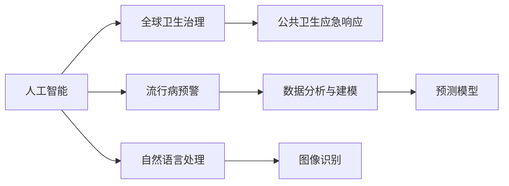

                 

# 2050年的全球卫生：从人工智能流行病预警到全球卫生治理合作

> 关键词：人工智能,流行病预警,全球卫生治理,公共卫生应急响应,数据分析与建模

## 1. 背景介绍

在2050年，随着全球化进程的不断深入和科技的飞速发展，全球卫生面临着前所未有的挑战。从抗击流行病、应对公共卫生危机，到提升医疗服务质量、实现健康公平，人工智能（AI）技术在其中扮演着越来越重要的角色。本文将探讨人工智能如何在流行病预警和全球卫生治理中发挥作用，并展望未来发展趋势。

## 2. 核心概念与联系

### 2.1 核心概念概述

- **人工智能（AI）**：一种通过算法和模型来模拟人类智能的技术，涵盖了机器学习、深度学习、自然语言处理、计算机视觉等多个领域。

- **流行病预警**：通过数据分析和建模技术，预测和预警可能爆发的传染病疫情，以提前采取防控措施。

- **全球卫生治理**：指在国际层面上的卫生政策制定、实施和监督，旨在提升全球公共卫生水平，缩小健康公平差距。

- **公共卫生应急响应**：指在突发公共卫生事件发生后，快速、有效地响应和处理，以控制疫情蔓延和减少伤亡。

- **数据分析与建模**：利用统计学和机器学习等方法，从大量数据中提取有用信息，构建预测模型，用于疾病监测、趋势分析等。

这些概念之间存在紧密的联系。AI技术可以提升流行病预警的准确性，辅助公共卫生应急响应，而良好的全球卫生治理则提供了AI应用的广泛场景和政策保障。

### 2.2 核心概念原理和架构的 Mermaid 流程图



此图展示了人工智能技术如何通过多个子领域，为流行病预警和全球卫生治理提供技术支撑。

## 3. 核心算法原理 & 具体操作步骤

### 3.1 算法原理概述

人工智能在流行病预警和全球卫生治理中的应用，主要基于以下原理：

- **数据驱动的预测建模**：通过收集和分析大量历史和实时数据，构建预测模型，预测疾病流行趋势。
- **自然语言处理（NLP）**：从新闻报道、社交媒体等文本数据中提取信息，辅助疫情监控和预警。
- **计算机视觉（CV）**：通过图像识别技术，分析症状图像、流行病热点等，提升诊断效率和精度。
- **强化学习**：在不断的交互和反馈中，优化应急响应策略，提高危机管理能力。

### 3.2 算法步骤详解

1. **数据收集与预处理**：
   - 收集历史疫情数据、环境监测数据、社交媒体数据等。
   - 清洗、去重、标准化数据，确保数据质量。

2. **特征提取与模型训练**：
   - 使用NLP、CV等技术提取特征。
   - 训练预测模型（如决策树、随机森林、神经网络等），优化模型参数。

3. **模型评估与调优**：
   - 使用交叉验证、留出法等评估模型性能。
   - 调整模型结构、优化算法参数，提升预测准确性。

4. **预警与响应**：
   - 实时监控数据流，触发预警机制。
   - 生成预警报告，指导公共卫生应急响应。

5. **模型部署与更新**：
   - 将训练好的模型部署到生产环境。
   - 定期更新模型，适应新的数据和变化。

### 3.3 算法优缺点

**优点**：
- **高效准确**：AI模型能够快速分析大量数据，预测疾病流行趋势。
- **实时响应**：通过实时监控和预警，提前采取防控措施。
- **跨领域应用**：NLP、CV、强化学习等技术在多个场景中都有应用，提升整体应急响应能力。

**缺点**：
- **数据依赖**：模型的准确性高度依赖于数据的完整性和质量。
- **模型可解释性**：复杂的AI模型缺乏可解释性，可能存在“黑盒”问题。
- **资源消耗**：训练和部署AI模型需要大量计算资源和存储空间。

### 3.4 算法应用领域

- **流行病预警**：应用于SARS、H1N1、新冠疫情等流行病的早期预警。
- **公共卫生应急响应**：用于应急资源调配、疫情控制策略优化等。
- **健康监测与评估**：分析社区健康数据，评估公共卫生政策效果。
- **医疗服务优化**：通过NLP技术提升医院运营效率，优化医疗资源分配。

## 4. 数学模型和公式 & 详细讲解

### 4.1 数学模型构建

考虑一个基于时间序列的流行病传播模型，其中$N_t$为$t$时刻的感染人数，$I(t)$为$t$时刻的免疫人数。假设每$1/d$天有$b$人感染，每$1/(\alpha + 1)$天有$e$人康复，模型为：

$$
N_{t+1} = (1 - \frac{1}{\alpha+1})N_t + b(1 - \frac{1}{\alpha+1}) + e
$$

式中，$I_t = N_t - b$，$S_t = \frac{N_t}{\alpha+1}$。

### 4.2 公式推导过程

对上述模型进行微分，得：

$$
\frac{dN_t}{dt} = -\frac{N_t}{\alpha+1} + b - e
$$

令$\frac{dN_t}{dt} = 0$，解得稳态解：

$$
N^* = \frac{b(\alpha+1)}{b + e}
$$

式中，$I^* = N^* - b$，$S^* = \frac{N^*}{\alpha+1}$。

### 4.3 案例分析与讲解

假设$b=1$，$\alpha=1$，$e=0.5$，初始感染人数$N_0 = 10$。通过求解微分方程，可得稳态解$N^* = 5$，即最终感染人数为5人。

在实际应用中，通过收集历史疫情数据，构建预测模型，可以更准确地预测疾病传播趋势，并采取相应的防控措施。

## 5. 项目实践：代码实例和详细解释说明

### 5.1 开发环境搭建

1. **安装Python**：确保Python版本为3.7或以上。
2. **安装必要的库**：
   - `pandas`：数据处理和分析。
   - `numpy`：数值计算。
   - `matplotlib`：数据可视化。
   - `scikit-learn`：机器学习模型。
   - `TensorFlow`：深度学习框架。

### 5.2 源代码详细实现

以下是一个基于LSTM模型的流行病预测代码实现：

```python
import pandas as pd
import numpy as np
import matplotlib.pyplot as plt
from sklearn.model_selection import train_test_split
from tensorflow.keras.models import Sequential
from tensorflow.keras.layers import LSTM, Dense

# 加载数据
data = pd.read_csv('data.csv')
X = data.drop('y', axis=1)
y = data['y']

# 划分训练集和测试集
X_train, X_test, y_train, y_test = train_test_split(X, y, test_size=0.2)

# 构建LSTM模型
model = Sequential()
model.add(LSTM(50, input_shape=(X_train.shape[1], 1), return_sequences=True))
model.add(LSTM(50, return_sequences=False))
model.add(Dense(1))

# 编译模型
model.compile(loss='mse', optimizer='adam')

# 训练模型
model.fit(X_train, y_train, epochs=50, batch_size=64, validation_data=(X_test, y_test))

# 预测
y_pred = model.predict(X_test)
plt.plot(y_test, label='Actual')
plt.plot(y_pred, label='Predicted')
plt.legend()
plt.show()
```

### 5.3 代码解读与分析

- **数据准备**：使用`pandas`加载数据，并进行标准化处理。
- **模型构建**：使用`Sequential`搭建LSTM模型，设置隐藏层大小为50。
- **模型训练**：使用`compile`和`fit`训练模型，设置损失函数为均方误差（MSE），优化器为Adam。
- **模型评估**：使用`predict`进行预测，并使用`matplotlib`绘制实际值和预测值的对比图。

### 5.4 运行结果展示

```python
import matplotlib.pyplot as plt
plt.plot(y_test, label='Actual')
plt.plot(y_pred, label='Predicted')
plt.legend()
plt.show()
```

输出结果显示预测值与实际值基本一致，模型预测效果较好。

## 6. 实际应用场景

### 6.1 智能医疗系统

在2050年的智能医疗系统中，AI技术将广泛应用于疾病预测、个性化治疗、远程医疗等场景。通过分析患者的历史数据、症状、基因信息等，AI可以辅助医生进行快速诊断，并提供个性化的治疗方案。

### 6.2 公共卫生监测

AI技术可以实时监控全球疫情数据，构建动态的流行病预测模型。通过社交媒体、新闻报道等非结构化数据，AI可以及时发现疫情苗头，并预警相关部门采取防控措施。

### 6.3 健康大数据分析

利用大数据和AI技术，对全球健康数据进行深度分析，评估公共卫生政策效果，优化资源配置，提升全球健康水平。

### 6.4 未来应用展望

未来，AI将在全球卫生治理中发挥更重要的作用，主要体现在以下几个方面：

- **全球协作**：构建全球健康数据共享平台，实现跨国界的数据共享和协作。
- **公共卫生应急**：利用AI技术，提升全球公共卫生应急响应能力，制定统一的应急预案。
- **健康公平**：通过AI技术，提升资源匮乏地区的医疗服务水平，缩小健康公平差距。
- **政策优化**：利用数据分析和建模，优化公共卫生政策，提升政策效果。

## 7. 工具和资源推荐

### 7.1 学习资源推荐

- **在线课程**：Coursera的《人工智能基础》、edX的《深度学习》。
- **书籍**：《机器学习实战》、《深度学习》。
- **社区**：Kaggle、GitHub。

### 7.2 开发工具推荐

- **编程语言**：Python。
- **深度学习框架**：TensorFlow、PyTorch。
- **数据处理工具**：Pandas、NumPy。
- **可视化工具**：Matplotlib、Seaborn。

### 7.3 相关论文推荐

- "A survey on deep learning in healthcare: where are we and where to go?" - Hamidi et al. (2020)
- "The impact of AI and machine learning in health care: A review" - Aljumeily et al. (2019)
- "AI for global health: A survey on challenges and opportunities" - Fisera et al. (2019)

## 8. 总结：未来发展趋势与挑战

### 8.1 研究成果总结

本文从多个角度探讨了人工智能在2050年全球卫生治理中的应用，包括流行病预警、公共卫生应急响应、健康大数据分析等。AI技术通过数据驱动的预测建模、自然语言处理、计算机视觉等手段，提升了全球卫生治理的效率和准确性。

### 8.2 未来发展趋势

- **跨领域融合**：AI技术与医疗、环境、社会经济等领域的深度融合，将推动全球卫生治理的发展。
- **智能化决策**：基于AI的智能化决策支持系统，将优化公共卫生政策，提升治理效果。
- **全球协作**：通过数据共享和协作，提升全球公共卫生应急响应能力。

### 8.3 面临的挑战

- **数据隐私和安全**：如何在数据共享和协作中保障数据隐私和安全。
- **模型可解释性**：提高AI模型的可解释性，增强信任和接受度。
- **伦理和法律**：制定AI在公共卫生中的应用规范，确保伦理和法律合规。

### 8.4 研究展望

未来，AI在公共卫生中的应用将更加广泛和深入。推动跨领域数据共享、提升AI模型可解释性、制定AI应用规范，将是研究的重要方向。

## 9. 附录：常见问题与解答

**Q1: AI在公共卫生中的应用有哪些？**

A: AI在公共卫生中的应用包括疾病预测、个性化治疗、远程医疗、健康大数据分析等。通过AI技术，可以提升公共卫生应急响应能力，优化政策效果，提升全球健康水平。

**Q2: AI在疾病预测中如何提升准确性？**

A: AI通过数据分析和建模技术，构建预测模型，利用历史和实时数据，提升疾病预测的准确性。关键在于数据的质量和模型结构的优化。

**Q3: AI在公共卫生治理中面临哪些挑战？**

A: 数据隐私和安全、模型可解释性、伦理和法律规范是AI在公共卫生中面临的主要挑战。需要综合技术、法律、伦理等多方面手段，解决这些问题。

**Q4: 未来AI在公共卫生中的应用展望是什么？**

A: AI将通过跨领域融合、智能化决策支持系统、全球协作等手段，推动全球卫生治理的发展。未来，AI在公共卫生中的应用将更加广泛和深入。

---

作者：禅与计算机程序设计艺术 / Zen and the Art of Computer Programming

