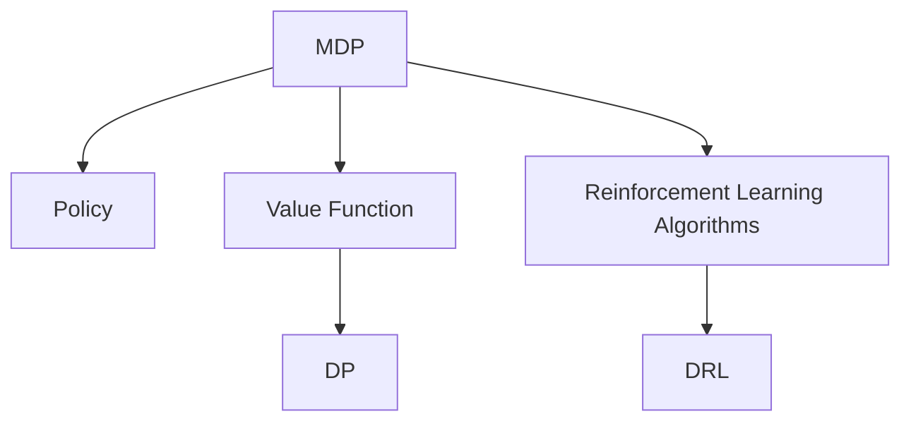

                 

# 强化学习(Reinforcement Learning) - 原理与代码实例讲解

> 关键词：强化学习,RL,策略梯度,Actor-Critic,深度强化学习,DQN,自动游戏,环境建模,Reinforce,AlphaGo

## 1. 背景介绍

### 1.1 问题由来

强化学习（Reinforcement Learning, RL）是人工智能领域的核心分支之一，与传统机器学习的监督学习（Supervised Learning）和无监督学习（Unsupervised Learning）不同，强化学习强调智能体与环境之间的交互，通过试错（exploitation）和优化（exploration）来达成目标。强化学习的目标是通过与环境的交互，学习如何做出一系列最优决策，最大化长期累积奖励。

强化学习的起源可以追溯到1980年代，著名的“I.J. Good”问题，即“在火炉控制实验中，让智能体学会避免烫伤。”然而，直到2010年代，随着深度学习（Deep Learning）和计算资源的提升，强化学习才取得了令人瞩目的进展。AlphaGo等实例表明，强化学习在解决复杂决策问题上具备巨大潜力，对游戏、机器人、金融等领域的实际应用前景广阔。

### 1.2 问题核心关键点

强化学习核心问题在于如何通过智能体与环境的交互，学习最优策略（policy）。核心问题可以表述为：给定一个马尔可夫决策过程（Markov Decision Process, MDP），如何通过与环境不断交互，学习最优决策策略。

强化学习的核心目标函数为：

$$ J(\pi) = \mathbb{E}_{s_0}\left[\sum_{t=0}^{\infty} \gamma^t R(s_t,a_t)\right] $$

其中 $\pi$ 为智能体的策略函数，$s_t$ 为状态，$a_t$ 为动作，$R(s_t,a_t)$ 为即时奖励，$\gamma$ 为折扣因子。

## 2. 核心概念与联系

### 2.1 核心概念概述

为了更好地理解强化学习，本节将介绍几个核心概念：

- 马尔可夫决策过程(Markov Decision Process, MDP)：强化学习中的基本模型框架，用于描述智能体和环境的交互过程。MDP由状态集合、动作集合、状态转移概率、奖励函数和折扣因子组成。

- 策略(Policy)：策略函数 $\pi(s_t)$ 定义了智能体在状态 $s_t$ 下采取动作 $a_t$ 的概率分布。策略的优化目标是最大化长期累积奖励。

- 价值函数(Value Function)：状态价值函数 $V(s_t)$ 表示智能体在状态 $s_t$ 下长期累积奖励的期望。动作价值函数 $Q(s_t,a_t)$ 表示智能体在状态 $s_t$ 下采取动作 $a_t$ 后的长期累积奖励期望。

- 动态规划(Dynamic Programming, DP)：DP是强化学习的一种重要算法，通过求解状态价值函数，获得最优策略。DP算法主要包括状态-动作值迭代（Bellman方程）和最优策略求解。

- 强化学习算法（Algorithms）：强化学习算法如Q-Learning、SARSA、Actor-Critic等，通过特定策略和价值函数的迭代更新，学习最优策略。

- 深度强化学习(Deep Reinforcement Learning, DRL)：将深度神经网络（如卷积神经网络CNN、递归神经网络RNN、Transformer等）引入强化学习中，提升策略和价值函数的拟合效果，增强模型的泛化能力和计算效率。

这些核心概念之间的逻辑关系可以通过以下Mermaid流程图来展示：



这个流程图展示强化学习的核心概念及其之间的关系：

1. MDP作为基础模型，描述智能体与环境的交互过程。
2. 策略函数用于描述智能体的决策行为。
3. 状态价值函数和动作价值函数用于评估状态和动作的价值。
4. 动态规划算法用于求解最优策略。
5. 强化学习算法实现策略和价值函数的更新迭代。
6. 深度强化学习结合深度神经网络，提升强化学习的表现和计算效率。

## 3. 核心算法原理 & 具体操作步骤

### 3.1 算法原理概述

强化学习的核心思想是通过智能体与环境的交互，学习最优策略。其基本流程包括：

1. 初始化智能体的状态 $s_0$。
2. 在当前状态下采取动作 $a_t$，观察环境反馈新状态 $s_{t+1}$ 和即时奖励 $r_t$。
3. 根据新状态和即时奖励，更新智能体的策略和价值函数。
4. 重复步骤2-3，直到达到终止状态或达到预设的迭代次数。

强化学习通过不断的试错和优化，逐步逼近最优策略。通常，智能体采取贪心策略，即在当前状态下选择价值最高的动作。

### 3.2 算法步骤详解

以下是强化学习的详细操作步骤：

**Step 1: 初始化环境**

- 创建MDP模型，包含状态集合 $S$、动作集合 $A$、状态转移概率 $P(s_{t+1}|s_t,a_t)$、奖励函数 $R(s_t,a_t)$ 和折扣因子 $\gamma$。
- 初始化智能体的状态 $s_0$ 和策略 $\pi$。
- 选择优化算法和目标函数。

**Step 2: 执行策略迭代**

- 在当前状态 $s_t$ 下，根据策略 $\pi$ 采样动作 $a_t$。
- 观察环境反馈新状态 $s_{t+1}$ 和即时奖励 $r_t$。
- 根据新状态 $s_{t+1}$ 和即时奖励 $r_t$，更新策略 $\pi$ 和价值函数 $V$。
- 重复上述步骤直至达到终止状态或达到预设的迭代次数。

**Step 3: 模型评估与优化**

- 使用评估策略评估模型的性能，如平均累积奖励。
- 使用验证数据集对模型进行调优，选择最优模型。
- 使用测试数据集对模型进行最终评估，确保模型泛化能力。

### 3.3 算法优缺点

强化学习的优点包括：

1. 适用于无监督学习任务，无需标注数据。
2. 能够学习到高效的策略，适用于复杂决策问题。
3. 具有较高的可解释性，适合解决实际问题。
4. 适应性强，能够动态调整策略。

但强化学习也存在一些缺点：

1. 难以学习到最优策略，需要大量的试错。
2. 状态和动作空间巨大，模型训练困难。
3. 难以处理连续动作和连续状态空间。
4. 存在局部最优和路径依赖问题。

### 3.4 算法应用领域

强化学习的应用领域非常广泛，包括：

- 游戏AI：AlphaGo等实例表明，强化学习在游戏AI领域具有巨大潜力，能够自主学习到最优策略，解决复杂的决策问题。
- 机器人控制：通过强化学习，机器人能够自主学习到最优控制策略，提升机器人自主性和智能性。
- 自动驾驶：强化学习能够使自动驾驶汽车自主学习到最优驾驶策略，提升行驶安全性。
- 金融交易：强化学习能够通过交易策略学习，提升投资回报率，减少市场风险。
- 供应链优化：强化学习能够通过库存控制策略学习，优化供应链管理，降低运营成本。

此外，强化学习还在工业控制、智能制造、医疗健康等领域得到应用，展示了其广阔的前景。

## 4. 数学模型和公式 & 详细讲解 & 举例说明

### 4.1 数学模型构建

强化学习的数学模型主要包括以下几个部分：

- 状态集合 $S$：环境的所有可能状态，包括当前状态和历史状态。
- 动作集合 $A$：智能体在当前状态下可能采取的动作。
- 状态转移概率 $P(s_{t+1}|s_t,a_t)$：从状态 $s_t$ 在采取动作 $a_t$ 后，转移至新状态 $s_{t+1}$ 的概率。
- 奖励函数 $R(s_t,a_t)$：智能体在状态 $s_t$ 下采取动作 $a_t$ 后的即时奖励。
- 折扣因子 $\gamma$：用于折算未来奖励的权重。

### 4.2 公式推导过程

以下对强化学习中的基本公式进行推导：

1. 状态-动作值迭代（Bellman方程）：

$$ Q^\pi(s_t,a_t) = \mathbb{E}_\pi\left[\sum_{t'=t}^{\infty} \gamma^{t'-t} R(s_{t'},a_{t'}) \mid s_t, a_t\right] $$

$$ Q^\pi(s_t,a_t) = \gamma \sum_{s_{t+1} \in S} P(s_{t+1}|s_t,a_t)V^\pi(s_{t+1}) + R(s_t,a_t) $$

2. 最优状态-动作值迭代：

$$ Q^*(s_t,a_t) = \max_{a} \sum_{s_{t+1} \in S} P(s_{t+1}|s_t,a_t)V^*(s_{t+1}) + R(s_t,a_t) $$

3. 策略评估方程：

$$ V^\pi(s) = \mathbb{E}_\pi\left[\sum_{t'=t}^{\infty} \gamma^{t'-t} R(s_{t'},a_{t'}) \mid s_t, a_t\right] $$

4. 策略改进方程：

$$ \pi(s_t) \propto \exp\left(\frac{Q^\pi(s_t,a_t)}{\beta}\right) $$

其中 $\beta$ 为温度系数，用于调节策略的探索和利用。

### 4.3 案例分析与讲解

假设智能体在一个简单迷宫中进行游戏，迷宫的状态和动作如下：

| 状态 | 动作 | 转移概率 | 即时奖励 |
|------|------|----------|----------|
| S1   | L    | 0.9      | -1       |
| S2   | R    | 0.9      | -1       |
| S3   | U    | 0.9      | 1        |
| S4   | D    | 0.9      | 1        |
| S5   | L    | 0.1      | -1       |
| S6   | R    | 0.1      | -1       |
| S7   | U    | 0.1      | 1        |
| S8   | D    | 0.1      | 1        |

智能体的目标是到达终点S4，可以通过Q-Learning算法进行策略学习。

1. 初始化智能体的策略 $\pi$ 为随机策略，状态价值函数 $V$ 为0。
2. 在每个状态下采取贪心动作 $a_t = \arg\max_a Q(s_t,a_t)$。
3. 观察环境反馈新状态 $s_{t+1}$ 和即时奖励 $r_t$。
4. 更新状态价值函数 $V$ 和动作价值函数 $Q$。
5. 重复上述步骤直至达到终点或达到预设的迭代次数。

## 5. 项目实践：代码实例和详细解释说明

### 5.1 开发环境搭建

在进行强化学习实践前，我们需要准备好开发环境。以下是使用Python进行OpenAI Gym开发的环境配置流程：

1. 安装Anaconda：从官网下载并安装Anaconda，用于创建独立的Python环境。

2. 创建并激活虚拟环境：
```bash
conda create -n rlenv python=3.8 
conda activate rlenv
```

3. 安装OpenAI Gym和相关依赖：
```bash
pip install gym
pip install gym-gymnasium
```

4. 安装TensorFlow或PyTorch：
```bash
pip install tensorflow==2.3
# 或
pip install torch
```

5. 安装其他相关工具包：
```bash
pip install numpy matplotlib seaborn 
```

完成上述步骤后，即可在`rlenv`环境中开始强化学习实践。

### 5.2 源代码详细实现

下面以一个简单的迷宫游戏为例，给出使用OpenAI Gym和TensorFlow实现强化学习的PyTorch代码实现。

首先，定义游戏环境：

```python
import gym

env = gym.make('CartPole-v1')
```

然后，定义强化学习算法（这里以Q-Learning为例）：

```python
import tensorflow as tf

def q_learning(env, num_episodes, gamma=0.9, epsilon=0.1, batch_size=100, learning_rate=0.1, discount_factor=0.9):
    # 定义状态-动作值表
    Q = tf.Variable(tf.zeros([env.observation_space.n, env.action_space.n]))
    
    for episode in range(num_episodes):
        state = env.reset()
        done = False
        while not done:
            # 探索与利用
            if np.random.uniform() < epsilon:
                action = env.action_space.sample()
            else:
                action = tf.argmax(Q[tf.expand_dims(state, 0)], 1).numpy()
            # 观察环境反馈
            next_state, reward, done, _ = env.step(action)
            # 更新状态-动作值表
            Q.numpy()[state, action] += learning_rate * (reward + discount_factor * tf.reduce_max(Q[tf.expand_dims(next_state, 0), :]) - Q[tf.expand_dims(state, 0), action])
            state = next_state
    return Q
```

在上述代码中，我们定义了一个Q-Learning算法，对CartPole环境进行强化学习。具体实现细节如下：

- `env`：定义强化学习的环境，这里以OpenAI Gym中的CartPole环境为例。
- `num_episodes`：定义强化学习的总轮数。
- `gamma`：折扣因子，用于折算未来奖励。
- `epsilon`：探索与利用的平衡系数。
- `batch_size`：定义Q-Learning的批大小。
- `learning_rate`：定义学习率。
- `discount_factor`：定义折扣因子。

最后，启动强化学习流程，并在测试环境中评估模型的性能：

```python
Q = q_learning(env, num_episodes)
env.seed(1)
state = env.reset()
done = False
while not done:
    action = tf.argmax(Q[tf.expand_dims(state, 0), :]).numpy()
    next_state, reward, done, _ = env.step(action)
    env.render()
    state = next_state
env.close()
```

以上就是使用PyTorch和OpenAI Gym实现Q-Learning算法的完整代码实现。可以看到，强化学习的代码实现较为简单，但核心思想清晰。

### 5.3 代码解读与分析

让我们再详细解读一下关键代码的实现细节：

**环境初始化**：
- `gym.make('CartPole-v1')`：创建一个CartPole环境的实例。

**Q-Learning算法**：
- `Q`：定义状态-动作值表，初始化为全零。
- 在每轮游戏中，从环境获取当前状态 `state`。
- 根据当前状态 `state`，选择动作 `action`。
- 观察环境反馈新状态 `next_state` 和即时奖励 `reward`。
- 更新状态-动作值表 `Q`。
- 重复上述步骤直至游戏结束。

**算法参数**：
- `gamma`：折扣因子，用于折算未来奖励。
- `epsilon`：探索与利用的平衡系数。
- `batch_size`：定义Q-Learning的批大小。
- `learning_rate`：定义学习率。
- `discount_factor`：定义折扣因子。

**游戏循环**：
- `env.render()`：渲染游戏界面，显示智能体的操作。
- `env.close()`：关闭游戏环境。

可以看出，强化学习的核心在于通过不断试错，更新状态-动作值表，从而学习最优策略。在实际应用中，还需要考虑更多因素，如策略更新、状态表示、奖励设计等。

## 6. 实际应用场景

### 6.1 自动游戏

自动游戏（AutoPlay）是强化学习的重要应用场景之一。在自动游戏中，智能体通过与游戏环境的交互，学习最优的 gameplay strategy，从而赢得游戏胜利。

通过强化学习，自动游戏能够模拟人类游戏行为，提供丰富多变的游戏体验。例如，AlphaGo通过强化学习，掌握了复杂的围棋策略，在国际围棋领域取得了突破性进展。自动游戏不仅可以应用于电子游戏，还可以应用于其他类型的游戏，如扑克、桥牌等。

### 6.2 机器人控制

在机器人控制领域，强化学习被广泛用于学习最优的控制策略。例如，智能体可以通过强化学习，学习如何自主控制机器人进行路径规划、避障等操作。

在实际应用中，智能体需要学习如何从当前状态中选取最优动作，以最大化长期累积奖励。例如，在避障场景中，智能体需要学习如何控制机器人在动态环境中躲避障碍物，避免碰撞。强化学习可以通过不断的试错和优化，学习到最优的控制策略，提升机器人的自主性和智能性。

### 6.3 金融交易

在金融交易领域，强化学习被用于学习最优的交易策略。例如，智能体可以通过强化学习，学习如何预测市场趋势，进行买卖操作，获得最大回报。

在实际应用中，智能体需要学习如何根据历史数据和市场信息，预测未来价格变化，进行交易决策。例如，在股票交易中，智能体需要学习如何根据历史股价、成交量、新闻等因素，预测股票价格变化，及时调整交易策略，降低市场风险。强化学习能够通过不断的试错和优化，学习到最优的交易策略，提升投资回报率。

### 6.4 未来应用展望

随着强化学习的不断发展，其在实际应用中有着广阔的前景。以下是几个未来应用展望：

1. 多智能体系统：强化学习能够应用于多智能体系统，如分布式系统、协作机器人等。智能体之间通过相互合作和竞争，学习最优策略，提升系统效率。

2. 机器人调度：在仓储、物流等领域，强化学习能够应用于机器人调度，学习最优的路径规划和任务分配策略，提高机器人效率和生产效率。

3. 医疗诊断：在医疗诊断领域，强化学习能够应用于辅助诊断，学习最优的诊断策略，提高诊断准确率和效率。

4. 自动驾驶：在自动驾驶领域，强化学习能够应用于路径规划和决策控制，学习最优的驾驶策略，提升行驶安全和效率。

5. 智能制造：在智能制造领域，强化学习能够应用于生产调度、设备维护等，学习最优的生产策略，提高生产效率和质量。

6. 智能客服：在智能客服领域，强化学习能够应用于机器人客服，学习最优的对话策略，提高客户满意度和服务质量。

总之，强化学习在各个领域都有广泛的应用前景，能够通过不断试错和优化，学习最优的决策策略，提升系统效率和智能性。

## 7. 工具和资源推荐

### 7.1 学习资源推荐

为了帮助开发者系统掌握强化学习的理论基础和实践技巧，这里推荐一些优质的学习资源：

1. Sutton和Barto的《强化学习》：经典教材，系统介绍了强化学习的理论基础和算法原理。
2. Silver的论文《Mastering the Game of Go without Human Knowledge》：AlphaGo论文，介绍了强化学习的实际应用。
3. Goodfellow等人的《深度学习》：介绍深度学习框架，包括TensorFlow和PyTorch。
4. OpenAI Gym官方文档：强化学习环境库，提供了丰富的环境模型和示例代码。
5. TensorFlow官方文档：深度学习框架，提供强大的计算图和自动微分功能。

通过对这些资源的学习实践，相信你一定能够快速掌握强化学习的精髓，并用于解决实际的决策问题。

### 7.2 开发工具推荐

高效的开发离不开优秀的工具支持。以下是几款用于强化学习开发的常用工具：

1. OpenAI Gym：强化学习环境库，提供了丰富的环境模型和示例代码。
2. TensorFlow：深度学习框架，提供强大的计算图和自动微分功能。
3. PyTorch：深度学习框架，提供动态计算图和易于调参的特点。
4. REINFORCE工具：强化学习工具库，提供了多种强化学习算法和环境。
5. Roboschool：机器人学习框架，用于机器人控制和决策学习。

合理利用这些工具，可以显著提升强化学习的开发效率，加快创新迭代的步伐。

### 7.3 相关论文推荐

强化学习的研究源于学界的持续研究。以下是几篇奠基性的相关论文，推荐阅读：

1. Q-Learning：Watkins的论文《Learning to Play Games using Reinforcement Learning》。
2. SARSA：Sutton的论文《On-line learning for reinforcement learning using function-approximation technique》。
3. Actor-Critic算法：Kakade的论文《The Actor-Critic Algorithm》。
4. Deep Q-Network（DQN）：Mnih的论文《Human-level Control through Deep Reinforcement Learning》。
5. Deep Reinforcement Learning：Silver的论文《Mastering the Game of Go without Human Knowledge》。

这些论文代表化了强化学习的研究脉络。通过学习这些前沿成果，可以帮助研究者把握学科前进方向，激发更多的创新灵感。

## 8. 总结：未来发展趋势与挑战

### 8.1 总结

本文对强化学习进行了全面系统的介绍。首先阐述了强化学习的基本思想和核心问题，明确了其应用场景和价值。其次，从原理到实践，详细讲解了强化学习的数学模型和算法流程，给出了强化学习任务开发的完整代码实例。同时，本文还广泛探讨了强化学习在自动游戏、机器人控制、金融交易等多个领域的应用前景，展示了其广阔的前景。

通过本文的系统梳理，可以看到，强化学习在决策问题上具有强大潜力，能够通过不断的试错和优化，学习到最优的决策策略。随着深度学习技术的不断进步，强化学习将在更广阔的领域得到应用，为智能决策系统的建设提供重要支撑。

### 8.2 未来发展趋势

展望未来，强化学习的发展趋势包括：

1. 深度强化学习：深度神经网络与强化学习的结合，提升策略和价值函数的拟合效果，增强模型的泛化能力和计算效率。
2. 多智能体系统：多智能体系统的研究将进一步深入，智能体之间通过相互合作和竞争，学习最优策略，提升系统效率。
3. 强化学习与认知科学结合：强化学习将与认知科学、神经科学等交叉融合，探索智能体如何学习、思考和决策。
4. 强化学习与伦理道德结合：强化学习将更加注重伦理道德问题，如避免有害行为、保护隐私等，确保系统的可解释性和可控性。
5. 强化学习与物理世界结合：强化学习将应用于物理世界，如自动驾驶、机器人控制等，提升系统复杂性和现实性。

以上趋势凸显了强化学习的广阔前景。这些方向的探索发展，必将进一步提升强化学习的表现和应用范围，为人工智能技术的发展带来新的突破。

### 8.3 面临的挑战

尽管强化学习已经取得了显著进展，但在迈向更加智能化、普适化应用的过程中，它仍面临诸多挑战：

1. 状态和动作空间巨大：大规模强化学习问题难以在短时间内解决。
2. 奖励设计困难：如何设计合适的奖励函数，引导智能体学习到最优策略，是一个重要问题。
3. 探索与利用的平衡：如何平衡探索与利用，避免过拟合和欠拟合，是强化学习的一个重要研究方向。
4. 路径依赖问题：强化学习在多步决策中存在路径依赖问题，如何克服路径依赖，学习到全局最优策略，是一个难点。
5. 可解释性不足：强化学习模型往往难以解释其内部工作机制，缺乏透明性。

### 8.4 研究展望

面对强化学习面临的这些挑战，未来的研究需要在以下几个方面寻求新的突破：

1. 学习高效的探索策略：通过改进探索算法，提升智能体的探索能力，避免局部最优解。
2. 设计合理的奖励函数：通过奖励设计，引导智能体学习到最优策略，避免有害行为。
3. 研究可解释的强化学习模型：通过引入符号化先验知识，增强强化学习模型的可解释性和透明性。
4. 解决路径依赖问题：通过多智能体系统、分布式学习等方法，解决路径依赖问题，学习全局最优策略。
5. 结合物理世界：将强化学习应用于物理世界，解决复杂系统中的决策问题，提升系统的智能性和现实性。

这些研究方向的探索，必将引领强化学习技术的进一步发展，为人工智能技术的发展提供重要支撑。总之，强化学习需要从多方面进行深入研究，才能在更广阔的领域中发挥其潜力，推动人工智能技术的发展和应用。

## 9. 附录：常见问题与解答

**Q1：强化学习是否适用于所有决策问题？**

A: 强化学习适用于无监督学习任务，无需标注数据。但对于一些特定领域的决策问题，如医疗、法律等，仍然需要依赖人类专家进行标注和验证，才能确保决策的准确性。此外，强化学习在处理连续动作和连续状态空间时，也面临一定的挑战。

**Q2：如何设计合理的奖励函数？**

A: 设计合理的奖励函数是强化学习的关键之一。一般来说，奖励函数应满足以下几个条件：
1. 奖励函数应与任务目标一致。
2. 奖励函数应简单明了，避免过于复杂。
3. 奖励函数应具有鲁棒性，避免有害行为。

**Q3：强化学习是否适合大规模系统？**

A: 强化学习在大规模系统中存在挑战，如状态和动作空间巨大，难以在短时间内解决。此时，可以考虑分布式强化学习和多智能体系统，将大规模问题分解为多个子问题，通过协同学习逐步解决。

**Q4：如何平衡探索与利用？**

A: 探索与利用的平衡是强化学习的重要研究方向之一。一般来说，可以通过以下方法进行探索与利用平衡：
1. 引入温度系数，调节探索和利用的平衡。
2. 使用上下文信息，引导智能体选择最优动作。
3. 使用逆强化学习，学习环境模型，预测未来奖励。

这些方法需要根据具体任务和环境进行灵活选择，以达到最佳效果。

**Q5：强化学习在实际应用中需要注意哪些问题？**

A: 强化学习在实际应用中需要注意以下问题：
1. 环境建模：合理建模环境，确保模型的准确性和可靠性。
2. 策略更新：选择合适的策略更新方法，避免过拟合和欠拟合。
3. 状态表示：选择合适的状态表示方法，避免状态空间过大。
4. 奖励设计：设计合理的奖励函数，引导智能体学习到最优策略。
5. 计算效率：优化计算图，提高模型的计算效率和可扩展性。

合理解决这些问题，才能使强化学习在实际应用中发挥其潜力。

---

作者：禅与计算机程序设计艺术 / Zen and the Art of Computer Programming

