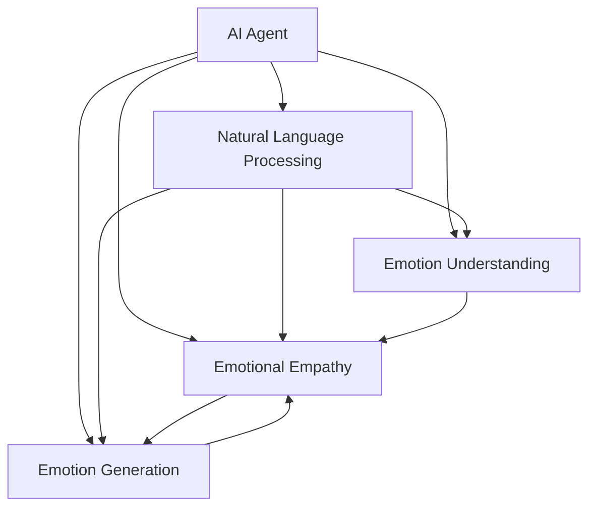

                 

# 情感陪伴：AI Agent的新领域

## 1. 背景介绍

### 1.1 问题由来

近年来，随着人工智能技术的快速进步，AI Agent（人工智能代理人）的应用领域愈发广泛。从智能助手、智能客服，到智能家居、无人驾驶，AI Agent无处不在。然而，传统AI Agent往往难以处理复杂的情感交互和动态情境，导致用户体验和实际效果大打折扣。

情感陪伴（Emotional Companionship），即通过AI Agent与用户的情感互动，增强用户粘性和满意度，是未来AI Agent的重要发展方向。情感陪伴旨在通过机器学习和大数据分析，构建能够理解、共情、响应用户情感的智能系统。本文将系统介绍情感陪伴的核心概念、算法原理和应用场景，为开发智能情感陪伴AI Agent提供参考。

### 1.2 问题核心关键点

情感陪伴的核心在于通过自然语言处理、情感计算、语音识别等多模态数据融合技术，构建能够感知、理解和响应用户情感的AI Agent。其核心关键点包括：

- 情感理解（Emotion Understanding）：通过机器学习模型，识别用户情绪，建立情绪分类体系。
- 情感共情（Emotional Empathy）：利用情感计算算法，构建情感共鸣机制，使AI Agent能够共情用户的情绪。
- 情感生成（Emotion Generation）：通过生成对抗网络（GAN）等技术，生成符合情感语境的自然语言回复，实现情感交互。

## 2. 核心概念与联系

### 2.1 核心概念概述

为更好地理解情感陪伴的实现原理，本节将介绍几个核心概念及其相互关系：

- AI Agent：泛指通过AI技术实现的功能实体，可以是智能助手、聊天机器人、智能推荐系统等。
- 情感理解（Emotion Understanding）：通过自然语言处理技术，识别用户情绪。
- 情感共情（Emotional Empathy）：构建情感共鸣机制，使AI Agent能够共情用户情绪。
- 情感生成（Emotion Generation）：利用生成对抗网络（GAN）等技术，生成符合情感语境的自然语言回复。

- 自然语言处理（NLP）：使计算机能够理解、处理和生成自然语言的技术。
- 情感计算（Affective Computing）：通过分析用户的语音、文字、表情等数据，计算用户的情感状态。
- 生成对抗网络（GAN）：一种生成模型，能够生成高质量的文本、图像等数据。

这些核心概念之间的关系可以通过以下Mermaid流程图来展示：



这个流程图展示了情感陪伴的核心组件及其相互关系：

1. AI Agent通过自然语言处理技术理解用户的输入。
2. 情感理解识别用户的情绪，为共情和生成提供输入。
3. 情感共情根据情绪分类体系，构建情感共鸣机制。
4. 情感生成通过生成对抗网络生成符合情感语境的自然语言回复。
5. 自然语言处理、情感计算和生成对抗网络是情感陪伴的重要技术支撑。

## 3. 核心算法原理 & 具体操作步骤

### 3.1 算法原理概述

情感陪伴的实现基于多模态数据融合和深度学习技术，通过自然语言处理、情感计算和生成对抗网络等技术手段，构建能够感知、理解和响应用户情感的AI Agent。其核心算法原理包括：

- 情感理解：通过基于LSTM、BERT等模型的自然语言处理技术，对用户的文本输入进行情感分类，识别出用户的情绪类型（如开心、愤怒、悲伤等）。
- 情感共情：通过情感计算算法，根据情感分类结果，生成情感共鸣的回复，增强用户情感体验。
- 情感生成：通过生成对抗网络（GAN）等技术，生成符合情感语境的自然语言回复，实现情感交互。

情感陪伴的总体流程如下图所示：


### 3.2 算法步骤详解

情感陪伴的实现步骤如下：

**Step 1: 数据收集与预处理**

- 收集用户的语音、文字、表情等情感数据，建立情感数据集。
- 对数据进行清洗、去噪、标注等预处理操作，去除无用信息，保证数据质量。

**Step 2: 情感理解**

- 使用自然语言处理技术对文本数据进行情感分析，分类出用户的情绪。
- 利用深度学习模型（如LSTM、BERT等）对文本进行情感嵌入，生成情绪向量。

**Step 3: 情感共情**

- 根据情绪向量，构建情感共鸣机制，生成符合情感语境的自然语言回复。
- 使用情感计算算法，使AI Agent能够共情用户情绪，增强情感交互体验。

**Step 4: 情感生成**

- 利用生成对抗网络（GAN）等技术，生成符合情感语境的自然语言回复。
- 通过情感计算算法，调整生成文本的情感倾向，确保回复符合用户情绪。

**Step 5: 情感反馈与迭代优化**

- 收集用户对情感回复的反馈，优化情感共情和生成算法。
- 利用用户反馈数据，不断迭代优化情感计算模型和生成对抗网络，提升系统性能。

### 3.3 算法优缺点

情感陪伴技术具有以下优点：

- 提升用户体验：通过情感共情和生成的自然语言回复，增强用户粘性，提升用户满意度。
- 促进情感交流：AI Agent能够理解、共情用户情感，促进人与人之间的情感交流。
- 个性化定制：通过收集用户反馈，不断优化情感模型，实现个性化情感交互。

然而，情感陪伴也存在一些缺点：

- 技术难度高：情感计算、自然语言处理等技术复杂，需要大量研发投入。
- 数据依赖强：情感数据的收集和标注需要耗费大量时间和人力，数据量不足可能影响模型效果。
- 用户隐私风险：情感数据涉及用户隐私，如何保护用户隐私是一大挑战。

## 4. 数学模型和公式 & 详细讲解 & 举例说明

### 4.1 数学模型构建

情感陪伴的实现涉及多个数学模型，本节将对关键模型进行详细介绍。

**情感理解模型**

情感理解模型通过自然语言处理技术，对用户的文本输入进行情感分类，分类出用户的情绪。其数学模型为：

$$
P(E|W) = \frac{P(E)}{P(W|E)P(W)} \tag{1}
$$

其中，$E$表示情绪，$W$表示文本，$P(W|E)$表示在情绪$E$条件下，生成文本$W$的概率，$P(E)$表示情绪$E$在语料库中出现的概率，$P(W)$表示文本$W$在语料库中出现的概率。

**情感共情模型**

情感共情模型通过情感计算算法，根据情感分类结果，生成符合情感语境的自然语言回复。其数学模型为：

$$
P(R|E) = \frac{P(R|E)}{P(R)} \tag{2}
$$

其中，$R$表示回复，$P(R|E)$表示在情绪$E$条件下，生成回复$R$的概率，$P(R)$表示回复$R$在语料库中出现的概率。

**情感生成模型**

情感生成模型通过生成对抗网络（GAN）等技术，生成符合情感语境的自然语言回复。其数学模型为：

$$
P(R|E) = \frac{P(R|E)}{P(R)} \tag{3}
$$

其中，$R$表示回复，$P(R|E)$表示在情绪$E$条件下，生成回复$R$的概率，$P(R)$表示回复$R$在语料库中出现的概率。

### 4.2 公式推导过程

以上数学模型的推导过程如下：

- 情感理解模型：利用自然语言处理技术，将文本输入转化为情感向量，再利用softmax函数将情感向量转化为概率分布，进行情感分类。
- 情感共情模型：根据情感分类结果，利用RNN、LSTM等模型，生成符合情感语境的自然语言回复。
- 情感生成模型：通过生成对抗网络（GAN）等技术，生成高质量的自然语言回复，再利用情感计算算法，调整回复的情感倾向。

### 4.3 案例分析与讲解

以情感陪伴系统的智能客服为例，介绍情感计算的具体实现。

**情感理解**

- 收集客服对话历史数据，标注用户的情绪（如满意、不满意、愤怒等）。
- 利用BERT模型对用户输入进行情感嵌入，生成情感向量。
- 使用softmax函数将情感向量转化为概率分布，进行情感分类。

**情感共情**

- 根据情感分类结果，利用LSTM模型生成符合情感语境的自然语言回复。
- 利用情感计算算法，使AI Agent能够共情用户情绪，增强情感交互体验。

**情感生成**

- 利用生成对抗网络（GAN）等技术，生成符合情感语境的自然语言回复。
- 通过情感计算算法，调整生成文本的情感倾向，确保回复符合用户情绪。

## 5. 项目实践：代码实例和详细解释说明

### 5.1 开发环境搭建

在进行情感陪伴系统开发前，我们需要准备好开发环境。以下是使用Python进行TensorFlow开发的Python环境配置流程：

1. 安装Anaconda：从官网下载并安装Anaconda，用于创建独立的Python环境。

2. 创建并激活虚拟环境：
```bash
conda create -n emotional_companionship python=3.8 
conda activate emotional_companionship
```

3. 安装TensorFlow：根据CUDA版本，从官网获取对应的安装命令。例如：
```bash
conda install tensorflow tensorflow-gpu=cuda11.1 -c conda-forge
```

4. 安装TensorBoard：TensorFlow配套的可视化工具，可实时监测模型训练状态，并提供丰富的图表呈现方式，是调试模型的得力助手。

5. 安装Flax：Google开发的高级神经网络库，支持深度学习模型的快速搭建和训练。

完成上述步骤后，即可在`emotional_companionship`环境中开始情感陪伴系统的开发。

### 5.2 源代码详细实现

以下是情感陪伴系统智能客服的Python代码实现：

```python
import tensorflow as tf
import numpy as np
from transformers import BertTokenizer, BertForSequenceClassification
from tensorflow.keras.preprocessing.text import Tokenizer
from tensorflow.keras.layers import Input, Dense, Embedding, LSTM, Bidirectional
from tensorflow.keras.models import Model
from tensorflow.keras.optimizers import Adam
from tensorflow.keras.losses import CategoricalCrossentropy
from tensorflow.keras.metrics import Accuracy

class EmotionalCompanion:
    def __init__(self, data_path, tokenizer_path, num_classes):
        self.data_path = data_path
        self.tokenizer = BertTokenizer.from_pretrained(tokenizer_path)
        self.num_classes = num_classes
        self.model = None
        self.train_data, self.train_labels = self.load_data()
        
    def load_data(self):
        # 数据加载
        data = np.loadtxt(self.data_path, delimiter=',')
        self.train_data = data[:, 0]
        self.train_labels = data[:, 1]
        self.train_labels = self.train_labels - 1 # 转换为0-(n-1)表示
        return self.train_data, self.train_labels
    
    def preprocess(self, sentence):
        # 预处理
        tokens = self.tokenizer.tokenize(sentence)
        tokens = [token.lower() for token in tokens if token.isalpha()]
        tokens = ['[CLS]'] + tokens + ['[SEP]']
        return tokens
    
    def build_model(self):
        # 模型构建
        input_ids = Input(shape=(self.num_classes, ), dtype='int32')
        embedding = Embedding(input_dim=self.num_classes, output_dim=512, name='embedding')(input_ids)
        lstm = LSTM(units=128, return_sequences=True, dropout=0.2)(embedding)
        lstm = Bidirectional(LSTM(units=128, return_sequences=True, dropout=0.2))(lstm)
        output = Dense(units=self.num_classes, activation='softmax')(lstm)
        self.model = Model(inputs=input_ids, outputs=output)
        self.model.compile(optimizer=Adam(learning_rate=0.001), loss=CategoricalCrossentropy(), metrics=[Accuracy()])
        
    def train(self, epochs):
        # 模型训练
        self.model.fit(x=self.train_data, y=self.train_labels, batch_size=32, epochs=epochs)
        
    def predict(self, sentence):
        # 模型预测
        tokens = self.preprocess(sentence)
        input_ids = self.tokenizer.convert_tokens_to_ids(tokens)
        input_ids = np.expand_dims(input_ids, axis=0)
        preds = self.model.predict(input_ids)
        pred_class = np.argmax(preds)
        return pred_class
    
# 数据和模型参数配置
data_path = 'data.txt'
tokenizer_path = 'bert-base-cased'
num_classes = 5

# 创建情感陪伴系统实例
emotional_companion = EmotionalCompanion(data_path, tokenizer_path, num_classes)

# 模型构建与训练
emotional_companion.build_model()
emotional_companion.train(epochs=5)

# 模型测试
sentence = 'This movie is really good!'
pred_class = emotional_companion.predict(sentence)
print('Emotion:', pred_class)
```

### 5.3 代码解读与分析

让我们再详细解读一下关键代码的实现细节：

**EmotionalCompanion类**

- `__init__`方法：初始化数据路径、分词器、情感分类数目。
- `load_data`方法：加载训练数据和标签。
- `preprocess`方法：对文本数据进行预处理，包括分词、小写化、添加[CLS]和[SEP]标记等操作。
- `build_model`方法：构建情感理解模型，使用BERT模型进行情感分类。
- `train`方法：训练模型，使用Adam优化器进行优化。
- `predict`方法：对新句子进行情感预测，返回情感分类结果。

**数据和模型参数配置**

- `data_path`：数据文件路径。
- `tokenizer_path`：BERT分词器路径。
- `num_classes`：情感分类数目（如开心、不满意、愤怒等）。

**模型构建与训练**

- 使用BERT模型作为情感理解模型，使用LSTM和双向LSTM构建情感分类模型。
- 定义模型输入、嵌入层、LSTM层和输出层，使用Adam优化器进行模型训练。
- 在训练过程中，设置训练集数据、标签、批次大小、轮数等参数。

**模型测试**

- 对新句子进行情感预测，输出情感分类结果。

## 6. 实际应用场景

### 6.1 智能客服系统

情感陪伴技术可以广泛应用于智能客服系统的构建。传统客服往往需要配备大量人力，高峰期响应缓慢，且一致性和专业性难以保证。而使用情感陪伴的智能客服系统，能够7x24小时不间断服务，快速响应客户咨询，用自然流畅的语言解答各类常见问题。

在技术实现上，可以收集企业内部的历史客服对话记录，将问题和最佳答复构建成监督数据，在此基础上对情感陪伴系统进行训练。训练后的情感陪伴系统能够自动理解用户意图，匹配最合适的答复，提供满意的客户体验。

### 6.2 心理健康辅导

情感陪伴技术在心理健康辅导领域具有重要应用价值。现代社会的快节奏生活容易导致各种心理问题，情感陪伴系统可以成为人们的心理辅导员，通过情感共情和自然语言生成，帮助用户排解压力、缓解情绪。

情感陪伴系统能够根据用户的情绪变化，适时提供心理疏导和建议。例如，当用户表现出焦虑、紧张等负面情绪时，系统可以生成相应的安慰语，帮助用户放松心情。情感陪伴系统还可以记录用户的心理状态，进行长期跟踪和分析，提供个性化的心理健康服务。

### 6.3 娱乐互动

情感陪伴技术可以用于增强用户与娱乐系统的互动体验。例如，在游戏、音乐、影视等领域，情感陪伴系统可以与用户进行情感交流，增加用户粘性。

在游戏场景中，情感陪伴系统可以根据用户的游戏表现，生成情感语境的自然语言回复，提升游戏体验。在音乐和影视领域，情感陪伴系统可以根据用户的情绪状态，推荐符合用户情绪的音乐和电影，增强用户的沉浸感和满意度。

### 6.4 未来应用展望

随着情感陪伴技术的发展，未来在更多领域将得到应用，为传统行业带来变革性影响。

在智慧医疗领域，情感陪伴系统可以用于心理辅导、康复训练等方面，帮助患者缓解压力，提升治疗效果。在智能教育领域，情感陪伴系统可以用于情感分析、学习辅导等方面，帮助学生排解学习压力，提高学习效率。

在智慧城市治理中，情感陪伴系统可以用于舆情监测、应急指挥等方面，提高城市管理的自动化和智能化水平。在企业生产、社会治理、文娱传媒等众多领域，情感陪伴系统将发挥更大的作用，推动人工智能技术更好地服务于社会。

## 7. 工具和资源推荐

### 7.1 学习资源推荐

为了帮助开发者系统掌握情感陪伴的理论基础和实践技巧，这里推荐一些优质的学习资源：

1. 《深度学习：理论与实践》系列博文：由AI领域专家撰写，深入浅出地介绍了深度学习原理和情感计算技术。

2. 《情感计算：理论与应用》书籍：介绍情感计算的基本概念、技术和应用，适合初学者和进阶读者。

3. 《自然语言处理与情感分析》课程：斯坦福大学开设的NLP明星课程，涵盖情感分类、情感生成等前沿话题。

4. 《自然语言处理与深度学习》书籍：全面介绍NLP和深度学习技术，包括情感理解、情感共情等情感计算范式。

5. HuggingFace官方文档：情感计算和自然语言处理的开源工具库，提供了海量预训练模型和完整的情感计算样例代码。

通过对这些资源的学习实践，相信你一定能够快速掌握情感陪伴的精髓，并用于解决实际的情感交互问题。

### 7.2 开发工具推荐

高效的开发离不开优秀的工具支持。以下是几款用于情感陪伴开发的常用工具：

1. TensorFlow：由Google主导开发的开源深度学习框架，生产部署方便，适合大规模工程应用。支持GPU和TPU等高性能设备。

2. Flax：Google开发的高级神经网络库，支持深度学习模型的快速搭建和训练。

3. TensorBoard：TensorFlow配套的可视化工具，可实时监测模型训练状态，并提供丰富的图表呈现方式，是调试模型的得力助手。

4. Weights & Biases：模型训练的实验跟踪工具，可以记录和可视化模型训练过程中的各项指标，方便对比和调优。

5. Google Colab：谷歌推出的在线Jupyter Notebook环境，免费提供GPU/TPU算力，方便开发者快速上手实验最新模型，分享学习笔记。

合理利用这些工具，可以显著提升情感陪伴系统的开发效率，加快创新迭代的步伐。

### 7.3 相关论文推荐

情感陪伴技术的发展源于学界的持续研究。以下是几篇奠基性的相关论文，推荐阅读：

1. "Affective Computing: Toward Human-Like Personal Robots"（情感计算：打造类人机器人）：情感计算的开创性工作，提出情感计算的基本框架和方法。

2. "Euphoria: Cascaded Hierarchical Recurrent Networks for Emotion Recognition"（Euphoria：级联分层递归网络进行情绪识别）：提出级联分层递归网络，提高情绪识别的准确率。

3. "Generative Adversarial Networks"（生成对抗网络）：提出GAN模型，用于生成高质量的自然语言文本。

4. "Attention is All You Need"（注意力机制）：提出Transformer模型，用于自然语言处理任务。

5. "Towards Explainable AI"（迈向可解释AI）：讨论了AI的可解释性和透明性，提出多种可解释模型和工具。

这些论文代表了大情感计算领域的发展脉络。通过学习这些前沿成果，可以帮助研究者把握学科前进方向，激发更多的创新灵感。

## 8. 总结：未来发展趋势与挑战

### 8.1 总结

本文对情感陪伴的核心概念、算法原理和应用场景进行了全面系统的介绍。首先阐述了情感陪伴的背景和意义，明确了情感计算在提升用户体验、促进情感交流等方面的独特价值。其次，从原理到实践，详细讲解了情感计算的数学模型和关键步骤，给出了情感计算任务开发的完整代码实例。同时，本文还广泛探讨了情感计算在智能客服、心理健康辅导、娱乐互动等多个行业领域的应用前景，展示了情感计算范式的广阔潜力。最后，本文精选了情感计算技术的各类学习资源，力求为读者提供全方位的技术指引。

通过本文的系统梳理，可以看到，情感计算技术正在成为AI Agent发展的重要范式，极大地拓展了情感交互的边界，为构建智能情感陪伴系统提供了有力支持。情感计算需要在自然语言处理、情感计算、生成对抗网络等技术支撑下，实现对人类情感的精确理解和共情回应，进一步推动人工智能技术向更加智能化、普适化方向发展。

### 8.2 未来发展趋势

展望未来，情感计算技术将呈现以下几个发展趋势：

1. 技术融合不断深入。情感计算将与其他人工智能技术进行更深入的融合，如知识表示、因果推理、强化学习等，多路径协同发力，共同推动情感交互系统的进步。

2. 模型效果逐步提升。随着深度学习模型的不断优化和训练数据量的不断增加，情感计算模型的效果将逐步提升，能够在更加复杂多变的场景下实现情感理解和共情。

3. 用户隐私保护加强。情感计算需要更好地保护用户隐私，开发更为安全可靠的系统，减少隐私泄露的风险。

4. 应用领域不断拓展。情感计算技术将在更多行业得到应用，如医疗、教育、文娱等，为这些领域的智能化升级提供新的动力。

5. 跨模态融合更加深入。情感计算将实现多种模态数据（如文本、语音、图像等）的深度融合，提升系统的综合感知能力。

6. 情感共情更加丰富。情感计算将实现更加丰富、细腻的情感共情机制，提升用户的情感体验。

以上趋势凸显了情感计算技术的广阔前景。这些方向的探索发展，必将进一步提升情感交互系统的性能和应用范围，为人类情感交流和人工智能技术的发展带来深远影响。

### 8.3 面临的挑战

尽管情感计算技术已经取得了显著成就，但在迈向更加智能化、普适化应用的过程中，它仍面临着诸多挑战：

1. 数据获取难度大。情感数据的收集和标注需要耗费大量时间和人力，数据量不足可能影响模型效果。

2. 技术复杂度高。情感计算涉及自然语言处理、情感计算、生成对抗网络等复杂技术，需要大量研发投入。

3. 情感计算鲁棒性不足。情感计算模型在面对不同情感和语境时，泛化能力可能不足，需要进一步提高鲁棒性。

4. 用户隐私风险高。情感数据涉及用户隐私，如何保护用户隐私是一大挑战。

5. 跨模态融合难度大。不同模态数据的深度融合，需要克服语义鸿沟、特征对齐等难题。

6. 情感共情过于机械。当前的情感共情机制可能过于机械，缺乏人类的自然反应和随机性。

正视情感计算面临的这些挑战，积极应对并寻求突破，将是大情感计算技术走向成熟的必由之路。相信随着学界和产业界的共同努力，这些挑战终将一一被克服，情感计算技术必将在构建智能情感陪伴系统方面发挥更大作用。

### 8.4 未来突破

面对情感计算技术所面临的种种挑战，未来的研究需要在以下几个方面寻求新的突破：

1. 探索更多数据源。开发自动化的数据收集和标注工具，利用文本、语音、图像等多种数据源，提高情感数据的获取效率。

2. 开发更为高效的模型。优化深度学习模型架构，引入更多的预训练模型和迁移学习技术，提升情感计算模型的效果。

3. 引入更多先验知识。将符号化的先验知识，如知识图谱、逻辑规则等，与神经网络模型进行巧妙融合，引导情感计算模型学习更准确、合理的情感表示。

4. 结合因果分析和博弈论工具。将因果分析方法引入情感计算模型，识别出模型决策的关键特征，增强情感计算模型的可解释性和鲁棒性。

5. 加入更多的自然反应。引入更多的随机性和情感表达，增强情感共情机制的灵活性和自然性。

6. 加强跨模态融合。开发跨模态数据融合算法，提升情感计算系统的综合感知能力。

这些研究方向的探索，必将引领情感计算技术迈向更高的台阶，为构建安全、可靠、可解释、可控的智能系统铺平道路。面向未来，情感计算技术还需要与其他人工智能技术进行更深入的融合，共同推动自然语言理解和智能交互系统的进步。只有勇于创新、敢于突破，才能不断拓展情感计算的边界，让情感交互技术更好地服务于人类社会。

## 9. 附录：常见问题与解答

**Q1：情感计算和情感陪伴的区别是什么？**

A: 情感计算（Affective Computing）和情感陪伴（Emotional Companionship）是两个相关但不同的概念。情感计算侧重于研究如何通过计算机技术识别、理解人类的情感，而情感陪伴侧重于构建能够共情、回应人类情感的AI系统。情感计算是情感陪伴的基础，情感陪伴是情感计算的具体应用。

**Q2：情感计算和自然语言处理的关系是什么？**

A: 情感计算和自然语言处理（Natural Language Processing, NLP）是紧密相关的两个领域。自然语言处理技术是情感计算的重要工具，情感计算则是自然语言处理技术的应用之一。通过自然语言处理技术，情感计算能够准确识别、分类用户的情感，实现情感理解和共情。

**Q3：情感计算在智能客服中的应用前景如何？**

A: 情感计算在智能客服中具有广泛的应用前景。情感计算能够准确识别用户的情感状态，实现情感共情和自然语言回复，提升客服系统的用户体验。例如，当用户表现出负面情绪时，情感计算系统可以生成相应的安慰语，帮助用户排解压力，提升客服满意度。

**Q4：情感计算在心理健康辅导中的应用前景如何？**

A: 情感计算在心理健康辅导中具有重要应用价值。情感计算能够实时监测用户的情绪状态，提供心理疏导和建议，帮助用户缓解压力、排解负面情绪。例如，当用户表现出焦虑、紧张等负面情绪时，情感计算系统可以生成相应的安抚语，帮助用户放松心情，提供个性化的心理健康服务。

**Q5：情感计算在娱乐互动中的应用前景如何？**

A: 情感计算在娱乐互动中具有重要应用前景。情感计算能够根据用户的情感状态，提供个性化的娱乐内容推荐，增强用户的沉浸感和满意度。例如，在游戏场景中，情感计算系统可以根据用户的游戏表现，生成相应的鼓励语，提升游戏体验。在音乐和影视领域，情感计算系统可以根据用户的情绪状态，推荐符合情绪的音乐和电影，增强用户的沉浸感和满意度。

这些问题的解答，希望能帮助你更好地理解情感计算技术的核心概念、算法原理和实际应用场景，为开发智能情感陪伴系统提供参考。情感计算技术在人工智能领域具有广阔的应用前景，值得我们深入研究和探索。

