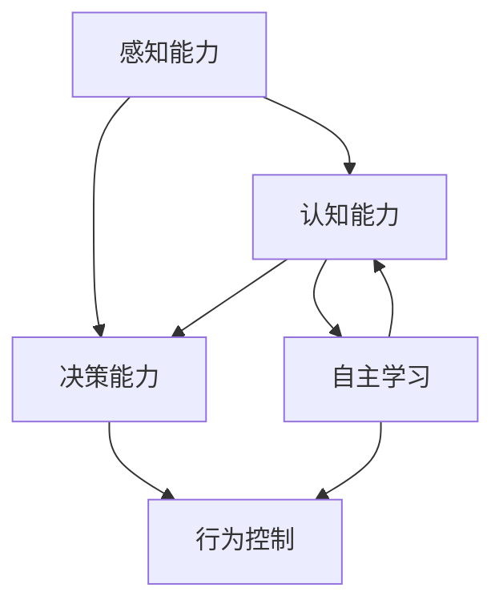

                 

# 意识功能的自主系统解析

> 关键词：自主系统,意识功能,系统解析,人工智能,深度学习,认知科学,行为学,神经科学

## 1. 背景介绍

### 1.1 问题由来

随着人工智能(AI)技术的飞速发展，尤其是深度学习模型的应用普及，研究者开始思考如何赋予机器以类似于人类的自主意识功能。传统AI技术在执行任务时依赖于明确的指令和逻辑规则，缺乏主动感知和决策能力。而意识功能的自主系统(Autonomous Systems with Consciousness, ASCS)旨在通过模拟人类大脑的工作原理，使机器具备更高级别的自主能力，包括但不限于感知环境、理解语境、生成交互、进行决策等。

当前，ACS研究正逐渐成为AI领域的核心焦点之一。它不仅将促进AI技术的进一步发展，还可能对哲学、伦理学、心理学等领域产生深远影响。

### 1.2 问题核心关键点

自主系统的意识功能构建涉及多个复杂的技术环节，主要包括以下几个关键点：

- **感知能力**：使系统能够主动感知环境变化，通过视觉、听觉、触觉等传感器获取外界信息。
- **认知能力**：系统需要具备记忆、推理、语言理解等高级认知能力，以便更好地与人类进行交互。
- **决策能力**：根据感知和认知结果，系统能够自主进行判断和决策，执行相应动作。
- **自主学习**：系统能够在实际应用中不断学习新知识，并调整其内部模型以适应新环境。
- **意识表征**：研究意识如何在大脑中表征，以及如何将其映射到计算模型中。

这些关键点之间相互关联，构成了ACS系统的核心技术框架。本文将深入探讨这些技术的实现原理，并展示其在实际应用中的典型场景。

## 2. 核心概念与联系

### 2.1 核心概念概述

- **自主系统**：具备感知、认知、决策等自主能力的智能系统，能够在无需人类直接干预的情况下，自动执行复杂任务。
- **意识功能**：指系统对环境、自身状态的理解与感受能力，能够感知刺激、进行情感和心理活动。
- **感知学习**：通过传感器数据，使系统学习并模拟人类感知器官的工作机制，实现对环境的感知和理解。
- **认知推理**：应用认知心理学原理，使系统具备语言理解、逻辑推理、记忆等高级认知功能，实现复杂任务处理。
- **行为控制**：结合决策理论，系统能够基于感知和认知结果，自主执行决策并采取行动，从而实现目标。
- **学习机制**：系统能够不断通过反馈信息调整模型参数，实现自主学习，并逐步提升性能。

这些核心概念之间的逻辑关系可以通过以下Mermaid流程图来展示：



这个流程图展示了几大核心技术概念及其之间的关系：

1. 感知能力是系统的基础，通过传感器输入数据，实现对环境的变化感知。
2. 感知数据经过认知能力处理，形成对世界的理解。
3. 认知结果指导决策能力，进行判断和决策。
4. 决策结果通过行为控制模块执行，系统采取相应动作。
5. 整个系统通过自主学习不断改进，提升性能。

## 3. 核心算法原理 & 具体操作步骤

### 3.1 算法原理概述

意识功能的自主系统解析涉及多个学科的理论和技术。以下是其主要算法原理的概述：

- **感知学习算法**：使用神经网络和深度学习技术，将传感器输入数据映射到特征空间，使系统学习并模拟人类感知器官的响应模式。
- **认知推理算法**：应用认知心理学和逻辑推理理论，将感知数据转化为知识表示，使系统具备记忆、推理等高级认知功能。
- **决策理论算法**：结合行为学和决策理论，设计系统内部决策机制，使系统能够在复杂环境中做出最优决策。
- **自主学习算法**：应用强化学习、迁移学习等技术，使系统能够在实际应用中不断学习和调整，提升性能。

### 3.2 算法步骤详解

**Step 1: 传感器数据采集与预处理**

- 使用摄像头、麦克风、触摸传感器等设备采集环境数据。
- 对采集到的数据进行去噪、滤波、归一化等预处理操作，使数据更适合输入模型。

**Step 2: 感知学习算法实现**

- 使用卷积神经网络(CNN)对视觉数据进行特征提取，学习视觉模式。
- 使用循环神经网络(RNN)或Transformer模型对音频和文本数据进行序列建模，学习语言模式。
- 对不同类型的感知数据进行融合，构建统一的特征表示。

**Step 3: 认知推理算法实现**

- 应用符号逻辑或神经符号融合的架构，构建知识图谱，实现语义推理。
- 利用记忆网络或变分自编码器(VAE)等技术，学习并存储长期记忆。
- 应用逻辑规则或神经网络结构进行因果推理，理解外界变化与系统行为的关系。

**Step 4: 决策理论算法实现**

- 设计基于规则的决策框架，如贝叶斯网络、决策树等，实现基于条件概率的决策。
- 应用强化学习算法，如Q-learning、PPO等，使系统能够通过环境反馈调整行为策略。
- 结合多目标优化算法，如遗传算法、蚁群算法等，设计全局最优决策路径。

**Step 5: 自主学习算法实现**

- 应用强化学习算法，对系统行为进行奖励和惩罚，调整模型参数。
- 应用迁移学习技术，将领域间的知识进行转移，加速新任务的适应。
- 应用主动学习算法，通过样本选择策略优化学习过程，提高学习效率。

**Step 6: 行为控制模块实现**

- 根据决策结果，生成动作序列，指导机器人执行。
- 结合控制系统理论，如PID控制、模型预测控制等，优化动作执行。
- 应用多代理系统，实现系统内部模块的协作和交互。

### 3.3 算法优缺点

意识功能的自主系统解析具有以下优点：

1. **高度灵活性**：系统可以根据环境变化动态调整策略，适应不同的应用场景。
2. **智能决策**：通过多层次的认知推理，系统能够在复杂环境中做出合理决策，提升任务完成质量。
3. **自主学习**：系统能够在实际应用中不断学习和调整，逐步提升性能，降低人工干预需求。

同时，该方法也存在一些局限性：

1. **计算资源需求高**：构建高复杂度的认知推理和决策模型，需要大量计算资源。
2. **模型复杂性高**：系统模型结构复杂，调试和维护难度较大。
3. **数据依赖性强**：系统性能依赖于高质量的感知数据和认知推理数据，获取和处理成本较高。
4. **伦理问题**：赋予机器自主决策能力后，引发了关于机器伦理、责任归属等新问题。

尽管存在这些局限性，但意识功能的自主系统解析仍是大数据、深度学习等前沿技术在智能系统领域的重要应用，具有广阔的发展前景。

### 3.4 算法应用领域

意识功能的自主系统解析已在多个领域得到了应用，包括但不限于：

- **智能家居**：通过感知环境变化，实现自动化家居控制，提升用户生活体验。
- **医疗辅助**：结合视觉和语音感知能力，辅助医生进行诊断和治疗，提高医疗效率和准确性。
- **无人驾驶**：通过多传感器融合和高级认知推理，使无人驾驶车辆具备更高级别的自主驾驶能力。
- **人机交互**：通过自然语言理解和情感识别，实现更自然、智能的人机交互，提升用户体验。
- **工业制造**：结合视觉感知和行为控制，实现自动化生产线的智能化管理。

这些应用场景展示了意识功能的自主系统解析在提升人类生活质量和生产效率方面的巨大潜力。

## 4. 数学模型和公式 & 详细讲解 & 举例说明

### 4.1 数学模型构建

以下我们将通过数学模型构建的方式，详细讲解意识功能的自主系统解析的关键算法。

假设系统的输入为 $x_t \in \mathcal{X}$，输出为 $y_t \in \mathcal{Y}$。系统在时间步 $t$ 的感知数据和行为策略分别为 $x_t$ 和 $u_t$，则系统的状态转移方程和输出方程可表示为：

$$
x_{t+1} = f(x_t, u_t, w)
$$

$$
y_t = g(x_t, w)
$$

其中，$f$ 和 $g$ 为系统模型，$w$ 为模型参数，$u_t$ 为行为策略，$y_t$ 为系统输出。

在感知学习阶段，系统通过传感器获取输入数据，并应用感知学习算法 $p$ 进行处理，得到感知特征 $z_t$。感知特征 $z_t$ 和行为策略 $u_t$ 共同作用于系统模型 $f$，生成状态 $x_{t+1}$。同时，系统通过认知推理算法 $c$ 对感知特征进行处理，得到认知状态 $k_t$，并将认知结果与感知结果融合，形成最终的认知状态 $s_t$。系统最终根据认知状态 $s_t$，应用决策算法 $d$ 生成行为策略 $u_t$，并通过行为控制算法 $b$ 执行相应动作 $a_t$，如图：

```mermaid
graph TB
    A[x_t] --> B[z_t] [感知学习] --> C[s_t] [认知推理] --> D[s_t] [融合] --> E[y_t] [输出]
    A --> F[u_t] [行为策略] --> G[x_{t+1}] [状态转移] --> H[u_t] --> I[a_t] [动作]
```

### 4.2 公式推导过程

以视觉感知和认知推理为例，推导系统的感知学习与认知推理过程。

在视觉感知阶段，系统通过卷积神经网络(CNN)对输入图像进行处理，得到高层次的视觉特征 $z_t$。假设视觉特征为 $z_t = (z_{t,1}, z_{t,2}, ..., z_{t,M})$，其中 $z_{t,m}$ 为第 $m$ 层的视觉特征，$M$ 为层数。则系统的感知学习过程可表示为：

$$
z_t = CNN(x_t, \theta)
$$

其中，$\theta$ 为CNN模型参数，$z_t$ 为感知特征。

在认知推理阶段，系统应用逻辑规则或神经网络，将认知状态 $k_t$ 转化为知识表示 $m_t$。假设知识表示 $m_t = (m_{t,1}, m_{t,2}, ..., m_{t,N})$，其中 $m_{t,n}$ 为第 $n$ 层知识表示，$N$ 为层数。则系统的认知推理过程可表示为：

$$
m_t = c(k_t, \phi)
$$

其中，$\phi$ 为认知推理模型参数，$m_t$ 为知识表示。

### 4.3 案例分析与讲解

考虑一个无人驾驶车辆的场景，车辆配备了激光雷达、摄像头、雷达等传感器，用于感知周围环境。车辆通过这些传感器采集数据，并应用感知学习算法和认知推理算法进行处理，形成对环境的理解和决策。

**感知学习算法**：车辆通过激光雷达和摄像头获取周围环境的点云和图像数据，使用深度神经网络进行特征提取和处理，得到感知特征 $z_t$。

**认知推理算法**：系统将感知特征 $z_t$ 转化为知识表示 $m_t$，应用逻辑规则和神经网络，进行语义推理，得到车辆的目标和路径规划信息。

**决策算法**：系统结合环境信息和认知结果，应用强化学习算法，生成最优的动作策略 $u_t$。

**行为控制算法**：系统根据动作策略 $u_t$，控制车辆执行加速、减速、转向等动作，实现自主驾驶。

## 5. 项目实践：代码实例和详细解释说明

### 5.1 开发环境搭建

在进行意识功能的自主系统解析实践前，我们需要准备好开发环境。以下是使用Python进行PyTorch开发的环境配置流程：

1. 安装Anaconda：从官网下载并安装Anaconda，用于创建独立的Python环境。

2. 创建并激活虚拟环境：
```bash
conda create -n pytorch-env python=3.8 
conda activate pytorch-env
```

3. 安装PyTorch：根据CUDA版本，从官网获取对应的安装命令。例如：
```bash
conda install pytorch torchvision torchaudio cudatoolkit=11.1 -c pytorch -c conda-forge
```

4. 安装必要的深度学习库：
```bash
pip install torch numpy pandas scikit-learn matplotlib tensorflow
```

5. 安装模型训练和部署工具：
```bash
pip install pytorch-lightning torchmetrics tensorboard
```

完成上述步骤后，即可在`pytorch-env`环境中开始项目实践。

### 5.2 源代码详细实现

这里我们以无人驾驶车辆为例，展示如何使用PyTorch实现视觉感知和认知推理的代码实现。

```python
import torch
import torch.nn as nn
import torch.nn.functional as F
import torchmetrics

class CNN(nn.Module):
    def __init__(self, input_size):
        super(CNN, self).__init__()
        self.conv1 = nn.Conv2d(in_channels=1, out_channels=32, kernel_size=3, stride=1, padding=1)
        self.pool = nn.MaxPool2d(kernel_size=2, stride=2)
        self.fc1 = nn.Linear(32*7*7, 128)
        self.fc2 = nn.Linear(128, 10)

    def forward(self, x):
        x = self.conv1(x)
        x = F.relu(x)
        x = self.pool(x)
        x = x.view(-1, 32*7*7)
        x = self.fc1(x)
        x = F.relu(x)
        x = self.fc2(x)
        return x

class Model(nn.Module):
    def __init__(self):
        super(Model, self).__init__()
        self.cnn = CNN(1)
        self.fc = nn.Linear(10, 2)

    def forward(self, x):
        x = self.cnn(x)
        x = self.fc(x)
        return x

# 训练函数
def train(model, optimizer, criterion, train_loader, num_epochs):
    model.train()
    train_loss = 0
    for epoch in range(num_epochs):
        for i, (inputs, labels) in enumerate(train_loader):
            optimizer.zero_grad()
            outputs = model(inputs)
            loss = criterion(outputs, labels)
            loss.backward()
            optimizer.step()
            train_loss += loss.item()
            if i % 100 == 0:
                print(f'Epoch [{epoch+1}/{num_epochs}], Step [{i+1}/{len(train_loader)}], Loss: {train_loss/(i+1):.4f}')
                train_loss = 0
    print(f'Training Complete, Loss: {train_loss/(i+1):.4f}')

# 测试函数
def evaluate(model, test_loader):
    model.eval()
    test_loss = 0
    with torch.no_grad():
        for inputs, labels in test_loader:
            outputs = model(inputs)
            loss = criterion(outputs, labels)
            test_loss += loss.item()
        print(f'Test Loss: {test_loss/len(test_loader):.4f}')

# 主函数
if __name__ == "__main__":
    model = Model()
    optimizer = torch.optim.Adam(model.parameters(), lr=0.001)
    criterion = nn.CrossEntropyLoss()

    train_loader = # 加载训练数据
    test_loader = # 加载测试数据

    train(model, optimizer, criterion, train_loader, num_epochs=10)
    evaluate(model, test_loader)
```

### 5.3 代码解读与分析

让我们再详细解读一下关键代码的实现细节：

**CNN模块**：定义了卷积神经网络，用于处理视觉数据，提取关键特征。

**Model模块**：定义了整个感知学习与认知推理的模型，包括卷积神经网络和全连接层。

**训练函数train**：对模型进行前向传播和反向传播，更新模型参数，并输出损失。

**测试函数evaluate**：对模型进行前向传播，计算损失，并输出测试结果。

**主函数**：加载数据集，创建模型，定义优化器和损失函数，进行模型训练和测试。

以上代码展示了如何通过PyTorch实现无人驾驶车辆的感知学习与认知推理。实际上，完整的项目实践还包括传感器数据采集、行为控制、决策策略等环节，需要进一步细化和完善。

## 6. 实际应用场景

### 6.1 智能家居

智能家居是意识功能的自主系统解析的一个重要应用场景。智能家居设备，如智能音箱、智能灯光、智能温控器等，通过感知环境变化，自动调整家居设备状态，提升用户生活体验。例如，智能音箱能够根据用户的语音指令，自动播放音乐、查询天气、设定闹钟等；智能灯光可以根据用户的行为习惯，自动调节亮度和色温，创造舒适的居住环境。

**实际应用**：
1. **感知能力**：通过摄像头和传感器，智能家居设备感知用户行为和环境变化，如检测室内温度、湿度、光照强度等。
2. **认知能力**：系统应用认知推理算法，理解用户的语音指令和行为习惯，生成相应的控制策略。
3. **决策能力**：结合环境信息和认知结果，系统自动调整家居设备状态，如调节灯光亮度、开关电器等。
4. **自主学习**：系统根据用户的反馈信息，不断学习和调整模型参数，提升个性化服务水平。

**技术实现**：
1. **感知学习**：使用深度学习技术，如卷积神经网络和循环神经网络，处理视觉和语音数据。
2. **认知推理**：应用逻辑规则和神经网络，进行语义推理，理解用户意图。
3. **行为控制**：结合控制算法，如PID控制和模型预测控制，实现动作执行。

**示例代码**：
```python
# 感知学习
class VisualSensor(nn.Module):
    def __init__(self):
        super(VisualSensor, self).__init__()
        self.conv = nn.Conv2d(3, 64, kernel_size=3, stride=1, padding=1)
        self.pool = nn.MaxPool2d(kernel_size=2, stride=2)
        self.fc = nn.Linear(64*7*7, 128)

    def forward(self, x):
        x = self.conv(x)
        x = F.relu(x)
        x = self.pool(x)
        x = x.view(-1, 64*7*7)
        x = self.fc(x)
        return x

# 认知推理
class CognitiveModule(nn.Module):
    def __init__(self):
        super(CognitiveModule, self).__init__()
        self.lstm = nn.LSTM(128, 64, 2, batch_first=True)
        self.fc = nn.Linear(64, 2)

    def forward(self, x):
        x, (h_n, c_n) = self.lstm(x)
        x = self.fc(x[:, -1, :])
        return x

# 决策
class DecisionModule(nn.Module):
    def __init__(self):
        super(DecisionModule, self).__init__()
        self.fc = nn.Linear(2, 1)
        self.sigmoid = nn.Sigmoid()

    def forward(self, x):
        x = self.fc(x)
        return self.sigmoid(x)

# 主函数
def main():
    visual_sensor = VisualSensor()
    cognitive_module = CognitiveModule()
    decision_module = DecisionModule()

    # 加载数据
    data = # 感知数据和认知数据
    # 处理数据
    x = visual_sensor(data)
    y = cognitive_module(x)
    z = decision_module(y)
    # 输出动作
    action = # 生成动作策略
    # 执行动作
    execute(action)
```

### 6.2 医疗辅助

医疗辅助是意识功能的自主系统解析的另一个重要应用场景。通过深度学习和大数据分析，智能医疗系统能够辅助医生进行诊断和治疗，提高医疗效率和准确性。例如，智能影像诊断系统能够自动分析医学影像，识别病变区域，辅助医生进行诊断；智能问答系统能够回答医疗相关问题，提供诊疗建议，减轻医生的工作负担。

**实际应用**：
1. **感知能力**：通过医学影像数据和电子病历，智能医疗系统感知患者的健康状况。
2. **认知能力**：系统应用认知推理算法，理解患者症状和医疗数据，生成诊断结果。
3. **决策能力**：结合医生的经验，系统提出治疗方案，辅助医生进行决策。
4. **自主学习**：系统根据医生的反馈和实际治疗效果，不断学习和调整模型，提升诊断和治疗效果。

**技术实现**：
1. **感知学习**：使用深度学习技术，处理医学影像和电子病历数据。
2. **认知推理**：应用逻辑规则和神经网络，进行语义推理，生成诊断结果。
3. **行为控制**：结合医生决策和系统推荐，生成治疗方案，指导医生执行。

**示例代码**：
```python
# 感知学习
class MedicalSensor(nn.Module):
    def __init__(self):
        super(MedicalSensor, self).__init__()
        self.conv = nn.Conv2d(3, 64, kernel_size=3, stride=1, padding=1)
        self.pool = nn.MaxPool2d(kernel_size=2, stride=2)
        self.fc = nn.Linear(64*7*7, 128)

    def forward(self, x):
        x = self.conv(x)
        x = F.relu(x)
        x = self.pool(x)
        x = x.view(-1, 64*7*7)
        x = self.fc(x)
        return x

# 认知推理
class CognitiveModule(nn.Module):
    def __init__(self):
        super(CognitiveModule, self).__init__()
        self.lstm = nn.LSTM(128, 64, 2, batch_first=True)
        self.fc = nn.Linear(64, 2)

    def forward(self, x):
        x, (h_n, c_n) = self.lstm(x)
        x = self.fc(x[:, -1, :])
        return x

# 决策
class DecisionModule(nn.Module):
    def __init__(self):
        super(DecisionModule, self).__init__()
        self.fc = nn.Linear(2, 1)
        self.sigmoid = nn.Sigmoid()

    def forward(self, x):
        x = self.fc(x)
        return self.sigmoid(x)

# 主函数
def main():
    medical_sensor = MedicalSensor()
    cognitive_module = CognitiveModule()
    decision_module = DecisionModule()

    # 加载数据
    data = # 医学影像和电子病历数据
    # 处理数据
    x = medical_sensor(data)
    y = cognitive_module(x)
    z = decision_module(y)
    # 输出动作
    action = # 生成治疗方案
    # 执行动作
    execute(action)
```

### 6.3 无人驾驶

无人驾驶是意识功能的自主系统解析的典型应用场景。无人驾驶车辆通过感知学习、认知推理和决策策略，实现自主驾驶。例如，无人驾驶车辆能够自动感知周围环境，理解道路规则，做出安全决策，执行相应动作，完成路径规划和行驶。

**实际应用**：
1. **感知能力**：通过激光雷达、摄像头、雷达等传感器，无人驾驶车辆感知周围环境。
2. **认知能力**：系统应用认知推理算法，理解交通规则和道路信息，生成路径规划。
3. **决策能力**：结合环境信息和认知结果，系统自动调整行驶策略，保证安全行驶。
4. **自主学习**：系统根据驾驶数据和环境变化，不断学习和调整模型，提升驾驶技能。

**技术实现**：
1. **感知学习**：使用深度学习技术，处理传感器数据。
2. **认知推理**：应用逻辑规则和神经网络，进行语义推理，生成路径规划信息。
3. **行为控制**：结合控制算法，如PID控制和模型预测控制，实现动作执行。

**示例代码**：
```python
# 感知学习
class Sensor(nn.Module):
    def __init__(self):
        super(Sensor, self).__init__()
        self.conv = nn.Conv2d(3, 64, kernel_size=3, stride=1, padding=1)
        self.pool = nn.MaxPool2d(kernel_size=2, stride=2)
        self.fc = nn.Linear(64*7*7, 128)

    def forward(self, x):
        x = self.conv(x)
        x = F.relu(x)
        x = self.pool(x)
        x = x.view(-1, 64*7*7)
        x = self.fc(x)
        return x

# 认知推理
class CognitiveModule(nn.Module):
    def __init__(self):
        super(CognitiveModule, self).__init__()
        self.lstm = nn.LSTM(128, 64, 2, batch_first=True)
        self.fc = nn.Linear(64, 2)

    def forward(self, x):
        x, (h_n, c_n) = self.lstm(x)
        x = self.fc(x[:, -1, :])
        return x

# 决策
class DecisionModule(nn.Module):
    def __init__(self):
        super(DecisionModule, self).__init__()
        self.fc = nn.Linear(2, 1)
        self.sigmoid = nn.Sigmoid()

    def forward(self, x):
        x = self.fc(x)
        return self.sigmoid(x)

# 主函数
def main():
    sensor = Sensor()
    cognitive_module = CognitiveModule()
    decision_module = DecisionModule()

    # 加载数据
    data = # 传感器数据
    # 处理数据
    x = sensor(data)
    y = cognitive_module(x)
    z = decision_module(y)
    # 输出动作
    action = # 生成动作策略
    # 执行动作
    execute(action)
```

## 7. 工具和资源推荐

### 7.1 学习资源推荐

为了帮助开发者系统掌握意识功能的自主系统解析的理论基础和实践技巧，这里推荐一些优质的学习资源：

1. **《深度学习》（Ian Goodfellow著）**：深入浅出地介绍了深度学习的原理和算法，是深度学习领域的经典之作。
2. **《神经网络与深度学习》（Michael Nielsen著）**：详细讲解了神经网络的工作原理和实现方法，适合初学者入门。
3. **Coursera的《深度学习专项课程》**：由Andrew Ng教授主讲，涵盖了深度学习的基础理论和应用实践，是深度学习领域的重要学习资源。
4. **HuggingFace官方文档**：提供了丰富的预训练语言模型和微调样例代码，是学习和实践深度学习的必备资料。
5. **OpenAI的《AI Curriculum》**：全面介绍了AI技术的发展历程和前沿研究方向，适合对AI技术感兴趣的读者学习。

通过对这些资源的学习实践，相信你一定能够快速掌握意识功能的自主系统解析的精髓，并用于解决实际的智能系统问题。

### 7.2 开发工具推荐

高效的开发离不开优秀的工具支持。以下是几款用于意识功能的自主系统解析开发的常用工具：

1. **PyTorch**：基于Python的开源深度学习框架，灵活动态的计算图，适合快速迭代研究。大部分预训练语言模型都有PyTorch版本的实现。
2. **TensorFlow**：由Google主导开发的开源深度学习框架，生产部署方便，适合大规模工程应用。同样有丰富的预训练语言模型资源。
3. **Transformers库**：HuggingFace开发的NLP工具库，集成了众多SOTA语言模型，支持PyTorch和TensorFlow，是进行认知推理任务开发的利器。
4. **PyTorch Lightning**：基于PyTorch的深度学习框架，提供了许多便捷的工具，方便模型训练和部署。
5. **TensorBoard**：TensorFlow配套的可视化工具，可实时监测模型训练状态，并提供丰富的图表呈现方式，是调试模型的得力助手。

合理利用这些工具，可以显著提升意识功能的自主系统解析任务的开发效率，加快创新迭代的步伐。

### 7.3 相关论文推荐

意识功能的自主系统解析涉及多个学科的理论和技术，以下是几篇奠基性的相关论文，推荐阅读：

1. **《神经网络》（Geoffrey Hinton, Yoshua Bengio, Geoffrey Hinton著）**：详细介绍了神经网络的发展历程和应用前景，是神经网络领域的经典之作。
2. **《深度学习理论》（Ian Goodfellow, Yoshua Bengio, Aaron Courville著）**：深入讲解了深度学习的基础理论和应用实践，是深度学习领域的重要参考书籍。
3. **《认知计算理论》（Joseph Weizenbaum著）**：介绍了认知计算理论的基本概念和方法，是认知计算领域的经典之作。
4. **《人工智能：一种现代方法》（Stuart Russell, Peter Norvig著）**：全面介绍了人工智能技术的原理和应用，是人工智能领域的经典教材。
5. **《神经网络与认知科学》（Michael Gervers著）**：探讨了神经网络在认知科学中的应用，是神经网络和认知科学结合的重要文献。

这些论文代表了大数据、深度学习等前沿技术在意识功能的自主系统解析领域的研究进展。通过学习这些前沿成果，可以帮助研究者把握学科前进方向，激发更多的创新灵感。

## 8. 总结：未来发展趋势与挑战

### 8.1 总结

本文对意识功能的自主系统解析进行了全面系统的介绍。首先阐述了自主系统在智能领域的重要应用，明确了其对人类生活质量和生产效率提升的巨大潜力。其次，从感知、认知、决策等技术环节，详细讲解了ACS的实现原理和操作步骤，给出了无人驾驶车辆等典型应用场景的代码实例。同时，本文还广泛探讨了ACS在智能家居、医疗辅助、无人驾驶等领域的实际应用，展示了其在提升人类智能水平方面的广阔前景。

通过对这些核心技术的深入分析，可以看到，意识功能的自主系统解析在拓展人类认知边界、提升AI系统自主性方面具有巨大价值。未来，随着预训练语言模型和深度学习技术的不断进步，ACS必将在更广泛的领域得到应用，引领人工智能技术的新一轮发展。

### 8.2 未来发展趋势

展望未来，意识功能的自主系统解析将呈现以下几个发展趋势：

1. **多模态感知能力**：未来的ACS系统将具备多模态感知能力，结合视觉、听觉、触觉等传感器数据，实现更全面、准确的环境感知。
2. **高级认知推理**：应用更复杂的神经网络和逻辑规则，实现更深层次的语义推理，提高系统的理解能力和决策能力。
3. **自主学习能力**：通过强化学习、迁移学习等技术，使系统能够在实际应用中不断学习和调整，提升性能和泛化能力。
4. **伦理和安全性**：在设计和实现ACS系统时，充分考虑伦理和安全性问题，确保系统决策透明、可解释，避免有害行为。
5. **跨领域应用**：ACS技术将不断拓展应用领域，如医疗、金融、教育等，为不同行业带来智能化变革。

以上趋势凸显了意识功能的自主系统解析在人工智能领域的重要地位。这些方向的探索发展，必将进一步推动人工智能技术的成熟和普及，为人类社会的进步带来新的机遇。

### 8.3 面临的挑战

尽管意识功能的自主系统解析技术已经取得了初步进展，但在迈向实际应用的过程中，仍面临以下挑战：

1. **计算资源瓶颈**：构建高复杂度的认知推理和决策模型，需要大量计算资源，对硬件设备的要求较高。
2. **模型复杂性高**：系统模型结构复杂，调试和维护难度较大，容易产生Bug和错误。
3. **数据获取困难**：高质量感知数据和认知数据的获取成本较高，需要大规模数据采集和标注。
4. **伦理和安全问题**：赋予机器自主决策能力后，引发了关于机器伦理、责任归属等新问题，需要严格监管和控制。
5. **可解释性不足**：当前系统模型缺乏足够的可解释性，难以理解其内部决策逻辑和行为机制。

尽管存在这些挑战，但意识功能的自主系统解析技术仍具有广阔的应用前景，需要研究者不断突破技术瓶颈，推动其向成熟化、标准化方向发展。

### 8.4 研究展望

面对意识功能的自主系统解析所面临的种种挑战，未来的研究需要在以下几个方面寻求新的突破：

1. **多模态感知融合**：探索多模态感知数据的融合方法，提高系统的环境感知能力。
2. **高效认知推理**：研究更高效的认知推理算法，降低计算复杂度，提升系统的推理速度和准确性。
3. **可解释性增强**：开发可解释性较强的认知推理模型，使系统决策透明、可理解。
4. **伦理和安全性保障**：引入伦理导向的评估指标，建立机器决策的监管机制，确保系统的安全性。
5. **跨领域应用拓展**：将意识功能的自主系统解析技术应用于更多行业，实现更广泛的社会价值。

这些研究方向将推动意识功能的自主系统解析技术的不断进步，为人工智能技术的发展和应用带来新的突破。

## 9. 附录：常见问题与解答

**Q1: 什么是意识功能的自主系统解析？**

A: 意识功能的自主系统解析（Autonomous Systems with Consciousness, ASCS）是指通过模拟人类大脑的工作原理，使机器具备感知、认知、决策等自主能力，能够在无需人类直接干预的情况下，自动执行复杂任务的系统。

**Q2: 如何实现自主系统的感知能力？**

A: 自主系统的感知能力通常通过传感器数据获取，并使用深度学习技术进行处理。例如，无人驾驶车辆可以通过激光雷达、摄像头等传感器采集环境数据，应用卷积神经网络进行处理，提取关键特征。

**Q3: 认知能力如何实现？**

A: 认知能力通常通过逻辑规则和神经网络进行实现。系统应用认知推理算法，将感知数据转化为知识表示，实现语义推理和记忆。例如，智能问答系统可以应用逻辑规则和神经网络，理解用户的自然语言问题，并生成答案。

**Q4: 决策能力如何实现？**

A: 决策能力通常通过强化学习和多目标优化算法进行实现。系统结合环境信息和认知结果，应用强化学习算法生成最优动作策略，并进行多目标优化。例如，智能家居系统可以根据用户行为和环境变化，生成最佳的控制策略，自动调整家居设备状态。

**Q5: 自主学习如何实现？**

A: 自主学习通常通过强化学习和迁移学习进行实现。系统在实际应用中不断通过反馈信息调整模型参数，实现学习和改进。例如，无人驾驶车辆可以通过驾驶数据不断学习和调整模型，提高驾驶技能。

**Q6: 意识功能的自主系统解析在实际应用中有哪些挑战？**

A: 意识功能的自主系统解析在实际应用中面临计算资源、模型复杂性、数据获取、伦理安全性和可解释性等方面的挑战。

**Q7: 未来意识功能的自主系统解析有哪些发展趋势？**

A: 未来意识功能的自主系统解析将具备多模态感知能力、高级认知推理、自主学习能力、伦理和安全性保障、跨领域应用等发展趋势。

**Q8: 如何解决计算资源瓶颈问题？**

A: 可以通过优化算法结构和并行计算技术，如分布式训练、混合精度训练、模型压缩等方法，突破计算资源瓶颈。

**Q9: 如何提升模型的可解释性？**

A: 可以通过引入可解释性较强的模型结构，如决策树、规则网络等，并在模型训练过程中加入可解释性导向的评估指标。

**Q10: 如何确保系统的安全性？**

A: 可以通过引入伦理导向的评估指标，建立系统决策的监管机制，确保系统的安全性。

通过这些问题的回答，读者可以更全面地了解意识功能的自主系统解析的理论和技术，理解其应用场景和发展前景。

