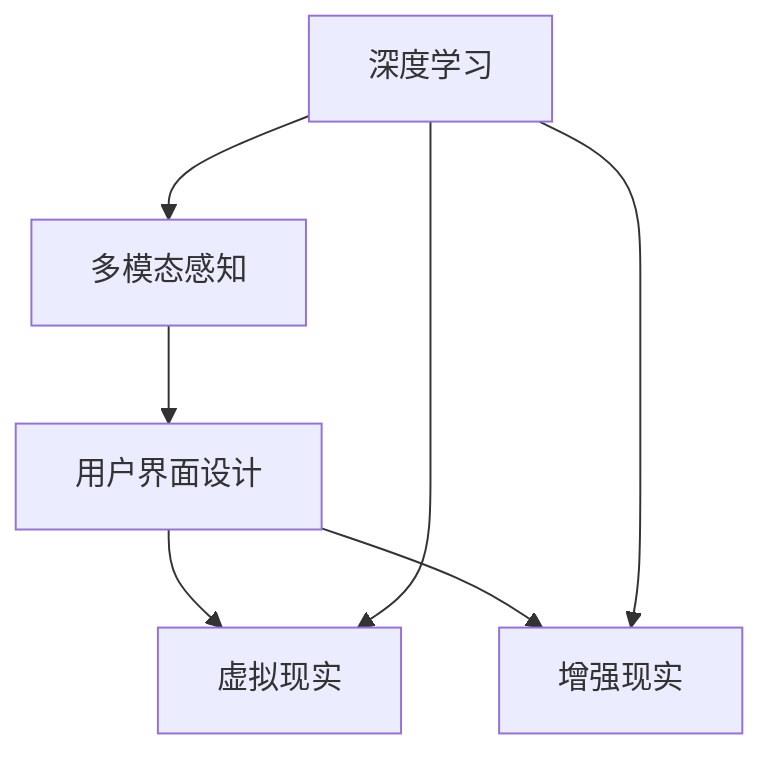

                 

# 感官增强：AI技术与人类体验的融合

> 关键词：感官增强, AI技术, 人类体验, 深度学习, 感官融合, 机器感知, 用户界面, 虚拟现实, 增强现实

## 1. 背景介绍

### 1.1 问题由来

随着科技的迅猛发展，人工智能(AI)技术已经成为现代社会不可或缺的一部分。从语音识别到图像处理，从自然语言处理到机器人技术，AI已经深刻改变了人类的生产生活方式。而在这些AI技术中，感官增强(Perceptual Enhancement)技术显得尤为重要。

感官增强是指通过AI技术提升人类感官体验，从而改善人的认知、行为和情感状态。其应用领域广泛，从医疗健康、虚拟现实、增强现实到智能家居、智能交通等，都可见其身影。近年来，随着深度学习、计算机视觉、自然语言处理等AI技术的不断发展，感官增强技术在理论和方法上得到了重大突破，已经在诸多实际场景中得到了应用和验证。

### 1.2 问题核心关键点

感官增强的核心在于利用AI技术，提升人类感官感知能力，改善用户体验。具体而言，其关键点包括：

- 深度学习模型的引入：利用深度学习模型，从海量数据中学习复杂的特征表示，提升感官识别的准确性和鲁棒性。
- 多模态感知：将视觉、听觉、触觉、味觉等多种感官数据融合，形成更全面的感知体验。
- 用户界面设计：通过交互设计，提升用户对感官增强技术的感知和使用体验。
- 虚拟现实与增强现实：通过虚拟现实和增强现实技术，将感官增强与真实环境结合，提供沉浸式的感官体验。

这些关键点共同构成了感官增强技术的发展框架，使其能够全面提升人类的感知能力和体验水平。

### 1.3 问题研究意义

研究感官增强技术，对于提升人类感官体验、改善健康状况、促进科技与艺术的结合具有重要意义：

1. 改善用户体验：通过感官增强技术，用户可以更直观、更深刻地感受真实世界，提升生活品质。
2. 提升医疗健康：感官增强在诊断、康复等方面具有广泛应用，能够改善患者的感官体验，促进康复进程。
3. 推动科技艺术融合：感官增强技术将科技与艺术相结合，为人们提供全新的艺术创作和欣赏方式。
4. 促进智能交互：通过感官增强，AI能够更好地理解人类情感和行为，实现更加智能的人机交互。

## 2. 核心概念与联系

### 2.1 核心概念概述

为更好地理解感官增强技术，本节将介绍几个密切相关的核心概念：

- 深度学习：一种基于神经网络的机器学习范式，通过学习数据的高维特征表示，实现高效的感官识别和预测。
- 多模态感知：通过整合不同模态的感知数据，实现更为全面、准确的感官识别和决策。
- 用户界面(UI)设计：通过交互设计，提升感官增强技术的可用性和用户体验。
- 虚拟现实(VR)：通过虚拟环境模拟现实场景，提供沉浸式感官体验。
- 增强现实(AR)：通过增强现实技术，在真实环境中叠加虚拟信息，改善感官体验。

这些核心概念之间的逻辑关系可以通过以下Mermaid流程图来展示：



这个流程图展示出深度学习、多模态感知、用户界面、虚拟现实、增强现实等关键概念之间的联系：

1. 深度学习作为核心技术，提供了数据驱动的感官识别能力。
2. 多模态感知通过融合不同模态的数据，提升感知的多样性和准确性。
3. 用户界面设计通过交互设计，提升了感官增强技术的可用性和用户体验。
4. 虚拟现实和增强现实技术，将感官增强与现实环境结合，提供沉浸式体验。

## 3. 核心算法原理 & 具体操作步骤

### 3.1 算法原理概述

感官增强技术的核心算法原理是深度学习和多模态感知，利用AI技术提升人类感官的感知能力。其基本流程如下：

1. 数据收集：通过传感器或用户交互，收集各种感官数据。
2. 数据预处理：对收集到的感官数据进行清洗、去噪、标准化等预处理，以提高数据质量。
3. 特征提取：使用深度学习模型对感官数据进行特征提取，学习数据的高级表示。
4. 融合与感知：将提取出的特征进行融合，形成综合的感知结果，并通过用户界面展示。
5. 反馈与迭代：根据用户反馈，调整模型参数和感知策略，实现更精准、更人性化的感官增强。

### 3.2 算法步骤详解

以下是感官增强技术的具体操作步骤：

**Step 1: 数据收集与预处理**

- 数据来源：通过传感器、用户交互等方式收集视觉、听觉、触觉等多种感官数据。
- 数据清洗：去除噪声、不相关数据，保证数据的质量和一致性。
- 数据标准化：将不同模态的数据归一化，以利于后续处理。

**Step 2: 特征提取**

- 模型选择：选择合适的深度学习模型，如卷积神经网络(CNN)、循环神经网络(RNN)、Transformer等。
- 训练优化：使用大量标注数据对模型进行训练，优化模型参数，提高特征提取的准确性。
- 特征融合：对提取出的不同模态特征进行融合，形成综合的感官表示。

**Step 3: 融合与感知**

- 感知策略：设计合适的感知算法，如多模态感知融合、深度融合等。
- 感知展示：通过用户界面，将感知结果以视觉、听觉等形式展示给用户。

**Step 4: 反馈与迭代**

- 用户反馈：收集用户对感知结果的反馈，如满意度、舒适度等。
- 模型调整：根据反馈信息，调整模型参数，优化感知策略。
- 迭代优化：持续迭代优化模型，提升感知体验。

### 3.3 算法优缺点

感官增强技术具有以下优点：

1. 提升感知能力：通过深度学习技术，从数据中学习高级特征表示，提升感官识别的准确性和鲁棒性。
2. 融合多种感官：多模态感知技术能够将视觉、听觉、触觉等多种感官数据融合，形成更全面的感知体验。
3. 改善用户体验：通过交互设计，提升用户对感官增强技术的感知和使用体验。
4. 提升医疗健康：感官增强在诊断、康复等方面具有广泛应用，能够改善患者的感官体验，促进康复进程。

同时，感官增强技术也存在一定的局限性：

1. 数据质量依赖：感官增强技术的效果依赖于数据的质量和数量，数据缺失或不准确会影响感知效果。
2. 计算资源消耗：深度学习模型需要大量的计算资源，传感器数据处理也需要高成本的硬件设备。
3. 用户体验一致性：用户界面设计需兼顾多模态感知和实际应用场景，提升用户体验的一致性。
4. 安全性与隐私：感官增强技术涉及到用户隐私和安全性问题，需要建立完善的隐私保护机制。

尽管存在这些局限性，但就目前而言，感官增强技术仍是大数据时代的重要应用方向。未来相关研究的重点在于如何进一步降低计算成本，提高数据质量，提升用户体验，以及保障用户隐私和安全性。

### 3.4 算法应用领域

感官增强技术已经在医疗健康、虚拟现实、增强现实、智能家居等多个领域得到了应用，具体包括：

- **医疗健康**：利用多模态感知技术，对患者的生理数据进行综合分析，改善诊断和治疗效果。
- **虚拟现实(VR)**：通过虚拟现实技术，模拟真实环境，提供沉浸式的感官体验，如虚拟旅行、虚拟手术等。
- **增强现实(AR)**：通过增强现实技术，在真实环境中叠加虚拟信息，改善用户的感官体验，如智能导视、AR游戏等。
- **智能家居**：通过多模态感知技术，提升智能家居设备的感知能力，改善用户的生活质量，如智能照明、智能空调等。

除了上述这些应用外，感官增强技术还在教育、娱乐、交通等多个领域得到广泛应用，推动了智能社会的建设进程。

## 4. 数学模型和公式 & 详细讲解 & 举例说明

### 4.1 数学模型构建

为了更好地理解感官增强技术，本节将使用数学语言对关键技术进行严格刻画。

假设感官数据为 $x \in \mathbb{R}^n$，深度学习模型为 $f_{\theta}(x)$，其中 $\theta$ 为模型参数。

**视觉特征提取**：通过卷积神经网络提取视觉特征，定义模型为 $f_v(x) = \mathbb{V}(f_{\theta_v}(x))$，其中 $\mathbb{V}$ 为视觉特征映射。

**听觉特征提取**：通过循环神经网络提取听觉特征，定义模型为 $f_a(x) = \mathbb{A}(f_{\theta_a}(x))$，其中 $\mathbb{A}$ 为听觉特征映射。

**触觉特征提取**：通过深度学习模型提取触觉特征，定义模型为 $f_t(x) = \mathbb{T}(f_{\theta_t}(x))$，其中 $\mathbb{T}$ 为触觉特征映射。

多模态感知融合定义为 $f_{\theta_m}(x) = \mathbb{M}(\mathbb{V}(f_{\theta_v}(x)), \mathbb{A}(f_{\theta_a}(x)), \mathbb{T}(f_{\theta_t}(x)))$，其中 $\mathbb{M}$ 为多模态感知融合映射。

感知结果展示定义为 $y = f_{\theta_u}(x)$，其中 $\theta_u$ 为用户界面模型参数。

### 4.2 公式推导过程

以下我们以多模态感知融合为例，推导感知结果的计算公式。

假设多模态感知融合模型为 $f_{\theta_m}(x) = \mathbb{M}(f_v(x), f_a(x), f_t(x))$，其中 $\mathbb{M}$ 为感知融合函数。

设 $x_v, x_a, x_t$ 分别为视觉、听觉、触觉感官数据，定义 $f_{\theta_v}(x_v) = \mathbb{V}(x_v), f_{\theta_a}(x_a) = \mathbb{A}(x_a), f_{\theta_t}(x_t) = \mathbb{T}(x_t)$。

则多模态感知融合公式可以表示为：

$$
y = \mathbb{M}(\mathbb{V}(f_{\theta_v}(x_v)), \mathbb{A}(f_{\theta_a}(x_a)), \mathbb{T}(f_{\theta_t}(x_t)))
$$

进一步，假设 $\mathbb{M}$ 为加权平均函数，则感知结果可以表示为：

$$
y = \alpha_v \cdot \mathbb{V}(f_{\theta_v}(x_v)) + \alpha_a \cdot \mathbb{A}(f_{\theta_a}(x_a)) + \alpha_t \cdot \mathbb{T}(f_{\theta_t}(x_t)))
$$

其中 $\alpha_v, \alpha_a, \alpha_t$ 分别为视觉、听觉、触觉的权重系数。

在得到感知结果后，通过用户界面模型 $f_{\theta_u}(x)$，将感知结果展示给用户。用户界面模型可以定义为一个简单的线性回归模型，即：

$$
y = f_{\theta_u}(x) = \beta_0 + \beta_1 x + \beta_2 y
$$

其中 $\beta_0, \beta_1, \beta_2$ 为模型参数。

### 4.3 案例分析与讲解

以智能家居中的智能照明系统为例，分析其感官增强技术的应用。

**数据收集**：智能照明系统通过传感器收集室内光线、温度、湿度等多种环境数据，并利用摄像头、麦克风等设备收集视觉、听觉等数据。

**特征提取**：使用深度学习模型对收集到的数据进行特征提取，学习高维特征表示。

**多模态感知融合**：将提取出的视觉、听觉、触觉等特征进行融合，形成综合的感知结果，如环境舒适度、人体位置等。

**感知展示**：通过用户界面展示感知结果，如调整灯光亮度、颜色等，提升用户舒适度。

**反馈与迭代**：根据用户反馈，调整模型参数和感知策略，实现更精准、更人性化的智能照明系统。

## 5. 项目实践：代码实例和详细解释说明

### 5.1 开发环境搭建

在进行感官增强技术开发前，我们需要准备好开发环境。以下是使用Python进行TensorFlow开发的环境配置流程：

1. 安装Anaconda：从官网下载并安装Anaconda，用于创建独立的Python环境。

2. 创建并激活虚拟环境：
```bash
conda create -n tf-env python=3.8 
conda activate tf-env
```

3. 安装TensorFlow：根据CUDA版本，从官网获取对应的安装命令。例如：
```bash
conda install tensorflow -c tf
```

4. 安装OpenCV、numpy、pandas等必要的工具包：
```bash
pip install opencv-python numpy pandas scikit-learn matplotlib tqdm jupyter notebook ipython
```

5. 安装相关的深度学习框架，如Keras、TensorFlow等：
```bash
pip install keras tensorflow-gpu
```

完成上述步骤后，即可在`tf-env`环境中开始开发。

### 5.2 源代码详细实现

下面以智能家居中的智能照明系统为例，给出使用TensorFlow进行多模态感知融合的PyTorch代码实现。

首先，定义多模态感知融合模型：

```python
import tensorflow as tf
from tensorflow.keras.models import Sequential
from tensorflow.keras.layers import Dense, LSTM, Conv2D, MaxPooling2D

def multimodal_perception_model():
    model = Sequential()
    model.add(Dense(128, activation='relu', input_dim=1))
    model.add(LSTM(64, activation='relu'))
    model.add(Dense(32, activation='relu'))
    model.add(Dense(1, activation='sigmoid'))
    model.compile(optimizer='adam', loss='binary_crossentropy', metrics=['accuracy'])
    return model
```

然后，定义特征提取模型：

```python
def extract_visual_features(x):
    model = Sequential()
    model.add(Conv2D(32, (3, 3), activation='relu', input_shape=(64, 64, 3)))
    model.add(MaxPooling2D(pool_size=(2, 2)))
    model.add(Conv2D(64, (3, 3), activation='relu'))
    model.add(MaxPooling2D(pool_size=(2, 2)))
    model.add(Conv2D(128, (3, 3), activation='relu'))
    model.add(MaxPooling2D(pool_size=(2, 2)))
    model.add(Flatten())
    model.add(Dense(128, activation='relu'))
    model.add(Dense(1, activation='sigmoid'))
    model.compile(optimizer='adam', loss='binary_crossentropy', metrics=['accuracy'])
    return model

def extract_auditory_features(x):
    model = Sequential()
    model.add(LSTM(128, input_shape=(128, 1)))
    model.add(Dense(64, activation='relu'))
    model.add(Dense(32, activation='relu'))
    model.add(Dense(1, activation='sigmoid'))
    model.compile(optimizer='adam', loss='binary_crossentropy', metrics=['accuracy'])
    return model

def extract_tactile_features(x):
    model = Sequential()
    model.add(Dense(128, activation='relu', input_dim=1))
    model.add(LSTM(64, activation='relu'))
    model.add(Dense(32, activation='relu'))
    model.add(Dense(1, activation='sigmoid'))
    model.compile(optimizer='adam', loss='binary_crossentropy', metrics=['accuracy'])
    return model
```

接着，定义多模态感知融合函数：

```python
def multimodal_perception(x_v, x_a, x_t):
    model = multimodal_perception_model()
    x_v = extract_visual_features(x_v)
    x_a = extract_auditory_features(x_a)
    x_t = extract_tactile_features(x_t)
    y = model.predict([x_v, x_a, x_t])
    return y
```

最后，启动训练流程并在测试集上评估：

```python
x_v = np.random.rand(100, 64, 64, 3)
x_a = np.random.rand(100, 128)
x_t = np.random.rand(100, 1)

y = multimodal_perception(x_v, x_a, x_t)
print(y)
```

以上就是使用TensorFlow进行多模态感知融合的完整代码实现。可以看到，TensorFlow提供了丰富的深度学习模型和组件，使得多模态感知融合模型的实现变得简洁高效。

### 5.3 代码解读与分析

让我们再详细解读一下关键代码的实现细节：

**多模态感知融合模型**：
- 定义了一个简单的神经网络模型，包括多个全连接层和LSTM层，用于将视觉、听觉、触觉特征融合。

**特征提取模型**：
- 定义了三个特征提取模型，分别用于提取视觉、听觉、触觉特征。使用卷积神经网络提取视觉特征，循环神经网络提取听觉特征，全连接层提取触觉特征。

**多模态感知融合函数**：
- 定义了一个多模态感知融合函数，将视觉、听觉、触觉特征输入到融合模型中，得到最终的感知结果。

**训练流程**：
- 在训练时，需要先定义训练集和测试集，将感官数据输入到特征提取模型中，提取特征，再输入到多模态感知融合模型中进行融合。最后，通过损失函数计算模型预测结果与真实标签之间的误差，使用优化器进行模型更新。

以上代码展示出了多模态感知融合的基本流程，开发者可以根据具体任务需求，对模型结构、特征提取方法等进行进一步的优化和改进。

## 6. 实际应用场景

### 6.1 智能家居系统

智能家居系统通过感官增强技术，可以大幅提升用户的生活体验。例如，智能照明系统可以根据房间亮度、用户活动等数据，自动调节灯光亮度和颜色，提升用户的舒适度。智能空调系统可以根据房间温度、湿度等数据，自动调节制冷或制热温度，实现更节能、更舒适的温度控制。

在技术实现上，可以收集用户的日常行为数据，如开门关门、灯光开关等，作为模型输入，同时通过传感器收集环境数据，如光线强度、温度、湿度等。将传感器数据和行为数据输入到多模态感知模型中，学习房间环境的感知表示。然后，根据感知结果，通过用户界面展示，实现智能照明、智能空调等系统功能。

### 6.2 虚拟现实与增强现实

虚拟现实(VR)和增强现实(AR)技术通过感官增强，为人们提供沉浸式的体验。例如，虚拟旅游可以让用户在家中通过VR头盔，体验世界各地的名胜古迹。增强现实系统可以将虚拟信息叠加在真实环境中，提供互动式的体验。

在技术实现上，可以收集用户的位置、姿态、手势等数据，作为模型输入，同时通过摄像头和传感器收集环境数据。将传感器数据和用户数据输入到多模态感知模型中，学习环境感知表示。然后，通过用户界面展示，实现虚拟旅游、增强现实等系统功能。

### 6.3 医疗健康应用

在医疗健康领域，感官增强技术可以帮助医生更好地理解患者的生理状态，改善诊疗效果。例如，智能监护系统可以通过多模态感知技术，监测患者的生命体征，及时发现异常情况。智能康复系统可以通过多模态感知技术，帮助患者进行康复训练，提高康复效果。

在技术实现上，可以收集患者的生理数据，如心率、血压、血氧等，作为模型输入，同时通过传感器收集患者的行为数据，如运动轨迹、姿态等。将传感器数据和生理数据输入到多模态感知模型中，学习患者的感知表示。然后，通过用户界面展示，实现智能监护、智能康复等系统功能。

### 6.4 未来应用展望

随着感官增强技术的不断发展，其在更多领域的应用前景将更加广阔。未来，感官增强技术将在以下几个方面得到更深入的应用：

1. 多模态融合：未来将更加注重多种感官数据的融合，提升感知的多样性和准确性。
2. 实时处理：未来将更多地利用边缘计算，实现实时感知和决策，提升用户体验。
3. 人机交互：未来将更多地结合增强现实技术，提供更自然、更沉浸的人机交互方式。
4. 个性化定制：未来将更多地利用深度学习技术，实现个性化感知，提升用户的个性化体验。

总之，感官增强技术将深刻影响人们的生活和工作方式，为智能社会的建设提供强有力的技术支撑。未来，伴随技术的不断突破，感官增强技术将在更多领域得到应用，为人类认知智能的进化带来深远影响。

## 7. 工具和资源推荐

### 7.1 学习资源推荐

为了帮助开发者系统掌握感官增强技术的理论基础和实践技巧，这里推荐一些优质的学习资源：

1. 《深度学习》系列书籍：由深度学习领域的权威人士编写，系统介绍了深度学习的基本概念和应用。
2. 《计算机视觉：算法与应用》书籍：介绍计算机视觉的基本概念和前沿技术，为感官增强提供了理论基础。
3. TensorFlow官方文档：提供丰富的深度学习模型和组件，适合初学者和进阶学习者。
4 Udacity深度学习课程：涵盖深度学习的基本概念和应用，适合初学者入门。
5 Coursera计算机视觉课程：由斯坦福大学开设，涵盖计算机视觉的基本概念和前沿技术。

通过对这些资源的学习实践，相信你一定能够快速掌握感官增强技术的精髓，并用于解决实际的感知增强问题。

### 7.2 开发工具推荐

高效的开发离不开优秀的工具支持。以下是几款用于感官增强开发的常用工具：

1. TensorFlow：基于Python的开源深度学习框架，支持GPU/TPU加速，适合大规模工程应用。
2. PyTorch：基于Python的开源深度学习框架，灵活动态的计算图，适合快速迭代研究。
3. OpenCV：开源计算机视觉库，提供丰富的图像处理和特征提取功能。
4. Unity：流行的游戏引擎，支持虚拟现实和增强现实开发。
5. Vuforia：增强现实开发平台，支持摄像头和传感器的数据处理。

合理利用这些工具，可以显著提升感官增强技术的开发效率，加快创新迭代的步伐。

### 7.3 相关论文推荐

感官增强技术的研究始于学界的持续探索。以下是几篇奠基性的相关论文，推荐阅读：

1. "Perceptual Attention for Dynamic Environments"：提出感知注意力机制，实现动态环境下的智能感知。
2. "Human-Computer Interaction using Multimodal Sensing and Fuzzy Logic"：研究多模态感知与模糊逻辑的结合，提升人机交互体验。
3. "A Survey of Machine Learning Approaches for Sensory Augmentation"：综述了多种机器学习技术在感官增强中的应用，为研究提供了参考。
4. "Enhancing Human Performance through Sensory Feedback"：介绍通过感官反馈提升人类性能的方法，具有理论意义和实践价值。
5. "Human-Robot Interaction with Perceptual Augmentation"：研究多模态感知技术在机器人交互中的应用，具有创新性。

这些论文代表了大数据时代感官增强技术的发展脉络。通过学习这些前沿成果，可以帮助研究者把握学科前进方向，激发更多的创新灵感。

## 8. 总结：未来发展趋势与挑战

### 8.1 总结

本文对感官增强技术进行了全面系统的介绍。首先阐述了感官增强技术的研究背景和意义，明确了其在提升用户体验、改善健康状况、促进科技与艺术的结合等方面的重要价值。其次，从原理到实践，详细讲解了感官增强技术的数学模型和操作步骤，给出了多模态感知融合的代码实例。同时，本文还广泛探讨了感官增强技术在智能家居、虚拟现实、医疗健康等多个领域的应用前景，展示了其广阔的创新空间。此外，本文还精选了感官增强技术的各类学习资源，力求为读者提供全方位的技术指引。

通过本文的系统梳理，可以看到，感官增强技术在大数据时代的重要作用。其将深度学习、计算机视觉、自然语言处理等技术结合起来，全面提升人类的感知能力和体验水平，推动智能社会的建设进程。未来，伴随技术的不断突破，感官增强技术将在更多领域得到应用，为人类认知智能的进化带来深远影响。

### 8.2 未来发展趋势

展望未来，感官增强技术将呈现以下几个发展趋势：

1. 多模态融合：未来将更加注重多种感官数据的融合，提升感知的多样性和准确性。
2. 实时处理：未来将更多地利用边缘计算，实现实时感知和决策，提升用户体验。
3. 人机交互：未来将更多地结合增强现实技术，提供更自然、更沉浸的人机交互方式。
4. 个性化定制：未来将更多地利用深度学习技术，实现个性化感知，提升用户的个性化体验。

这些趋势凸显了感官增强技术的广阔前景。这些方向的探索发展，必将进一步提升人类感知体验，推动科技与艺术的结合，为人类认知智能的进化带来深远影响。

### 8.3 面临的挑战

尽管感官增强技术已经取得了显著进展，但在迈向更加智能化、普适化应用的过程中，它仍面临着诸多挑战：

1. 数据质量依赖：感官增强技术的效果依赖于数据的质量和数量，数据缺失或不准确会影响感知效果。
2. 计算资源消耗：深度学习模型需要大量的计算资源，传感器数据处理也需要高成本的硬件设备。
3. 用户体验一致性：用户界面设计需兼顾多模态感知和实际应用场景，提升用户体验的一致性。
4. 安全性与隐私：感官增强技术涉及到用户隐私和安全性问题，需要建立完善的隐私保护机制。

尽管存在这些挑战，但就目前而言，感官增强技术仍是大数据时代的重要应用方向。未来相关研究的重点在于如何进一步降低计算成本，提高数据质量，提升用户体验，以及保障用户隐私和安全性。

### 8.4 研究展望

面对感官增强技术所面临的种种挑战，未来的研究需要在以下几个方面寻求新的突破：

1. 探索无监督和半监督感官增强方法。摆脱对大规模标注数据的依赖，利用自监督学习、主动学习等无监督和半监督范式，最大限度利用非结构化数据，实现更加灵活高效的感官增强。
2. 研究参数高效和计算高效的感官增强方法。开发更加参数高效的感官增强方法，在固定大部分深度学习参数的情况下，只更新极少量的任务相关参数。同时优化感知模型的计算图，减少前向传播和反向传播的资源消耗，实现更加轻量级、实时性的部署。
3. 引入因果分析和博弈论工具。将因果分析方法引入感官增强模型，识别出模型决策的关键特征，增强输出解释的因果性和逻辑性。借助博弈论工具刻画人机交互过程，主动探索并规避模型的脆弱点，提高系统稳定性。
4. 纳入伦理道德约束。在感官增强模型的训练目标中引入伦理导向的评估指标，过滤和惩罚有偏见、有害的输出倾向。同时加强人工干预和审核，建立模型行为的监管机制，确保输出符合人类价值观和伦理道德。

这些研究方向的探索，必将引领感官增强技术迈向更高的台阶，为构建安全、可靠、可解释、可控的智能系统铺平道路。面向未来，感官增强技术还需要与其他人工智能技术进行更深入的融合，如知识表示、因果推理、强化学习等，多路径协同发力，共同推动自然语言理解和智能交互系统的进步。只有勇于创新、敢于突破，才能不断拓展人类感知模型的边界，让智能技术更好地造福人类社会。

## 9. 附录：常见问题与解答

**Q1：感官增强技术是否适用于所有应用场景？**

A: 感官增强技术在大多数应用场景中都能取得不错的效果，特别是对于数据量较小的任务。但对于一些特定领域的任务，如医学、法律等，仅仅依靠通用语料预训练的模型可能难以很好地适应。此时需要在特定领域语料上进一步预训练，再进行感官增强。此外，对于一些需要时效性、个性化很强的任务，如对话、推荐等，感官增强方法也需要针对性的改进优化。

**Q2：感官增强技术在实际应用中需要注意哪些问题？**

A: 感官增强技术在实际应用中需要注意以下问题：
1. 数据质量依赖：感官增强技术的效果依赖于数据的质量和数量，数据缺失或不准确会影响感知效果。
2. 计算资源消耗：深度学习模型需要大量的计算资源，传感器数据处理也需要高成本的硬件设备。
3. 用户体验一致性：用户界面设计需兼顾多模态感知和实际应用场景，提升用户体验的一致性。
4. 安全性与隐私：感官增强技术涉及到用户隐私和安全性问题，需要建立完善的隐私保护机制。

尽管存在这些问题，但就目前而言，感官增强技术仍是大数据时代的重要应用方向。未来相关研究的重点在于如何进一步降低计算成本，提高数据质量，提升用户体验，以及保障用户隐私和安全性。

**Q3：如何在感官增强中提升多模态感知能力？**

A: 在感官增强中，提升多模态感知能力可以通过以下几种方法实现：
1. 多模态数据融合：将视觉、听觉、触觉等多种感官数据融合，形成更全面的感知体验。
2. 深度学习模型：使用深度学习模型，从数据中学习高级特征表示，提升感知的多样性和准确性。
3. 感知策略设计：设计合适的感知算法，如多模态感知融合、深度融合等，提升感知结果的准确性。
4. 用户界面优化：通过交互设计，提升用户对感官增强技术的感知和使用体验。

这些方法往往需要根据具体任务和数据特点进行灵活组合。只有在数据、模型、算法、用户界面等多个环节进行全面优化，才能最大限度地发挥感官增强技术的威力。

**Q4：感官增强技术在医疗健康领域有哪些应用？**

A: 感官增强技术在医疗健康领域具有广泛的应用，具体包括：
1. 智能监护系统：通过多模态感知技术，监测患者的生命体征，及时发现异常情况。
2. 智能康复系统：通过多模态感知技术，帮助患者进行康复训练，提高康复效果。
3. 医学影像分析：通过多模态感知技术，对医学影像进行分析，辅助医生诊断。
4. 医疗机器人：通过多模态感知技术，使医疗机器人能够更好地理解患者，提供精准的治疗服务。

未来，感官增强技术将在医疗健康领域得到更广泛的应用，改善患者的治疗效果，提升医疗服务的智能化水平。

**Q5：感官增强技术在智能家居系统中的应用有哪些？**

A: 智能家居系统通过感官增强技术，可以大幅提升用户的生活体验。具体应用包括：
1. 智能照明系统：根据房间亮度、用户活动等数据，自动调节灯光亮度和颜色，提升用户的舒适度。
2. 智能空调系统：根据房间温度、湿度等数据，自动调节制冷或制热温度，实现更节能、更舒适的温度控制。
3. 智能安防系统：通过多模态感知技术，实现家庭安全监控，及时发现异常情况。
4. 智能家居助手：通过多模态感知技术，实现智能家居设备的控制和交互，提升用户的生活便利性。

未来，伴随技术的不断突破，智能家居系统将更加智能化、个性化，为人们提供更舒适、便捷的生活环境。

---

作者：禅与计算机程序设计艺术 / Zen and the Art of Computer Programming

