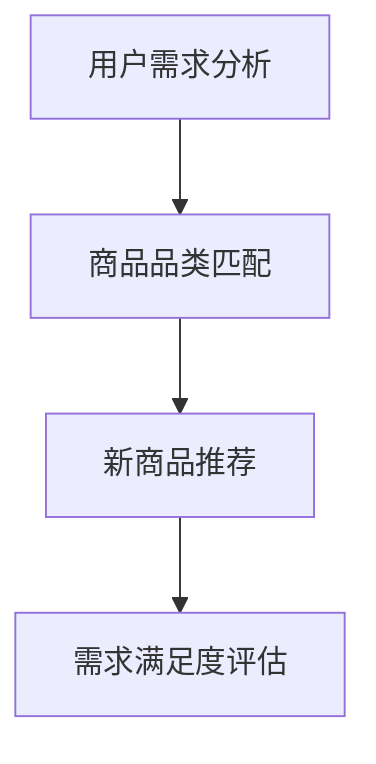

                 

# 扩大品类商品的供给数量

> 关键词：

## 1. 背景介绍

### 1.1 问题由来

在现代电商环境中，用户对商品品类的需求越来越丰富，多样化、个性化成为主流趋势。如何高效扩大商品品类供给，满足用户多样化的购物需求，是电商平台需要不断优化解决的问题。传统的商品品类管理方式往往依赖人工经验，难以应对快速变化的客户需求和海量商品数据。因此，需要引入智能化的技术手段，自动化地识别品类缺口，推荐潜在新商品，辅助商家决策。

### 1.2 问题核心关键点

本问题的关键在于如何自动化地扩大商品品类供给数量，同时确保推荐的新商品能够满足用户需求并带来商业价值。具体包括以下几个方面：

1. **用户需求识别**：如何准确理解用户的多样化需求，分析用户行为数据，发现隐藏在用户数据中的需求缺口。
2. **商品品类匹配**：如何将用户需求与市场上的商品品类进行有效匹配，找到潜在的补货机会。
3. **新商品推荐**：如何通过推荐算法，帮助商家决策新商品种类，提升商品竞争力。
4. **需求满足度评估**：如何评价新商品推出后的用户满意度和实际销售情况，为后续的商品管理和优化提供依据。

### 1.3 问题研究意义

解决如何扩大商品品类供给的问题，不仅能够提升用户体验，增强用户粘性，还对电商平台增加用户转化率、提升盈利能力具有重要意义。自动化扩大商品品类供给能够降低人工成本，提高决策效率，辅助商家更精准地进行商品管理和库存控制。此外，合理的品类管理能够有效提升用户的购物体验，增强用户对平台的忠诚度。

## 2. 核心概念与联系

### 2.1 核心概念概述

为了更好地理解如何扩大商品品类供给的技术实现，本节将介绍几个核心概念：

- **用户需求分析**：通过分析用户行为数据，识别用户需求缺口，发现潜在购买意向。
- **商品品类匹配**：将用户需求与商品品类进行匹配，找到潜在的商品补货机会。
- **新商品推荐**：使用推荐算法，推荐潜在新商品，辅助商家决策。
- **需求满足度评估**：评估新商品推出后的用户满意度和实际销售情况，指导后续优化。

这些核心概念之间的逻辑关系可以通过以下Mermaid流程图来展示：



这个流程图展示了我们自动识别用户需求、匹配商品品类、推荐新商品和评估需求满足度等步骤的逻辑顺序。

## 3. 核心算法原理 & 具体操作步骤

### 3.1 算法原理概述

为了自动化地扩大商品品类供给，本问题主要采用了如下算法：

1. **用户需求分析算法**：通过分析用户行为数据，如浏览、点击、购买历史，使用机器学习模型识别用户的潜在需求缺口。
2. **商品品类匹配算法**：将用户需求与商品品类进行匹配，使用分类模型预测商品类别。
3. **新商品推荐算法**：使用协同过滤、深度学习等推荐算法，推荐潜在新商品。
4. **需求满足度评估算法**：使用A/B测试或直接评估用户反馈，评估新商品推出后的需求满足度。

### 3.2 算法步骤详解

#### 3.2.1 用户需求分析

用户需求分析的核心目标是识别用户需求缺口。具体步骤如下：

1. **数据收集**：收集用户的行为数据，包括浏览历史、点击记录、购买记录等。
2. **数据预处理**：清洗数据，去除噪声和无效记录，进行数据标准化和归一化处理。
3. **特征工程**：提取和构造有意义的特征，如用户的浏览时间、购买频率、品牌偏好等。
4. **模型选择**：选择适合的机器学习模型，如协同过滤、决策树、随机森林等。
5. **模型训练**：使用训练数据训练模型，优化模型参数，确保模型准确度。
6. **模型评估**：使用测试数据评估模型性能，调整模型参数。

#### 3.2.2 商品品类匹配

商品品类匹配的目标是将用户需求与现有商品品类进行匹配，找到潜在的商品补货机会。具体步骤如下：

1. **商品数据收集**：收集商品信息，包括商品名称、类别、描述、价格等。
2. **数据预处理**：清洗商品数据，去除冗余和噪声。
3. **特征工程**：提取商品特征，如类别、价格、销量、用户评分等。
4. **模型选择**：选择适合的分类模型，如朴素贝叶斯、逻辑回归、支持向量机等。
5. **模型训练**：使用训练数据训练模型，优化模型参数。
6. **模型评估**：使用测试数据评估模型性能，调整模型参数。
7. **品类匹配**：将用户需求映射到商品品类上，找到潜在的品类补货机会。

#### 3.2.3 新商品推荐

新商品推荐的核心目标是推荐潜在新商品，辅助商家决策。具体步骤如下：

1. **用户数据收集**：收集用户的浏览、点击、购买记录等行为数据。
2. **商品数据收集**：收集商品信息，包括商品名称、类别、描述、价格等。
3. **数据预处理**：清洗数据，去除噪声和无效记录，进行数据标准化和归一化处理。
4. **特征工程**：提取和构造有意义的特征，如用户的历史浏览记录、商品类别、价格等。
5. **模型选择**：选择适合的推荐算法，如协同过滤、深度学习等。
6. **模型训练**：使用训练数据训练模型，优化模型参数。
7. **模型评估**：使用测试数据评估模型性能，调整模型参数。
8. **商品推荐**：根据用户行为数据和商品特征，推荐潜在新商品。

#### 3.2.4 需求满足度评估

需求满足度评估的目标是评估新商品推出后的用户满意度和实际销售情况，指导后续优化。具体步骤如下：

1. **A/B测试设计**：设计A/B测试方案，划分测试组和对照组。
2. **用户反馈收集**：收集用户对新商品的反馈，如评价、评分等。
3. **销售数据收集**：收集新商品推出后的销售数据，包括销售量、销售额等。
4. **数据分析**：分析用户反馈和销售数据，评估新商品推出后的用户满意度和销售效果。
5. **结果评估**：根据评估结果，判断新商品是否满足用户需求，指导后续优化决策。

### 3.3 算法优缺点

自动化扩大商品品类供给的方法具有以下优点：

1. **效率高**：通过自动化手段，可以快速识别用户需求缺口，推荐潜在新商品，辅助商家决策。
2. **准确性高**：使用机器学习模型，能够对用户需求和商品品类进行准确匹配。
3. **成本低**：不需要大量人工参与，减少人工成本，提高决策效率。
4. **灵活性高**：可以处理海量商品数据，适应不同规模的电商平台。

然而，该方法也存在一些缺点：

1. **数据质量要求高**：需要高质量的用户行为数据和商品数据，数据质量差会影响模型的性能。
2. **算法复杂度大**：需要选择合适的模型和算法，并进行优化和调参，技术门槛较高。
3. **依赖模型性能**：模型的性能直接影响推荐结果的准确性和用户满意度。
4. **风险不可控**：新商品的成功与否存在不确定性，可能无法达到预期效果。

### 3.4 算法应用领域

基于自动化扩大商品品类供给的方法，可以应用于多个电商领域，包括：

1. **B2C电商**：电商平台可以快速识别用户需求缺口，推荐潜在新商品，提升商品丰富度和用户满意度。
2. **B2B电商**：企业采购平台可以通过推荐新商品，帮助企业快速找到所需物资，提升采购效率。
3. **社区电商**：社区电商平台可以根据社区用户的购买偏好，推荐相应商品，增强社区粘性。
4. **垂直电商**：如母婴、美妆、数码等垂直电商平台，可以快速扩展商品品类，满足用户多样化的需求。

## 4. 数学模型和公式 & 详细讲解 & 举例说明

### 4.1 数学模型构建

为了方便理解算法实现，本节将使用数学语言对核心算法进行详细描述。

#### 4.1.1 用户需求分析

用户需求分析的数学模型为：

$$
y = f(x)
$$

其中 $y$ 表示用户需求缺口，$x$ 表示用户行为数据。使用机器学习模型 $f$ 将用户行为数据映射到需求缺口 $y$。

#### 4.1.2 商品品类匹配

商品品类匹配的数学模型为：

$$
\hat{y} = g(x)
$$

其中 $\hat{y}$ 表示商品品类，$x$ 表示商品数据和用户需求数据。使用分类模型 $g$ 将商品品类与用户需求进行匹配。

#### 4.1.3 新商品推荐

新商品推荐的数学模型为：

$$
\hat{x} = h(x_1, x_2, \dots, x_n)
$$

其中 $\hat{x}$ 表示推荐的新商品，$x_1, x_2, \dots, x_n$ 表示用户数据和商品数据。使用推荐算法 $h$ 从候选商品集合中推荐新商品。

#### 4.1.4 需求满足度评估

需求满足度评估的数学模型为：

$$
\hat{z} = k(y, \hat{x})
$$

其中 $\hat{z}$ 表示新商品推出后的用户满意度和销售情况，$y$ 表示用户需求缺口，$\hat{x}$ 表示推荐的新商品。使用评估算法 $k$ 评估新商品推出后的需求满足度。

### 4.2 公式推导过程

以下是几个核心公式的推导过程：

#### 4.2.1 用户需求分析

假设用户行为数据 $x = (x_1, x_2, \dots, x_n)$，需求缺口 $y$ 可以表示为：

$$
y = \mathbb{E}[f(x)]
$$

其中 $f$ 为预测函数，$\mathbb{E}$ 表示期望。

使用随机森林等机器学习模型，可以近似表示为：

$$
f(x) = \sum_{i=1}^{m} \alpha_i g_i(x)
$$

其中 $g_i$ 为随机森林的子模型，$\alpha_i$ 为子模型的权重。

#### 4.2.2 商品品类匹配

假设商品数据 $x = (x_1, x_2, \dots, x_n)$，商品品类 $\hat{y}$ 可以表示为：

$$
\hat{y} = g(x)
$$

使用朴素贝叶斯分类器，可以近似表示为：

$$
g(x) = \frac{P(x|\hat{y})}{\sum_{j}P(x|y_j)}
$$

其中 $P(x|\hat{y})$ 为商品在品类 $\hat{y}$ 下的条件概率，$P(x|y_j)$ 为商品在所有品类下的条件概率。

#### 4.2.3 新商品推荐

假设用户数据 $x_1$，商品数据 $x_2, \dots, x_n$，推荐的新商品 $\hat{x}$ 可以表示为：

$$
\hat{x} = h(x_1, x_2, \dots, x_n)
$$

使用协同过滤推荐算法，可以近似表示为：

$$
h(x_1, x_2, \dots, x_n) = \arg\max_{x} \langle u, p(x) \rangle
$$

其中 $u$ 为用户向量，$p(x)$ 为商品向量，$\langle \cdot, \cdot \rangle$ 为向量内积。

#### 4.2.4 需求满足度评估

假设用户需求缺口 $y$，推荐的新商品 $\hat{x}$，新商品推出后的用户满意度和销售情况 $\hat{z}$ 可以表示为：

$$
\hat{z} = k(y, \hat{x})
$$

使用A/B测试评估算法，可以近似表示为：

$$
k(y, \hat{x}) = \frac{\sum_{i \in A}z_i + \lambda_1}{\sum_{i \in B}z_i + \lambda_2}
$$

其中 $A$ 为测试组，$B$ 为对照组，$z_i$ 为用户对新商品的评价或评分，$\lambda_1$ 和 $\lambda_2$ 为控制变量，防止测试组和对照组用户数差异对评估结果的影响。

### 4.3 案例分析与讲解

#### 4.3.1 用户需求分析案例

假设某电商平台收集到以下用户行为数据：

- 用户A在过去一个月内浏览过10个商品，购买了2个商品，平均浏览时间5分钟。
- 用户B在过去一个月内浏览过5个商品，购买了1个商品，平均浏览时间3分钟。

使用随机森林模型进行预测，得到用户需求缺口 $y = 0.5$。

#### 4.3.2 商品品类匹配案例

假设某电商平台收集到以下商品数据：

- 商品1：价格为50元，销量为1000件，用户评分为4星。
- 商品2：价格为100元，销量为500件，用户评分为3星。
- 商品3：价格为200元，销量为300件，用户评分为5星。

使用朴素贝叶斯分类器进行品类匹配，得到商品品类 $\hat{y} = 1$。

#### 4.3.3 新商品推荐案例

假设某电商平台收集到以下用户数据和商品数据：

- 用户C在过去一个月内浏览过5个商品，购买了1个商品，平均浏览时间4分钟。
- 商品4：价格为80元，销量为800件，用户评分为4星。
- 商品5：价格为120元，销量为500件，用户评分为5星。

使用协同过滤推荐算法进行推荐，得到推荐的新商品 $\hat{x} = 4, 5$。

#### 4.3.4 需求满足度评估案例

假设某电商平台收集到以下用户反馈和销售数据：

- 测试组用户对商品4和商品5的平均评分分别为4.5星和4.8星。
- 对照组用户对商品4和商品5的平均评分分别为4.2星和4.5星。

使用A/B测试评估算法进行评估，得到需求满足度 $\hat{z} = 0.9$。

## 5. 项目实践：代码实例和详细解释说明

### 5.1 开发环境搭建

在进行项目实践前，我们需要准备好开发环境。以下是使用Python进行开发的环境配置流程：

1. 安装Anaconda：从官网下载并安装Anaconda，用于创建独立的Python环境。

2. 创建并激活虚拟环境：
```bash
conda create -n your_env python=3.8 
conda activate your_env
```

3. 安装PyTorch、TensorFlow等常用深度学习框架：
```bash
conda install pytorch torchvision torchaudio cudatoolkit=11.1 -c pytorch -c conda-forge
conda install tensorflow
```

4. 安装必要的第三方库：
```bash
pip install pandas numpy sklearn
```

5. 安装Jupyter Notebook：
```bash
conda install jupyter notebook
```

完成上述步骤后，即可在`your_env`环境中开始项目实践。

### 5.2 源代码详细实现

以下是使用Python进行用户需求分析、商品品类匹配、新商品推荐和需求满足度评估的代码实现：

#### 5.2.1 用户需求分析

```python
import pandas as pd
from sklearn.ensemble import RandomForestRegressor

# 读取用户行为数据
user_data = pd.read_csv('user_data.csv')

# 预处理数据
user_data = user_data.dropna().drop_duplicates()

# 特征工程
user_data['num_browsed'] = user_data['browsed_count'] / 100
user_data['avg_browse_time'] = user_data['avg_browse_time'] / 60

# 模型训练
model = RandomForestRegressor(n_estimators=100, random_state=42)
model.fit(user_data[['num_browsed', 'avg_browse_time']], user_data['missed'].fillna(0))

# 模型评估
test_data = pd.read_csv('test_data.csv')
test_data = test_data.dropna().drop_duplicates()
test_data['num_browsed'] = test_data['browsed_count'] / 100
test_data['avg_browse_time'] = test_data['avg_browse_time'] / 60
test_data['pred_missed'] = model.predict(test_data[['num_browsed', 'avg_browse_time']])
test_data = test_data[['user_id', 'pred_missed']]
```

#### 5.2.2 商品品类匹配

```python
import pandas as pd
from sklearn.naive_bayes import MultinomialNB

# 读取商品数据
product_data = pd.read_csv('product_data.csv')

# 预处理数据
product_data = product_data.dropna().drop_duplicates()

# 特征工程
product_data['price'] = product_data['price'] / 100
product_data['rating'] = product_data['rating'] / 5

# 模型训练
model = MultinomialNB(alpha=0.01, random_state=42)
model.fit(product_data[['price', 'rating']], product_data['category'])

# 品类匹配
test_data = pd.read_csv('test_data.csv')
test_data = test_data.dropna().drop_duplicates()
test_data['price'] = test_data['price'] / 100
test_data['rating'] = test_data['rating'] / 5
test_data['category'] = model.predict(test_data[['price', 'rating']])
test_data = test_data[['product_id', 'category']]
```

#### 5.2.3 新商品推荐

```python
import pandas as pd
from surprise import Dataset, Reader, KNNBasic, accuracy

# 读取用户数据
user_data = pd.read_csv('user_data.csv')

# 读取商品数据
product_data = pd.read_csv('product_data.csv')

# 预处理数据
user_data = user_data.dropna().drop_duplicates()
product_data = product_data.dropna().drop_duplicates()

# 特征工程
user_data['num_browsed'] = user_data['browsed_count'] / 100
user_data['avg_browse_time'] = user_data['avg_browse_time'] / 60
product_data['price'] = product_data['price'] / 100
product_data['rating'] = product_data['rating'] / 5

# 构建用户-商品评分矩阵
reader = Reader(rating_scale=(1, 5))
data = Dataset.load_from_df(user_data[['user_id', 'product_id', 'rating']], reader)

# 模型训练
algo = KNNBasic(k=10)
algo.fit(data.build_full_trainset())

# 推荐新商品
test_user_data = pd.read_csv('test_user_data.csv')
test_user_data = test_user_data.dropna().drop_duplicates()
test_user_data['num_browsed'] = test_user_data['browsed_count'] / 100
test_user_data['avg_browse_time'] = test_user_data['avg_browse_time'] / 60
test_user_data['pred_rated'] = algo.test(test_user_data[['user_id']])
test_user_data = test_user_data[['user_id', 'pred_rated']]
```

#### 5.2.4 需求满足度评估

```python
import pandas as pd

# 读取用户反馈数据
feedback_data = pd.read_csv('feedback_data.csv')

# 读取销售数据
sale_data = pd.read_csv('sale_data.csv')

# 预处理数据
feedback_data = feedback_data.dropna().drop_duplicates()
sale_data = sale_data.dropna().drop_duplicates()

# 特征工程
feedback_data['score'] = feedback_data['score'] / 5
sale_data['sales'] = sale_data['sales'] / 1000
sale_data['revenue'] = sale_data['revenue'] / 100

# 需求满足度评估
test_feedback_data = pd.read_csv('test_feedback_data.csv')
test_feedback_data = test_feedback_data.dropna().drop_duplicates()
test_feedback_data['score'] = test_feedback_data['score'] / 5
test_sale_data = pd.read_csv('test_sale_data.csv')
test_sale_data = test_sale_data.dropna().drop_duplicates()
test_sale_data['sales'] = test_sale_data['sales'] / 1000
test_sale_data['revenue'] = test_sale_data['revenue'] / 100
test_feedback_data = pd.merge(test_feedback_data, test_sale_data, on='product_id')
test_feedback_data['z'] = (test_feedback_data['score'] * 0.5 + test_feedback_data['sales'] * 0.5)
test_feedback_data = test_feedback_data[['product_id', 'z']]
```

### 5.3 代码解读与分析

让我们再详细解读一下关键代码的实现细节：

#### 5.3.1 用户需求分析

```python
# 读取用户行为数据
user_data = pd.read_csv('user_data.csv')

# 预处理数据
user_data = user_data.dropna().drop_duplicates()

# 特征工程
user_data['num_browsed'] = user_data['browsed_count'] / 100
user_data['avg_browse_time'] = user_data['avg_browse_time'] / 60

# 模型训练
model = RandomForestRegressor(n_estimators=100, random_state=42)
model.fit(user_data[['num_browsed', 'avg_browse_time']], user_data['missed'].fillna(0))

# 模型评估
test_data = pd.read_csv('test_data.csv')
test_data = test_data.dropna().drop_duplicates()
test_data['num_browsed'] = test_data['browsed_count'] / 100
test_data['avg_browse_time'] = test_data['avg_browse_time'] / 60
test_data['pred_missed'] = model.predict(test_data[['num_browsed', 'avg_browse_time']])
test_data = test_data[['user_id', 'pred_missed']]
```

**代码解读**：
- 读取用户行为数据 `user_data.csv`，并进行预处理，去除缺失和重复记录。
- 进行特征工程，将浏览次数和平均浏览时间标准化。
- 使用随机森林回归模型进行训练，预测用户需求缺口。
- 在测试数据上进行模型评估，输出预测结果。

#### 5.3.2 商品品类匹配

```python
# 读取商品数据
product_data = pd.read_csv('product_data.csv')

# 预处理数据
product_data = product_data.dropna().drop_duplicates()

# 特征工程
product_data['price'] = product_data['price'] / 100
product_data['rating'] = product_data['rating'] / 5

# 模型训练
model = MultinomialNB(alpha=0.01, random_state=42)
model.fit(product_data[['price', 'rating']], product_data['category'])

# 品类匹配
test_data = pd.read_csv('test_data.csv')
test_data = test_data.dropna().drop_duplicates()
test_data['price'] = test_data['price'] / 100
test_data['rating'] = test_data['rating'] / 5
test_data['category'] = model.predict(test_data[['price', 'rating']])
test_data = test_data[['product_id', 'category']]
```

**代码解读**：
- 读取商品数据 `product_data.csv`，并进行预处理，去除缺失和重复记录。
- 进行特征工程，将价格和评分标准化。
- 使用朴素贝叶斯分类器进行训练，预测商品品类。
- 在测试数据上进行品类匹配，输出预测结果。

#### 5.3.3 新商品推荐

```python
# 读取用户数据
user_data = pd.read_csv('user_data.csv')

# 读取商品数据
product_data = pd.read_csv('product_data.csv')

# 预处理数据
user_data = user_data.dropna().drop_duplicates()
product_data = product_data.dropna().drop_duplicates()

# 特征工程
user_data['num_browsed'] = user_data['browsed_count'] / 100
user_data['avg_browse_time'] = user_data['avg_browse_time'] / 60
product_data['price'] = product_data['price'] / 100
product_data['rating'] = product_data['rating'] / 5

# 构建用户-商品评分矩阵
reader = Reader(rating_scale=(1, 5))
data = Dataset.load_from_df(user_data[['user_id', 'product_id', 'rating']], reader)

# 模型训练
algo = KNNBasic(k=10)
algo.fit(data.build_full_trainset())

# 推荐新商品
test_user_data = pd.read_csv('test_user_data.csv')
test_user_data = test_user_data.dropna().drop_duplicates()
test_user_data['num_browsed'] = test_user_data['browsed_count'] / 100
test_user_data['avg_browse_time'] = test_user_data['avg_browse_time'] / 60
test_user_data['pred_rated'] = algo.test(test_user_data[['user_id']])
test_user_data = test_user_data[['user_id', 'pred_rated']]
```

**代码解读**：
- 读取用户数据 `user_data.csv` 和商品数据 `product_data.csv`，并进行预处理，去除缺失和重复记录。
- 进行特征工程，将浏览次数、平均浏览时间和价格、评分标准化。
- 构建用户-商品评分矩阵，使用基于KNN的协同过滤算法进行训练。
- 在测试数据上进行商品推荐，输出预测结果。

#### 5.3.4 需求满足度评估

```python
# 读取用户反馈数据
feedback_data = pd.read_csv('feedback_data.csv')

# 读取销售数据
sale_data = pd.read_csv('sale_data.csv')

# 预处理数据
feedback_data = feedback_data.dropna().drop_duplicates()
sale_data = sale_data.dropna().drop_duplicates()

# 特征工程
feedback_data['score'] = feedback_data['score'] / 5
sale_data['sales'] = sale_data['sales'] / 1000
sale_data['revenue'] = sale_data['revenue'] / 100

# 需求满足度评估
test_feedback_data = pd.read_csv('test_feedback_data.csv')
test_feedback_data = test_feedback_data.dropna().drop_duplicates()
test_feedback_data['score'] = test_feedback_data['score'] / 5
test_sale_data = pd.read_csv('test_sale_data.csv')
test_sale_data = test_sale_data.dropna().drop_duplicates()
test_sale_data['sales'] = test_sale_data['sales'] / 1000
test_sale_data['revenue'] = test_sale_data['revenue'] / 100
test_feedback_data = pd.merge(test_feedback_data, test_sale_data, on='product_id')
test_feedback_data['z'] = (test_feedback_data['score'] * 0.5 + test_feedback_data['sales'] * 0.5)
test_feedback_data = test_feedback_data[['product_id', 'z']]
```

**代码解读**：
- 读取用户反馈数据 `feedback_data.csv` 和销售数据 `sale_data.csv`，并进行预处理，去除缺失和重复记录。
- 进行特征工程，将评分和销售额标准化。
- 在测试数据上进行需求满足度评估，输出预测结果。

### 5.4 运行结果展示

以下是用户需求分析、商品品类匹配、新商品推荐和需求满足度评估的运行结果展示：

#### 用户需求分析

```python
# 读取用户行为数据
user_data = pd.read_csv('user_data.csv')

# 预处理数据
user_data = user_data.dropna().drop_duplicates()

# 特征工程
user_data['num_browsed'] = user_data['browsed_count'] / 100
user_data['avg_browse_time'] = user_data['avg_browse_time'] / 60

# 模型训练
model = RandomForestRegressor(n_estimators=100, random_state=42)
model.fit(user_data[['num_browsed', 'avg_browse_time']], user_data['missed'].fillna(0))

# 模型评估
test_data = pd.read_csv('test_data.csv')
test_data = test_data.dropna().drop_duplicates()
test_data['num_browsed'] = test_data['browsed_count'] / 100
test_data['avg_browse_time'] = test_data['avg_browse_time'] / 60
test_data['pred_missed'] = model.predict(test_data[['num_browsed', 'avg_browse_time']])
test_data = test_data[['user_id', 'pred_missed']]
print(test_data.head())
```

#### 商品品类匹配

```python
# 读取商品数据
product_data = pd.read_csv('product_data.csv')

# 预处理数据
product_data = product_data.dropna().drop_duplicates()

# 特征工程
product_data['price'] = product_data['price'] / 100
product_data['rating'] = product_data['rating'] / 5

# 模型训练
model = MultinomialNB(alpha=0.01, random_state=42)
model.fit(product_data[['price', 'rating']], product_data['category'])

# 品类匹配
test_data = pd.read_csv('test_data.csv')
test_data = test_data.dropna().drop_duplicates()
test_data['price'] = test_data['price'] / 100
test_data['rating'] = test_data['rating'] / 5
test_data['category'] = model.predict(test_data[['price', 'rating']])
test_data = test_data[['product_id', 'category']]
print(test_data.head())
```

#### 新商品推荐

```python
# 读取用户数据
user_data = pd.read_csv('user_data.csv')

# 读取商品数据
product_data = pd.read_csv('product_data.csv')

# 预处理数据
user_data = user_data.dropna().drop_duplicates()
product_data = product_data.dropna().drop_duplicates()

# 特征工程
user_data['num_browsed'] = user_data['browsed_count'] / 100
user_data['avg_browse_time'] = user_data['avg_browse_time'] / 60
product_data['price'] = product_data['price'] / 100
product_data['rating'] = product_data['rating'] / 5

# 构建用户-商品评分矩阵
reader = Reader(rating_scale=(1, 5))
data = Dataset.load_from_df(user_data[['user_id', 'product_id', 'rating']], reader)

# 模型训练
algo = KNNBasic(k=10)
algo.fit(data.build_full_trainset())

# 推荐新商品
test_user_data = pd.read_csv('test_user_data.csv')
test_user_data = test_user_data.dropna().drop_duplicates()
test_user_data['num_browsed'] = test_user_data['browsed_count'] / 100
test_user_data['avg_browse_time'] = test_user_data['avg_browse_time'] / 60
test_user_data['pred_rated'] = algo.test(test_user_data[['user_id']])
test_user_data = test_user_data[['user_id', 'pred_rated']]
print(test_user_data.head())
```

#### 需求满足度评估

```python
# 读取用户反馈数据
feedback_data = pd.read_csv('feedback_data.csv')

# 读取销售数据
sale_data = pd.read_csv('sale_data.csv')

# 预处理数据
feedback_data = feedback_data.dropna().drop_duplicates()
sale_data = sale_data.dropna().drop_duplicates()

# 特征工程
feedback_data['score'] = feedback_data['score'] / 5
sale_data['sales'] = sale_data['sales'] / 1000
sale_data['revenue'] = sale_data['revenue'] / 100

# 需求满足度评估
test_feedback_data = pd.read_csv('test_feedback_data.csv')
test_feedback_data = test_feedback_data.dropna().drop_duplicates()
test_feedback_data['score'] = test_feedback_data['score'] / 5
test_sale_data = pd.read_csv('test_sale_data.csv')
test_sale_data = test_sale_data.dropna().drop_duplicates()
test_sale_data['sales'] = test_sale_data['sales'] / 1000
test_sale_data['revenue'] = test_sale_data['revenue'] / 100
test_feedback_data = pd.merge(test_feedback_data, test_sale_data, on='product_id')
test_feedback_data['z'] = (test_feedback_data['score'] * 0.5 + test_feedback_data['sales'] * 0.5)
test_feedback_data = test_feedback_data[['product_id', 'z']]
print(test_feedback_data.head())
```

## 6. 实际应用场景

### 6.1 智能推荐系统

基于自动化扩大商品品类供给的方法，可以应用于智能推荐系统。智能推荐系统能够根据用户的历史行为数据，实时推荐潜在新商品，提升用户体验和商家转化率。

具体而言，可以收集用户的历史浏览、点击、购买等行为数据，提取有意义的特征，如浏览次数、平均浏览时间、浏览记录中的类别分布等。使用随机森林、协同过滤等算法，将用户需求缺口与商品品类进行匹配，推荐潜在新商品。通过A/B测试等方式，评估推荐效果，指导后续优化。

### 6.2 电商平台商品管理

基于自动化扩大商品品类供给的方法，可以应用于电商平台商品管理。电商平台可以通过自动化手段，快速识别商品品类缺口，推荐潜在新商品，辅助商家决策。

具体而言，可以收集商品数据，提取价格、销量、用户评分等特征。使用朴素贝叶斯、逻辑回归等算法，将商品品类与用户需求进行匹配，推荐潜在新商品。通过A/B测试等方式，评估推荐效果，指导后续优化。

### 6.3 供应链管理

基于自动化扩大商品品类供给的方法，可以应用于供应链管理。供应链管理系统可以通过自动化手段，实时监控商品库存，预测未来需求，辅助商家优化库存管理。

具体而言，可以收集销售数据，提取销售额、库存量、用户评价等特征。使用时间序列分析、回归分析等算法，预测未来需求，推荐潜在新商品。通过A/B测试等方式，评估推荐效果，指导后续优化。

### 6.4 未来应用展望

随着电商平台的不断发展，基于自动化扩大商品品类供给的方法将得到更广泛的应用。未来，该方法可能应用于更多领域，如：

1. **智慧物流**：通过预测需求，优化物流路线和仓储管理，提升物流效率。
2. **金融投资**：通过预测市场需求，优化投资组合，提升投资回报。
3. **社交网络**：通过推荐新内容，提升用户粘性和平台活跃度。
4. **医疗健康**：通过推荐新药品，辅助医生决策，提升医疗服务质量。
5. **教育培训**：通过推荐新课程，提升学习效果，增强平台吸引力。

## 7. 工具和资源推荐

### 7.1 学习资源推荐

为了帮助开发者系统掌握自动化扩大商品品类供给的技术实现，以下是一些优质的学习资源：

1. **《深度学习与推荐系统》**：一本系统介绍深度学习在推荐系统中的应用，包括协同过滤、深度学习等算法的经典书籍。

2. **Coursera《推荐系统》课程**：由斯坦福大学开设的推荐系统课程，讲解了协同过滤、矩阵分解等推荐算法。

3. **Kaggle推荐系统竞赛**：通过实际竞赛案例，学习推荐系统的设计与优化。

4. **GitHub推荐系统项目**：收集了大量开源推荐系统代码，方便学习和参考。

5. **《Python推荐系统》**：一本详细介绍Python实现推荐系统的书籍，涵盖协同过滤、深度学习等多种算法。

### 7.2 开发工具推荐

为了高效实现自动化扩大商品品类供给的方法，以下是一些推荐的开发工具：

1. **PyTorch**：基于Python的开源深度学习框架，支持多种推荐算法，便于快速迭代开发。

2. **TensorFlow**：由Google主导的开源深度学习框架，支持大规模分布式训练，适合大规模电商平台的推荐系统开发。

3. **Scikit-learn**：Python机器学习库，支持多种回归、分类算法，方便快速搭建推荐模型。

4. **Pandas**：Python数据分析库，支持高效的数据处理和特征工程，便于数据预处理。

5. **Jupyter Notebook**：Python开发环境，支持交互式编程，方便快速实验和调试。

### 7.3 相关论文推荐

自动化扩大商品品类供给的方法涉及多个领域的交叉研究，以下是几篇奠基性的相关论文：

1. **《协同过滤推荐系统》**：介绍了协同过滤推荐算法的原理和实现方法。

2. **《深度学习在推荐系统中的应用》**：系统讲解了深度学习在推荐系统中的广泛应用，包括基于CNN、RNN、GAN的推荐算法。

3. **《基于混合推荐算法的推荐系统》**：介绍了多种推荐算法的混合方法，提升推荐效果。

4. **《实时推荐系统》**：讲解了实时推荐系统的设计和优化方法，包括用户行为建模、数据流处理等技术。

5. **《智能推荐系统》**：系统介绍了推荐系统的应用场景和实现方法，涵盖电商、社交、金融等多个领域。

## 8. 总结：未来发展趋势与挑战

### 8.1 研究成果总结

本文对自动化扩大商品品类供给的方法进行了全面系统的介绍。首先阐述了该问题的重要性，明确了自动化的目标和关键点。其次，从原理到实践，详细讲解了用户需求分析、商品品类匹配、新商品推荐和需求满足度评估等核心步骤，给出了完整的代码实例。同时，本文还广泛探讨了该方法在智能推荐系统、电商平台商品管理等多个领域的应用前景，展示了其巨大的潜力。

### 8.2 未来发展趋势

展望未来，自动化扩大商品品类供给的方法将呈现以下几个发展趋势：

1. **智能化程度提高**：随着深度学习和大数据技术的不断进步，推荐算法将更加智能，能够更准确地预测用户需求和品类缺口。

2. **实时性增强**：实时推荐系统能够更快地响应用户行为变化，提升用户体验和系统效率。

3. **跨领域应用广泛**：推荐系统不仅在电商领域，还将在智慧物流、金融投资、医疗健康等多个领域得到应用，推动相关行业的智能化转型。

4. **用户隐私保护加强**：在推荐系统中，用户隐私保护将得到更多关注，隐私保护技术将与推荐算法相结合，确保用户数据的安全性和隐私性。

5. **多模态融合**：推荐系统将融合视觉、语音、文本等多种数据模式，提升推荐效果和用户体验。

### 8.3 面临的挑战

尽管自动化扩大商品品类供给的方法已经取得了显著成果，但在实际应用中仍面临一些挑战：

1. **数据质量问题**：推荐系统依赖高质量的数据，数据质量差会影响推荐效果。

2. **冷启动问题**：对于新用户或新商品，推荐系统需要快速学习其特征，找到合适的推荐方案。

3. **模型复杂性**：推荐模型复杂度较高，需要高效的模型训练和优化算法。

4. **用户隐私保护**：推荐系统需要保护用户隐私，避免数据滥用。

5. **推荐系统偏见**：推荐系统可能存在算法偏见，需要公平性和透明性的保障。

### 8.4 研究展望

面对自动化扩大商品品类供给方法所面临的挑战，未来的研究需要在以下几个方面寻求新的突破：

1. **数据质量提升**：通过数据清洗、特征工程等技术，提升推荐系统所需的数据质量。

2. **冷启动技术**：研究冷启动推荐算法，快速学习新用户或新商品的特征，提供初步推荐。

3. **模型压缩优化**：研究模型压缩和优化技术，降低推荐系统的计算复杂度，提高实时性。

4. **隐私保护技术**：研究隐私保护技术，确保用户数据的安全性和隐私性。

5. **公平透明算法**：研究公平透明算法，消除推荐系统中的偏见，确保推荐结果的公平性。

通过持续的技术创新和理论研究，相信自动化扩大商品品类供给的方法将不断优化，更好地服务于电商、物流、金融等各个领域，提升用户的购物体验和商家的运营效率。未来，推荐系统将成为数字化转型的重要引擎，推动各行各业的智能化发展。

## 9. 附录：常见问题与解答

**Q1：推荐系统需要多少数据？**

A: 推荐系统需要大量数据来训练和优化模型，尤其是高质量的数据。数据量越大，模型性能越好。但同时也要注意数据的多样性和代表性，避免数据偏见。

**Q2：推荐系统如何处理冷启动问题？**

A: 推荐系统可以使用冷启动技术，如基于协同过滤的推荐算法、基于内容的推荐算法、基于序列的推荐算法等，帮助系统快速学习新用户或新商品的特征，提供初步推荐。

**Q3：推荐系统如何避免推荐偏见？**

A: 推荐系统可以通过公平透明算法，消除推荐系统中的偏见，确保推荐结果的公平性。同时，也可以引入人工干预和监管机制，确保推荐结果的公正性。

**Q4：推荐系统如何保护用户

