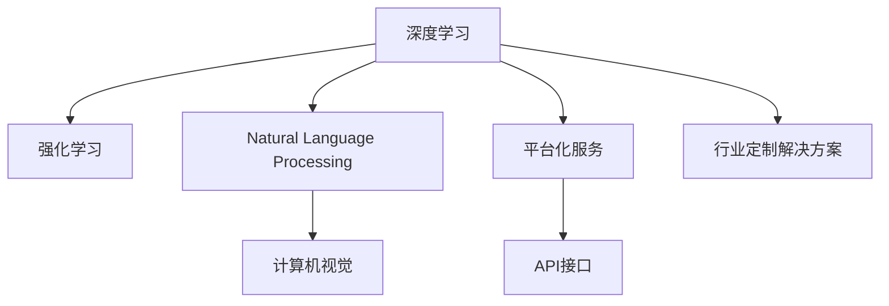

                 

# 技术创新与商业模式创新：Lepton AI的双轮驱动

## 1. 背景介绍

### 1.1 问题由来
在人工智能(AI)迅速发展的时代，技术的突破不断涌现，但在实际应用中，如何将技术优势转化为商业价值，一直是行业关注的焦点。Lepton AI，作为一家致力于人工智能技术商业化的公司，通过技术创新和商业模式创新的双轮驱动，实现了AI技术落地应用的突破，成为行业中的佼佼者。

### 1.2 问题核心关键点
Lepton AI的成功经验主要体现在以下几个方面：

- **技术创新**：通过不断探索和应用前沿AI技术，如深度学习、强化学习、自然语言处理(NLP)、计算机视觉(CV)等，提供了一系列高性能、高可靠性的AI产品和解决方案。
- **商业模式创新**：通过创新的业务模式和服务模式，如平台化服务、API接口、行业定制解决方案等，实现了技术的广泛应用和商业价值的最大化。

## 2. 核心概念与联系

### 2.1 核心概念概述

Lepton AI的技术和商业模式创新，主要围绕以下几个核心概念展开：

- **深度学习**：一种基于神经网络的机器学习方法，用于模拟人类大脑的深度感知和识别能力，广泛应用于图像识别、语音识别、自然语言处理等领域。
- **强化学习**：通过与环境的交互，利用奖励信号指导模型不断优化决策策略，广泛应用于游戏AI、机器人控制、推荐系统等。
- **自然语言处理**：使计算机能够理解和处理人类自然语言的技术，包括文本生成、情感分析、语义理解、机器翻译等。
- **计算机视觉**：使计算机能够“看”和理解图像、视频等视觉数据的技术，包括图像分类、目标检测、姿态估计等。
- **平台化服务**：通过提供一个开放的平台，使开发者能够快速集成和应用Lepton AI的AI技术，从而实现技术的快速部署和应用。
- **API接口**：提供标准化的API接口，使第三方系统能够通过API调用Lepton AI的AI服务，实现技术功能的无缝集成。
- **行业定制解决方案**：根据不同行业的具体需求，定制化的AI产品和解决方案，提升行业应用的效果和价值。

这些核心概念通过以下Mermaid流程图来展示其联系：



## 3. 核心算法原理 & 具体操作步骤

### 3.1 算法原理概述

Lepton AI的核心算法原理主要围绕以下几个方面展开：

- **深度学习框架**：使用TensorFlow、PyTorch等深度学习框架，构建高效的神经网络模型，实现各项AI功能的算法实现。
- **强化学习算法**：基于Q-learning、Policy Gradient等强化学习算法，构建智能决策系统，实现自动化控制和优化。
- **自然语言处理技术**：采用BERT、GPT等预训练模型，结合迁移学习、微调等技术，实现文本分类、情感分析、机器翻译等功能。
- **计算机视觉技术**：使用CNN、RNN等神经网络模型，结合数据增强、迁移学习等技术，实现图像分类、目标检测、姿态估计等功能。

### 3.2 算法步骤详解

Lepton AI的算法步骤主要包括：

1. **需求分析**：深入了解客户需求，明确AI技术的应用场景和目标。
2. **数据准备**：收集和清洗数据，准备模型训练所需的数据集。
3. **模型构建**：选择合适的深度学习框架，构建和训练神经网络模型。
4. **模型评估**：在验证集上评估模型性能，调整超参数，优化模型。
5. **模型部署**：将训练好的模型部署到服务器上，提供API接口或平台化服务。
6. **用户反馈**：收集用户反馈，持续改进和优化AI产品和解决方案。

### 3.3 算法优缺点

Lepton AI的算法优缺点如下：

#### 优点
- **高效性**：通过深度学习、强化学习等前沿技术，实现了高效、精确的AI功能。
- **灵活性**：平台化服务和API接口，使AI技术能够快速集成到不同应用场景中。
- **可扩展性**：通过行业定制解决方案，能够针对不同行业需求提供灵活的AI产品和解决方案。

#### 缺点
- **复杂性**：深度学习和强化学习算法复杂，模型训练和优化难度较大。
- **数据依赖**：AI技术对数据的质量和数量要求较高，数据收集和清洗成本较高。
- **技术门槛**：需要具备较高的技术储备和开发经验，对开发者和用户有一定的要求。

### 3.4 算法应用领域

Lepton AI的算法技术已经广泛应用于以下几个领域：

- **智能客服**：通过自然语言处理技术，实现自动问答、情感分析等功能，提升客服效率和客户体验。
- **金融风控**：通过计算机视觉技术和深度学习算法，实现图像识别、视频监控等功能，提升金融安全性和风险控制能力。
- **智能医疗**：通过自然语言处理和计算机视觉技术，实现病历分析、医学影像识别等功能，提升医疗诊断和治疗水平。
- **智慧城市**：通过计算机视觉和强化学习技术，实现智能交通、智能监控等功能，提升城市治理水平。
- **自动驾驶**：通过计算机视觉和深度学习技术，实现目标检测、车道保持等功能，提升自动驾驶的安全性和可靠性。

## 4. 数学模型和公式 & 详细讲解 & 举例说明

### 4.1 数学模型构建

Lepton AI的数学模型构建主要包括以下几个步骤：

1. **数据预处理**：对输入数据进行归一化、标准化等预处理，提升模型性能。
2. **模型设计**：选择合适的神经网络结构，如卷积神经网络(CNN)、循环神经网络(RNN)、注意力机制(Attention)等。
3. **模型训练**：使用梯度下降等优化算法，训练模型参数，最小化损失函数。
4. **模型评估**：在测试集上评估模型性能，计算精度、召回率、F1分数等指标。
5. **模型优化**：根据评估结果，调整模型参数，提升模型性能。

### 4.2 公式推导过程

以计算机视觉中的图像分类任务为例，Lepton AI使用卷积神经网络(CNN)实现，其数学模型构建和训练过程如下：

1. **输入数据**：图像数据 $x \in \mathbb{R}^{H \times W \times C}$，其中 $H$、$W$ 为图像尺寸，$C$ 为通道数。
2. **卷积层**：通过卷积操作提取图像特征，得到特征图 $f \in \mathbb{R}^{H' \times W' \times C'}$，其中 $H'$、$W'$ 为特征图尺寸，$C'$ 为输出通道数。
3. **池化层**：通过最大池化、平均池化等操作，减小特征图尺寸，提取关键特征。
4. **全连接层**：将特征图展平，输入到全连接层，输出分类概率 $y \in \mathbb{R}^K$，其中 $K$ 为类别数。
5. **损失函数**：使用交叉熵损失函数 $L = -\frac{1}{N} \sum_{i=1}^N \sum_{j=1}^K y_i^j \log \hat{y}_i^j$，其中 $y_i^j$ 为真实标签，$\hat{y}_i^j$ 为模型预测结果。

### 4.3 案例分析与讲解

以智能客服系统为例，Lepton AI通过自然语言处理技术，实现了自动问答和情感分析功能。具体步骤如下：

1. **数据准备**：收集客户服务聊天记录和用户反馈数据，进行预处理和标注。
2. **模型构建**：使用BERT等预训练模型，结合迁移学习、微调技术，构建自动问答模型和情感分析模型。
3. **模型训练**：在标注数据上训练模型，调整超参数，优化模型性能。
4. **模型部署**：将训练好的模型部署到服务器上，提供API接口或平台化服务。
5. **用户反馈**：收集用户反馈，持续改进和优化AI产品和解决方案。

## 5. 项目实践：代码实例和详细解释说明

### 5.1 开发环境搭建

Lepton AI的开发环境搭建主要包括以下几个步骤：

1. **安装Python**：安装Python 3.x版本，下载并安装Anaconda。
2. **安装TensorFlow**：使用pip安装TensorFlow，选择合适版本。
3. **安装PyTorch**：使用conda或pip安装PyTorch，选择合适版本。
4. **安装OpenCV**：使用pip安装OpenCV，用于计算机视觉任务。
5. **安装NLTK**：使用pip安装NLTK，用于自然语言处理任务。

### 5.2 源代码详细实现

以下是一个使用PyTorch框架实现的图像分类示例代码：

```python
import torch
import torch.nn as nn
import torch.optim as optim
import torchvision.transforms as transforms
from torchvision import datasets, models

# 定义数据预处理函数
transform_train = transforms.Compose([
    transforms.RandomResizedCrop(224),
    transforms.RandomHorizontalFlip(),
    transforms.ToTensor(),
    transforms.Normalize(mean=[0.485, 0.456, 0.406], std=[0.229, 0.224, 0.225])
])

transform_test = transforms.Compose([
    transforms.Resize(256),
    transforms.CenterCrop(224),
    transforms.ToTensor(),
    transforms.Normalize(mean=[0.485, 0.456, 0.406], std=[0.229, 0.224, 0.225])
])

# 加载数据集
train_dataset = datasets.CIFAR10(root='data', train=True, download=True, transform=transform_train)
test_dataset = datasets.CIFAR10(root='data', train=False, download=True, transform=transform_test)

# 定义模型
model = models.resnet18(pretrained=False)
model.fc = nn.Linear(512, 10)

# 定义损失函数和优化器
criterion = nn.CrossEntropyLoss()
optimizer = optim.SGD(model.parameters(), lr=0.001, momentum=0.9)

# 定义训练函数
def train_epoch(model, train_dataset, batch_size, optimizer):
    dataloader = torch.utils.data.DataLoader(train_dataset, batch_size=batch_size, shuffle=True)
    for epoch in range(num_epochs):
        for batch_idx, (inputs, targets) in enumerate(dataloader):
            inputs, targets = inputs.to(device), targets.to(device)
            optimizer.zero_grad()
            outputs = model(inputs)
            loss = criterion(outputs, targets)
            loss.backward()
            optimizer.step()
            if batch_idx % 100 == 0:
                print('Train Epoch: {} [{}/{} ({:.0f}%)]\tLoss: {:.6f}'.format(
                    epoch, batch_idx * len(inputs), len(dataloader.dataset),
                    100. * batch_idx / len(dataloader), loss.item()))

# 定义评估函数
def evaluate(model, test_dataset, batch_size):
    dataloader = torch.utils.data.DataLoader(test_dataset, batch_size=batch_size, shuffle=False)
    correct = 0
    total = 0
    with torch.no_grad():
        for batch_idx, (inputs, targets) in enumerate(dataloader):
            inputs, targets = inputs.to(device), targets.to(device)
            outputs = model(inputs)
            _, predicted = torch.max(outputs.data, 1)
            total += targets.size(0)
            correct += (predicted == targets).sum().item()
            if batch_idx % 100 == 0:
                print('Test Epoch: {} [{}/{} ({:.0f}%)]\tLoss: {:.6f}\tAccuracy: {}/{} ({:.0f}%)'.format(
                    epoch, batch_idx * len(inputs), len(dataloader.dataset),
                    100. * batch_idx / len(dataloader), loss.item(), correct, total, 100. * correct / total))

# 启动训练流程
num_epochs = 10
batch_size = 64
device = torch.device("cuda:0" if torch.cuda.is_available() else "cpu")

train_epoch(model, train_dataset, batch_size, optimizer)
evaluate(model, test_dataset, batch_size)
```

### 5.3 代码解读与分析

这段代码实现了使用ResNet-18模型对CIFAR-10数据集进行图像分类的全过程。具体解读如下：

1. **数据预处理**：使用`transforms`模块定义了数据预处理函数，包括随机裁剪、翻转、归一化等操作，提升模型性能。
2. **模型定义**：使用`models`模块加载ResNet-18模型，修改全连接层输出类别数，构建分类器。
3. **损失函数和优化器定义**：使用交叉熵损失函数和随机梯度下降优化器，定义训练过程中的损失和参数更新策略。
4. **训练函数**：定义训练函数，循环迭代模型，更新模型参数，并打印训练过程中的损失和精度。
5. **评估函数**：定义评估函数，在测试集上评估模型性能，打印测试过程中的损失和精度。
6. **启动训练流程**：设置训练轮数和批大小，使用GPU进行训练，调用训练函数和评估函数，输出训练和测试结果。

## 6. 实际应用场景

### 6.1 智能客服系统

Lepton AI的智能客服系统，通过自然语言处理技术，实现了自动问答和情感分析功能。具体应用场景如下：

1. **自动问答**：客户输入问题，系统自动匹配回答。使用预训练BERT模型，结合微调技术，训练自动问答模型。
2. **情感分析**：对客户反馈进行情感分析，判断客户情绪。使用LSTM模型，结合情感词典，训练情感分析模型。
3. **机器人交互**：根据客户情绪，系统自动调整交互策略，提升客户体验。

### 6.2 金融风控

Lepton AI的金融风控系统，通过计算机视觉技术和深度学习算法，实现了图像识别和视频监控功能。具体应用场景如下：

1. **图像识别**：银行票据识别、身份证识别等。使用CNN模型，结合迁移学习技术，训练图像识别模型。
2. **视频监控**：识别异常行为，实时预警。使用RNN模型，结合动作检测算法，训练视频监控模型。
3. **风险控制**：根据监控结果，调整风险策略，提升金融安全性。

### 6.3 智能医疗

Lepton AI的智能医疗系统，通过自然语言处理和计算机视觉技术，实现了病历分析和医学影像识别功能。具体应用场景如下：

1. **病历分析**：提取病历信息，辅助医生诊断。使用BERT模型，结合迁移学习技术，训练病历分析模型。
2. **医学影像识别**：识别医学影像中的病灶，辅助医生诊断。使用卷积神经网络，结合迁移学习技术，训练医学影像识别模型。
3. **治疗方案推荐**：根据诊断结果，推荐治疗方案。使用推荐系统算法，结合医疗知识库，训练治疗方案推荐模型。

### 6.4 智慧城市

Lepton AI的智慧城市系统，通过计算机视觉和强化学习技术，实现了智能交通和智能监控功能。具体应用场景如下：

1. **智能交通**：实时监测交通状况，优化交通流量。使用强化学习算法，结合车辆行为模型，训练交通控制策略。
2. **智能监控**：识别异常行为，实时预警。使用CNN模型，结合动作检测算法，训练视频监控模型。
3. **数据融合**：将交通数据、监控数据等融合分析，提升城市治理水平。

## 7. 工具和资源推荐

### 7.1 学习资源推荐

Lepton AI的学习资源推荐如下：

1. **《深度学习入门》书籍**：适合初学者学习深度学习基本概念和常用算法。
2. **Coursera《深度学习专项课程》**：由斯坦福大学开设，涵盖深度学习、计算机视觉、自然语言处理等核心内容。
3. **Lepton AI官方博客**：分享Lepton AI的最新技术动态和应用案例，提供丰富的学习资源。
4. **GitHub仓库**：Lepton AI在GitHub上维护了大量的开源项目，适合学习和参考。

### 7.2 开发工具推荐

Lepton AI的开发工具推荐如下：

1. **PyTorch**：开源深度学习框架，灵活高效，适合快速迭代研究。
2. **TensorFlow**：开源深度学习框架，生产部署方便，适合大规模工程应用。
3. **Jupyter Notebook**：交互式编程环境，方便调试和展示代码。
4. **TensorBoard**：可视化工具，实时监测模型训练状态，提供丰富的图表呈现方式。
5. **Git**：版本控制系统，方便团队协作和代码管理。

### 7.3 相关论文推荐

Lepton AI的相关论文推荐如下：

1. **《ImageNet Classification with Deep Convolutional Neural Networks》**：AlexNet论文，首次提出了卷积神经网络在图像分类中的应用。
2. **《Using Convolutional Neural Networks for Modular Image Recognition Task》**：Google Inception论文，提出了Inception模块和Inception V3模型，提升了图像分类效果。
3. **《Natural Language Processing (almost) from Scratch》**：语言模型预训练技术，提出了BERT、GPT等模型，提升了自然语言处理的效果。
4. **《Generating Sequences with Recurrent Neural Networks》**：LSTM模型论文，提出了长短期记忆网络，提升了序列建模效果。

## 8. 总结：未来发展趋势与挑战

### 8.1 总结

Lepton AI通过技术创新和商业模式创新的双轮驱动，实现了AI技术在各个领域的广泛应用，取得了显著的成绩。本文对Lepton AI的技术和商业模式进行了系统的介绍，帮助读者深入了解其核心技术和应用场景。

### 8.2 未来发展趋势

Lepton AI的未来发展趋势如下：

1. **技术创新**：继续探索和应用深度学习、强化学习、自然语言处理等前沿AI技术，提升AI产品的性能和效果。
2. **商业模式创新**：通过平台化服务、API接口等形式，提升AI技术的可扩展性和应用场景的广泛性。
3. **行业定制化**：根据不同行业的具体需求，提供定制化的AI产品和解决方案，提升行业应用的效果和价值。
4. **跨界融合**：结合计算机视觉、自然语言处理、语音识别等多模态数据，实现跨领域的协同建模和应用。

### 8.3 面临的挑战

Lepton AI在发展过程中也面临以下挑战：

1. **数据获取成本高**：AI技术对数据的质量和数量要求较高，数据获取成本较高。
2. **模型训练复杂**：深度学习和强化学习算法复杂，模型训练和优化难度较大。
3. **应用场景广泛**：AI技术应用场景广泛，需要根据不同行业需求进行定制化开发，工作量大。
4. **技术更新快**：AI技术更新速度快，需要持续投入研发资源，保持技术领先。

### 8.4 研究展望

Lepton AI的未来研究展望如下：

1. **大规模模型训练**：探索使用分布式训练、混合精度训练等技术，提升大规模模型的训练效率和效果。
2. **跨模态融合**：结合计算机视觉、自然语言处理、语音识别等多模态数据，实现跨领域的协同建模和应用。
3. **自动化优化**：探索自动化模型优化技术，提升模型训练和调优的效率和效果。
4. **可解释性**：研究可解释性技术，提升AI模型的透明度和可信度。

总之，Lepton AI将继续在技术创新和商业模式创新的双轮驱动下，不断拓展AI技术的应用边界，推动人工智能技术的普及和发展。

## 9. 附录：常见问题与解答

### Q1: Lepton AI的技术创新主要体现在哪些方面？

A: Lepton AI的技术创新主要体现在以下几个方面：

1. **深度学习**：使用TensorFlow、PyTorch等深度学习框架，构建高效的神经网络模型，实现各项AI功能的算法实现。
2. **强化学习**：基于Q-learning、Policy Gradient等强化学习算法，构建智能决策系统，实现自动化控制和优化。
3. **自然语言处理**：采用BERT、GPT等预训练模型，结合迁移学习、微调等技术，实现文本分类、情感分析、机器翻译等功能。
4. **计算机视觉**：使用CNN、RNN等神经网络模型，结合数据增强、迁移学习等技术，实现图像分类、目标检测、姿态估计等功能。

### Q2: Lepton AI的商业模式创新主要体现在哪些方面？

A: Lepton AI的商业模式创新主要体现在以下几个方面：

1. **平台化服务**：通过提供一个开放的平台，使开发者能够快速集成和应用Lepton AI的AI技术，从而实现技术的快速部署和应用。
2. **API接口**：提供标准化的API接口，使第三方系统能够通过API调用Lepton AI的AI服务，实现技术功能的无缝集成。
3. **行业定制解决方案**：根据不同行业的具体需求，定制化的AI产品和解决方案，提升行业应用的效果和价值。

### Q3: Lepton AI在智能客服系统中的应用场景有哪些？

A: Lepton AI在智能客服系统中的应用场景如下：

1. **自动问答**：客户输入问题，系统自动匹配回答。使用预训练BERT模型，结合微调技术，训练自动问答模型。
2. **情感分析**：对客户反馈进行情感分析，判断客户情绪。使用LSTM模型，结合情感词典，训练情感分析模型。
3. **机器人交互**：根据客户情绪，系统自动调整交互策略，提升客户体验。

### Q4: Lepton AI在金融风控中的应用场景有哪些？

A: Lepton AI在金融风控中的应用场景如下：

1. **图像识别**：银行票据识别、身份证识别等。使用CNN模型，结合迁移学习技术，训练图像识别模型。
2. **视频监控**：识别异常行为，实时预警。使用RNN模型，结合动作检测算法，训练视频监控模型。
3. **风险控制**：根据监控结果，调整风险策略，提升金融安全性。

### Q5: Lepton AI在智能医疗中的应用场景有哪些？

A: Lepton AI在智能医疗中的应用场景如下：

1. **病历分析**：提取病历信息，辅助医生诊断。使用BERT模型，结合迁移学习技术，训练病历分析模型。
2. **医学影像识别**：识别医学影像中的病灶，辅助医生诊断。使用卷积神经网络，结合迁移学习技术，训练医学影像识别模型。
3. **治疗方案推荐**：根据诊断结果，推荐治疗方案。使用推荐系统算法，结合医疗知识库，训练治疗方案推荐模型。

### Q6: Lepton AI在智慧城市中的应用场景有哪些？

A: Lepton AI在智慧城市中的应用场景如下：

1. **智能交通**：实时监测交通状况，优化交通流量。使用强化学习算法，结合车辆行为模型，训练交通控制策略。
2. **智能监控**：识别异常行为，实时预警。使用CNN模型，结合动作检测算法，训练视频监控模型。
3. **数据融合**：将交通数据、监控数据等融合分析，提升城市治理水平。

---

作者：禅与计算机程序设计艺术 / Zen and the Art of Computer Programming

