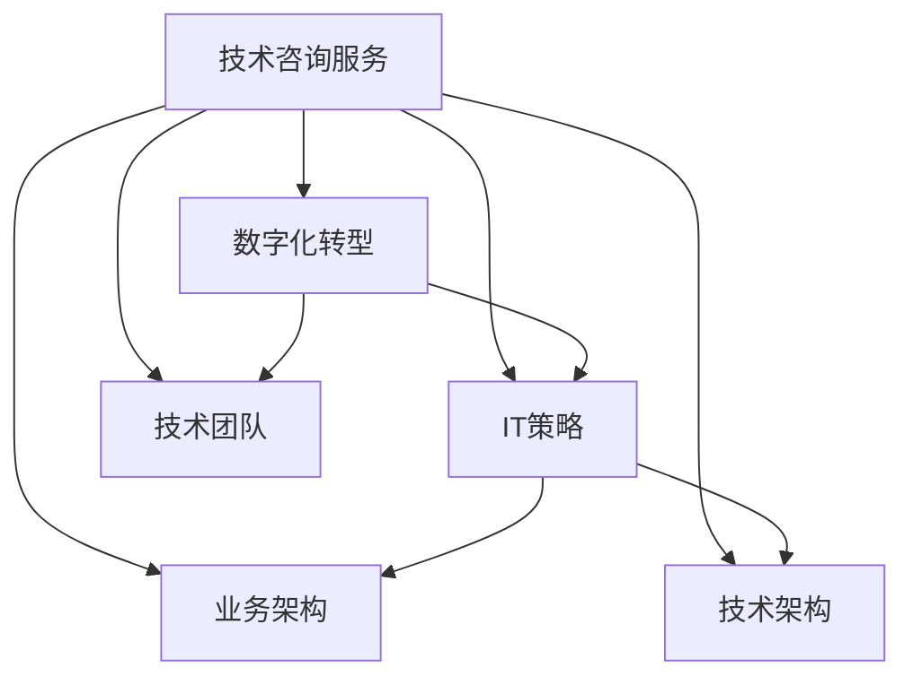

                 

# 技术咨询：高价值服务的提供

> 关键词：技术咨询,高价值服务,咨询方案,业务转型,IT策略,企业数字化

## 1. 背景介绍

### 1.1 问题由来
在数字化转型的浪潮下，越来越多的企业开始意识到技术咨询服务的重要性。随着信息技术的飞速发展，企业面临的挑战也日趋复杂，如何通过技术手段解决业务问题，提升运营效率，已成为企业的迫切需求。然而，很多企业缺乏足够的技术积累，无法独立完成复杂的技术方案设计、实施和优化。这时，高质量的技术咨询服务就显得尤为重要。

### 1.2 问题核心关键点
技术咨询的核心关键点在于为企业提供有针对性的技术解决方案，帮助其实现数字化转型、提升业务价值和市场竞争力。主要包括以下几个方面：

1. **技术评估**：对企业现有的IT基础设施和业务系统进行全面评估，找出短板和改进空间。
2. **方案设计**：根据企业需求和评估结果，设计合适的技术架构和实施方案，确保方案的可执行性和成本效益。
3. **实施与优化**：执行方案，确保技术方案的顺利实施，并进行持续优化和调整，以适应业务变化。
4. **培训与支持**：为企业的IT团队提供必要的技术培训和长期技术支持，确保方案的顺利运行和持续改进。

## 2. 核心概念与联系

### 2.1 核心概念概述

为更好地理解技术咨询服务的核心概念，本节将介绍几个密切相关的核心概念：

- **技术咨询服务**：指通过专业的技术团队，为企业提供系统化的技术方案设计、实施和优化服务，帮助企业实现数字化转型、提升业务价值。
- **数字化转型**：指通过引入先进的技术和管理手段，对企业现有业务流程、信息系统进行优化和升级，以实现业务效率的提升和市场竞争力的增强。
- **IT策略**：指企业对信息技术应用和发展方向的总体规划和策略，包括基础设施建设、应用系统开发、数据管理等。
- **业务架构**：指企业业务活动和信息系统的整体结构设计，包括业务流程、数据流、信息流等，是数字化转型的基础。
- **技术架构**：指企业信息技术系统的整体架构设计，包括技术选型、系统集成、安全性、可靠性等，是数字化转型的重要保障。
- **技术团队**：指具备专业技能和经验的技术人才，包括软件工程师、系统架构师、数据分析师等，是技术咨询服务的核心力量。

这些核心概念之间的逻辑关系可以通过以下Mermaid流程图来展示：



这个流程图展示了一个完整的技术咨询服务流程：

1. 通过业务架构评估，发现企业数字化转型的需求。
2. 设计合适的IT策略，为数字化转型提供方向。
3. 基于业务架构和技术架构设计实施方案。
4. 组建技术团队，执行和优化实施方案。

这些概念共同构成了技术咨询服务的基础框架，使其能够为企业的数字化转型提供全面的支持。

## 3. 核心算法原理 & 具体操作步骤

### 3.1 算法原理概述

技术咨询服务的核心算法原理，是通过专业的技术团队对企业现有的IT基础设施和业务系统进行全面评估，找出短板和改进空间，设计合适的技术架构和实施方案，确保方案的可执行性和成本效益，并进行持续优化和调整，以适应业务变化。这一过程通常包括以下几个关键步骤：

1. **需求分析**：通过与企业高层和业务部门的深度交流，了解企业当前面临的业务挑战和未来发展目标，明确技术咨询的需求。
2. **现状评估**：对企业现有的IT基础设施和业务系统进行全面评估，找出其中的短板和改进空间，为后续的技术方案设计提供依据。
3. **方案设计**：根据评估结果，设计合适的技术架构和实施方案，确保方案的可执行性和成本效益，并充分考虑技术的先进性和可扩展性。
4. **实施与优化**：执行方案，确保技术方案的顺利实施，并进行持续优化和调整，以适应业务变化，提升业务效率和市场竞争力。
5. **培训与支持**：为企业的IT团队提供必要的技术培训和长期技术支持，确保方案的顺利运行和持续改进。

### 3.2 算法步骤详解

以下我们以企业数字化转型为例，详细讲解技术咨询服务的核心算法步骤。

**Step 1: 需求分析**
- 与企业高层和业务部门进行深度交流，了解企业的业务挑战、发展目标和战略规划。
- 确定技术咨询的具体需求，包括系统改造、功能提升、性能优化等方面。
- 收集企业的业务数据和系统文档，了解现有IT架构和业务流程。

**Step 2: 现状评估**
- 对企业的IT基础设施和业务系统进行全面评估，包括硬件设备、软件系统、网络架构、数据管理等方面。
- 通过性能测试、安全审计、风险评估等方式，找出存在的短板和改进空间。
- 对企业的业务流程和数据流进行分析，找出其中的瓶颈和优化点。

**Step 3: 方案设计**
- 根据评估结果，设计合适的技术架构和实施方案，确保方案的可执行性和成本效益。
- 考虑技术的前沿性和可扩展性，选择适合企业的技术栈和工具。
- 制定详细的实施计划和资源配置，包括时间、人力、预算等方面的安排。

**Step 4: 实施与优化**
- 执行方案，确保技术方案的顺利实施，进行项目管理和监控。
- 对系统进行性能测试、安全性评估、用户验收等环节，确保系统满足业务需求。
- 根据实施过程中的反馈，进行持续优化和调整，确保系统的稳定性和可靠性。

**Step 5: 培训与支持**
- 为企业的IT团队提供必要的技术培训，确保其能够熟练使用新技术和新系统。
- 建立长期的技术支持机制，提供技术咨询和问题解决服务，帮助企业持续改进。

### 3.3 算法优缺点

技术咨询服务的优点包括：

1. **专业性**：技术咨询团队具备丰富的专业知识和经验，能够提供系统化的技术解决方案，帮助企业解决复杂的业务问题。
2. **全面性**：技术咨询服务覆盖企业数字化转型的各个方面，从IT策略制定到系统实施、培训支持等，提供一站式的服务。
3. **高效性**：通过专业的项目管理，确保项目按时、按质、按预算完成，提升企业的业务效率和市场竞争力。

技术咨询服务的主要缺点包括：

1. **成本高**：技术咨询服务通常需要较高的成本投入，包括人力、设备、技术培训等。
2. **沟通成本高**：技术咨询团队与企业之间需要进行大量的沟通和协调，可能面临理解偏差和沟通效率低下的问题。
3. **风险不确定性**：技术咨询方案的设计和实施过程中，可能面临不可预见的风险和挑战，导致方案的执行难度增加。

尽管存在这些局限性，但技术咨询服务在帮助企业实现数字化转型、提升业务价值方面，具有不可替代的优势。

### 3.4 算法应用领域

技术咨询服务在多个领域得到了广泛应用，例如：

- **金融行业**：帮助金融机构进行IT架构优化、风险管理、交易系统升级等，提升业务效率和市场竞争力。
- **制造业**：帮助制造企业进行智能制造系统建设、工业互联网平台部署等，实现数字化转型和产业升级。
- **零售行业**：帮助零售企业进行电商系统改造、库存管理系统升级等，提升销售效率和客户体验。
- **医疗行业**：帮助医疗机构进行电子病历系统优化、医疗影像分析等，提升诊疗质量和患者满意度。
- **教育行业**：帮助教育机构进行在线教育平台建设、数据管理优化等，提升教育质量和用户体验。
- **政府部门**：帮助政府部门进行数字化政务系统建设、大数据平台部署等，提升公共服务质量和效率。

## 4. 数学模型和公式 & 详细讲解 & 举例说明

### 4.1 数学模型构建

技术咨询服务的技术实现可以通过数学模型进行建模和优化。以下是一个简单的数学模型框架：

- **目标函数**：表示技术咨询的目标，如成本最小化、业务效率最大化等。
- **约束条件**：表示技术咨询的限制条件，如预算、时间、资源等。
- **决策变量**：表示技术咨询的决策变量，如技术选型、系统部署、资源配置等。

以企业数字化转型的成本最小化为例，目标函数可以表示为：

$$
\min_{x} C(x)
$$

其中 $C(x)$ 表示企业数字化转型的总成本，包括硬件设备购置、软件系统开发、数据迁移、培训支持等。

约束条件可以表示为：

$$
\begin{aligned}
&\text{硬件设备购置}\leq B_{\text{硬件}}\\
&\text{软件系统开发}\leq B_{\text{软件}}\\
&\text{数据迁移}\leq B_{\text{数据}}\\
&\text{培训支持}\leq B_{\text{培训}}
\end{aligned}
$$

其中 $B_{\text{硬件}}$、$B_{\text{软件}}$、$B_{\text{数据}}$、$B_{\text{培训}}$ 分别表示硬件设备购置、软件系统开发、数据迁移、培训支持的预算限制。

### 4.2 公式推导过程

以企业数字化转型的成本最小化问题为例，推导目标函数的求解过程。

设企业数字化转型的总成本为 $C(x)$，包括硬件设备购置成本 $C_{\text{硬件}}(x)$、软件系统开发成本 $C_{\text{软件}}(x)$、数据迁移成本 $C_{\text{数据}}(x)$ 和培训支持成本 $C_{\text{培训}}(x)$，则目标函数可以表示为：

$$
C(x) = C_{\text{硬件}}(x) + C_{\text{软件}}(x) + C_{\text{数据}}(x) + C_{\text{培训}}(x)
$$

根据约束条件，目标函数可以进一步简化为：

$$
\min_{x} C(x) = \min_{x} \left[ C_{\text{硬件}}(x) + C_{\text{软件}}(x) + C_{\text{数据}}(x) + C_{\text{培训}}(x) \right]
$$

其中 $x$ 表示决策变量，包括硬件设备购置、软件系统开发、数据迁移、培训支持等。

### 4.3 案例分析与讲解

假设某制造企业需要实现数字化转型，总预算为 500 万美元。在硬件设备购置、软件系统开发、数据迁移、培训支持等方面的预算限制分别为 150 万美元、200 万美元、100 万美元、50 万美元。目标是最小化企业数字化转型的总成本，同时满足各项预算限制。

根据目标函数和约束条件，可以使用线性规划方法求解，得到最优解：

1. **硬件设备购置**：100 万美元，用于购置高性能服务器和存储设备。
2. **软件系统开发**：200 万美元，用于开发先进的企业管理系统和生产管理系统。
3. **数据迁移**：100 万美元，用于数据迁移和清洗。
4. **培训支持**：50 万美元，用于员工技术培训和系统支持。

通过上述案例，可以看出，技术咨询服务可以通过数学模型进行优化和量化，帮助企业实现数字化转型的成本最小化，提升业务效率和市场竞争力。

## 5. 项目实践：代码实例和详细解释说明

### 5.1 开发环境搭建

在进行技术咨询服务项目实践前，我们需要准备好开发环境。以下是使用Python进行PuLP开发的环境配置流程：

1. 安装PuLP：从官网下载并安装PuLP，用于解决线性规划问题。

2. 创建并激活虚拟环境：
```bash
conda create -n pulp-env python=3.8 
conda activate pulp-env
```

3. 安装PuLP：
```bash
pip install pulp
```

4. 安装各类工具包：
```bash
pip install numpy pandas scipy scikit-learn matplotlib
```

完成上述步骤后，即可在`pulp-env`环境中开始项目实践。

### 5.2 源代码详细实现

下面我们以企业数字化转型为例，给出使用PuLP进行线性规划问题的PyTorch代码实现。

首先，定义目标函数和约束条件：

```python
from pulp import *

# 定义变量
x1 = LpVariable('x1', lowBound=0, cat='Continuous')
x2 = LpVariable('x2', lowBound=0, cat='Continuous')
x3 = LpVariable('x3', lowBound=0, cat='Continuous')
x4 = LpVariable('x4', lowBound=0, cat='Continuous')

# 定义目标函数
prob = LpProblem('CostMinimization', LpMinimize)
prob += C(x1) + C(x2) + C(x3) + C(x4)

# 定义约束条件
prob += x1 + x2 + x3 + x4 <= 5000000
prob += x1 + x2 + x3 + x4 == 2000000
prob += x1 + x2 + x3 + x4 == 1500000
prob += x1 + x2 + x3 + x4 == 1000000
prob += x1 + x2 + x3 + x4 == 500000

# 求解线性规划问题
prob.solve()

# 输出结果
if prob.status == LpOptimal:
    print('最小化成本为：', value(prob.objective))
    print('硬件设备购置：', value(x1))
    print('软件系统开发：', value(x2))
    print('数据迁移：', value(x3))
    print('培训支持：', value(x4))
else:
    print('求解失败')
```

以上代码实现了企业数字化转型的成本最小化问题，通过PuLP求解最优解。

### 5.3 代码解读与分析

让我们再详细解读一下关键代码的实现细节：

**LpVariable**：用于定义决策变量，包括变量名、下界、类别等。

**LpProblem**：用于定义线性规划问题，包括目标函数和约束条件。

**LpMinimize**：用于指定目标函数为最小化问题。

**value**：用于获取目标函数或决策变量的值。

通过上述代码，可以看出，PuLP库提供了强大的线性规划求解功能，可以轻松地解决各类优化问题，包括成本最小化、资源配置等。

## 6. 实际应用场景

### 6.1 智能制造

智能制造是制造业数字化转型的重要方向。通过技术咨询服务，可以帮助制造企业进行智能制造系统建设、工业互联网平台部署等，实现生产效率的提升和产品质量的保障。

在实际应用中，技术咨询团队可以收集企业生产数据、设备数据、工艺数据等，进行全面分析和评估，找出生产过程中的瓶颈和改进点。然后，设计合适的智能制造系统架构和实施方案，包括自动化生产设备、智能仓储系统、工业互联网平台等。通过技术咨询和实施，制造企业可以实现数字化生产、智能化调度、精确化管理，大幅提升生产效率和产品质量。

### 6.2 在线教育

在线教育是教育行业数字化转型的重要方向。通过技术咨询服务，可以帮助教育机构进行在线教育平台建设、数据管理优化等，提升教育质量和用户体验。

在实际应用中，技术咨询团队可以收集企业课程数据、学生数据、教师数据等，进行全面分析和评估，找出在线教育过程中存在的问题和改进点。然后，设计合适的在线教育平台架构和实施方案，包括在线课程系统、学生管理系统、教师管理系统等。通过技术咨询和实施，教育机构可以实现课程资源共享、在线互动教学、学习数据分析等功能，提升教育质量和用户体验。

### 6.3 智慧医疗

智慧医疗是医疗行业数字化转型的重要方向。通过技术咨询服务，可以帮助医疗机构进行电子病历系统优化、医疗影像分析等，提升诊疗质量和患者满意度。

在实际应用中，技术咨询团队可以收集企业病历数据、影像数据、患者数据等，进行全面分析和评估，找出诊疗过程中的瓶颈和改进点。然后，设计合适的智慧医疗系统架构和实施方案，包括电子病历系统、医疗影像分析系统、患者管理系统等。通过技术咨询和实施，医疗机构可以实现电子化病历管理、影像自动化分析、患者数据分析等功能，提升诊疗质量和患者满意度。

## 7. 工具和资源推荐

### 7.1 学习资源推荐

为了帮助开发者系统掌握技术咨询服务的理论基础和实践技巧，这里推荐一些优质的学习资源：

1. 《优化理论与算法》系列书籍：介绍了线性规划、整数规划、混合整数规划等优化问题的基本理论和算法，适合深入学习。
2. 《数据科学导论》课程：由斯坦福大学开设的在线课程，涵盖了数据科学和优化问题的基本概念和算法，适合初学者学习。
3. 《决策分析与优化》书籍：介绍了决策分析与优化问题的基本理论和算法，适合深入学习。
4. PuLP官方文档：PuLP库的官方文档，提供了完整的线性规划问题建模和求解样例，适合实践学习。
5. Weights & Biases：模型训练的实验跟踪工具，可以记录和可视化模型训练过程中的各项指标，适合调试和优化模型。

通过对这些资源的学习实践，相信你一定能够快速掌握技术咨询服务的精髓，并用于解决实际的业务问题。

### 7.2 开发工具推荐

高效的开发离不开优秀的工具支持。以下是几款用于技术咨询服务开发的常用工具：

1. PuLP：用于解决线性规划问题的优化库，提供强大的数学建模和求解功能。
2. NumPy：用于高效处理和计算矩阵和数组的工具库，适合进行数据处理和优化计算。
3. Pandas：用于数据处理和分析的库，支持大规模数据集的处理和分析。
4. Scikit-learn：用于机器学习和数据挖掘的库，支持各类优化算法和数据分析工具。
5. TensorBoard：TensorFlow配套的可视化工具，可以实时监测模型训练状态，适合调试和优化模型。

合理利用这些工具，可以显著提升技术咨询服务的开发效率，加快创新迭代的步伐。

### 7.3 相关论文推荐

技术咨询服务的发展源于学界的持续研究。以下是几篇奠基性的相关论文，推荐阅读：

1. "A Survey on Optimization Algorithms for Supply Chain Management"：介绍了各类优化算法在供应链管理中的应用，适合学习优化问题的应用场景。
2. "Multi-Objective Optimization and Pareto Analysis in Manufacturing Systems"：介绍了多目标优化问题在制造系统中的应用，适合学习多目标优化问题的基本理论。
3. "Decision Analysis and Optimization"：介绍了决策分析与优化问题的基本理论和算法，适合深入学习。
4. "Linear Programming in Operations Research"：介绍了线性规划问题的基本理论和算法，适合学习线性规划问题的建模和求解。

这些论文代表了大规模优化问题的研究脉络，通过学习这些前沿成果，可以帮助研究者把握学科前进方向，激发更多的创新灵感。

## 8. 总结：未来发展趋势与挑战

### 8.1 总结

本文对技术咨询服务的核心算法原理和操作步骤进行了全面系统的介绍。首先，阐述了技术咨询服务的背景和意义，明确了其帮助企业实现数字化转型、提升业务价值的作用。其次，从原理到实践，详细讲解了技术咨询服务的数学模型和求解过程，给出了技术咨询服务开发的完整代码实例。同时，本文还探讨了技术咨询服务在智能制造、在线教育、智慧医疗等多个行业领域的应用前景，展示了其广泛的应用价值。此外，本文精选了技术咨询服务的各类学习资源，力求为读者提供全方位的技术指引。

通过本文的系统梳理，可以看到，技术咨询服务正在成为企业数字化转型的重要工具，极大地提升了企业的业务效率和市场竞争力。未来，伴随技术咨询服务的不断演进，相信将有更多的企业从中受益，实现数字化转型的新突破。

### 8.2 未来发展趋势

展望未来，技术咨询服务的未来发展趋势主要包括以下几个方面：

1. **数字化转型的深化**：随着企业数字化转型的深入，技术咨询服务的范围将不断扩大，涵盖更多的业务领域和应用场景。
2. **智能化和自动化**：未来的技术咨询服务将更加智能化和自动化，利用人工智能和自动化工具，提高服务效率和质量。
3. **大数据和云计算**：未来的技术咨询服务将更加依赖大数据和云计算技术，利用海量数据和强大算力，实现更精准的业务分析和优化。
4. **跨领域融合**：未来的技术咨询服务将更多地关注跨领域融合，结合不同领域的知识和经验，提供更加综合的服务方案。
5. **持续学习与创新**：未来的技术咨询服务将更加注重持续学习和创新，通过不断的学习和实践，推动技术和业务的持续进步。

以上趋势凸显了技术咨询服务的广阔前景。这些方向的探索发展，必将进一步提升技术咨询服务的质量和效果，为企业的数字化转型提供更全面、更深入的支持。

### 8.3 面临的挑战

尽管技术咨询服务已经取得了显著成效，但在迈向更加智能化、普适化应用的过程中，它仍面临诸多挑战：

1. **需求多样化**：不同企业的数字化转型需求各异，技术咨询服务的灵活性和适应性需要不断提升。
2. **技术复杂性**：数字化转型的复杂性和多样性，要求技术咨询团队具备更广泛的技术知识和经验。
3. **数据安全**：企业数据的隐私和安全问题，要求技术咨询团队具备更严格的数据管理和保护能力。
4. **项目管理和协调**：数字化转型的项目管理和协调难度大，需要技术咨询团队具备更高的项目管理能力。
5. **市场竞争**：技术咨询服务市场竞争激烈，需要技术咨询团队具备更强的市场竞争力和品牌影响力。

这些挑战将促使技术咨询服务不断进行自我革新和提升，以应对日益复杂多变的市场需求。

### 8.4 研究展望

面对技术咨询服务所面临的挑战，未来的研究需要在以下几个方面寻求新的突破：

1. **个性化定制**：针对不同企业的需求，设计个性化、定制化的技术咨询服务方案，提升服务适应性和灵活性。
2. **自动化工具**：开发自动化、智能化的工具和平台，提高技术咨询服务的效率和质量。
3. **跨领域融合**：加强与其他领域的知识和技术的融合，提供更综合、多维度的服务方案。
4. **数据安全**：加强数据隐私和安全保护，确保数据使用合规性。
5. **项目管理**：提高项目管理和协调能力，确保项目按时、按质、按预算完成。
6. **市场竞争力**：提升技术咨询服务的市场竞争力和品牌影响力，确保长期可持续发展。

这些研究方向的探索，必将引领技术咨询服务走向更高的台阶，为企业的数字化转型提供更全面、更深入的支持。面向未来，技术咨询服务需要在不断的创新和优化中，持续推动企业的数字化转型和业务升级。

## 9. 附录：常见问题与解答

**Q1：如何选择合适的技术咨询团队？**

A: 选择合适的技术咨询团队，可以从以下几个方面考虑：
1. 团队专业背景：选择具有相关领域经验的技术团队，如金融、制造、医疗等。
2. 团队成功案例：选择具有类似客户和项目成功案例的团队，确保其具备实际执行能力。
3. 团队资质认证：选择具有行业认证和资质认证的团队，如ISO 9001认证、CMMI认证等。
4. 团队文化和价值观：选择与企业文化和价值观相匹配的团队，确保合作顺畅。

**Q2：技术咨询服务的成本如何控制？**

A: 技术咨询服务的成本控制主要从以下几个方面考虑：
1. 明确项目需求：与技术咨询团队进行深度沟通，明确项目需求和目标，避免因需求不清导致的成本超支。
2. 合理预算规划：在项目启动阶段，进行详细的成本预算和规划，确保预算合理和可控。
3. 分阶段实施：将项目分为多个阶段，分步实施，逐步控制成本。
4. 优化资源配置：合理分配资源，避免资源浪费和重复投入。

**Q3：如何选择技术咨询服务的方案？**

A: 选择技术咨询服务的方案主要从以下几个方面考虑：
1. 方案可行性：评估方案的可行性和可执行性，确保方案在技术上可行、在业务上可接受。
2. 方案成本效益：评估方案的成本和效益，确保方案在经济上可行。
3. 方案创新性：评估方案的创新性和前瞻性，确保方案具备先进性和可扩展性。
4. 方案灵活性：评估方案的灵活性和适应性，确保方案能够适应业务变化和市场需求。

**Q4：如何评估技术咨询服务的绩效？**

A: 评估技术咨询服务的绩效主要从以下几个方面考虑：
1. 项目进度：评估项目是否按时完成，确保项目进度符合预期。
2. 项目质量：评估项目成果的质量和性能，确保项目满足业务需求。
3. 客户满意度：评估客户对项目和服务的满意度，确保客户反馈积极。
4. 项目效益：评估项目的经济效益和社会效益，确保项目投资回报率高。

**Q5：如何加强技术咨询服务的持续学习与创新？**

A: 加强技术咨询服务的持续学习与创新主要从以下几个方面考虑：
1. 建立学习机制：建立持续学习和知识分享机制，确保团队成员不断学习和提升。
2. 引入新技术：引入新技术和工具，提高技术咨询服务的效率和质量。
3. 加强合作：加强与其他领域和技术团队的合作，借鉴先进经验和知识。
4. 持续优化：持续优化技术咨询服务和项目实施，提升服务质量和效果。

这些问题的答案，可以为技术咨询服务的实践提供有力的参考和指导，帮助企业实现数字化转型的新突破。

---

作者：禅与计算机程序设计艺术 / Zen and the Art of Computer Programming

