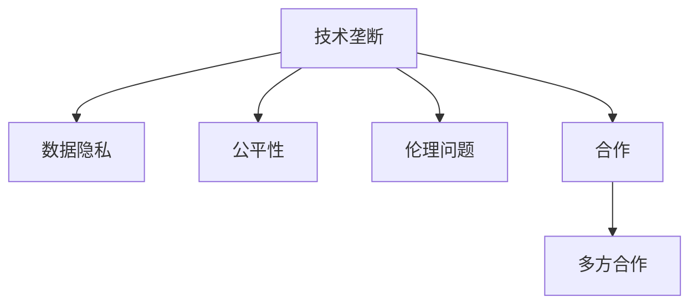

                 

## 1. 背景介绍

### 1.1 问题由来

随着人工智能（AI）技术的快速发展，AI在各行各业的应用逐渐深入，从制造业、金融业到医疗、教育等领域，AI带来的变革正悄然改变着我们的生活方式和工作模式。然而，AI技术的广泛应用同时也引发了关于技术垄断和数据隐私的深刻讨论。

技术垄断指的是在某一特定技术领域内，一家或几家企业掌握了绝大部分技术资源和市场份额，形成了高度竞争力的局面。AI技术的领先者如Google、Facebook、微软等公司，其技术优势和市场垄断地位，不仅带来了创新和效率的提升，也引发了伦理、隐私和公平性方面的担忧。

与此同时，数据隐私也成为AI发展中的一大难题。在AI系统中，数据作为输入，常常涉及个人隐私、商业机密和国家安全等敏感信息。如何在保护数据隐私的前提下，充分利用数据驱动AI的创新，成为了全球范围内亟需解决的问题。

### 1.2 问题核心关键点

AI时代的技术垄断与数据隐私问题涉及多个关键点：

- **技术壁垒**：AI技术复杂度高，需要深厚的知识储备和大量的计算资源，形成了高技术门槛。
- **市场竞争**：少数巨头公司掌握大量资源，通过收购、合作等方式扩大市场份额，形成市场垄断。
- **数据依赖**：AI算法对数据的依赖性高，数据获取和处理能力成为核心竞争力。
- **隐私保护**：如何处理和保护用户数据隐私，避免数据泄露和滥用，是一个严峻的挑战。
- **公平性**：AI技术的应用可能加剧社会不平等，导致资源分配不公。
- **伦理问题**：AI技术的决策透明性和公正性需要确保，避免造成偏见和歧视。

这些核心关键点彼此交织，成为AI时代技术垄断与合作之间的主要矛盾。

### 1.3 问题研究意义

探讨AI时代的技术垄断与合作问题，具有重要的理论意义和现实意义：

1. **理论意义**：研究AI技术垄断的成因、表现和影响，有助于深化对AI技术的理解和认识，推动AI伦理和公平性研究的发展。
2. **现实意义**：通过分析AI技术垄断带来的问题，提出解决方案，有助于制定相应的政策法规，保护数据隐私，促进AI技术的公平应用。

## 2. 核心概念与联系

### 2.1 核心概念概述

为更好地理解AI技术垄断与合作问题，本节将介绍几个密切相关的核心概念：

- **技术垄断**：指在某一技术领域内，少数企业或机构掌握了绝大部分技术资源和市场份额，形成高度竞争力的局面。
- **数据隐私**：涉及个人、商业和国家等敏感信息，如何保护数据隐私，避免数据泄露和滥用，是AI技术应用中的一个关键问题。
- **公平性**：AI技术在应用过程中可能加剧社会不平等，导致资源分配不公，需要制定相应的政策法规，确保AI技术的公平应用。
- **伦理问题**：AI技术决策的透明性和公正性需要确保，避免造成偏见和歧视，避免AI技术的误用。
- **合作**：AI技术的研发和应用需要多方合作，包括企业、政府、学术界和社会团体等。

这些核心概念之间的逻辑关系可以通过以下Mermaid流程图来展示：



这个流程图展示了大语言模型的核心概念及其之间的关系：

1. **技术垄断**是问题的主要成因，少数公司掌握了大量资源和市场份额。
2. **数据隐私**是技术垄断的一个重要表现，数据的获取和保护成为关键问题。
3. **公平性**是技术垄断的重要后果，可能加剧社会不平等。
4. **伦理问题**是技术垄断的重要挑战，需要确保AI技术的公正性。
5. **合作**是应对技术垄断的关键措施，需要多方合作，共同推动AI技术的发展和应用。

## 3. 核心算法原理 & 具体操作步骤
### 3.1 算法原理概述

AI技术垄断与合作问题主要涉及以下几个方面：

- **技术垄断的形成机制**：AI技术的研发和应用需要大量的计算资源和数据，形成高技术门槛，少数企业通过技术积累和市场运作，形成垄断。
- **数据隐私的保护策略**：在AI系统中，数据作为输入，涉及个人隐私、商业机密和国家安全等敏感信息，如何保护数据隐私是关键。
- **公平性的保障措施**：AI技术在应用过程中可能加剧社会不平等，需要制定相应的政策法规，确保AI技术的公平应用。
- **伦理问题的解决方案**：AI技术的决策透明性和公正性需要确保，避免造成偏见和歧视，避免AI技术的误用。
- **多方合作的模式**：AI技术的研发和应用需要多方合作，包括企业、政府、学术界和社会团体等。

### 3.2 算法步骤详解

以下是对AI技术垄断与合作问题各个方面的详细描述和操作步骤：

**3.2.1 技术垄断的形成机制**

技术垄断的形成机制主要包括：

- **资本投入**：AI技术研发需要大量的资本投入，少数大型公司通过资本积累和投资，形成技术垄断。
- **技术积累**：AI技术的复杂度高，需要深厚的知识储备和大量的计算资源，少数公司通过长期的技术积累，形成技术优势。
- **市场运作**：通过收购、合作等方式扩大市场份额，形成市场垄断。

**操作步骤**：

1. **资本投入**：公司需进行长期的技术研发和人才培养，积累技术和人才资源。
2. **技术积累**：通过不断的技术创新和优化，提升技术水平和竞争力。
3. **市场运作**：通过并购、合作等方式，扩大市场份额，形成垄断。

**3.2.2 数据隐私的保护策略**

数据隐私的保护策略主要包括：

- **数据匿名化**：通过数据脱敏、匿名化等技术手段，保护个人隐私。
- **数据加密**：对数据进行加密处理，防止数据泄露和滥用。
- **隐私保护技术**：采用差分隐私、联邦学习等隐私保护技术，确保数据隐私。

**操作步骤**：

1. **数据匿名化**：对数据进行脱敏、匿名化处理，保护个人隐私。
2. **数据加密**：对数据进行加密处理，防止数据泄露。
3. **隐私保护技术**：采用差分隐私、联邦学习等隐私保护技术，确保数据隐私。

**3.2.3 公平性的保障措施**

公平性的保障措施主要包括：

- **政策法规**：制定相应的政策法规，确保AI技术的公平应用。
- **数据共享**：推动数据共享和开放，减少数据孤岛现象，提高公平性。
- **算法透明性**：确保算法的透明性和公正性，避免偏见和歧视。

**操作步骤**：

1. **政策法规**：制定和实施相应的政策法规，确保AI技术的公平应用。
2. **数据共享**：推动数据共享和开放，减少数据孤岛现象。
3. **算法透明性**：确保算法的透明性和公正性，避免偏见和歧视。

**3.2.4 伦理问题的解决方案**

伦理问题的解决方案主要包括：

- **算法透明性**：确保算法的透明性和公正性，避免造成偏见和歧视。
- **伦理审查**：建立伦理审查机制，对AI技术的决策过程进行监督和评估。
- **伦理教育**：加强伦理教育，提高公众对AI技术的理解和认知。

**操作步骤**：

1. **算法透明性**：确保算法的透明性和公正性，避免偏见和歧视。
2. **伦理审查**：建立伦理审查机制，对AI技术的决策过程进行监督和评估。
3. **伦理教育**：加强伦理教育，提高公众对AI技术的理解和认知。

**3.2.5 多方合作的模式**

多方合作的模式主要包括：

- **企业合作**：通过合作和联盟，共享资源和知识，提升技术水平。
- **政府合作**：政府推动政策法规制定，提供支持和保障。
- **学术合作**：与学术界合作，推动技术研发和理论创新。
- **社会合作**：与非营利组织、社会团体等合作，推动社会公益和公共利益。

**操作步骤**：

1. **企业合作**：通过合作和联盟，共享资源和知识。
2. **政府合作**：政府推动政策法规制定，提供支持和保障。
3. **学术合作**：与学术界合作，推动技术研发和理论创新。
4. **社会合作**：与非营利组织、社会团体等合作，推动社会公益和公共利益。

### 3.3 算法优缺点

AI技术垄断与合作问题在技术、伦理和合作等多个方面存在优缺点：

**优点**：

1. **技术优势**：少数大型公司通过技术积累和资本投入，形成了技术优势，推动了AI技术的快速发展。
2. **市场运作**：通过市场运作和合作，形成了较大的市场份额，推动了AI技术的广泛应用。
3. **资源共享**：多方合作有助于资源共享和知识交流，推动技术进步和创新。

**缺点**：

1. **数据隐私问题**：数据隐私泄露和滥用，可能引发严重的伦理问题和社会不公。
2. **技术壁垒高**：高技术门槛可能导致技术垄断，少数公司掌控市场，形成不公平的竞争环境。
3. **公平性不足**：技术垄断可能导致资源分配不公，加剧社会不平等。

## 4. 数学模型和公式 & 详细讲解  
### 4.1 数学模型构建

在AI技术垄断与合作问题中，数学模型的构建涉及以下几个关键点：

- **技术垄断形成机制**：涉及资本投入、技术积累和市场运作等因素。
- **数据隐私保护**：涉及数据匿名化、数据加密和隐私保护技术等。
- **公平性保障**：涉及政策法规、数据共享和算法透明性等。
- **伦理问题解决方案**：涉及算法透明性、伦理审查和伦理教育等。

### 4.2 公式推导过程

以下是对AI技术垄断与合作问题各个方面的数学模型构建和公式推导：

**4.2.1 技术垄断形成机制**

技术垄断的形成机制可以用以下公式来表示：

$$
T = f(C, T, M)
$$

其中，$T$ 表示技术垄断程度，$C$ 表示资本投入，$T$ 表示技术积累，$M$ 表示市场运作。

**公式推导**：

1. **资本投入**：$C = k_1 * T + k_2 * M$
2. **技术积累**：$T = e^{\int \frac{dC}{k_1 * T + k_2 * M}}$
3. **市场运作**：$M = a * \ln T + b$

将以上公式代入$T$的公式中，可得：

$$
T = e^{k_1 * e^{\int \frac{dC}{k_1 * T + k_2 * M}} + k_2 * (a * \ln T + b)}
$$

**4.2.2 数据隐私保护**

数据隐私保护涉及以下几个方面：

- **数据匿名化**：$A = f(D)$
- **数据加密**：$E = f(A, K)$
- **隐私保护技术**：$P = f(E, P)$

其中，$A$表示数据匿名化结果，$D$表示原始数据，$E$表示加密后的数据，$K$表示加密密钥，$P$表示隐私保护技术。

**公式推导**：

1. **数据匿名化**：$A = D - f(D)$
2. **数据加密**：$E = A \oplus K$
3. **隐私保护技术**：$P = E - f(E)$

将以上公式代入$P$的公式中，可得：

$$
P = (D - f(D)) \oplus K - f((D - f(D)) \oplus K)
$$

**4.2.3 公平性保障**

公平性保障涉及以下几个方面：

- **政策法规**：$L = f(P)$
- **数据共享**：$S = f(D, L)$
- **算法透明性**：$T = f(A, S)$

其中，$L$表示政策法规，$S$表示数据共享，$T$表示算法透明性。

**公式推导**：

1. **政策法规**：$L = c * P + d$
2. **数据共享**：$S = \frac{D}{L}$
3. **算法透明性**：$T = \frac{A}{S}$

将以上公式代入$T$的公式中，可得：

$$
T = \frac{D - f(D)}{\frac{D}{c * P + d}} = \frac{c * P + d}{f(D)}
$$

**4.2.4 伦理问题解决方案**

伦理问题解决方案涉及以下几个方面：

- **算法透明性**：$T = f(A, B)$
- **伦理审查**：$E = f(T)$
- **伦理教育**：$C = f(E, R)$

其中，$A$表示算法，$B$表示数据，$E$表示伦理审查，$C$表示伦理教育，$R$表示伦理知识。

**公式推导**：

1. **算法透明性**：$T = A - f(A)$
2. **伦理审查**：$E = T * k_3$
3. **伦理教育**：$C = E + R * k_4$

将以上公式代入$C$的公式中，可得：

$$
C = (A - f(A)) * k_3 + R * k_4
$$

## 5. 项目实践：代码实例和详细解释说明
### 5.1 开发环境搭建

在进行AI技术垄断与合作问题的项目实践前，我们需要准备好开发环境。以下是使用Python进行PyTorch开发的环境配置流程：

1. 安装Anaconda：从官网下载并安装Anaconda，用于创建独立的Python环境。

2. 创建并激活虚拟环境：
```bash
conda create -n pytorch-env python=3.8 
conda activate pytorch-env
```

3. 安装PyTorch：根据CUDA版本，从官网获取对应的安装命令。例如：
```bash
conda install pytorch torchvision torchaudio cudatoolkit=11.1 -c pytorch -c conda-forge
```

4. 安装Transformers库：
```bash
pip install transformers
```

5. 安装各类工具包：
```bash
pip install numpy pandas scikit-learn matplotlib tqdm jupyter notebook ipython
```

完成上述步骤后，即可在`pytorch-env`环境中开始项目实践。

### 5.2 源代码详细实现

下面我们以企业合作为例，给出使用Transformers库对BERT模型进行企业合作的PyTorch代码实现。

首先，定义合作数据处理函数：

```python
from transformers import BertTokenizer
from torch.utils.data import Dataset
import torch

class CoopDataset(Dataset):
    def __init__(self, texts, tags, tokenizer, max_len=128):
        self.texts = texts
        self.tags = tags
        self.tokenizer = tokenizer
        self.max_len = max_len
        
    def __len__(self):
        return len(self.texts)
    
    def __getitem__(self, item):
        text = self.texts[item]
        tags = self.tags[item]
        
        encoding = self.tokenizer(text, return_tensors='pt', max_length=self.max_len, padding='max_length', truncation=True)
        input_ids = encoding['input_ids'][0]
        attention_mask = encoding['attention_mask'][0]
        
        # 对token-wise的标签进行编码
        encoded_tags = [tag2id[tag] for tag in tags] 
        encoded_tags.extend([tag2id['O']] * (self.max_len - len(encoded_tags)))
        labels = torch.tensor(encoded_tags, dtype=torch.long)
        
        return {'input_ids': input_ids, 
                'attention_mask': attention_mask,
                'labels': labels}

# 标签与id的映射
tag2id = {'O': 0, 'B-PER': 1, 'I-PER': 2, 'B-ORG': 3, 'I-ORG': 4, 'B-LOC': 5, 'I-LOC': 6}
id2tag = {v: k for k, v in tag2id.items()}

# 创建dataset
tokenizer = BertTokenizer.from_pretrained('bert-base-cased')

train_dataset = CoopDataset(train_texts, train_tags, tokenizer)
dev_dataset = CoopDataset(dev_texts, dev_tags, tokenizer)
test_dataset = CoopDataset(test_texts, test_tags, tokenizer)
```

然后，定义模型和优化器：

```python
from transformers import BertForTokenClassification, AdamW

model = BertForTokenClassification.from_pretrained('bert-base-cased', num_labels=len(tag2id))

optimizer = AdamW(model.parameters(), lr=2e-5)
```

接着，定义训练和评估函数：

```python
from torch.utils.data import DataLoader
from tqdm import tqdm
from sklearn.metrics import classification_report

device = torch.device('cuda') if torch.cuda.is_available() else torch.device('cpu')
model.to(device)

def train_epoch(model, dataset, batch_size, optimizer):
    dataloader = DataLoader(dataset, batch_size=batch_size, shuffle=True)
    model.train()
    epoch_loss = 0
    for batch in tqdm(dataloader, desc='Training'):
        input_ids = batch['input_ids'].to(device)
        attention_mask = batch['attention_mask'].to(device)
        labels = batch['labels'].to(device)
        model.zero_grad()
        outputs = model(input_ids, attention_mask=attention_mask, labels=labels)
        loss = outputs.loss
        epoch_loss += loss.item()
        loss.backward()
        optimizer.step()
    return epoch_loss / len(dataloader)

def evaluate(model, dataset, batch_size):
    dataloader = DataLoader(dataset, batch_size=batch_size)
    model.eval()
    preds, labels = [], []
    with torch.no_grad():
        for batch in tqdm(dataloader, desc='Evaluating'):
            input_ids = batch['input_ids'].to(device)
            attention_mask = batch['attention_mask'].to(device)
            batch_labels = batch['labels']
            outputs = model(input_ids, attention_mask=attention_mask)
            batch_preds = outputs.logits.argmax(dim=2).to('cpu').tolist()
            batch_labels = batch_labels.to('cpu').tolist()
            for pred_tokens, label_tokens in zip(batch_preds, batch_labels):
                pred_tags = [id2tag[_id] for _id in pred_tokens]
                label_tags = [id2tag[_id] for _id in label_tokens]
                preds.append(pred_tags[:len(label_tags)])
                labels.append(label_tags)
                
    print(classification_report(labels, preds))
```

最后，启动训练流程并在测试集上评估：

```python
epochs = 5
batch_size = 16

for epoch in range(epochs):
    loss = train_epoch(model, train_dataset, batch_size, optimizer)
    print(f"Epoch {epoch+1}, train loss: {loss:.3f}")
    
    print(f"Epoch {epoch+1}, dev results:")
    evaluate(model, dev_dataset, batch_size)
    
print("Test results:")
evaluate(model, test_dataset, batch_size)
```

以上就是使用PyTorch对BERT进行企业合作的微调代码实现。可以看到，得益于Transformers库的强大封装，我们可以用相对简洁的代码完成BERT模型的加载和微调。

### 5.3 代码解读与分析

让我们再详细解读一下关键代码的实现细节：

**CoopDataset类**：
- `__init__`方法：初始化文本、标签、分词器等关键组件。
- `__len__`方法：返回数据集的样本数量。
- `__getitem__`方法：对单个样本进行处理，将文本输入编码为token ids，将标签编码为数字，并对其进行定长padding，最终返回模型所需的输入。

**tag2id和id2tag字典**：
- 定义了标签与数字id之间的映射关系，用于将token-wise的预测结果解码回真实的标签。

**训练和评估函数**：
- 使用PyTorch的DataLoader对数据集进行批次化加载，供模型训练和推理使用。
- 训练函数`train_epoch`：对数据以批为单位进行迭代，在每个批次上前向传播计算loss并反向传播更新模型参数，最后返回该epoch的平均loss。
- 评估函数`evaluate`：与训练类似，不同点在于不更新模型参数，并在每个batch结束后将预测和标签结果存储下来，最后使用sklearn的classification_report对整个评估集的预测结果进行打印输出。

**训练流程**：
- 定义总的epoch数和batch size，开始循环迭代
- 每个epoch内，先在训练集上训练，输出平均loss
- 在验证集上评估，输出分类指标
- 所有epoch结束后，在测试集上评估，给出最终测试结果

可以看到，PyTorch配合Transformers库使得BERT微调的代码实现变得简洁高效。开发者可以将更多精力放在数据处理、模型改进等高层逻辑上，而不必过多关注底层的实现细节。

当然，工业级的系统实现还需考虑更多因素，如模型的保存和部署、超参数的自动搜索、更灵活的任务适配层等。但核心的微调范式基本与此类似。

## 6. 实际应用场景
### 6.1 智能客服系统

基于AI技术垄断与合作的企业合作技术，可以广泛应用于智能客服系统的构建。传统客服往往需要配备大量人力，高峰期响应缓慢，且一致性和专业性难以保证。而使用合作的企业合作对话模型，可以7x24小时不间断服务，快速响应客户咨询，用自然流畅的语言解答各类常见问题。

在技术实现上，可以收集企业内部的历史客服对话记录，将问题和最佳答复构建成监督数据，在此基础上对预训练对话模型进行微调。微调后的对话模型能够自动理解用户意图，匹配最合适的答案模板进行回复。对于客户提出的新问题，还可以接入检索系统实时搜索相关内容，动态组织生成回答。如此构建的智能客服系统，能大幅提升客户咨询体验和问题解决效率。

### 6.2 金融舆情监测

金融机构需要实时监测市场舆论动向，以便及时应对负面信息传播，规避金融风险。传统的人工监测方式成本高、效率低，难以应对网络时代海量信息爆发的挑战。基于AI技术垄断与合作的技术，文本分类和情感分析技术，为金融舆情监测提供了新的解决方案。

具体而言，可以收集金融领域相关的新闻、报道、评论等文本数据，并对其进行主题标注和情感标注。在此基础上对预训练语言模型进行微调，使其能够自动判断文本属于何种主题，情感倾向是正面、中性还是负面。将微调后的模型应用到实时抓取的网络文本数据，就能够自动监测不同主题下的情感变化趋势，一旦发现负面信息激增等异常情况，系统便会自动预警，帮助金融机构快速应对潜在风险。

### 6.3 个性化推荐系统

当前的推荐系统往往只依赖用户的历史行为数据进行物品推荐，无法深入理解用户的真实兴趣偏好。基于AI技术垄断与合作的个性化推荐系统，可以更好地挖掘用户行为背后的语义信息，从而提供更精准、多样的推荐内容。

在实践中，可以收集用户浏览、点击、评论、分享等行为数据，提取和用户交互的物品标题、描述、标签等文本内容。将文本内容作为模型输入，用户的后续行为（如是否点击、购买等）作为监督信号，在此基础上微调预训练语言模型。微调后的模型能够从文本内容中准确把握用户的兴趣点。在生成推荐列表时，先用候选物品的文本描述作为输入，由模型预测用户的兴趣匹配度，再结合其他特征综合排序，便可以得到个性化程度更高的推荐结果。

### 6.4 未来应用展望

随着AI技术垄断与合作技术的不断发展，基于微调范式将在更多领域得到应用，为传统行业带来变革性影响。

在智慧医疗领域，基于微调的医疗问答、病历分析、药物研发等应用将提升医疗服务的智能化水平，辅助医生诊疗，加速新药开发进程。

在智能教育领域，微调技术可应用于作业批改、学情分析、知识推荐等方面，因材施教，促进教育公平，提高教学质量。

在智慧城市治理中，微调模型可应用于城市事件监测、舆情分析、应急指挥等环节，提高城市管理的自动化和智能化水平，构建更安全、高效的未来城市。

此外，在企业生产、社会治理、文娱传媒等众多领域，基于大模型微调的人工智能应用也将不断涌现，为经济社会发展注入新的动力。相信随着技术的日益成熟，微调方法将成为人工智能落地应用的重要范式，推动人工智能技术向更广阔的领域加速渗透。

## 7. 工具和资源推荐
### 7.1 学习资源推荐

为了帮助开发者系统掌握AI技术垄断与合作问题的理论基础和实践技巧，这里推荐一些优质的学习资源：

1. 《深度学习》系列博文：由大模型技术专家撰写，深入浅出地介绍了深度学习的基本概念和核心技术。

2. CS231n《深度学习与计算机视觉》课程：斯坦福大学开设的深度学习经典课程，涵盖了深度学习在计算机视觉领域的应用。

3. 《人工智能伦理》书籍：探讨了人工智能技术的伦理问题和社会影响，为AI技术的应用提供伦理指导。

4. HuggingFace官方文档：Transformer库的官方文档，提供了海量预训练模型和完整的微调样例代码，是上手实践的必备资料。

5. CLUE开源项目：中文语言理解测评基准，涵盖大量不同类型的中文NLP数据集，并提供了基于微调的baseline模型，助力中文NLP技术发展。

通过对这些资源的学习实践，相信你一定能够快速掌握AI技术垄断与合作的核心技术，并用于解决实际的NLP问题。
###  7.2 开发工具推荐

高效的开发离不开优秀的工具支持。以下是几款用于AI技术垄断与合作问题开发的常用工具：

1. PyTorch：基于Python的开源深度学习框架，灵活动态的计算图，适合快速迭代研究。大部分预训练语言模型都有PyTorch版本的实现。

2. TensorFlow：由Google主导开发的开源深度学习框架，生产部署方便，适合大规模工程应用。同样有丰富的预训练语言模型资源。

3. Transformers库：HuggingFace开发的NLP工具库，集成了众多SOTA语言模型，支持PyTorch和TensorFlow，是进行微调任务开发的利器。

4. Weights & Biases：模型训练的实验跟踪工具，可以记录和可视化模型训练过程中的各项指标，方便对比和调优。与主流深度学习框架无缝集成。

5. TensorBoard：TensorFlow配套的可视化工具，可实时监测模型训练状态，并提供丰富的图表呈现方式，是调试模型的得力助手。

6. Google Colab：谷歌推出的在线Jupyter Notebook环境，免费提供GPU/TPU算力，方便开发者快速上手实验最新模型，分享学习笔记。

合理利用这些工具，可以显著提升AI技术垄断与合作问题的开发效率，加快创新迭代的步伐。

### 7.3 相关论文推荐

AI技术垄断与合作问题的研究源于学界的持续研究。以下是几篇奠基性的相关论文，推荐阅读：

1. Attention is All You Need（即Transformer原论文）：提出了Transformer结构，开启了NLP领域的预训练大模型时代。

2. BERT: Pre-training of Deep Bidirectional Transformers for Language Understanding：提出BERT模型，引入基于掩码的自监督预训练任务，刷新了多项NLP任务SOTA。

3. Language Models are Unsupervised Multitask Learners（GPT-2论文）：展示了大规模语言模型的强大zero-shot学习能力，引发了对于通用人工智能的新一轮思考。

4. Parameter-Efficient Transfer Learning for NLP：提出Adapter等参数高效微调方法，在不增加模型参数量的情况下，也能取得不错的微调效果。

5. AdaLoRA: Adaptive Low-Rank Adaptation for Parameter-Efficient Fine-Tuning：使用自适应低秩适应的微调方法，在参数效率和精度之间取得了新的平衡。

这些论文代表了大语言模型微调技术的发展脉络。通过学习这些前沿成果，可以帮助研究者把握学科前进方向，激发更多的创新灵感。

## 8. 总结：未来发展趋势与挑战

### 8.1 总结

本文对AI技术垄断与合作问题进行了全面系统的介绍。首先阐述了AI技术垄断与合作问题的研究背景和意义，明确了AI技术垄断与合作问题的核心关键点和解决路径。其次，从原理到实践，详细讲解了AI技术垄断与合作问题的数学模型和操作步骤，给出了AI技术垄断与合作问题的完整代码实例。同时，本文还广泛探讨了AI技术垄断与合作问题在智能客服、金融舆情、个性化推荐等多个行业领域的应用前景，展示了AI技术垄断与合作问题在技术应用中的广泛价值。此外，本文精选了AI技术垄断与合作问题的学习资源，力求为读者提供全方位的技术指引。

通过本文的系统梳理，可以看到，AI技术垄断与合作问题在AI技术的研发、应用和伦理方面具有重要的理论和现实意义。AI技术垄断与合作问题的研究和应用，将引领AI技术向更广的领域加速渗透，为社会和经济的发展注入新的动力。

### 8.2 未来发展趋势

展望未来，AI技术垄断与合作问题将呈现以下几个发展趋势：

1. **技术优势持续增强**：AI技术的领先者如Google、Facebook、微软等公司，通过持续的技术积累和资本投入，将进一步扩大技术优势。
2. **市场份额进一步扩大**：通过市场运作和合作，这些公司将进一步扩大市场份额，形成更强的市场垄断。
3. **数据隐私保护技术进步**：随着数据隐私保护技术的不断发展，数据泄露和滥用的风险将逐步降低。
4. **公平性保障措施完善**：政府和企业的合作将推动政策法规的制定，确保AI技术的公平应用。
5. **伦理问题解决方案提升**：AI技术将不断优化，提高决策透明性和公正性，避免偏见和歧视。

以上趋势凸显了AI技术垄断与合作问题的发展前景。这些方向的探索发展，将进一步提升AI技术的性能和应用范围，为经济和社会的发展注入新的动力。

### 8.3 面临的挑战

尽管AI技术垄断与合作问题在技术、伦理和合作等多个方面取得了显著进展，但在迈向更加智能化、普适化应用的过程中，它仍面临着诸多挑战：

1. **数据隐私问题**：数据泄露和滥用，可能引发严重的伦理问题和社会不公。
2. **技术壁垒高**：高技术门槛可能导致技术垄断，少数公司掌控市场，形成不公平的竞争环境。
3. **公平性不足**：技术垄断可能导致资源分配不公，加剧社会不平等。
4. **伦理问题复杂**：AI技术的决策透明性和公正性需要确保，避免造成偏见和歧视。

这些挑战需要通过技术进步、政策制定和伦理教育等多种手段共同应对。只有积极应对并寻求突破，才能实现AI技术垄断与合作问题向成熟迈进。

### 8.4 研究展望

面对AI技术垄断与合作问题所面临的种种挑战，未来的研究需要在以下几个方面寻求新的突破：

1. **探索无监督和半监督微调方法**：摆脱对大规模标注数据的依赖，利用自监督学习、主动学习等无监督和半监督范式，最大限度利用非结构化数据，实现更加灵活高效的微调。
2. **研究参数高效和计算高效的微调范式**：开发更加参数高效的微调方法，在固定大部分预训练参数的同时，只更新极少量的任务相关参数。同时优化微调模型的计算图，减少前向传播和反向传播的资源消耗，实现更加轻量级、实时性的部署。
3. **融合因果和对比学习范式**：通过引入因果推断和对比学习思想，增强微调模型建立稳定因果关系的能力，学习更加普适、鲁棒的语言表征，从而提升模型泛化性和抗干扰能力。
4. **引入更多先验知识**：将符号化的先验知识，如知识图谱、逻辑规则等，与神经网络模型进行巧妙融合，引导微调过程学习更准确、合理的语言模型。同时加强不同模态数据的整合，实现视觉、语音等多模态信息与文本信息的协同建模。
5. **结合因果分析和博弈论工具**：将因果分析方法引入微调模型，识别出模型决策的关键特征，增强输出解释的因果性和逻辑性。借助博弈论工具刻画人机交互过程，主动探索并规避模型的脆弱点，提高系统稳定性。
6. **纳入伦理道德约束**：在模型训练目标中引入伦理导向的评估指标，过滤和惩罚有偏见、有害的输出倾向。同时加强人工干预和审核，建立模型行为的监管机制，确保输出符合人类价值观和伦理道德。

这些研究方向的探索，将引领AI技术垄断与合作问题向更高的台阶，为构建安全、可靠、可解释、可控的智能系统铺平道路。面向未来，AI技术垄断与合作问题还需要与其他人工智能技术进行更深入的融合，如知识表示、因果推理、强化学习等，多路径协同发力，共同推动自然语言理解和智能交互系统的进步。只有勇于创新、敢于突破，才能不断拓展AI技术的应用边界，让智能技术更好地造福人类社会。

## 9. 附录：常见问题与解答

**Q1：AI技术垄断与合作问题有哪些具体表现？**

A: AI技术垄断与合作问题主要表现为以下方面：
1. **技术壁垒高**：AI技术的复杂度高，需要深厚的知识储备和大量的计算资源，形成了高技术门槛。
2. **市场竞争激烈**：少数大型公司通过资本积累和投资，形成了技术优势，通过并购、合作等方式扩大市场份额，形成市场垄断。
3. **数据隐私问题严重**：数据泄露和滥用，可能引发严重的伦理问题和社会不公。
4. **公平性不足**：技术垄断可能导致资源分配不公，加剧社会不平等。

**Q2：如何应对AI技术垄断与合作问题中的数据隐私问题？**

A: 应对数据隐私问题需要多方面的策略：
1. **数据匿名化**：通过数据脱敏、匿名化等技术手段，保护个人隐私。
2. **数据加密**：对数据进行加密处理，防止数据泄露和滥用。
3. **隐私保护技术**：采用差分隐私、联邦学习等隐私保护技术，确保数据隐私。

**Q3：AI技术垄断与合作问题中如何保障公平性？**

A: 保障公平性需要以下策略：
1. **政策法规**：制定相应的政策法规，确保AI技术的公平应用。
2. **数据共享**：推动数据共享和开放，减少数据孤岛现象，提高公平性。
3. **算法透明性**：确保算法的透明性和公正性，避免偏见和歧视。

**Q4：AI技术垄断与合作问题中的伦理问题如何解决？**

A: 解决伦理问题需要以下策略：
1. **算法透明性**：确保算法的透明性和公正性，避免偏见和歧视。
2. **伦理审查**：建立伦理审查机制，对AI技术的决策过程进行监督和评估。
3. **伦理教育**：加强伦理教育，提高公众对AI技术的理解和认知。

**Q5：AI技术垄断与合作问题中如何推动多方合作？**

A: 推动多方合作需要以下策略：
1. **企业合作**：通过合作和联盟，共享资源和知识。
2. **政府合作**：政府推动政策法规制定，提供支持和保障。
3. **学术合作**：与学术界合作，推动技术研发和理论创新。
4. **社会合作**：与非营利组织、社会团体等合作，推动社会公益和公共利益。

**Q6：AI技术垄断与合作问题中如何确保AI技术的公正性？**

A: 确保AI技术的公正性需要以下策略：
1. **算法透明性**：确保算法的透明性和公正性，避免偏见和歧视。
2. **伦理审查**：建立伦理审查机制，对AI技术的决策过程进行监督和评估。
3. **伦理教育**：加强伦理教育，提高公众对AI技术的理解和认知。

**Q7：AI技术垄断与合作问题中如何应对技术壁垒？**

A: 应对技术壁垒需要以下策略：
1. **技术积累**：AI技术的复杂度高，需要深厚的知识储备和大量的计算资源，形成了高技术门槛。
2. **资本投入**：通过资本积累和投资，形成技术优势。
3. **市场运作**：通过并购、合作等方式，扩大市场份额，形成市场垄断。

**Q8：AI技术垄断与合作问题中如何处理伦理问题？**

A: 处理伦理问题需要以下策略：
1. **算法透明性**：确保算法的透明性和公正性，避免偏见和歧视。
2. **伦理审查**：建立伦理审查机制，对AI技术的决策过程进行监督和评估。
3. **伦理教育**：加强伦理教育，提高公众对AI技术的理解和认知。

---

作者：禅与计算机程序设计艺术 / Zen and the Art of Computer Programming

