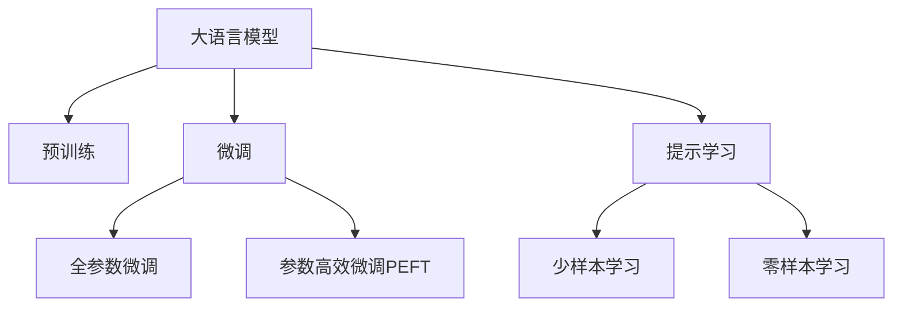

                 

# 提示学习：基础模型的新特性

## 1. 背景介绍

### 1.1 问题由来

近年来，大语言模型（Large Language Models, LLMs）如GPT-3、BERT等在自然语言处理（NLP）领域取得了显著突破。这些模型在大量无标签文本数据上进行预训练，能够学习到丰富的语言知识和表示能力，但在特定任务上的性能仍有提升空间。

提示学习（Prompt Learning）是一种新兴的微调范式，通过精心设计提示模板（Prompt Template），引导预训练模型按照期望的方式进行推理和生成，从而在不增加或仅增加少量模型参数的情况下，提升模型性能。提示学习的核心在于如何设计合适的提示模板，以最大化地利用预训练模型的能力。

### 1.2 问题核心关键点

提示学习的核心在于如何设计合适的提示模板，以最大化地利用预训练模型的能力。提示模板的设计通常涉及以下几个关键点：

- 提示模板的粒度：模板应该足够精细，能够捕捉到问题的关键信息，但不宜过于冗长，以免引入噪音。
- 提示模板的灵活性：模板应该具有一定的灵活性，能够适应不同的任务类型和输入形式。
- 提示模板的上下文相关性：模板应该考虑上下文信息，尽可能保留输入文本的原始信息。
- 提示模板的性能评估：如何量化提示模板的效果，以便进行优化选择。

提示学习在学术界和工业界已经得到了广泛应用，例如在问答系统、对话生成、文本摘要、机器翻译等任务上，取得了不错的效果。未来，提示学习有望进一步拓展到更多领域，为自然语言处理技术的发展注入新的活力。

### 1.3 问题研究意义

提示学习具有以下重要研究意义：

- 提升模型性能：通过设计合适的提示模板，可以显著提升模型在特定任务上的表现，尤其是在数据量较少的情况下。
- 降低微调成本：提示学习不需要修改模型架构，只需在输入中增加少量参数，减少了微调所需的计算资源和时间。
- 提高模型泛化能力：提示学习有助于模型学习到通用的语言表示，从而增强其在不同领域和任务上的泛化能力。
- 增强可解释性：提示学习能够提供直观的推理过程，有助于理解模型决策的逻辑。

提示学习的出现，为自然语言处理技术的发展提供了新的方向，尤其在数据资源有限的情况下，具有广泛的应用前景。

## 2. 核心概念与联系

### 2.1 核心概念概述

为更好地理解提示学习的原理和应用，本节将介绍几个密切相关的核心概念：

- 提示模板（Prompt Template）：用于引导预训练模型进行推理和生成的文本字符串。
- 参数高效微调（Parameter-Efficient Fine-Tuning, PEFT）：仅更新少量模型参数，固定大部分预训练权重不变，以提高微调效率的方法。
- 零样本学习（Zero-shot Learning）：模型在没有见过任何特定任务的训练样本的情况下，仅凭任务描述就能够执行新任务。
- 少样本学习（Few-shot Learning）：模型在只有少量标注样本的情况下，快速适应新任务。

这些概念之间的逻辑关系可以通过以下Mermaid流程图来展示：



这个流程图展示了大语言模型的核心概念及其之间的关系：

1. 大语言模型通过预训练获得基础能力。
2. 微调是对预训练模型进行任务特定的优化，可以分为全参数微调和参数高效微调（PEFT）。
3. 提示学习是一种不更新模型参数的方法，可以实现零样本或少样本学习。
4. 参数高效微调和提示学习都是提升大语言模型微调效率和效果的重要手段。

## 3. 核心算法原理 & 具体操作步骤

### 3.1 算法原理概述

提示学习基于预训练模型，通过在输入中增加提示模板，引导模型进行推理和生成。其核心思想是利用预训练模型的语言理解能力，在有限的标注数据上，通过优化提示模板，最大化地利用模型学到的知识。

提示学习的目标是通过设计合适的提示模板，使得模型在特定任务上的表现接近或优于全参数微调的结果，但同时尽可能减少参数更新量。提示学习中的提示模板，可以简单地理解为“任务描述”，通过合理的文本组织，引导模型执行特定的推理和生成任务。

### 3.2 算法步骤详解

提示学习的关键步骤包括：

**Step 1: 准备预训练模型和数据集**
- 选择合适的预训练语言模型 $M_{\theta}$ 作为初始化参数，如 BERT、GPT 等。
- 准备下游任务 $T$ 的标注数据集 $D$，划分为训练集、验证集和测试集。

**Step 2: 设计提示模板**
- 根据任务类型，设计合适的提示模板 $P$。提示模板通常包括任务类型、输入格式、任务目标等信息。
- 使用已标注的数据，对提示模板进行初步筛选，评估其效果。

**Step 3: 微调提示模板**
- 将提示模板作为模型输入，执行微调过程。
- 调整学习率、批大小等超参数，优化提示模板。
- 周期性在验证集上评估提示模板的效果。

**Step 4: 使用提示模板**
- 在测试集上评估提示模板的性能，对比全参数微调和参数高效微调的效果。
- 使用优化后的提示模板对新样本进行推理预测。

### 3.3 算法优缺点

提示学习的优点包括：

1. 简单高效：不需要修改模型架构，只需设计合适的提示模板，减少微调所需的计算资源和时间。
2. 泛化能力强：提示学习能够利用预训练模型的通用语言表示，提升模型在特定任务上的泛化能力。
3. 可解释性强：提示学习提供直观的推理过程，有助于理解模型决策的逻辑。
4. 可适应性强：提示模板设计灵活，能够适应不同的任务类型和输入形式。

提示学习的缺点包括：

1. 提示模板设计复杂：需要经验和知识，对提示模板的设计和评估要求较高。
2. 提示模板质量不稳定：设计不当的提示模板可能导致性能下降。
3. 难以利用数据分布：提示模板设计往往依赖于任务和数据的特点，难以适应新的数据分布。

尽管存在这些局限性，但就目前而言，提示学习是大语言模型微调中一个重要的分支，对于提升模型性能、降低微调成本、增强可解释性等方面具有重要意义。

### 3.4 算法应用领域

提示学习在NLP领域已经得到了广泛的应用，覆盖了几乎所有常见任务，例如：

- 问答系统：通过精心设计的提示模板，引导模型回答问题。
- 对话生成：将提示模板与对话上下文相结合，生成自然流畅的对话内容。
- 文本摘要：使用提示模板引导模型从长文本中提取关键信息，生成简短摘要。
- 机器翻译：通过提示模板引导模型进行不同语言之间的翻译。
- 情感分析：设计合适的提示模板，指导模型进行情感分类。

除了上述这些经典任务外，提示学习还被创新性地应用到更多场景中，如可控文本生成、常识推理、代码生成等，为NLP技术带来了全新的突破。随着预训练模型和提示学习方法的不断进步，相信NLP技术将在更广阔的应用领域大放异彩。

## 4. 数学模型和公式 & 详细讲解  
### 4.1 数学模型构建

本节将使用数学语言对提示学习的数学原理进行更加严格的刻画。

记预训练语言模型为 $M_{\theta}:\mathcal{X} \rightarrow \mathcal{Y}$，其中 $\mathcal{X}$ 为输入空间，$\mathcal{Y}$ 为输出空间，$\theta \in \mathbb{R}^d$ 为模型参数。假设微调任务的训练集为 $D=\{(x_i,y_i)\}_{i=1}^N, x_i \in \mathcal{X}, y_i \in \mathcal{Y}$。

定义模型 $M_{\theta}$ 在输入 $x$ 上的输出为 $\hat{y}=M_{\theta}(x)$，使用损失函数 $\ell$ 度量模型输出与真实标签之间的差异。提示学习的目标是最小化损失函数，即找到最优的提示模板 $P$：

$$
\min_{P} \mathcal{L}(\theta, P) = \mathop{\arg\min}_{P} \frac{1}{N} \sum_{i=1}^N \ell(M_{\theta}(x_i + P), y_i)
$$

其中 $x_i + P$ 表示在输入 $x_i$ 后添加提示模板 $P$，得到的新输入。

### 4.2 公式推导过程

以下我们以问答系统为例，推导提示学习的损失函数及其梯度的计算公式。

假设模型 $M_{\theta}$ 在输入 $x$ 上的输出为 $\hat{y}=M_{\theta}(x)$，真实标签为 $y$。设计提示模板 $P$，使得模型输出 $y$ 的概率最大化。

提示学习的损失函数定义为：

$$
\ell(P) = -\log P(y \mid M_{\theta}(x + P))
$$

其梯度为：

$$
\frac{\partial \ell(P)}{\partial P} = - \frac{\partial}{\partial P} \log P(y \mid M_{\theta}(x + P))
$$

通过反向传播和自动微分技术，可以计算梯度并更新提示模板 $P$。

在得到梯度后，即可带入提示模板更新公式，完成模型的迭代优化。重复上述过程直至收敛，最终得到优化的提示模板 $P^*$。

## 5. 项目实践：代码实例和详细解释说明
### 5.1 开发环境搭建

在进行提示学习实践前，我们需要准备好开发环境。以下是使用Python进行PyTorch开发的环境配置流程：

1. 安装Anaconda：从官网下载并安装Anaconda，用于创建独立的Python环境。

2. 创建并激活虚拟环境：
```bash
conda create -n pytorch-env python=3.8 
conda activate pytorch-env
```

3. 安装PyTorch：根据CUDA版本，从官网获取对应的安装命令。例如：
```bash
conda install pytorch torchvision torchaudio cudatoolkit=11.1 -c pytorch -c conda-forge
```

4. 安装Transformers库：
```bash
pip install transformers
```

5. 安装各类工具包：
```bash
pip install numpy pandas scikit-learn matplotlib tqdm jupyter notebook ipython
```

完成上述步骤后，即可在`pytorch-env`环境中开始提示学习实践。

### 5.2 源代码详细实现

下面我们以问答系统为例，给出使用Transformers库对BERT模型进行提示学习的PyTorch代码实现。

首先，定义问答系统任务的数据处理函数：

```python
from transformers import BertTokenizer
from torch.utils.data import Dataset
import torch

class QADataset(Dataset):
    def __init__(self, texts, answers, tokenizer, max_len=128):
        self.texts = texts
        self.answers = answers
        self.tokenizer = tokenizer
        self.max_len = max_len
        
    def __len__(self):
        return len(self.texts)
    
    def __getitem__(self, item):
        text = self.texts[item]
        answer = self.answers[item]
        
        encoding = self.tokenizer(text, return_tensors='pt', max_length=self.max_len, padding='max_length', truncation=True)
        input_ids = encoding['input_ids'][0]
        attention_mask = encoding['attention_mask'][0]
        
        # 将答案编码为数字
        label = [answer2id[answer]] + [label2id['PAD']] * (self.max_len - len(label))
        labels = torch.tensor(label, dtype=torch.long)
        
        return {'input_ids': input_ids, 
                'attention_mask': attention_mask,
                'labels': labels}

# 答案与id的映射
answer2id = {'A': 0, 'B': 1, 'C': 2, 'D': 3}
id2answer = {v: k for k, v in answer2id.items()}

# 标签与id的映射
label2id = {'A': 0, 'B': 1, 'C': 2, 'D': 3, 'PAD': -1}
id2label = {v: k for k, v in label2id.items()}

# 创建dataset
tokenizer = BertTokenizer.from_pretrained('bert-base-cased')

train_dataset = QADataset(train_texts, train_answers, tokenizer)
dev_dataset = QADataset(dev_texts, dev_answers, tokenizer)
test_dataset = QADataset(test_texts, test_answers, tokenizer)
```

然后，定义模型和优化器：

```python
from transformers import BertForQuestionAnswering, AdamW

model = BertForQuestionAnswering.from_pretrained('bert-base-cased')
optimizer = AdamW(model.parameters(), lr=2e-5)
```

接着，定义训练和评估函数：

```python
from torch.utils.data import DataLoader
from tqdm import tqdm
from sklearn.metrics import classification_report

device = torch.device('cuda') if torch.cuda.is_available() else torch.device('cpu')
model.to(device)

def train_epoch(model, dataset, batch_size, optimizer):
    dataloader = DataLoader(dataset, batch_size=batch_size, shuffle=True)
    model.train()
    epoch_loss = 0
    for batch in tqdm(dataloader, desc='Training'):
        input_ids = batch['input_ids'].to(device)
        attention_mask = batch['attention_mask'].to(device)
        labels = batch['labels'].to(device)
        model.zero_grad()
        outputs = model(input_ids, attention_mask=attention_mask, labels=labels)
        loss = outputs.loss
        epoch_loss += loss.item()
        loss.backward()
        optimizer.step()
    return epoch_loss / len(dataloader)

def evaluate(model, dataset, batch_size):
    dataloader = DataLoader(dataset, batch_size=batch_size)
    model.eval()
    preds, labels = [], []
    with torch.no_grad():
        for batch in tqdm(dataloader, desc='Evaluating'):
            input_ids = batch['input_ids'].to(device)
            attention_mask = batch['attention_mask'].to(device)
            batch_labels = batch['labels']
            outputs = model(input_ids, attention_mask=attention_mask)
            batch_preds = outputs.logits.argmax(dim=2).to('cpu').tolist()
            batch_labels = batch_labels.to('cpu').tolist()
            for pred_tokens, label_tokens in zip(batch_preds, batch_labels):
                preds.append(pred_tokens[:len(label_tokens)])
                labels.append(label_tokens)
                
    print(classification_report(labels, preds))
```

最后，启动提示学习流程并在测试集上评估：

```python
epochs = 5
batch_size = 16

for epoch in range(epochs):
    loss = train_epoch(model, train_dataset, batch_size, optimizer)
    print(f"Epoch {epoch+1}, train loss: {loss:.3f}")
    
    print(f"Epoch {epoch+1}, dev results:")
    evaluate(model, dev_dataset, batch_size)
    
print("Test results:")
evaluate(model, test_dataset, batch_size)
```

以上就是使用PyTorch对BERT进行问答系统任务提示学习的完整代码实现。可以看到，得益于Transformers库的强大封装，我们可以用相对简洁的代码完成BERT模型的提示学习。

### 5.3 代码解读与分析

让我们再详细解读一下关键代码的实现细节：

**QADataset类**：
- `__init__`方法：初始化文本、答案、分词器等关键组件。
- `__len__`方法：返回数据集的样本数量。
- `__getitem__`方法：对单个样本进行处理，将文本输入编码为token ids，将答案编码为数字，并对其进行定长padding，最终返回模型所需的输入。

**answer2id和id2answer字典**：
- 定义了答案与数字id之间的映射关系，用于将答案预测结果解码为实际答案。

**label2id和id2label字典**：
- 定义了标签与数字id之间的映射关系，用于将模型预测结果解码为实际标签。

**训练和评估函数**：
- 使用PyTorch的DataLoader对数据集进行批次化加载，供模型训练和推理使用。
- 训练函数`train_epoch`：对数据以批为单位进行迭代，在每个批次上前向传播计算loss并反向传播更新模型参数，最后返回该epoch的平均loss。
- 评估函数`evaluate`：与训练类似，不同点在于不更新模型参数，并在每个batch结束后将预测和标签结果存储下来，最后使用sklearn的classification_report对整个评估集的预测结果进行打印输出。

**提示学习流程**：
- 定义总的epoch数和batch size，开始循环迭代
- 每个epoch内，先在训练集上训练，输出平均loss
- 在验证集上评估，输出分类指标
- 所有epoch结束后，在测试集上评估，给出最终测试结果

可以看到，PyTorch配合Transformers库使得BERT模型的提示学习代码实现变得简洁高效。开发者可以将更多精力放在提示模板的设计和优化上，而不必过多关注底层的实现细节。

当然，工业级的系统实现还需考虑更多因素，如模型的保存和部署、超参数的自动搜索、更灵活的任务适配层等。但核心的提示学习范式基本与此类似。

## 6. 实际应用场景
### 6.1 智能客服系统

基于提示学习的对话技术，可以广泛应用于智能客服系统的构建。传统客服往往需要配备大量人力，高峰期响应缓慢，且一致性和专业性难以保证。而使用提示学习的对话模型，可以7x24小时不间断服务，快速响应客户咨询，用自然流畅的语言解答各类常见问题。

在技术实现上，可以收集企业内部的历史客服对话记录，将问题和最佳答复构建成监督数据，在此基础上对预训练对话模型进行提示学习。提示学习后的对话模型能够自动理解用户意图，匹配最合适的答案模板进行回复。对于客户提出的新问题，还可以接入检索系统实时搜索相关内容，动态组织生成回答。如此构建的智能客服系统，能大幅提升客户咨询体验和问题解决效率。

### 6.2 金融舆情监测

金融机构需要实时监测市场舆论动向，以便及时应对负面信息传播，规避金融风险。传统的人工监测方式成本高、效率低，难以应对网络时代海量信息爆发的挑战。基于提示学习的文本分类和情感分析技术，为金融舆情监测提供了新的解决方案。

具体而言，可以收集金融领域相关的新闻、报道、评论等文本数据，并对其进行主题标注和情感标注。在此基础上对预训练语言模型进行提示学习，使其能够自动判断文本属于何种主题，情感倾向是正面、中性还是负面。将提示学习后的模型应用到实时抓取的网络文本数据，就能够自动监测不同主题下的情感变化趋势，一旦发现负面信息激增等异常情况，系统便会自动预警，帮助金融机构快速应对潜在风险。

### 6.3 个性化推荐系统

当前的推荐系统往往只依赖用户的历史行为数据进行物品推荐，无法深入理解用户的真实兴趣偏好。基于提示学习的个性化推荐系统可以更好地挖掘用户行为背后的语义信息，从而提供更精准、多样的推荐内容。

在实践中，可以收集用户浏览、点击、评论、分享等行为数据，提取和用户交互的物品标题、描述、标签等文本内容。将文本内容作为模型输入，用户的后续行为（如是否点击、购买等）作为监督信号，在此基础上提示学习预训练语言模型。提示学习后的模型能够从文本内容中准确把握用户的兴趣点。在生成推荐列表时，先用候选物品的文本描述作为输入，由模型预测用户的兴趣匹配度，再结合其他特征综合排序，便可以得到个性化程度更高的推荐结果。

### 6.4 未来应用展望

随着提示学习技术的不断发展，其在NLP领域的应用前景将更加广阔。

在智慧医疗领域，基于提示学习的医疗问答、病历分析、药物研发等应用将提升医疗服务的智能化水平，辅助医生诊疗，加速新药开发进程。

在智能教育领域，提示学习可应用于作业批改、学情分析、知识推荐等方面，因材施教，促进教育公平，提高教学质量。

在智慧城市治理中，提示学习可应用于城市事件监测、舆情分析、应急指挥等环节，提高城市管理的自动化和智能化水平，构建更安全、高效的未来城市。

此外，在企业生产、社会治理、文娱传媒等众多领域，基于提示学习的自然语言处理技术也将不断涌现，为各行各业带来新的变革。相信随着技术的日益成熟，提示学习将成为人工智能落地应用的重要范式，推动人工智能技术在更多领域的规模化应用。

## 7. 工具和资源推荐
### 7.1 学习资源推荐

为了帮助开发者系统掌握提示学习的理论基础和实践技巧，这里推荐一些优质的学习资源：

1. 《Transformers from Scratch》系列博文：由大模型技术专家撰写，深入浅出地介绍了Transformer原理、BERT模型、提示学习等前沿话题。

2. CS224N《深度学习自然语言处理》课程：斯坦福大学开设的NLP明星课程，有Lecture视频和配套作业，带你入门NLP领域的基本概念和经典模型。

3. 《Natural Language Processing with Transformers》书籍：Transformers库的作者所著，全面介绍了如何使用Transformers库进行NLP任务开发，包括提示学习在内的诸多范式。

4. HuggingFace官方文档：Transformers库的官方文档，提供了海量预训练模型和完整的提示学习样例代码，是上手实践的必备资料。

5. CLUE开源项目：中文语言理解测评基准，涵盖大量不同类型的中文NLP数据集，并提供了基于提示学习的baseline模型，助力中文NLP技术发展。

通过对这些资源的学习实践，相信你一定能够快速掌握提示学习的精髓，并用于解决实际的NLP问题。
###  7.2 开发工具推荐

高效的开发离不开优秀的工具支持。以下是几款用于提示学习开发的常用工具：

1. PyTorch：基于Python的开源深度学习框架，灵活动态的计算图，适合快速迭代研究。大部分预训练语言模型都有PyTorch版本的实现。

2. TensorFlow：由Google主导开发的开源深度学习框架，生产部署方便，适合大规模工程应用。同样有丰富的预训练语言模型资源。

3. Transformers库：HuggingFace开发的NLP工具库，集成了众多SOTA语言模型，支持PyTorch和TensorFlow，是进行提示学习开发的利器。

4. Weights & Biases：模型训练的实验跟踪工具，可以记录和可视化模型训练过程中的各项指标，方便对比和调优。与主流深度学习框架无缝集成。

5. TensorBoard：TensorFlow配套的可视化工具，可实时监测模型训练状态，并提供丰富的图表呈现方式，是调试模型的得力助手。

6. Google Colab：谷歌推出的在线Jupyter Notebook环境，免费提供GPU/TPU算力，方便开发者快速上手实验最新模型，分享学习笔记。

合理利用这些工具，可以显著提升提示学习的开发效率，加快创新迭代的步伐。

### 7.3 相关论文推荐

提示学习在学术界和工业界已经得到了广泛应用，以下是几篇奠基性的相关论文，推荐阅读：

1. "What You Need to Know About Prompt Engineering for Large Language Models"：详细探讨了提示模板的设计、评估和优化方法。

2. "How to Generate Stable Text"：介绍了通过提示学习提高模型生成稳定性的方法，以及如何解决过拟合问题。

3. "Multilingual Prompt Engineering for Continuous Learning of Multilingual Generative Pre-trained Language Models"：讨论了在多语言环境下如何进行提示学习，并提出了一些新的方法和技巧。

4. "Prompt Learning: An Overview"：对提示学习的各种方法和应用场景进行了综述，并指出了未来的研究方向。

这些论文代表了大语言模型提示学习的发展脉络。通过学习这些前沿成果，可以帮助研究者把握学科前进方向，激发更多的创新灵感。

## 8. 总结：未来发展趋势与挑战

### 8.1 总结

本文对基于提示学习的大语言模型微调方法进行了全面系统的介绍。首先阐述了提示学习的背景、核心概念和核心算法原理，详细讲解了提示学习的数学模型和操作步骤，并给出了提示学习任务开发的完整代码实例。其次，本文探讨了提示学习在智能客服、金融舆情、个性化推荐等多个领域的应用前景，展示了提示学习的巨大潜力。最后，本文精选了提示学习的各类学习资源，力求为读者提供全方位的技术指引。

通过本文的系统梳理，可以看到，提示学习是一种高效、灵活、可解释的微调范式，在数据资源有限的情况下，具有广泛的适用性。提示学习的出现，为自然语言处理技术的发展提供了新的方向，尤其在大规模预训练语言模型和微调方法的演进中，具有重要的里程碑意义。

### 8.2 未来发展趋势

展望未来，提示学习将呈现以下几个发展趋势：

1. 多模态提示学习：提示学习不仅限于文本，还将拓展到图像、视频、语音等多模态数据，实现更加全面和丰富的提示设计。

2. 参数高效提示学习：提示学习与参数高效微调（PEFT）技术相结合，进一步提升模型的泛化能力和计算效率。

3. 动态提示设计：提示模板将更加灵活，能够根据输入文本的特征动态调整，以适应不同的上下文和任务需求。

4. 提示质量评估：将引入更加有效的提示模板评估方法，如基于对抗攻击、自监督学习等手段，优化提示模板设计。

5. 提示学习框架：将开发更加全面的提示学习框架，支持提示模板的自动生成、优化和选择，提升提示学习的自动化水平。

这些趋势将进一步推动提示学习技术的发展，为NLP任务的优化和应用提供更加多样和高效的手段。

### 8.3 面临的挑战

尽管提示学习在NLP领域已经取得了显著成果，但在实际应用中仍然面临诸多挑战：

1. 提示模板设计困难：提示模板的设计需要经验和专业知识，难以在所有场景下快速找到合适的模板。

2. 提示模板泛化能力不足：设计不当的提示模板可能导致模型在特定任务上表现不佳。

3. 数据分布差异：提示模板往往依赖于特定的数据分布，难以泛化到新的数据分布。

4. 计算资源需求：提示学习仍需要大量的计算资源，特别是大规模模型的提示设计，资源消耗较大。

5. 提示模板安全性：提示模板可能引入恶意攻击或误导性信息，需要考虑模型的安全性和可靠性。

尽管存在这些挑战，但提示学习作为微调技术的有效补充，必将在NLP任务的优化和应用中发挥重要作用。未来的研究需要在提示模板设计、提示模板评估、计算资源优化等方面进行深入探索，以进一步提升提示学习的效能和应用范围。

### 8.4 研究展望

面对提示学习所面临的挑战，未来的研究需要在以下几个方面寻求新的突破：

1. 自动提示模板生成：开发自动提示模板生成算法，减少人工设计模板的工作量。

2. 提示模板优化算法：研究更加高效的提示模板优化算法，如基于遗传算法、贝叶斯优化等方法，提升提示模板的质量。

3. 多模态提示学习：研究如何将提示学习应用于多模态数据，实现更加全面和灵活的模型训练。

4. 安全提示学习：研究提示学习在安全和可靠方面的应用，如基于对抗攻击的防御策略，提升模型的鲁棒性和安全性。

5. 提示学习与推理结合：研究如何将提示学习与自然推理技术相结合，提升模型的逻辑推理能力和泛化能力。

这些研究方向的探索，必将引领提示学习技术迈向更高的台阶，为NLP任务的优化和应用提供更加多样和高效的手段。

## 9. 附录：常见问题与解答

**Q1：提示模板设计有哪些最佳实践？**

A: 提示模板的设计需要遵循以下几个最佳实践：

1. 简洁明了：提示模板应尽量简洁，不引入过多噪音。
2. 上下文相关：模板应考虑上下文信息，保留输入文本的关键信息。
3. 多任务融合：可以通过多个提示模板进行融合，提升模型的泛化能力。
4. 实验评估：使用交叉验证等方法评估提示模板的效果，选择最优模板。

**Q2：提示学习是否需要全参数微调？**

A: 提示学习不需要全参数微调，通常只需要调整少量模型参数，以提高微调效率和效果。提示学习通过设计合适的提示模板，引导模型学习特定的语言表示，从而在特定任务上取得优异表现。

**Q3：提示模板设计过程中需要注意哪些因素？**

A: 提示模板设计过程中需要注意以下几个因素：

1. 任务类型：提示模板应根据任务类型设计，例如问答、生成、分类等。
2. 输入格式：模板应与输入格式相匹配，例如问答中的问题-答案格式。
3. 输出目标：模板应明确输出目标，例如分类任务的标签格式。
4. 上下文信息：模板应考虑上下文信息，例如对话系统中的对话历史。

**Q4：提示学习在实际应用中需要注意哪些问题？**

A: 提示学习在实际应用中需要注意以下几个问题：

1. 提示模板质量：提示模板的设计需要经过反复实验和优化，选择效果最佳的提示模板。
2. 数据质量：提示学习的效果依赖于高质量的标注数据，应确保数据质量和多样性。
3. 计算资源：提示学习需要一定的计算资源，应合理配置计算资源以提高效率。
4. 模型鲁棒性：提示学习模型需要具备良好的鲁棒性，能够适应不同的数据分布和输入格式。

**Q5：提示学习与参数高效微调（PEFT）有何区别？**

A: 提示学习与参数高效微调（PEFT）的主要区别在于：

1. 微调参数：提示学习通常只需要调整少量模型参数，而PEFT则固定大部分预训练参数，仅微调顶层。
2. 任务适配：提示学习通过设计合适的提示模板，实现特定任务适配，而PEFT通过微调顶层分类器或解码器，实现任务适配。
3. 计算效率：提示学习通常比PEFT计算效率更高，因为不需要大规模调整模型参数。

这些区别决定了提示学习更适合在数据量较少、任务类型多样的场景中应用，而PEFT则更适合在大规模数据集上微调模型。

---

作者：禅与计算机程序设计艺术 / Zen and the Art of Computer Programming

