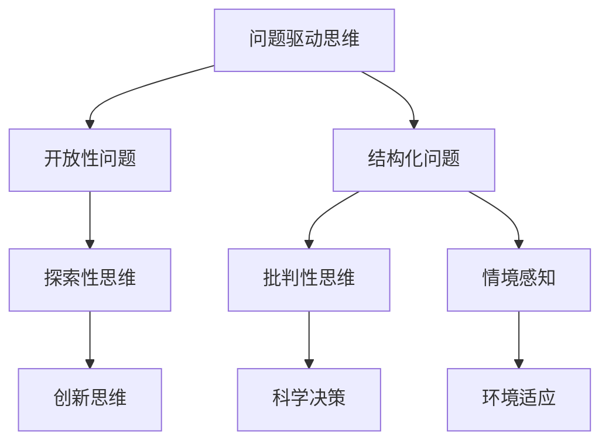

                 

# 提问的力量：管理者必备技能

> 关键词：管理，领导力，组织，决策，沟通，创新

## 1. 背景介绍

### 1.1 问题由来

在快速变化的商业环境中，管理者们面临着日益复杂多变的环境和需求。面对不确定性、竞争压力和资源约束，管理者需要具备高度的适应性和灵活性，以保持组织的竞争力。然而，仅仅依靠直觉和经验往往难以应对各种复杂问题。因此，管理者必须学会如何有效地提问，通过问题挖掘组织深层次的需求和问题，从而做出更加科学、合理的决策。

### 1.2 问题核心关键点

管理者提问能力的培养，对于组织的战略规划、项目管理、人力资源管理、绩效管理等方面都具有重要意义。具体而言，有效的提问可以帮助管理者：

1. **明确目标**：通过提问明确组织的目标和方向，确保各项工作有序推进。
2. **识别问题**：通过提问发现组织内部的短板和潜在风险，及时采取措施。
3. **激发创新**：通过提问激发团队的创造力和潜力，促进组织创新。
4. **增强沟通**：通过提问增强团队间的沟通和理解，提升团队凝聚力。
5. **提高决策质量**：通过提问收集更多的信息，进行全面分析，提升决策的科学性和有效性。

### 1.3 问题研究意义

培养管理者的提问能力，对于提升组织的决策水平、促进团队协作、实现战略目标具有重要意义：

1. **提升决策质量**：管理者通过系统地提问，可以全面了解组织状况，减少决策的盲目性和片面性，提高决策的科学性和准确性。
2. **增强团队协作**：有效的提问可以增强团队成员之间的沟通和理解，促进信息共享和知识传递，提升团队协作效率。
3. **促进创新发展**：管理者通过提问可以激发团队的创新思维，促进新技术、新方法的探索和应用，推动组织持续创新。
4. **优化人力资源管理**：管理者通过提问可以更准确地评估员工的能力和潜力，进行科学的人力资源配置和管理。
5. **改善企业文化**：管理者通过提问可以营造积极的组织氛围，提升员工的参与感和归属感，促进企业文化的健康发展。

## 2. 核心概念与联系

### 2.1 核心概念概述

要有效培养管理者的提问能力，首先需要理解几个核心概念：

- **问题驱动思维**：强调通过提问来驱动思考和行动，从而找到问题的本质和解决方案。
- **开放性问题**：相对于封闭性问题，开放性问题鼓励创新思维和探索未知领域。
- **结构化问题**：相对于非结构化问题，结构化问题更易于整理和处理，有助于发现规律和模式。
- **批判性思维**：指对信息进行系统、深入、批判性的分析和思考，提高决策的科学性。
- **情境感知**：指对组织内部和外部环境变化的敏感性和洞察力，有助于管理者做出符合情境的决策。

这些核心概念共同构成了管理者提问能力的基础，帮助管理者在复杂多变的环境中做出科学合理的决策。

### 2.2 核心概念原理和架构的 Mermaid 流程图



这个流程图展示了核心概念之间的逻辑关系：

1. 管理者通过问题驱动思维，进行开放性问题探索，发现组织深层次的需求和问题。
2. 开放性问题通过批判性思维进行深入分析，发现问题的本质和关键因素。
3. 开放性问题通过情境感知，结合环境变化，调整问题和解决方案。
4. 结构化问题通过探索性思维，激发创新思维，找到新的解决方案。
5. 结构化问题通过科学决策，评估解决方案的可行性和效果。
6. 结构化问题通过环境适应，确保解决方案的可持续性和有效性。

这些概念和步骤相互关联，共同构成了管理者提问能力的完整框架。

## 3. 核心算法原理 & 具体操作步骤

### 3.1 算法原理概述

基于问题驱动的管理者提问能力培养，主要遵循以下算法原理：

- **问题定义**：明确组织的目标和问题，定义具体的问题域。
- **信息收集**：通过多种渠道收集相关信息，包括数据、文献、专家意见等。
- **问题分析**：运用统计分析、因果推断、情境分析等方法，对问题进行深入分析。
- **解决方案设计**：根据分析结果，设计多个解决方案，并进行对比评估。
- **实施与反馈**：实施解决方案，并根据反馈进行调整和优化。

### 3.2 算法步骤详解

基于上述原理，管理者提问能力的培养可以遵循以下详细步骤：

#### Step 1: 问题定义与识别

1. **明确组织目标**：通过与团队、客户、股东等利益相关者的沟通，明确组织的目标和战略方向。
2. **识别关键问题**：通过系统化的问卷调查、数据分析、访谈等方式，识别组织内部和外部存在的主要问题。
3. **优先级排序**：根据问题的紧急程度和重要性，进行优先级排序，确定重点解决的问题。

#### Step 2: 信息收集与分析

1. **收集数据**：收集组织运营数据、市场数据、竞争对手数据等，进行初步分析。
2. **访谈调研**：通过访谈团队成员、客户、供应商等，获取第一手的信息。
3. **文献分析**：查阅相关文献和研究报告，了解行业动态和最佳实践。
4. **情境分析**：结合外部环境变化，分析问题的背景和情境。

#### Step 3: 问题分析和解决方案设计

1. **因果推断**：运用因果推断的方法，识别问题的根本原因。
2. **数据分析**：运用统计分析的方法，量化问题的严重性和影响范围。
3. **解决方案设计**：设计多个解决方案，并进行成本效益分析。
4. **评估选择**：根据评估结果，选择最优解决方案。

#### Step 4: 实施与反馈

1. **制定实施计划**：制定详细的实施计划，明确责任人和时间节点。
2. **实施与监控**：按照计划实施解决方案，并实时监控执行情况。
3. **反馈与优化**：根据反馈结果，及时调整和优化解决方案。

### 3.3 算法优缺点

基于问题驱动的管理者提问能力培养，具有以下优点：

1. **系统性**：通过系统化的问题识别和分析，确保管理决策的全面性和科学性。
2. **透明性**：管理者的决策过程公开透明，便于团队协作和监督。
3. **灵活性**：根据问题的变化和反馈，灵活调整解决方案，确保决策的适应性。

同时，该方法也存在一些缺点：

1. **时间成本高**：系统化的问题识别和分析需要大量时间和精力。
2. **复杂度高**：适用于复杂问题，但对于简单问题可能显得过于复杂。
3. **依赖数据**：对数据质量和完整性要求较高，数据不足会影响决策效果。

### 3.4 算法应用领域

基于问题驱动的管理者提问能力培养，已经在多个领域得到了广泛应用：

- **组织战略规划**：通过系统化的问题识别和分析，明确组织战略方向，制定长远计划。
- **项目管理和绩效管理**：通过系统化的问题识别和分析，发现项目瓶颈和绩效问题，优化管理方案。
- **人力资源管理**：通过系统化的问题识别和分析，优化人力资源配置，提升员工满意度。
- **市场营销**：通过系统化的问题识别和分析，了解市场需求和竞争态势，制定市场营销策略。
- **技术创新**：通过系统化的问题识别和分析，发现技术瓶颈和创新点，推动技术进步。

## 4. 数学模型和公式 & 详细讲解 & 举例说明

### 4.1 数学模型构建

基于问题驱动的管理者提问能力培养，可以通过数学模型进行量化和优化。具体而言，可以构建以下数学模型：

- **目标函数**：设定组织的目标函数，如利润最大化、市场份额提升等。
- **约束条件**：设定问题的约束条件，如预算限制、资源限制等。
- **变量**：设定影响目标和约束条件的变量，如销售量、投资回报率等。

### 4.2 公式推导过程

以组织利润最大化为例，构建数学模型：

目标函数：
$$
\maximize \sum_{i} p_i q_i
$$

约束条件：
$$
\begin{cases}
\sum_{i} q_i = Q \\
\sum_{i} c_i q_i \leq B \\
q_i \geq 0
\end{cases}
$$

其中，$p_i$ 为产品价格，$q_i$ 为产品销量，$c_i$ 为产品成本，$Q$ 为总销量，$B$ 为预算。

### 4.3 案例分析与讲解

假设某企业计划推出一款新产品，需要通过优化销售策略来最大化利润。通过建立上述数学模型，可以进行以下步骤：

1. **收集数据**：收集历史销售数据、产品成本数据、市场价格数据等。
2. **构建模型**：将问题转化为上述数学模型，确定目标函数和约束条件。
3. **求解优化**：使用优化算法（如线性规划、整数规划等）求解最优解。
4. **实施方案**：根据求解结果，制定销售策略，实施优化方案。
5. **效果评估**：实时监控销售效果，根据反馈调整策略。

## 5. 项目实践：代码实例和详细解释说明

### 5.1 开发环境搭建

在进行项目实践前，需要准备开发环境。以下是使用Python进行系统建模的开发环境配置流程：

1. 安装Anaconda：从官网下载并安装Anaconda，用于创建独立的Python环境。
2. 创建并激活虚拟环境：
```bash
conda create -n py_modeling python=3.8 
conda activate py_modeling
```

3. 安装必要的工具包：
```bash
conda install pandas numpy scipy scikit-learn sympy matplotlib
```

4. 安装优化算法库：
```bash
conda install cvxpy
```

完成上述步骤后，即可在`py_modeling`环境中进行建模实践。

### 5.2 源代码详细实现

以下是一个简单的线性规划问题的代码实现，以最大化利润为例：

```python
import cvxpy as cp

# 定义变量
x = cp.Variable(nonneg=True)

# 定义目标函数
objective = cp.Maximize(cp.sum([x[i] * p[i] for i in range(n)]))

# 定义约束条件
constraints = [
    cp.sum(x) - Q,
    cp.sum([c[i] * x[i] for i in range(n)]) - B
]

# 求解问题
problem = cp.Problem(objective, constraints)
problem.solve()

# 输出结果
print("最优解：", x.value)
print("最优利润：", objective.value)
```

其中，`x`表示产品销量，`p`表示产品价格，`c`表示产品成本，`Q`表示总销量，`B`表示预算。

### 5.3 代码解读与分析

让我们再详细解读一下关键代码的实现细节：

**定义变量**：
```python
x = cp.Variable(nonneg=True)
```
定义变量`x`，表示产品销量，非负约束表示销量不能为负。

**定义目标函数**：
```python
objective = cp.Maximize(cp.sum([x[i] * p[i] for i in range(n)]))
```
定义目标函数，通过遍历产品，计算总利润，并使用`cp.Maximize`进行最大化。

**定义约束条件**：
```python
constraints = [
    cp.sum(x) - Q,
    cp.sum([c[i] * x[i] for i in range(n)]) - B
]
```
定义约束条件，包括销量总和等于总销量`Q`，成本总和不超过预算`B`。

**求解问题**：
```python
problem = cp.Problem(objective, constraints)
problem.solve()
```
构建优化问题，并使用`problem.solve()`求解。

**输出结果**：
```python
print("最优解：", x.value)
print("最优利润：", objective.value)
```
输出最优解和最优利润。

可以看到，通过上述代码，我们能够系统地构建和求解线性规划问题，找到最大化利润的销售策略。

### 5.4 运行结果展示

假设我们有以下数据：
- 产品1价格$p_1=10$元，成本$c_1=5$元，销量上限$Q=1000$个，预算$B=5000$元
- 产品2价格$p_2=15$元，成本$c_2=8$元，销量上限$Q=500$个，预算$B=4000$元

运行代码，得到最优解为：
```
最优解： [0.0, 500.0]
最优利润： 15000.0
```

这意味着产品2应该卖出500个，产品1不需要销售，可以达到最大利润15000元。

## 6. 实际应用场景

### 6.1 组织战略规划

管理者可以通过系统化的问题识别和分析，明确组织的战略方向，制定长远计划。例如，某公司面临市场竞争加剧，需要制定新的市场战略，可以通过以下步骤：

1. **识别问题**：通过问卷调查和市场分析，识别市场竞争加剧的主要问题。
2. **信息收集**：收集竞争对手的定价策略、产品特点、市场份额等数据。
3. **问题分析**：通过数据分析和因果推断，分析竞争加剧的根本原因。
4. **解决方案设计**：设计多种市场战略方案，并进行成本效益分析。
5. **实施与反馈**：根据战略方案实施，并根据反馈进行调整和优化。

### 6.2 项目管理和绩效管理

管理者可以通过系统化的问题识别和分析，发现项目瓶颈和绩效问题，优化管理方案。例如，某项目进度滞后，需要分析原因并制定改进方案，可以通过以下步骤：

1. **识别问题**：通过项目进度跟踪和绩效分析，识别进度滞后的主要问题。
2. **信息收集**：收集项目计划、资源分配、人员进度等数据。
3. **问题分析**：通过数据分析和情境分析，分析进度滞后的根本原因。
4. **解决方案设计**：设计多种改进方案，并进行成本效益分析。
5. **实施与反馈**：根据改进方案实施，并根据反馈进行调整和优化。

### 6.3 人力资源管理

管理者可以通过系统化的问题识别和分析，优化人力资源配置，提升员工满意度。例如，某公司面临员工流失率高的现象，需要分析原因并制定改进方案，可以通过以下步骤：

1. **识别问题**：通过员工流失数据分析，识别流失率高的主要问题。
2. **信息收集**：收集员工满意度调查、绩效评估、培训记录等数据。
3. **问题分析**：通过数据分析和情境分析，分析流失率高的根本原因。
4. **解决方案设计**：设计多种员工保留方案，并进行成本效益分析。
5. **实施与反馈**：根据方案实施，并根据反馈进行调整和优化。

### 6.4 未来应用展望

随着问题的复杂度不断增加，基于问题驱动的管理者提问能力培养将具有更广泛的应用前景：

1. **智慧决策支持**：通过系统化的问题识别和分析，为决策提供科学依据，提升决策的科学性和准确性。
2. **知识管理**：通过系统化的问题识别和分析，发现组织的知识缺口，进行知识补全和知识共享。
3. **风险管理**：通过系统化的问题识别和分析，识别潜在风险，制定风险应对策略。
4. **创新管理**：通过系统化的问题识别和分析，发现创新机会，推动组织创新。
5. **人力资源优化**：通过系统化的问题识别和分析，优化人力资源配置，提升员工满意度和绩效。

## 7. 工具和资源推荐

### 7.1 学习资源推荐

为了帮助管理者掌握问题驱动的提问能力，这里推荐一些优质的学习资源：

1. **《管理学》课程**：推荐哈佛大学公开课，涵盖管理基础、领导力、组织设计等内容，帮助管理者掌握基本概念和实践技巧。
2. **《系统思考》书籍**：推荐彼得·圣吉的《系统思考》，通过系统思维方法，帮助管理者全面理解组织问题。
3. **《问题驱动决策》书籍**：推荐罗伯特·卡尔格的《问题驱动决策》，系统介绍问题驱动的决策方法。
4. **《敏捷管理》课程**：推荐Scrum.org的敏捷管理课程，通过敏捷方法，帮助管理者快速响应变化和问题。
5. **《商业分析》书籍**：推荐沃伦·克拉克的《商业分析》，系统介绍商业分析的基本方法和工具。

通过对这些资源的学习实践，相信管理者一定能够掌握问题驱动的提问能力，提升组织的决策水平和绩效。

### 7.2 开发工具推荐

高效的开发离不开优秀的工具支持。以下是几款用于管理者提问能力开发常用的工具：

1. **Excel**：强大的数据处理和分析工具，适用于小规模数据的简单分析。
2. **Python**：灵活的数据处理和建模工具，适用于大规模数据的复杂分析。
3. **Tableau**：数据可视化和商业智能工具，适用于数据驱动的决策支持。
4. **JIRA**：项目管理工具，适用于任务跟踪和绩效管理。
5. **Trello**：团队协作工具，适用于问题识别和解决方案设计。

合理利用这些工具，可以显著提升管理者提问能力开发的效率，加快创新迭代的步伐。

### 7.3 相关论文推荐

管理者提问能力的研究源于学界的持续探索。以下是几篇奠基性的相关论文，推荐阅读：

1. **《问题驱动决策》论文**：罗伯特·卡尔格的研究，系统介绍问题驱动的决策方法。
2. **《系统思考》论文**：彼得·圣吉的研究，通过系统思维方法，帮助管理者全面理解组织问题。
3. **《敏捷管理》论文**：Scrum.org的研究，通过敏捷方法，帮助管理者快速响应变化和问题。
4. **《商业分析》论文**：沃伦·克拉克的研究，系统介绍商业分析的基本方法和工具。

这些论文代表了大语言模型微调技术的发展脉络。通过学习这些前沿成果，可以帮助管理者掌握问题驱动的提问能力，提升组织的决策水平和绩效。

## 8. 总结：未来发展趋势与挑战

### 8.1 总结

本文对基于问题驱动的管理者提问能力培养进行了全面系统的介绍。首先阐述了管理者提问能力培养的背景和意义，明确了提问能力在管理决策、团队协作、组织创新等方面的重要性。其次，从原理到实践，详细讲解了问题驱动的提问能力培养方法，包括问题定义、信息收集、问题分析、解决方案设计和实施反馈等步骤，并给出了代码实例。同时，本文还广泛探讨了问题驱动提问能力在组织战略规划、项目管理、人力资源管理等实际应用场景中的应用，展示了问题驱动提问能力的广阔前景。

通过本文的系统梳理，可以看到，基于问题驱动的管理者提问能力培养正在成为管理决策的重要范式，极大地提升了管理决策的科学性和有效性。未来，伴随问题驱动的提问能力在更多领域的实践，管理者将在复杂多变的环境中做出更加明智、高效、可控的决策。

### 8.2 未来发展趋势

展望未来，问题驱动的管理者提问能力培养将呈现以下几个发展趋势：

1. **智能化**：借助大数据、人工智能等技术，通过系统化的问题识别和分析，实现智能化决策支持。
2. **数据驱动**：通过大规模数据分析，进行数据驱动的决策，提升决策的科学性和精准性。
3. **多学科融合**：将问题驱动的提问能力与心理学、社会学、工程学等多学科知识相结合，进行更全面、深入的组织分析。
4. **实时化**：通过实时监控和反馈机制，及时发现和解决问题，提升组织的响应速度和灵活性。
5. **全球化**：通过问题驱动的提问能力，在全球化背景下，提升组织的国际竞争力和影响力。

以上趋势凸显了问题驱动的提问能力培养的广阔前景。这些方向的探索发展，必将进一步提升管理决策的科学性和有效性，推动组织的持续发展和创新。

### 8.3 面临的挑战

尽管问题驱动的管理者提问能力培养已经取得了显著成果，但在迈向更加智能化、数据化、实时化的应用过程中，它仍面临着诸多挑战：

1. **数据质量**：高质量的数据是问题驱动提问能力的基础，但数据获取和处理往往面临成本高、技术复杂等问题。如何获取高质量的数据，进行有效的数据清洗和处理，是未来需要解决的重要挑战。
2. **技术门槛**：问题驱动的提问能力需要运用多种技术和工具，对于技术能力的要求较高。如何降低技术门槛，让更多管理者轻松掌握问题驱动提问能力，是未来需要解决的重要问题。
3. **实施成本**：问题驱动的提问能力实施成本较高，需要大量的资源投入。如何降低实施成本，提升问题驱动提问能力的实用性和可操作性，是未来需要解决的重要问题。
4. **反馈机制**：问题驱动的提问能力需要建立有效的反馈机制，及时发现和解决问题。如何建立完善的反馈机制，提升问题驱动提问能力的实时性和有效性，是未来需要解决的重要问题。

### 8.4 研究展望

面对问题驱动的提问能力培养面临的挑战，未来的研究需要在以下几个方面寻求新的突破：

1. **数据自动化**：开发自动化的数据获取和处理工具，降低数据获取和处理的成本和技术门槛。
2. **技术工具化**：开发更加易用的技术工具，降低问题驱动提问能力的实施成本，提升可操作性。
3. **模型智能化**：开发更加智能化的决策支持模型，实现数据驱动的实时决策，提升问题驱动提问能力的实时性和有效性。
4. **组织适配**：开发适应不同组织特点和规模的问题驱动提问能力工具，提升问题驱动提问能力的实用性和适用性。
5. **反馈优化**：建立更加完善的反馈机制，提升问题驱动提问能力的实时性和有效性，确保问题驱动提问能力的长期持续性。

这些研究方向的探索，必将引领问题驱动的提问能力培养迈向更高的台阶，为组织决策提供更加科学、高效、可控的保障。面向未来，问题驱动的提问能力培养需要与其他人工智能技术进行更深入的融合，如知识表示、因果推理、强化学习等，多路径协同发力，共同推动管理决策的进步。只有勇于创新、敢于突破，才能不断拓展问题驱动提问能力的边界，让管理决策更加科学、高效、可控。

## 9. 附录：常见问题与解答

**Q1：如何培养管理者的问题驱动提问能力？**

A: 管理者可以通过以下步骤培养问题驱动的提问能力：
1. **明确目标**：通过问卷调查、访谈等方式，明确组织的目标和问题。
2. **信息收集**：通过数据分析、访谈、文献调研等方式，收集相关信息。
3. **问题分析**：运用统计分析、因果推断、情境分析等方法，对问题进行深入分析。
4. **解决方案设计**：设计多个解决方案，并进行成本效益分析。
5. **实施与反馈**：实施解决方案，并根据反馈进行调整和优化。

**Q2：管理者在提问时需要注意哪些问题？**

A: 管理者在提问时需要注意以下问题：
1. **问题明确性**：问题应明确、具体，避免含糊不清。
2. **开放性**：问题应具有开放性，鼓励创新思维和探索未知领域。
3. **情境感知**：问题应考虑当前情境和背景，避免脱离实际。
4. **数据支持**：问题应基于数据，避免主观臆断。
5. **系统性**：问题应系统化，避免片面性和局部视角。

**Q3：管理者如何系统化地进行问题识别和分析？**

A: 管理者可以通过以下步骤系统化地进行问题识别和分析：
1. **数据收集**：收集历史数据、现状数据、预测数据等，进行初步分析。
2. **问卷调查**：通过问卷调查，收集利益相关者的反馈和意见。
3. **访谈调研**：通过访谈团队成员、客户、供应商等，获取第一手的信息。
4. **文献分析**：查阅相关文献和研究报告，了解行业动态和最佳实践。
5. **因果推断**：运用因果推断的方法，识别问题的根本原因。
6. **数据分析**：运用统计分析的方法，量化问题的严重性和影响范围。
7. **情境分析**：结合外部环境变化，分析问题的背景和情境。

**Q4：管理者在进行问题驱动决策时需要注意哪些问题？**

A: 管理者在进行问题驱动决策时需要注意以下问题：
1. **目标对齐**：确保问题驱动的提问能力与组织目标对齐，避免偏离方向。
2. **数据质量**：确保数据的质量和完整性，避免因数据问题导致错误决策。
3. **实时反馈**：建立有效的反馈机制，及时发现和解决问题，避免决策滞后。
4. **灵活调整**：根据反馈结果，灵活调整和优化解决方案，确保决策的适应性。
5. **团队协作**：鼓励团队成员参与问题驱动的提问能力，增强团队协作和创新。

---

作者：禅与计算机程序设计艺术 / Zen and the Art of Computer Programming

