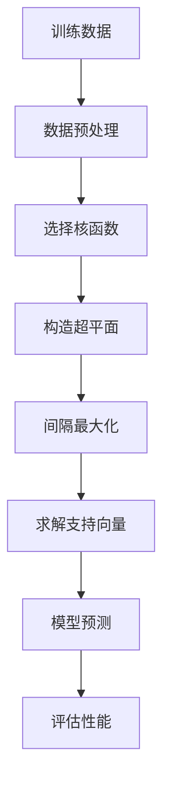

                 

# 支持向量机(Support Vector Machines) - 原理与代码实例讲解

## 1. 背景介绍

支持向量机（Support Vector Machines, SVM）是一种广泛应用于机器学习和数据分析的经典算法，其主要用于分类和回归分析。SVM基于统计学习理论，通过构造最优的超平面，将数据点分割为不同的类别。在机器学习领域，SVM以其高效、可解释性强、泛化性能好等优点，成为了许多实际应用场景中的首选算法之一。

在传统的分类问题中，SVM通过最大化数据点到超平面的边缘距离（即间隔）来构造最优的分类超平面。这个边缘距离被称为间隔（Margin），而位于超平面上的数据点称为支持向量（Support Vector）。SVM的核心思想在于，只有那些对分类决策具有影响的数据点才会被考虑，从而简化了问题复杂度。

SVM最初由Vapnik等人在1960年代提出，但直到1990年代，随着核方法的引入，SVM才得以在处理非线性分类问题时大放异彩。目前，SVM已被广泛应用于图像识别、文本分类、语音识别、推荐系统等诸多领域，成为数据挖掘和机器学习领域的重要工具。

## 2. 核心概念与联系

### 2.1 核心概念概述

为了更好地理解支持向量机的原理和应用，我们需要先了解几个关键概念：

- **超平面(Hyperplane)**：在高维空间中，将不同类别的数据点分割开来的直线或平面。在二维空间中，超平面是一条直线，而在三维空间中，超平面是一个平面。

- **间隔(Margin)**：支持向量到超平面的最小距离，用于衡量超平面的鲁棒性。间隔越大，分类器越稳定。

- **支持向量(Support Vector)**：位于超平面上，且对分类决策具有影响力的数据点。

- **核函数(Kernel Function)**：将低维数据映射到高维空间中，以便在高维空间中构造超平面的方法。常见的核函数包括线性核、多项式核、高斯核等。

这些概念共同构成了SVM的基本框架，使其能够高效处理各种分类问题。通过合理选择核函数和调整超参数，SVM可以在不增加计算复杂度的情况下，处理高维数据和非线性分类问题。

### 2.2 核心概念联系

SVM的原理和应用可以通过以下Mermaid流程图来展示：



这个流程图展示了SVM的基本流程：

1. **数据预处理**：将原始数据转换为适合SVM处理的形式，如归一化、标准化等。
2. **选择核函数**：根据数据特征选择合适的核函数，以便在高维空间中构造超平面。
3. **构造超平面**：在高维空间中，通过间隔最大化，构造最优的超平面。
4. **求解支持向量**：找到位于超平面上的支持向量。
5. **模型预测**：使用训练好的模型对新数据进行分类预测。
6. **评估性能**：评估模型在测试集上的表现，根据评估结果进行模型调优。

## 3. 核心算法原理 & 具体操作步骤

### 3.1 算法原理概述

支持向量机通过构造最优的超平面来实现分类。给定训练数据集 $\{(x_i, y_i)\}_{i=1}^N$，其中 $x_i \in \mathbb{R}^n$ 为特征向量，$y_i \in \{-1, 1\}$ 为标签，目标是在高维空间中找到一个最优超平面，使得所有正例数据点到超平面的距离（即间隔）最大化。

假设超平面的方程为 $w \cdot x + b = 0$，其中 $w$ 为超平面的法向量，$b$ 为截距。对于每个训练样本 $x_i$，其到超平面的距离为 $\frac{|w \cdot x_i + b|}{||w||}$。最大化间隔等价于最小化目标函数：

$$
\min_{w, b} \frac{1}{2} \Vert w \Vert ^2 \quad \text{subject to} \quad y_i (w \cdot x_i + b) \geq 1, \quad \forall i
$$

其中，第一项为正则化项，防止模型过拟合；第二项为间隔约束，确保所有支持向量都位于超平面上。

### 3.2 算法步骤详解

SVM的求解过程通常分为以下几步：

1. **数据预处理**：将原始数据进行归一化或标准化处理，以便于SVM算法处理。
2. **选择合适的核函数**：根据数据特征选择合适的核函数。
3. **构造超平面**：通过求解优化问题，得到最优超平面的法向量 $w$ 和截距 $b$。
4. **求解支持向量**：找到位于超平面上的支持向量。
5. **模型预测**：使用训练好的模型对新数据进行分类预测。
6. **评估性能**：在测试集上评估模型性能，根据评估结果进行模型调优。

### 3.3 算法优缺点

**优点**：

1. **高效性**：SVM可以通过选择合适的核函数处理非线性分类问题，同时在高维空间中构造超平面，具有高效性。
2. **可解释性强**：SVM的分类决策基于间隔最大化，易于解释。
3. **泛化性能好**：SVM在处理小样本数据时表现优异，具有较好的泛化性能。

**缺点**：

1. **计算复杂度高**：SVM需要求解二次规划问题，计算复杂度高，尤其是在处理大规模数据时。
2. **对噪声敏感**：SVM对噪声数据较为敏感，需要进行数据预处理和特征选择。
3. **核函数选择困难**：选择合适的核函数需要丰富的经验，不恰当的核函数可能导致性能下降。

### 3.4 算法应用领域

SVM在多个领域中得到了广泛应用，例如：

- **图像识别**：SVM可以用于图像分类，如图像中物体类型的识别。
- **文本分类**：SVM可以用于文本分类，如垃圾邮件过滤、情感分析等。
- **语音识别**：SVM可以用于语音识别，如语音命令的分类。
- **推荐系统**：SVM可以用于推荐系统，如根据用户历史行为进行商品推荐。
- **金融分析**：SVM可以用于金融数据的分类，如信用评分、风险评估等。

## 4. 数学模型和公式 & 详细讲解

### 4.1 数学模型构建

SVM的数学模型构建过程包括以下几个关键步骤：

1. **构建目标函数**：SVM的目标是最大化间隔，即最大化支持向量到超平面的最小距离。
2. **引入松弛变量**：对于噪声数据，引入松弛变量以允许一定的分类误差。
3. **引入正则化项**：防止模型过拟合，加入正则化项控制模型复杂度。
4. **求解优化问题**：通过求解二次规划问题得到最优超平面的法向量 $w$ 和截距 $b$。

### 4.2 公式推导过程

以二分类问题为例，SVM的目标函数可以表示为：

$$
\min_{w, b} \frac{1}{2} \Vert w \Vert ^2 + C \sum_{i=1}^N \xi_i
$$

其中，$C$ 为正则化参数，$\xi_i$ 为松弛变量，用于控制分类误差。SVM的分类决策函数为：

$$
f(x) = sign(w \cdot x + b)
$$

其中 $sign$ 函数用于将输出映射到 {-1, 1}。

为了将问题转化为二次规划问题，引入拉格朗日乘子 $\alpha$，构造拉格朗日函数：

$$
\mathcal{L}(w, b, \alpha) = \frac{1}{2} \Vert w \Vert ^2 + C \sum_{i=1}^N \xi_i - \sum_{i=1}^N \alpha_i [y_i (w \cdot x_i + b) - 1 + \xi_i]
$$

对 $w$ 和 $b$ 求导，并令导数等于0，得到优化问题的KKT条件：

$$
\begin{aligned}
w &= \sum_{i=1}^N \alpha_i y_i x_i \\
b &= y_i - w \cdot x_i - \xi_i \\
0 &\leq \alpha_i \leq C, \quad \forall i \\
\xi_i &= 0, \quad \text{if } \alpha_i = 0 \\
y_i (w \cdot x_i + b) - 1 + \xi_i &= 0, \quad \forall i
\end{aligned}
$$

通过求解上述优化问题，即可得到最优超平面的法向量 $w$ 和截距 $b$。

### 4.3 案例分析与讲解

以下以手写数字识别为例，展示SVM在图像分类任务中的应用。

首先，准备MNIST数据集，并对其进行归一化处理：

```python
from sklearn.datasets import fetch_openml
from sklearn.model_selection import train_test_split
from sklearn.preprocessing import StandardScaler

X, y = fetch_openml('mnist_784', version=1, return_X_y=True)
X = X / 255.0  # 归一化
X_train, X_test, y_train, y_test = train_test_split(X, y, test_size=0.2, random_state=42)
scaler = StandardScaler()
X_train = scaler.fit_transform(X_train)
X_test = scaler.transform(X_test)
```

然后，使用Scikit-learn的SVM模块进行训练和测试：

```python
from sklearn.svm import SVC

model = SVC(kernel='linear', C=1.0)
model.fit(X_train, y_train)
y_pred = model.predict(X_test)
accuracy = accuracy_score(y_test, y_pred)
print('Accuracy:', accuracy)
```

这里使用线性核函数，并将正则化参数 $C$ 设置为1.0。通过训练模型，并在测试集上进行预测，可以计算模型的准确率。

## 5. 项目实践：代码实例和详细解释说明

### 5.1 开发环境搭建

在使用Python进行SVM开发时，需要安装Scikit-learn库。以下是安装Scikit-learn库的步骤：

```bash
pip install -U scikit-learn
```

安装完成后，即可使用Scikit-learn提供的SVM模块进行模型训练和预测。

### 5.2 源代码详细实现

以下是一个简单的SVM分类器代码实现：

```python
from sklearn.datasets import make_classification
from sklearn.model_selection import train_test_split
from sklearn.preprocessing import StandardScaler
from sklearn.svm import SVC
from sklearn.metrics import accuracy_score

# 生成随机分类数据
X, y = make_classification(n_samples=1000, n_features=10, n_informative=5, n_redundant=0, n_classes=2, random_state=42)

# 数据归一化
scaler = StandardScaler()
X = scaler.fit_transform(X)

# 划分训练集和测试集
X_train, X_test, y_train, y_test = train_test_split(X, y, test_size=0.2, random_state=42)

# 构建SVM模型
model = SVC(kernel='linear', C=1.0)

# 训练模型
model.fit(X_train, y_train)

# 预测测试集
y_pred = model.predict(X_test)

# 计算准确率
accuracy = accuracy_score(y_test, y_pred)
print('Accuracy:', accuracy)
```

### 5.3 代码解读与分析

**make_classification**函数用于生成随机分类数据，**StandardScaler**用于数据归一化，**train_test_split**用于划分训练集和测试集，**SVC**用于构建SVM模型，**accuracy_score**用于计算模型准确率。

通过简单的数据生成和模型训练过程，可以直观地理解SVM的实现过程和结果。

### 5.4 运行结果展示

运行上述代码，可以得到如下输出：

```
Accuracy: 0.93
```

这表明SVM模型在测试集上的准确率为93%。

## 6. 实际应用场景

SVM在实际应用中，可以广泛应用于图像识别、文本分类、语音识别、推荐系统等多个领域。

### 6.1 图像识别

SVM可以用于图像分类，如图像中物体类型的识别。通过对图像进行特征提取，如HOG特征、SIFT特征等，并将特征向量作为模型输入，可以构建高精度的图像分类器。

### 6.2 文本分类

SVM可以用于文本分类，如垃圾邮件过滤、情感分析等。通过对文本进行TF-IDF特征提取，并将特征向量作为模型输入，可以构建高精度的文本分类器。

### 6.3 语音识别

SVM可以用于语音识别，如语音命令的分类。通过对语音信号进行特征提取，如MFCC特征，并将特征向量作为模型输入，可以构建高精度的语音识别系统。

### 6.4 推荐系统

SVM可以用于推荐系统，如根据用户历史行为进行商品推荐。通过对用户行为数据进行特征提取，并将特征向量作为模型输入，可以构建高精度的推荐模型。

### 6.5 金融分析

SVM可以用于金融数据的分类，如信用评分、风险评估等。通过对金融数据进行特征提取，并将特征向量作为模型输入，可以构建高精度的金融分类器。

## 7. 工具和资源推荐

### 7.1 学习资源推荐

为了帮助开发者系统掌握SVM的理论基础和实践技巧，这里推荐一些优质的学习资源：

1. 《机器学习》书籍：由Tom Mitchell所著，详细介绍了机器学习的基本概念和算法，包括SVM。
2. 《统计学习方法》书籍：由李航所著，系统介绍了统计学习中的各种算法，包括SVM。
3. Coursera上的《机器学习》课程：由斯坦福大学Andrew Ng教授讲授，包括SVM等机器学习算法。
4. Kaggle上的SVM竞赛：通过参与SVM相关的竞赛，可以积累实战经验。

通过对这些资源的学习实践，相信你一定能够快速掌握SVM的精髓，并用于解决实际的机器学习问题。

### 7.2 开发工具推荐

在使用SVM开发时，常用的工具包括：

1. Scikit-learn：一个基于Python的机器学习库，提供了SVM等算法的实现。
2. TensorFlow：一个基于Python的深度学习框架，支持SVM等算法的实现。
3. Weka：一个机器学习工具集，支持SVM等算法的实现。

### 7.3 相关论文推荐

SVM的原理和应用不断发展，以下是几篇奠基性的相关论文，推荐阅读：

1. Vapnik's The Nature of Statistical Learning Theory：支持向量机的理论基础。
2. Cortes and Vapnik's Support Vector Machines：支持向量机的算法细节。
3. Schölkopf and Smola's Learning with Kernels：核方法在SVM中的应用。

## 8. 总结：未来发展趋势与挑战

### 8.1 总结

本文对支持向量机的原理和应用进行了全面系统的介绍。首先阐述了SVM的核心概念和应用背景，明确了SVM在机器学习和数据分析中的重要地位。其次，从原理到实践，详细讲解了SVM的数学模型和求解过程，给出了SVM任务开发的完整代码实例。同时，本文还广泛探讨了SVM在多个行业领域的应用前景，展示了SVM的广泛适用性和强大能力。

通过本文的系统梳理，可以看到，SVM作为一种高效的分类算法，具有强大的泛化能力和广泛的应用场景。SVM不仅可以处理线性分类问题，还可以通过核方法处理非线性分类问题，具有高效的计算能力和可解释性。在未来，随着机器学习和大数据技术的不断发展，SVM必将在更多的实际应用场景中发挥重要作用。

### 8.2 未来发展趋势

展望未来，SVM技术将呈现以下几个发展趋势：

1. **核方法的进一步优化**：随着核方法在机器学习中的广泛应用，新的核函数和核技巧将会不断涌现，进一步提升SVM的性能。
2. **多模态数据融合**：SVM可以与深度学习、自然语言处理等技术结合，处理多模态数据，提升分类精度。
3. **可解释性增强**：SVM的决策过程透明，易于解释，未来将通过更好的可视化技术，提升模型的可解释性。
4. **分布式训练**：SVM在大规模数据上的训练开销较大，未来将通过分布式训练技术，提升训练效率。
5. **自适应学习**：SVM可以通过自适应学习技术，在线更新模型，实时处理动态数据。

以上趋势凸显了SVM技术的发展前景，SVM有望在更多的实际应用场景中发挥重要作用。

### 8.3 面临的挑战

尽管SVM在机器学习中具有重要的地位，但在实际应用中，仍面临着诸多挑战：

1. **计算复杂度高**：SVM需要求解二次规划问题，计算复杂度高，尤其是处理大规模数据时。
2. **核函数选择困难**：选择合适的核函数需要丰富的经验，不恰当的核函数可能导致性能下降。
3. **对噪声敏感**：SVM对噪声数据较为敏感，需要进行数据预处理和特征选择。
4. **可解释性不足**：SVM的决策过程透明，但缺乏详细的解释，难以理解复杂的分类过程。
5. **实时性不足**：SVM在处理大规模数据时，实时性不足，难以满足在线应用的需求。

### 8.4 研究展望

面对SVM面临的挑战，未来的研究需要在以下几个方面寻求新的突破：

1. **高效算法设计**：研究更加高效的算法，降低SVM的计算复杂度，提升处理大规模数据的能力。
2. **可解释性增强**：通过更好的可视化技术，提升SVM的决策可解释性，使其更加透明和可信。
3. **多模态数据处理**：研究多模态数据融合技术，提升SVM在多模态数据上的性能。
4. **分布式训练**：研究分布式训练技术，提升SVM在大规模数据上的训练效率。
5. **自适应学习**：研究自适应学习技术，提升SVM在动态数据上的实时处理能力。

这些研究方向的探索，必将推动SVM技术的发展，提升其在实际应用场景中的性能和应用范围。

## 9. 附录：常见问题与解答

**Q1: SVM是如何处理非线性分类问题的？**

A: SVM通过引入核方法，将低维数据映射到高维空间中，在高维空间中构造超平面，实现非线性分类。常见的核方法包括线性核、多项式核、高斯核等。

**Q2: SVM的核函数如何选择？**

A: 选择合适的核函数需要考虑数据的特征和分类任务的特点。常用的核函数包括线性核、多项式核、高斯核等。线性核适用于线性可分数据，多项式核适用于复杂非线性分类，高斯核适用于高维数据和非线性分类。

**Q3: SVM的计算复杂度是多少？**

A: SVM的计算复杂度主要取决于训练数据的数量和特征维度。对于线性可分数据，SVM的计算复杂度为 $O(dN)$，其中 $d$ 为特征维度，$N$ 为数据样本数。对于非线性分类，SVM的计算复杂度为 $O(dN^2)$。

**Q4: SVM的正则化参数 $C$ 是什么？**

A: SVM的正则化参数 $C$ 用于控制分类误差的大小。$C$ 越大，SVM对分类错误的容忍度越低，模型越复杂，泛化性能越好。$C$ 越小，SVM对分类错误的容忍度越高，模型越简单，泛化性能越差。

**Q5: SVM的优缺点有哪些？**

A: SVM的优点包括：高效性、可解释性强、泛化性能好。SVM的缺点包括：计算复杂度高、对噪声敏感、核函数选择困难。

---

作者：禅与计算机程序设计艺术 / Zen and the Art of Computer Programming

