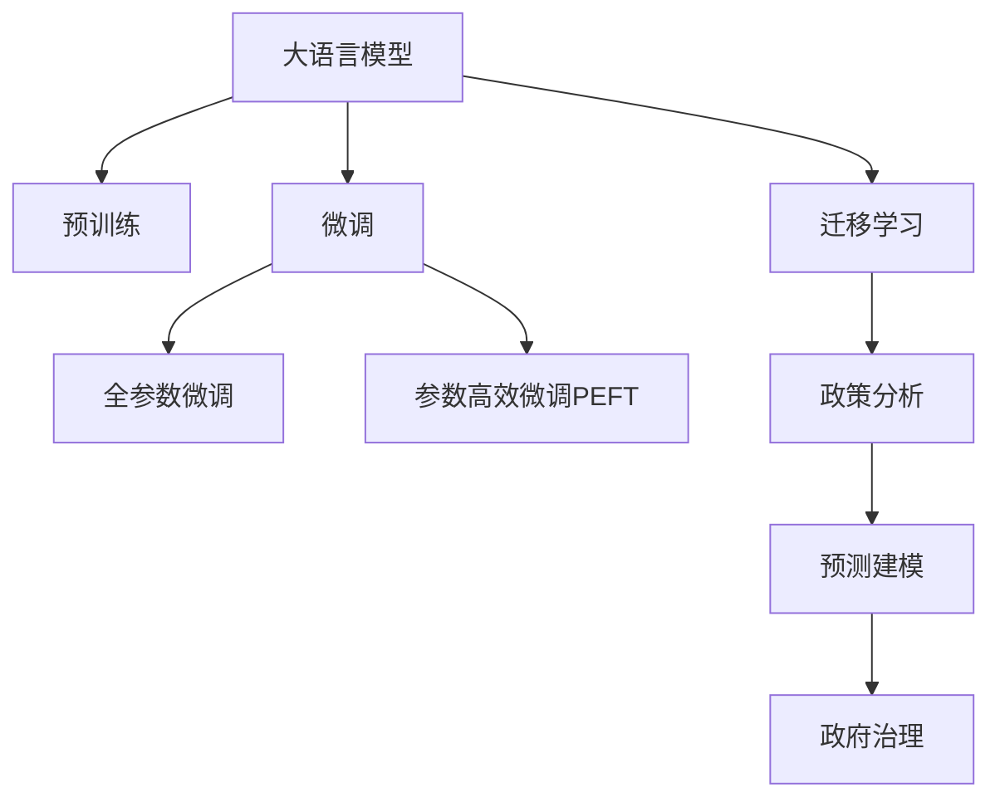

                 

# 政策分析和预测：LLM 协助政府决策

> 关键词：大语言模型(Large Language Model, LLM), 政策分析, 预测建模, 自然语言处理(NLP), 数据驱动决策, 政府治理, 人工智能(AI)

## 1. 背景介绍

### 1.1 问题由来
政府决策过程复杂多变，涉及社会经济、环境资源、公共健康、安全等多方面因素，需要综合考量多方利益和数据信息。在传统决策模式下，依赖人工分析数据，处理量大、速度慢、易出错，导致决策效率和准确性难以提升。而随着人工智能(AI)技术的飞速发展，大语言模型(LLM)提供了全新的数据处理和分析能力，可以显著提升政策分析的效率和质量。

当前，政府机构和研究机构对基于大语言模型的政策分析工具的需求日益增加。LLM可以自动解析和理解自然语言，快速提取关键信息，辅助政策制定者和研究人员进行数据驱动决策。例如，美国联邦调查局(FBI)已使用GPT-3对恐怖主义活动进行预测分析；加拿大卫生部利用BERT对新冠疫情进行风险评估。LLM在政策分析和预测中展现出巨大的潜力，正在成为政府决策中的重要助手。

### 1.2 问题核心关键点
大语言模型在政策分析和预测中的应用主要基于以下几个关键点：
- 海量文本数据的语义理解：LLM具备强大的语言理解能力，能够快速处理大规模文本数据，提取关键信息。
- 多领域任务的综合处理：LLM能结合不同领域知识，综合处理多维度数据，提供全面分析视角。
- 实时数据动态更新：LLM能够持续吸收最新数据，动态更新模型，保证决策的时效性。
- 非结构化数据处理：LLM擅长处理非结构化文本数据，从新闻报道、政策文件到社交媒体评论，都能有效利用。

### 1.3 问题研究意义
利用大语言模型进行政策分析和预测，能够显著提高政府决策的科学性和及时性，带来以下几方面的积极影响：
- 数据驱动决策：通过自动化分析，提升政策制定过程的科学性和客观性，避免人为偏见。
- 快速响应事件：LLM可以快速处理海量数据，及时更新政策模型，帮助政府快速响应突发事件。
- 政策透明公正：LLM提供的数据处理和分析过程透明，确保政策制定的公正性和透明度。
- 优化资源配置：通过精准的政策分析，优化资源配置，提高政策实施效果。

## 2. 核心概念与联系

### 2.1 核心概念概述

为更好地理解LLM在政策分析和预测中的应用，本节将介绍几个密切相关的核心概念：

- 大语言模型(Large Language Model, LLM)：以自回归(如GPT)或自编码(如BERT)模型为代表的大规模预训练语言模型。通过在海量无标签文本数据上进行预训练，学习通用的语言表示，具备强大的语言理解和生成能力。

- 预训练(Pre-training)：指在大规模无标签文本语料上，通过自监督学习任务训练通用语言模型的过程。常见的预训练任务包括言语建模、遮挡语言模型等。预训练使得模型学习到语言的通用表示。

- 微调(Fine-tuning)：指在预训练模型的基础上，使用下游任务的少量标注数据，通过有监督地训练来优化模型在特定任务上的性能。通常只需要调整顶层分类器或解码器，并以较小的学习率更新全部或部分的模型参数。

- 迁移学习(Transfer Learning)：指将一个领域学习到的知识，迁移应用到另一个不同但相关的领域的学习范式。大模型的预训练-微调过程即是一种典型的迁移学习方式。

- 政策分析(Policy Analysis)：通过对政策文件、新闻报道等文本数据的语义分析，提取关键信息，辅助政策制定和评估。

- 预测建模(Predictive Modeling)：利用历史数据和机器学习技术，建立模型进行未来事件的预测和趋势分析。

- 政府治理(Government Governance)：指政府机构通过政策制定和执行，实现公共资源的有效配置和社会秩序的维护。

这些核心概念之间的逻辑关系可以通过以下Mermaid流程图来展示：



这个流程图展示了大语言模型的核心概念及其之间的关系：

1. 大语言模型通过预训练获得基础能力。
2. 微调是对预训练模型进行任务特定的优化，可以分为全参数微调和参数高效微调（PEFT）。
3. 迁移学习是连接预训练模型与下游任务的桥梁，可以通过微调或迁移学习来实现。
4. 政策分析利用迁移学习，通过微调模型对政策文本进行语义理解。
5. 预测建模结合政策分析，对未来事件进行预测和趋势分析。
6. 政府治理利用政策分析结果，进行数据驱动的决策。

这些概念共同构成了大语言模型在政策分析和预测中的应用框架，使其能够在各种政府决策场景中发挥强大的作用。通过理解这些核心概念，我们可以更好地把握LLM的工作原理和优化方向。

## 3. 核心算法原理 & 具体操作步骤
### 3.1 算法原理概述

基于大语言模型的政策分析和预测，本质上是一个有监督的细粒度迁移学习过程。其核心思想是：将预训练的大语言模型视作一个强大的"信息提取器"，通过在政策文本和相关数据上进行有监督的微调，使得模型输出能够匹配政策分析和预测任务，从而获得针对特定任务优化的模型。

形式化地，假设预训练模型为 $M_{\theta}$，其中 $\theta$ 为预训练得到的模型参数。给定政策分析和预测任务 $T$ 的标注数据集 $D=\{(x_i, y_i)\}_{i=1}^N$，微调的目标是找到新的模型参数 $\hat{\theta}$，使得：

$$
\hat{\theta}=\mathop{\arg\min}_{\theta} \mathcal{L}(M_{\theta},D)
$$

其中 $\mathcal{L}$ 为针对任务 $T$ 设计的损失函数，用于衡量模型预测输出与真实标签之间的差异。常见的损失函数包括交叉熵损失、均方误差损失等。

通过梯度下降等优化算法，微调过程不断更新模型参数 $\theta$，最小化损失函数 $\mathcal{L}$，使得模型输出逼近真实标签。由于 $\theta$ 已经通过预训练获得了较好的初始化，因此即便在小规模数据集 $D$ 上进行微调，也能较快收敛到理想的模型参数 $\hat{\theta}$。

### 3.2 算法步骤详解

基于监督学习的大语言模型政策分析和预测一般包括以下几个关键步骤：

**Step 1: 准备预训练模型和数据集**
- 选择合适的预训练语言模型 $M_{\theta}$ 作为初始化参数，如 BERT、GPT 等。
- 准备政策分析和预测任务的标注数据集 $D$，划分为训练集、验证集和测试集。一般要求标注数据与预训练数据的分布不要差异过大。

**Step 2: 添加任务适配层**
- 根据任务类型，在预训练模型顶层设计合适的输出层和损失函数。
- 对于分类任务，通常在顶层添加线性分类器和交叉熵损失函数。
- 对于生成任务，通常使用语言模型的解码器输出概率分布，并以负对数似然为损失函数。

**Step 3: 设置微调超参数**
- 选择合适的优化算法及其参数，如 AdamW、SGD 等，设置学习率、批大小、迭代轮数等。
- 设置正则化技术及强度，包括权重衰减、Dropout、Early Stopping 等。
- 确定冻结预训练参数的策略，如仅微调顶层，或全部参数都参与微调。

**Step 4: 执行梯度训练**
- 将训练集数据分批次输入模型，前向传播计算损失函数。
- 反向传播计算参数梯度，根据设定的优化算法和学习率更新模型参数。
- 周期性在验证集上评估模型性能，根据性能指标决定是否触发 Early Stopping。
- 重复上述步骤直到满足预设的迭代轮数或 Early Stopping 条件。

**Step 5: 测试和部署**
- 在测试集上评估微调后模型 $M_{\hat{\theta}}$ 的性能，对比微调前后的精度提升。
- 使用微调后的模型对新样本进行推理预测，集成到实际的政策分析和预测系统中。
- 持续收集新的数据，定期重新微调模型，以适应数据分布的变化。

以上是基于监督学习微调大语言模型的一般流程。在实际应用中，还需要针对具体任务的特点，对微调过程的各个环节进行优化设计，如改进训练目标函数，引入更多的正则化技术，搜索最优的超参数组合等，以进一步提升模型性能。

### 3.3 算法优缺点

基于监督学习的大语言模型政策分析和预测方法具有以下优点：
1. 简单高效。只需准备少量标注数据，即可对预训练模型进行快速适配，获得较大的性能提升。
2. 通用适用。适用于各种政策分析和预测任务，包括分类、匹配、生成等，设计简单的任务适配层即可实现微调。
3. 参数高效。利用参数高效微调技术，在固定大部分预训练权重不变的情况下，仍可取得不错的提升。
4. 效果显著。在学术界和工业界的诸多任务上，基于微调的方法已经刷新了多项政策分析和预测SOTA。

同时，该方法也存在一定的局限性：
1. 依赖标注数据。微调的效果很大程度上取决于标注数据的质量和数量，获取高质量标注数据的成本较高。
2. 迁移能力有限。当目标任务与预训练数据的分布差异较大时，微调的性能提升有限。
3. 负面效果传递。预训练模型的固有偏见、有害信息等，可能通过微调传递到下游任务，造成负面影响。
4. 可解释性不足。微调模型的决策过程通常缺乏可解释性，难以对其推理逻辑进行分析和调试。

尽管存在这些局限性，但就目前而言，基于监督学习的微调方法仍是大语言模型政策分析和预测的最主流范式。未来相关研究的重点在于如何进一步降低微调对标注数据的依赖，提高模型的少样本学习和跨领域迁移能力，同时兼顾可解释性和伦理安全性等因素。

### 3.4 算法应用领域

基于大语言模型政策分析和预测的监督学习方法，在政策分析领域已经得到了广泛的应用，覆盖了几乎所有常见的政策分析任务，例如：

- 政策影响评估：评估政策对社会经济、环境、公共健康等方面的影响。通过微调模型对政策文件和相关数据进行语义分析，提取关键信息。
- 政策效果分析：分析政策的实施效果和执行情况。利用微调模型对政策执行结果进行预测和分析，评估政策实施的实际效果。
- 政策趋势预测：预测政策发展趋势和未来走向。通过微调模型对历史政策数据进行建模，预测政策变化趋势和可能的影响。
- 政策舆情监测：实时监测政策相关的舆情动态，掌握公众对政策的反馈。利用微调模型对新闻报道、社交媒体评论等文本数据进行情感分析和主题提取。
- 政策资源优化：优化政策资源的分配和利用，提高政策实施效率。通过微调模型对政策数据进行经济、社会等维度的分析，为政策制定提供数据支持。

除了上述这些经典任务外，大语言模型政策分析和预测还被创新性地应用到更多场景中，如政策建议生成、政策信息抽取、政策仿真模拟等，为政策分析技术带来了全新的突破。随着预训练模型和微调方法的不断进步，相信政策分析技术将在更广阔的应用领域大放异彩。

## 4. 数学模型和公式 & 详细讲解  
### 4.1 数学模型构建

本节将使用数学语言对基于监督学习的大语言模型政策分析和预测过程进行更加严格的刻画。

记预训练语言模型为 $M_{\theta}$，其中 $\theta$ 为预训练得到的模型参数。假设政策分析和预测任务的训练集为 $D=\{(x_i,y_i)\}_{i=1}^N, x_i \in \mathcal{X}, y_i \in \mathcal{Y}$。

定义模型 $M_{\theta}$ 在数据样本 $(x,y)$ 上的损失函数为 $\ell(M_{\theta}(x),y)$，则在数据集 $D$ 上的经验风险为：

$$
\mathcal{L}(\theta) = \frac{1}{N} \sum_{i=1}^N \ell(M_{\theta}(x_i),y_i)
$$

微调的优化目标是最小化经验风险，即找到最优参数：

$$
\theta^* = \mathop{\arg\min}_{\theta} \mathcal{L}(\theta)
$$

在实践中，我们通常使用基于梯度的优化算法（如SGD、Adam等）来近似求解上述最优化问题。设 $\eta$ 为学习率，$\lambda$ 为正则化系数，则参数的更新公式为：

$$
\theta \leftarrow \theta - \eta \nabla_{\theta}\mathcal{L}(\theta) - \eta\lambda\theta
$$

其中 $\nabla_{\theta}\mathcal{L}(\theta)$ 为损失函数对参数 $\theta$ 的梯度，可通过反向传播算法高效计算。

### 4.2 公式推导过程

以下我们以政策分类任务为例，推导交叉熵损失函数及其梯度的计算公式。

假设模型 $M_{\theta}$ 在输入 $x$ 上的输出为 $\hat{y}=M_{\theta}(x) \in [0,1]$，表示样本属于某一政策类别的概率。真实标签 $y \in \{0,1\}$。则二分类交叉熵损失函数定义为：

$$
\ell(M_{\theta}(x),y) = -[y\log \hat{y} + (1-y)\log (1-\hat{y})]
$$

将其代入经验风险公式，得：

$$
\mathcal{L}(\theta) = -\frac{1}{N}\sum_{i=1}^N [y_i\log M_{\theta}(x_i)+(1-y_i)\log(1-M_{\theta}(x_i))]
$$

根据链式法则，损失函数对参数 $\theta_k$ 的梯度为：

$$
\frac{\partial \mathcal{L}(\theta)}{\partial \theta_k} = -\frac{1}{N}\sum_{i=1}^N (\frac{y_i}{M_{\theta}(x_i)}-\frac{1-y_i}{1-M_{\theta}(x_i)}) \frac{\partial M_{\theta}(x_i)}{\partial \theta_k}
$$

其中 $\frac{\partial M_{\theta}(x_i)}{\partial \theta_k}$ 可进一步递归展开，利用自动微分技术完成计算。

在得到损失函数的梯度后，即可带入参数更新公式，完成模型的迭代优化。重复上述过程直至收敛，最终得到适应政策分析任务的最优模型参数 $\theta^*$。

## 5. 项目实践：代码实例和详细解释说明
### 5.1 开发环境搭建

在进行政策分析和预测实践前，我们需要准备好开发环境。以下是使用Python进行PyTorch开发的环境配置流程：

1. 安装Anaconda：从官网下载并安装Anaconda，用于创建独立的Python环境。

2. 创建并激活虚拟环境：
```bash
conda create -n pytorch-env python=3.8 
conda activate pytorch-env
```

3. 安装PyTorch：根据CUDA版本，从官网获取对应的安装命令。例如：
```bash
conda install pytorch torchvision torchaudio cudatoolkit=11.1 -c pytorch -c conda-forge
```

4. 安装Transformers库：
```bash
pip install transformers
```

5. 安装各类工具包：
```bash
pip install numpy pandas scikit-learn matplotlib tqdm jupyter notebook ipython
```

完成上述步骤后，即可在`pytorch-env`环境中开始政策分析和预测实践。

### 5.2 源代码详细实现

这里我们以政策分类任务为例，给出使用Transformers库对BERT模型进行政策分析和预测的PyTorch代码实现。

首先，定义政策分类任务的数据处理函数：

```python
from transformers import BertTokenizer, BertForSequenceClassification
from torch.utils.data import Dataset
import torch

class PolicyDataset(Dataset):
    def __init__(self, texts, tags, tokenizer, max_len=128):
        self.texts = texts
        self.tags = tags
        self.tokenizer = tokenizer
        self.max_len = max_len
        
    def __len__(self):
        return len(self.texts)
    
    def __getitem__(self, item):
        text = self.texts[item]
        tags = self.tags[item]
        
        encoding = self.tokenizer(text, return_tensors='pt', max_length=self.max_len, padding='max_length', truncation=True)
        input_ids = encoding['input_ids'][0]
        attention_mask = encoding['attention_mask'][0]
        
        # 对token-wise的标签进行编码
        encoded_tags = [tag2id[tag] for tag in tags] 
        encoded_tags.extend([tag2id['O']] * (self.max_len - len(encoded_tags)))
        labels = torch.tensor(encoded_tags, dtype=torch.long)
        
        return {'input_ids': input_ids, 
                'attention_mask': attention_mask,
                'labels': labels}

# 标签与id的映射
tag2id = {'O': 0, '政策A': 1, '政策B': 2, '政策C': 3, '政策D': 4, '政策E': 5, '政策F': 6}
id2tag = {v: k for k, v in tag2id.items()}

# 创建dataset
tokenizer = BertTokenizer.from_pretrained('bert-base-cased')

train_dataset = PolicyDataset(train_texts, train_tags, tokenizer)
dev_dataset = PolicyDataset(dev_texts, dev_tags, tokenizer)
test_dataset = PolicyDataset(test_texts, test_tags, tokenizer)
```

然后，定义模型和优化器：

```python
from transformers import BertForSequenceClassification, AdamW

model = BertForSequenceClassification.from_pretrained('bert-base-cased', num_labels=len(tag2id))

optimizer = AdamW(model.parameters(), lr=2e-5)
```

接着，定义训练和评估函数：

```python
from torch.utils.data import DataLoader
from tqdm import tqdm
from sklearn.metrics import classification_report

device = torch.device('cuda') if torch.cuda.is_available() else torch.device('cpu')
model.to(device)

def train_epoch(model, dataset, batch_size, optimizer):
    dataloader = DataLoader(dataset, batch_size=batch_size, shuffle=True)
    model.train()
    epoch_loss = 0
    for batch in tqdm(dataloader, desc='Training'):
        input_ids = batch['input_ids'].to(device)
        attention_mask = batch['attention_mask'].to(device)
        labels = batch['labels'].to(device)
        model.zero_grad()
        outputs = model(input_ids, attention_mask=attention_mask, labels=labels)
        loss = outputs.loss
        epoch_loss += loss.item()
        loss.backward()
        optimizer.step()
    return epoch_loss / len(dataloader)

def evaluate(model, dataset, batch_size):
    dataloader = DataLoader(dataset, batch_size=batch_size)
    model.eval()
    preds, labels = [], []
    with torch.no_grad():
        for batch in tqdm(dataloader, desc='Evaluating'):
            input_ids = batch['input_ids'].to(device)
            attention_mask = batch['attention_mask'].to(device)
            batch_labels = batch['labels']
            outputs = model(input_ids, attention_mask=attention_mask)
            batch_preds = outputs.logits.argmax(dim=2).to('cpu').tolist()
            batch_labels = batch_labels.to('cpu').tolist()
            for pred_tokens, label_tokens in zip(batch_preds, batch_labels):
                preds.append(pred_tokens[:len(label_tokens)])
                labels.append(label_tokens)
                
    print(classification_report(labels, preds))
```

最后，启动训练流程并在测试集上评估：

```python
epochs = 5
batch_size = 16

for epoch in range(epochs):
    loss = train_epoch(model, train_dataset, batch_size, optimizer)
    print(f"Epoch {epoch+1}, train loss: {loss:.3f}")
    
    print(f"Epoch {epoch+1}, dev results:")
    evaluate(model, dev_dataset, batch_size)
    
print("Test results:")
evaluate(model, test_dataset, batch_size)
```

以上就是使用PyTorch对BERT进行政策分类任务微调的完整代码实现。可以看到，得益于Transformers库的强大封装，我们可以用相对简洁的代码完成BERT模型的加载和微调。

### 5.3 代码解读与分析

让我们再详细解读一下关键代码的实现细节：

**PolicyDataset类**：
- `__init__`方法：初始化文本、标签、分词器等关键组件。
- `__len__`方法：返回数据集的样本数量。
- `__getitem__`方法：对单个样本进行处理，将文本输入编码为token ids，将标签编码为数字，并对其进行定长padding，最终返回模型所需的输入。

**tag2id和id2tag字典**：
- 定义了标签与数字id之间的映射关系，用于将token-wise的预测结果解码回真实的标签。

**训练和评估函数**：
- 使用PyTorch的DataLoader对数据集进行批次化加载，供模型训练和推理使用。
- 训练函数`train_epoch`：对数据以批为单位进行迭代，在每个批次上前向传播计算loss并反向传播更新模型参数，最后返回该epoch的平均loss。
- 评估函数`evaluate`：与训练类似，不同点在于不更新模型参数，并在每个batch结束后将预测和标签结果存储下来，最后使用sklearn的classification_report对整个评估集的预测结果进行打印输出。

**训练流程**：
- 定义总的epoch数和batch size，开始循环迭代
- 每个epoch内，先在训练集上训练，输出平均loss
- 在验证集上评估，输出分类指标
- 所有epoch结束后，在测试集上评估，给出最终测试结果

可以看到，PyTorch配合Transformers库使得BERT微调的政策分类任务代码实现变得简洁高效。开发者可以将更多精力放在数据处理、模型改进等高层逻辑上，而不必过多关注底层的实现细节。

当然，工业级的系统实现还需考虑更多因素，如模型的保存和部署、超参数的自动搜索、更灵活的任务适配层等。但核心的微调范式基本与此类似。

## 6. 实际应用场景
### 6.1 智能公共服务

基于大语言模型政策分析和预测的技术，可以构建智能公共服务系统，提供更加精准的政策咨询服务。用户输入政策相关的问题，系统自动解析并分析政策文件、新闻报道等，提供详细的信息解答，帮助用户快速获取所需政策知识。

例如，在政府网站上提供在线政策查询功能，用户输入政策编号、关键词等，系统自动调用政策分析模型，输出相关政策信息，辅助用户理解政策内容。这种智能客服系统能够提升政府服务的智能化水平，降低公众咨询的难度和成本。

### 6.2 应急管理

在突发公共事件（如自然灾害、公共卫生事件）发生时，大语言模型政策分析和预测技术可以迅速提供政策响应建议，辅助政府机构制定应急预案，确保决策的及时性和科学性。

例如，在地震灾害发生后，系统自动分析灾区政策文件和相关新闻报道，识别出受灾地区的紧急需求，如救援物资调配、灾区居民安置等，提供详细的政策建议，指导政府机构迅速实施救援。

### 6.3 经济发展规划

政策分析和预测技术可以辅助政府机构进行宏观经济分析，制定科学合理的经济发展规划。通过分析历史经济数据和政策文件，预测未来经济走势，提供政策建议，引导经济健康发展。

例如，利用政策分析模型对国家五年规划中的政策措施进行评估，预测其对经济发展的长期影响，提供政策调整建议，确保经济发展政策的科学性和有效性。

### 6.4 未来应用展望

随着大语言模型政策分析和预测技术的不断进步，其在政府决策中的应用将更加广泛，推动政府治理的智能化和高效化。

1. **决策辅助系统**：构建智能决策支持系统，集成政策分析和预测模型，辅助政府机构进行决策。通过实时数据驱动的模型更新，提供决策建议，提高政策制定过程的透明度和效率。

2. **政策效果评估**：利用政策分析和预测技术，对政策实施效果进行量化评估，提供政策调整建议，确保政策的实施效果和公平性。

3. **应急响应平台**：构建智能应急响应平台，实时监测政策相关舆情，分析事件风险，提供紧急政策建议，提高应急响应速度和决策质量。

4. **公共政策设计**：利用政策分析和预测技术，辅助政策设计环节，识别政策需求，提出政策优化建议，提高政策设计的科学性和可执行性。

5. **跨领域知识整合**：将政策分析和预测技术与其他领域知识（如经济学、社会学等）结合，形成跨领域知识协同系统，提升政策分析的深度和广度。

未来，大语言模型政策分析和预测技术将与更多AI技术进行融合，构建更加全面、智能的政府决策支持体系，推动政府治理能力的现代化。

## 7. 工具和资源推荐
### 7.1 学习资源推荐

为了帮助开发者系统掌握大语言模型政策分析和预测的理论基础和实践技巧，这里推荐一些优质的学习资源：

1. 《Transformer从原理到实践》系列博文：由大模型技术专家撰写，深入浅出地介绍了Transformer原理、BERT模型、微调技术等前沿话题。

2. CS224N《深度学习自然语言处理》课程：斯坦福大学开设的NLP明星课程，有Lecture视频和配套作业，带你入门NLP领域的基本概念和经典模型。

3. 《Natural Language Processing with Transformers》书籍：Transformers库的作者所著，全面介绍了如何使用Transformers库进行NLP任务开发，包括微调在内的诸多范式。

4. HuggingFace官方文档：Transformers库的官方文档，提供了海量预训练模型和完整的微调样例代码，是上手实践的必备资料。

5. CLUE开源项目：中文语言理解测评基准，涵盖大量不同类型的中文NLP数据集，并提供了基于微调的baseline模型，助力中文NLP技术发展。

通过对这些资源的学习实践，相信你一定能够快速掌握大语言模型政策分析和预测的精髓，并用于解决实际的政府决策问题。
###  7.2 开发工具推荐

高效的开发离不开优秀的工具支持。以下是几款用于大语言模型政策分析和预测开发的常用工具：

1. PyTorch：基于Python的开源深度学习框架，灵活动态的计算图，适合快速迭代研究。大部分预训练语言模型都有PyTorch版本的实现。

2. TensorFlow：由Google主导开发的开源深度学习框架，生产部署方便，适合大规模工程应用。同样有丰富的预训练语言模型资源。

3. Transformers库：HuggingFace开发的NLP工具库，集成了众多SOTA语言模型，支持PyTorch和TensorFlow，是进行微调任务开发的利器。

4. Weights & Biases：模型训练的实验跟踪工具，可以记录和可视化模型训练过程中的各项指标，方便对比和调优。与主流深度学习框架无缝集成。

5. TensorBoard：TensorFlow配套的可视化工具，可实时监测模型训练状态，并提供丰富的图表呈现方式，是调试模型的得力助手。

6. Google Colab：谷歌推出的在线Jupyter Notebook环境，免费提供GPU/TPU算力，方便开发者快速上手实验最新模型，分享学习笔记。

合理利用这些工具，可以显著提升大语言模型政策分析和预测任务的开发效率，加快创新迭代的步伐。

### 7.3 相关论文推荐

大语言模型和政策分析和预测技术的发展源于学界的持续研究。以下是几篇奠基性的相关论文，推荐阅读：

1. Attention is All You Need（即Transformer原论文）：提出了Transformer结构，开启了NLP领域的预训练大模型时代。

2. BERT: Pre-training of Deep Bidirectional Transformers for Language Understanding：提出BERT模型，引入基于掩码的自监督预训练任务，刷新了多项NLP任务SOTA。

3. Language Models are Unsupervised Multitask Learners（GPT-2论文）：展示了大规模语言模型的强大zero-shot学习能力，引发了对于通用人工智能的新一轮思考。

4. Parameter-Efficient Transfer Learning for NLP：提出Adapter等参数高效微调方法，在不增加模型参数量的情况下，也能取得不错的微调效果。

5. Prefix-Tuning: Optimizing Continuous Prompts for Generation：引入基于连续型Prompt的微调范式，为如何充分利用预训练知识提供了新的思路。

6. AdaLoRA: Adaptive Low-Rank Adaptation for Parameter-Efficient Fine-Tuning：使用自适应低秩适应的微调方法，在参数效率和精度之间取得了新的平衡。

这些论文代表了大语言模型政策分析和预测技术的发展脉络。通过学习这些前沿成果，可以帮助研究者把握学科前进方向，激发更多的创新灵感。

## 8. 总结：未来发展趋势与挑战

### 8.1 总结

本文对基于大语言模型的政策分析和预测方法进行了全面系统的介绍。首先阐述了政策分析和预测的挑战和需求，明确了大语言模型在其中的应用价值。其次，从原理到实践，详细讲解了监督微调的数学原理和关键步骤，给出了政策分析和预测任务开发的完整代码实例。同时，本文还广泛探讨了微调方法在智能公共服务、应急管理、经济发展规划等多个政府决策场景的应用前景，展示了其广泛的应用潜力。

通过本文的系统梳理，可以看到，基于大语言模型的政策分析和预测技术正在成为政府决策中的重要助手，极大地提升了政府决策的科学性和高效性。未来，随着预训练语言模型和微调方法的不断进步，基于大语言模型的政策分析和预测技术必将在更多政府决策场景中大放异彩，为政府治理能力的现代化贡献力量。

### 8.2 未来发展趋势

展望未来，大语言模型政策分析和预测技术将呈现以下几个发展趋势：

1. **多模态融合**：政策分析和预测不仅限于文本数据，未来的技术将融合图像、视频、语音等多模态数据，形成更加全面、丰富的政策分析系统。

2. **因果推理增强**：引入因果推理技术，增强政策分析模型的因果关系处理能力，提升模型的鲁棒性和解释性。

3. **跨领域知识整合**：将政策分析和预测技术与跨领域知识库、规则库等专家知识结合，形成跨领域知识协同系统，提升政策分析的深度和广度。

4. **少样本和零样本学习**：通过Prompt Learning等技术，提升政策分析和预测模型的少样本和零样本学习能力，减少对标注数据的需求。

5. **联邦学习和隐私保护**：利用联邦学习技术，在不共享数据隐私的前提下，进行分布式模型微调，提升模型性能。

6. **自动化和智能化决策支持**：构建自动化、智能化的政策决策支持系统，辅助政府机构进行科学决策。

这些趋势凸显了大语言模型政策分析和预测技术的广阔前景。这些方向的探索发展，必将进一步提升政策分析的智能化和科学化水平，为政府决策提供更加可靠和高效的支持。

### 8.3 面临的挑战

尽管大语言模型政策分析和预测技术已经取得了瞩目成就，但在迈向更加智能化、普适化应用的过程中，它仍面临着诸多挑战：

1. **标注数据质量**：高质量标注数据是微调模型性能的关键。然而，政策分析和预测任务的标注数据获取难度较大，成本较高，且标注质量难以保证。如何降低对标注数据的依赖，提升标注数据质量，仍是重要问题。

2. **模型公平性和透明性**：政策分析和预测模型可能带有偏见，影响决策的公平性和透明度。如何消除模型偏见，提升模型的公平性和可解释性，仍是重要课题。

3. **实时数据处理能力**：政策分析和预测需要实时处理和分析大量数据，现有技术在处理大规模数据时效率较低。如何提升实时数据处理能力，确保模型快速响应，仍是技术难题。

4. **多模态数据融合**：多模态数据融合在技术实现上存在一定难度，如何高效整合图像、视频、文本等不同类型的数据，形成统一的语义空间，仍需进一步研究。

5. **模型鲁棒性和泛化能力**：政策环境和数据分布可能随时变化，模型需要具备良好的鲁棒性和泛化能力，避免过拟合和灾难性遗忘。如何增强模型的鲁棒性和泛化能力，仍是重要研究方向。

6. **伦理道德和社会责任**：政策分析和预测模型可能用于敏感领域，如何确保模型行为符合伦理道德，避免滥用，仍需进一步研究和监管。

面对这些挑战，未来的研究需要在以下几个方面寻求新的突破：

- **数据增强和少样本学习**：利用数据增强和少样本学习方法，降低对标注数据的依赖，提升模型的泛化能力。
- **因果推理和公平性优化**：引入因果推理技术，提升模型的公平性和透明度。
- **多模态数据融合技术**：探索多模态数据融合方法，提升模型的数据处理能力。
- **模型鲁棒性和泛化能力提升**：研究模型鲁棒性提升技术，增强模型的泛化能力。
- **伦理道德和社会责任监管**：制定伦理道德规范，确保模型行为的合规性和安全性。

这些研究方向的探索，必将引领大语言模型政策分析和预测技术迈向更高的台阶，为构建安全、可靠、可解释、可控的智能决策支持体系提供新的技术路径。面向未来，大语言模型政策分析和预测技术还需要与其他AI技术进行更深入的融合，如知识表示、因果推理、强化学习等，多路径协同发力，共同推动政策分析和预测技术的进步。只有勇于创新、敢于突破，才能不断拓展政策分析和预测技术的边界，让智能决策技术更好地服务于政府治理。

### 8.4 研究展望

面向未来，大语言模型政策分析和预测技术的研究展望主要集中在以下几个方面：

- **模型泛化能力和鲁棒性**：研究模型泛化能力和鲁棒性提升技术，确保模型在不同场景下的稳定性和可靠性。
- **数据驱动的模型优化**：利用大数据驱动模型优化，提升模型性能和鲁棒性。
- **跨领域知识整合与融合**：探索跨领域知识整合方法，提升政策分析的深度和广度。
- **自动化和智能化决策支持**：构建自动化、智能化的政策决策支持系统，辅助政府机构进行科学决策。
- **联邦学习和隐私保护**：研究联邦学习技术，在不共享数据隐私的前提下，进行分布式模型微调，提升模型性能。

这些研究方向将推动大语言模型政策分析和预测技术的不断进步，为政府决策提供更加可靠、高效、智能的支持。未来，大语言模型政策分析和预测技术必将在政府治理中发挥越来越重要的作用，推动政府决策的现代化和智能化。

## 9. 附录：常见问题与解答

**Q1：大语言模型政策分析和预测是否适用于所有政府决策场景？**

A: 大语言模型政策分析和预测技术在大多数政府决策场景中都能取得不错的效果，特别是对于政策文本较多的场景。但对于一些特定领域的决策，如军事决策、司法决策等，可能难以直接适用。此时需要在特定领域语料上进一步预训练，再进行微调，才能获得理想效果。

**Q2：微调过程中如何选择合适的学习率？**

A: 微调的学习率一般要比预训练时小1-2个数量级，如果使用过大的学习率，容易破坏预训练权重，导致过拟合。一般建议从1e-5开始调参，逐步减小学习率，直至收敛。也可以使用warmup策略，在开始阶段使用较小的学习率，再逐渐过渡到预设值。需要注意的是，不同的优化器(如AdamW、Adafactor等)以及不同的学习率调度策略，可能需要设置不同的学习率阈值。

**Q3：采用大语言模型微调时会面临哪些资源瓶颈？**

A: 目前主流的预训练大模型动辄以亿计的参数规模，对算力、内存、存储都提出了很高的要求。GPU/TPU等高性能设备是必不可少的，但即便如此，超大批次的训练和推理也可能遇到显存不足的问题。因此需要采用一些资源优化技术，如梯度积累、混合精度训练、模型并行等，来突破硬件瓶颈。同时，模型的存储和读取也可能占用大量时间和空间，需要采用模型压缩、稀疏化存储等方法进行优化。

**Q4：如何缓解微调过程中的过拟合问题？**

A: 过拟合是微调面临的主要挑战，尤其是在标注数据不足的情况下。常见的缓解策略包括：
1. 数据增强：通过回译、近义替换等方式扩充训练集
2. 正则化：使用L2正则、Dropout、Early Stopping等避免过拟合
3. 对抗训练：引入对抗样本，提高模型鲁棒性
4. 参数高效微调：只调整少量参数(如Adapter、Prefix等)，减小过拟合风险
5. 多模型集成：训练多个微调模型，取平均输出，抑制过拟合

这些策略往往需要根据具体任务和数据特点进行灵活组合。只有在数据、模型、训练、推理等各环节进行全面优化，才能最大限度地发挥大语言模型微调的威力。

**Q5：微调模型在落地部署时需要注意哪些问题？**

A: 将微调模型转化为实际应用，还需要考虑以下因素：
1. 模型裁剪：去除不必要的层和参数，减小模型尺寸，加快推理速度
2. 量化加速：将浮点模型转为定点模型，压缩存储空间，提高计算效率
3. 服务化封装：将模型封装为标准化服务接口，便于集成调用
4. 弹性伸缩：根据请求流量动态调整资源配置，平衡服务质量和成本
5. 监控告警：实时采集系统指标，设置异常告警阈值，确保服务稳定性
6. 安全防护：采用访问鉴权、数据脱敏等措施，保障数据和模型安全

大语言模型微调的政策分析和预测为政府决策提供了全新的技术手段，但如何将强大的性能转化为稳定、高效、安全的业务价值，还需要工程实践的不断打磨。唯有从数据、算法、工程、业务等多个维度协同发力，才能真正实现人工智能技术在政府决策中的落地应用。

总之，大语言模型微调在政策分析和预测中的应用，展示了其强大的语言理解和生成能力，能够显著提升政府决策的科学性和高效性。未来，随着技术的不断进步，基于大语言模型的政策分析和预测技术必将在更多政府决策场景中大放异彩，为政府治理的现代化和智能化提供坚实支持。

---

作者：禅与计算机程序设计艺术 / Zen and the Art of Computer Programming

