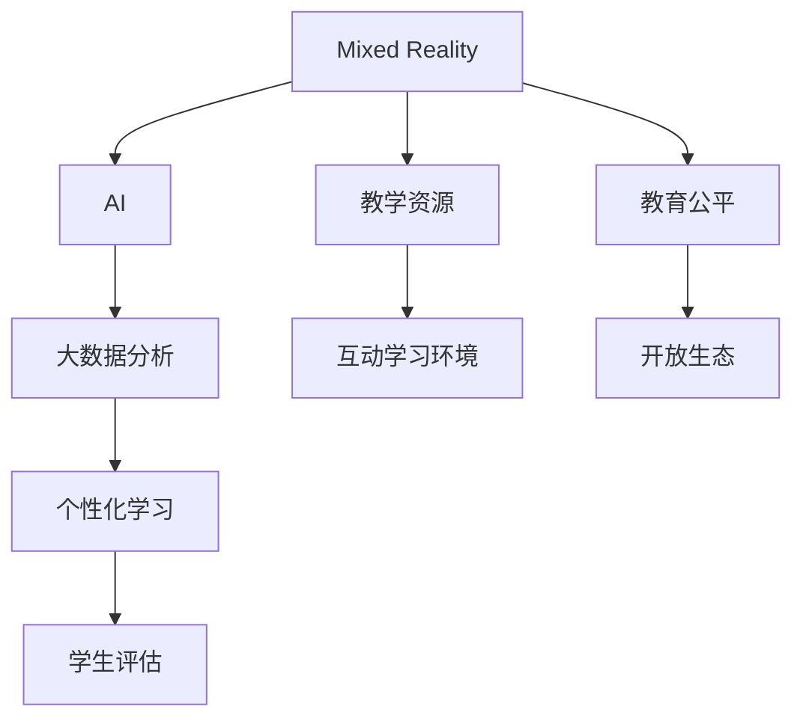
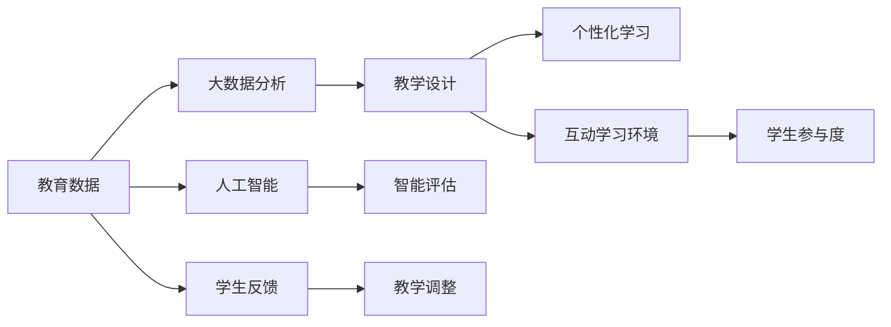

                 

# 教育科技创业：知识传播的新范式

> 关键词：教育科技, 知识传播, 技术赋能, 混合现实, 人工智能, 深度学习, 大数据分析, 学生评估

## 1. 背景介绍

### 1.1 问题由来

随着科技的迅猛发展，传统的教育模式已经无法满足现代社会的教育需求。信息技术的广泛应用，尤其是移动互联网和智能设备的普及，为教育科技（EdTech）的发展提供了广阔空间。如何利用科技手段变革传统教育，提高教育质量和效率，成为全球教育界关注的焦点。

在这样的大背景下，教育科技创业成为一个热门领域。通过技术赋能，教育科技创业公司能够提供个性化的学习体验，提升教学效果，帮助学生更好地掌握知识。本文将从核心概念入手，探讨教育科技创业的前景与挑战，以及如何构建基于混合现实、人工智能、大数据分析等技术的知识传播新范式。

### 1.2 问题核心关键点

教育科技创业的核心在于如何运用技术手段，优化教育资源配置，提升教育质量和效率。主要关键点包括：

- 技术创新：如何利用前沿技术手段，如混合现实、人工智能、大数据分析等，提升教学和学习效果。
- 数据驱动：如何通过数据分析，掌握学生的学习行为和心理特点，实现个性化教学。
- 交互体验：如何设计更加互动、沉浸式的学习环境，提升学生的学习兴趣和参与度。
- 开放生态：如何构建开放的平台，实现教育资源的共享和优化配置。
- 教育公平：如何利用技术手段，实现教育资源的均衡分配，促进教育公平。

## 2. 核心概念与联系

### 2.1 核心概念概述

教育科技创业涉及众多核心概念，下面对这些概念进行简要概述：

- **混合现实（Mixed Reality, MR）**：将虚拟与现实世界相结合，提供沉浸式的学习体验。
- **人工智能（Artificial Intelligence, AI）**：通过机器学习、深度学习等技术，实现自动化教学和智能评估。
- **大数据分析（Big Data Analytics）**：通过对教育数据的收集和分析，发现教育规律，指导教学决策。
- **个性化学习**：根据学生的学习行为和特点，提供定制化的学习方案，满足不同学生的学习需求。
- **学生评估（Student Assessment）**：通过技术手段，实时监测和评估学生的学习状态和效果。

这些概念之间相互联系，共同构成了教育科技创业的技术基础。

### 2.2 核心概念原理和架构的 Mermaid 流程图



这个流程图展示了教育科技创业中各项技术之间的联系：混合现实提供了沉浸式的学习环境，人工智能和大数据分析通过数据分析和智能算法，实现个性化教学和智能评估，学生评估和个性化学习相互促进，实现动态调整，而开放生态和教育公平则是教育科技创业的终极目标。

## 3. 核心算法原理 & 具体操作步骤

### 3.1 算法原理概述

教育科技创业的核心算法原理主要围绕数据驱动和智能优化展开。通过大数据分析和人工智能技术，可以从海量教育数据中提取有价值的信息，指导教学设计和决策。以下是一个简化的流程图，展示算法原理：



该图展示了从教育数据收集到教学调整的全过程，其中人工智能和智能评估是核心算法，用于分析和优化教学设计，提升学生学习效果。

### 3.2 算法步骤详解

教育科技创业的算法实现可以分为以下几个步骤：

**Step 1: 数据收集**
- 收集学生的学习数据，包括行为数据（如点击、阅读、答题时间等）和结果数据（如考试成绩、评估结果等）。
- 利用传感器和智能设备收集学生的生理和情感数据，如心率、体温、表情等。

**Step 2: 数据预处理**
- 对收集到的数据进行清洗和处理，去除异常值和噪声。
- 采用特征工程技术，提取有意义的特征，如时间序列、文本情感、行为模式等。

**Step 3: 数据分析与建模**
- 利用机器学习、深度学习等技术，构建模型分析数据。
- 常见模型包括决策树、随机森林、神经网络等。

**Step 4: 智能决策**
- 根据模型分析结果，制定个性化的教学方案。
- 利用智能算法，实时监测和评估学生的学习状态，调整教学策略。

**Step 5: 评估与反馈**
- 根据评估结果，反馈给教师和学生，调整教学策略和学生学习计划。
- 利用学生反馈，持续优化模型和算法。

**Step 6: 迭代优化**
- 在实际教学中，不断收集和分析数据，优化教学策略和模型。
- 实现动态调整和个性化教学。

### 3.3 算法优缺点

教育科技创业的算法具有以下优点：

- **个性化学习**：能够根据学生的特点，提供定制化的学习方案，满足不同学生的需求。
- **实时监测**：通过数据分析，实时监测学生的学习状态，及时发现和解决问题。
- **数据驱动**：通过大数据分析，掌握学生的学习行为和心理特点，实现科学的教学设计。

同时，也存在以下缺点：

- **数据隐私**：在收集学生数据时，需注意数据隐私和伦理问题，防止数据滥用。
- **技术复杂性**：算法实现和模型构建需要较高的技术门槛，需专业技术人员参与。
- **成本高昂**：数据收集和算法优化的初期投入较高，成本较高。

### 3.4 算法应用领域

教育科技创业的算法在多个领域有广泛应用，例如：

- **K-12教育**：通过数据分析，实现个性化教学，提高学生成绩和学习效果。
- **高等教育**：利用AI和混合现实技术，提供互动式、沉浸式的学习体验。
- **职业培训**：通过模拟仿真，提供个性化培训方案，提高培训效果。
- **语言学习**：利用大数据分析，个性化推荐学习资源和评估学习效果。
- **远程教育**：通过智能算法，实时监测学生状态，提高远程教学质量。

## 4. 数学模型和公式 & 详细讲解

### 4.1 数学模型构建

教育科技创业的数学模型主要涉及数据分析、机器学习和深度学习等领域。以下以学生评估为例，介绍常用的数学模型。

假设有一组学生成绩数据，记为 $(x_1, y_1), (x_2, y_2), \ldots, (x_n, y_n)$，其中 $x_i$ 表示学生的特征向量，$y_i$ 表示学生的评估结果（如成绩、满意度等）。我们的目标是通过这些数据，构建一个预测模型 $f(x, \theta)$，用于评估学生的学习效果。

### 4.2 公式推导过程

设 $f(x, \theta)$ 为线性回归模型，即：

$$
f(x, \theta) = \theta_0 + \theta_1 x_1 + \theta_2 x_2 + \ldots + \theta_k x_k
$$

其中 $\theta = (\theta_0, \theta_1, \ldots, \theta_k)$ 为模型参数。

根据最小二乘法，目标是最小化预测误差，即：

$$
\min_{\theta} \sum_{i=1}^n (y_i - f(x_i, \theta))^2
$$

求解该最小二乘问题，得到参数 $\theta$ 的估计值：

$$
\theta = (X^TX)^{-1}X^Ty
$$

其中 $X = [x_1^T, x_2^T, \ldots, x_n^T]^T$，$y = [y_1, y_2, \ldots, y_n]^T$。

### 4.3 案例分析与讲解

以一个简单的学生评估模型为例，展示数据模型和推导过程。假设有一组学生数据，包含学生的阅读时间和数学成绩：

| 学生ID | 阅读时间 (分钟) | 数学成绩 |
| ------ | -------------- | -------- |
| 1      | 60             | 85       |
| 2      | 90             | 92       |
| 3      | 120            | 78       |
| 4      | 45             | 90       |
| 5      | 80             | 88       |

我们可以使用上述线性回归模型，构建一个预测学生数学成绩的模型。具体步骤如下：

1. 构造特征矩阵 $X$ 和目标向量 $y$：
   - $X = \begin{bmatrix} 1 & 60 \\ 1 & 90 \\ 1 & 120 \\ 1 & 45 \\ 1 & 80 \end{bmatrix}$
   - $y = \begin{bmatrix} 85 \\ 92 \\ 78 \\ 90 \\ 88 \end{bmatrix}$

2. 计算 $X^TX$ 和 $X^Ty$：
   - $X^TX = \begin{bmatrix} 5 & 360 \\ 360 & 17100 \end{bmatrix}$
   - $X^Ty = \begin{bmatrix} 755 \\ 8180 \end{bmatrix}$

3. 计算 $\theta$：
   - $\theta = (X^TX)^{-1}X^Ty = \begin{bmatrix} \frac{1}{25} & \frac{72}{25} \end{bmatrix} \begin{bmatrix} 755 \\ 8180 \end{bmatrix} = \begin{bmatrix} 30.2 \\ 26.0 \end{bmatrix}$

因此，我们可以得到一个线性回归模型 $f(x, \theta) = 30.2 + 26.0 x_1$，用于预测学生的数学成绩。

## 5. 项目实践：代码实例和详细解释说明

### 5.1 开发环境搭建

要进行教育科技创业项目实践，首先需要搭建开发环境。以下是使用Python进行TensorFlow开发的环境配置流程：

1. 安装Anaconda：从官网下载并安装Anaconda，用于创建独立的Python环境。

2. 创建并激活虚拟环境：
```bash
conda create -n pytorch-env python=3.8 
conda activate pytorch-env
```

3. 安装TensorFlow：根据CUDA版本，从官网获取对应的安装命令。例如：
```bash
conda install tensorflow -c tf
```

4. 安装TensorBoard：TensorFlow配套的可视化工具，可实时监测模型训练状态，并提供丰富的图表呈现方式。
```bash
pip install tensorboard
```

5. 安装Pandas、Numpy等常用库：
```bash
pip install pandas numpy scikit-learn matplotlib
```

完成上述步骤后，即可在`pytorch-env`环境中开始项目实践。

### 5.2 源代码详细实现

以下是使用TensorFlow进行学生评估模型训练的Python代码实现：

```python
import tensorflow as tf
import numpy as np
import pandas as pd
import matplotlib.pyplot as plt

# 数据加载和预处理
data = pd.read_csv('student_data.csv')
X = np.array(data[['reading_time']])
y = np.array(data['math_score'])

# 分割数据集
train_size = int(0.8 * len(X))
X_train, y_train = X[:train_size], y[:train_size]
X_test, y_test = X[train_size:], y[train_size:]

# 定义模型
def create_model(input_dim):
    model = tf.keras.Sequential([
        tf.keras.layers.Dense(64, activation='relu', input_dim=input_dim),
        tf.keras.layers.Dense(1)
    ])
    return model

# 模型编译
model = create_model(input_dim=X.shape[1])
model.compile(optimizer=tf.keras.optimizers.Adam(learning_rate=0.001),
              loss='mse', metrics=['mae'])

# 模型训练
history = model.fit(X_train, y_train, epochs=100, batch_size=32, validation_split=0.2)

# 模型评估
test_loss, test_mae = model.evaluate(X_test, y_test)

# 可视化
plt.plot(history.history['loss'])
plt.plot(history.history['val_loss'])
plt.title('Model Loss')
plt.ylabel('Loss')
plt.xlabel('Epoch')
plt.legend(['Train', 'Validation'], loc='upper right')
plt.show()
```

### 5.3 代码解读与分析

**数据加载和预处理**：
- 使用Pandas加载学生数据，并进行简单的数据预处理。

**模型定义**：
- 使用TensorFlow定义一个简单的神经网络模型，包含一个隐层和一个输出层。

**模型编译**：
- 使用Adam优化器和均方误差（MSE）损失函数，评估指标为平均绝对误差（MAE）。

**模型训练**：
- 使用训练集数据，进行100轮训练，每轮32个样本。

**模型评估**：
- 使用测试集数据，评估模型的损失和平均绝对误差。

**可视化**：
- 使用Matplotlib绘制模型损失随epoch变化的图表。

## 6. 实际应用场景

### 6.1 混合现实教育

混合现实（MR）技术在教育中的应用，可以提供沉浸式的学习体验。例如，可以使用VR/AR设备，创建虚拟实验室，让学生身临其境地进行实验操作。这种沉浸式学习方式，可以激发学生的学习兴趣，提高学习效果。

**案例分析**：
- 某教育科技公司开发的MR化学实验室，让学生通过VR设备，进入虚拟化学实验室，进行化学反应实验。通过实时反馈和评估，学生可以多次尝试实验操作，直到获得正确的结果。

### 6.2 AI辅助教学

人工智能（AI）技术可以用于个性化教学和智能评估。例如，可以使用自然语言处理（NLP）技术，自动批改学生作业，生成个性化学习建议。

**案例分析**：
- 某教育科技公司开发的AI辅助英语学习系统，通过自动批改学生作文，生成详细的评语和改进建议。学生可以实时查看评语，了解自己的不足之处，并进行改进。

### 6.3 大数据分析

大数据分析技术可以用于深入分析学生的学习行为和心理特点，发现学习规律，指导教学决策。例如，可以通过分析学生的学习数据，发现其学习习惯和知识掌握情况，提供针对性的教学建议。

**案例分析**：
- 某教育科技公司开发的大数据分析平台，通过分析学生的在线学习行为，发现学生的薄弱知识点，生成个性化的学习计划。教师可以基于此进行有针对性的教学。

### 6.4 未来应用展望

随着技术的发展，教育科技创业将在多个领域取得更大突破。未来，教育科技创业的应用前景包括：

- **个性化教育**：通过数据分析和人工智能技术，实现个性化教学，满足不同学生的学习需求。
- **自适应学习**：利用自适应学习系统，根据学生的学习进度和效果，动态调整学习内容和难度。
- **混合现实教育**：通过虚拟现实技术，提供沉浸式的学习体验，激发学生的学习兴趣。
- **智能评估**：利用自然语言处理和机器学习技术，实现自动化评估，提高评估效率和准确性。

## 7. 工具和资源推荐

### 7.1 学习资源推荐

为了帮助开发者系统掌握教育科技创业的理论基础和实践技巧，这里推荐一些优质的学习资源：

1. 《教育科技创业实战指南》系列博文：由知名教育科技专家撰写，深入浅出地介绍了教育科技创业的最新动态和实战经验。

2. Coursera《教育科技》课程：由顶尖大学开设的教育科技课程，涵盖教育科技领域的多个前沿话题，助力开发者全面提升技术能力。

3. 《教育科技创业》书籍：详细介绍了教育科技创业的商业模式、技术框架和应用场景，适合有志于教育科技创业的开发者。

4. Udacity《教育科技》课程：通过实际项目案例，展示教育科技创业的开发流程和实战技巧，帮助开发者快速上手。

5. EdTechweek在线社区：汇集教育科技领域的最新资讯和技术讨论，是开发者获取行业动态的重要平台。

通过这些资源的学习，相信你一定能够快速掌握教育科技创业的理论基础和实践技巧，为教育科技创业之路奠定坚实的基础。

### 7.2 开发工具推荐

高效的开发离不开优秀的工具支持。以下是几款用于教育科技创业开发的常用工具：

1. TensorFlow：基于Python的开源深度学习框架，支持分布式计算和自动微分，适合大规模模型的训练和推理。

2. PyTorch：基于Python的开源深度学习框架，支持动态计算图，适合快速迭代的研究。

3. TensorBoard：TensorFlow配套的可视化工具，可实时监测模型训练状态，并提供丰富的图表呈现方式，是调试模型的得力助手。

4. Jupyter Notebook：免费的开源交互式开发环境，支持多种编程语言，适合数据科学和机器学习开发。

5. GitHub：全球最大的开源代码托管平台，支持代码版本控制和协作开发，适合团队开发和代码管理。

合理利用这些工具，可以显著提升教育科技创业的开发效率，加快创新迭代的步伐。

### 7.3 相关论文推荐

教育科技创业的发展源于学界的持续研究。以下是几篇奠基性的相关论文，推荐阅读：

1. "A Survey on the Use of Machine Learning for Adaptive Learning"：综述了机器学习在自适应学习中的应用，展示了数据驱动个性化学习的前景。

2. "Design and Development of a Virtual Chemistry Laboratory for Students"：介绍了虚拟实验室在化学教育中的应用，展示了混合现实技术在教育中的潜力。

3. "Artificial Intelligence in Education: Past, Present, and Future"：探讨了人工智能在教育中的历史和未来发展，展示了AI技术在教育中的应用前景。

4. "Big Data in Education: Challenges and Opportunities"：介绍了大数据在教育中的应用，展示了数据驱动教学设计的潜力。

5. "Personalized Learning with Artificial Intelligence: Opportunities and Challenges"：探讨了AI在个性化学习中的应用，展示了AI技术在教育中的应用前景。

这些论文代表了大数据和AI技术在教育中的应用脉络。通过学习这些前沿成果，可以帮助研究者把握学科前进方向，激发更多的创新灵感。

## 8. 总结：未来发展趋势与挑战

### 8.1 研究成果总结

本文对教育科技创业进行了全面系统的介绍。首先阐述了教育科技创业的背景和核心概念，明确了技术赋能教育的重要性。其次，从算法原理到项目实践，详细讲解了教育科技创业的关键步骤和实现方法，展示了技术在教育中的应用潜力。最后，展望了教育科技创业的未来发展趋势，提出了当前面临的挑战和研究方向。

### 8.2 未来发展趋势

展望未来，教育科技创业将在多个领域取得更大突破：

- **技术创新**：随着混合现实、人工智能和大数据分析等技术的进步，教育科技创业将提供更加多样、高效、个性化的教育解决方案。
- **数据驱动**：大数据分析将提供更加深入的教育洞察，指导教学决策和优化教育资源配置。
- **开放生态**：开放的平台和资源将促进教育资源的共享和优化配置，实现教育的普惠性。
- **教育公平**：通过技术手段，实现教育资源的均衡分配，促进教育公平。
- **全球化教育**：全球化的教育市场将为教育科技创业带来更多机遇和挑战，推动教育科技的全球化进程。

### 8.3 面临的挑战

尽管教育科技创业的前景广阔，但也面临诸多挑战：

- **技术复杂性**：教育科技创业需要较高的技术门槛，需专业技术人员参与。
- **数据隐私**：在收集和处理学生数据时，需注意数据隐私和伦理问题，防止数据滥用。
- **资源投入**：数据收集和算法优化的初期投入较高，成本较高。
- **效果评估**：教育效果的评估难度较大，需结合多种指标综合评估。

### 8.4 研究展望

未来的教育科技创业需要在以下几个方面进行深入研究：

- **技术融合**：如何与其他技术如区块链、物联网等进行融合，提升教育系统的智能化水平。
- **伦理和隐私**：如何构建安全的教育数据平台，保护学生隐私和数据安全。
- **普适教育**：如何设计普适的教育技术，确保不同背景的学生都能受益。
- **个性化学习**：如何构建更加个性化的学习系统，满足不同学生的学习需求。
- **未来教育**：如何利用技术手段，构建未来教育的形态，提升教育质量和效率。

这些研究方向的探索，必将引领教育科技创业迈向更高的台阶，为构建未来教育新范式提供有力支撑。

## 9. 附录：常见问题与解答

**Q1：教育科技创业如何实现个性化学习？**

A: 教育科技创业可以通过数据驱动和智能算法，实现个性化学习。具体步骤如下：
1. 收集学生的学习数据，包括行为数据和结果数据。
2. 利用机器学习算法，分析学生的学习行为和心理特点。
3. 根据分析结果，制定个性化的教学方案，提供定制化的学习资源和评估。
4. 实时监测学生的学习状态，动态调整教学策略。

**Q2：教育科技创业如何提升教学质量？**

A: 教育科技创业可以通过技术手段，提升教学质量和效率。具体措施包括：
1. 利用混合现实技术，提供沉浸式的学习体验，激发学生的学习兴趣。
2. 使用AI技术，自动批改作业，生成个性化的学习建议。
3. 通过大数据分析，掌握学生的学习行为和心理特点，指导教学决策。
4. 设计互动学习环境，提升学生的参与度和学习效果。

**Q3：教育科技创业如何构建开放生态？**

A: 教育科技创业可以通过开放的平台和资源，实现教育资源的共享和优化配置。具体措施包括：
1. 构建开放的API接口，供开发者和教育机构使用。
2. 提供丰富的教学资源，如视频课程、学习工具等，供学生和教师使用。
3. 利用区块链技术，确保教育数据的安全和透明。
4. 建立教育社区，促进教育资源的共享和交流。

**Q4：教育科技创业如何确保数据隐私和安全？**

A: 教育科技创业在数据收集和处理过程中，需注意数据隐私和伦理问题。具体措施包括：
1. 采用数据加密和匿名化处理，保护学生隐私。
2. 制定严格的数据访问控制策略，限制数据的使用范围。
3. 建立数据使用规范和伦理审查机制，防止数据滥用。
4. 采用安全可靠的技术手段，保障数据传输和存储的安全。

**Q5：教育科技创业如何评估教育效果？**

A: 教育科技创业可以通过多维度指标综合评估教育效果。具体措施包括：
1. 结合学生的考试成绩、学习进度、学习时间等指标，综合评估学习效果。
2. 利用学生反馈，了解学生的学习体验和满意度。
3. 通过数据分析，发现学习过程中存在的问题和不足，指导教学改进。
4. 采用多种评估方法，如实验对比、前后测试等，确保评估的科学性和可靠性。

---

作者：禅与计算机程序设计艺术 / Zen and the Art of Computer Programming

