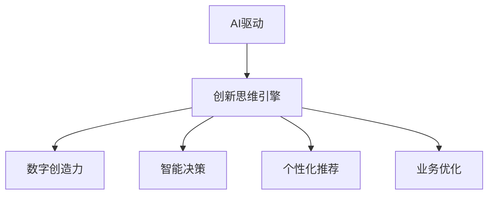

                 

# 数字创造力引擎：AI驱动的创新思维

> 关键词：AI驱动,创新思维,创造力引擎,智能决策,数字转型

## 1. 背景介绍

### 1.1 问题由来

在数字化转型的大背景下，企业竞争日益激烈，客户需求不断变化。传统依靠经验和规则的决策模式已无法满足时代需求，迫切需要引入新型的创新思维和决策工具。AI驱动的创新思维引擎，正是在这样的背景下孕育而生，为企业决策提供全新的数字创造力。

AI驱动的创新思维引擎，通过深度学习、自然语言处理等前沿技术，结合企业内外部数据，智能化生成推荐方案、制定战略决策、优化运营流程，为企业带来持续的创新和增长。其核心优势在于：

- **智能化决策**：基于数据和模型自动化生成决策方案，提升决策效率和准确性。
- **个性化推荐**：根据用户行为和需求，智能化推荐个性化的产品和服务，提升用户体验。
- **业务优化**：通过智能分析，识别业务痛点，优化流程，提升运营效率。
- **市场洞察**：通过对海量数据的智能分析，洞察市场趋势，为战略决策提供依据。

AI驱动的创新思维引擎，正在引领企业进入智能化决策的新时代。

### 1.2 问题核心关键点

AI驱动的创新思维引擎，其核心工作原理和关键技术点如下：

1. **深度学习**：通过深度神经网络，自动学习数据的复杂特征和模式，进行智能决策和推荐。
2. **自然语言处理**：理解和生成自然语言，实现与用户的自然交流，提升用户体验。
3. **强化学习**：在不断试错中优化决策策略，提升决策效果和模型效果。
4. **数据驱动**：基于企业内外部数据的全面整合和智能分析，驱动决策和业务优化。
5. **用户体验**：通过个性化推荐和自然语言交互，提升用户满意度和黏性。
6. **可解释性**：通过透明化决策过程，提升模型可解释性，增强用户信任。

这些关键技术点共同构成了AI驱动的创新思维引擎的核心架构，使其能够为企业提供智能化的决策支持和业务优化。

## 2. 核心概念与联系

### 2.1 核心概念概述

为更好地理解AI驱动的创新思维引擎的原理和架构，本节将介绍几个关键概念：

- **AI驱动**：指通过人工智能技术，特别是深度学习、自然语言处理、强化学习等技术，驱动业务的智能化决策和优化。
- **创新思维引擎**：指利用AI技术，智能化生成决策方案、推荐内容、业务优化策略等，为企业提供持续创新的支持。
- **数字创造力**：指通过AI技术，智能化生成创意内容、方案设计、产品创新等，驱动业务的数字化转型和创新。
- **智能决策**：指基于AI模型和大数据分析，自动化生成决策方案，提升决策效率和准确性。
- **个性化推荐**：指通过AI技术，智能化生成个性化内容推荐，提升用户体验和满意度。
- **业务优化**：指通过AI技术，智能分析业务流程，识别痛点，优化流程，提升运营效率。

这些核心概念之间的逻辑关系可以通过以下Mermaid流程图来展示：



这个流程图展示了这个引擎的核心概念及其之间的关系：

1. AI驱动为创新思维引擎提供技术支撑。
2. 创新思维引擎通过智能化决策、个性化推荐、业务优化等手段，驱动企业数字化转型和创新。
3. 数字创造力引擎通过智能化生成创意和内容，驱动企业的持续创新。

这些概念共同构成了AI驱动的创新思维引擎的基本框架，使其能够为企业提供全面的智能化支持。

## 3. 核心算法原理 & 具体操作步骤
### 3.1 算法原理概述

AI驱动的创新思维引擎，其核心算法原理主要基于深度学习和自然语言处理技术。以下将详细讲解其工作原理和关键步骤。

### 3.2 算法步骤详解

AI驱动的创新思维引擎的构建和运行，主要包括以下几个关键步骤：

**Step 1: 数据准备与预处理**
- 收集和整合企业内外部数据，包括用户行为数据、市场数据、财务数据、运营数据等。
- 对数据进行清洗、归一化、特征工程等预处理，准备输入到AI模型中。

**Step 2: 模型训练与微调**
- 基于深度学习模型(如卷积神经网络CNN、循环神经网络RNN、Transformer等)，构建决策模型、推荐模型、业务优化模型等。
- 在标注数据集上训练模型，并通过交叉验证、早停等方法进行模型调优。

**Step 3: 业务集成与部署**
- 将训练好的AI模型集成到企业现有的业务系统中，进行接口调用和数据交互。
- 通过API或SDK等形式，将模型服务部署到云平台、本地服务器等环境中，供业务部门调用。

**Step 4: 用户交互与反馈**
- 通过自然语言处理技术，实现与用户的自然语言交互，获取用户反馈和需求。
- 将用户反馈数据重新输入到AI模型中，进行模型更新和优化。

**Step 5: 监控与优化**
- 实时监控模型的运行状态和性能指标，及时发现和解决问题。
- 通过A/B测试等方法，优化模型参数和决策策略，提升效果。

### 3.3 算法优缺点

AI驱动的创新思维引擎，其核心算法具有以下优点和缺点：

**优点**：
1. **智能化决策**：基于深度学习和大数据分析，智能化生成决策方案，提升决策效率和准确性。
2. **个性化推荐**：通过自然语言处理技术，智能化推荐个性化内容，提升用户体验。
3. **业务优化**：通过智能分析，识别业务痛点，优化流程，提升运营效率。
4. **市场洞察**：通过对海量数据的智能分析，洞察市场趋势，为战略决策提供依据。

**缺点**：
1. **数据依赖性高**：模型效果依赖高质量、大规模的数据，数据收集和清洗工作量大。
2. **模型复杂度高**：深度学习模型结构复杂，训练和优化难度大。
3. **可解释性差**：深度学习模型通常是"黑盒"系统，难以解释其内部工作机制和决策逻辑。
4. **实时性低**：复杂的模型结构和庞大的数据集，导致实时计算效率低，延迟较大。

尽管存在这些局限性，但就目前而言，AI驱动的创新思维引擎在智能化决策、个性化推荐、业务优化等方面，已经取得了显著的效果，成为了企业数字化转型的重要工具。未来相关研究的重点在于如何进一步降低数据依赖，提高模型可解释性，提升实时性，以适应更多应用场景。

### 3.4 算法应用领域

AI驱动的创新思维引擎，在多个领域得到了广泛应用，具体包括：

1. **金融**：基于用户行为数据和市场数据，智能化生成投资策略、风险评估、信用评估等。
2. **零售**：通过用户行为数据和市场数据，智能化生成产品推荐、库存管理、促销策略等。
3. **医疗**：基于病历数据和患者行为数据，智能化生成诊断方案、治疗方案、患者管理等。
4. **制造**：基于设备运行数据和生产数据，智能化生成生产优化、质量控制、设备维护等方案。
5. **教育**：基于学生行为数据和学习数据，智能化生成教学方案、学习路径、智能辅导等。
6. **物流**：基于运输数据和市场需求数据，智能化生成配送路径、库存管理、订单处理等方案。

除了上述这些经典领域，AI驱动的创新思维引擎还被创新性地应用到更多场景中，如智慧城市、智能家居、智能客服等，为各行各业带来了新的突破和创新。

## 4. 数学模型和公式 & 详细讲解
### 4.1 数学模型构建

AI驱动的创新思维引擎，其核心数学模型主要基于深度学习算法，包括卷积神经网络CNN、循环神经网络RNN、Transformer等。以Transformer模型为例，其数学模型构建过程如下：

**Transformer模型**：
- **自注意力机制**：通过多头注意力机制，计算输入序列中每个元素与其他元素之间的关系。
- **前向神经网络**：通过多个全连接层和激活函数，将注意力计算结果转化为模型输出。
- **残差连接**：通过残差连接，解决深层网络训练的梯度消失问题，提升模型的收敛速度。

**多层Transformer堆叠**：通过多层的Transformer堆叠，实现对复杂数据的处理和建模。

### 4.2 公式推导过程

以下以Transformer模型为例，推导其基本原理和公式。

**Transformer模型基本结构**：
$$
F(x) = x + \sum_{i=1}^n f_i(x)
$$

其中 $x$ 为输入序列，$f_i$ 为第 $i$ 层的Transformer模型。每一层的Transformer模型由自注意力机制和前向神经网络构成。

**自注意力机制**：
$$
\text{Attention}(Q,K,V) = \text{softmax}(\frac{QK^T}{\sqrt{d_k}})V
$$

其中 $Q$、$K$、$V$ 分别为查询、键、值矩阵，$d_k$ 为键的维数。自注意力机制通过计算输入序列中每个元素与其他元素之间的相似度，生成注意力权重矩阵 $A$。

**前向神经网络**：
$$
f_i = \text{LayerNorm}(\text{FFN}(x_i))
$$

其中 $x_i$ 为第 $i$ 层的输入序列，$\text{LayerNorm}$ 为归一化层，$\text{FFN}$ 为前向神经网络，通常包含多个全连接层和激活函数。

**多层Transformer堆叠**：
$$
F(x) = \text{Transformer}(\text{LayerNorm}(x))
$$

其中 $\text{Transformer}$ 为多层Transformer模型，$\text{LayerNorm}$ 为归一化层。多层Transformer堆叠通过多层的自注意力和前向神经网络，实现对输入序列的复杂建模。

### 4.3 案例分析与讲解

以金融领域为例，探讨如何使用Transformer模型构建创新思维引擎。

假设某金融机构希望通过AI驱动的创新思维引擎，智能化生成投资策略、风险评估、信用评估等。

1. **数据准备与预处理**：
   - 收集用户行为数据（如交易记录、投资偏好等）和市场数据（如股票价格、宏观经济指标等）。
   - 对数据进行清洗、归一化、特征工程等预处理，准备输入到Transformer模型中。

2. **模型训练与微调**：
   - 基于Transformer模型，构建决策模型、推荐模型、风险评估模型等。
   - 在标注数据集上训练模型，并通过交叉验证、早停等方法进行模型调优。

3. **业务集成与部署**：
   - 将训练好的Transformer模型集成到金融机构现有的业务系统中，进行接口调用和数据交互。
   - 通过API或SDK等形式，将模型服务部署到云平台、本地服务器等环境中，供业务部门调用。

4. **用户交互与反馈**：
   - 通过自然语言处理技术，实现与用户的自然语言交互，获取用户反馈和需求。
   - 将用户反馈数据重新输入到Transformer模型中，进行模型更新和优化。

5. **监控与优化**：
   - 实时监控模型的运行状态和性能指标，及时发现和解决问题。
   - 通过A/B测试等方法，优化模型参数和决策策略，提升效果。

通过以上步骤，金融机构可以构建基于Transformer模型的AI驱动的创新思维引擎，实现智能化投资策略、风险评估、信用评估等，提升决策效率和准确性。

## 5. 项目实践：代码实例和详细解释说明
### 5.1 开发环境搭建

在进行AI驱动的创新思维引擎的实践开发前，需要准备相应的开发环境。以下是使用Python进行TensorFlow开发的环境配置流程：

1. 安装Anaconda：从官网下载并安装Anaconda，用于创建独立的Python环境。

2. 创建并激活虚拟环境：
```bash
conda create -n tf-env python=3.8 
conda activate tf-env
```

3. 安装TensorFlow：根据CUDA版本，从官网获取对应的安装命令。例如：
```bash
conda install tensorflow -c tensorflow
```

4. 安装各类工具包：
```bash
pip install numpy pandas scikit-learn matplotlib tqdm jupyter notebook ipython
```

完成上述步骤后，即可在`tf-env`环境中开始实践开发。

### 5.2 源代码详细实现

下面我们以金融领域的风险评估为例，给出使用TensorFlow构建Transformer模型的PyTorch代码实现。

首先，定义风险评估任务的数据处理函数：

```python
from tensorflow.keras.preprocessing.text import Tokenizer
from tensorflow.keras.preprocessing.sequence import pad_sequences
import numpy as np
import pandas as pd

def read_data(path):
    data = pd.read_csv(path)
    X = data['description'].tolist()
    y = data['risk'].tolist()
    return X, y

def tokenize(data):
    tokenizer = Tokenizer()
    tokenizer.fit_on_texts(data)
    return tokenizer.texts_to_sequences(data)

def pad_sequences(data, maxlen=200):
    return pad_sequences(data, maxlen=maxlen, padding='post', truncating='post')

def prepare_data(X, y, maxlen=200):
    X = tokenize(X)
    X = pad_sequences(X, maxlen=maxlen)
    y = np.array(y)
    return X, y
```

然后，定义模型和优化器：

```python
from tensorflow.keras.models import Sequential
from tensorflow.keras.layers import Embedding, Bidirectional, GRU, Dense, Dropout
from tensorflow.keras.optimizers import Adam

model = Sequential()
model.add(Embedding(vocab_size, embedding_dim, input_length=maxlen))
model.add(Bidirectional(GRU(128)))
model.add(Dense(32, activation='relu'))
model.add(Dropout(0.2))
model.add(Dense(1, activation='sigmoid'))

optimizer = Adam(learning_rate=0.001)
```

接着，定义训练和评估函数：

```python
def train_epoch(model, X_train, y_train, X_val, y_val, batch_size=32, epochs=10):
    model.compile(optimizer=optimizer, loss='binary_crossentropy', metrics=['accuracy'])
    model.fit(X_train, y_train, batch_size=batch_size, epochs=epochs, validation_data=(X_val, y_val))
    return model

def evaluate(model, X_test, y_test, maxlen=200):
    y_pred = model.predict(X_test, verbose=0)
    y_pred = np.round(y_pred).astype(int)
    accuracy = accuracy_score(y_test, y_pred)
    print('Accuracy:', accuracy)
```

最后，启动训练流程并在测试集上评估：

```python
X_train, y_train = prepare_data(train_X, train_y, maxlen=maxlen)
X_val, y_val = prepare_data(val_X, val_y, maxlen=maxlen)
X_test, y_test = prepare_data(test_X, test_y, maxlen=maxlen)

model = train_epoch(model, X_train, y_train, X_val, y_val, batch_size=32, epochs=10)

evaluate(model, test_X, test_y, maxlen=maxlen)
```

以上就是使用TensorFlow对金融领域风险评估任务进行建模的完整代码实现。可以看到，得益于TensorFlow的强大封装，我们可以用相对简洁的代码完成模型的构建和训练。

### 5.3 代码解读与分析

让我们再详细解读一下关键代码的实现细节：

**数据处理函数**：
- `read_data`函数：读取数据集，并将文本数据和标签分别转换为列表。
- `tokenize`函数：对文本数据进行分词处理，生成数字序列。
- `pad_sequences`函数：对数字序列进行填充，保证序列长度一致。
- `prepare_data`函数：对文本数据和标签进行处理，生成模型的输入和输出。

**模型定义**：
- 使用`Sequential`模型，按顺序添加各层。
- 添加嵌入层，将文本转换为向量表示。
- 添加双向GRU层，捕捉序列的上下文信息。
- 添加全连接层和激活函数，生成模型输出。
- 添加Dropout层，防止过拟合。

**训练和评估函数**：
- `train_epoch`函数：使用Adam优化器，定义模型损失和评估指标，进行模型训练。
- `evaluate`函数：在测试集上评估模型性能，输出准确率等指标。

**训练流程**：
- 准备训练数据和验证数据。
- 在训练集上训练模型。
- 在验证集上评估模型性能。
- 在测试集上评估模型效果。

可以看到，TensorFlow的深度学习框架使得模型的构建和训练变得简洁高效。开发者可以将更多精力放在模型设计、数据处理等高层逻辑上，而不必过多关注底层的实现细节。

当然，工业级的系统实现还需考虑更多因素，如模型的保存和部署、超参数的自动搜索、更灵活的任务适配层等。但核心的构建流程基本与此类似。

## 6. 实际应用场景
### 6.1 智能决策支持

AI驱动的创新思维引擎，在智能决策支持方面表现出色。通过深度学习和自然语言处理技术，引擎能够智能化生成决策方案，支持企业决策过程。

以金融领域的投资策略为例，AI引擎可以通过历史数据和市场信息，智能化生成投资组合和交易策略。通过自然语言处理技术，引擎可以与投资者进行自然语言交流，获取更多需求和反馈，不断优化决策方案。

### 6.2 个性化推荐系统

AI驱动的创新思维引擎，在个性化推荐方面也具有强大的能力。通过深度学习模型，引擎可以智能化生成个性化推荐内容，提升用户体验。

以电商领域的推荐系统为例，AI引擎可以通过用户行为数据和商品数据，智能化生成个性化商品推荐。通过自然语言处理技术，引擎可以与用户进行自然语言交流，获取更多需求和反馈，不断优化推荐内容。

### 6.3 业务流程优化

AI驱动的创新思维引擎，在业务流程优化方面同样表现出色。通过深度学习模型，引擎可以智能化分析业务流程，识别痛点，优化流程，提升运营效率。

以制造领域的生产优化为例，AI引擎可以通过设备运行数据和生产数据，智能化生成生产优化和质量控制方案。通过自然语言处理技术，引擎可以与操作人员进行自然语言交流，获取更多需求和反馈，不断优化生产流程。

### 6.4 未来应用展望

随着AI驱动的创新思维引擎的不断发展，其在更多领域的应用前景将更加广阔。

在智慧医疗领域，AI引擎可以通过病历数据和患者行为数据，智能化生成诊断方案和治疗方案，提升医疗服务质量。

在智能教育领域，AI引擎可以通过学生行为数据和学习数据，智能化生成教学方案和学习路径，提升教育效果。

在智慧城市治理中，AI引擎可以通过城市事件数据和舆情数据，智能化生成应急指挥和舆情管理方案，提升城市治理水平。

此外，在企业生产、社会治理、文娱传媒等众多领域，AI引擎都将发挥重要作用，推动数字化转型和智能化升级。

## 7. 工具和资源推荐
### 7.1 学习资源推荐

为了帮助开发者系统掌握AI驱动的创新思维引擎的理论基础和实践技巧，这里推荐一些优质的学习资源：

1. TensorFlow官方文档：TensorFlow的官方文档，提供了全面的API文档、示例代码和教程，是入门和进阶的必备资源。
2. Deep Learning with TensorFlow by TensorFlow: 官方图书，详细介绍了TensorFlow的基本原理和实际应用，适合深度学习初学者。
3. Hands-On Machine Learning with Scikit-Learn and TensorFlow: 实用教程，介绍了如何使用Scikit-Learn和TensorFlow进行机器学习和深度学习项目开发。
4. TensorFlow Dev Summit: TensorFlow年度开发者大会，提供丰富的演讲和教程，是了解最新技术和趋势的重要渠道。
5. Kaggle竞赛平台：全球最大的数据科学竞赛平台，提供丰富的数据集和算法挑战，适合实战练习和知识积累。

通过对这些资源的学习实践，相信你一定能够快速掌握AI驱动的创新思维引擎的理论基础和实践技巧，并将其应用于实际项目中。

### 7.2 开发工具推荐

高效的开发离不开优秀的工具支持。以下是几款用于AI驱动的创新思维引擎开发的常用工具：

1. TensorFlow：由Google主导开发的开源深度学习框架，生产部署方便，适合大规模工程应用。
2. PyTorch：基于Python的开源深度学习框架，灵活动态的计算图，适合快速迭代研究。
3. Jupyter Notebook：交互式编程环境，支持多种语言，适合数据处理和模型开发。
4. Visual Studio Code：轻量级代码编辑器，支持丰富的插件和扩展，适合编写和调试代码。
5. Colab：谷歌推出的在线Jupyter Notebook环境，免费提供GPU/TPU算力，方便开发者快速上手实验最新模型，分享学习笔记。

合理利用这些工具，可以显著提升AI驱动的创新思维引擎的开发效率，加快创新迭代的步伐。

### 7.3 相关论文推荐

AI驱动的创新思维引擎的发展源于学界的持续研究。以下是几篇奠基性的相关论文，推荐阅读：

1. Deep Learning for Real-time and Online Decision Making: A Survey: 综述了深度学习在实时决策中的应用，介绍了常用的模型和算法。
2. Transformer Machine Learning: The Power of Attention: 介绍了Transformer模型的工作原理和应用场景，是理解Transformer技术的重要资源。
3. How to Train Your Own Neural Network: A Network-Based Engine for Drug Design: 介绍如何使用深度学习进行药物设计，展示了AI在生物领域的应用潜力。
4. Multi-Armed Bandit Algorithms for Web Recommendation Systems: 介绍多臂投币机算法在推荐系统中的应用，展示了AI在推荐系统中的应用潜力。
5. AI for Smart Energy: A Survey: 综述了AI在智能能源中的应用，展示了AI在能源领域的应用潜力。

这些论文代表了大语言模型微调技术的发展脉络。通过学习这些前沿成果，可以帮助研究者把握学科前进方向，激发更多的创新灵感。

## 8. 总结：未来发展趋势与挑战
### 8.1 总结

本文对AI驱动的创新思维引擎进行了全面系统的介绍。首先阐述了其背景和核心概念，明确了其在智能化决策、个性化推荐、业务优化等方面的独特价值。其次，从原理到实践，详细讲解了其工作原理和关键步骤，给出了完整的代码实例和详细解释。同时，本文还广泛探讨了其在智能决策、个性化推荐、业务优化等多个领域的应用前景，展示了其巨大的潜力。此外，本文精选了相关学习资源和开发工具，力求为读者提供全方位的技术指引。

通过本文的系统梳理，可以看到，AI驱动的创新思维引擎正在成为企业数字化转型的重要工具，通过深度学习和大数据分析，智能化生成决策方案、推荐内容、业务优化策略等，为企业带来持续的创新和增长。未来，伴随预训练语言模型和微调方法的持续演进，相信AI驱动的创新思维引擎必将在更多领域得到应用，为各行各业带来新的突破和创新。

### 8.2 未来发展趋势

展望未来，AI驱动的创新思维引擎将呈现以下几个发展趋势：

1. **多模态融合**：结合视觉、语音、文本等多模态信息，进行更全面、准确的信息建模和分析，提升决策和推荐效果。
2. **联邦学习**：通过分布式学习方式，利用多源异构数据，提升模型的泛化能力和安全性。
3. **边缘计算**：在边缘设备上部署AI模型，实现实时推理和决策，提升系统响应速度和安全性。
4. **自适应学习**：引入自适应学习算法，根据环境变化和用户反馈，动态调整模型参数和策略，提升系统的适应性和鲁棒性。
5. **解释性增强**：通过可解释性模型和可视化工具，增强模型的透明性和可解释性，提升用户信任和接受度。

这些趋势展示了AI驱动的创新思维引擎的广阔前景，其应用领域将进一步拓展，带来更多商业价值和社会效益。

### 8.3 面临的挑战

尽管AI驱动的创新思维引擎已经取得了瞩目成就，但在迈向更加智能化、普适化应用的过程中，仍面临诸多挑战：

1. **数据隐私和安全**：在数据收集和处理过程中，如何保护用户隐私和数据安全，避免数据泄露和滥用。
2. **模型公平性**：如何避免模型偏见，确保公平、公正的决策和推荐，避免歧视和偏见。
3. **模型可解释性**：如何增强模型的透明性和可解释性，提高用户对AI系统的信任和接受度。
4. **实时计算性能**：如何提升模型的实时计算性能，满足实时决策和推荐的需求。
5. **跨模态融合**：如何高效融合多模态信息，实现更全面、准确的信息建模和分析。

这些挑战需要技术、法律、伦理等多方面的协同努力，才能保障AI驱动的创新思维引擎的安全、公平、透明和高效。

### 8.4 研究展望

面对AI驱动的创新思维引擎所面临的挑战，未来的研究需要在以下几个方面寻求新的突破：

1. **隐私保护**：引入隐私保护技术和联邦学习算法，保护用户隐私和数据安全。
2. **公平性保障**：通过公平性算法和对抗样本技术，提升模型的公平性和公正性。
3. **可解释性增强**：通过可解释性模型和可视化工具，增强模型的透明性和可解释性。
4. **实时计算优化**：引入模型压缩、量化加速等技术，提升模型的实时计算性能。
5. **跨模态融合**：结合符号化的先验知识，引入多模态融合算法，实现更全面、准确的信息建模和分析。

这些研究方向的探索，必将引领AI驱动的创新思维引擎走向更高的台阶，为构建安全、可靠、可解释、可控的智能系统铺平道路。面向未来，AI驱动的创新思维引擎还需要与其他人工智能技术进行更深入的融合，如知识表示、因果推理、强化学习等，多路径协同发力，共同推动自然语言理解和智能交互系统的进步。只有勇于创新、敢于突破，才能不断拓展语言模型的边界，让智能技术更好地造福人类社会。

## 9. 附录：常见问题与解答

**Q1：AI驱动的创新思维引擎是否适用于所有企业？**

A: AI驱动的创新思维引擎在大多数企业中都有广泛的应用前景。特别是对于数据密集型企业，如金融、零售、医疗、制造等，其智能化决策和业务优化的需求更加迫切。但对于一些数据量较小的企业，可以考虑先进行小规模试点，逐步推广。

**Q2：如何选择合适的AI驱动的创新思维引擎模型？**

A: 选择合适的模型需要综合考虑多个因素，如企业的数据类型、业务需求、计算资源等。一般来说，可以考虑以下几个方向：
1. 根据数据类型选择模型：例如，对于文本数据，可以使用Transformer模型；对于图像数据，可以使用卷积神经网络CNN模型。
2. 根据业务需求选择模型：例如，对于推荐系统，可以使用深度学习推荐模型；对于决策支持，可以使用神经网络决策模型。
3. 根据计算资源选择模型：例如，对于计算资源有限的企业，可以选择轻量级的模型，如MobileNet、MobileBERT等。

**Q3：AI驱动的创新思维引擎是否需要大量的标注数据？**

A: 虽然标注数据对于模型训练和优化很重要，但AI驱动的创新思维引擎可以通过数据增强、迁移学习等方法，利用非结构化数据进行模型训练和优化。特别是在金融、医疗等数据量较大的领域，通常有大量的未标注数据，可以进行数据预训练，再进行微调。

**Q4：如何评估AI驱动的创新思维引擎的性能？**

A: AI驱动的创新思维引擎的性能评估可以从多个维度进行，如准确率、召回率、F1分数、ROC曲线、AUC等。具体评估方法需要根据具体任务和模型进行选择。一般建议通过交叉验证、A/B测试等方法，进行模型评估和调优。

**Q5：AI驱动的创新思维引擎是否可以处理多种语言？**

A: AI驱动的创新思维引擎可以通过多语言模型进行扩展，处理多种语言的文本数据。一般来说，可以使用多语言BERT、mBERT等预训练模型，再根据具体任务进行微调。需要注意的是，不同语言的语法和词汇差异较大，需要针对性地进行特征工程和模型调参。

通过以上常见问题的解答，相信你能够更全面地了解AI驱动的创新思维引擎，并能够在实际项目中灵活应用。

---

作者：禅与计算机程序设计艺术 / Zen and the Art of Computer Programming

