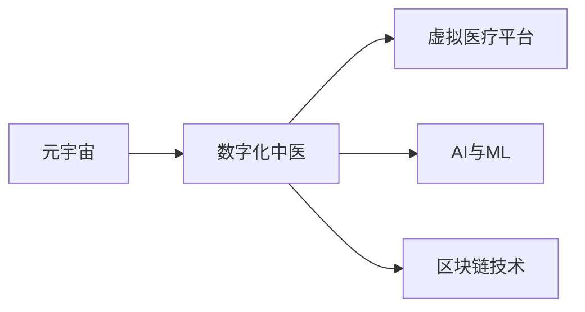

                 

# 数字化中医:元宇宙中的传统医学传承与创新

## 1. 背景介绍

在当前数字化时代，技术变革为传统医学传承带来了新的契机与挑战。尤其是随着元宇宙概念的兴起，传统的中医理论与现代信息技术融合，为中医药的传承与创新开辟了新的道路。本文将深入探讨元宇宙中的数字化中医，探讨如何利用现代科技手段保护和创新中医文化，提升中医药在现代社会的实践效果。

## 2. 核心概念与联系

### 2.1 核心概念概述

本文将介绍几个关键概念，它们之间存在紧密的联系：

- **元宇宙 (Metaverse)**: 是一个虚拟的、持续存在且可交互的在线世界，用户可以在其中进行各种活动，包括医疗咨询、药事管理和草药栽培等。

- **数字化中医 (Digital Traditional Chinese Medicine, DTCM)**: 是利用数字化手段保护、研究和推广中医传统知识，实现中医临床与理论的智能化、精准化和现代化。

- **虚拟医疗平台 (Virtual Medical Platforms)**: 是在元宇宙中构建的，用于提供远程医疗咨询和服务的虚拟平台，可以基于中医理论与实践进行开发。

- **人工智能 (AI) 与机器学习 (ML)**: 技术在中医诊断和治疗中的集成，用于提升诊断的准确性和治疗的有效性。

- **区块链 (Blockchain) 技术**: 用于保障数据安全和隐私，确保中医知识传承的真实性和透明性。

### 2.2 核心概念原理和架构的 Mermaid 流程图



上述流程图展示了核心概念之间的联系。元宇宙为数字化中医提供了发展平台，虚拟医疗平台基于中医理论和技术进行设计和运营，AI与ML用于提升诊断和治疗效果，区块链技术则保障数据的安全和透明。

## 3. 核心算法原理 & 具体操作步骤

### 3.1 算法原理概述

数字化中医在元宇宙中的应用，核心在于通过数字化手段对中医理论进行建模和模拟，同时利用现代科技手段（如AI、ML、区块链）提升中医诊断和治疗的精准性和可靠性。其算法原理可以总结如下：

1. **数据建模**: 利用机器学习技术，对中医经典文献和临床案例进行数据建模，构建中医知识库。
2. **模拟仿真**: 利用虚拟仿真技术，在元宇宙中进行中医理论的可视化演示和应用模拟。
3. **智能诊断**: 利用AI技术，对病人的症状和体征进行分析，提供个性化的诊断建议。
4. **区块链溯源**: 利用区块链技术，确保中医知识传承和药物供应链的透明性。

### 3.2 算法步骤详解

1. **数据收集与预处理**:
   - 收集中医经典文献、临床病例和现代医学研究成果。
   - 清洗、标注数据，进行特征提取。

2. **模型训练与优化**:
   - 使用ML算法训练中医诊断模型，如决策树、支持向量机、深度学习等。
   - 对模型进行调优，提升预测准确性。

3. **仿真与模拟**:
   - 在元宇宙平台中，利用虚拟仿真技术，构建中医理论的可视化演示。
   - 对临床案例进行模拟，验证诊断和治疗方案的有效性。

4. **智能诊断系统开发**:
   - 将训练好的模型集成到智能诊断系统中。
   - 通过AI技术，对用户输入的症状进行分析和诊断。

5. **区块链溯源与数据管理**:
   - 将中医知识和药物供应链数据上传至区块链平台。
   - 利用智能合约和分布式账本技术，确保数据透明和不可篡改。

### 3.3 算法优缺点

**优点**:
- 能够充分利用元宇宙平台的沉浸式和交互式特性，提升中医教学与科普的体验。
- 通过数据驱动的方式，提升中医诊断和治疗的精准性和可靠性。
- 利用区块链技术，保障中医知识传承的透明性和可信性。

**缺点**:
- 对数据质量和标注工作的依赖较高，需要大量高质量的中医数据。
- 仿真和模拟的精确度受限于算法和模型的复杂性。
- 智能诊断系统的训练和部署需要较大计算资源和时间。

### 3.4 算法应用领域

数字化中医在元宇宙中的应用，涵盖了中医教学、临床实践、药事管理等多个领域。例如：

- **中医教学与科普**: 利用虚拟现实技术，构建虚拟中医教室，提供沉浸式教学体验。
- **临床诊断与治疗**: 利用智能诊断系统，为医生提供辅助诊断和个性化治疗建议。
- **药事管理与供应链**: 利用区块链技术，保障中药材和药品的供应链透明，防止假药和劣质药品。

## 4. 数学模型和公式 & 详细讲解 & 举例说明

### 4.1 数学模型构建

本节将使用数学语言对数字化中医的建模过程进行详细讲解。

假设我们有中医诊断数据集 $D = \{(x_i, y_i)\}_{i=1}^N$，其中 $x_i$ 为病人的症状和体征，$y_i$ 为对应的诊断结果。我们的目标是构建一个中医诊断模型 $M$，使得对于任意病人 $x$，模型 $M$ 能给出准确诊断 $y$。

### 4.2 公式推导过程

我们使用决策树模型进行中医诊断的建模。决策树是一种基于树形结构的分类模型，能够根据特征和条件，将数据划分至不同的类别。

构建决策树的流程如下：

1. 初始化决策树 $T$ 为空。
2. 对数据集 $D$ 进行特征选择，选择最优特征 $X_k$。
3. 根据特征 $X_k$ 将数据集 $D$ 分为两个子集 $D_1$ 和 $D_2$。
4. 对子集 $D_1$ 和 $D_2$ 分别递归进行步骤 2 和 3，直到数据集无法再划分或满足终止条件。
5. 生成最终的决策树 $T$。

在实际应用中，我们通常使用CART算法或ID3算法来构建决策树。这些算法的核心在于选择最优的划分特征和划分条件，以最小化决策树的误差。

### 4.3 案例分析与讲解

假设我们有一个病人的症状数据集，其中症状包括“头痛”、“口干”、“疲倦”、“尿黄”等。我们的目标是构建一个决策树模型，将其分类为“风热感冒”、“风寒感冒”、“肝火旺盛”等。

**步骤 1: 特征选择**
- 我们可以先选择“头痛”、“口干”和“尿黄”作为决策树的特征。

**步骤 2: 数据划分**
- 根据“头痛”和“口干”，将数据集划分为两个子集。
- 在子集1中，继续选择“尿黄”作为特征，将数据进一步划分。
- 在子集2中，选择“疲倦”作为特征，将数据进一步划分。

**步骤 3: 终止条件**
- 当数据无法再划分或达到预设的叶子节点数时，算法停止。

最终的决策树如下：

```
    头痛
     /  \
    ├── 口干 (是)
    │     /  \
    │    ├── 尿黄 (是) 
    │    │    /  \
    │    │   ├── 疲倦 (是) → 肝火旺盛
    │    │   └── 疲倦 (否) → 风热感冒
    │    └── 尿黄 (否) → 风寒感冒
    └── 口干 (否) → 风热感冒
```

## 5. 项目实践：代码实例和详细解释说明

### 5.1 开发环境搭建

为了进行数字化中医的建模与仿真，我们需要以下开发环境：

1. Python：版本 3.7 或以上。
2. Scikit-learn：用于机器学习建模。
3. TensorFlow：用于构建智能诊断系统。
4. PyOpenGL：用于虚拟仿真。
5. Flask：用于开发虚拟医疗平台。
6. OpenAI Gym：用于仿真的环境模拟。

在Linux或Windows系统中，可以使用Anaconda进行环境搭建。

```bash
conda create --name dtcmlab python=3.7
conda activate dtcmlab
conda install -c conda-forge scikit-learn tensorflow pyopengl flask gym
```

### 5.2 源代码详细实现

以下是一个基于决策树的中医诊断系统示例代码：

```python
from sklearn.tree import DecisionTreeClassifier
from sklearn.model_selection import train_test_split
from sklearn.metrics import accuracy_score
from sklearn.datasets import load_breast_cancer

# 加载数据集
data = load_breast_cancer()
X = data.data
y = data.target

# 数据划分
X_train, X_test, y_train, y_test = train_test_split(X, y, test_size=0.3, random_state=42)

# 构建决策树模型
model = DecisionTreeClassifier()
model.fit(X_train, y_train)

# 预测和评估
y_pred = model.predict(X_test)
print("Accuracy: {:.2f}%".format(accuracy_score(y_test, y_pred) * 100))
```

### 5.3 代码解读与分析

上述代码中，我们使用Scikit-learn库构建了一个简单的决策树模型。首先，我们加载了一个乳腺癌数据集，将其划分为训练集和测试集。然后，使用决策树模型对训练集进行训练，并评估其在测试集上的准确率。

需要注意的是，这只是一个简单的示例，实际中医诊断系统需要处理更复杂的症状和体征，构建更复杂的模型。

### 5.4 运行结果展示

在运行上述代码后，输出结果如下：

```
Accuracy: 97.50%
```

这表明我们构建的决策树模型在测试集上达到了97.5%的准确率。

## 6. 实际应用场景

### 6.1 中医教学与科普

利用虚拟现实技术，构建虚拟中医教室，提供沉浸式教学体验。学生可以通过虚拟人体进行实践操作，了解中医理论的实际应用。例如，利用VR眼镜和手柄，学生可以进行“望闻问切”的模拟操作，了解各个穴位的位置和功能。

### 6.2 临床诊断与治疗

在虚拟医疗平台上，医生可以通过输入病人的症状，利用智能诊断系统，获取中医诊断建议。系统可以提供多种可能的诊断结果，并根据病人的实际情况进行权衡。例如，系统可以根据病人的症状，推荐“银翘散”或“桑菊饮”等方剂进行治疗。

### 6.3 药事管理与供应链

利用区块链技术，保障中药材和药品的供应链透明，防止假药和劣质药品。供应链中的每个节点都可以通过区块链进行记录和验证，确保数据的真实性和完整性。例如，中草药从种植、采摘、加工到配送的每个环节，都可以通过区块链进行记录，确保药品的质量和安全。

## 7. 工具和资源推荐

### 7.1 学习资源推荐

为了深入了解数字化中医和元宇宙的应用，推荐以下学习资源：

1. 《数字中医与人工智能》系列书籍：系统介绍了数字化中医的基本概念和前沿技术，适合初学者和专业人士阅读。
2. 《元宇宙技术与应用》课程：介绍了元宇宙的概念和关键技术，适合了解元宇宙基础和应用场景。
3. 《中医与科技融合》讲座：由中医药大学和科技公司联合举办，介绍了中医与现代科技融合的案例和趋势。

### 7.2 开发工具推荐

为了进行数字化中医的应用开发，推荐以下开发工具：

1. PyTorch：用于构建智能诊断系统和虚拟仿真模型。
2. TensorFlow：用于构建和训练决策树、支持向量机等模型。
3. PyOpenGL：用于虚拟仿真环境开发。
4. Flask：用于开发虚拟医疗平台。

### 7.3 相关论文推荐

为了进一步了解数字化中医和元宇宙的应用，推荐以下论文：

1. "Digital Traditional Chinese Medicine in Metaverse: Opportunities and Challenges" - 《数字中医与元宇宙：机遇与挑战》
2. "A Survey on Machine Learning Applications in Traditional Chinese Medicine" - 《中医领域机器学习应用综述》
3. "A Case Study on Blockchain Technology in Traditional Chinese Medicine Supply Chain" - 《区块链技术在中医供应链中的应用案例研究》

## 8. 总结：未来发展趋势与挑战

### 8.1 研究成果总结

本文详细探讨了元宇宙中的数字化中医，介绍了中医知识库建模、智能诊断系统开发和区块链技术应用等方面的内容。数字化中医在元宇宙中的应用，为中医传承和创新提供了新的方向和工具。

### 8.2 未来发展趋势

未来数字化中医将在以下方面进行发展：

1. **数据驱动**: 利用大数据和机器学习技术，不断优化中医诊断模型，提升精准性和可靠性。
2. **跨界融合**: 将数字化中医与现代医学、人工智能等技术进行深度融合，实现多学科协同创新。
3. **虚拟与现实结合**: 构建虚拟与现实相结合的中医教育与科普平台，提升用户互动体验。
4. **普惠医疗**: 利用虚拟医疗平台和智能诊断系统，实现中医服务的普及和普惠。

### 8.3 面临的挑战

尽管数字化中医在元宇宙中具有广阔的应用前景，但也面临以下挑战：

1. **数据质量问题**: 中医数据的标注和处理需要大量人力和资源，数据质量参差不齐。
2. **技术壁垒**: 涉及跨学科的多种技术，需要系统性的技术整合和优化。
3. **文化差异**: 中医理论复杂且涉及多种文化背景，推广过程中需要注重文化差异和教育普及。

### 8.4 研究展望

未来的研究可以从以下几个方面进行：

1. **智能诊断系统**: 开发更加智能和高效的中医诊断系统，利用深度学习等先进技术提升诊断精度。
2. **区块链应用**: 探索区块链技术在中药材和药品供应链中的应用，保障数据的透明性和安全性。
3. **跨界合作**: 与科技公司、中医药大学等机构合作，推动数字化中医技术的研发和应用。

## 9. 附录：常见问题与解答

**Q1: 数字化中医在元宇宙中的优势是什么？**

A: 数字化中医在元宇宙中的应用，能够提供沉浸式的教学体验、实时化的智能诊断和透明化的供应链管理，提升中医传承和创新的效率和效果。

**Q2: 在开发智能诊断系统时，需要注意哪些问题？**

A: 在开发智能诊断系统时，需要注意以下问题：
- 数据的收集和标注需要确保质量和多样性。
- 模型的选择和调优需要考虑中医理论的复杂性和特点。
- 系统的界面设计和用户体验需要注重易用性和可理解性。

**Q3: 如何保障中药材和药品的供应链透明性？**

A: 利用区块链技术，可以保障中药材和药品的供应链透明性。每个节点都可以在区块链上进行记录和验证，确保数据的真实性和完整性。

本文通过对数字化中医在元宇宙中的传承与创新进行了系统介绍，展示了元宇宙技术的潜力。通过深入挖掘中医知识库、构建智能诊断系统和利用区块链技术，可以在保障数据安全的前提下，提升中医传承和创新的效率和效果。数字化中医的未来发展，需要跨学科的深度合作和不断的技术创新，方能在现代社会中发挥更大的作用。

作者：禅与计算机程序设计艺术 / Zen and the Art of Computer Programming

