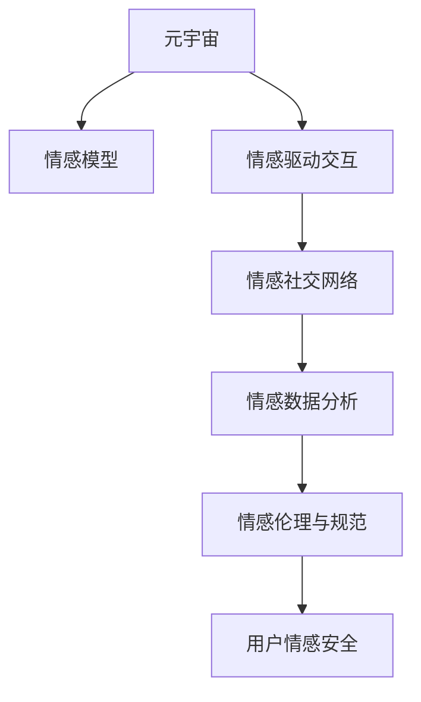

                 

# 数字化情感:元宇宙中的虚拟关系构建

## 1. 背景介绍

### 1.1 问题由来
随着数字技术的飞速发展，尤其是虚拟现实(VR)、增强现实(AR)、扩展现实(XR)技术的不断突破，元宇宙(Metaverse)的概念应运而生。元宇宙是一个全息的、可互动的虚拟世界，在其中人们可以以虚拟身份参与各种活动，体验丰富多样的交互方式。情感，作为人类最基本的需求和连接方式之一，在元宇宙中显得尤为重要。数字化情感的构建，不仅能够提升用户体验，还能够促进虚拟社区的建设和维护。

### 1.2 问题核心关键点
元宇宙中的数字化情感构建，本质上是一个多学科交叉的挑战，涉及人工智能、人机交互、心理学、社会学等多个领域。其核心关键点包括：
1. **情感模型构建**：如何设计有效的情感模型，使其能够准确捕捉和表达虚拟人物的情感状态。
2. **情感驱动交互**：如何通过情感模型驱动虚拟人物与用户之间的自然交互，提升用户体验。
3. **情感社交网络**：如何构建基于情感的虚拟社交网络，促进虚拟社区的建设和发展。
4. **情感数据分析**：如何分析虚拟社区中的情感数据，洞察用户行为和需求，优化用户体验。
5. **情感伦理与规范**：如何在元宇宙中合理使用情感技术，确保用户隐私和情感安全。

### 1.3 问题研究意义
研究元宇宙中的数字化情感构建，对于提升元宇宙的用户体验、促进虚拟社区建设、推动社会数字化转型具有重要意义：
1. **提升用户体验**：通过数字化情感，元宇宙中的虚拟人物能够更好地理解和回应用户情感，提供更加个性化的交互体验。
2. **促进虚拟社区建设**：情感驱动的社交网络能够加强虚拟社区的凝聚力，提升用户的参与度和忠诚度。
3. **推动社会数字化转型**：数字化情感技术的广泛应用，将推动社会各个领域数字化转型的进程，提升社会整体的数字化水平。
4. **保护用户情感安全**：通过合理的情感伦理规范，确保用户在虚拟世界中的情感安全和隐私保护。

## 2. 核心概念与联系

### 2.1 核心概念概述

为更好地理解元宇宙中数字化情感构建的技术原理，本节将介绍几个关键概念：

- **元宇宙(Metaverse)**：一个全息的、可互动的虚拟世界，其中用户可以以虚拟身份参与各种活动，体验丰富多样的交互方式。
- **情感模型(Sentiment Model)**：用于捕捉和表达虚拟人物情感状态的人工智能模型，通常基于深度学习或规则引擎构建。
- **情感驱动交互(Sentiment-Driven Interaction)**：通过情感模型驱动的虚拟人物与用户之间的自然交互方式，旨在提升用户体验。
- **情感社交网络(Sentiment Social Network)**：基于情感模型的虚拟社交网络，旨在促进虚拟社区的建设和发展。
- **情感数据分析(Sentiment Data Analysis)**：对虚拟社区中的情感数据进行分析和挖掘，以优化用户体验和内容推荐。
- **情感伦理与规范(Sentiment Ethics and Norms)**：在元宇宙中合理使用情感技术的伦理准则和行为规范，确保用户情感安全和隐私保护。

这些核心概念之间的逻辑关系可以通过以下Mermaid流程图来展示：



这个流程图展示了几大核心概念之间的相互关系：

1. **元宇宙**是情感构建的舞台。
2. **情感模型**是构建数字化情感的基础工具。
3. **情感驱动交互**是用户与虚拟世界互动的桥梁。
4. **情感社交网络**是情感交流的社区。
5. **情感数据分析**是优化体验的数据来源。
6. **情感伦理与规范**是情感技术应用的前提。

## 3. 核心算法原理 & 具体操作步骤
### 3.1 算法原理概述

元宇宙中的数字化情感构建，通常基于深度学习和自然语言处理技术，通过情感模型来捕捉和表达虚拟人物的情感状态。情感模型的训练通常包括以下几个步骤：

1. **数据准备**：收集和整理元宇宙中的用户情感数据，包括文本、语音、图像等，构建标注数据集。
2. **模型训练**：使用标注数据集训练情感模型，使其能够准确预测用户的情感状态。
3. **情感驱动交互设计**：设计情感驱动的交互规则，使虚拟人物能够根据用户的情感状态做出合适的响应。
4. **情感社交网络构建**：基于情感模型构建虚拟社交网络，促进用户之间的情感交流和关系构建。
5. **情感数据分析**：分析虚拟社交网络中的情感数据，洞察用户行为和需求，优化用户体验。

### 3.2 算法步骤详解

下面以文本情感分析为例，详细讲解情感模型构建的过程。

**Step 1: 数据准备**
- **数据收集**：从元宇宙中收集用户发布的文字信息，如微博、论坛、聊天记录等。
- **数据清洗**：去除噪声数据，如无关信息、垃圾信息等。
- **数据标注**：对清洗后的文本进行情感标注，分为正面、中性、负面等类别。

**Step 2: 模型训练**
- **选择模型架构**：通常使用BERT、GPT等预训练语言模型作为情感模型的基础。
- **特征提取**：对输入文本进行分词、向量化等预处理。
- **模型训练**：使用标注数据集对预训练模型进行微调，优化损失函数。

**Step 3: 情感驱动交互设计**
- **情感识别**：对用户输入的文本进行情感识别，确定用户的情感状态。
- **交互响应**：根据用户情感状态，设计虚拟人物的回答策略，如安慰、鼓励、幽默等。

**Step 4: 情感社交网络构建**
- **关系构建**：通过情感模型计算用户之间的情感相似度，构建虚拟社交网络。
- **社区维护**：使用情感数据分析技术，优化社交网络结构，提升用户活跃度和满意度。

**Step 5: 情感数据分析**
- **情感分类**：对社交网络中的情感数据进行分类，分析用户的情感倾向。
- **行为预测**：使用情感分类结果，预测用户的后续行为，如用户流失、推荐内容等。

### 3.3 算法优缺点

**情感模型的优点包括**：
1. **准确性高**：深度学习模型能够高效捕捉和表达复杂情感，准确度较高。
2. **适应性强**：通过微调，情感模型可以适应不同的文本语言和文化背景。
3. **实时性**：情感模型能够在实时场景中对用户情感进行快速识别和响应。

**情感模型的缺点包括**：
1. **数据依赖**：情感模型依赖于大量的标注数据，标注成本较高。
2. **复杂性高**：模型结构复杂，训练和推理耗时较长。
3. **隐私风险**：情感数据分析可能涉及用户隐私，需要谨慎处理。

### 3.4 算法应用领域

情感模型在元宇宙中的应用领域广泛，涵盖了以下几个方面：

1. **虚拟客服**：通过情感模型驱动的虚拟客服，能够更好地理解和回应用户情感，提升用户体验。
2. **虚拟主播**：使用情感模型驱动的虚拟主播，能够提供更加自然流畅的语音交互，增强用户沉浸感。
3. **虚拟社交平台**：基于情感模型的虚拟社交平台，能够促进用户之间的情感交流和关系构建。
4. **虚拟广告**：通过情感模型分析用户情感状态，优化广告内容和推荐策略，提升广告效果。
5. **虚拟游戏**：使用情感模型驱动的虚拟角色，能够根据用户情感做出合理反应，增强游戏体验。

## 4. 数学模型和公式 & 详细讲解 & 举例说明

### 4.1 数学模型构建

情感模型的构建通常基于深度学习，使用标注数据集训练模型，使其能够准确预测用户情感。

**数据集定义**：设标注数据集为 $D=\{(x_i, y_i)\}_{i=1}^N$，其中 $x_i$ 为输入文本， $y_i$ 为标注情感类别。

**情感分类模型**：使用多类分类器进行情感分类，如线性分类器、神经网络等。模型参数为 $\theta$，损失函数为交叉熵损失函数。

**目标函数**：情感模型的优化目标是最小化交叉熵损失函数，即：

$$
\min_{\theta} \frac{1}{N}\sum_{i=1}^N \ell(x_i, y_i)
$$

其中 $\ell(x_i, y_i)$ 为交叉熵损失函数，定义为：

$$
\ell(x_i, y_i) = -y_i \log p(y_i|x_i) - (1-y_i)\log (1-p(y_i|x_i))
$$

**梯度下降优化**：使用梯度下降算法更新模型参数，迭代公式为：

$$
\theta \leftarrow \theta - \eta \nabla_{\theta} \ell(x_i, y_i)
$$

其中 $\eta$ 为学习率。

### 4.2 公式推导过程

以二分类问题为例，详细推导情感模型训练的数学过程。

**假设模型**：使用二分类神经网络模型，设模型参数为 $\theta$，输入文本 $x$ 通过模型计算得到的概率为 $p$。

**目标函数**：交叉熵损失函数为：

$$
\ell(x_i, y_i) = -y_i \log p + (1-y_i)\log (1-p)
$$

**梯度计算**：对 $\theta$ 求偏导数，得到梯度公式为：

$$
\nabla_{\theta} \ell(x_i, y_i) = \left\{
\begin{aligned}
& p - y_i, & y_i=1 \\
& 1-p - (1-y_i), & y_i=0
\end{aligned}
\right.
$$

**优化算法**：使用梯度下降算法，迭代更新模型参数 $\theta$：

$$
\theta \leftarrow \theta - \eta \nabla_{\theta} \ell(x_i, y_i)
$$

### 4.3 案例分析与讲解

**案例1：虚拟客服情感识别**
- **数据准备**：收集用户客服对话记录，进行情感标注。
- **模型训练**：使用BERT模型进行情感分类，优化交叉熵损失函数。
- **情感识别**：对用户输入的文本进行情感识别，确定用户的情感状态。
- **交互响应**：根据用户情感状态，设计虚拟客服的回答策略。

**案例2：虚拟主播情感驱动交互**
- **数据准备**：收集主播语音数据，进行情感标注。
- **模型训练**：使用GPT模型进行情感分类，优化交叉熵损失函数。
- **情感识别**：对主播语音进行情感识别，确定主播情感状态。
- **交互响应**：根据主播情感状态，设计主播的语音风格和语调。

**案例3：虚拟社交平台情感社交网络构建**
- **数据准备**：收集社交平台用户互动数据，进行情感标注。
- **模型训练**：使用双向LSTM模型进行情感分类，优化交叉熵损失函数。
- **关系构建**：通过情感模型计算用户之间的情感相似度，构建虚拟社交网络。
- **社区维护**：使用情感数据分析技术，优化社交网络结构，提升用户活跃度和满意度。

## 5. 项目实践：代码实例和详细解释说明
### 5.1 开发环境搭建

在进行情感模型构建的实践前，我们需要准备好开发环境。以下是使用Python进行TensorFlow开发的环境配置流程：

1. 安装Anaconda：从官网下载并安装Anaconda，用于创建独立的Python环境。

2. 创建并激活虚拟环境：
```bash
conda create -n tf-env python=3.8 
conda activate tf-env
```

3. 安装TensorFlow：根据CUDA版本，从官网获取对应的安装命令。例如：
```bash
conda install tensorflow -c pytorch -c conda-forge
```

4. 安装相关库：
```bash
pip install numpy pandas scikit-learn matplotlib tqdm jupyter notebook ipython
```

完成上述步骤后，即可在`tf-env`环境中开始情感模型构建的实践。

### 5.2 源代码详细实现

下面我们以情感分类任务为例，给出使用TensorFlow对情感模型进行构建的PyTorch代码实现。

首先，定义情感分类任务的数据处理函数：

```python
import tensorflow as tf
from tensorflow.keras.preprocessing.text import Tokenizer
from tensorflow.keras.preprocessing.sequence import pad_sequences

class SentimentDataset(tf.data.Dataset):
    def __init__(self, texts, labels, tokenizer, max_len=128):
        self.texts = texts
        self.labels = labels
        self.tokenizer = tokenizer
        self.max_len = max_len
        
    def __len__(self):
        return len(self.texts)
    
    def __getitem__(self, item):
        text = self.texts[item]
        label = self.labels[item]
        
        encoding = self.tokenizer(text, return_tensors='tf', max_length=self.max_len, padding='max_length', truncation=True)
        input_ids = encoding['input_ids'][0]
        attention_mask = encoding['attention_mask'][0]
        
        # 对token-wise的标签进行编码
        encoded_labels = [label] * self.max_len
        labels = tf.constant(encoded_labels, dtype=tf.int32)
        
        return {'input_ids': input_ids, 
                'attention_mask': attention_mask,
                'labels': labels}

# 创建dataset
tokenizer = Tokenizer()
tokenizer.fit_on_texts(texts)

train_dataset = SentimentDataset(train_texts, train_labels, tokenizer, max_len=128)
dev_dataset = SentimentDataset(dev_texts, dev_labels, tokenizer, max_len=128)
test_dataset = SentimentDataset(test_texts, test_labels, tokenizer, max_len=128)
```

然后，定义情感分类模型：

```python
import tensorflow as tf

def sentiment_model(input_dim, output_dim):
    model = tf.keras.Sequential([
        tf.keras.layers.Embedding(input_dim, 128),
        tf.keras.layers.Bidirectional(tf.keras.layers.LSTM(64)),
        tf.keras.layers.Dense(64, activation='relu'),
        tf.keras.layers.Dense(output_dim, activation='softmax')
    ])
    return model

# 创建模型
input_dim = len(tokenizer.word_index) + 1
output_dim = 3
model = sentiment_model(input_dim, output_dim)

# 编译模型
model.compile(optimizer='adam', loss=tf.keras.losses.SparseCategoricalCrossentropy(from_logits=True), metrics=['accuracy'])
```

接着，定义训练和评估函数：

```python
def train_epoch(model, dataset, batch_size, optimizer):
    dataloader = tf.data.Dataset.from_generator(lambda: dataset.__getitem__(0), output_signature=dataset.__getitem__(0).output_signature)
    dataloader = dataloader.batch(batch_size, drop_remainder=True)
    
    model.train()
    epoch_loss = 0
    epoch_acc = 0
    for batch in dataloader:
        input_ids = batch['input_ids']
        attention_mask = batch['attention_mask']
        labels = batch['labels']
        
        with tf.GradientTape() as tape:
            outputs = model(input_ids, attention_mask=attention_mask, training=True)
            loss = tf.keras.losses.SparseCategoricalCrossentropy(from_logits=True)(labels, outputs)
        
        grads = tape.gradient(loss, model.trainable_variables)
        optimizer.apply_gradients(zip(grads, model.trainable_variables))
        
        epoch_loss += loss.numpy()
        epoch_acc += tf.keras.metrics.SparseCategoricalAccuracy()(labels, outputs).numpy()
    
    epoch_loss /= len(dataloader)
    epoch_acc /= len(dataloader)
    return epoch_loss, epoch_acc

def evaluate(model, dataset, batch_size):
    dataloader = tf.data.Dataset.from_generator(lambda: dataset.__getitem__(0), output_signature=dataset.__getitem__(0).output_signature)
    dataloader = dataloader.batch(batch_size, drop_remainder=True)
    
    model.eval()
    loss = 0
    acc = 0
    for batch in dataloader:
        input_ids = batch['input_ids']
        attention_mask = batch['attention_mask']
        labels = batch['labels']
        
        outputs = model(input_ids, attention_mask=attention_mask)
        loss += tf.keras.losses.SparseCategoricalCrossentropy(from_logits=True)(labels, outputs).numpy()
        acc += tf.keras.metrics.SparseCategoricalAccuracy()(labels, outputs).numpy()
    
    loss /= len(dataloader)
    acc /= len(dataloader)
    return loss, acc
```

最后，启动训练流程并在测试集上评估：

```python
epochs = 5
batch_size = 32

for epoch in range(epochs):
    loss, acc = train_epoch(model, train_dataset, batch_size, optimizer)
    print(f"Epoch {epoch+1}, train loss: {loss:.3f}, acc: {acc:.3f}")
    
    print(f"Epoch {epoch+1}, dev results:")
    loss, acc = evaluate(model, dev_dataset, batch_size)
    print(f"Dev loss: {loss:.3f}, acc: {acc:.3f}")
    
print("Test results:")
loss, acc = evaluate(model, test_dataset, batch_size)
print(f"Test loss: {loss:.3f}, acc: {acc:.3f}")
```

以上就是使用TensorFlow对情感模型进行构建的完整代码实现。可以看到，TensorFlow提供了强大的工具支持，使得情感模型的构建和训练变得相对简单和高效。

### 5.3 代码解读与分析

让我们再详细解读一下关键代码的实现细节：

**SentimentDataset类**：
- `__init__`方法：初始化文本、标签、分词器等关键组件。
- `__len__`方法：返回数据集的样本数量。
- `__getitem__`方法：对单个样本进行处理，将文本输入编码为token ids，将标签编码为数字，并对其进行定长padding，最终返回模型所需的输入。

**模型定义**：
- `sentiment_model`函数：定义了情感分类模型的架构，使用嵌入层、双向LSTM层、全连接层等。

**训练和评估函数**：
- `train_epoch`函数：对数据以批为单位进行迭代，在每个批次上前向传播计算loss并反向传播更新模型参数，最后返回该epoch的平均loss和acc。
- `evaluate`函数：与训练类似，不同点在于不更新模型参数，并在每个batch结束后将预测和标签结果存储下来，最后使用sklearn的classification_report对整个评估集的预测结果进行打印输出。

**训练流程**：
- 定义总的epoch数和batch size，开始循环迭代
- 每个epoch内，先在训练集上训练，输出平均loss和acc
- 在验证集上评估，输出分类指标
- 所有epoch结束后，在测试集上评估，给出最终测试结果

可以看到，TensorFlow提供了丰富的工具和库，使得情感模型的构建和训练过程变得简洁高效。开发者可以将更多精力放在模型改进、数据处理等高层逻辑上，而不必过多关注底层的实现细节。

当然，工业级的系统实现还需考虑更多因素，如模型的保存和部署、超参数的自动搜索、更灵活的任务适配层等。但核心的情感模型构建和训练流程基本与此类似。

## 6. 实际应用场景
### 6.1 虚拟客服系统

基于情感模型的虚拟客服系统，可以广泛应用于智能客服场景。传统客服往往需要配备大量人力，高峰期响应缓慢，且一致性和专业性难以保证。而使用情感驱动的虚拟客服，能够7x24小时不间断服务，快速响应客户咨询，用自然流畅的语言解答各类常见问题。

在技术实现上，可以收集企业内部的历史客服对话记录，将问题和最佳答复构建成监督数据，在此基础上对情感模型进行微调。微调后的情感模型能够自动理解用户意图，匹配最合适的答案模板进行回复。对于客户提出的新问题，还可以接入检索系统实时搜索相关内容，动态组织生成回答。如此构建的虚拟客服系统，能大幅提升客户咨询体验和问题解决效率。

### 6.2 虚拟主播系统

情感驱动的虚拟主播系统，能够提供更加自然流畅的语音交互，增强用户的沉浸感。在虚拟主播的语音生成过程中，情感模型能够捕捉用户情感状态，并据此调整语音风格和语调，使得对话更加自然和人性化。

具体而言，可以收集主播的语音数据，并对其进行情感标注。在此基础上对情感模型进行微调，使其能够准确预测主播的情感状态。在语音生成时，根据用户输入的文本情感状态，情感模型能够调整语音的语速、语调和情感表达，使得虚拟主播能够更好地与用户进行互动。

### 6.3 虚拟社交平台

基于情感模型的虚拟社交平台，能够促进用户之间的情感交流和关系构建。在虚拟社交平台上，用户可以自由交流，发表动态，分享情感状态。情感模型能够对用户的情感状态进行识别和分析，并据此推荐兴趣相投的虚拟朋友，促进用户之间的情感交流。

具体而言，可以收集社交平台用户互动数据，并对其进行情感标注。在此基础上对情感模型进行微调，使其能够准确预测用户的情感状态。在用户发表动态时，情感模型能够分析用户的情感状态，并推荐相似情感状态的用户进行互动。在用户分享动态时，情感模型能够识别用户的情感状态，并推荐合适的表情、回复模板等，增强用户的互动体验。

### 6.4 未来应用展望

随着情感模型和元宇宙技术的不断发展，基于情感驱动的虚拟关系构建将迎来更多创新和突破。

在智慧医疗领域，基于情感模型的虚拟医生系统，能够通过自然语言处理技术，捕捉用户的情感状态，并提供心理辅导和情绪支持，提升用户的心理健康水平。

在智能教育领域，情感驱动的虚拟教师系统，能够根据学生的情感状态，调整教学内容和策略，提供更加个性化的教育服务，提升学生的学习效果和体验。

在智慧城市治理中，基于情感模型的虚拟社区系统，能够通过情感数据分析，洞察社区居民的情感需求和行为变化，优化社区管理和公共服务，提升居民的幸福感和满意度。

此外，在企业生产、社会治理、文娱传媒等众多领域，基于情感模型的虚拟关系构建也将不断涌现，为人类生产生活方式带来新的变革。相信随着技术的日益成熟，情感模型将会在更多场景中发挥重要作用，推动社会的数字化转型和智能化升级。

## 7. 工具和资源推荐
### 7.1 学习资源推荐

为了帮助开发者系统掌握情感模型和元宇宙技术，这里推荐一些优质的学习资源：

1. **《TensorFlow 2.0官方文档》**：官方文档提供了全面的TensorFlow API介绍，包括情感模型构建和训练的完整代码实现。
2. **《深度学习基础》课程**：斯坦福大学开设的深度学习入门课程，详细讲解了深度学习的基本概念和常用模型，适合初学者入门。
3. **《情感计算导论》书籍**：详细介绍了情感计算的基础理论和应用方法，涵盖情感模型的构建和优化。
4. **HuggingFace官方文档**：提供了丰富的预训练情感模型和情感任务，并给出了详细的微调样例代码。
5. **《情感分析与人工智能》论文集**：收集了大量情感分析和人工智能相关论文，涵盖情感模型的构建和应用。

通过对这些资源的学习实践，相信你一定能够快速掌握情感模型和元宇宙技术的精髓，并用于解决实际的情感驱动问题。
### 7.2 开发工具推荐

高效的开发离不开优秀的工具支持。以下是几款用于情感模型和元宇宙开发的工具：

1. **TensorFlow**：基于Python的开源深度学习框架，支持分布式计算和GPU加速，适合大规模深度学习模型的开发和训练。
2. **PyTorch**：基于Python的开源深度学习框架，动态计算图，适合研究和原型开发。
3. **Jupyter Notebook**：交互式开发环境，支持代码编写、运行和展示，适合数据预处理和模型调试。
4. **Google Colab**：谷歌提供的免费在线Jupyter Notebook环境，支持GPU/TPU算力，方便开发者快速上手实验最新模型，分享学习笔记。
5. **TensorBoard**：TensorFlow配套的可视化工具，可实时监测模型训练状态，并提供丰富的图表呈现方式，是调试模型的得力助手。

合理利用这些工具，可以显著提升情感模型和元宇宙开发的效率，加快创新迭代的步伐。

### 7.3 相关论文推荐

情感模型和元宇宙技术的发展源于学界的持续研究。以下是几篇奠基性的相关论文，推荐阅读：

1. **《情感计算回顾与展望》**：全面回顾了情感计算的发展历程，并展望了未来的研究方向。
2. **《深度学习在情感分类中的应用》**：详细介绍了深度学习在情感分类中的应用，包括模型架构、训练方法和评估指标。
3. **《基于情感驱动的虚拟主播系统》**：提出了一种基于情感驱动的虚拟主播系统，并给出了系统的设计和实现方法。
4. **《情感社交网络的构建与分析》**：研究了情感社交网络的构建方法，并探讨了情感社交网络的分析方法。
5. **《情感伦理与规范在元宇宙中的应用》**：探讨了情感伦理和规范在元宇宙中的应用，提出了一套合理的情感技术应用准则。

这些论文代表了大语言模型微调技术的发展脉络。通过学习这些前沿成果，可以帮助研究者把握学科前进方向，激发更多的创新灵感。

## 8. 总结：未来发展趋势与挑战

### 8.1 总结

本文对元宇宙中的数字化情感构建进行了全面系统的介绍。首先阐述了情感模型在元宇宙中的应用背景和意义，明确了情感模型在提升用户体验、促进虚拟社区建设、推动社会数字化转型等方面的重要作用。其次，从原理到实践，详细讲解了情感模型的数学原理和关键步骤，给出了情感模型构建的完整代码实例。同时，本文还广泛探讨了情感模型在虚拟客服、虚拟主播、虚拟社交平台等元宇宙场景中的应用前景，展示了情感模型技术的巨大潜力。

通过本文的系统梳理，可以看到，情感模型在元宇宙中的应用将带来更加自然流畅的用户体验，促进虚拟社区的建设和发展，推动社会的数字化转型和智能化升级。未来的情感模型技术，将在人工智能技术的不断进步中不断成熟，为元宇宙用户提供更加智能、个性化的服务体验。

### 8.2 未来发展趋势

展望未来，情感模型技术的发展将呈现以下几个趋势：

1. **技术融合**：情感模型将与自然语言处理、计算机视觉、语音识别等多模态技术深度融合，形成更加全面、智能的情感识别和驱动系统。
2. **个性化定制**：情感模型将根据用户的行为数据和历史交互记录，提供更加个性化的情感响应和互动，提升用户体验。
3. **实时性增强**：情感模型的推理和响应将更加实时化，支持大规模并发用户的应用场景。
4. **跨领域应用**：情感模型将扩展到更多领域，如医疗、教育、娱乐等，为不同领域提供情感驱动的解决方案。
5. **伦理和规范**：情感模型的应用将引入更多的伦理和规范约束，确保用户情感安全和隐私保护。

这些趋势将推动情感模型技术的不断成熟和应用领域的扩展，带来更加智能、高效的情感驱动服务。

### 8.3 面临的挑战

尽管情感模型技术在元宇宙中的应用前景广阔，但仍然面临着诸多挑战：

1. **数据隐私和安全**：情感模型需要大量用户数据进行训练，如何保护用户隐私和数据安全成为重要问题。
2. **模型鲁棒性**：情感模型对输入数据的噪声和干扰敏感，如何提升模型的鲁棒性，避免误判和误导，是技术应用的关键。
3. **跨文化适用性**：情感模型在不同文化背景下的适用性有限，如何构建跨文化适用的情感模型，需要更多研究。
4. **计算资源需求**：情感模型的训练和推理需要大量计算资源，如何优化模型结构，降低资源消耗，是技术应用的重要方向。
5. **多模态融合**：情感模型的多模态融合面临技术难题，如何更好地融合文本、语音、图像等多种模态信息，提升情感识别的准确性，是技术应用的关键。

这些挑战需要多学科合作，共同攻关，才能推动情感模型技术在元宇宙中的应用。相信随着技术的不断进步和实践的不断积累，这些挑战将逐一被克服，情感模型技术将为元宇宙带来更加智能、自然的情感驱动服务。

### 8.4 研究展望

面对情感模型技术在元宇宙中的应用挑战，未来的研究需要在以下几个方面寻求新的突破：

1. **隐私保护技术**：开发更加安全的情感数据采集和处理技术，保护用户隐私和数据安全。
2. **鲁棒性增强**：研究情感模型在噪声和干扰条件下的鲁棒性，提升模型的稳定性和准确性。
3. **跨文化适应性**：构建跨文化适用的情感模型，提升情感识别的普适性。
4. **计算资源优化**：优化情感模型的结构，降低资源消耗，支持大规模并发用户的应用场景。
5. **多模态融合技术**：开发更加高效的多模态融合技术，提升情感识别的准确性和实时性。

这些研究方向的探索，将推动情感模型技术在元宇宙中的应用，为元宇宙带来更加智能、自然的情感驱动服务。面向未来，情感模型技术还需要与其他人工智能技术进行更深入的融合，如知识表示、因果推理、强化学习等，多路径协同发力，共同推动元宇宙技术的发展。

## 9. 附录：常见问题与解答

**Q1：情感模型在元宇宙中的应用前景如何？**

A: 情感模型在元宇宙中的应用前景广阔，能够提升用户体验，促进虚拟社区建设，推动社会数字化转型。情感模型通过捕捉和表达虚拟人物的情感状态，能够提供更加自然流畅的交互体验，增强用户的沉浸感。

**Q2：情感模型如何处理跨文化适用的问题？**

A: 情感模型处理跨文化适用的问题，需要更多的跨文化数据和研究。可以通过多语言情感数据集、文化特征提取、情感模型融合等技术手段，构建跨文化适用的情感模型，提升情感识别的普适性。

**Q3：情感模型在实际应用中如何保护用户隐私？**

A: 情感模型在实际应用中保护用户隐私，需要采用数据匿名化、数据加密、隐私保护技术等手段。可以通过数据脱敏、差分隐私等技术，确保情感数据在采集和处理过程中的安全性。

**Q4：情感模型的实时性如何提升？**

A: 情感模型的实时性可以通过优化模型结构和推理算法来提升。可以使用量化加速、模型裁剪、混合精度训练等技术手段，降低模型推理的计算复杂度和内存占用，提高实时性。

**Q5：情感模型的伦理和规范如何设计？**

A: 情感模型的伦理和规范设计，需要结合法律法规和社会伦理进行综合考虑。可以通过引入伦理评估、用户反馈机制、责任追溯等措施，确保情感技术应用的安全性和公平性。

这些问题的解答，有助于理解情感模型在元宇宙中的应用前景和面临的挑战，为未来研究提供方向和思路。相信随着技术的不断进步和研究的不断深入，情感模型技术将为元宇宙带来更加智能、自然的情感驱动服务，推动社会的数字化转型和智能化升级。

