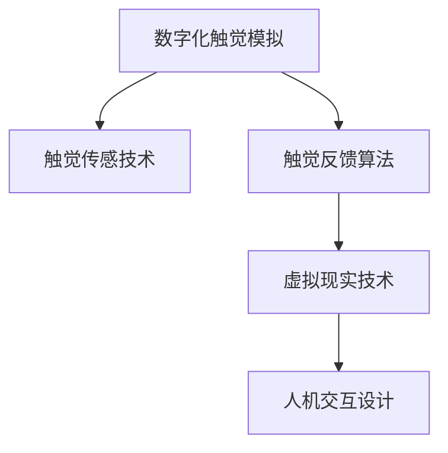

                 

# 数字化触觉模拟创业：虚拟世界的真实触感

> 关键词：数字化触觉模拟, 虚拟现实(VR), 触觉反馈, 物理引擎, 机器学习, 用户交互, 人机交互, 触觉传感技术, 工业应用, 医疗健康

## 1. 背景介绍

### 1.1 问题由来

随着虚拟现实(VR)和增强现实(AR)技术的快速发展，用户体验逐渐从视觉沉浸向全感官沉浸转变。传统VR设备只能提供视觉和听觉的沉浸，无法提供真实的触觉反馈，极大地限制了用户体验和应用场景。尤其是在游戏、医疗、工业等高度依赖触觉反馈的领域，触觉模拟技术的应用需求愈发迫切。

数字化触觉模拟技术旨在通过数字化手段模拟真实的触觉反馈，以模拟现实中的物理交互过程。该技术可以显著提升VR/AR设备的沉浸感和交互性，拓展应用领域，提升用户体验。因此，该领域成为了数字创业的新热门，吸引了众多技术公司和投资机构的关注。

### 1.2 问题核心关键点

数字化触觉模拟创业的核心关键点在于如何将触觉反馈与数字化技术结合起来，实现虚拟世界的真实触感。主要包括以下几个方面：

- 触觉传感技术：如何获取用户交互时的触觉信息。
- 触觉反馈算法：如何将触觉信息转化为虚拟世界的触觉反馈。
- 虚拟现实技术：如何将触觉反馈与虚拟场景相结合。
- 人机交互设计：如何设计自然、高效的用户交互界面。

这些关键点相互关联，共同构成了数字化触觉模拟技术的基础。

### 1.3 问题研究意义

数字化触觉模拟技术在提升用户体验、拓展应用场景、促进工业创新等方面具有重要意义：

- 提升用户体验：通过提供真实的触觉反馈，使得虚拟体验更加沉浸，提升用户的游戏、培训、康复等体验质量。
- 拓展应用场景：触觉模拟技术可以应用于游戏、医疗、工业、教育等多个领域，推动这些领域的发展和创新。
- 促进工业创新：通过触觉模拟技术，工业设备可以实现远程操作、远程维护、虚拟培训等，提升工业生产的智能化水平。

## 2. 核心概念与联系

### 2.1 核心概念概述

为更好地理解数字化触觉模拟创业的核心技术，本节将介绍几个密切相关的核心概念：

- **数字化触觉模拟**：通过数字化手段模拟真实触觉反馈的过程，在虚拟环境中实现触觉交互。
- **触觉传感技术**：用于获取用户交互时触觉信息的传感技术，包括力传感、应变片、电容传感等。
- **触觉反馈算法**：将触觉信息转化为虚拟世界触觉反馈的算法，通常结合物理引擎和机器学习技术。
- **虚拟现实技术**：将虚拟世界和触觉反馈相结合，实现沉浸式的人机交互。
- **人机交互设计**：设计自然、高效的用户交互界面，提升用户使用体验。

这些核心概念之间的逻辑关系可以通过以下Mermaid流程图来展示：



这个流程图展示了大触觉模拟技术的关键环节：

1. 数字化触觉模拟系统通过触觉传感技术获取用户交互的触觉信息。
2. 触觉反馈算法将触觉信息转化为虚拟世界中的触觉反馈，并与虚拟场景相结合。
3. 虚拟现实技术将触觉反馈与虚拟环境无缝整合，实现沉浸式交互体验。
4. 人机交互设计提升用户的自然交互体验，增强系统的可用性。

## 3. 核心算法原理 & 具体操作步骤

### 3.1 算法原理概述

数字化触觉模拟的算法原理基于物理引擎和机器学习技术的结合。其核心思想是：通过触觉传感技术获取用户交互的触觉信息，利用物理引擎模拟真实触觉反馈，并结合机器学习算法优化触觉反馈的实时性和准确性。

具体而言，数字化触觉模拟系统包括以下几个关键步骤：

1. **触觉传感**：使用力传感、应变片、电容传感等技术，获取用户交互时的触觉信息。
2. **触觉反馈生成**：将触觉信息转换为虚拟世界中的触觉反馈，通常结合物理引擎模拟触觉效果。
3. **触觉反馈优化**：使用机器学习算法，优化触觉反馈的实时性和准确性，提升用户体验。
4. **虚拟现实融合**：将触觉反馈与虚拟场景结合，实现沉浸式交互。

### 3.2 算法步骤详解

以下我们将详细介绍数字化触觉模拟系统的关键算法步骤：

#### 3.2.1 触觉传感

触觉传感技术是数字化触觉模拟的基础，其关键在于获取用户交互时的触觉信息。常见的触觉传感技术包括：

- **力传感**：通过测量传感器上的力信号，获取用户的触摸力。常用的传感器包括Fforce Sensors和Tactile Sensors。
- **应变片**：利用电阻值的变化测量压力，常用的传感器包括Strain Gauges和FlexSensors。
- **电容传感**：通过测量电容变化，获取用户的触摸位置和压力，常用的传感器包括Touchscreen和Capacitive Sensors。

触觉传感器的数据采集和处理通常需要以下步骤：

1. **传感器校准**：对传感器进行校准，确保数据准确性。
2. **数据采集**：使用传感器获取用户交互时的触觉信息。
3. **数据处理**：对采集到的数据进行预处理，去除噪声，提升数据质量。

#### 3.2.2 触觉反馈生成

触觉反馈生成是将触觉信息转换为虚拟世界中的触觉反馈的过程。常用的触觉反馈生成方法包括：

- **物理引擎模拟**：利用物理引擎模拟触觉效果，如Omniverse和Unity。常用的物理引擎包括刚体、弹簧、阻尼等。
- **神经网络模型**：使用神经网络模型生成触觉反馈，如生成对抗网络（GAN）和自回归模型。

触觉反馈生成的关键步骤包括：

1. **物理模型建立**：建立虚拟世界的物理模型，包括刚体、弹簧、阻尼等。
2. **触觉信息映射**：将触觉信息映射到虚拟世界中的物理模型上，模拟触觉效果。
3. **反馈调整**：根据用户交互反馈，调整触觉反馈的实时性和准确性。

#### 3.2.3 触觉反馈优化

触觉反馈优化是通过机器学习算法，进一步提升触觉反馈的实时性和准确性。常用的机器学习算法包括：

- **深度学习**：使用深度神经网络模型，对触觉反馈进行优化。如卷积神经网络（CNN）和循环神经网络（RNN）。
- **强化学习**：使用强化学习算法，对触觉反馈进行优化。如Deep Q Network（DQN）和Deep Deterministic Policy Gradient（DDPG）。

触觉反馈优化的关键步骤包括：

1. **数据收集**：收集触觉反馈生成的数据，包括触觉信息和触觉反馈效果。
2. **模型训练**：使用机器学习算法，训练触觉反馈生成模型。
3. **模型评估**：评估触觉反馈生成模型的性能，优化模型参数。

#### 3.2.4 虚拟现实融合

虚拟现实融合是将触觉反馈与虚拟场景结合的过程。常用的虚拟现实技术包括：

- **头显设备**：使用头显设备（如Oculus Rift）提供沉浸式虚拟环境。
- **手柄设备**：使用手柄设备（如HTC Vive）进行交互操作。
- **力反馈设备**：使用力反馈设备（如PlayStation DualShock）提供触觉反馈。

虚拟现实融合的关键步骤包括：

1. **虚拟场景搭建**：搭建虚拟场景，包括环境、物体、人物等。
2. **触觉反馈映射**：将触觉反馈映射到虚拟场景中的物理模型上。
3. **用户交互设计**：设计自然、高效的用户交互界面。

### 3.3 算法优缺点

数字化触觉模拟算法具有以下优点：

1. **沉浸式体验**：提供真实的触觉反馈，提升用户体验，使虚拟体验更加沉浸。
2. **多样化应用**：可以应用于游戏、医疗、工业等多个领域，推动这些领域的发展和创新。
3. **智能化交互**：结合机器学习算法，优化触觉反馈的实时性和准确性，提升系统的智能化水平。

同时，该算法也存在以下缺点：

1. **成本较高**：触觉传感技术和虚拟现实设备的价格较高，增加了系统的成本。
2. **技术复杂**：触觉反馈生成和优化的算法较为复杂，需要较强的技术背景。
3. **设备依赖**：依赖特定的头显设备、手柄设备等交互设备，增加了系统的复杂性。

尽管存在这些缺点，数字化触觉模拟技术仍是大触觉模拟创业的重要方向。未来相关研究的重点在于如何降低技术成本，提升设备兼容性，提高算法的实时性和准确性，使触觉模拟技术更广泛地应用于实际场景中。

### 3.4 算法应用领域

数字化触觉模拟技术在多个领域具有广泛的应用前景：

- **游戏行业**：提供沉浸式的游戏体验，提升用户的游戏乐趣。例如，在游戏场景中添加触觉反馈，使玩家能够感受虚拟世界的真实感。
- **医疗健康**：用于虚拟康复训练、远程手术等场景，提升医疗服务的可及性和便利性。例如，在虚拟康复训练中，通过触觉反馈引导用户进行康复训练。
- **工业制造**：用于虚拟操作培训、远程维护等场景，提升工业生产的智能化水平。例如，在虚拟操作培训中，通过触觉反馈模拟设备的运行状态和操作过程。
- **教育培训**：用于虚拟教学和虚拟实验室，提升教学效果和学习体验。例如，在虚拟实验室中，通过触觉反馈模拟实验过程，提升学生的实验技能。

随着技术的不断进步，数字化触觉模拟技术将进一步拓展应用场景，推动各行各业的创新发展。

## 4. 数学模型和公式 & 详细讲解 & 举例说明

### 4.1 数学模型构建

数字化触觉模拟系统的数学模型主要基于物理引擎和机器学习技术的结合。其核心在于将触觉信息映射到虚拟世界中的物理模型上，并通过机器学习算法优化触觉反馈的实时性和准确性。

假设用户交互时的触觉信息为 $\mathbf{F}$，虚拟世界中的物理模型为 $\mathbf{M}$，触觉反馈为 $\mathbf{T}$，则触觉反馈生成的数学模型可以表示为：

$$
\mathbf{T} = f(\mathbf{F}, \mathbf{M})
$$

其中 $f$ 为触觉反馈生成函数，其具体形式取决于触觉反馈生成方法。

### 4.2 公式推导过程

以力反馈生成为例，假设用户交互时的力信号为 $\mathbf{F} = [f_x, f_y, f_z]$，虚拟世界中的物理模型为刚体 $\mathbf{M} = [m_x, m_y, m_z]$，触觉反馈为 $\mathbf{T} = [t_x, t_y, t_z]$，则力反馈生成的数学模型可以表示为：

$$
\begin{align*}
t_x &= k_f \cdot \frac{f_x}{m_x} \\
t_y &= k_f \cdot \frac{f_y}{m_y} \\
t_z &= k_f \cdot \frac{f_z}{m_z}
\end{align*}
$$

其中 $k_f$ 为力反馈系数，$k_f$ 的值可以根据具体应用场景进行调整。

### 4.3 案例分析与讲解

以下以虚拟医疗康复训练为例，介绍数字化触觉模拟系统的具体实现：

#### 4.3.1 触觉传感

在虚拟医疗康复训练中，触觉传感技术用于获取康复训练过程中患者的触觉信息。常用的触觉传感技术包括应变片、电容传感等。

例如，在康复训练中，可以添加一个触觉传感设备（如电容式触觉板），用于获取患者的触摸位置和压力。传感设备将采集到的数据传输到计算设备，并进行预处理和数据清洗。

#### 4.3.2 触觉反馈生成

触觉反馈生成是将触觉信息转换为虚拟世界中的触觉反馈的过程。在虚拟医疗康复训练中，可以使用物理引擎模拟触觉效果。

例如，在虚拟环境中，可以创建一个模拟的康复器材，使用刚体、弹簧、阻尼等模拟康复器材的物理特性。当患者触摸康复器材时，触觉传感设备获取的触觉信息被映射到物理模型上，模拟康复器材的响应。

#### 4.3.3 触觉反馈优化

触觉反馈优化是通过机器学习算法，优化触觉反馈的实时性和准确性。在虚拟医疗康复训练中，可以使用深度学习算法进行触觉反馈优化。

例如，在康复训练过程中，收集患者的触觉反馈数据，使用深度学习算法训练触觉反馈生成模型。模型根据患者触摸的位置和压力，预测康复器材的响应效果，并进行实时调整。

#### 4.3.4 虚拟现实融合

虚拟现实融合是将触觉反馈与虚拟场景结合的过程。在虚拟医疗康复训练中，使用头显设备提供沉浸式虚拟环境，使用手柄设备进行交互操作，使用力反馈设备提供触觉反馈。

例如，在康复训练中，患者可以通过手柄设备与虚拟环境中的康复器材进行交互，触觉反馈设备提供触觉反馈，使患者能够更加真实地体验康复过程。

## 5. 项目实践：代码实例和详细解释说明

### 5.1 开发环境搭建

在进行数字化触觉模拟系统的开发前，我们需要准备好开发环境。以下是使用Python进行Omniverse开发的环境配置流程：

1. 安装Omniverse Engine和SDK：从官网下载并安装Omniverse Engine和SDK，创建独立的Python环境。
2. 配置开发环境：安装必要的开发库，如Numpy、Pandas、PyTorch等。
3. 搭建虚拟场景：使用Omniverse Engine搭建虚拟场景，包括环境、物体、人物等。
4. 连接触觉设备：连接触觉设备（如Fforce Sensors），配置传感器参数。

完成上述步骤后，即可在Omniverse环境中开始数字化触觉模拟系统的开发。

### 5.2 源代码详细实现

以下是一个简单的示例代码，用于在虚拟环境中生成触觉反馈：

```python
import numpy as np
from omniverse import OmniEngine, OmniScene, OmniSimulation, OmniPhysics
from omniverse.python import OmniPythonAPI

# 初始化Omniverse Engine和Scene
engine = OmniEngine("Omniverse.Simulate")
scene = OmniScene("Omniverse.WithWorld")
simulation = OmniSimulation(scene)
physics = OmniPhysics(simulation)

# 创建物理模型
object = scene.create("Omniverse.Plane")
physics.set_mass(object, 1.0)
physics.add_collision_shape(object, [0.0, 0.0, 0.0], [1.0, 1.0, 0.0])

# 设置触觉反馈系数
k_f = 10.0

# 获取触觉信息
def get_touch_force(force):
    t_x = k_f * force[0] / physics.get_mass(object)
    t_y = k_f * force[1] / physics.get_mass(object)
    t_z = k_f * force[2] / physics.get_mass(object)
    return np.array([t_x, t_y, t_z])

# 模拟触觉反馈
def simulate_touch_feedback(force):
    touch_feedback = get_touch_force(force)
    physics.set_force(object, touch_feedback)
    physics.step(1.0)

# 连接触觉设备
def connect_touch_device():
    sensors = scene.create("Omniverse.Sensor")
    physics.set_mass(sensors, 0.0)
    physics.add_collision_shape(sensors, [0.0, 0.0, 0.0], [1.0, 1.0, 0.0])
    sensors.connect_to(object, "Omniverse.Client")

# 启动模拟
connect_touch_device()
while True:
    force = sensors.get_force()
    simulate_touch_feedback(force)
    physics.step(0.01)
```

### 5.3 代码解读与分析

让我们再详细解读一下关键代码的实现细节：

**Omniverse Engine初始化**：
- 使用Omniverse Engine初始化Omniverse环境。

**物理模型创建**：
- 在虚拟场景中创建一个平面，用于模拟触觉反馈的物理模型。

**触觉反馈系数设置**：
- 设置触觉反馈系数 $k_f$，用于调整触觉反馈的强度。

**触觉信息获取**：
- 定义获取触觉信息的方法，将触觉信息转换为触觉反馈效果。

**触觉反馈模拟**：
- 定义模拟触觉反馈的方法，将触觉反馈映射到物理模型上。

**触觉设备连接**：
- 定义连接触觉设备的方法，将触觉设备与物理模型连接。

**模拟循环**：
- 在模拟循环中，不断获取触觉信息，模拟触觉反馈，并进行物理模型的更新。

可以看到，Omniverse提供了一整套完整的虚拟现实和物理模拟工具，使得数字化触觉模拟系统的开发变得相对简单。开发者只需掌握基本物理引擎的使用，即可完成复杂的触觉反馈模拟。

当然，工业级的系统实现还需考虑更多因素，如传感器数据同步、多设备协作、实时性能优化等。但核心的数字化触觉模拟逻辑基本与此类似。

## 6. 实际应用场景

### 6.1 智能康复训练

数字化触觉模拟技术在智能康复训练中具有重要应用价值。传统的康复训练依赖人工干预，耗时耗力，且效果有限。通过数字化触觉模拟，患者可以在虚拟环境中进行沉浸式康复训练，提升训练效果。

例如，在虚拟康复训练中，可以使用数字化触觉模拟技术模拟康复器材的响应，使患者能够更加自然地进行康复训练。同时，可以通过触觉反馈引导患者进行康复训练，提升训练的精确度和安全性。

### 6.2 虚拟医疗手术

在虚拟医疗手术中，数字化触觉模拟技术可以用于模拟手术过程，提升手术的精确度和安全性。

例如，在虚拟手术中，可以创建虚拟手术环境和虚拟手术工具，通过触觉反馈模拟手术工具的响应，使医生能够更加自然地进行手术操作。同时，可以通过触觉反馈引导医生进行手术操作，提升手术的精确度和安全性。

### 6.3 虚拟工业操作

在虚拟工业操作中，数字化触觉模拟技术可以用于模拟工业操作过程，提升操作的精确度和安全性。

例如，在虚拟工厂中，可以创建虚拟生产线和虚拟设备，通过触觉反馈模拟设备的响应，使工人能够更加自然地进行设备操作。同时，可以通过触觉反馈引导工人进行设备操作，提升操作的精确度和安全性。

### 6.4 未来应用展望

随着数字化触觉模拟技术的不断发展，未来将有更多应用场景得以实现：

- **虚拟游戏体验**：提供更加沉浸和真实的触觉体验，提升游戏用户的粘性。
- **虚拟现实娱乐**：用于虚拟现实娱乐，提升用户的沉浸感和交互体验。
- **虚拟教育培训**：用于虚拟教育和培训，提升教学效果和学习体验。

总之，数字化触觉模拟技术将进一步拓展虚拟现实的应用边界，推动各行各业的创新发展。

## 7. 工具和资源推荐

### 7.1 学习资源推荐

为了帮助开发者系统掌握数字化触觉模拟的核心技术，这里推荐一些优质的学习资源：

1. **Omniverse官方文档**：Omniverse Engine的官方文档，详细介绍了Omniverse引擎的使用方法和API接口。
2. **虚拟现实开发指南**：最新的虚拟现实技术发展指南，涵盖虚拟现实技术的各个方面。
3. **机器学习与深度学习**：最新的机器学习与深度学习技术发展指南，涵盖机器学习与深度学习的各个方面。
4. **人机交互设计**：最新的人机交互设计技术发展指南，涵盖人机交互设计的各个方面。

通过对这些资源的学习实践，相信你一定能够快速掌握数字化触觉模拟的核心技术，并用于解决实际的虚拟现实问题。

### 7.2 开发工具推荐

高效的开发离不开优秀的工具支持。以下是几款用于数字化触觉模拟开发的常用工具：

1. **Omniverse Engine**：Unity和Unreal Engine的虚拟现实和物理模拟引擎，提供完整的虚拟现实和物理模拟工具。
2. **Unity**：跨平台的虚拟现实和游戏开发引擎，提供丰富的虚拟现实开发工具和资源。
3. **Unreal Engine**：跨平台的虚拟现实和游戏开发引擎，提供丰富的虚拟现实开发工具和资源。
4. **Omniverse Python API**：Omniverse引擎的Python API，方便进行程序开发和数据处理。

合理利用这些工具，可以显著提升数字化触觉模拟任务的开发效率，加快创新迭代的步伐。

### 7.3 相关论文推荐

数字化触觉模拟技术的发展源于学界的持续研究。以下是几篇奠基性的相关论文，推荐阅读：

1. **虚拟现实中的触觉反馈研究**：介绍虚拟现实中的触觉反馈技术和应用场景，探讨触觉反馈的实现方法。
2. **基于物理引擎的触觉模拟研究**：介绍基于物理引擎的触觉模拟技术和实现方法，探讨触觉模拟的实时性和准确性。
3. **深度学习在触觉反馈生成中的应用**：介绍深度学习在触觉反馈生成中的应用，探讨深度学习算法的优化方法。
4. **人机交互中的触觉反馈设计**：介绍人机交互中的触觉反馈设计和应用，探讨触觉反馈的人机交互效果。

这些论文代表了大触觉模拟技术的发展脉络。通过学习这些前沿成果，可以帮助研究者把握学科前进方向，激发更多的创新灵感。

## 8. 总结：未来发展趋势与挑战

### 8.1 总结

本文对数字化触觉模拟创业进行了全面系统的介绍。首先阐述了数字化触觉模拟技术的研究背景和意义，明确了触觉反馈在虚拟现实中的应用价值。其次，从原理到实践，详细讲解了数字化触觉模拟的数学模型和关键步骤，给出了具体的代码实现。同时，本文还广泛探讨了数字化触觉模拟技术在智能康复、虚拟手术、虚拟工业等领域的应用前景，展示了该技术巨大的潜力。此外，本文精选了数字化触觉模拟技术的各类学习资源，力求为读者提供全方位的技术指引。

通过本文的系统梳理，可以看到，数字化触觉模拟技术正在成为虚拟现实的重要范式，极大地提升了用户的沉浸感和交互体验。在各行各业的应用场景中，数字化触觉模拟技术有望发挥重要作用，推动虚拟现实技术的发展和创新。

### 8.2 未来发展趋势

展望未来，数字化触觉模拟技术将呈现以下几个发展趋势：

1. **技术融合**：数字化触觉模拟技术将与人工智能、机器学习等技术深度融合，提升触觉反馈的实时性和准确性。
2. **设备多样化**：触觉传感设备将更加多样化，支持更多类型的触觉传感和触觉反馈，提升系统的应用范围。
3. **实时性提升**：通过优化算法和设备，提升数字化触觉模拟的实时性，满足更多实时应用的需求。
4. **多模态交互**：结合触觉、视觉、听觉等多种模态，实现更自然、高效的人机交互体验。
5. **个性化定制**：根据不同用户的需求，定制个性化的触觉反馈方案，提升用户体验。

以上趋势凸显了数字化触觉模拟技术的广阔前景。这些方向的探索发展，必将进一步提升虚拟现实系统的性能和用户体验，推动虚拟现实技术的普及应用。

### 8.3 面临的挑战

尽管数字化触觉模拟技术已经取得了瞩目成就，但在迈向更加智能化、普适化应用的过程中，它仍面临诸多挑战：

1. **技术复杂性**：触觉反馈生成和优化的算法较为复杂，需要较强的技术背景。
2. **设备成本**：触觉传感设备和虚拟现实设备的成本较高，增加了系统的复杂性和成本。
3. **实时性问题**：触觉反馈的实时性和准确性需要进一步优化，以满足更多实时应用的需求。
4. **数据隐私**：触觉传感设备可能采集敏感的用户数据，需要加强数据隐私保护。

尽管存在这些挑战，数字化触觉模拟技术仍是大触觉模拟创业的重要方向。未来相关研究的重点在于如何降低技术成本，提升设备兼容性，提高算法的实时性和准确性，使触觉模拟技术更广泛地应用于实际场景中。

### 8.4 研究展望

面对数字化触觉模拟所面临的种种挑战，未来的研究需要在以下几个方面寻求新的突破：

1. **技术简化**：简化触觉反馈生成和优化的算法，降低技术门槛，提升触觉反馈的实时性和准确性。
2. **设备优化**：优化触觉传感设备和虚拟现实设备，降低成本，提升设备的兼容性和性能。
3. **实时优化**：优化触觉反馈的实时性，提升系统的实时响应能力，满足更多实时应用的需求。
4. **隐私保护**：加强数据隐私保护，确保触觉传感设备采集的数据安全可靠。

这些研究方向的探索，必将引领数字化触觉模拟技术迈向更高的台阶，为构建沉浸式虚拟现实系统铺平道路。面向未来，数字化触觉模拟技术还需要与其他人工智能技术进行更深入的融合，共同推动虚拟现实技术的发展和创新。只有勇于创新、敢于突破，才能不断拓展虚拟现实技术的边界，让虚拟现实技术更好地服务于人类社会。

## 9. 附录：常见问题与解答

**Q1：数字化触觉模拟技术是否适用于所有虚拟现实场景？**

A: 数字化触觉模拟技术适用于大多数虚拟现实场景，特别是那些依赖触觉反馈的场景。但对于一些纯视觉的任务，触觉反馈可能不是必需的。

**Q2：如何选择合适的触觉传感设备？**

A: 选择合适的触觉传感设备需要考虑应用场景的需求，如所需的传感精度、响应速度、成本等。常见的触觉传感设备包括力传感、应变片、电容传感等，根据具体需求选择即可。

**Q3：数字化触觉模拟技术是否需要复杂的物理模型？**

A: 是的，数字化触觉模拟技术需要建立虚拟世界中的物理模型，才能实现触觉反馈的生成和优化。不同的物理模型会对触觉反馈的效果产生影响，需要根据具体场景进行调整。

**Q4：数字化触觉模拟技术是否需要高性能计算设备？**

A: 是的，数字化触觉模拟技术需要高性能计算设备，如GPU/TPU等，才能满足实时性的需求。算力不足可能导致触觉反馈的实时性和准确性下降。

**Q5：如何评估数字化触觉模拟技术的性能？**

A: 数字化触觉模拟技术的性能评估可以从以下几个方面进行：触觉反馈的实时性、准确性、用户满意度等。通常会使用用户调研和实验数据进行评估。

总之，数字化触觉模拟技术在虚拟现实中的应用前景广阔，但需要解决技术复杂性、设备成本、实时性等问题。未来相关研究的重点在于如何降低技术门槛，提升设备兼容性，提高算法的实时性和准确性，使触觉模拟技术更广泛地应用于实际场景中。

