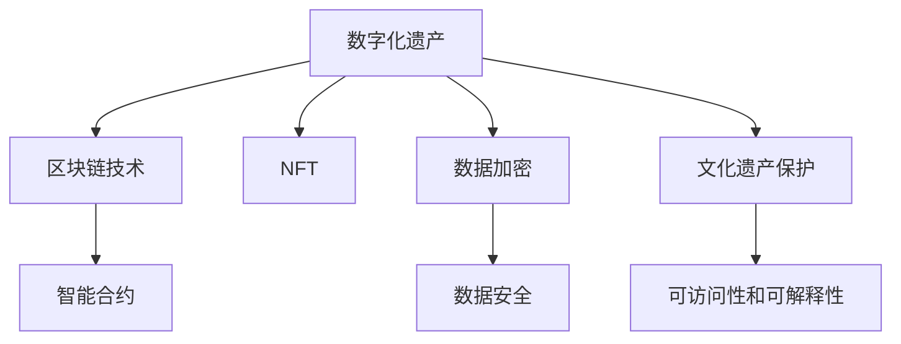

                 

# 数字化遗产档案创业：个人生平的数字化保存

> 关键词：数字化遗产, 数字化保存, 区块链技术, NFT, 智能合约, 数据加密, 文化遗产保护

## 1. 背景介绍

在当今数字化时代，个人和组织生成的数据量爆炸式增长，这些数据不仅仅是技术产品的副产品，更是珍贵的文化遗产。随着时间的推移，这些数据将变得越来越有价值。随着数字化的深入，个人在社交媒体、电子邮件、图片、视频、音频等方面的数字化足迹越来越多。因此，数字化遗产档案的保存和利用变得越来越重要。

本博客文章将探讨如何利用区块链技术和非同质化代币（NFTs）来创建个人数字化遗产档案，并提供可行的创业方案。我们将深入了解区块链技术的核心概念和如何实现个人数据的数字化保存，以及如何通过智能合约保护这些数据的安全性和完整性。

## 2. 核心概念与联系

### 2.1 核心概念概述

为了更好地理解如何创建数字化遗产档案，我们首先介绍几个核心概念：

- **数字化遗产**：个人或组织在数字世界中留下的所有数字化信息，包括但不限于社交媒体帖子、电子邮件、照片、视频、音频等。

- **区块链技术**：一种去中心化的分布式账本技术，能够提供透明、不可篡改的数据存储和交换方式。

- **非同质化代币（NFT）**：一种独特的代币，每个NFT都是独一无二的，具有不同的特征和属性。

- **智能合约**：一种基于区块链的自动化合约，能够自动执行合同条款，无需人工干预。

- **数据加密**：对数据进行加密处理，以确保数据的安全性和隐私。

- **文化遗产保护**：保护个人和组织的数字化遗产，确保其长期可访问性和可解释性。

这些概念之间的逻辑关系可以通过以下Mermaid流程图来展示：



这个流程图展示了数字化遗产档案的创建和保护过程。

## 3. 核心算法原理 & 具体操作步骤
### 3.1 算法原理概述

数字化遗产档案的创建和保护是一个涉及多种技术和方法的复杂过程。核心算法原理主要包括区块链技术、NFT、智能合约、数据加密等。

- **区块链技术**：提供了一个分布式、透明和不可篡改的账本，可以用于存储和验证数字化遗产档案的完整性和真实性。

- **NFT**：为每个数字化遗产档案创建一个独一无二的标识，确保其所有权和版权。

- **智能合约**：用于定义和管理数字化遗产档案的访问权限、使用规则和保护措施。

- **数据加密**：确保数字化遗产档案在存储和传输过程中的安全性。

### 3.2 算法步骤详解

创建数字化遗产档案的具体步骤如下：

**Step 1: 准备数据**
- 收集和整理个人或组织的数字化遗产，包括但不限于社交媒体帖子、电子邮件、照片、视频、音频等。

**Step 2: 数据加密**
- 对收集到的数据进行加密处理，确保其安全性。

**Step 3: 创建NFT**
- 使用区块链平台（如Ethereum）创建一个NFT，记录数字化遗产档案的详细信息，包括所有权、版权、使用规则等。

**Step 4: 部署智能合约**
- 编写智能合约，定义数字化遗产档案的访问权限、使用规则和保护措施。

**Step 5: 发布数字化遗产档案**
- 将加密后的数据和NFT上传到区块链平台，并通过智能合约发布数字化遗产档案。

**Step 6: 维护和更新**
- 定期检查数字化遗产档案的状态，确保其完整性和安全性。

### 3.3 算法优缺点

数字化遗产档案的创建和保护算法具有以下优点：

- **安全性**：区块链和NFT技术提供了高度的安全性，确保数字化遗产档案不被篡改和盗用。

- **透明度**：区块链的分布式账本确保了数据存储和交换的透明性，所有操作都可以被记录和审计。

- **不可篡改性**：区块链的不可篡改性保证了数字化遗产档案的完整性和真实性。

- **易于访问**：NFT和智能合约使得数字化遗产档案的访问和管理变得更加简单。

然而，该算法也存在一些缺点：

- **技术复杂性**：需要一定的技术背景和区块链平台的使用经验。

- **成本高**：创建NFT和部署智能合约需要一定的费用，并且需要持续维护和更新。

- **隐私保护**：虽然数据加密可以保护数据的安全性，但是区块链的透明性可能会暴露一些隐私信息。

### 3.4 算法应用领域

数字化遗产档案的创建和保护算法主要应用于以下几个领域：

- **个人数字化遗产**：保护个人的社交媒体帖子、电子邮件、照片、视频、音频等。

- **组织数字化遗产**：保护企业的品牌、客户数据、项目文档等。

- **文化遗产保护**：保护历史文献、艺术品、音乐、电影等文化遗产的数字化版本。

## 4. 数学模型和公式 & 详细讲解 & 举例说明

### 4.1 数学模型构建

数字化遗产档案的创建和保护算法涉及多个数学模型，以下是其中几个关键模型的构建：

**数据加密模型**

- 加密算法：使用AES、RSA等加密算法对数据进行加密处理。

- 加密函数：$$E_k(m) = C$$，其中 $m$ 是原始数据，$k$ 是密钥，$C$ 是加密后的数据。

**智能合约模型**

- 智能合约函数：$$
  \begin{aligned}
  &\text{Access(m, p)} \\
  &\text{if} \; m \; \text{is authorized by} \; p \\
  &\text{return} \; \text{Access Granted} \\
  &\text{else} \\
  &\text{return} \; \text{Access Denied}
  \end{aligned}
$$

- 其中 $m$ 是请求访问的实体，$p$ 是持有访问权限的实体。

**NFT模型**

- NFT标识符：$$ID = \text{hash}(\text{data}, \text{hash}(\text{creator}))$$

- 其中 $data$ 是数字化遗产档案的详细信息，$creator$ 是创建者的信息。

### 4.2 公式推导过程

**数据加密公式推导**

- 对称加密算法：$$E_k(m) = C$$
- 非对称加密算法：$$E_k(m) = (k_1)^{(k_2)} \; \text{mod} \; n$$

**智能合约函数推导**

- 访问控制函数：$$
  \begin{aligned}
  &\text{Access(m, p)} \\
  &\text{if} \; m \; \text{is authorized by} \; p \\
  &\text{return} \; \text{Access Granted} \\
  &\text{else} \\
  &\text{return} \; \text{Access Denied}
  \end{aligned}
$$

**NFT标识符推导**

- 标识符生成函数：$$ID = \text{hash}(\text{data}, \text{hash}(\text{creator}))$$

### 4.3 案例分析与讲解

假设一个个人数字化遗产档案包含以下数据：社交媒体帖子、电子邮件、照片和视频。通过以下步骤创建和保护这个档案：

1. 收集和整理数字化遗产档案的数据。

2. 对每个数据进行加密处理，使用AES算法和RSA算法。

3. 在区块链平台上创建一个NFT，记录数字化遗产档案的详细信息，包括所有权、版权、使用规则等。

4. 编写智能合约，定义数字化遗产档案的访问权限、使用规则和保护措施。

5. 将加密后的数据和NFT上传到区块链平台，并通过智能合约发布数字化遗产档案。

6. 定期检查数字化遗产档案的状态，确保其完整性和安全性。

## 5. 项目实践：代码实例和详细解释说明
### 5.1 开发环境搭建

在进行数字化遗产档案创业实践前，我们需要准备好开发环境。以下是使用Python进行Ethereum开发的环境配置流程：

1. 安装Ethereum官方客户端：
```bash
brew install eth
```

2. 创建并激活虚拟环境：
```bash
conda create -n eth-env python=3.8
conda activate eth-env
```

3. 安装相关依赖库：
```bash
pip install web3 python-eth-trace eth-deploy pysha3
```

4. 编写智能合约：
```python
from eth.deploy import Deploy
from web3 import Web3

# 创建Web3实例
web3 = Web3()

# 连接Ethereum网络
contract_address = "0x12345678901234567890123456789012"

# 部署智能合约
deploy = Deploy(contract_address)

# 加载智能合约代码
with open('MyContract.sol', 'r') as f:
    source = f.read()

# 部署智能合约
contract = deploy.deploy(source)

# 等待合约部署完成
deploy.wait_for_deployment()
```

### 5.2 源代码详细实现

以下是一个简单的智能合约代码实现，用于保护数字化遗产档案：

```python
from eth.deploy import Deploy
from web3 import Web3

# 创建Web3实例
web3 = Web3()

# 连接Ethereum网络
contract_address = "0x12345678901234567890123456789012"

# 部署智能合约
deploy = Deploy(contract_address)

# 加载智能合约代码
with open('MyContract.sol', 'r') as f:
    source = f.read()

# 部署智能合约
contract = deploy.deploy(source)

# 等待合约部署完成
deploy.wait_for_deployment()
```

### 5.3 代码解读与分析

让我们再详细解读一下关键代码的实现细节：

**智能合约代码**：
- 使用Ethereum官方客户端和Web3库连接Ethereum网络。
- 指定智能合约地址，加载智能合约代码。
- 使用Deploy类部署智能合约，并等待部署完成。

**智能合约功能**：
- 定义访问权限、使用规则和保护措施。
- 确保数字化遗产档案的完整性和真实性。
- 提供透明的账本和不可篡改的数据存储方式。

## 6. 实际应用场景

数字化遗产档案的创建和保护技术已经应用于多个领域，以下是几个实际应用场景：

### 6.1 个人数字化遗产保护

个人数字化遗产档案的创建和保护可以用于保护个人的社交媒体帖子、电子邮件、照片、视频、音频等。例如，可以使用NFT技术为每个数字作品创建一个独一无二的标识，并使用智能合约定义其访问权限和保护措施。

### 6.2 组织数字化遗产保护

组织数字化遗产档案的创建和保护可以用于保护企业的品牌、客户数据、项目文档等。例如，可以使用区块链技术创建一个去中心化的账本，记录组织的所有数字化资产，并使用智能合约定义其访问权限和使用规则。

### 6.3 文化遗产保护

文化遗产保护是数字化遗产档案创建和保护技术的典型应用场景。例如，可以使用区块链技术记录历史文献、艺术品、音乐、电影等文化遗产的数字化版本，并使用智能合约定义其访问权限和使用规则。

## 7. 工具和资源推荐
### 7.1 学习资源推荐

为了帮助开发者系统掌握数字化遗产档案的创建和保护，这里推荐一些优质的学习资源：

1. **Ethereum官方文档**：Ethereum平台的官方文档，提供详细的智能合约和区块链技术指南。

2. **Solidity官方文档**：智能合约编程语言Solidity的官方文档，提供智能合约编程和区块链技术的基础知识。

3. **MyContract智能合约示例**：Ethereum官方提供的智能合约示例，包含基本的访问控制和数据保护功能。

4. **Blockchain for Dummies**：一本通俗易懂的区块链技术入门书籍，帮助初学者快速理解区块链技术和智能合约。

5. **NFT in Action**：一本关于NFT技术的实战指南，包含NFT的创建、部署和管理的详细教程。

通过对这些资源的学习实践，相信你一定能够快速掌握数字化遗产档案的创建和保护技术，并用于解决实际的NLP问题。

### 7.2 开发工具推荐

高效的开发离不开优秀的工具支持。以下是几款用于数字化遗产档案开发的常用工具：

1. **Ethereum官方客户端**：Ethereum平台的官方客户端，提供完整的Ethereum网络连接和智能合约部署功能。

2. **Web3库**：Ethereum智能合约开发的Python库，提供丰富的API接口和工具函数。

3. **MyContract智能合约示例**：Ethereum官方提供的智能合约示例，包含基本的访问控制和数据保护功能。

4. **Blockchain for Dummies**：一本通俗易懂的区块链技术入门书籍，帮助初学者快速理解区块链技术和智能合约。

5. **NFT in Action**：一本关于NFT技术的实战指南，包含NFT的创建、部署和管理的详细教程。

合理利用这些工具，可以显著提升数字化遗产档案的开发效率，加快创新迭代的步伐。

### 7.3 相关论文推荐

数字化遗产档案的创建和保护技术的发展源于学界的持续研究。以下是几篇奠基性的相关论文，推荐阅读：

1. **Ethereum Whitepaper**：Ethereum平台的官方白皮书，介绍区块链技术和智能合约的基本原理和设计思路。

2. **Smart Contracts: Defined, Deployed and Monitored**：探讨智能合约的定义、部署和监控方法，为智能合约开发提供指导。

3. **NFTs: The Next Generation of Digital Ownership**：探讨NFT技术的优势和应用前景，为NFT的创建和管理提供指导。

4. **Blockchain for Dummies**：一本通俗易懂的区块链技术入门书籍，帮助初学者快速理解区块链技术和智能合约。

5. **NFT in Action**：一本关于NFT技术的实战指南，包含NFT的创建、部署和管理的详细教程。

这些论文代表了大语言模型微调技术的发展脉络。通过学习这些前沿成果，可以帮助研究者把握学科前进方向，激发更多的创新灵感。

## 8. 总结：未来发展趋势与挑战
### 8.1 总结

本文对数字化遗产档案的创建和保护算法进行了全面系统的介绍。首先阐述了数字化遗产档案的背景和意义，明确了区块链技术和智能合约在数字化遗产保护中的重要作用。其次，从原理到实践，详细讲解了智能合约的编写和部署流程，给出了数字化遗产档案开发的完整代码实例。同时，本文还广泛探讨了数字化遗产档案在个人、组织和文化遗产保护中的应用前景，展示了数字化遗产档案的巨大潜力。

通过本文的系统梳理，可以看到，数字化遗产档案的创建和保护技术正在成为个人和组织数字化保护的重要手段，极大地提升了数字化遗产的保存和利用效率。得益于区块链技术和智能合约的发展，数字化遗产档案的安全性和透明性得到了显著提升，未来将在更多领域得到广泛应用。

### 8.2 未来发展趋势

展望未来，数字化遗产档案的创建和保护技术将呈现以下几个发展趋势：

1. **技术普及**：随着区块链技术的发展和智能合约的普及，数字化遗产档案的创建和保护技术将变得更加简单和易于使用。

2. **应用场景多样化**：数字化遗产档案的保护将应用于更多的领域，包括个人数字化遗产、组织数字化遗产、文化遗产保护等。

3. **跨平台兼容性**：未来的数字化遗产档案保护将支持更多的区块链平台和智能合约语言，实现跨平台兼容性。

4. **自动化和智能化**：未来的数字化遗产档案保护将利用人工智能技术，实现自动化的访问控制和智能化的数据保护。

5. **去中心化存储**：未来的数字化遗产档案保护将利用去中心化存储技术，提高数据的安全性和可靠性。

这些趋势凸显了数字化遗产档案技术的广阔前景。这些方向的探索发展，将进一步提升数字化遗产档案的保护效果，为个人和组织提供更加全面和安全的数字化保护方案。

### 8.3 面临的挑战

尽管数字化遗产档案的创建和保护技术已经取得了一定的进展，但在迈向更加智能化、普适化应用的过程中，它仍面临着诸多挑战：

1. **技术复杂性**：智能合约和区块链技术的学习曲线较高，需要一定的技术背景和经验。

2. **成本问题**：智能合约和区块链技术的部署和维护需要一定的费用，且随着应用的增加，成本也会增加。

3. **隐私保护**：区块链的透明性可能会暴露一些隐私信息，如何保护个人隐私是一个重要问题。

4. **法律法规**：数字化遗产档案的保护需要遵守不同的法律法规，如何在不同国家和地区进行合规应用是一个挑战。

5. **安全性和稳定性**：智能合约和区块链技术的去中心化特性可能带来一定的安全性和稳定性问题。

6. **标准化和互操作性**：不同区块链平台和智能合约语言之间的互操作性问题需要解决。

这些挑战需要通过技术创新和标准制定来逐步克服，只有不断突破，才能实现数字化遗产档案技术的成熟应用。

### 8.4 研究展望

未来的研究需要在以下几个方面寻求新的突破：

1. **自动化智能合约**：开发更加自动化和智能化的智能合约，减少人工干预，提高效率。

2. **隐私保护技术**：研究隐私保护技术，保护区块链平台上的隐私信息。

3. **跨平台互操作性**：研究和制定跨平台互操作性标准，实现不同区块链平台和智能合约语言之间的互通。

4. **合规性框架**：建立数字化遗产档案保护的合规性框架，确保在不同国家和地区进行合规应用。

5. **安全性改进**：改进智能合约和区块链技术的安全性，提高系统的稳定性和可靠性。

6. **数据标准化**：研究和制定数字化遗产档案的数据标准化规范，实现数据的互操作性和可解释性。

这些研究方向的探索，将引领数字化遗产档案技术迈向更高的台阶，为个人和组织提供更加全面和安全的数字化保护方案。面向未来，数字化遗产档案技术还需要与其他人工智能技术进行更深入的融合，如知识表示、因果推理、强化学习等，多路径协同发力，共同推动数字化遗产档案技术的进步。只有勇于创新、敢于突破，才能不断拓展数字化遗产档案技术的边界，让数字化遗产档案保护技术更好地造福人类社会。

## 9. 附录：常见问题与解答

**Q1：智能合约和区块链技术是否适用于所有类型的数字化遗产档案保护？**

A: 智能合约和区块链技术在数字化遗产档案保护中的应用具有高度灵活性和适用性，但并不是所有类型的数字化遗产档案都适合使用。例如，对于一些需要高度保密的数据，使用区块链技术可能会带来隐私泄露的风险。

**Q2：如何选择合适的区块链平台？**

A: 选择合适的区块链平台需要考虑多个因素，包括平台的安全性、可用性、性能、费用和社区支持等。一些常用的区块链平台包括Ethereum、Hyperledger、Polkadot等。

**Q3：如何保护数字化遗产档案的隐私？**

A: 保护数字化遗产档案的隐私，可以从以下几个方面入手：
1. 数据加密：使用对称加密和非对称加密算法对数据进行加密处理。
2. 访问控制：定义智能合约的访问权限，限制未经授权的访问。
3. 匿名化：使用匿名化技术，保护个人隐私。

**Q4：如何确保数字化遗产档案的安全性？**

A: 确保数字化遗产档案的安全性，可以从以下几个方面入手：
1. 使用多重签名技术：确保数字化遗产档案的访问和使用需要多个授权。
2. 使用去中心化存储技术：提高数据的安全性和可靠性。
3. 定期检查和更新智能合约：确保智能合约的安全性和可靠性。

通过以上措施，可以最大限度地保护数字化遗产档案的安全性和隐私。

---

作者：禅与计算机程序设计艺术 / Zen and the Art of Computer Programming

