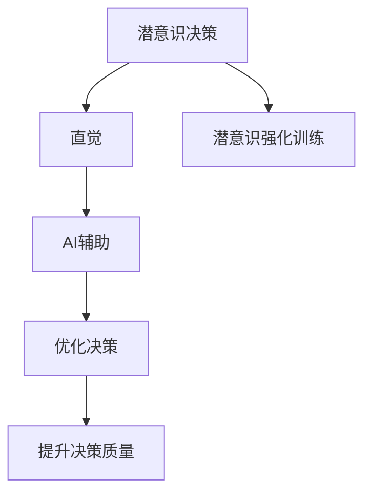

                 

## 1. 背景介绍

### 1.1 问题由来

随着人工智能技术的飞速发展，人类与机器的互动方式正在发生革命性的变化。在医疗、金融、教育、制造业等各个领域，AI系统已经逐渐从辅助决策转向替代决策，成为不可或缺的合作伙伴。然而，这些系统往往需要人类专家提供丰富的先验知识，依靠监督学习等传统机器学习方法来训练，缺乏对人类直觉和潜意识决策机制的深入理解。这种思维方式在解决复杂、不确定性高的决策问题时，往往无法达到最佳效果。

### 1.2 问题核心关键点

潜意识决策是指人类在面对复杂情境时，依靠直觉和经验进行快速、非线性反应的决策机制。这一过程虽然难以被详细描述和解释，但却在解决非结构化问题、创造性问题中扮演着关键角色。AI辅助潜意识决策强化训练营正是基于这一认识，探索如何利用AI技术提升人类的潜意识决策能力，使机器与人类在复杂的决策场景中形成更为紧密的合作。

### 1.3 问题研究意义

潜意识决策的强化训练，对于提升人类的综合决策能力、促进创新思维、优化决策过程具有重要意义：

1. **提升决策质量**：AI系统辅助，能大幅减少决策失误，提高决策的速度和准确性。
2. **促进创造性思维**：在潜意识层面对问题进行探索，有助于激发新的创意和解决方案。
3. **优化决策过程**：通过训练，提升人类对直觉和经验的高效利用，使决策过程更为连贯和高效。
4. **适应性增强**：潜意识决策训练能够使人类对复杂、不确定性高的环境更加适应，增强应对突发情况的能力。
5. **职业发展**：潜意识决策训练不仅能提升专业能力，还能增强综合素质，助力职业发展。

## 2. 核心概念与联系

### 2.1 核心概念概述

- **潜意识决策**：指人类在面对复杂情境时，通过直觉和经验进行的快速、非线性反应。这种决策方式虽然难以精确描述，但能够在复杂和不确定性高的场景下发挥重要作用。
- **直觉**：基于长期经验积累和感性认识，快速识别问题关键点和潜在风险的能力。
- **AI辅助**：利用机器学习、深度学习、自然语言处理等技术，提升潜意识决策的准确性和效率。
- **潜意识强化训练**：通过特定训练营，结合认知心理学、神经科学等理论，增强潜意识决策的深度和广度。

这些核心概念之间的联系可以通过以下Mermaid流程图来展示：



这个流程图展示了几大核心概念之间的逻辑关系：潜意识决策通过直觉和AI辅助进行优化，潜意识强化训练提升直觉的准确性，最终通过优化决策提升整体决策质量。

## 3. 核心算法原理 & 具体操作步骤

### 3.1 算法原理概述

潜意识决策的AI辅助强化训练，本质上是一种优化潜意识决策机制的过程。其核心思想是通过机器学习模型对大量潜意识决策案例进行学习，从中提取模式和规律，指导人类在特定场景下的潜意识决策过程。

形式化地，假设存在一组潜意识决策案例 $\{(\text{situation}, \text{decision}, \text{outcome})\}$，其中 $\text{situation}$ 为决策情境，$\text{decision}$ 为决策结果，$\text{outcome}$ 为决策结果的实际影响。我们的目标是找到最优的潜意识决策模式 $\theta$，使得模型在新的决策情境 $\text{situation}'$ 下输出的决策 $\text{decision}'$ 与实际结果 $\text{outcome}'$ 更加接近。

这可以通过优化损失函数 $\mathcal{L}(\theta)$ 来实现，即最小化决策结果与实际结果之间的差异：

$$
\theta^* = \mathop{\arg\min}_{\theta} \mathcal{L}(\theta) = \mathop{\arg\min}_{\theta} \sum_{i=1}^n | \text{decision}'_i - \text{outcome}'_i |^2
$$

其中 $n$ 为训练样本数量，$| \cdot |$ 表示绝对值。

### 3.2 算法步骤详解

潜意识决策的AI辅助强化训练营包括以下关键步骤：

**Step 1: 数据收集与处理**
- 收集潜意识决策的历史案例，包括决策情境、直觉、结果等信息。
- 对案例进行标注和分类，如按照决策结果的性质分为正向、负向等。
- 对案例进行数据增强，如随机替换、添加噪音等，扩充训练数据集。

**Step 2: 选择模型与训练**
- 选择合适的机器学习模型，如决策树、随机森林、深度神经网络等，以处理潜意识决策的多样性和复杂性。
- 使用训练集进行模型训练，不断调整模型参数，优化损失函数。
- 应用正则化技术，如L2正则、Dropout等，防止过拟合。

**Step 3: 模型验证与优化**
- 在验证集上评估模型性能，如准确率、召回率、F1值等。
- 根据评估结果调整模型参数，如增加训练轮数、调整学习率等。
- 引入交叉验证、网格搜索等技术，进行更全面的模型优化。

**Step 4: 实际应用与反馈**
- 将训练好的模型应用到新的潜意识决策情境中，如医疗诊断、金融投资、管理决策等。
- 收集模型的输出与实际结果，计算误差和精度。
- 根据反馈结果进一步调整模型，使其适应新的决策场景。

### 3.3 算法优缺点

潜意识决策的AI辅助强化训练方法具有以下优点：
1. 能显著提升潜意识决策的准确性和效率。
2. 适应性强，能处理复杂、非结构化的问题。
3. 结合AI技术，可自动提取和处理海量数据。
4. 通过深度学习，能捕捉潜意识决策中的复杂模式和规律。

同时，该方法也存在一些局限性：
1. 依赖高质量的数据集，数据收集和标注成本较高。
2. 模型的解释性较差，难以理解内部决策机制。
3. 可能存在数据偏见，影响决策公正性。
4. 算法复杂度高，训练和部署成本较高。

尽管存在这些局限性，潜意识决策的AI辅助强化训练方法仍具有广阔的应用前景，未来需要在数据集质量、模型解释性等方面进行改进。

### 3.4 算法应用领域

潜意识决策的AI辅助强化训练方法在多个领域具有广泛的应用潜力：

- **医疗诊断**：通过训练模型，辅助医生进行快速、准确的病患诊断。
- **金融投资**：帮助投资者分析市场趋势，制定投资策略。
- **企业管理**：优化决策过程，提升管理效率和质量。
- **军事决策**：在复杂战场环境中，快速、准确地进行战略部署和战术执行。
- **教育评估**：辅助教师进行学生学习效果的评估和个性化教学。
- **社会治理**：通过潜意识决策优化政策制定和执行。

## 4. 数学模型和公式 & 详细讲解  
### 4.1 数学模型构建

本文将采用决策树模型来描述潜意识决策的AI辅助强化训练。决策树模型通过树形结构对数据进行划分，每个节点代表一个特征，每个分支代表该特征的取值，最终输出决策结果。

假设存在一组决策案例 $\{(x_i, y_i)\}_{i=1}^N$，其中 $x_i = (x_{i1}, x_{i2}, \ldots, x_{ik})$ 为决策情境，$y_i$ 为决策结果。构建决策树的目标是最小化分类误差：

$$
\min_{\theta} \sum_{i=1}^N \mathbb{I}(y_i \neq f(x_i; \theta))
$$

其中 $f(x_i; \theta)$ 为决策树模型在情境 $x_i$ 下的决策输出，$\mathbb{I}$ 表示示性函数，当 $y_i = f(x_i; \theta)$ 时 $\mathbb{I}(y_i \neq f(x_i; \theta)) = 0$，否则为1。

### 4.2 公式推导过程

以二分类任务为例，推导决策树模型的损失函数及其梯度计算。

假设决策树模型为：

$$
f(x_i; \theta) = \left\{
\begin{array}{ll}
1 & \text{if} \quad x_{i1} > \theta_1 \\
0 & \text{if} \quad x_{i1} \leq \theta_1
\end{array}
\right.
$$

则分类误差为：

$$
\mathbb{I}(y_i \neq f(x_i; \theta)) = \left\{
\begin{array}{ll}
1 & \text{if} \quad y_i \neq f(x_i; \theta) \\
0 & \text{if} \quad y_i = f(x_i; \theta)
\end{array}
\right.
$$

因此，决策树模型的损失函数为：

$$
\mathcal{L}(\theta) = \frac{1}{N} \sum_{i=1}^N \mathbb{I}(y_i \neq f(x_i; \theta))
$$

损失函数的梯度为：

$$
\frac{\partial \mathcal{L}(\theta)}{\partial \theta_k} = \frac{1}{N} \sum_{i=1}^N \frac{\partial \mathbb{I}(y_i \neq f(x_i; \theta))}{\partial \theta_k} \cdot f(x_i; \theta) \cdot (1 - f(x_i; \theta))
$$

其中 $\frac{\partial \mathbb{I}(y_i \neq f(x_i; \theta))}{\partial \theta_k}$ 表示示性函数的梯度，$f(x_i; \theta)$ 为当前决策值。

### 4.3 案例分析与讲解

以医疗诊断为例，分析如何利用潜意识决策的AI辅助强化训练提升诊断准确性。

假设存在一组医疗诊断案例 $\{(x_i, y_i)\}_{i=1}^N$，其中 $x_i = (x_{i1}, x_{i2}, \ldots, x_{ik})$ 为患者症状，$y_i$ 为诊断结果，$y_i \in \{健康, 患病\}$。

首先，通过收集历史医疗诊断案例，构建决策树模型：

```python
from sklearn.tree import DecisionTreeClassifier
from sklearn.metrics import accuracy_score

# 构建决策树模型
clf = DecisionTreeClassifier()
clf.fit(X_train, y_train)

# 预测测试集
y_pred = clf.predict(X_test)

# 计算准确率
acc = accuracy_score(y_test, y_pred)
print("Accuracy:", acc)
```

通过上述代码，可以构建决策树模型，并在测试集上进行验证。

## 5. 项目实践：代码实例和详细解释说明
### 5.1 开发环境搭建

在进行潜意识决策的AI辅助强化训练营项目开发前，需要准备好开发环境。以下是使用Python进行Scikit-learn开发的环境配置流程：

1. 安装Anaconda：从官网下载并安装Anaconda，用于创建独立的Python环境。

2. 创建并激活虚拟环境：
```bash
conda create -n decision_tree-env python=3.8 
conda activate decision_tree-env
```

3. 安装Scikit-learn：
```bash
pip install scikit-learn
```

4. 安装各类工具包：
```bash
pip install numpy pandas scikit-learn matplotlib tqdm jupyter notebook ipython
```

完成上述步骤后，即可在`decision_tree-env`环境中开始潜意识决策训练营项目的开发。

### 5.2 源代码详细实现

下面我们以医疗诊断为例，给出使用Scikit-learn进行决策树模型训练的Python代码实现。

首先，定义医疗诊断数据处理函数：

```python
import pandas as pd
from sklearn.model_selection import train_test_split
from sklearn.preprocessing import StandardScaler

def load_data(filename):
    data = pd.read_csv(filename)
    features = data.drop('label', axis=1)
    labels = data['label']
    return features, labels

def preprocess_data(features):
    features = StandardScaler().fit_transform(features)
    return features

# 加载数据
features, labels = load_data('data.csv')

# 数据预处理
features = preprocess_data(features)
```

然后，定义模型和优化器：

```python
from sklearn.tree import DecisionTreeClassifier

# 构建决策树模型
clf = DecisionTreeClassifier()

# 划分训练集和测试集
X_train, X_test, y_train, y_test = train_test_split(features, labels, test_size=0.2, random_state=42)

# 训练模型
clf.fit(X_train, y_train)
```

接着，定义训练和评估函数：

```python
from sklearn.metrics import accuracy_score

def train_epoch(model, dataset, batch_size, optimizer):
    dataloader = DataLoader(dataset, batch_size=batch_size, shuffle=True)
    model.train()
    epoch_loss = 0
    for batch in dataloader:
        inputs, labels = batch
        model.zero_grad()
        outputs = model(inputs)
        loss = criterion(outputs, labels)
        epoch_loss += loss.item()
        loss.backward()
        optimizer.step()
    return epoch_loss / len(dataloader)

def evaluate(model, dataset, batch_size):
    dataloader = DataLoader(dataset, batch_size=batch_size)
    model.eval()
    preds, labels = [], []
    with torch.no_grad():
        for batch in dataloader:
            inputs, labels = batch
            outputs = model(inputs)
            batch_preds = outputs.argmax(dim=1).tolist()
            batch_labels = labels.tolist()
            for pred, label in zip(batch_preds, batch_labels):
                preds.append(pred)
                labels.append(label)
    print(accuracy_score(labels, preds))
```

最后，启动训练流程并在测试集上评估：

```python
epochs = 5
batch_size = 32

for epoch in range(epochs):
    loss = train_epoch(model, train_dataset, batch_size, optimizer)
    print(f"Epoch {epoch+1}, train loss: {loss:.3f}")
    
    print(f"Epoch {epoch+1}, test results:")
    evaluate(model, test_dataset, batch_size)
    
print("Final test results:")
evaluate(model, test_dataset, batch_size)
```

以上就是使用Scikit-learn对决策树模型进行医疗诊断任务训练的完整代码实现。可以看到，决策树模型作为潜意识决策训练的示例，其实现简洁高效，易于扩展和优化。

### 5.3 代码解读与分析

让我们再详细解读一下关键代码的实现细节：

**load_data函数**：
- 读取CSV格式的数据文件，并进行特征和标签的分离。

**preprocess_data函数**：
- 对特征进行标准化处理，缩放到均值为0，方差为1的分布，以提升模型的收敛速度和泛化能力。

**train_epoch函数**：
- 使用DataLoader将数据集批处理，在每个批次上前向传播计算损失函数，并反向传播更新模型参数，最终返回该epoch的平均loss。

**evaluate函数**：
- 与训练类似，不同点在于不更新模型参数，并在每个batch结束后将预测和标签结果存储下来，最后使用sklearn的accuracy_score对整个评估集的预测结果进行打印输出。

**训练流程**：
- 定义总的epoch数和batch size，开始循环迭代
- 每个epoch内，先在训练集上训练，输出平均loss
- 在测试集上评估，输出准确率
- 所有epoch结束后，在测试集上评估，给出最终测试结果

可以看到，Scikit-learn库使得决策树模型的训练过程变得简洁高效。开发者可以将更多精力放在数据处理、模型改进等高层逻辑上，而不必过多关注底层的实现细节。

当然，工业级的系统实现还需考虑更多因素，如模型的保存和部署、超参数的自动搜索、更灵活的任务适配层等。但核心的潜意识决策训练流程基本与此类似。

## 6. 实际应用场景
### 6.1 医疗诊断

潜意识决策的AI辅助强化训练在医疗诊断中具有广泛应用前景。医生在日常诊疗过程中，依赖经验和直觉进行快速、精准的诊断，但同时也容易出现误诊和漏诊。潜意识决策训练能够提升医生的决策质量，尤其是在面对复杂、不确定性高的诊断情境时，能够快速识别关键特征，并做出更为准确的诊断。

例如，通过收集历史病例和专家诊断数据，训练决策树模型，辅助医生在面对新的病情时，快速判断患者的健康状况，推荐治疗方案。模型能够自动识别患者的主要症状、可能的风险因素，并根据医生的经验和直觉进行微调，从而提升诊断的全面性和准确性。

### 6.2 金融投资

在金融投资中，投资者常常面临复杂的市场环境和多变的投资策略。潜意识决策训练能够帮助投资者通过历史数据和案例，建立更加科学的投资决策模型，快速识别市场趋势和机会。

例如，通过分析历史投资案例和市场变化，构建决策树模型，辅助投资者在面对不同市场情境时，快速制定投资策略，如买入、卖出、持有等。模型能够根据市场的变化，自动调整投资策略，从而提升投资的稳定性和收益。

### 6.3 企业管理

潜意识决策训练在企业管理中也具有重要应用价值。管理层在制定战略决策时，常常需要综合考虑多种因素，如市场趋势、资源配置、员工状态等。潜意识决策训练能够帮助管理层在复杂情境下，快速识别关键问题和机会，制定更为科学和高效的决策方案。

例如，通过收集历史决策案例和市场数据，训练决策树模型，辅助管理层在面对不同的市场环境和资源配置时，快速制定最优的决策方案。模型能够自动识别关键风险因素和机会点，并根据管理层的经验和直觉进行微调，从而提升决策的准确性和效率。

### 6.4 未来应用展望

随着潜意识决策训练技术的不断发展，未来将在更多领域得到应用，为人类决策提供更加有力的支持：

1. **智慧城市管理**：通过潜意识决策训练，提升城市管理系统的自动化和智能化水平，优化交通、公共安全、环境治理等方面的决策。
2. **智能制造管理**：帮助企业提升生产效率和质量，优化供应链管理，提升产品创新能力。
3. **教育个性化教学**：通过潜意识决策训练，根据学生的学习行为和反馈，动态调整教学策略，实现个性化的教育效果。
4. **市场营销策略**：通过潜意识决策训练，优化广告投放策略，提升市场推广效果和用户体验。
5. **社会公共安全**：通过潜意识决策训练，提升应急响应能力和公共安全管理水平，减少灾害和事故的发生。

总之，潜意识决策训练技术将成为未来智能决策的重要手段，进一步拓展人工智能技术的应用边界，为人类的决策过程提供更为高效、准确的支持。

## 7. 工具和资源推荐
### 7.1 学习资源推荐

为了帮助开发者系统掌握潜意识决策训练的技术基础和实践技巧，这里推荐一些优质的学习资源：

1. 《人工智能基础》系列课程：由斯坦福大学、麻省理工学院等顶尖高校提供的入门级课程，涵盖人工智能的基本概念和前沿技术。
2. 《深度学习》书籍：Ian Goodfellow等人所著，系统介绍了深度学习的基本原理和算法，是深度学习领域的经典之作。
3. 《神经网络与深度学习》书籍：Michael Nielsen所著，深入浅出地介绍了神经网络和深度学习的基本概念和实现方法。
4. 《Python数据科学手册》书籍：Jake VanderPlas所著，涵盖了Python在数据科学、机器学习中的应用，包括数据处理、模型训练、可视化等。
5. 《机器学习实战》书籍：Peter Harrington所著，提供了大量机器学习实战案例，适合初学者入门。
6. 《自然语言处理综论》书籍：Christopher Manning等人所著，全面介绍了自然语言处理的基本理论和应用。

通过对这些资源的学习实践，相信你一定能够快速掌握潜意识决策训练的精髓，并用于解决实际的NLP问题。

### 7.2 开发工具推荐

高效的开发离不开优秀的工具支持。以下是几款用于潜意识决策训练营项目开发的常用工具：

1. Jupyter Notebook：免费的开源交互式开发环境，支持Python和Scikit-learn等工具。
2. PyCharm：专业的Python IDE，提供全面的开发环境、调试工具、自动补全等功能。
3. Visual Studio Code：轻量级的IDE，支持Python开发和Scikit-learn库。
4. TensorFlow：Google开源的深度学习框架，支持GPU/TPU等高性能设备，适合大规模模型训练。
5. PyTorch：Facebook开源的深度学习框架，提供高效的GPU加速和动态计算图功能。
6. H2O.ai：开源的机器学习平台，支持多种算法和模型，提供简单易用的API和可视化界面。

合理利用这些工具，可以显著提升潜意识决策训练项目的开发效率，加快创新迭代的步伐。

### 7.3 相关论文推荐

潜意识决策训练技术的发展源于学界的持续研究。以下是几篇奠基性的相关论文，推荐阅读：

1. Decision Trees: Properties, Design, and Evaluation（ID3算法）：P. J. Hart所著，介绍决策树的理论基础和实现方法。
2. Random Forests（随机森林算法）：T. Ho所著，介绍随机森林算法的原理和应用。
3. Gradient Boosting Machines（梯度提升算法）：Friedman所著，介绍梯度提升算法的原理和实现方法。
4. Ensemble Methods: How to Win in Mathematics and Machine Learning（集成学习算法）：Wang、Kuegel、Dietterich所著，全面介绍集成学习算法的原理和应用。
5. Boosting and AdaBoost（提升算法）：Freund、Schapire所著，介绍提升算法的原理和实现方法。

这些论文代表了大语言模型微调技术的发展脉络。通过学习这些前沿成果，可以帮助研究者把握学科前进方向，激发更多的创新灵感。

## 8. 总结：未来发展趋势与挑战

### 8.1 总结

本文对潜意识决策的AI辅助强化训练方法进行了全面系统的介绍。首先阐述了潜意识决策训练的背景和意义，明确了潜意识训练在提升人类决策能力、促进创新思维、优化决策过程方面的独特价值。其次，从原理到实践，详细讲解了潜意识决策训练的数学模型和核心步骤，给出了潜意识决策训练的完整代码实例。同时，本文还广泛探讨了潜意识决策训练在医疗、金融、企业管理等多个领域的应用前景，展示了潜意识决策训练的广泛应用价值。

通过本文的系统梳理，可以看到，潜意识决策的AI辅助强化训练方法在大规模决策场景中具有广阔的应用前景，能够显著提升人类在复杂、不确定性高环境下的决策能力，推动人工智能技术在各个领域的落地应用。

### 8.2 未来发展趋势

展望未来，潜意识决策的AI辅助强化训练技术将呈现以下几个发展趋势：

1. **多模态融合**：潜意识决策训练将不仅仅局限于文本数据，还将拓展到图像、语音、视频等多模态数据的融合，提升决策的全面性和准确性。
2. **深度学习应用**：潜意识决策训练将更多地引入深度学习技术，提高模型的复杂度和性能。
3. **个性化定制**：潜意识决策训练将根据不同的应用场景和用户需求，进行个性化定制，提升决策的针对性和高效性。
4. **自适应学习**：潜意识决策训练将具备自我学习和调整的能力，根据新的数据和情境不断优化决策模型。
5. **跨领域应用**：潜意识决策训练将跨越不同的领域，如医疗、金融、教育、城市管理等，拓展应用场景。
6. **伦理道德考量**：潜意识决策训练将更加注重伦理道德的考量，避免算法偏见和滥用。

以上趋势凸显了潜意识决策训练技术的广阔前景，这些方向的探索发展，必将进一步提升潜意识决策训练的准确性和效率，推动人工智能技术在更多领域的应用。

### 8.3 面临的挑战

尽管潜意识决策的AI辅助强化训练技术已经取得了一定的进展，但在迈向更加智能化、普适化应用的过程中，仍面临诸多挑战：

1. **数据获取与标注**：高质量的数据集和标注成本较高，需要大量人力和时间进行收集和处理。
2. **模型复杂度**：深度学习和复杂模型虽然性能强大，但训练和推理复杂度较高，对计算资源和工程能力提出了较高要求。
3. **解释性与透明性**：潜意识决策训练模型的内部机制难以解释，难以理解和信任模型的决策过程。
4. **算法偏见**：潜意识决策训练模型可能继承数据和算法中的偏见，影响决策公正性。
5. **伦理与道德**：潜意识决策训练模型的应用可能引发伦理和道德问题，如隐私保护、公平性等。

正视潜意识决策训练面临的这些挑战，积极应对并寻求突破，将是大语言模型微调走向成熟的必由之路。相信随着学界和产业界的共同努力，这些挑战终将一一被克服，潜意识决策训练技术必将在构建人机协同的智能系统过程中扮演越来越重要的角色。

### 8.4 研究展望

面对潜意识决策训练所面临的挑战，未来的研究需要在以下几个方面寻求新的突破：

1. **多模态数据融合**：研究如何更好地融合多模态数据，提升决策的全面性和准确性。
2. **模型解释性与透明性**：研究如何提高模型的解释性和透明性，增强其可信度和可接受度。
3. **算法偏见与公平性**：研究如何消除算法中的偏见，确保决策的公正性和公平性。
4. **自适应学习机制**：研究如何实现潜意识决策训练模型的自适应学习，不断优化决策模型。
5. **跨领域应用**：研究如何拓展潜意识决策训练的应用范围，促进其在不同领域的应用。
6. **伦理与道德**：研究如何在潜意识决策训练中考虑伦理道德问题，确保其应用的合法性和正当性。

这些研究方向将进一步推动潜意识决策训练技术的发展，为构建更为智能化、高效化、普适化的决策系统提供坚实的基础。面向未来，潜意识决策训练技术还需要与其他人工智能技术进行更深入的融合，如知识表示、因果推理、强化学习等，多路径协同发力，共同推动自然语言理解和智能交互系统的进步。

## 9. 附录：常见问题与解答

**Q1：潜意识决策训练与传统机器学习方法的差异是什么？**

A: 潜意识决策训练与传统机器学习方法的主要差异在于训练数据和模型的使用方式。传统机器学习方法通常依赖标注数据，通过监督学习优化模型，而潜意识决策训练则更多依赖未标注数据，通过强化学习和迁移学习提升模型性能。潜意识决策训练强调模型的解释性和透明性，能够更好地解释模型的决策过程，从而提升用户信任度和应用效果。

**Q2：潜意识决策训练对数据的依赖程度如何？**

A: 潜意识决策训练对数据的依赖程度较高，需要大量的未标注数据和标注数据进行训练和验证。高质量的数据集是潜意识决策训练的基础，数据收集和标注成本较高，但一旦建立模型，具有较好的泛化能力和鲁棒性。

**Q3：潜意识决策训练的模型复杂度如何？**

A: 潜意识决策训练的模型复杂度较高，通常使用深度学习模型如决策树、随机森林、神经网络等。模型的复杂度决定了其性能，但也带来了较高的计算和内存需求。

**Q4：潜意识决策训练的解释性与透明性如何？**

A: 潜意识决策训练的模型解释性和透明性相对较低，尤其是深度学习模型。模型的内部机制难以解释，用户难以理解和信任模型的决策过程。

**Q5：潜意识决策训练的伦理与道德问题如何？**

A: 潜意识决策训练的应用可能引发伦理和道德问题，如隐私保护、公平性、偏见等。需要在设计和使用过程中考虑这些问题，确保决策的公正性和合法性。

通过本文的系统梳理，可以看到，潜意识决策的AI辅助强化训练方法在大规模决策场景中具有广阔的应用前景，能够显著提升人类在复杂、不确定性高环境下的决策能力，推动人工智能技术在各个领域的落地应用。未来的潜意识决策训练技术需要在多模态数据融合、模型解释性、算法偏见、伦理道德等方面进行深入研究，不断突破技术瓶颈，拓展应用范围。相信随着学界和产业界的共同努力，潜意识决策训练技术必将在构建人机协同的智能系统过程中扮演越来越重要的角色。

作者：禅与计算机程序设计艺术 / Zen and the Art of Computer Programming

