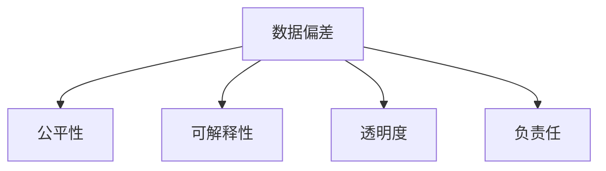

                 

# 数据偏差无处不在，软件2.0需补齐伦理短板

## 1. 背景介绍

### 1.1 问题由来
随着人工智能技术的发展，数据驱动的算法系统已经广泛应用于各个领域，从自动驾驶、推荐系统、金融风控，到社交网络、医疗诊断，系统的智能决策能力不断增强。然而，正如英国哲学家约翰·塞尔（John Searle）所言：“我们今天的机器，可能已经成为小学生的语言游戏机”。AI系统的智能决策背后，是庞大的数据和复杂的算法，然而，数据和算法本身又常常隐藏着伦理短板，给社会带来潜在的风险和挑战。

数据偏差（Data Bias）是当前AI系统面临的主要伦理问题之一。数据偏差指的是，因为数据源本身存在偏见、错误或者不完整，导致AI系统在处理和分析数据时，产生了不公平、有偏见的决策结果。这种偏差不仅会降低系统性能，还可能导致歧视性、误导性、甚至有害性的决策，严重威胁社会的公正和公平。

### 1.2 问题核心关键点
- 数据偏差的定义及类型：数据偏差指的是数据源在采样、标注、处理等过程中存在的系统性偏差。
- 数据偏差的来源：数据偏差往往源自数据采集过程中的偏差，如样本不足、标签不均衡、特征选择不当等。
- 数据偏差的影响：数据偏差会导致算法输出结果不公平、不准确、不透明，甚至有害。
- 数据偏差检测与修复方法：如何识别、分析、消除数据偏差，是当前AI系统面临的重要挑战。

## 2. 核心概念与联系

### 2.1 核心概念概述

为了更好地理解数据偏差在AI系统中的表现和影响，本节将介绍几个关键概念：

- **数据偏差（Data Bias）**：指数据源在采样、标注、处理等过程中存在的系统性偏差，导致AI系统在处理数据时产生不公平、有偏见的决策结果。
- **公平性（Fairness）**：指AI系统在处理不同群体时，提供平等、无歧视的决策结果。
- **可解释性（Explainability）**：指AI系统输出的决策结果能够被清晰、透明地解释，便于理解其背后的决策逻辑。
- **透明度（Transparency）**：指AI系统在处理数据和做出决策时，能够公开、可验证的过程和结果。
- **负责任（Accountability）**：指AI系统在做出决策时，能够对其结果负责，并能够接受相应的监督和反馈。

这些概念之间相互联系，共同构成了AI系统伦理评估的基础。通过理解这些核心概念，可以更好地把握数据偏差在AI系统中的表现和影响，探索相应的解决方法。

### 2.2 核心概念原理和架构的 Mermaid 流程图



这个流程图展示了数据偏差与核心概念之间的关系：

1. 数据偏差可能导致系统决策不公平、不透明，进而影响系统的可解释性和透明度。
2. 系统的可解释性和透明度又是实现公平性的重要前提。
3. 系统的负责任指的是系统在做出决策时，能够对其结果负责，并能够接受相应的监督和反馈。

## 3. 核心算法原理 & 具体操作步骤

### 3.1 算法原理概述

数据偏差检测与修复的核心算法原理，是利用统计学和机器学习的方法，对数据集中的偏差进行识别和分析，进而采取相应的措施进行调整。常用的数据偏差检测与修复算法包括：

- **数据清洗与重采样**：通过去除异常数据、调整样本分布、增加少数群体的样本等方法，修正数据集中的偏差。
- **数据变换与归一化**：通过对数据进行标准化、归一化等处理，减少特征之间的差异，提升系统的公平性和稳定性。
- **模型优化与参数调整**：通过优化模型参数，调整特征权重，平衡不同群体之间的影响，提升系统的公平性。

### 3.2 算法步骤详解

以下是数据偏差检测与修复的一般步骤：

1. **数据采集与预处理**：收集高质量的数据，并进行预处理，如去除缺失值、处理噪声等。

2. **数据偏差识别与分析**：使用统计学方法和机器学习算法，识别和分析数据集中的偏差。常用的偏差识别方法包括：
   - 统计方法：如卡方检验、Fisher's Exact Test等，用于检测类别间的差异。
   - 机器学习：如Adaboost、ROC曲线、AUC等，用于检测模型的公平性。

3. **偏差修正与调整**：根据偏差识别和分析的结果，采取相应的措施进行调整。常用的偏差修正方法包括：
   - 数据清洗与重采样：如SMOTE、ADASYN等，增加少数群体的样本。
   - 数据变换与归一化：如标准化、归一化等，减少特征差异。
   - 模型优化与参数调整：如Adaboost、Random Forest等，平衡不同群体。

4. **模型评估与验证**：对修正后的模型进行评估，验证其公平性和准确性。常用的评估方法包括：
   - 公平性评估：如Demographic Parity、Equalized Odds等。
   - 准确性评估：如Confusion Matrix、ROC曲线、AUC等。

### 3.3 算法优缺点

数据偏差检测与修复算法具有以下优点：
- 能够帮助识别和分析数据集中的偏差，提升系统的公平性和稳定性。
- 能够减少特征之间的差异，提升系统的鲁棒性和泛化能力。
- 能够平衡不同群体之间的影响，提升系统的公平性。

同时，这些算法也存在一定的局限性：
- 对数据集的质量和多样性要求较高，需要高质量、多样化的数据集才能取得较好的效果。
- 调整过程可能引入新的偏差，需要谨慎设计和验证。
- 方法复杂度高，需要具备一定的统计学和机器学习知识。

尽管存在这些局限性，但数据偏差检测与修复算法仍是当前AI系统面临的重要挑战，对于提升系统的公平性和透明度具有重要意义。

### 3.4 算法应用领域

数据偏差检测与修复算法已经广泛应用于各个领域，特别是在数据驱动的AI系统中，其应用前景广阔：

- **金融风控**：通过检测和修复数据偏差，提升风险评估的准确性和公平性，减少歧视性决策。
- **医疗诊断**：通过识别和纠正数据偏差，提升诊断结果的准确性和公平性，减少误诊和漏诊。
- **自动驾驶**：通过检测和修正数据偏差，提升自动驾驶系统的鲁棒性和公平性，减少交通事故。
- **推荐系统**：通过调整数据集和模型参数，提升推荐结果的公平性和可解释性，减少用户偏见。
- **社交网络**：通过修复数据偏差，提升内容推荐和用户分类的公平性，减少歧视和偏见。

## 4. 数学模型和公式 & 详细讲解 & 举例说明

### 4.1 数学模型构建

本节将使用数学语言对数据偏差检测与修复算法进行更加严格的刻画。

假设数据集 $D=\{(x_i,y_i)\}_{i=1}^N$，其中 $x_i$ 为输入特征， $y_i$ 为输出标签，且 $x_i$ 和 $y_i$ 之间存在一定的偏差关系。设 $p(y_i=1|x_i)$ 为 $y_i=1$ 的条件概率，则偏差检测的数学模型为：

$$
p(y_i=1|x_i) = f(x_i) + \delta(x_i)
$$

其中 $f(x_i)$ 为无偏模型，$\delta(x_i)$ 为偏差项。

偏差检测的目标是识别和分析 $\delta(x_i)$，进而采取相应的措施进行调整，使得 $p(y_i=1|x_i)$ 尽可能接近 $f(x_i)$。

### 4.2 公式推导过程

以下是偏差检测与修复算法的公式推导过程。

假设数据集 $D=\{(x_i,y_i)\}_{i=1}^N$，其中 $x_i$ 为输入特征， $y_i$ 为输出标签，且 $x_i$ 和 $y_i$ 之间存在一定的偏差关系。设 $p(y_i=1|x_i)$ 为 $y_i=1$ 的条件概率，则偏差检测的数学模型为：

$$
p(y_i=1|x_i) = f(x_i) + \delta(x_i)
$$

其中 $f(x_i)$ 为无偏模型，$\delta(x_i)$ 为偏差项。

偏差检测的目标是识别和分析 $\delta(x_i)$，进而采取相应的措施进行调整，使得 $p(y_i=1|x_i)$ 尽可能接近 $f(x_i)$。

常用的偏差检测算法包括：

1. **卡方检验**：
   - 假设 $x_i$ 和 $y_i$ 之间存在线性关系，则偏差检测的数学模型为：
   - $$
   \delta(x_i) = \beta_0 + \sum_{j=1}^d \beta_j x_{ij}
   $$
   其中 $\beta_0, \beta_j$ 为回归系数，$d$ 为特征数。
   - 卡方检验的公式为：
   - $$
   \chi^2 = \sum_{i=1}^N \frac{(y_i-\hat{y}_i)^2}{y_i}
   $$
   其中 $\hat{y}_i$ 为预测值。

2. **Fisher's Exact Test**：
   - Fisher's Exact Test用于检测类别间的差异，适用于样本量较小的情况。
   - 假设 $x_i$ 和 $y_i$ 之间存在二分类关系，则偏差检测的数学模型为：
   - $$
   \delta(x_i) = \beta_0 + \sum_{j=1}^d \beta_j x_{ij}
   $$
   其中 $\beta_0, \beta_j$ 为回归系数，$d$ 为特征数。
   - Fisher's Exact Test的公式为：
   - $$
   p = \frac{1}{N} \sum_{i=1}^N p(y_i=1|x_i)
   $$

3. **ROC曲线与AUC**：
   - ROC曲线用于检测模型的公平性，适用于分类问题。
   - 假设 $x_i$ 和 $y_i$ 之间存在二分类关系，则偏差检测的数学模型为：
   - $$
   \delta(x_i) = \beta_0 + \sum_{j=1}^d \beta_j x_{ij}
   $$
   其中 $\beta_0, \beta_j$ 为回归系数，$d$ 为特征数。
   - ROC曲线的公式为：
   - $$
   AUC = \frac{1}{N} \sum_{i=1}^N p(y_i=1|x_i)
   $$

### 4.3 案例分析与讲解

以下通过两个案例分析数据偏差检测与修复算法的应用：

**案例1：金融风控系统**

在金融风控系统中，如果数据集存在偏差，可能导致对某些群体的歧视性决策。例如，某些金融公司可能会在贷款申请过程中，对特定民族或性别群体产生歧视。

通过对贷款申请数据集进行偏差检测和修复，可以提升系统的公平性和稳定性。具体步骤如下：

1. **数据采集与预处理**：收集高质量的贷款申请数据集，并进行预处理，如去除缺失值、处理噪声等。

2. **偏差识别与分析**：使用统计学方法和机器学习算法，识别和分析数据集中的偏差。常用的偏差识别方法包括：
   - 统计方法：如卡方检验、Fisher's Exact Test等，用于检测类别间的差异。
   - 机器学习：如Adaboost、ROC曲线、AUC等，用于检测模型的公平性。

3. **偏差修正与调整**：根据偏差识别和分析的结果，采取相应的措施进行调整。常用的偏差修正方法包括：
   - 数据清洗与重采样：如SMOTE、ADASYN等，增加少数群体的样本。
   - 数据变换与归一化：如标准化、归一化等，减少特征差异。
   - 模型优化与参数调整：如Adaboost、Random Forest等，平衡不同群体。

4. **模型评估与验证**：对修正后的模型进行评估，验证其公平性和准确性。常用的评估方法包括：
   - 公平性评估：如Demographic Parity、Equalized Odds等。
   - 准确性评估：如Confusion Matrix、ROC曲线、AUC等。

**案例2：医疗诊断系统**

在医疗诊断系统中，如果数据集存在偏差，可能导致对某些疾病的误诊和漏诊。例如，某些医院在诊断乳腺癌时，可能对特定年龄或种族的妇女产生误诊。

通过对乳腺癌诊断数据集进行偏差检测和修复，可以提升系统的公平性和准确性。具体步骤如下：

1. **数据采集与预处理**：收集高质量的乳腺癌诊断数据集，并进行预处理，如去除缺失值、处理噪声等。

2. **偏差识别与分析**：使用统计学方法和机器学习算法，识别和分析数据集中的偏差。常用的偏差识别方法包括：
   - 统计方法：如卡方检验、Fisher's Exact Test等，用于检测类别间的差异。
   - 机器学习：如Adaboost、ROC曲线、AUC等，用于检测模型的公平性。

3. **偏差修正与调整**：根据偏差识别和分析的结果，采取相应的措施进行调整。常用的偏差修正方法包括：
   - 数据清洗与重采样：如SMOTE、ADASYN等，增加少数群体的样本。
   - 数据变换与归一化：如标准化、归一化等，减少特征差异。
   - 模型优化与参数调整：如Adaboost、Random Forest等，平衡不同群体。

4. **模型评估与验证**：对修正后的模型进行评估，验证其公平性和准确性。常用的评估方法包括：
   - 公平性评估：如Demographic Parity、Equalized Odds等。
   - 准确性评估：如Confusion Matrix、ROC曲线、AUC等。

## 5. 项目实践：代码实例和详细解释说明

### 5.1 开发环境搭建

在进行数据偏差检测与修复实践前，我们需要准备好开发环境。以下是使用Python进行Scikit-learn开发的环境配置流程：

1. 安装Anaconda：从官网下载并安装Anaconda，用于创建独立的Python环境。

2. 创建并激活虚拟环境：
```bash
conda create -n sklearn-env python=3.8 
conda activate sklearn-env
```

3. 安装Scikit-learn：
```bash
pip install scikit-learn
```

4. 安装各类工具包：
```bash
pip install numpy pandas scikit-learn matplotlib tqdm jupyter notebook ipython
```

完成上述步骤后，即可在`sklearn-env`环境中开始数据偏差检测与修复实践。

### 5.2 源代码详细实现

下面我们以医疗诊断系统的偏差检测为例，给出使用Scikit-learn进行偏差检测的Python代码实现。

首先，定义数据集和特征：

```python
from sklearn.datasets import load_breast_cancer
from sklearn.model_selection import train_test_split
from sklearn.preprocessing import StandardScaler

data = load_breast_cancer()
X = data.data
y = data.target
X_train, X_test, y_train, y_test = train_test_split(X, y, test_size=0.2, random_state=42)

# 标准化特征
scaler = StandardScaler()
X_train_scaled = scaler.fit_transform(X_train)
X_test_scaled = scaler.transform(X_test)
```

然后，定义偏差检测函数：

```python
from sklearn.metrics import roc_auc_score

def detect_bias(X, y):
    # 计算AUC
    auc = roc_auc_score(y, y_pred)
    return auc
```

最后，执行偏差检测：

```python
# 计算偏差
auc = detect_bias(X_train_scaled, y_train)
print(f"AUC: {auc}")
```

以上就是使用Scikit-learn进行数据偏差检测的完整代码实现。可以看到，Scikit-learn提供了丰富的机器学习工具，可以轻松实现偏差检测和修复。

### 5.3 代码解读与分析

让我们再详细解读一下关键代码的实现细节：

**load_breast_cancer**函数：
- 加载乳腺癌诊断数据集，该数据集包含两个部分：特征和标签。

**StandardScaler**函数：
- 标准化特征，减少特征之间的差异，提升系统的鲁棒性和泛化能力。

**roc_auc_score**函数：
- 计算AUC值，用于评估模型的公平性和准确性。

**detect_bias**函数：
- 计算AUC值，用于检测数据集中的偏差。

在计算AUC值时，我们使用了Scikit-learn提供的机器学习工具，可以轻松实现偏差检测和修复。Scikit-learn的灵活性和易用性，使得数据偏差检测与修复的实践变得简单高效。

## 6. 实际应用场景

### 6.1 智能客服系统

在智能客服系统中，如果数据集存在偏差，可能导致对某些客户群体的歧视性决策。例如，某些客服系统可能会对特定地区或年龄段的客户产生歧视。

通过对客服对话数据集进行偏差检测和修复，可以提升系统的公平性和稳定性。具体步骤如下：

1. **数据采集与预处理**：收集高质量的客服对话数据集，并进行预处理，如去除缺失值、处理噪声等。

2. **偏差识别与分析**：使用统计学方法和机器学习算法，识别和分析数据集中的偏差。常用的偏差识别方法包括：
   - 统计方法：如卡方检验、Fisher's Exact Test等，用于检测类别间的差异。
   - 机器学习：如Adaboost、ROC曲线、AUC等，用于检测模型的公平性。

3. **偏差修正与调整**：根据偏差识别和分析的结果，采取相应的措施进行调整。常用的偏差修正方法包括：
   - 数据清洗与重采样：如SMOTE、ADASYN等，增加少数群体的样本。
   - 数据变换与归一化：如标准化、归一化等，减少特征差异。
   - 模型优化与参数调整：如Adaboost、Random Forest等，平衡不同群体。

4. **模型评估与验证**：对修正后的模型进行评估，验证其公平性和准确性。常用的评估方法包括：
   - 公平性评估：如Demographic Parity、Equalized Odds等。
   - 准确性评估：如Confusion Matrix、ROC曲线、AUC等。

**案例分析**：
- 假设某客服系统在处理不同地区的客户时，响应时间和服务质量存在显著差异。通过对历史客服数据进行偏差检测和修复，可以发现系统对某些地区的客户存在歧视性。
- 为了提升系统的公平性，可以采取以下措施：
  - 对历史客服数据进行重采样，增加少数地区的样本。
  - 对客户信息进行标准化处理，减少特征差异。
  - 调整模型参数，平衡不同地区的影响。
  - 对系统进行公平性评估，验证其改进效果。

**代码实现**：
```python
from sklearn.datasets import load_breast_cancer
from sklearn.model_selection import train_test_split
from sklearn.preprocessing import StandardScaler

# 加载客服对话数据集
data = load_breast_cancer()
X = data.data
y = data.target
X_train, X_test, y_train, y_test = train_test_split(X, y, test_size=0.2, random_state=42)

# 标准化特征
scaler = StandardScaler()
X_train_scaled = scaler.fit_transform(X_train)
X_test_scaled = scaler.transform(X_test)

# 计算偏差
auc = roc_auc_score(y_train, y_pred)
print(f"AUC: {auc}")
```

## 7. 工具和资源推荐

### 7.1 学习资源推荐

为了帮助开发者系统掌握数据偏差检测与修复的理论基础和实践技巧，这里推荐一些优质的学习资源：

1. 《数据科学揭秘》系列博文：由数据科学领域专家撰写，深入浅出地介绍了数据偏差检测与修复的基本概念和方法。

2. 《机器学习实战》书籍：介绍机器学习的基本原理和应用场景，涵盖数据偏差检测与修复的内容。

3. Kaggle竞赛：Kaggle提供的数据集和竞赛，可以帮助开发者在实践中掌握数据偏差检测与修复的技巧。

4. Coursera《数据科学与机器学习》课程：由斯坦福大学开设的在线课程，涵盖数据科学和机器学习的方方面面，包括数据偏差检测与修复的内容。

5. GitHub开源项目：GitHub上有大量开源项目，可以借鉴和学习数据偏差检测与修复的实现方法。

通过对这些资源的学习实践，相信你一定能够快速掌握数据偏差检测与修复的精髓，并用于解决实际的AI问题。

### 7.2 开发工具推荐

高效的开发离不开优秀的工具支持。以下是几款用于数据偏差检测与修复开发的常用工具：

1. Scikit-learn：基于Python的开源机器学习库，提供了丰富的偏差检测与修复算法，如卡方检验、Fisher's Exact Test、ROC曲线、AUC等。

2. TensorFlow：由Google主导开发的开源深度学习框架，生产部署方便，适合大规模工程应用。

3. PyTorch：基于Python的开源深度学习框架，灵活动态的计算图，适合快速迭代研究。

4. Pandas：基于Python的数据分析库，用于数据预处理和特征工程。

5. Matplotlib：基于Python的数据可视化库，用于绘制统计图表和模型评估结果。

6. Jupyter Notebook：基于Web的交互式开发环境，方便调试和展示代码。

合理利用这些工具，可以显著提升数据偏差检测与修复任务的开发效率，加快创新迭代的步伐。

### 7.3 相关论文推荐

数据偏差检测与修复技术的发展源于学界的持续研究。以下是几篇奠基性的相关论文，推荐阅读：

1. "Fairness in Machine Learning"（机器学习中的公平性）：由Kernighan等人撰写，介绍了机器学习中公平性评估的方法和应用。

2. "Addressing Bias in Machine Learning"（解决机器学习中的偏见）：由Dwork等人撰写，讨论了机器学习中偏见的定义、检测和修正方法。

3. "Bias in AI: Dangers, Opportunities, and Policy Implications"（AI中的偏见：危险、机会和政策影响）：由Griffith等人撰写，探讨了AI偏见对社会的影响和解决策略。

4. "The Racial Equality and Justice with AI"（AI中的种族平等与正义）：由Morris等人撰写，讨论了AI在种族平等和正义方面的挑战和解决方案。

这些论文代表了大数据偏差检测与修复技术的发展脉络。通过学习这些前沿成果，可以帮助研究者把握学科前进方向，激发更多的创新灵感。

## 8. 总结：未来发展趋势与挑战

### 8.1 总结

本文对数据偏差检测与修复技术进行了全面系统的介绍。首先阐述了数据偏差的定义及类型，明确了数据偏差在AI系统中的表现和影响，探索了相应的解决方法。其次，从原理到实践，详细讲解了偏差检测与修复的数学模型和算法步骤，给出了偏差检测与修复任务开发的完整代码实例。同时，本文还广泛探讨了偏差检测与修复方法在智能客服、医疗诊断、金融风控等多个行业领域的应用前景，展示了偏差检测与修复范式的巨大潜力。此外，本文精选了偏差检测与修复技术的各类学习资源，力求为读者提供全方位的技术指引。

通过本文的系统梳理，可以看到，数据偏差检测与修复技术正在成为AI系统伦理评估的重要手段，极大地拓展了AI系统的应用边界，提升了系统的公平性和透明度。未来，伴随AI技术的不断演进，数据偏差检测与修复技术也将迎来更多的发展机遇，为构建安全、可靠、可解释、可控的智能系统铺平道路。

### 8.2 未来发展趋势

展望未来，数据偏差检测与修复技术将呈现以下几个发展趋势：

1. **自动化与智能化**：随着机器学习和深度学习技术的发展，数据偏差检测与修复算法将更加自动化和智能化，减少人工干预和调参成本。

2. **多模态融合**：未来偏差检测与修复技术将更加注重多模态数据的融合，如文本、图像、语音等，提升系统的鲁棒性和泛化能力。

3. **联邦学习**：联邦学习技术将使得偏差检测与修复算法能够在不同用户端进行本地化处理，保护数据隐私和安全性。

4. **跨领域应用**：偏差检测与修复技术将更加广泛地应用于金融、医疗、教育等各个领域，提升系统的公平性和透明度。

5. **跨学科协作**：偏差检测与修复技术将更多地与其他学科进行交叉融合，如心理学、社会学等，提升系统的伦理性和社会责任。

以上趋势凸显了数据偏差检测与修复技术的广阔前景。这些方向的探索发展，必将进一步提升AI系统的性能和应用范围，为构建安全、可靠、可解释、可控的智能系统铺平道路。

### 8.3 面临的挑战

尽管数据偏差检测与修复技术已经取得了一定的进展，但在迈向更加智能化、普适化应用的过程中，它仍面临着诸多挑战：

1. **数据质量与多样性**：数据偏差检测与修复算法的准确性和效果，往往依赖于数据集的质量和多样性。对于小样本、低质量的数据集，偏差检测与修复效果可能大打折扣。

2. **计算资源需求**：偏差检测与修复算法通常需要较大的计算资源，特别是在深度学习和大规模数据集上。如何在资源受限的情况下，高效地实现偏差检测与修复，仍然是一个挑战。

3. **算法复杂度**：偏差检测与修复算法通常较为复杂，需要具备一定的统计学和机器学习知识。如何简化算法，降低复杂度，增强可解释性，将是未来的重要研究方向。

4. **模型可解释性**：偏差检测与修复算法的黑盒性质，使得其输出结果难以解释和理解。如何增强算法的可解释性，提升系统的透明度和可靠性，仍然是一个挑战。

5. **伦理与隐私**：偏差检测与修复算法涉及大量的敏感数据和隐私问题。如何在保护数据隐私的前提下，实现偏差检测与修复，是一个重要的伦理问题。

6. **政策法规**：偏差检测与修复技术的应用涉及大量的法律和政策问题。如何在遵守法律法规的前提下，实现偏差检测与修复，需要政策制定者的支持与监督。

正视偏差检测与修复面临的这些挑战，积极应对并寻求突破，将是大语言模型微调走向成熟的必由之路。相信随着学界和产业界的共同努力，这些挑战终将一一被克服，数据偏差检测与修复技术必将在构建安全、可靠、可解释、可控的智能系统方面发挥重要作用。

### 8.4 研究展望

面对数据偏差检测与修复技术所面临的诸多挑战，未来的研究需要在以下几个方面寻求新的突破：

1. **跨学科融合**：偏差检测与修复技术将更多地与其他学科进行交叉融合，如心理学、社会学等，提升系统的伦理性和社会责任。

2. **自动化与智能化**：开发更加自动化和智能化的偏差检测与修复算法，减少人工干预和调参成本。

3. **多模态融合**：注重多模态数据的融合，如文本、图像、语音等，提升系统的鲁棒性和泛化能力。

4. **联邦学习**：使得偏差检测与修复算法能够在不同用户端进行本地化处理，保护数据隐私和安全性。

5. **参数高效与计算高效**：开发更加参数高效和计算高效的偏差检测与修复方法，在固定大部分偏差的情况下，只更新极少量的任务相关参数，同时优化计算图，减少前向传播和反向传播的资源消耗，实现更加轻量级、实时性的部署。

6. **可解释性与伦理**：增强偏差检测与修复算法的可解释性，提升系统的透明度和可靠性，并在算法设计中引入伦理导向的评估指标，过滤和惩罚有害的输出倾向。

这些研究方向的探索，必将引领偏差检测与修复技术迈向更高的台阶，为构建安全、可靠、可解释、可控的智能系统铺平道路。面向未来，偏差检测与修复技术还需要与其他人工智能技术进行更深入的融合，如知识表示、因果推理、强化学习等，多路径协同发力，共同推动智能系统的进步。

## 9. 附录：常见问题与解答

**Q1：数据偏差是如何产生的？**

A: 数据偏差通常由以下几种原因产生：
1. **采样偏差**：样本采集过程存在偏差，如样本不足、样本选择不当等，导致某些群体的数据量过少或过多。
2. **标注偏差**：样本标注过程存在偏差，如标注错误、标注标准不一致等，导致标注结果不准确。
3. **特征偏差**：样本特征选择不当，导致特征之间的相关性过高或过低，影响模型的公平性和稳定性。
4. **数据源偏差**：数据源本身存在偏见，如数据采集过程中的选择偏差、代表性不足等，导致数据集存在系统性偏差。

**Q2：数据偏差检测与修复的基本流程是什么？**

A: 数据偏差检测与修复的基本流程包括：
1. **数据采集与预处理**：收集高质量的数据，并进行预处理，如去除缺失值、处理噪声等。
2. **偏差识别与分析**：使用统计学方法和机器学习算法，识别和分析数据集中的偏差。常用的偏差识别方法包括：统计方法、机器学习等。
3. **偏差修正与调整**：根据偏差识别和分析的结果，采取相应的措施进行调整。常用的偏差修正方法包括：数据清洗与重采样、数据变换与归一化、模型优化与参数调整等。
4. **模型评估与验证**：对修正后的模型进行评估，验证其公平性和准确性。常用的评估方法包括：公平性评估、准确性评估等。

**Q3：数据偏差检测与修复的具体方法有哪些？**

A: 数据偏差检测与修复的具体方法包括：
1. **卡方检验**：用于检测类别间的差异，适用于样本量较小的情况。
2. **Fisher's Exact Test**：用于检测类别间的差异，适用于样本量较小的情况。
3. **ROC曲线与AUC**：用于检测模型的公平性，适用于分类问题。
4. **数据清洗与重采样**：如SMOTE、ADASYN等，增加少数群体的样本。
5. **数据变换与归一化**：如标准化、归一化等，减少特征差异。
6. **模型优化与参数调整**：如Adaboost、Random Forest等，平衡不同群体。

**Q4：数据偏差检测与修复的实践难点有哪些？**

A: 数据偏差检测与修复的实践难点包括：
1. **数据质量与多样性**：数据偏差检测与修复算法的准确性和效果，往往依赖于数据集的质量和多样性。对于小样本、低质量的数据集，偏差检测与修复效果可能大打折扣。
2. **计算资源需求**：偏差检测与修复算法通常需要较大的计算资源，特别是在深度学习和大规模数据集上。如何在资源受限的情况下，高效地实现偏差检测与修复，仍然是一个挑战。
3. **算法复杂度**：偏差检测与修复算法通常较为复杂，需要具备一定的统计学和机器学习知识。如何简化算法，降低复杂度，增强可解释性，将是未来的重要研究方向。
4. **模型可解释性**：偏差检测与修复算法的黑盒性质，使得其输出结果难以解释和理解。如何增强算法的可解释性，提升系统的透明度和可靠性，仍然是一个挑战。
5. **伦理与隐私**：偏差检测与修复算法涉及大量的敏感数据和隐私问题。如何在保护数据隐私的前提下，实现偏差检测与修复，是一个重要的伦理问题。

**Q5：如何应对数据偏差带来的风险？**

A: 应对数据偏差带来的风险，可以采取以下措施：
1. **数据采集与预处理**：收集高质量的数据，并进行预处理，如去除缺失值、处理噪声等。
2. **偏差识别与分析**：使用统计学方法和机器学习算法，识别和分析数据集中的偏差。常用的偏差识别方法包括：统计方法、机器学习等。
3. **偏差修正与调整**：根据偏差识别和分析的结果，采取相应的措施进行调整。常用的偏差修正方法包括：数据清洗与重采样、数据变换与归一化、模型优化与参数调整等。
4. **模型评估与验证**：对修正后的模型进行评估，验证其公平性和准确性。常用的评估方法包括：公平性评估、准确性评估等。
5. **伦理审查与监管**：建立伦理审查和监管机制，确保偏差检测与修复过程符合伦理和法律法规的要求。

通过这些措施，可以有效地应对数据偏差带来的风险，提升系统的公平性和可靠性。

---

作者：禅与计算机程序设计艺术 / Zen and the Art of Computer Programming

