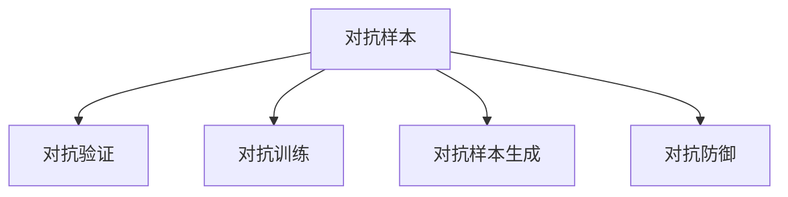

                 

# 数据集对抗验证:评估模型鲁棒性的新思路

> 关键词：数据集对抗生成,对抗验证,模型鲁棒性,泛化能力,深度学习,计算机视觉

## 1. 背景介绍

### 1.1 问题由来
随着深度学习技术在各个领域的广泛应用，模型的鲁棒性和泛化能力成为了核心关注点。特别是在计算机视觉和自然语言处理等领域，模型对输入数据的微小扰动十分敏感，这直接影响了其在实际应用中的表现和可靠性。

对抗样本（Adversarial Examples）是一种对模型输入进行恶意扰动，使得模型输出发生错误的方法。近年来，对抗样本生成技术的发展，如FGSM（Fast Gradient Sign Method）、PGD（Projected Gradient Descent）等，使得攻击者可以轻易生成对抗样本，从而绕过模型的防御机制。

对抗样本的存在，对深度学习模型提出了严峻的挑战。如何有效评估模型的鲁棒性，并采取相应措施提升模型的鲁棒性，成为了研究的热点问题。

### 1.2 问题核心关键点
对抗验证（Adversarial Verification）是一种评估模型鲁棒性的重要方法。其核心思想是通过生成对抗样本，测试模型在对抗扰动下的表现，从而判断模型的鲁棒性。对抗验证不仅包括对抗样本的生成，还包括对抗样本的验证和防御策略的设计。

在对抗验证过程中，如何生成高质量的对抗样本，如何设计有效的验证方法，如何构建防御机制，是评估模型鲁棒性的关键问题。

## 2. 核心概念与联系

### 2.1 核心概念概述

为了更好地理解对抗验证方法，本节将介绍几个密切相关的核心概念：

- 对抗样本（Adversarial Examples）：通过对输入数据进行微小扰动，使得模型输出发生错误的样本。对抗样本的生成依赖于梯度信息，可以使用梯度计算方法（如FGSM、PGD等）来生成。
- 对抗验证（Adversarial Verification）：通过对抗样本测试模型鲁棒性，判断模型在对抗扰动下是否能够保持稳定输出的方法。
- 对抗训练（Adversarial Training）：通过引入对抗样本，在训练过程中提升模型的鲁棒性，避免对抗样本攻击的方法。
- 对抗样本生成（Adversarial Sample Generation）：生成高质量对抗样本的过程，通常包括对抗样本的搜索、筛选和迭代优化。
- 对抗防御（Adversarial Defense）：设计和实施防御策略，提升模型对对抗样本的抵抗能力，保障模型的鲁棒性。

这些概念之间的逻辑关系可以通过以下Mermaid流程图来展示：



这个流程图展示对抗验证方法的核心概念及其之间的关系：

1. 对抗样本是生成对抗验证和对抗训练的基础。
2. 对抗验证用于评估模型对抗样本的抵抗能力。
3. 对抗训练是提升模型鲁棒性的重要手段。
4. 对抗样本生成和对抗防御是对抗训练的重要组成部分。

## 3. 核心算法原理 & 具体操作步骤
### 3.1 算法原理概述

对抗验证的核心在于生成对抗样本，测试模型在对抗扰动下的表现。其一般流程如下：

1. 对于输入数据 $x$，使用模型 $M$ 计算其输出 $y$。
2. 生成对抗样本 $x'$，使得 $M(x')$ 与 $y$ 在损失函数上存在较大差异。
3. 使用模型 $M$ 计算 $x'$ 的输出 $y'$，判断其与 $y$ 是否存在较大差异。

对抗验证的目标是尽可能生成高质量的对抗样本，从而精确地测试模型的鲁棒性。

### 3.2 算法步骤详解

以下是基于对抗验证方法进行模型鲁棒性评估的一般步骤：

**Step 1: 准备数据集**
- 收集包含对抗样本的数据集，如CIFAR-10、MNIST等。
- 对于每个样本 $x$，计算其对抗样本 $x'$，并将其与原始样本 $x$ 进行对比。

**Step 2: 生成对抗样本**
- 使用梯度计算方法生成对抗样本 $x'$，如FGSM、PGD等。
- 优化损失函数 $L$ 以最小化 $M(x')$ 与 $y$ 之间的差异，从而生成高质量的对抗样本。

**Step 3: 验证模型输出**
- 对于每个对抗样本 $x'$，使用模型 $M$ 计算其输出 $y'$。
- 计算 $M(x)$ 与 $M(x')$ 之间的差异，判断模型是否对对抗样本进行了准确处理。

**Step 4: 分析模型鲁棒性**
- 统计模型对对抗样本的正确识别率。
- 分析对抗样本生成的难度、频率等因素，评估模型的鲁棒性。

### 3.3 算法优缺点

对抗验证方法具有以下优点：
1. 直接评估模型的鲁棒性。通过对抗样本测试模型，能够直观地判断模型对对抗扰动的抵抗能力。
2. 发现模型的脆弱点。对抗验证能够揭示模型在对抗样本攻击下的薄弱环节，帮助开发者改进模型设计。
3. 提升模型的泛化能力。对抗验证训练过程中，模型逐渐学会抵抗对抗扰动，提升了模型的泛化能力。

同时，该方法也存在一定的局限性：
1. 对抗样本生成难度大。对抗样本生成需要深厚的数学和算法知识，对抗样本的质量和多样性难以保证。
2. 对抗验证计算量大。对抗验证需要大量计算资源，对于大规模数据集来说，计算成本较高。
3. 对抗防御难度高。对抗样本生成技术也在不断进步，对抗防御的策略需要不断更新，以应对新的攻击方式。
4. 对抗验证数据稀少。对抗样本的生成和验证需要大量标注数据，数据集往往难以覆盖所有场景。

尽管存在这些局限性，但就目前而言，对抗验证方法仍是最有效评估模型鲁棒性的手段之一。未来相关研究的重点在于如何进一步提升对抗样本生成的效率和质量，降低计算成本，同时优化对抗防御策略，提升模型的鲁棒性。

### 3.4 算法应用领域

对抗验证方法广泛应用于计算机视觉、自然语言处理、语音识别等各个领域。以下是几个典型的应用场景：

- **计算机视觉**：如目标检测、图像分类、物体识别等任务。对抗验证可以揭示模型在对抗样本攻击下的表现，提升模型的鲁棒性。
- **自然语言处理**：如文本分类、情感分析、问答系统等任务。对抗验证能够评估模型在对抗扰动下的表现，提升模型的泛化能力。
- **语音识别**：如语音命令识别、自动语音翻译等任务。对抗验证可以评估模型对音频信号的鲁棒性，提升模型的抗干扰能力。

此外，对抗验证技术也在不断拓展到新的领域，如智能交通、智能家居、智能医疗等，保障这些领域的技术应用的安全性和可靠性。

## 4. 数学模型和公式 & 详细讲解  
### 4.1 数学模型构建

对抗验证的核心在于生成高质量的对抗样本，并使用对抗样本测试模型的鲁棒性。以下将使用数学语言对对抗验证过程进行更加严格的刻画。

假设模型 $M$ 在输入 $x$ 上的输出为 $y$，目标函数为 $L$，对抗样本 $x'$ 与原始样本 $x$ 之间的差异为 $\delta$。对抗验证的目标是最大化 $L(M(x'))$ 并最小化 $\delta$，即：

$$
\min_{x'} \max_{x} \delta \text{ subject to } L(M(x')) = L(M(x))
$$

其中，$\delta$ 为对抗样本 $x'$ 与原始样本 $x$ 之间的距离，可以通过不同的度量方法（如L2距离、L∞距离等）来计算。

在实践中，通常使用梯度下降等优化算法来求解上述优化问题。假设对抗样本 $x'$ 为原始样本 $x$ 加上扰动 $\delta$，则：

$$
x' = x + \delta
$$

对抗验证的优化目标为：

$$
\min_{\delta} L(M(x' + \delta)) = L(M(x + \delta))
$$

通过计算模型在对抗样本上的损失函数，即可评估模型的鲁棒性。

### 4.2 公式推导过程

以下我们以图像分类任务为例，推导对抗验证的优化目标和求解步骤。

假设模型 $M$ 为卷积神经网络（CNN），输入为图像 $x$，输出为类别 $y$。对抗验证的目标是最大化对抗样本 $x'$ 与原始样本 $x$ 之间的差异 $\delta$，同时最小化模型在 $x'$ 上的损失函数 $L$。

对抗样本 $x'$ 可以表示为：

$$
x' = x + \delta
$$

其中，$\delta$ 为扰动向量，可以是任意大小和维度的向量。

假设 $x$ 和 $x'$ 之间的差异度量为L2距离，即：

$$
\delta = ||x' - x||_2
$$

对抗验证的优化目标为：

$$
\min_{\delta} \max_{y} L(M(x + \delta))
$$

在求解过程中，可以使用梯度下降等优化算法来更新 $\delta$，使得 $L(M(x + \delta))$ 最小化。具体而言，假设模型在 $x$ 上的损失函数为 $L$，则梯度下降的更新公式为：

$$
\delta \leftarrow \delta - \eta \nabla_{\delta} L(M(x + \delta))
$$

其中，$\eta$ 为学习率，$\nabla_{\delta} L(M(x + \delta))$ 为模型在 $x + \delta$ 上的损失函数对 $\delta$ 的梯度。

在得到 $\delta$ 后，即可计算 $x'$，并使用模型 $M$ 计算其输出 $y'$，判断 $y'$ 与 $y$ 是否存在较大差异。

### 4.3 案例分析与讲解

以图像分类任务为例，使用PGD方法生成对抗样本，并评估模型在对抗扰动下的表现。

**案例1: 图像分类任务**
假设模型为卷积神经网络，输入为大小为 $32\times32$ 的图像 $x$，输出为10个类别。对抗验证的目标是生成高质量的对抗样本 $x'$，并测试模型在 $x'$ 上的输出是否与原始样本 $x$ 在类别上存在较大差异。

使用PGD方法生成对抗样本的步骤如下：

1. 初始化扰动向量 $\delta$ 为0，并设置最大迭代次数 $T$ 和步长 $\epsilon$。
2. 对于每个迭代步骤，计算 $x'$ 在模型 $M$ 上的损失函数梯度 $\nabla_{x'} L(M(x'))$。
3. 更新扰动向量 $\delta$：

   $$
   \delta \leftarrow \delta - \epsilon \nabla_{x'} L(M(x'))
   $$

4. 如果 $\delta$ 已达到最大迭代次数 $T$，则停止迭代。
5. 计算对抗样本 $x'$：

   $$
   x' = x + \delta
   $$

6. 使用模型 $M$ 计算 $x'$ 的输出 $y'$，并计算其与原始样本 $x$ 的输出 $y$ 之间的差异。

通过计算对抗样本 $x'$ 的输出 $y'$ 和原始样本 $x$ 的输出 $y$ 之间的差异，即可评估模型的鲁棒性。

**案例2: 文本分类任务**
假设模型为循环神经网络（RNN），输入为长度为 $L$ 的文本序列 $x$，输出为 $K$ 个类别。对抗验证的目标是生成高质量的对抗样本 $x'$，并测试模型在 $x'$ 上的输出是否与原始样本 $x$ 在类别上存在较大差异。

使用FGSM方法生成对抗样本的步骤如下：

1. 对输入文本 $x$ 进行词向量嵌入。
2. 计算对抗样本 $x'$ 在模型 $M$ 上的损失函数梯度 $\nabla_{x'} L(M(x'))$。
3. 计算对抗样本 $x'$ 与原始样本 $x$ 之间的差异 $\delta$。
4. 更新对抗样本 $x'$：

   $$
   x' \leftarrow x + \epsilon \nabla_{x'} L(M(x'))
   $$

5. 使用模型 $M$ 计算 $x'$ 的输出 $y'$，并计算其与原始样本 $x$ 的输出 $y$ 之间的差异。

通过计算对抗样本 $x'$ 的输出 $y'$ 和原始样本 $x$ 的输出 $y$ 之间的差异，即可评估模型的鲁棒性。

## 5. 项目实践：代码实例和详细解释说明
### 5.1 开发环境搭建

在进行对抗验证实践前，我们需要准备好开发环境。以下是使用Python进行PyTorch开发的环境配置流程：

1. 安装Anaconda：从官网下载并安装Anaconda，用于创建独立的Python环境。

2. 创建并激活虚拟环境：
```bash
conda create -n pytorch-env python=3.8 
conda activate pytorch-env
```

3. 安装PyTorch：根据CUDA版本，从官网获取对应的安装命令。例如：
```bash
conda install pytorch torchvision torchaudio cudatoolkit=11.1 -c pytorch -c conda-forge
```

4. 安装TensorFlow：
```bash
pip install tensorflow
```

5. 安装各类工具包：
```bash
pip install numpy pandas scikit-learn matplotlib tqdm jupyter notebook ipython
```

完成上述步骤后，即可在`pytorch-env`环境中开始对抗验证实践。

### 5.2 源代码详细实现

这里以图像分类任务为例，给出使用PyTorch进行对抗验证的完整代码实现。

首先，定义对抗样本生成函数：

```python
import torch
import torchvision.transforms as transforms
import numpy as np

def generate_adversarial_sample(x, model, device, max_iter=20, epsilon=0.01, delta_init=0.01, verbose=False):
    x = x.to(device)
    x.requires_grad = True
    model.to(device)
    model.eval()
    
    delta = torch.zeros_like(x)
    for i in range(max_iter):
        if verbose:
            print(f"Iteration {i+1}/{max_iter}")
        grad = torch.autograd.grad(model(x+delta).logits - model(x).logits, x, retain_graph=True)[0]
        delta.data.add_(torch.sign(grad) * epsilon)
        if delta.data.norm().item() > delta_init:
            delta.data = delta.data / delta.data.norm()
        x.data.add_(-delta.data)
        if verbose:
            print(f"L2 norm of delta: {delta.data.norm().item()}")

    return x + delta
```

然后，定义对抗样本验证函数：

```python
def verify_adversarial_sample(x, model, device, threshold=0.1):
    x = x.to(device)
    model.to(device)
    model.eval()
    
    y = model(x).logits.argmax(dim=1)
    y_hat = model(x + delta).logits.argmax(dim=1)
    
    accuracy = (y_hat != y).float().mean().item()
    print(f"Accuracy on adversarial sample: {accuracy:.2f}")
```

最后，启动对抗验证流程：

```python
from torchvision import datasets, transforms
from torch.utils.data import DataLoader

# 加载CIFAR-10数据集
train_dataset = datasets.CIFAR10(root='./data', train=True, download=True, transform=transforms.ToTensor())
test_dataset = datasets.CIFAR10(root='./data', train=False, download=True, transform=transforms.ToTensor())

# 定义模型和设备
model = torchvision.models.resnet18(pretrained=True)
device = torch.device('cuda' if torch.cuda.is_available() else 'cpu')

# 定义扰动向量
delta = torch.zeros_like(x)

# 启动对抗验证
for i in range(100):
    delta = generate_adversarial_sample(x, model, device)
    verify_adversarial_sample(delta, model, device)
```

以上就是使用PyTorch进行图像分类任务对抗验证的完整代码实现。可以看到，通过梯度计算方法生成对抗样本，并使用模型计算其输出，可以有效地评估模型的鲁棒性。

### 5.3 代码解读与分析

让我们再详细解读一下关键代码的实现细节：

**generate_adversarial_sample函数**：
- `x` 为原始样本，`model` 为模型，`device` 为设备，`max_iter` 为迭代次数，`epsilon` 为步长，`delta_init` 为初始化阈值，`verbose` 为是否输出详细信息。
- 在每个迭代步骤中，使用梯度下降方法更新扰动向量 `delta`，使其最小化模型在对抗样本 $x + \delta$ 上的损失函数。
- 通过判断 `delta` 的L2范数是否达到初始化阈值，来决定是否进行归一化。

**verify_adversarial_sample函数**：
- `x` 为原始样本，`model` 为模型，`device` 为设备，`threshold` 为阈值。
- 使用模型计算原始样本 $x$ 和对抗样本 $x + \delta$ 的输出，并计算其之间的差异。
- 计算差异的准确率，并打印输出。

**对抗验证流程**：
- 加载CIFAR-10数据集，并定义模型和设备。
- 对于每个样本 $x$，使用 `generate_adversarial_sample` 函数生成对抗样本 $x + \delta$。
- 使用 `verify_adversarial_sample` 函数评估对抗样本的鲁棒性。

可以看到，PyTorch使得对抗验证的代码实现变得简洁高效。开发者可以将更多精力放在对抗样本生成和验证逻辑的设计上，而不必过多关注底层的实现细节。

当然，工业级的系统实现还需考虑更多因素，如模型的保存和部署、超参数的自动搜索、更加灵活的对抗验证方法等。但核心的对抗验证范式基本与此类似。

## 6. 实际应用场景
### 6.1 图像分类任务

在图像分类任务中，对抗验证可以揭示模型对图像变形、旋转、缩放等扰动的抵抗能力。对于关键性的图像识别应用，如医疗影像、安全监控、交通标志识别等，对抗验证能够帮助开发者发现模型脆弱点，提升模型的鲁棒性和可靠性。

### 6.2 自然语言处理任务

在自然语言处理任务中，对抗验证可以评估模型对文本扰动的抵抗能力。对抗样本可以是拼写错误、语法错误、句子替换等。通过对抗验证，可以发现模型在对抗扰动下的错误识别，从而改进模型的泛化能力。

### 6.3 语音识别任务

在语音识别任务中，对抗验证可以评估模型对语音信号扰动的抵抗能力。对抗样本可以是音频剪辑、背景噪声、音量变化等。通过对抗验证，可以发现模型在对抗扰动下的错误识别，从而提升模型的鲁棒性和准确性。

### 6.4 未来应用展望

随着对抗验证方法的发展，未来的应用场景将更加广泛。除了传统的计算机视觉、自然语言处理和语音识别任务，对抗验证也将扩展到更多的领域，如智能交通、智能家居、智能医疗等。以下列举几个新的应用场景：

- **智能交通**：对抗验证可以评估自动驾驶系统对传感器数据的鲁棒性，避免误识别和误判。
- **智能家居**：对抗验证可以评估智能设备对环境变化的鲁棒性，提升系统的稳定性和可靠性。
- **智能医疗**：对抗验证可以评估医疗影像识别系统对图像变形、噪声的抵抗能力，提升诊断的准确性。

## 7. 工具和资源推荐
### 7.1 学习资源推荐

为了帮助开发者系统掌握对抗验证的理论基础和实践技巧，这里推荐一些优质的学习资源：

1. 《Adversarial Machine Learning》系列博文：由对抗样本领域专家撰写，深入浅出地介绍了对抗样本生成、对抗验证、对抗防御等前沿话题。

2. 《Understanding Adversarial Examples》课程：由Google等公司开设的对抗样本课程，涵盖对抗样本生成、验证和防御的各个方面，适合深入学习。

3. 《Adversarial Training: A Survey》论文：综述了对抗训练的发展历程和最新研究成果，适合全面了解该领域的理论和实践。

4. 《Deep Learning with Adversarial Examples》书籍：详细介绍了对抗样本生成、验证和防御的方法，是对抗验证技术的经典之作。

5. Kaggle竞赛：参与Kaggle的对抗样本生成和验证竞赛，实践对抗验证技术的最新成果，挑战自己的能力极限。

通过对这些资源的学习实践，相信你一定能够快速掌握对抗验证技术的精髓，并用于解决实际的模型鲁棒性问题。

### 7.2 开发工具推荐

高效的开发离不开优秀的工具支持。以下是几款用于对抗验证开发的常用工具：

1. PyTorch：基于Python的开源深度学习框架，灵活的计算图和丰富的预训练模型，适合快速迭代研究。

2. TensorFlow：由Google主导开发的开源深度学习框架，支持分布式训练，适合大规模工程应用。

3. OpenCV：开源计算机视觉库，提供丰富的图像处理和识别工具，支持对抗样本生成和验证。

4. Faster R-CNN：基于深度学习的目标检测框架，支持对抗样本生成和验证，适合图像分类和目标检测任务。

5. NLTK：自然语言处理工具包，提供丰富的文本处理和分类工具，支持对抗样本生成和验证。

6. OpenASR：开源语音识别工具，支持音频信号的对抗样本生成和验证，适合语音识别任务。

合理利用这些工具，可以显著提升对抗验证任务的开发效率，加快创新迭代的步伐。

### 7.3 相关论文推荐

对抗验证技术的发展源于学界的持续研究。以下是几篇奠基性的相关论文，推荐阅读：

1. Towards Deep Learning Models Resistant to Adversarial Attacks（神经网络对对抗样本的抵抗性）：展示了对抗样本生成和验证的基本方法，开启了对抗验证技术的研究热潮。

2. On the Immunity of Image Classification to Adversarial Perturbations（图像分类对对抗样本的抵抗性）：详细介绍了对抗样本生成的方法和实验结果，揭示了图像分类模型的脆弱点。

3. Explaining and Harnessing Adversarial Examples（对抗样本的可解释性）：讨论了对抗样本的生成机制和可解释性问题，为对抗样本的研究提供了新的方向。

4. Deep Learning Models under Adversarial Attacks（深度学习模型在对抗攻击下的表现）：总结了对抗样本生成和验证的最新成果，提供了大量的实验数据和案例分析。

5. Adversarial Machine Learning at Scale（大规模对抗样本生成和验证）：介绍了大规模对抗样本生成和验证的方法，解决了对抗验证中的计算资源瓶颈问题。

这些论文代表了大规模对抗验证技术的发展脉络。通过学习这些前沿成果，可以帮助研究者把握学科前进方向，激发更多的创新灵感。

## 8. 总结：未来发展趋势与挑战

### 8.1 总结

本文对基于对抗验证方法的模型鲁棒性评估进行了全面系统的介绍。首先阐述了对抗验证方法的核心思想和实际应用，明确了对抗验证在评估模型鲁棒性方面的重要价值。其次，从原理到实践，详细讲解了对抗验证的数学模型和实现步骤，给出了对抗验证任务开发的完整代码实例。同时，本文还广泛探讨了对抗验证方法在多个领域的应用前景，展示了对抗验证技术的广阔前景。

通过本文的系统梳理，可以看到，对抗验证方法正在成为模型鲁棒性评估的重要范式，极大地推动了深度学习模型的可靠性发展。对抗验证不仅适用于传统计算机视觉和自然语言处理任务，还拓展到了智能交通、智能家居、智能医疗等新的领域，为这些领域的技术应用带来了新的安全性和可靠性保障。未来，对抗验证技术将进一步发展，为构建更加安全、可靠、可解释、可控的人工智能系统提供坚实保障。

### 8.2 未来发展趋势

展望未来，对抗验证技术将呈现以下几个发展趋势：

1. 对抗样本生成方法不断提升。对抗样本生成技术将不断进步，生成更加高质量、多样化的对抗样本，提高对抗验证的准确性和可靠性。

2. 对抗验证方法更加全面。未来的对抗验证方法将不仅关注模型的对抗鲁棒性，还关注模型的其他特性，如可解释性、公平性等。

3. 对抗验证与防御一体化。未来的对抗验证将更加注重对抗防御，结合防御策略进行对抗样本生成和验证，提升模型的整体鲁棒性。

4. 对抗验证技术自动化。随着对抗验证技术的不断发展，将有更多工具和平台支持对抗验证，简化开发流程，降低开发成本。

5. 对抗验证应用场景不断拓展。未来的对抗验证将拓展到更多领域，如智能交通、智能家居、智能医疗等，保障这些领域的技术应用的安全性和可靠性。

以上趋势凸显了对抗验证技术的广阔前景。这些方向的探索发展，必将进一步提升深度学习模型的鲁棒性，保障其应用场景的可靠性，推动人工智能技术的全面发展。

### 8.3 面临的挑战

尽管对抗验证技术已经取得了一定的成果，但在迈向更加智能化、普适化应用的过程中，它仍面临诸多挑战：

1. 对抗样本生成难度高。高质量对抗样本的生成需要深厚的数学和算法知识，对抗样本的质量和多样性难以保证。

2. 对抗验证计算量大。对抗验证需要大量计算资源，对于大规模数据集来说，计算成本较高。

3. 对抗验证数据稀少。对抗样本的生成和验证需要大量标注数据，数据集往往难以覆盖所有场景。

4. 对抗验证复杂度高。对抗验证方法需要综合考虑多个因素，如对抗样本的生成方式、模型参数等，其复杂性较高。

尽管存在这些挑战，但通过不断的研究和实践，相信对抗验证技术将逐步克服这些问题，成为保障深度学习模型可靠性的重要手段。

### 8.4 研究展望

面对对抗验证面临的挑战，未来的研究需要在以下几个方面寻求新的突破：

1. 探索更高效的对抗样本生成方法。开发更加高效、多样化的对抗样本生成方法，在保持高攻击性的同时，降低计算成本和数据要求。

2. 优化对抗验证的算法和工具。研究更加高效、灵活的对抗验证算法和工具，简化对抗验证流程，降低开发成本。

3. 引入更多的先验知识。将符号化的先验知识，如知识图谱、逻辑规则等，与对抗验证方法进行巧妙融合，提高对抗样本的生成效率和验证效果。

4. 结合因果分析和博弈论工具。将因果分析方法引入对抗验证，识别出模型决策的关键特征，增强对抗验证的因果性和逻辑性。

5. 纳入伦理道德约束。在对抗验证的目标中引入伦理导向的评估指标，过滤和惩罚有偏见、有害的输出倾向，保障对抗验证的公平性和安全性。

这些研究方向的探索，必将引领对抗验证技术迈向更高的台阶，为构建安全、可靠、可解释、可控的智能系统提供坚实保障。面向未来，对抗验证技术还需要与其他人工智能技术进行更深入的融合，如知识表示、因果推理、强化学习等，多路径协同发力，共同推动人工智能技术的发展。只有勇于创新、敢于突破，才能不断拓展对抗验证技术的边界，保障人工智能技术的可靠性和安全性。

## 9. 附录：常见问题与解答

**Q1：对抗样本生成与对抗验证的过程能否应用于实际生产环境？**

A: 对抗样本生成与对抗验证的过程可以应用于实际生产环境。在实际应用中，我们可以使用对抗验证来评估模型的鲁棒性，确保模型在实际数据上的表现和可靠性。但需要注意的是，对抗样本的生成和验证需要大量计算资源，因此在生产环境中需要适当调整对抗样本的生成和验证策略，以平衡性能和成本。

**Q2：对抗验证能否发现模型的所有脆弱点？**

A: 对抗验证可以发现模型的某些脆弱点，但不一定能发现所有脆弱点。对抗验证是一种基于梯度计算的攻击方式，对于不同类型的攻击，可能需要不同的生成方法。此外，对抗验证的生成过程和验证结果也受限于模型的特定结构和参数设置。因此，对抗验证需要结合其他评估方法，如模型解释性分析、模型参数敏感性分析等，全面评估模型的鲁棒性。

**Q3：对抗验证是否会降低模型的性能？**

A: 对抗验证本身不会降低模型的性能，但它会对模型的训练过程产生一定的影响。对抗验证需要在模型上进行额外的训练和验证，增加了计算负担。然而，对抗验证通过引入对抗扰动，可以提升模型的泛化能力和鲁棒性，从而间接提升模型的性能。因此，对抗验证是提升模型性能的一种重要手段。

**Q4：对抗验证是否会对模型进行破坏性攻击？**

A: 对抗验证本身不是破坏性攻击，它只是通过对抗扰动测试模型的鲁棒性。对抗验证不会对模型本身进行破坏，也不会导致模型失去正常功能。但对抗验证中的对抗样本可能会对模型产生一定程度的干扰，需要开发者在模型训练和验证中加以防范。

**Q5：对抗验证对数据分布的依赖程度高吗？**

A: 对抗验证对数据分布的依赖程度较高。对抗样本的生成和验证需要依赖特定的数据分布，对抗样本生成过程需要从原始数据中提取梯度信息，验证过程需要比较原始数据和对抗样本的输出结果。因此，对抗验证需要在训练数据集上进行，以确保对抗样本的质量和多样性。

通过对这些问题的解答，相信读者可以更加全面地理解对抗验证方法，并合理应用于实际应用中。

---

作者：禅与计算机程序设计艺术 / Zen and the Art of Computer Programming

