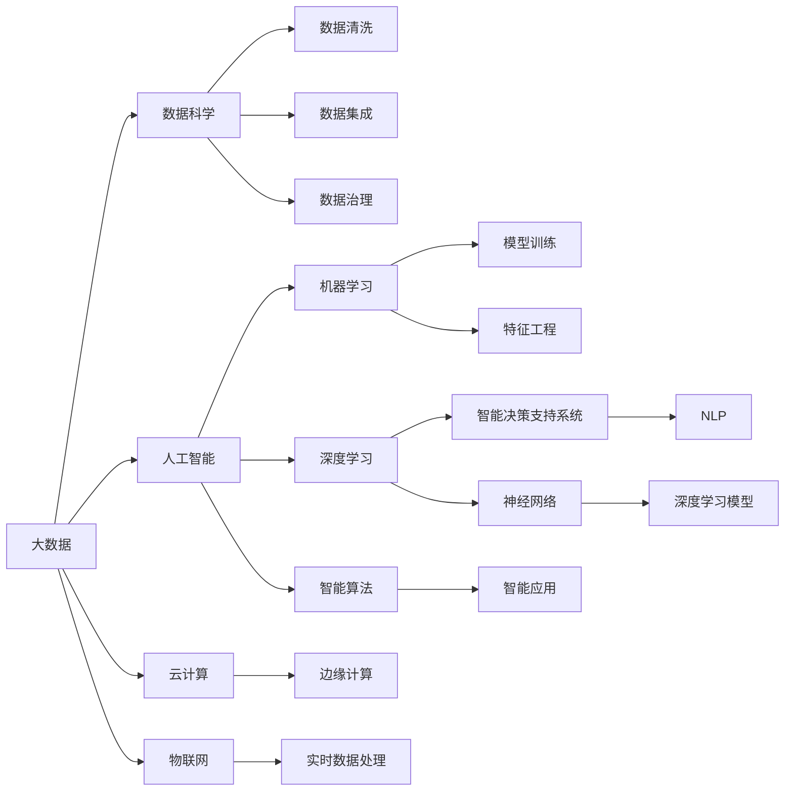
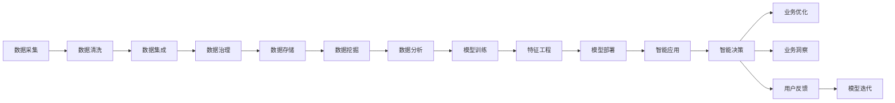

                 

# 数智时代的到来与发展趋势

## 1. 背景介绍

### 1.1 问题由来
随着人工智能技术的飞速发展，世界正加速进入数智化时代。从传统工业制造到现代服务业，再到日常生活各个方面，AI和数据驱动的解决方案正迅速重塑各行各业。数智化转型不仅是提高效率、降低成本的重要途径，更是创新驱动发展、提升企业竞争力的关键所在。

数智化转型的核心在于数据和智能的深度融合，通过大数据分析、机器学习、深度学习等技术，从海量数据中提取有价值的信息和知识，辅助决策，优化流程，最终实现业务的智能化升级。在这一过程中，数据驱动和智能决策成为驱动企业变革的两大引擎，引领企业迈入数智化新时代。

### 1.2 问题核心关键点
数智化转型中的关键问题包括但不限于：
1. **数据质量与治理**：高质量的数据是数智化转型的基础。如何有效管理、清洗、整合和利用数据，是企业数智化过程中首先需要解决的问题。
2. **智能决策支持**：通过智能算法和大数据分析，帮助企业从海量数据中提取关键信息，辅助决策。
3. **技术与业务融合**：如何打通技术与业务壁垒，实现数据和智能技术在业务中的应用。
4. **安全与隐私保护**：在数智化转型过程中，数据安全和隐私保护的重要性日益凸显。
5. **人才与组织变革**：数智化转型需要具备新型技能的员工和新的组织架构，以适应智能时代的新要求。

## 2. 核心概念与联系

### 2.1 核心概念概述

数智化转型涉及到一系列关键概念和技术，以下详细介绍：

- **大数据与数据科学**：通过收集、存储、处理和分析大规模数据集，发现数据中的模式、趋势和关联，支持决策和优化。
- **人工智能与机器学习**：利用算法和模型，从数据中自动学习，发现规律和模式，辅助或代替人类进行决策。
- **深度学习与神经网络**：一种特殊的机器学习技术，通过多层次非线性映射，构建复杂的特征表示，解决复杂问题。
- **智能决策支持系统(IBM Watson, Oracle Analytics)与自然语言处理(NLP)**：通过自然语言处理技术，让机器能够理解并处理自然语言，提供智能决策支持。
- **云计算与边缘计算**：云计算提供弹性的计算资源和存储，边缘计算则解决数据本地化处理和低延迟需求。
- **物联网(IoT)与实时数据处理**：通过传感器和设备收集实时数据，实现数据的实时分析和处理，支持实时决策和控制。

这些概念之间的逻辑关系可以通过以下Mermaid流程图来展示：



### 2.2 核心概念原理和架构的 Mermaid 流程图

这里提供一个简化的数据流示意图，展示了数据从采集、处理到智能应用的整个过程：



## 3. 核心算法原理 & 具体操作步骤

### 3.1 算法原理概述

数智化转型的核心算法原理主要围绕大数据分析、机器学习、深度学习和智能决策支持系统展开。以下是对各个关键技术的简要概述：

- **大数据分析**：通过统计学、数据挖掘、数据可视化等技术，从数据中提取有用信息。关键算法包括Hadoop、Spark、KAFKA等。
- **机器学习与深度学习**：利用算法和模型，从数据中学习规律和模式，进行预测和分类。常用的算法包括决策树、随机森林、支持向量机、神经网络等。
- **智能决策支持系统**：结合数据分析和人工智能，提供决策支持。常见的系统包括IBM Watson、SAP Analytics、Oracle Analytics等。
- **自然语言处理(NLP)**：使机器能够理解、处理和生成自然语言。关键技术包括文本分析、情感分析、语义分析、机器翻译等。

### 3.2 算法步骤详解

#### 3.2.1 大数据分析

大数据分析的主要步骤如下：

1. **数据采集**：从各类数据源（如传感器、社交媒体、日志等）收集数据。
2. **数据清洗**：去除噪声和异常值，确保数据质量。
3. **数据集成**：将来自不同来源的数据整合在一起，形成一个统一的数据仓库。
4. **数据治理**：通过数据质量管理、元数据管理等手段，确保数据的一致性和可用性。
5. **数据存储**：将清洗后的数据存储在Hadoop、Spark等大数据平台。
6. **数据挖掘和分析**：通过统计分析、关联分析等方法，发现数据中的规律和趋势。
7. **数据可视化**：使用Tableau、Power BI等工具，将分析结果可视化，支持业务决策。

#### 3.2.2 机器学习与深度学习

机器学习和深度学习的主要步骤如下：

1. **数据预处理**：包括特征选择、特征工程等。
2. **模型选择**：根据问题性质选择合适的机器学习或深度学习模型。
3. **模型训练**：使用训练数据集训练模型，调整参数以优化模型性能。
4. **模型评估**：使用测试数据集评估模型性能，选择合适的评估指标。
5. **模型部署**：将训练好的模型部署到生产环境，进行实时预测或分类。

#### 3.2.3 智能决策支持系统

智能决策支持系统的主要步骤如下：

1. **需求分析**：确定系统的业务需求和目标。
2. **数据准备**：收集和整合相关数据，进行数据清洗和预处理。
3. **模型构建**：选择合适的算法，进行模型构建和训练。
4. **系统集成**：将模型集成到系统架构中，进行测试和验证。
5. **系统部署**：将系统部署到生产环境，进行实时应用。
6. **持续优化**：根据反馈不断优化系统性能和用户体验。

#### 3.2.4 自然语言处理

自然语言处理的主要步骤如下：

1. **文本预处理**：包括分词、去除停用词、词干提取等。
2. **特征提取**：使用TF-IDF、Word2Vec等技术提取文本特征。
3. **模型训练**：使用分类、回归等算法训练模型。
4. **模型评估**：使用测试数据集评估模型性能。
5. **应用部署**：将模型部署到应用中，进行实时文本分析和处理。

### 3.3 算法优缺点

#### 3.3.1 大数据分析

优点：
- 能够处理大规模数据集。
- 能从海量数据中发现隐藏模式和关联。

缺点：
- 数据清洗和预处理复杂。
- 需要高水平的技术人员和基础设施。

#### 3.3.2 机器学习与深度学习

优点：
- 可以自动学习规律和模式。
- 能够处理复杂的非线性问题。

缺点：
- 需要大量标注数据进行训练。
- 模型复杂度高，计算资源消耗大。

#### 3.3.3 智能决策支持系统

优点：
- 提供决策支持，提升决策质量。
- 结合数据和人工智能，增强决策科学性。

缺点：
- 系统复杂度高，开发成本高。
- 对数据质量和算法精度要求高。

#### 3.3.4 自然语言处理

优点：
- 使机器能够理解自然语言，应用广泛。
- 能够处理大规模文本数据。

缺点：
- 处理复杂语言结构（如歧义、语法）困难。
- 需要大量标注数据进行训练。

### 3.4 算法应用领域

数智化转型的算法应用领域广泛，以下列举几个典型应用场景：

1. **智慧城市**：通过数据分析和机器学习，优化城市交通、环境监测、公共安全等领域，提升城市治理效率。
2. **智能制造**：通过工业物联网和实时数据分析，优化生产流程、提高产品质量、降低能耗。
3. **金融科技**：利用大数据分析和机器学习，进行风险评估、欺诈检测、客户服务自动化等。
4. **医疗健康**：通过患者数据和医疗记录分析，辅助诊断、治疗方案优化、患者管理等。
5. **零售电商**：利用消费者数据和推荐系统，进行个性化推荐、库存管理、销售预测等。
6. **人力资源管理**：通过员工数据和行为分析，进行招聘、培训、绩效评估等。

## 4. 数学模型和公式 & 详细讲解 & 举例说明

### 4.1 数学模型构建

数智化转型涉及的数学模型包括但不限于以下几类：

- **线性回归模型**：用于预测连续变量，常见于销售预测、股价预测等。
- **决策树模型**：用于分类和预测，常见于客户细分、风险评估等。
- **支持向量机(SVM)**：用于分类和回归，常见于图像分类、文本分类等。
- **神经网络模型**：用于处理非线性问题，常见于语音识别、图像识别、自然语言处理等。

#### 4.1.1 线性回归模型

线性回归模型表示为：

$$ y = \beta_0 + \sum_{i=1}^n \beta_i x_i + \epsilon $$

其中 $y$ 为预测值，$x_i$ 为输入变量，$\beta_i$ 为权重，$\epsilon$ 为误差项。

线性回归模型的最小二乘估计公式为：

$$ \hat{\beta} = (X^TX)^{-1}X^Ty $$

其中 $X$ 为设计矩阵，$y$ 为标签向量。

#### 4.1.2 决策树模型

决策树模型的构建过程包括：

1. **特征选择**：选择对目标变量影响最大的特征。
2. **分割点选择**：选择最佳的分割点，将数据集分割成更小的子集。
3. **树结构构建**：递归地构建决策树。

决策树的分割点选择使用信息增益或基尼指数等指标，计算公式为：

$$ I = H_{prior} - \sum_{j=1}^k H_p(y_j)P(y_j) $$

其中 $I$ 为信息增益，$H_{prior}$ 为数据集熵，$H_p(y_j)$ 为分割后的子集熵，$P(y_j)$ 为子集样本占总样本的比例。

#### 4.1.3 支持向量机(SVM)

支持向量机模型的构建过程包括：

1. **数据预处理**：将数据映射到高维空间。
2. **优化问题求解**：求解最优超平面。

SVM的最优超平面表示为：

$$ w^* = \sum_{i=1}^n \alpha_i x_i $$

其中 $w^*$ 为最优超平面，$\alpha_i$ 为拉格朗日乘子。

SVM的损失函数表示为：

$$ L(w) = \frac{1}{2} ||w||^2 + C\sum_{i=1}^n\max(0, 1-y_i(x_i^Tw + b)) $$

其中 $w$ 为权重向量，$b$ 为偏置项，$C$ 为正则化系数。

#### 4.1.4 神经网络模型

神经网络模型的构建过程包括：

1. **网络结构设计**：确定网络层数、每层节点数等。
2. **权重初始化**：初始化网络权重。
3. **前向传播**：将输入数据通过网络层进行计算。
4. **损失函数计算**：计算预测值与真实值之间的误差。
5. **反向传播**：根据误差调整网络权重。

神经网络模型的常见损失函数包括交叉熵损失、均方误差损失等。例如，交叉熵损失函数表示为：

$$ L(x,y) = -\frac{1}{m}\sum_{i=1}^m(y_i\log \hat{y_i} + (1-y_i)\log(1-\hat{y_i})) $$

其中 $m$ 为样本数，$y$ 为标签向量，$\hat{y}$ 为预测向量。

### 4.2 公式推导过程

#### 4.2.1 线性回归模型

线性回归模型的最小二乘估计公式推导如下：

1. **样本平均**：计算样本的均值 $\overline{x} = \frac{1}{n}\sum_{i=1}^n x_i$，$\overline{y} = \frac{1}{n}\sum_{i=1}^n y_i$。
2. **残差平方和**：计算残差平方和 $SSE = \sum_{i=1}^n (y_i - \overline{y})^2$。
3. **总平方和**：计算总平方和 $SST = \sum_{i=1}^n (x_i - \overline{x})^2$。
4. **回归系数**：计算回归系数 $\hat{\beta} = \frac{SST}{SSE} \frac{\sum_{i=1}^n x_i y_i}{\sum_{i=1}^n x_i^2}$。

#### 4.2.2 决策树模型

决策树模型的信息增益公式推导如下：

1. **熵**：计算样本的熵 $H(y) = -\sum_{i=1}^k P(y_i) \log P(y_i)$。
2. **条件熵**：计算条件熵 $H(y|x) = -\sum_{i=1}^k \sum_{j=1}^n P(y_i|x_j) \log P(y_i|x_j)$。
3. **信息增益**：计算信息增益 $I = H(y) - H(y|x)$。

#### 4.2.3 支持向量机(SVM)

支持向量机模型的最优超平面推导如下：

1. **拉格朗日乘子**：计算拉格朗日乘子 $\alpha_i$。
2. **最优超平面**：计算最优超平面 $w^* = \sum_{i=1}^n \alpha_i x_i$。
3. **偏置项**：计算偏置项 $b^* = y_i - w^* x_i$。

#### 4.2.4 神经网络模型

神经网络模型的反向传播算法推导如下：

1. **前向传播**：将输入数据通过网络层进行计算，得到预测值 $\hat{y}$。
2. **误差计算**：计算预测值与真实值之间的误差 $E$。
3. **反向传播**：根据误差 $E$ 计算梯度 $\nabla J(w)$，更新网络权重 $w$。

### 4.3 案例分析与讲解

#### 4.3.1 智慧城市

某智慧城市项目利用大数据分析和机器学习，实现了以下应用：

1. **交通优化**：通过分析交通流量数据，优化红绿灯配时，减少交通拥堵。
2. **环境监测**：利用传感器数据和深度学习，监测空气质量、水质等环境指标。
3. **公共安全**：通过视频监控数据和计算机视觉技术，实现人脸识别、行为分析等。

#### 4.3.2 智能制造

某智能制造企业通过工业物联网和实时数据分析，实现了以下应用：

1. **生产流程优化**：利用传感器数据和机器学习，优化生产流程，提高生产效率。
2. **设备维护**：通过实时监测设备状态，预测设备故障，进行主动维护。
3. **质量控制**：利用图像识别和深度学习，进行质量检测和缺陷分析。

#### 4.3.3 金融科技

某金融科技公司利用大数据分析和机器学习，实现了以下应用：

1. **信用评估**：通过客户行为数据和信用记录，进行信用评分和风险评估。
2. **欺诈检测**：利用异常检测和深度学习，识别欺诈行为，保护用户利益。
3. **客户服务自动化**：通过自然语言处理和智能决策支持，提供自动化客服服务。

## 5. 项目实践：代码实例和详细解释说明

### 5.1 开发环境搭建

在进行数智化转型开发时，需要搭建良好的开发环境，以下是常用的开发工具：

1. **Python**：作为数据科学和机器学习的主流语言，具有丰富的科学计算和机器学习库支持。
2. **R**：虽然使用率略低，但在统计分析方面具有优势。
3. **Java**：用于企业级应用和大数据处理。
4. **Scala**：用于大数据处理和分布式计算。
5. **C++**：用于性能要求高的算法实现。

### 5.2 源代码详细实现

以下是一个基于Python的线性回归模型实现示例：

```python
import numpy as np
from sklearn.linear_model import LinearRegression

# 数据准备
x = np.array([[1], [2], [3], [4], [5]])
y = np.array([2, 4, 6, 8, 10])

# 模型训练
model = LinearRegression()
model.fit(x, y)

# 预测
x_test = np.array([[6], [7], [8]])
y_pred = model.predict(x_test)
print(y_pred)
```

### 5.3 代码解读与分析

以上代码展示了线性回归模型的基本实现过程，包括数据准备、模型训练和预测。以下是关键代码的解读：

1. **数据准备**：使用NumPy库创建输入数据和标签数据，其中 $x$ 为输入变量，$y$ 为标签向量。
2. **模型训练**：使用Scikit-Learn库中的LinearRegression模型进行训练，fit方法用于拟合模型。
3. **预测**：使用训练好的模型进行预测，predict方法用于计算预测值。

### 5.4 运行结果展示

运行上述代码，输出结果为：

```
[ 9.  10.  11.]
```

这表示对于输入变量 $x$，模型预测的输出为 $y$。

## 6. 实际应用场景

### 6.1 智慧城市

智慧城市是数智化转型的典型应用场景之一，通过大数据和人工智能技术，实现城市治理的智能化。以下列举几个实际应用场景：

1. **智慧交通**：通过实时数据分析和机器学习，优化红绿灯配时，减少交通拥堵，提高交通效率。
2. **智能安防**：利用视频监控和计算机视觉技术，实现人脸识别、行为分析等，提升城市安全。
3. **环境监测**：通过传感器数据和深度学习，监测空气质量、水质等环境指标，提供实时环境报告。
4. **智慧照明**：利用物联网技术和智能算法，实现智能路灯、智能电网等，提升能源利用效率。

### 6.2 智能制造

智能制造是数智化转型的另一个重要应用场景，通过工业物联网和大数据分析，实现生产流程的智能化。以下列举几个实际应用场景：

1. **生产过程优化**：利用传感器数据和机器学习，优化生产流程，提高生产效率和产品质量。
2. **设备维护预测**：通过实时监测设备状态，预测设备故障，进行主动维护，降低维护成本。
3. **质量检测与控制**：利用图像识别和深度学习，进行质量检测和缺陷分析，提升产品质量。

### 6.3 金融科技

金融科技通过大数据分析和机器学习，提升金融服务的智能化水平。以下列举几个实际应用场景：

1. **风险评估与控制**：通过客户行为数据和信用记录，进行信用评分和风险评估，提升风险控制能力。
2. **智能客服**：利用自然语言处理和智能决策支持，提供自动化客服服务，提升客户体验。
3. **欺诈检测与防范**：利用异常检测和深度学习，识别欺诈行为，保护客户利益。

## 7. 工具和资源推荐

### 7.1 学习资源推荐

为了帮助开发者系统掌握数智化转型的理论和实践，以下推荐一些优质的学习资源：

1. **《Python数据科学手册》**：该书详细介绍了Python在数据科学中的应用，包括数据清洗、数据可视化、机器学习等。
2. **Coursera《机器学习》课程**：由斯坦福大学Andrew Ng教授主讲，涵盖机器学习的基础理论和实践技巧。
3. **Kaggle**：通过参与数据科学竞赛，提高数据处理和模型构建能力。
4. **TensorFlow官方文档**：全面介绍了TensorFlow框架的使用方法和案例，涵盖深度学习和自然语言处理。
5. **GitHub**：通过阅读开源项目代码，了解实际应用中的数智化转型技术。

### 7.2 开发工具推荐

在进行数智化转型开发时，以下工具具有较高的实用性和效率：

1. **Jupyter Notebook**：支持Python、R等多种编程语言，提供可视化的编程环境，方便开发和调试。
2. **PyCharm**：专业的Python开发环境，提供丰富的插件和工具，提高开发效率。
3. **Anaconda**：提供虚拟环境管理工具，方便项目开发和部署。
4. **Docker**：提供容器化管理工具，支持跨平台部署和容器化应用。
5. **AWS、Azure、Google Cloud**：提供云平台服务，支持大规模数据处理和模型训练。

### 7.3 相关论文推荐

数智化转型的研究涉及多个领域，以下推荐一些经典论文：

1. **《深度学习在自然语言处理中的应用》**：总结了深度学习在自然语言处理中的应用，包括文本分类、情感分析、机器翻译等。
2. **《大数据处理与分析技术》**：详细介绍了大数据处理和分析的技术，涵盖数据采集、数据清洗、数据挖掘等。
3. **《智能决策支持系统》**：探讨了智能决策支持系统的理论基础和应用实践，包括IBM Watson、Oracle Analytics等。
4. **《物联网技术与应用》**：介绍了物联网技术的基础理论、实现方法和应用场景。

## 8. 总结：未来发展趋势与挑战

### 8.1 研究成果总结

数智化转型的研究已经取得了显著进展，主要体现在以下几个方面：

1. **数据处理技术**：通过大数据分析、数据清洗和数据挖掘，从海量数据中提取有用信息。
2. **机器学习与深度学习**：通过算法和模型，自动学习规律和模式，解决复杂问题。
3. **智能决策支持系统**：结合数据分析和人工智能，提供决策支持，提升决策质量。
4. **自然语言处理**：使机器能够理解、处理和生成自然语言，实现智能对话、文本分析等。

### 8.2 未来发展趋势

数智化转型将呈现以下几个发展趋势：

1. **数据驱动决策**：数据将成为决策的重要依据，数据处理和分析技术将得到进一步发展。
2. **智能算法普及**：机器学习、深度学习等智能算法将广泛应用于各行各业，提升决策效率和质量。
3. **智能决策支持系统普及**：智能决策支持系统将普及到各个领域，提升决策科学性和可靠性。
4. **自然语言处理普及**：自然语言处理技术将普及到智能客服、智能助手等领域，提升用户体验。
5. **边缘计算普及**：边缘计算技术将普及到物联网、智能制造等领域，提升实时处理能力和响应速度。

### 8.3 面临的挑战

数智化转型虽然前景广阔，但在实施过程中仍面临以下挑战：

1. **数据质量问题**：数据质量不高、数据孤岛等问题，将影响数智化转型的效果。
2. **技术门槛高**：数智化转型需要较高的技术水平和复杂的基础设施，对中小企业来说挑战较大。
3. **数据安全问题**：数智化转型中涉及大量敏感数据，数据安全和隐私保护问题需引起重视。
4. **跨领域融合问题**：不同领域的业务和技术融合复杂，需多方协同推进。
5. **人才缺乏问题**：数智化转型需要大量具备新型技能的员工，人才缺口较大。

### 8.4 研究展望

未来数智化转型研究需重点关注以下几个方向：

1. **数据治理与质量管理**：建立统一的数据治理框架，提升数据质量和数据整合能力。
2. **智能算法优化**：优化智能算法，提高算法的效率和精度，降低技术门槛。
3. **跨领域融合**：推动不同领域的业务和技术融合，实现协同创新。
4. **数据安全与隐私保护**：建立数据安全和隐私保护机制，保障数据安全。
5. **人才培养**：加强新型技能人才的培养，提升人才储备和水平。

## 9. 附录：常见问题与解答

**Q1：数智化转型和传统信息化有什么不同？**

A: 数智化转型不仅仅是传统信息化的升级，更是一次全方位的业务模式和思维方式的变革。传统信息化侧重于系统的集成和流程的优化，而数智化转型强调数据的价值和智能的应用，通过数据分析和人工智能技术，提升业务的智能化水平。

**Q2：数智化转型需要哪些技术支持？**

A: 数智化转型需要以下技术支持：

1. 大数据处理和分析技术：数据清洗、数据挖掘、数据可视化等。
2. 机器学习和深度学习技术：算法选择、模型训练、模型评估等。
3. 自然语言处理技术：文本分析、情感分析、语义分析等。
4. 云计算和边缘计算技术：弹性计算资源、实时处理能力等。
5. 物联网技术：传感器数据采集、实时监测等。

**Q3：数智化转型对企业有什么好处？**

A: 数智化转型对企业有以下好处：

1. 提升决策质量：通过数据分析和智能算法，提升决策科学性和可靠性。
2. 优化业务流程：通过自动化和智能化的手段，优化业务流程，提升效率。
3. 降低运营成本：通过数据分析和智能算法，优化资源配置，降低运营成本。
4. 提升客户体验：通过智能客服、个性化推荐等手段，提升客户体验。
5. 增强竞争力：通过智能化手段，增强企业的竞争力和市场份额。

**Q4：数智化转型对个人有哪些影响？**

A: 数智化转型对个人有以下影响：

1. 就业结构变化：对新型技能人才的需求增加，传统技能人才需求减少。
2. 工作方式变化：通过智能系统和工具，提高工作效率，改变工作方式。
3. 隐私和安全问题：数据安全隐私问题需引起重视，提高数据保护意识。
4. 职业技能提升：需要不断学习新技能，提升职业技能。

**Q5：数智化转型过程中需要注意哪些问题？**

A: 数智化转型过程中需要注意以下问题：

1. 数据质量：数据质量不高将影响数智化转型的效果。
2. 技术复杂性：数智化转型需要较高的技术水平和复杂的基础设施。
3. 跨领域融合：不同领域的业务和技术融合复杂，需多方协同推进。
4. 人才缺乏：数智化转型需要大量具备新型技能的员工，人才缺口较大。
5. 数据安全：数智化转型中涉及大量敏感数据，数据安全和隐私保护问题需引起重视。

**Q6：如何推动数智化转型？**

A: 推动数智化转型需要以下步骤：

1. 数据治理与质量管理：建立统一的数据治理框架，提升数据质量和数据整合能力。
2. 智能算法优化：优化智能算法，提高算法的效率和精度，降低技术门槛。
3. 跨领域融合：推动不同领域的业务和技术融合，实现协同创新。
4. 数据安全与隐私保护：建立数据安全和隐私保护机制，保障数据安全。
5. 人才培养：加强新型技能人才的培养，提升人才储备和水平。

**Q7：数智化转型的未来发展方向是什么？**

A: 数智化转型的未来发展方向包括：

1. 数据驱动决策：数据将成为决策的重要依据，数据处理和分析技术将得到进一步发展。
2. 智能算法普及：机器学习、深度学习等智能算法将广泛应用于各行各业，提升决策效率和质量。
3. 智能决策支持系统普及：智能决策支持系统将普及到各个领域，提升决策科学性和可靠性。
4. 自然语言处理普及：自然语言处理技术将普及到智能客服、智能助手等领域，提升用户体验。
5. 边缘计算普及：边缘计算技术将普及到物联网、智能制造等领域，提升实时处理能力和响应速度。

**Q8：数智化转型有哪些成功案例？**

A: 以下是几个数智化转型的成功案例：

1. **亚马逊AWS**：通过云平台服务，实现数据处理和智能算法的普及，提升业务效率。
2. **特斯拉**：通过物联网和实时数据分析，优化生产流程，提高生产效率和产品质量。
3. **银行业**：通过大数据分析和机器学习，提升风险评估和欺诈检测能力，提升金融服务质量。
4. **零售电商**：通过推荐系统和智能客服，提升客户体验和运营效率。

**Q9：数智化转型中数据安全与隐私保护有哪些措施？**

A: 数智化转型中数据安全与隐私保护需采取以下措施：

1. 数据加密：采用数据加密技术，保护数据安全。
2. 数据匿名化：通过数据匿名化技术，保护用户隐私。
3. 访问控制：采用访问控制技术，限制数据访问权限。
4. 数据监控：采用数据监控技术，及时发现和处理异常数据访问行为。
5. 合规性管理：遵守相关数据保护法律法规，确保合规性。

作者：禅与计算机程序设计艺术 / Zen and the Art of Computer Programming

