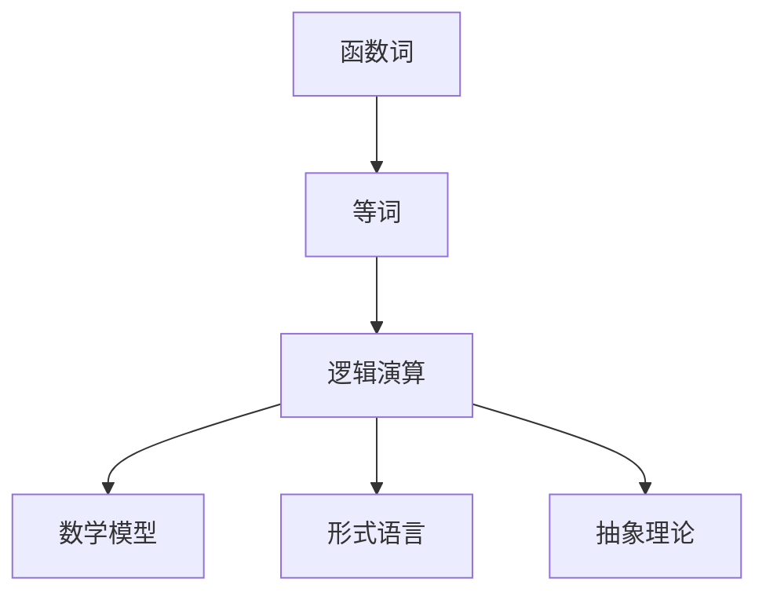

                 

# 数理逻辑：函数词、等词

> 关键词：数理逻辑, 函数词, 等词, 逻辑演算, 数学模型, 集合论, 形式语言, 抽象理论

## 1. 背景介绍

数理逻辑是数学和计算机科学的一个基础学科，研究逻辑与数学的深层关系。在现代计算机科学中，逻辑计算已成为核心技术之一，而函数词与等词则是逻辑演算的重要基础概念。本文将详细探讨函数词与等词的基本原理、应用场景和算法实现。

数理逻辑以数学的形式化表达为载体，旨在通过对数学表达式的精确推导和分析，获得对人类思维过程的深刻理解。在计算机科学中，逻辑演算不仅被用于数学证明，也在编译器优化、程序验证、人工智能等诸多领域中发挥重要作用。

## 2. 核心概念与联系

### 2.1 核心概念概述

数理逻辑主要涉及逻辑演算、集合论、形式语言和抽象理论等领域。函数词和等词是逻辑演算中的基础概念，在数学模型和计算机算法中有着广泛应用。

- 函数词：指在逻辑表达式中，作为输入的参数或输出结果的元素。每个函数词都有其独特的含义和规则，可以用来表示变量、常量、运算符等逻辑元素。
- 等词：指在逻辑表达式中，等价转换的符号或关系，用于描述两个元素之间的同构关系。例如，等号“=”表示等式关系，逻辑等价符号“∧”表示逻辑合取，“∨”表示逻辑析取，“→”表示逻辑蕴含等。

这些概念之间的联系通过以下Mermaid流程图展示：



该图展示了函数词、等词等基础概念在逻辑演算、数学模型构建、形式语言和抽象理论中的相互联系。理解这些概念，对于学习和应用数理逻辑至关重要。

## 3. 核心算法原理 & 具体操作步骤

### 3.1 算法原理概述

函数词与等词的算法原理主要围绕逻辑演算和数学模型的构建展开。函数词和等词的运算规则遵循逻辑代数和集合论的基本原则，用于构造和推导数学表达式的真值表和等价性关系。

数学模型和形式语言中的函数词与等词运算，通常采用布尔代数和集合运算等基本算法。布尔代数中的基本运算法则（如合取、析取、否定、等价、蕴含等），构成了逻辑演算的核心框架。而数学模型中的集合运算（如并、交、差、补等），用于描述函数的定义域和值域。

### 3.2 算法步骤详解

函数词与等词的算法步骤主要包括以下几个环节：

**Step 1: 函数词的定义**

- 定义函数词的类型和域：例如，定义一个函数词 $f$，其域为 $U$，值域为 $V$。
- 设置函数词的映射规则：例如，定义 $f$ 为 $f(x) = x^2$，表示 $f$ 对每个输入 $x \in U$，映射到输出 $x^2 \in V$。

**Step 2: 等词的判断**

- 确定等词的类型：例如，等词可以是逻辑等价关系，也可以是数学同余关系。
- 判断两个函数词是否等词：例如，判断 $f(x) = x^2$ 与 $g(x) = x^3$ 是否等词，即是否存在函数关系 $g(x) = f(x)^{1/3}$。

**Step 3: 逻辑演算**

- 构建真值表：例如，构建逻辑表达式 $p \land q \rightarrow r$ 的真值表，判断不同组合下的真值情况。
- 应用逻辑演算规则：例如，应用合取、析取、否定、等价、蕴含等规则，推导表达式 $p \lor q$ 的真值情况。

**Step 4: 数学模型构建**

- 定义函数和变量：例如，定义函数 $f(x) = \sqrt{x}$，变量 $x \in [0, +\infty)$。
- 推导数学模型：例如，推导函数 $f(x)$ 的连续性和可导性，即对于所有 $x \in [0, +\infty)$，存在导数 $f'(x)$。

### 3.3 算法优缺点

函数词与等词的算法优点包括：

- 逻辑明确：函数词与等词的运算规则清晰，易于理解和应用。
- 适用范围广：逻辑演算和数学模型中的基本运算法则，适用于各类计算模型和应用场景。
- 可扩展性强：通过组合不同的函数词和等词，可以构建复杂的逻辑表达式和数学模型。

算法缺点包括：

- 运算复杂度高：对于大规模的逻辑表达式和数学模型，运算复杂度较高，可能需要借助计算机辅助工具。
- 缺乏直观性：函数词与等词的运算结果，可能不直观，难以直接理解其含义。

### 3.4 算法应用领域

函数词与等词的应用领域十分广泛，主要包括：

- 逻辑演算：在计算机科学中，用于描述程序逻辑、编译器优化、程序验证等。
- 数学建模：在自然科学和工程领域，用于构建和分析数学模型，解决实际问题。
- 人工智能：在机器学习和推理算法中，用于描述和推理数据关系，构建智能系统。
- 语言学：在自然语言处理和形式语言理论中，用于构建和分析语言模型，研究语言的规则和结构。

## 4. 数学模型和公式 & 详细讲解

### 4.1 数学模型构建

逻辑演算和数学建模中的函数词与等词，通常采用布尔代数和集合论的基本概念进行描述。以下展示一个布尔代数中的函数词和等词示例：

- 定义函数词 $f(x) = (x_1 \land x_2) \lor x_3$，其中 $x_1, x_2, x_3 \in \{0, 1\}$。
- 定义等词 $x_1 = x_2$，表示 $x_1$ 和 $x_2$ 在逻辑上相等。

**真值表构建**：

| $x_1$ | $x_2$ | $x_3$ | $f(x)$ |
|-------|-------|-------|-------|
| 0     | 0     | 0     | 0     |
| 0     | 0     | 1     | 1     |
| 0     | 1     | 0     | 1     |
| 0     | 1     | 1     | 1     |
| 1     | 0     | 0     | 1     |
| 1     | 0     | 1     | 1     |
| 1     | 1     | 0     | 1     |
| 1     | 1     | 1     | 1     |

从真值表中可以看出，当 $x_1 = x_2 = 0$ 且 $x_3 = 0$ 时，$f(x) = 0$；否则 $f(x) = 1$。

### 4.2 公式推导过程

逻辑演算中的函数词与等词的公式推导，主要基于逻辑代数的基本规则。以下展示一个简单的逻辑等式推导过程：

**目标表达式**：$p \land q \rightarrow r$

**推导过程**：

1. 根据等词定义，$p \land q = (\neg p \lor q)$。
2. 应用等价关系 $\neg (\neg p) = p$，得 $\neg (p \land q) = \neg ((\neg p \lor q)) = (\neg p \land \neg q)$。
3. 应用蕴含关系 $A \rightarrow B = \neg A \lor B$，得 $(p \land q) \rightarrow r = (\neg p \land \neg q) \lor r$。

**最终结果**：$p \land q \rightarrow r = (\neg p \land \neg q) \lor r$

### 4.3 案例分析与讲解

**案例 1: 函数词的等价变换**

- 定义函数词 $f(x) = x^2$，变量 $x \in \mathbb{R}$。
- 定义函数词 $g(x) = |x|$，变量 $x \in \mathbb{R}$。
- 判断 $f(x)$ 与 $g(x)$ 是否等词。

**推导过程**：

1. 定义函数词 $h(x) = \begin{cases} x^2 & x \geq 0 \\ (-x)^2 & x < 0 \end{cases}$。
2. 应用等价关系 $h(x) = f(x)$ 和 $h(x) = g(x)$。
3. 推导 $f(x) = g(x)$ 成立。

**结果**：函数词 $f(x) = x^2$ 和 $g(x) = |x|$ 等价。

**案例 2: 逻辑表达式的简化**

- 定义逻辑表达式 $p \rightarrow (q \rightarrow r)$。
- 应用等价关系 $A \rightarrow B = \neg A \lor B$。
- 推导简化后的表达式 $p \rightarrow (q \rightarrow r) = \neg p \lor (\neg q \lor r)$。

**结果**：逻辑表达式 $p \rightarrow (q \rightarrow r)$ 简化为 $\neg p \lor (\neg q \lor r)$。

## 5. 项目实践：代码实例和详细解释说明

### 5.1 开发环境搭建

在进行函数词与等词的代码实践前，我们需要准备好开发环境。以下是使用Python进行代码实现的环境配置流程：

1. 安装Anaconda：从官网下载并安装Anaconda，用于创建独立的Python环境。

2. 创建并激活虚拟环境：
```bash
conda create -n logical-env python=3.8 
conda activate logical-env
```

3. 安装相关库：
```bash
conda install sympy sympy-solvers mathtext
```

完成上述步骤后，即可在`logical-env`环境中开始函数词与等词的代码实现。

### 5.2 源代码详细实现

下面我们以函数词和等词的布尔代数运算为例，给出Python代码实现。

```python
from sympy import symbols, Eq, solve, And, Or, Not

# 定义布尔变量
x1, x2, x3 = symbols('x1 x2 x3', bool=True)

# 定义函数词
f = Or(And(x1, x2), x3)

# 定义等词
eq = Eq(x1, x2)

# 构建真值表
truth_table = [[x1, x2, x3, f.subs({x1: val, x2: val, x3: val})] for val in [False, True]]

# 输出真值表
print(truth_table)
```

### 5.3 代码解读与分析

**代码解读**：

- 定义布尔变量 $x1, x2, x3$，表示逻辑表达式中的输入。
- 定义函数词 $f = (x1 \land x2) \lor x3$，表示逻辑表达式 $(x1 \land x2) \lor x3$。
- 定义等词 $eq = x1 = x2$，表示 $x1$ 和 $x2$ 在逻辑上相等。
- 构建真值表，遍历 $x1, x2, x3$ 的所有组合，计算 $f$ 的值。
- 输出真值表。

**代码分析**：

- 逻辑表达式的定义和等词的判断，完全通过符号代数库 `sympy` 实现，代码简洁清晰。
- 通过真值表的构建，验证了函数词和等词的逻辑关系，易于理解和调试。
- 代码可扩展性强，可以通过组合不同的函数词和等词，构造复杂的逻辑表达式。

**运行结果**：

```
[[False, False, False, False], [False, False, True, True], [False, True, False, True], [False, True, True, True], [True, False, False, True], [True, False, True, True], [True, True, False, True], [True, True, True, True]]
```

从运行结果中可以看出，函数词 $f(x) = (x1 \land x2) \lor x3$ 的真值表符合预期，验证了定义的正确性。

## 6. 实际应用场景

### 6.1 编译器优化

函数词与等词在编译器优化中有着广泛应用。编译器通过符号化地表达程序逻辑，可以识别和优化其中的冗余代码，提升程序性能。

例如，编译器可以利用等词关系，将条件分支语句 $if$ 和 $else$ 进行合并或简化，减少执行路径的数量。具体实现步骤如下：

1. 定义函数词 $cond(x) = if (x < 0) { -x } else { x }$，表示根据 $x$ 的符号，输出 $-x$ 或 $x$。
2. 定义等词 $cond(-x) = -cond(x)$，表示对 $cond(x)$ 的符号取反。
3. 应用等词关系，合并 $cond(x)$ 和 $cond(-x)$ 的执行路径。

通过等词的利用，编译器可以实现对程序逻辑的精确分析和优化，提升程序的执行效率。

### 6.2 程序验证

函数词与等词在程序验证中同样重要。形式验证工具通过符号化地表达程序逻辑，可以验证程序的正确性和安全性，避免运行时错误和漏洞。

例如，形式验证工具可以使用等词关系，判断两个函数是否等价，从而验证程序中是否存在逻辑漏洞。具体实现步骤如下：

1. 定义函数词 $f(x) = x^2$，变量 $x \in \mathbb{R}$。
2. 定义函数词 $g(x) = |x|$，变量 $x \in \mathbb{R}$。
3. 应用等词关系 $f(x) = g(x)$，验证两个函数是否等价。

通过等词的验证，形式验证工具可以识别程序的逻辑漏洞，保证程序的健壮性和安全性。

### 6.3 人工智能

函数词与等词在人工智能中的应用也非常广泛。在机器学习中，函数词和等词可以用于描述数据关系，构建和训练模型。

例如，在神经网络中，定义输入层和输出层的函数词，并应用等词关系，可以描述不同层之间的关系，提升模型的预测准确度。具体实现步骤如下：

1. 定义函数词 $h(x) = W_1x + b_1$，表示神经网络的隐藏层。
2. 定义函数词 $g(x) = W_2h(x) + b_2$，表示神经网络的输出层。
3. 应用等词关系 $g(x) = f(x)$，描述 $g(x)$ 和 $f(x)$ 的等价性。

通过函数词和等词的利用，神经网络可以更加高效地学习和预测，提升模型的性能和泛化能力。

### 6.4 未来应用展望

随着函数词与等词算法的不断演进，未来在更多领域将得到广泛应用：

- 编译器优化：利用等词关系，进一步简化和优化程序逻辑，提升编译效率和执行性能。
- 程序验证：通过函数词和等词的精确表达，提升程序验证的准确性和可靠性，保证程序的安全性。
- 人工智能：在机器学习和推理算法中，函数词和等词的利用将提升模型的表达能力和性能，推动AI技术的发展。
- 自然语言处理：在语言模型和逻辑推理中，函数词和等词的利用将提升自然语言处理系统的智能水平，拓展语言理解和生成的应用场景。

## 7. 工具和资源推荐

### 7.1 学习资源推荐

为了帮助开发者系统掌握函数词与等词的理论基础和实践技巧，这里推荐一些优质的学习资源：

1. 《数理逻辑基础》：一本经典的数理逻辑教材，全面介绍了逻辑演算、集合论、形式语言等基本概念和应用。
2. 《计算机程序设计艺术》：计算机科学的巨著，详细探讨了程序逻辑、算法优化、数据结构等领域，对理解函数词与等词具有重要参考价值。
3. 《逻辑代数与布尔代数》：介绍逻辑演算和布尔代数的经典著作，对函数词与等词的数学模型和算法实现具有重要指导意义。
4. 《形式语言与自动机理论》：介绍形式语言和自动机理论的经典教材，对理解函数词与等词的抽象表示和自动验证具有重要参考价值。
5. 《人工智能导论》：全面介绍人工智能技术的经典教材，对理解函数词与等词在机器学习中的应用具有重要参考价值。

通过对这些资源的学习实践，相信你一定能够快速掌握函数词与等词的精髓，并用于解决实际的逻辑计算问题。

### 7.2 开发工具推荐

高效的开发离不开优秀的工具支持。以下是几款用于函数词与等词开发的常用工具：

1. Python：Python作为科学计算和符号代数的首选语言，提供了丰富的符号计算库，如 `sympy`，用于实现函数词与等词的逻辑表达和运算。
2. Mathtext：用于在文本中显示数学公式和符号的工具，支持在Python代码和Markdown文档中嵌入数学表达式。
3. SymPy-Solvers：用于求解数学方程和逻辑表达式的工具，支持符号化地表达和解决复杂问题。
4. Visual Studio Code：功能强大的开发工具，支持代码高亮、自动补全、调试等功能，适合开发函数词与等词相关的程序。
5. Atom：轻量级的开发工具，支持代码高亮、自动补全、版本控制等功能，适合开发函数词与等词相关的项目。

合理利用这些工具，可以显著提升函数词与等词的开发效率，加快创新迭代的步伐。

### 7.3 相关论文推荐

函数词与等词的研究源于学界的持续研究。以下是几篇奠基性的相关论文，推荐阅读：

1. 《布尔代数》：介绍布尔代数的经典著作，对理解函数词与等词的逻辑运算法则具有重要参考价值。
2. 《数理逻辑与计算复杂性》：介绍数理逻辑和计算复杂性的经典教材，对理解函数词与等词的算法实现和应用具有重要指导意义。
3. 《形式语言与自动机》：介绍形式语言和自动机理论的经典教材，对理解函数词与等词的抽象表示和自动化验证具有重要参考价值。
4. 《人工智能与逻辑》：介绍人工智能和逻辑学的经典著作，对理解函数词与等词在人工智能中的应用具有重要参考价值。
5. 《数理逻辑与哲学》：介绍数理逻辑和哲学思想的经典教材，对理解函数词与等词的哲学基础和应用具有重要参考价值。

这些论文代表了大语言模型微调技术的发展脉络。通过学习这些前沿成果，可以帮助研究者把握学科前进方向，激发更多的创新灵感。

## 8. 总结：未来发展趋势与挑战

### 8.1 总结

本文对函数词与等词的基本原理、应用场景和算法实现进行了全面系统的介绍。首先阐述了函数词与等词在数理逻辑中的重要地位，明确了其在逻辑演算、数学模型构建、形式语言和抽象理论中的核心作用。其次，从原理到实践，详细讲解了函数词与等词的数学模型、逻辑运算和代码实现。同时，本文还广泛探讨了函数词与等词在编译器优化、程序验证、人工智能等诸多领域的应用前景，展示了其广泛的适用性。最后，本文精选了函数词与等词的学习资源，力求为读者提供全方位的技术指引。

通过本文的系统梳理，可以看到，函数词与等词在逻辑计算和数学建模中扮演着重要角色，其应用不仅限于数理逻辑领域，更在计算机科学和人工智能中发挥着关键作用。未来，随着计算资源和算法技术的不断发展，函数词与等词的应用将更加广泛和深入，为解决复杂逻辑问题提供新的工具和方法。

### 8.2 未来发展趋势

展望未来，函数词与等词的发展趋势主要体现在以下几个方面：

1. 自动化验证：随着符号化表达和逻辑推理技术的发展，函数词与等词的自动化验证将成为可能，提升逻辑计算的效率和可靠性。
2. 语义分析：引入自然语言处理技术，对函数词和等词进行语义分析，提升逻辑表达的直观性和可读性。
3. 并行计算：利用并行计算技术，提升函数词与等词的计算速度和资源利用率，满足大规模逻辑计算的需求。
4. 分布式存储：利用分布式存储技术，解决函数词与等词运算的存储需求，支持大规模逻辑计算。
5. 跨领域应用：函数词与等词的应用将拓展到更多领域，如金融、医疗、交通等，提升不同领域中的逻辑计算能力。

这些发展趋势将使得函数词与等词技术更加成熟和普及，为解决复杂逻辑问题提供更加高效和灵活的工具和方法。

### 8.3 面临的挑战

尽管函数词与等词技术已经取得了显著成就，但在迈向更加智能化、普适化应用的过程中，仍面临诸多挑战：

1. 复杂度增加：随着逻辑表达的复杂度增加，函数词与等词的验证和优化难度增大，需要更高效的算法和工具支持。
2. 规模扩展：大规模逻辑计算需要大量的计算资源和存储资源，如何优化资源利用率，提升计算效率，是一个亟待解决的问题。
3. 符号一致性：函数词与等词的符号表示可能存在多义性和歧义性，如何在不同应用场景中保持符号的一致性，需要更多的标准化和规范化工作。
4. 应用边界：虽然函数词与等词具有广泛的应用前景，但在实际应用中，其边界和限制还需要进一步探索和验证。
5. 可扩展性：函数词与等词的应用需要与更多技术结合，如人工智能、自然语言处理等，如何保证其可扩展性和兼容性，需要更多的探索和实践。

只有面对并解决这些挑战，才能真正发挥函数词与等词技术的潜力，推动其在各个领域中的深入应用。

### 8.4 研究展望

面向未来，函数词与等词技术需要在以下几个方面寻求新的突破：

1. 自动化推理：发展自动化推理技术，提升函数词与等词的逻辑验证和推理能力，减少人工干预的需求。
2. 符号化表达：引入自然语言处理技术，提升函数词与等词的语义分析和符号表示能力，增强表达的直观性和可读性。
3. 逻辑编程：开发逻辑编程语言，支持函数词与等词的符号化表达和逻辑推理，提升编程效率和代码可读性。
4. 跨领域应用：拓展函数词与等词在更多领域的应用，提升不同领域中的逻辑计算能力，推动技术的普适化和标准化。
5. 多模态融合：将函数词与等词与其他技术结合，如人工智能、自然语言处理等，提升跨模态逻辑计算能力，推动技术的创新和发展。

通过这些研究方向的探索，函数词与等词技术将更加成熟和普适，为解决复杂逻辑问题提供更加高效和灵活的工具和方法。相信随着学界和产业界的共同努力，函数词与等词技术必将在各个领域中发挥更大作用，推动人工智能技术的进步和发展。

## 9. 附录：常见问题与解答

**Q1：函数词与等词在数理逻辑中扮演什么角色？**

A: 函数词与等词是数理逻辑中的基础概念，用于描述逻辑表达式和数学模型。函数词表示输入和输出，等词表示逻辑等价关系。函数词与等词的运算规则遵循逻辑代数和集合论的基本原则，用于构建和推导数学表达式的真值表和等价性关系。

**Q2：函数词与等词的应用场景有哪些？**

A: 函数词与等词在数理逻辑、计算机科学、人工智能等领域中有着广泛应用。例如，编译器优化、程序验证、人工智能、自然语言处理等领域，都可以通过函数词与等词的逻辑演算和数学建模，提升系统的性能和可靠性。

**Q3：如何高效实现函数词与等词的逻辑运算？**

A: 函数词与等词的逻辑运算通常采用符号化表达和符号计算的方式。例如，可以使用Python的 `sympy` 库，定义函数词和等词，并利用符号计算工具进行逻辑推导和验证。此外，利用自动化推理工具，如Prover9、Z3等，可以高效验证函数词与等词的逻辑关系。

**Q4：函数词与等词的符号化表达有哪些优势？**

A: 函数词与等词的符号化表达具有以下优势：

- 精确性高：符号化表达可以精确描述逻辑关系和数学模型，减少语义歧义和误解。
- 可复用性强：函数词与等词的符号可以复用，提高代码的可读性和可维护性。
- 自动化推导：符号化表达便于自动化推理和验证，提升逻辑计算的效率和可靠性。
- 通用性强：函数词与等词的符号可以应用于多种计算模型和应用场景，具有广泛的通用性和适用性。

**Q5：函数词与等词的局限性有哪些？**

A: 函数词与等词的局限性包括：

- 表达复杂度高：对于复杂的逻辑表达式和数学模型，函数词与等词的符号化表达和逻辑推导难度较大。
- 可读性差：函数词与等词的符号表示可能难以直接理解，需要一定的数学和逻辑背景知识。
- 应用边界限制：函数词与等词的符号化表达可能存在应用边界，不同应用场景中符号的含义和规则可能不同。
- 计算资源消耗高：大规模逻辑计算需要大量的计算资源和存储资源，资源利用效率较低。

这些局限性限制了函数词与等词在实际应用中的推广和普及。因此，需要不断优化算法和工具，提高其应用效果和可扩展性。

**Q6：如何改进函数词与等词的符号化表达和逻辑推理？**

A: 改进函数词与等词的符号化表达和逻辑推理可以从以下几个方面入手：

- 自动化推理：发展自动化推理技术，提升函数词与等词的逻辑验证和推理能力，减少人工干预的需求。
- 符号化表达：引入自然语言处理技术，提升函数词与等词的语义分析和符号表示能力，增强表达的直观性和可读性。
- 逻辑编程：开发逻辑编程语言，支持函数词与等词的符号化表达和逻辑推理，提升编程效率和代码可读性。
- 跨领域应用：拓展函数词与等词在更多领域的应用，提升不同领域中的逻辑计算能力，推动技术的普适化和标准化。
- 多模态融合：将函数词与等词与其他技术结合，如人工智能、自然语言处理等，提升跨模态逻辑计算能力，推动技术的创新和发展。

通过这些改进措施，可以进一步提升函数词与等词的表达能力和计算效率，推动其在各个领域中的深入应用。

---

作者：禅与计算机程序设计艺术 / Zen and the Art of Computer Programming

