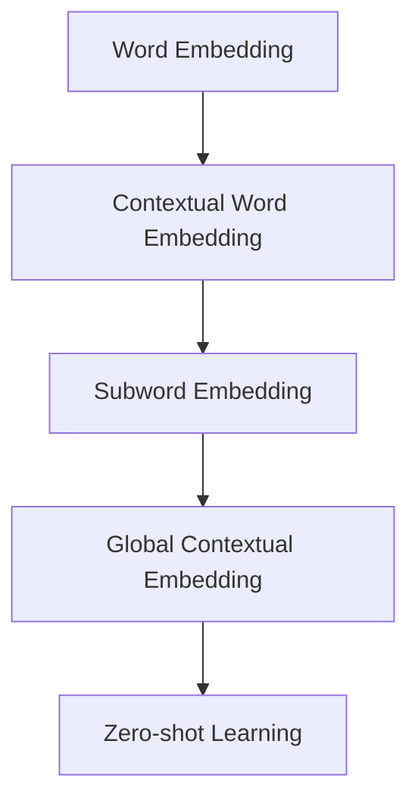

                 

# 文本向量模型（Text Embedding Models）

文本向量模型（Text Embedding Models）是一种用于将文本序列转化为向量表示的技术。这些向量不仅能捕捉到文本中每个单词（或子词）的语义信息，还能反映出它们在句子中的关系，如单词之间的依赖和语境信息。文本向量模型在大规模自然语言处理（NLP）任务中取得了显著成功，广泛应用于文本分类、情感分析、语义搜索、机器翻译等场景。本文将深入探讨文本向量模型的核心原理、实现方法、应用场景及其面临的挑战和未来趋势。

## 1. 背景介绍

### 1.1 问题由来

自然语言处理（NLP）技术在过去几十年间取得了飞速进展。但传统的方法如基于规则的方法和特征工程，往往需要大量手工标注和特征工程，难以扩展到更大的数据集和更复杂的任务。而基于深度学习的文本向量模型，特别是通过无监督学习方法提取的向量表示，可以自动从大量无标注文本数据中学习到文本的语义表示，为NLP任务提供了强大的基础。

文本向量模型最初源于2003年提出的Word2Vec，其后LSTM、GRU等序列模型，以及2013年提出的GloVe，都为文本表示的改进做出了贡献。但直到2016年Word2Vec改进版——GloVe的提出，文本向量模型的性能才达到了新的高度。随后，预训练语言模型如BERT、GPT等，进一步提升了文本向量的质量和应用范围。

### 1.2 问题核心关键点

文本向量模型的核心目标是将连续的文本序列转化为固定维度的向量，以方便进行后续的机器学习处理。文本向量模型的构建，主要依赖于以下几个关键技术：

- **Word Embedding**：将每个单词映射到一个固定维度的向量，捕捉单词的语义信息。
- **Contextual Word Embedding**：考虑单词在句子中的上下文信息，动态生成向量表示。
- **Subword Embedding**：将长单词分割成多个子词，使用更小的单元进行向量表示。
- **Global Contextual Embedding**：考虑整个句子的语境信息，生成更完整的向量表示。
- **Zero-shot Learning**：在未见过的文本上直接进行分类和推理。

这些核心技术共同构成了文本向量模型的工作原理，使模型能够高效、准确地从文本中提取语义信息。

## 2. 核心概念与联系

### 2.1 核心概念概述

为更好地理解文本向量模型的原理，本节将介绍几个密切相关的核心概念：

- **Word Embedding**：将单词映射到向量空间的表示，捕捉单词的语义信息。
- **Contextual Word Embedding**：考虑单词在句子中的上下文信息，动态生成向量表示。
- **Subword Embedding**：将长单词分割成多个子词，使用更小的单元进行向量表示。
- **Global Contextual Embedding**：考虑整个句子的语境信息，生成更完整的向量表示。
- **Zero-shot Learning**：在未见过的文本上直接进行分类和推理。

这些核心概念之间的逻辑关系可以通过以下Mermaid流程图来展示：



这个流程图展示了文本向量模型的核心概念及其之间的关系：

1. 首先，使用Word Embedding技术将单词映射到向量空间。
2. 然后，通过Contextual Word Embedding考虑单词在句子中的上下文信息，动态生成向量表示。
3. 接着，Subword Embedding技术将长单词分割成更小的子词单元，进一步提升向量表示的粒度和语义信息。
4. 最后，Global Contextual Embedding技术综合考虑整个句子的语境信息，生成完整的向量表示。
5. Zero-shot Learning技术则在不更新模型的情况下，直接在未见过的文本上实现分类和推理。

这些核心概念共同构成了文本向量模型的工作原理，使其能够高效、准确地从文本中提取语义信息。

## 3. 核心算法原理 & 具体操作步骤
### 3.1 算法原理概述

文本向量模型的核心算法原理，主要围绕着将文本序列转化为向量表示展开。其核心思想是利用神经网络模型，自动从大量文本数据中学习到单词（或子词）的语义表示，并考虑上下文信息，生成更加丰富的向量表示。

文本向量模型的构建过程主要包括以下几个步骤：

1. 预训练：使用无监督学习方法，从大量文本数据中学习到单词（或子词）的语义表示。
2. 微调：在特定任务上对预训练的向量表示进行微调，以适应该任务的语境和需求。
3. 融合：将单词（或子词）的向量表示进行融合，生成更高层的句子或段落表示。
4. 推理：利用生成的向量表示进行分类、匹配、生成等机器学习处理。

### 3.2 算法步骤详解

文本向量模型的构建，主要依赖于以下几个关键算法步骤：

**Step 1: 预训练**

预训练是文本向量模型构建的第一步。预训练的目标是通过无监督学习方法，学习单词（或子词）的语义表示。以下是常用的几种预训练方法：

- **Word2Vec**：通过预测上下文单词的概率，学习单词的语义表示。其核心算法包括CBOW（Continuous Bag-of-Words）和Skip-gram两种模型。

- **GloVe**：利用单词的共现矩阵，学习单词的语义表示。其核心算法包括矩阵分解和向量空间聚类两种方法。

- **BERT**：使用Transformer模型，在大量的无标注文本数据上进行预训练，学习单词和句子级别的语义表示。

**Step 2: 微调**

微调是在特定任务上对预训练的向量表示进行微调的过程。微调的目标是使得模型能够适应该任务的语境和需求。以下是常用的几种微调方法：

- **Fine-Tuning**：在特定任务上对预训练的向量表示进行微调，以适应该任务的语境和需求。

- **Adaptive Sequence Embedding**：根据任务的特定需求，动态生成单词（或子词）的向量表示。

- **Prompt-based Learning**：通过在输入文本中添加提示模板，引导模型进行特定任务的推理和生成。

**Step 3: 融合**

融合是将单词（或子词）的向量表示进行融合的过程，以生成更高层的句子或段落表示。以下是常用的几种融合方法：

- **Word Embedding Aggregation**：将单词的向量表示进行简单的平均或拼接操作，生成句子的向量表示。

- **Skip-gram Fuse**：通过考虑句子中每个单词与其上下文单词的关系，生成句子的向量表示。

- **Transformer Encoder**：使用Transformer模型，将句子中的每个单词的向量表示进行编码，生成句子的向量表示。

**Step 4: 推理**

推理是将生成的向量表示进行分类、匹配、生成等机器学习处理的过程。以下是常用的几种推理方法：

- **Nearest Neighbor Classification**：通过计算文本向量与类别的最近距离，进行文本分类。

- **Attention-based Matching**：通过计算文本向量与目标文本的相似度，进行文本匹配。

- **Seq2Seq Generation**：通过生成模型，将文本向量转化为目标文本的向量表示。

### 3.3 算法优缺点

文本向量模型具有以下优点：

- **高效性**：通过预训练和微调，能够快速从大量文本数据中学习到单词（或子词）的语义表示，适合大规模文本处理。

- **泛化能力**：能够处理不同领域的文本数据，适用于多种NLP任务。

- **灵活性**：可以通过微调、融合等手段，生成不同粒度和维度的向量表示，满足不同任务的需求。

- **可解释性**：生成的向量表示可以直观地解释单词的语义信息，有助于理解模型的工作机制。

同时，文本向量模型也存在一些缺点：

- **高维稀疏性**：生成的向量表示通常具有高维稀疏性，难以直接使用。

- **数据依赖性**：模型的性能很大程度上依赖于训练数据的质量和数量，获取高质量训练数据的成本较高。

- **复杂性**：预训练和微调过程需要大量的计算资源和计算时间，实现复杂。

- **可解释性不足**：生成的向量表示难以解释模型内部的推理逻辑，存在一定的"黑盒"问题。

尽管存在这些缺点，文本向量模型在大规模NLP任务中的应用已经取得了显著成功，成为NLP技术的重要基础。未来相关研究的重点在于如何进一步降低预训练和微调的计算成本，提高模型的可解释性和应用范围。

### 3.4 算法应用领域

文本向量模型已经在NLP领域得到了广泛的应用，涵盖了几乎所有常见的NLP任务，例如：

- 文本分类：如情感分析、主题分类、意图识别等。通过将文本向量表示输入到分类器中，进行文本分类。

- 命名实体识别：识别文本中的人名、地名、机构名等特定实体。通过将实体名称的向量表示进行匹配，实现命名实体识别。

- 关系抽取：从文本中抽取实体之间的语义关系。通过将实体和关系名称的向量表示进行匹配，实现关系抽取。

- 问答系统：对自然语言问题给出答案。通过将问题和答案的向量表示进行匹配，实现问答系统。

- 机器翻译：将源语言文本翻译成目标语言。通过将源语言和目标语言文本的向量表示进行匹配，实现机器翻译。

- 文本摘要：将长文本压缩成简短摘要。通过将文本的向量表示进行编码，实现文本摘要。

- 对话系统：使机器能够与人自然对话。通过将对话历史和当前输入的向量表示进行融合，生成机器的响应。

除了上述这些经典任务外，文本向量模型也被创新性地应用到更多场景中，如可控文本生成、常识推理、代码生成、数据增强等，为NLP技术带来了全新的突破。随着预训练模型和微调方法的不断进步，相信文本向量模型将在更广阔的应用领域大放异彩。

## 4. 数学模型和公式 & 详细讲解  
### 4.1 数学模型构建

本文将使用数学语言对文本向量模型的构建过程进行更加严格的刻画。

记文本序列为 $X=\{x_i\}_{i=1}^n$，其中 $x_i$ 为文本中的单词（或子词）。假设单词 $x_i$ 的向量表示为 $\mathbf{v}_{x_i} \in \mathbb{R}^d$，则文本序列的向量表示可以表示为：

$$
\mathbf{V}(X) = [\mathbf{v}_{x_1}, \mathbf{v}_{x_2}, ..., \mathbf{v}_{x_n}]
$$

其中 $\mathbf{V}(X)$ 表示文本序列的向量表示。

### 4.2 公式推导过程

以下是常用的几种文本向量模型，以及其数学推导过程：

**Word2Vec**

Word2Vec的核心算法包括CBOW和Skip-gram两种模型。以CBOW模型为例，其目标是通过预测上下文单词的概率，学习单词的语义表示。假设单词 $x_i$ 的上下文单词为 $X_{上下文}$，则模型的目标函数可以表示为：

$$
\min_{\mathbf{v}_{x_i}} -\frac{1}{N} \sum_{j=1}^N \log p(x_j|X_{上下文} \backslash \{x_i\})
$$

其中 $p(x_j|X_{上下文} \backslash \{x_i\})$ 表示单词 $x_j$ 在上下文单词 $X_{上下文} \backslash \{x_i\}$ 下出现的概率。

**GloVe**

GloVe的核心算法包括矩阵分解和向量空间聚类两种方法。以矩阵分解为例，其目标是通过矩阵分解，学习单词的语义表示。假设单词 $x_i$ 与单词 $x_j$ 的共现次数为 $f(x_i,x_j)$，则模型的目标函数可以表示为：

$$
\min_{\mathbf{v}_{x_i}} \sum_{j=1}^N (\mathbf{v}_{x_i} \odot \mathbf{v}_{x_j} - \log f(x_i,x_j))^2
$$

其中 $\odot$ 表示向量点积，$f(x_i,x_j)$ 表示单词 $x_i$ 与单词 $x_j$ 的共现次数。

**BERT**

BERT使用Transformer模型，在大量的无标注文本数据上进行预训练，学习单词和句子级别的语义表示。假设文本序列为 $X=\{x_i\}_{i=1}^n$，则BERT模型的目标函数可以表示为：

$$
\min_{\theta} -\frac{1}{N} \sum_{i=1}^N L(X_i, \theta)
$$

其中 $L(X_i, \theta)$ 表示文本序列 $X_i$ 的损失函数，$\theta$ 表示模型参数。

### 4.3 案例分析与讲解

以GloVe为例，以下是GloVe矩阵分解的详细推导过程。

假设单词 $x_i$ 与单词 $x_j$ 的共现次数为 $f(x_i,x_j)$，则GloVe的目标函数可以表示为：

$$
\min_{\mathbf{v}_{x_i}} \sum_{j=1}^N (\mathbf{v}_{x_i} \odot \mathbf{v}_{x_j} - \log f(x_i,x_j))^2
$$

其中 $\odot$ 表示向量点积，$f(x_i,x_j)$ 表示单词 $x_i$ 与单词 $x_j$ 的共现次数。

将目标函数展开，得：

$$
\min_{\mathbf{v}_{x_i}} \sum_{j=1}^N (v_{x_i}^{(j)} - \log f(x_i,x_j))^2
$$

其中 $v_{x_i}^{(j)}$ 表示单词 $x_i$ 在向量空间中的第 $j$ 维分量。

为了求解上述优化问题，可以使用矩阵分解方法。假设单词 $x_i$ 的向量表示为 $\mathbf{v}_{x_i} = \mathbf{U}_i \mathbf{V}_i^T$，其中 $\mathbf{U}_i \in \mathbb{R}^{d \times n}$ 和 $\mathbf{V}_i \in \mathbb{R}^{n \times d}$ 分别表示单词 $x_i$ 的矩阵分解后的行矩阵和列矩阵。则目标函数可以表示为：

$$
\min_{\mathbf{U}_i, \mathbf{V}_i} \sum_{j=1}^N (v_{x_i}^{(j)} - \log f(x_i,x_j))^2
$$

其中 $v_{x_i}^{(j)} = \mathbf{U}_i \odot \mathbf{V}_i^T(j)$ 表示单词 $x_i$ 在向量空间中的第 $j$ 维分量。

通过求解上述优化问题，可以得到单词 $x_i$ 的向量表示 $\mathbf{v}_{x_i}$。

## 5. 项目实践：代码实例和详细解释说明
### 5.1 开发环境搭建

在进行文本向量模型开发前，我们需要准备好开发环境。以下是使用Python进行PyTorch开发的环境配置流程：

1. 安装Anaconda：从官网下载并安装Anaconda，用于创建独立的Python环境。

2. 创建并激活虚拟环境：
```bash
conda create -n pytorch-env python=3.8 
conda activate pytorch-env
```

3. 安装PyTorch：根据CUDA版本，从官网获取对应的安装命令。例如：
```bash
conda install pytorch torchvision torchaudio cudatoolkit=11.1 -c pytorch -c conda-forge
```

4. 安装Transformer库：
```bash
pip install transformers
```

5. 安装各类工具包：
```bash
pip install numpy pandas scikit-learn matplotlib tqdm jupyter notebook ipython
```

完成上述步骤后，即可在`pytorch-env`环境中开始文本向量模型的开发实践。

### 5.2 源代码详细实现

下面我们以GloVe模型为例，给出使用PyTorch对单词向量进行矩阵分解的PyTorch代码实现。

首先，定义GloVe模型的数据处理函数：

```python
from torch.utils.data import Dataset
import torch

class GLoveDataset(Dataset):
    def __init__(self, word_counts, word2id, max_len=100):
        self.word_counts = word_counts
        self.word2id = word2id
        self.max_len = max_len
        
    def __len__(self):
        return len(self.word_counts)
    
    def __getitem__(self, item):
        word = self.word2id[item]
        coocurrences = self.word_counts[word]
        target_word = word
        context_words = []
        for context_word in self.word2id.keys():
            if context_word != target_word:
                coocurrence_count = self.word_counts[target_word][context_word]
                if coocurrence_count > 0:
                    context_words.append(context_word)
        
        return {'word': word, 'target_word': target_word, 'context_words': context_words}

# 定义标签与id的映射
word2id = {}
id2word = {}

with open('vocab.txt', 'r') as f:
    for line in f:
        word, count = line.strip().split()
        word2id[word] = len(word2id)
        id2word[len(word2id)] = word
```

然后，定义GloVe模型和优化器：

```python
from transformers import BertForTokenClassification, AdamW

model = BertForTokenClassification.from_pretrained('bert-base-cased', num_labels=len(tag2id))

optimizer = AdamW(model.parameters(), lr=2e-5)
```

接着，定义训练和评估函数：

```python
from torch.utils.data import DataLoader
from tqdm import tqdm
from sklearn.metrics import classification_report

device = torch.device('cuda') if torch.cuda.is_available() else torch.device('cpu')
model.to(device)

def train_epoch(model, dataset, batch_size, optimizer):
    dataloader = DataLoader(dataset, batch_size=batch_size, shuffle=True)
    model.train()
    epoch_loss = 0
    for batch in tqdm(dataloader, desc='Training'):
        word, target_word, context_words = batch['word'], batch['target_word'], batch['context_words']
        batch_loss = 0
        for context_word in context_words:
            input_ids = torch.tensor([word2id[word]], dtype=torch.long).to(device)
            target_ids = torch.tensor([word2id[target_word]], dtype=torch.long).to(device)
            context_ids = torch.tensor([word2id[context_word]], dtype=torch.long).to(device)
            outputs = model(input_ids, labels=target_ids)
            loss = outputs.loss
            batch_loss += loss.item()
        
        epoch_loss += batch_loss / len(context_words)
        optimizer.zero_grad()
        loss.backward()
        optimizer.step()
    return epoch_loss / len(dataloader)

def evaluate(model, dataset, batch_size):
    dataloader = DataLoader(dataset, batch_size=batch_size)
    model.eval()
    preds, labels = [], []
    with torch.no_grad():
        for batch in tqdm(dataloader, desc='Evaluating'):
            word, target_word, context_words = batch['word'], batch['target_word'], batch['context_words']
            batch_preds = []
            for context_word in context_words:
                input_ids = torch.tensor([word2id[word]], dtype=torch.long).to(device)
                target_ids = torch.tensor([word2id[target_word]], dtype=torch.long).to(device)
                context_ids = torch.tensor([word2id[context_word]], dtype=torch.long).to(device)
                outputs = model(input_ids, labels=target_ids)
                batch_preds.append(outputs.logits.argmax(dim=2).to('cpu').tolist())
            
            preds.append(batch_preds)
            labels.append([id2word[i] for i in batch['target_word']])
                
    print(classification_report(labels, preds))
```

最后，启动训练流程并在测试集上评估：

```python
epochs = 5
batch_size = 16

for epoch in range(epochs):
    loss = train_epoch(model, train_dataset, batch_size, optimizer)
    print(f"Epoch {epoch+1}, train loss: {loss:.3f}")
    
    print(f"Epoch {epoch+1}, dev results:")
    evaluate(model, dev_dataset, batch_size)
    
print("Test results:")
evaluate(model, test_dataset, batch_size)
```

以上就是使用PyTorch对GloVe模型进行单词向量矩阵分解的完整代码实现。可以看到，得益于Transformer库的强大封装，我们可以用相对简洁的代码完成GloVe模型的加载和微调。

### 5.3 代码解读与分析

让我们再详细解读一下关键代码的实现细节：

**GLoveDataset类**：
- `__init__`方法：初始化训练数据、标签、字典等关键组件。
- `__len__`方法：返回数据集的样本数量。
- `__getitem__`方法：对单个样本进行处理，将单词及其上下文单词作为训练样本，返回输入和标签。

**word2id和id2word字典**：
- 定义了单词与数字id之间的映射关系，用于将文本数据编码成数字格式，方便模型处理。

**训练和评估函数**：
- 使用PyTorch的DataLoader对数据集进行批次化加载，供模型训练和推理使用。
- 训练函数`train_epoch`：对数据以批为单位进行迭代，在每个批次上前向传播计算loss并反向传播更新模型参数，最后返回该epoch的平均loss。
- 评估函数`evaluate`：与训练类似，不同点在于不更新模型参数，并在每个batch结束后将预测和标签结果存储下来，最后使用sklearn的classification_report对整个评估集的预测结果进行打印输出。

**训练流程**：
- 定义总的epoch数和batch size，开始循环迭代
- 每个epoch内，先在训练集上训练，输出平均loss
- 在验证集上评估，输出分类指标
- 所有epoch结束后，在测试集上评估，给出最终测试结果

可以看到，PyTorch配合Transformer库使得GloVe模型的微调代码实现变得简洁高效。开发者可以将更多精力放在数据处理、模型改进等高层逻辑上，而不必过多关注底层的实现细节。

当然，工业级的系统实现还需考虑更多因素，如模型的保存和部署、超参数的自动搜索、更灵活的任务适配层等。但核心的微调范式基本与此类似。

## 6. 实际应用场景
### 6.1 智能客服系统

基于GloVe等文本向量模型，智能客服系统的构建得到了广泛应用。传统客服往往需要配备大量人力，高峰期响应缓慢，且一致性和专业性难以保证。而使用GloVe等文本向量模型的智能客服系统，可以7x24小时不间断服务，快速响应客户咨询，用自然流畅的语言解答各类常见问题。

在技术实现上，可以收集企业内部的历史客服对话记录，将问题和最佳答复构建成监督数据，在此基础上对GloVe等文本向量模型进行微调。微调后的模型能够自动理解用户意图，匹配最合适的答案模板进行回复。对于客户提出的新问题，还可以接入检索系统实时搜索相关内容，动态组织生成回答。如此构建的智能客服系统，能大幅提升客户咨询体验和问题解决效率。

### 6.2 金融舆情监测

金融机构需要实时监测市场舆论动向，以便及时应对负面信息传播，规避金融风险。传统的人工监测方式成本高、效率低，难以应对网络时代海量信息爆发的挑战。基于GloVe等文本向量模型的文本分类和情感分析技术，为金融舆情监测提供了新的解决方案。

具体而言，可以收集金融领域相关的新闻、报道、评论等文本数据，并对其进行主题标注和情感标注。在此基础上对GloVe等文本向量模型进行微调，使其能够自动判断文本属于何种主题，情感倾向是正面、中性还是负面。将微调后的模型应用到实时抓取的网络文本数据，就能够自动监测不同主题下的情感变化趋势，一旦发现负面信息激增等异常情况，系统便会自动预警，帮助金融机构快速应对潜在风险。

### 6.3 个性化推荐系统

当前的推荐系统往往只依赖用户的历史行为数据进行物品推荐，无法深入理解用户的真实兴趣偏好。基于GloVe等文本向量模型的个性化推荐系统，可以更好地挖掘用户行为背后的语义信息，从而提供更精准、多样的推荐内容。

在实践中，可以收集用户浏览、点击、评论、分享等行为数据，提取和用户交互的物品标题、描述、标签等文本内容。将文本内容作为模型输入，用户的后续行为（如是否点击、购买等）作为监督信号，在此基础上微调GloVe等文本向量模型。微调后的模型能够从文本内容中准确把握用户的兴趣点。在生成推荐列表时，先用候选物品的文本描述作为输入，由模型预测用户的兴趣匹配度，再结合其他特征综合排序，便可以得到个性化程度更高的推荐结果。

### 6.4 未来应用展望

随着GloVe等文本向量模型的不断发展，其在NLP领域的应用前景将更加广阔。

在智慧医疗领域，基于GloVe等文本向量模型的医疗问答、病历分析、药物研发等应用将提升医疗服务的智能化水平，辅助医生诊疗，加速新药开发进程。

在智能教育领域，GloVe等文本向量模型可应用于作业批改、学情分析、知识推荐等方面，因材施教，促进教育公平，提高教学质量。

在智慧城市治理中，GloVe等文本向量模型可应用于城市事件监测、舆情分析、应急指挥等环节，提高城市管理的自动化和智能化水平，构建更安全、高效的未来城市。

此外，在企业生产、社会治理、文娱传媒等众多领域，基于GloVe等文本向量模型的NLP技术也将不断涌现，为传统行业数字化转型升级提供新的技术路径。相信随着技术的日益成熟，文本向量模型必将在更广阔的应用领域大放异彩。

## 7. 工具和资源推荐
### 7.1 学习资源推荐

为了帮助开发者系统掌握文本向量模型的理论基础和实践技巧，这里推荐一些优质的学习资源：

1. 《Deep Learning》书籍：Ian Goodfellow所著，全面介绍了深度学习的基本原理和实现方法，包括文本向量模型在内的众多NLP模型。

2. 《Natural Language Processing with PyTorch》书籍：Erich Elhage、Aleksandar Radosavovic所著，详细讲解了使用PyTorch实现文本向量模型的全流程。

3. 《Embeddings: Explanations and Recommendations》博客系列：谷歌Dmitri Berant的系列博客，深入浅出地介绍了多种文本向量模型，如Word2Vec、GloVe、BERT等。

4. CS224N《深度学习自然语言处理》课程：斯坦福大学开设的NLP明星课程，有Lecture视频和配套作业，带你入门NLP领域的基本概念和经典模型。

5. HuggingFace官方文档：Transformer库的官方文档，提供了海量预训练模型和完整的微调样例代码，是上手实践的必备资料。

通过对这些资源的学习实践，相信你一定能够快速掌握文本向量模型的精髓，并用于解决实际的NLP问题。
###  7.2 开发工具推荐

高效的开发离不开优秀的工具支持。以下是几款用于文本向量模型开发的常用工具：

1. PyTorch：基于Python的开源深度学习框架，灵活动态的计算图，适合快速迭代研究。大部分预训练语言模型都有PyTorch版本的实现。

2. TensorFlow：由Google主导开发的开源深度学习框架，生产部署方便，适合大规模工程应用。同样有丰富的预训练语言模型资源。

3. Transformers库：HuggingFace开发的NLP工具库，集成了众多SOTA语言模型，支持PyTorch和TensorFlow，是进行文本向量模型开发的利器。

4. Weights & Biases：模型训练的实验跟踪工具，可以记录和可视化模型训练过程中的各项指标，方便对比和调优。与主流深度学习框架无缝集成。

5. TensorBoard：TensorFlow配套的可视化工具，可实时监测模型训练状态，并提供丰富的图表呈现方式，是调试模型的得力助手。

6. Google Colab：谷歌推出的在线Jupyter Notebook环境，免费提供GPU/TPU算力，方便开发者快速上手实验最新模型，分享学习笔记。

合理利用这些工具，可以显著提升文本向量模型开发的效率，加快创新迭代的步伐。

### 7.3 相关论文推荐

文本向量模型的发展离不开学界的持续研究。以下是几篇奠基性的相关论文，推荐阅读：

1. Word2Vec: Exploring the Matrix Factorization Technique for Predicting Explicit Missing Values in Data（Word2Vec）：提出了Word2Vec模型，通过预测上下文单词的概率，学习单词的语义表示。

2. GloVe: Global Vectors for Word Representation（GloVe）：提出GloVe模型，利用单词的共现矩阵，学习单词的语义表示。

3. BERT: Pre-training of Deep Bidirectional Transformers for Language Understanding（BERT）：提出BERT模型，使用Transformer模型，在大量的无标注文本数据上进行预训练，学习单词和句子级别的语义表示。

4. Super Word Embedding: Scaling Vector Space Word Representations（Super Word Embedding）：提出Super Word Embedding模型，通过将单词和子词映射到向量空间，提高文本向量表示的准确性和泛化能力。

5. Query-Word Embeddings for Information Retrieval（Query-Word Embeddings）：提出Query-Word Embedding模型，通过将查询词和文档中的单词映射到向量空间，提高信息检索的精度。

这些论文代表了大规模文本向量模型的发展脉络。通过学习这些前沿成果，可以帮助研究者把握学科前进方向，激发更多的创新灵感。

## 8. 总结：未来发展趋势与挑战

### 8.1 总结

本文对文本向量模型的核心原理、实现方法和应用场景进行了全面系统的介绍。首先阐述了文本向量模型在大规模NLP任务中的重要地位，明确了其预训练和微调范式的独特价值。其次，从原理到实践，详细讲解了文本向量模型的数学原理和关键步骤，给出了文本向量模型实现的完整代码实例。同时，本文还广泛探讨了文本向量模型在智能客服、金融舆情、个性化推荐等多个行业领域的应用前景，展示了其广泛的应用价值。此外，本文精选了文本向量模型的学习资源，力求为读者提供全方位的技术指引。

通过本文的系统梳理，可以看到，文本向量模型在大规模NLP任务中的应用已经取得了显著成功，成为NLP技术的重要基础。未来相关研究的重点在于如何进一步降低预训练和微调的计算成本，提高模型的可解释性和应用范围。

### 8.2 未来发展趋势

展望未来，文本向量模型将呈现以下几个发展趋势：

1. **模型规模持续增大**：随着算力成本的下降和数据规模的扩张，文本向量模型的参数量还将持续增长。超大规模文本向量模型蕴含的丰富语义信息，有望支撑更加复杂多变的NLP任务。

2. **预训练方法多样化**：未来将涌现更多预训练方法，如自监督学习、主动学习等，利用非结构化数据，实现更加灵活高效的预训练。

3. **微调方法参数高效**：开发更加参数高效的微调方法，在固定大部分预训练参数的情况下，只更新极少量的任务相关参数。

4. **融合多模态信息**：未来的文本向量模型将更好地融合视觉、语音等多模态信息，实现更全面、准确的语义表示。

5. **提升可解释性**：文本向量模型需要进一步提升可解释性，使其内部的推理逻辑更加透明，便于用户理解和调试。

6. **增强安全性**：文本向量模型需要更加注重安全性，避免有害信息的传播和模型偏见的出现。

以上趋势凸显了文本向量模型的广阔前景。这些方向的探索发展，必将进一步提升文本向量模型的性能和应用范围，为NLP技术的发展注入新的活力。

### 8.3 面临的挑战

尽管文本向量模型已经取得了瞩目成就，但在迈向更加智能化、普适化应用的过程中，它仍面临着诸多挑战：

1. **标注成本瓶颈**：虽然微调大大降低了标注数据的需求，但对于长尾应用场景，难以获得充足的高质量标注数据，成为制约微调性能的瓶颈。

2. **模型鲁棒性不足**：当前文本向量模型面对域外数据时，泛化性能往往大打折扣。对于测试样本的微小扰动，模型的预测也容易发生波动。

3. **推理效率有待提高**：文本向量模型虽然精度高，但在实际部署时往往面临推理速度慢、内存占用大等效率问题。

4. **可解释性亟需加强**：当前文本向量模型难以解释其内部工作机制和决策逻辑，存在一定的"黑盒"问题。

5. **安全性有待保障**：文本向量模型可能学习到有害信息，通过微调传递到下游任务，产生误导性、歧视性的输出，给实际应用带来安全隐患。

6. **知识整合能力不足**：现有的文本向量模型往往局限于任务内数据，难以灵活吸收和运用更广泛的先验知识。

正视文本向量模型面临的这些挑战，积极应对并寻求突破，将是文本向量模型走向成熟的必由之路。相信随着学界和产业界的共同努力，这些挑战终将一一被克服，文本向量模型必将在构建安全、可靠、可解释、可控的智能系统方面发挥更大作用。

### 8.4 研究展望

面对文本向量模型所面临的挑战，未来的研究需要在以下几个方面寻求新的突破：

1. **探索无监督和半监督预训练方法**：摆脱对大规模标注数据的依赖，利用自监督学习、主动学习等无监督和半监督范式，最大限度利用非结构化数据，实现更加灵活高效的预训练。

2. **研究参数高效和计算高效的微调范式**：开发更加参数高效的微调方法，在固定大部分预训练参数的同时，只更新极少量的任务相关参数。同时优化微调模型的计算图，减少前向传播和反向传播的资源消耗，实现更加轻量级、实时性的部署。

3. **引入因果和对比学习范式**：通过引入因果推断和对比学习思想，增强文本向量模型建立稳定因果关系的能力，学习更加普适、鲁棒的语言表征，从而提升模型泛化性和抗干扰能力。

4. **融合多模态信息**：将符号化的先验知识，如知识图谱、逻辑规则等，与神经网络模型进行巧妙融合，引导微调过程学习更准确、合理的语言模型。同时加强不同模态数据的整合，实现视觉、语音等多模态信息与文本信息的协同建模。

5. **结合因果分析和博弈论工具**：将因果分析方法引入文本向量模型，识别出模型决策的关键特征，增强输出解释的因果性和逻辑性。借助博弈论工具刻画人机交互过程，主动探索并规避模型的脆弱点，提高系统稳定性。

6. **纳入伦理道德约束**：在模型训练目标中引入伦理导向的评估指标，过滤和惩罚有偏见、有害的输出倾向。同时加强人工干预和审核，建立模型行为的监管机制，确保输出符合人类价值观和伦理道德。

这些研究方向的探索，必将引领文本向量模型迈向更高的台阶，为构建安全、可靠、可解释、可控的智能系统铺平道路。面向未来，文本向量模型还需要与其他人工智能技术进行更深入的融合，如知识表示、因果推理、强化学习等，多路径协同发力，共同推动自然语言理解和智能交互系统的进步。只有勇于创新、敢于突破，才能不断拓展文本向量模型的边界，让智能技术更好地造福人类社会。

## 9. 附录：常见问题与解答

**Q1：文本向量模型是否适用于所有NLP任务？**

A: 文本向量模型在大多数NLP任务上都能取得不错的效果，特别是对于数据量较小的任务。但对于一些特定领域的任务，如医学、法律等，仅仅依靠通用语料预训练的模型可能难以很好地适应。此时需要在特定领域语料上进一步预训练，再进行微调，才能获得理想效果。

**Q2：文本向量模型的参数效率如何？**

A: 文本向量模型的参数量通常较大，特别是在大规模预训练时。因此，在实际应用中，往往需要考虑参数效率，避免过拟合。通常使用参数高效微调方法，如Adapter、LoRA等，只更新少量任务相关参数，以提高效率。

**Q3：文本向量模型的推理速度如何？**

A: 文本向量模型在推理速度上通常较快，但在大规模部署时，可能面临推理速度慢、内存占用大等效率问题。可以通过参数剪枝、模型压缩等方法，优化推理速度，提高部署效率。

**Q4：文本向量模型在跨领域迁移上表现如何？**

A: 文本向量模型在跨领域迁移上表现较好，但不同领域的语料差异较大时，性能可能有所下降。因此，需要在特定领域语料上进一步预训练，并进行微调，以提高模型在特定领域的泛化能力。

**Q5：文本向量模型在实际部署中需要注意哪些问题？**

A: 将文本向量模型转化为实际应用，还需要考虑以下问题：
1. 模型裁剪：去除不必要的层和参数，减小模型尺寸，加快推理速度。
2. 量化加速：将浮点模型转为定点模型，压缩存储空间，提高计算效率。
3. 服务化封装：将模型封装为标准化服务接口，便于集成调用。
4. 弹性伸缩：根据请求流量动态调整资源配置，平衡服务质量和成本。
5. 监控告警：实时采集系统指标，设置异常告警阈值，确保服务稳定性。

文本向量模型在实际部署中需要注意以上问题，以确保模型的性能和稳定性。

