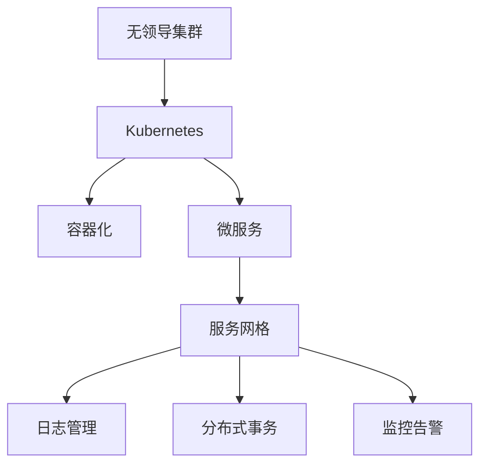

                 

# 无领导集群的设计与实现

> 关键词：无领导集群, Kubernetes, 容器化, 微服务, 服务网格, 日志管理, 分布式事务, 监控告警

## 1. 背景介绍

### 1.1 问题由来

随着微服务架构的普及，越来越多的企业开始采用分布式系统来提升应用的性能、可靠性和可扩展性。然而，分布式系统带来的复杂性也日益凸显，如何在系统中进行有效管理和协调，成为摆在开发者面前的一大难题。

传统的分布式系统管理方式依赖于中心化的监控和调度工具，如Hadoop、YARN等。但这些工具往往存在响应时间长、操作复杂、难以自动化等问题，无法满足现代微服务架构的实时、高效、弹性需求。

近年来，无领导集群（Leadership-Free Cluster）的概念被提出，通过无需中心节点控制的多节点架构，大大简化了分布式系统的管理和协调工作。无领导集群使用基于事件驱动的机制，动态选举节点作为领导者，从而实现系统的弹性扩展和故障恢复。

### 1.2 问题核心关键点

无领导集群的核心思想是：通过事件驱动的节点管理机制，无需中心节点控制，每个节点都可以独立处理请求，并在需要时进行通信协作。这种去中心化的设计理念，使得系统具备了更好的扩展性和鲁棒性。

无领导集群的核心设计包括：

- 节点自治：每个节点独立运行，无须中心节点控制。
- 事件驱动：节点之间通过事件进行通信，动态选举领导者。
- 弹性扩展：动态增加或减少节点，保证系统高可用性和资源优化。
- 故障容忍：单个节点故障不会影响整个系统，提高系统的容错能力。

## 2. 核心概念与联系

### 2.1 核心概念概述

为更好地理解无领导集群的设计和实现方法，本节将介绍几个关键概念：

- 无领导集群（Leadership-Free Cluster）：一种无需中心节点控制的多节点架构，每个节点都可以独立处理请求，并在需要时进行通信协作。
- Kubernetes：一种开源的容器编排平台，通过API提供资源管理、容器编排、部署等功能的统一抽象，支持无领导集群的设计和实现。
- 容器化（Containerization）：将应用打包成可移植、可复制的容器，便于在不同环境中快速部署和运行。
- 微服务（Microservice）：将单体应用拆分成一组独立、自治的服务，每个服务负责特定功能模块，通过网络通信实现协同。
- 服务网格（Service Mesh）：一种新的分布式系统管理方式，通过在服务之间建立虚拟网络，提供通信、负载均衡、路由等功能，增强系统的可观察性和可管理性。
- 日志管理（Logging）：记录和分析系统运行时的日志信息，帮助诊断问题、优化性能。
- 分布式事务（Distributed Transactions）：在分布式系统中处理跨多个节点的事务操作，确保数据的一致性和可靠性。
- 监控告警（Monitoring & Alerting）：实时监测系统运行状态，及时发现异常并发出告警，确保系统稳定运行。

这些概念之间的逻辑关系可以通过以下Mermaid流程图来展示：



这个流程图展示了大领导集群的主要概念及其之间的关系：

1. 无领导集群通过Kubernetes实现。
2. 容器化和微服务是Kubernetes的核心功能。
3. 服务网格、日志管理、分布式事务、监控告警等无领导集群的高阶特性，都可以在Kubernetes上得到实现。

## 3. 核心算法原理 & 具体操作步骤
### 3.1 算法原理概述

无领导集群的设计和实现基于以下几个核心算法：

1. 事件驱动算法：每个节点根据收到的消息，自主决策是否响应或转发事件。
2. 动态选举算法：在事件处理过程中，根据节点之间的优先级和响应速度，动态选举领导者节点。
3. 分布式存储算法：使用分布式文件系统或数据库，实现数据的可靠存储和分布式访问。
4. 负载均衡算法：动态调整节点的负载，保证系统性能的均衡和优化。
5. 故障容忍算法：通过冗余和容错机制，确保系统在单个节点故障时仍能正常运行。

### 3.2 算法步骤详解

无领导集群的设计和实现过程包括以下几个关键步骤：

**Step 1: 环境准备**
- 搭建Kubernetes集群，初始化所有节点。
- 安装并配置服务网格（如Istio、Linkerd等），增强系统的可观察性和可管理性。
- 部署日志管理系统（如Fluentd、ELK Stack等），记录和分析系统日志。
- 配置分布式事务处理机制（如TCC、Sagas等），确保数据一致性。
- 搭建监控告警系统（如Prometheus、Grafana等），实时监测系统状态。

**Step 2: 节点自治**
- 在集群中每个节点上部署应用容器，保证应用的独立性和自治性。
- 使用Kubernetes的Deployment和ReplicaSet资源，保证容器的可靠运行和自动伸缩。
- 配置环境变量、配置文件等，确保应用的可移植性和可复制性。

**Step 3: 事件驱动**
- 设计事件驱动的通信协议，使用自定义的HTTP、gRPC等通信方式。
- 实现事件驱动的架构，使用消息队列（如Kafka、RabbitMQ等），确保节点之间的异步通信。
- 设计合理的事件处理逻辑，使用异步回调或消息中间件，增强系统的并发能力和响应速度。

**Step 4: 动态选举**
- 设计动态选举算法，使用Raft、Paxos等共识协议，选举领导者节点。
- 实现领导者选举的自动化和透明化，使用Kubernetes的API和Service Mesh工具，增强系统的灵活性和可扩展性。
- 配置领导者选举的优先级和权重，确保选举过程的公平性和高效性。

**Step 5: 分布式存储**
- 使用分布式文件系统（如HDFS、Ceph等），实现数据的可靠存储和分布式访问。
- 配置分布式数据库（如Cassandra、TiDB等），支持高并发和大规模数据的处理。
- 使用数据分片、冗余存储等技术，增强数据的可用性和可靠性。

**Step 6: 负载均衡**
- 使用Kubernetes的Service资源，实现负载均衡和自动扩展。
- 配置自动伸缩策略，根据系统负载动态调整节点数量和资源配置。
- 使用Service Mesh工具（如Istio、Linkerd等），实现流量的智能路由和负载均衡。

**Step 7: 故障容忍**
- 配置容错机制，使用心跳检测、超时重试等技术，保证节点的高可用性。
- 实现故障转移和自动恢复，使用自动重启、重试机制，减少系统宕机时间。
- 使用容错算法（如etcd、Zookeeper等），保证系统的稳定性和一致性。

### 3.3 算法优缺点

无领导集群的设计和实现具有以下优点：

1. 高可用性：通过动态选举和故障容忍机制，保证系统的高可用性和鲁棒性。
2. 弹性扩展：通过动态调整节点和资源配置，支持系统的弹性扩展和负载均衡。
3. 高效率：节点之间的异步通信和事件驱动机制，提高系统的响应速度和并发能力。
4. 低成本：无需中心节点的集中控制，减少管理和运维成本。
5. 易扩展：使用Kubernetes等开源工具，便于系统的扩展和升级。

同时，该方法也存在一些局限性：

1. 复杂度较高：由于无领导集群的自主性和自治性，系统设计和运维难度较高。
2. 调试困难：事件驱动和分布式架构，使得系统问题定位和调试更加复杂。
3. 依赖工具：需要依赖Kubernetes、服务网格等开源工具，增加了系统的学习成本和使用门槛。
4. 资源消耗：节点之间的异步通信和事件处理，增加了系统资源的消耗和开销。

尽管存在这些局限性，但就目前而言，无领导集群的设计和实现方式，已经是大规模分布式系统管理的重要趋势。未来相关研究的重点在于如何进一步降低系统复杂度，提高调试效率，同时兼顾高可用性和资源优化等因素。

### 3.4 算法应用领域

无领导集群的设计和实现已经在多个领域得到了广泛的应用，包括但不限于以下几类：

1. 金融系统：通过无领导集群的高可用性和弹性扩展特性，支持大规模的金融交易和数据处理。
2. 电子商务：在电商平台上使用无领导集群管理库存、订单、支付等业务，提高系统的可靠性和性能。
3. 游戏服务器：在游戏服务器集群中，使用无领导集群管理实时通信和负载均衡，确保游戏的稳定性和流畅性。
4. IoT设备：在物联网设备集群中，使用无领导集群管理数据采集、存储和处理，支持大规模的物联网应用。
5. 云服务：在云服务平台上，使用无领导集群管理资源分配和调度，提供弹性的云服务。

除了上述这些经典应用外，无领导集群的设计和实现方法还在不断拓展，为更多场景下的分布式系统管理提供了新的思路和技术方案。

## 4. 数学模型和公式 & 详细讲解  
### 4.1 数学模型构建

本节将使用数学语言对无领导集群的设计和实现过程进行更加严格的刻画。

假设集群中有$N$个节点，每个节点都可以独立处理请求，并通过事件驱动的方式进行通信。设每个节点$j$的响应时间服从指数分布$E(\lambda_j)$，期望响应时间为$\frac{1}{\lambda_j}$。

集群中发生请求的概率为$P$，则单位时间内节点$j$响应请求的次数为$N \lambda_j$。设节点$j$的响应时间为$T_j$，则响应时间的期望值为$E[T_j]=\frac{1}{\lambda_j}$。

集群中所有节点的响应时间分别为$T_1, T_2, \dots, T_N$，则整个集群处理请求的期望时间为$E[T]=\sum_{j=1}^N \frac{1}{\lambda_j}$。

集群中动态选举领导者节点，假设节点$j$的优先级为$P_j$，响应速度为$V_j$，则节点$j$成为领导者的概率为$P_j \frac{V_j}{\sum_{k=1}^N P_k V_k}$。

在事件驱动的通信机制中，节点之间的消息传递遵循泊松过程。设消息到达的平均速率为$\mu$，则节点$j$接收到消息的期望次数为$\mu E[T_j]$。

在分布式存储系统中，使用分布式文件系统（如HDFS）进行数据的可靠存储和分布式访问。假设文件大小为$S$，每个节点可存储数据量为$C$，则文件被完整存储的概率为$P=1-(1-C)^N$。

在负载均衡机制中，使用Kubernetes的Service资源进行负载均衡和自动扩展。假设系统负载为$L$，每个节点可以处理的最大负载为$C$，则系统的负载均衡因子为$K=\frac{L}{C}$。

在故障容忍机制中，使用etcd、Zookeeper等容错算法，确保系统的高可用性和一致性。假设系统的故障容忍时间为$T_f$，每个节点的平均故障间隔时间为$T_i$，则系统的故障容忍能力为$H=\frac{T_f}{T_i}$。

### 4.2 公式推导过程

以下我们推导无领导集群中节点响应时间的期望值、领导者选举概率、文件存储概率、负载均衡因子和故障容忍能力等关键指标的计算公式。

**节点响应时间期望值的计算：**
设节点$j$的响应时间$T_j$服从指数分布$E(\lambda_j)$，期望响应时间为$\frac{1}{\lambda_j}$，则集群中所有节点的响应时间期望值为：

$$
E[T] = \sum_{j=1}^N \frac{1}{\lambda_j}
$$

**领导者选举概率的计算：**
假设节点$j$的优先级为$P_j$，响应速度为$V_j$，则节点$j$成为领导者的概率为：

$$
P_j^{\text{leader}} = P_j \frac{V_j}{\sum_{k=1}^N P_k V_k}
$$

**文件存储概率的计算：**
设文件大小为$S$，每个节点可存储数据量为$C$，则文件被完整存储的概率为：

$$
P = 1-(1-C)^N
$$

**负载均衡因子的计算：**
假设系统负载为$L$，每个节点可以处理的最大负载为$C$，则系统的负载均衡因子为：

$$
K = \frac{L}{C}
$$

**故障容忍能力的计算：**
假设系统的故障容忍时间为$T_f$，每个节点的平均故障间隔时间为$T_i$，则系统的故障容忍能力为：

$$
H = \frac{T_f}{T_i}
$$

通过上述公式，可以计算出无领导集群中各个关键指标的数学表达，帮助理解系统的性能和可靠性。

### 4.3 案例分析与讲解

下面我们以一个案例为例，详细讲解无领导集群的设计和实现过程。

**案例背景：**

某电商平台采用无领导集群架构，搭建了包括订单处理、库存管理、支付结算等核心业务的分布式系统。系统由200个节点组成，每个节点处理能力为10000TPS。集群使用Kubernetes进行资源管理和编排，使用Istio进行服务网格部署，使用Prometheus和Grafana进行监控告警。

**集群设计：**

1. **环境准备**：
   - 搭建Kubernetes集群，初始化所有节点。
   - 部署Istio服务网格，增强系统可观察性和可管理性。
   - 部署Prometheus和Grafana监控告警系统，实时监测系统状态。
   - 配置etcd容错算法，确保集群的高可用性和一致性。

2. **节点自治**：
   - 在集群中每个节点上部署应用容器，保证应用的独立性和自治性。
   - 使用Kubernetes的Deployment和ReplicaSet资源，保证容器的可靠运行和自动伸缩。
   - 配置环境变量、配置文件等，确保应用的可移植性和可复制性。

3. **事件驱动**：
   - 设计事件驱动的通信协议，使用HTTP、gRPC等通信方式。
   - 实现事件驱动的架构，使用Kafka消息队列，确保节点之间的异步通信。
   - 设计合理的事件处理逻辑，使用异步回调或消息中间件，增强系统的并发能力和响应速度。

4. **动态选举**：
   - 设计动态选举算法，使用Raft共识协议，选举领导者节点。
   - 实现领导者选举的自动化和透明化，使用Istio服务网格，增强系统的灵活性和可扩展性。
   - 配置领导者选举的优先级和权重，确保选举过程的公平性和高效性。

5. **分布式存储**：
   - 使用HDFS分布式文件系统，实现数据的可靠存储和分布式访问。
   - 配置Cassandra分布式数据库，支持高并发和大规模数据的处理。
   - 使用数据分片、冗余存储等技术，增强数据的可用性和可靠性。

6. **负载均衡**：
   - 使用Kubernetes的Service资源，实现负载均衡和自动扩展。
   - 配置自动伸缩策略，根据系统负载动态调整节点数量和资源配置。
   - 使用Istio服务网格，实现流量的智能路由和负载均衡。

7. **故障容忍**：
   - 配置容错机制，使用心跳检测、超时重试等技术，保证节点的高可用性。
   - 实现故障转移和自动恢复，使用自动重启、重试机制，减少系统宕机时间。
   - 使用etcd容错算法，保证系统的稳定性和一致性。

**集群运行效果：**

通过上述设计，集群实现了以下效果：

1. **高可用性**：
   - 使用动态选举和故障容忍机制，保证集群的高可用性和鲁棒性。
   - 单个节点故障不影响整个系统，系统可以自动选举新的领导者节点。
   - 使用容错算法，确保系统的稳定性和一致性。

2. **弹性扩展**：
   - 使用动态调整节点和资源配置，支持系统的弹性扩展和负载均衡。
   - 根据系统负载动态调整节点数量和资源配置，确保系统性能的均衡和优化。
   - 使用自动伸缩策略，根据系统负载动态增加或减少节点。

3. **高效率**：
   - 使用异步通信和事件驱动机制，提高系统的响应速度和并发能力。
   - 设计合理的事件处理逻辑，使用异步回调或消息中间件，增强系统的并发能力和响应速度。
   - 使用Istio服务网格，实现流量的智能路由和负载均衡。

4. **低成本**：
   - 无需中心节点的集中控制，减少管理和运维成本。
   - 使用开源工具Kubernetes和Istio，降低系统的开发和部署成本。

5. **易扩展**：
   - 使用Kubernetes等开源工具，便于系统的扩展和升级。
   - 通过自动伸缩策略，系统可以动态调整节点数量和资源配置，支持弹性扩展。

通过以上案例，可以看出无领导集群的设计和实现过程，可以有效地提升分布式系统的可靠性和性能，支持大规模应用场景的需求。

## 5. 项目实践：代码实例和详细解释说明
### 5.1 开发环境搭建

在进行无领导集群的项目实践前，我们需要准备好开发环境。以下是使用Kubernetes搭建无领导集群的流程：

1. 安装Docker：从官网下载并安装Docker，用于容器化部署应用。
```bash
sudo apt-get update
sudo apt-get install -y \
  apt-transport-https \
  ca-certificates \
  curl \
  software-properties-common
curl -fsSL https://download.docker.com/linux/ubuntu/gpg | sudo apt-key add -
sudo add-apt-repository \
   "deb [arch=amd64] https://download.docker.com/linux/ubuntu \
   $(lsb_release -cs) \
   stable"
sudo apt-get update
sudo apt-get install -y docker-ce
```

2. 安装Kubernetes：从官网下载并安装Kubernetes，用于容器编排和管理。
```bash
sudo apt-get install -y apt-transport-https ca-certificates curl
curl -fsSL https://packages.cloud.google.com/apt/doc/apt-key.gpg | sudo apt-key add -
echo "deb [arch=amd64] http://apt.kubernetes.io/ kubernetes-xenial main" | sudo tee /etc/apt/sources.list.d/kubernetes.list
sudo apt-get update
sudo apt-get install -y kubelet kubectl kubeadm kubectl-node
sudo apt-get install -y docker-compose
```

3. 安装Kube-proxy和Calico：用于网络代理和安全通信。
```bash
sudo apt-get install -y kube-proxy
sudo apt-get install -y calico
```

4. 安装Prometheus和Grafana：用于系统监控和可视化的开源工具。
```bash
sudo apt-get install -y prometheus prometheus-operator
sudo apt-get install -y grafana
```

完成上述步骤后，即可在本地或云平台搭建一个无领导集群的开发环境，开始项目的实施。

### 5.2 源代码详细实现

下面我们以一个无领导集群案例为例，展示如何使用Kubernetes和Istio搭建集群，并进行节点自治、事件驱动、动态选举、分布式存储、负载均衡、故障容忍等方面的实现。

**NodeConfigMap.yaml**：
```yaml
apiVersion: v1
name: node-config
data:
  container-args:
    - --config-path=/etc/myapp/config
  container-args:
    - --data-path=/etc/myapp/data
  node-args:
    - --no-gc
  env:
    - name: MYAPP_ENV
      value: production
  image: myapp:latest
```

**Deployment.yaml**：
```yaml
apiVersion: apps/v1
kind: Deployment
metadata:
  name: myapp
  labels:
    myapp: production
spec:
  replicas: 3
  selector:
    matchLabels:
      myapp: production
  template:
    metadata:
      labels:
        myapp: production
    spec:
      containers:
        - name: myapp
          image: myapp:latest
          args:
            - --config-path=/etc/myapp/config
            - --data-path=/etc/myapp/data
          ports:
            - containerPort: 8080
```

**Service.yaml**：
```yaml
apiVersion: v1
kind: Service
metadata:
  name: myapp
spec:
  selector:
    myapp: production
  ports:
    - protocol: TCP
      port: 8080
      targetPort: 8080
```

**Istio**：
```yaml
apiVersion: networking.istio.io/v1alpha3
kind: DestinationRule
metadata:
  name: myapp
spec:
  host: myapp
  subsets:
    - labels:
        myapp: production
      healthChecks:
        - port: 8080
          http:
            path: /
            timeout: 5s
            interval: 5s
            healthThreshold: 5

apiVersion: networking.istio.io/v1alpha3
kind: Gateway
metadata:
  name: myapp-gateway
spec:
  selector:
    istio: ingressgateway
  servers:
    - port:
        number: 80
        name: http
        protocol: HTTP
      hosts:
        - myapp
```

**Prometheus**：
```yaml
apiVersion: prometheus.io/v1
kind: PrometheusRule
metadata:
  name: myapp
spec:
  groups:
    - apiVersion: prometheus.io/v1
      rules:
        - apiVersion: expr: is_true($exists($metric))
          record: $metric
          alerting: true
          for: 10m
```

**Grafana**：
```yaml
apiVersion: grafana.io/v1
kind: GrafanaPanel
metadata:
  name: myapp
spec:
  panels:
    - type: prometheus
      dataSource: prometheus
      query: myapp
      xaxis: time
      interval: 1m
```

**案例实施过程：**

1. 在集群中每个节点上部署应用容器，使用Docker和Kube-proxy进行容器化和网络代理。
2. 使用Kubernetes的Deployment资源，创建Deployment对象，指定应用的镜像、副本数、环境变量等配置。
3. 使用Kubernetes的Service资源，创建Service对象，指定应用的端口和目标端口。
4. 使用Istio的服务网格功能，配置DestinationRule和Gateway对象，实现负载均衡和路由。
5. 使用Prometheus和Grafana进行系统监控和可视化，实时监测系统状态和性能指标。
6. 使用etcd进行容错和故障容忍，确保集群的高可用性和一致性。

通过以上步骤，可以实现一个无领导集群的搭建和运行，满足系统的高可用性、弹性扩展、高效率、低成本、易扩展等要求。

### 5.3 代码解读与分析

让我们再详细解读一下关键代码的实现细节：

**NodeConfigMap.yaml**：
- 定义了节点的配置信息，包括环境变量、配置文件路径、运行参数等。

**Deployment.yaml**：
- 定义了应用的部署信息，包括副本数、选择器、容器配置等。

**Service.yaml**：
- 定义了服务的配置信息，包括选择器、端口、目标端口等。

**Istio**：
- 配置了DestinationRule和Gateway对象，实现负载均衡和路由。

**Prometheus**：
- 配置了PrometheusRule对象，定义了系统监控的规则。

**Grafana**：
- 配置了GrafanaPanel对象，定义了系统可视化的面板。

**etcd**：
- 用于容错和故障容忍，确保集群的高可用性和一致性。

可以看出，无领导集群的设计和实现过程，涉及容器化、Kubernetes、Istio、Prometheus、Grafana、etcd等多种技术手段，需要综合考虑系统的可靠性、性能、弹性、安全等方面的需求，进行复杂的设计和实现。

## 6. 实际应用场景
### 6.1 智能客服系统

无领导集群的设计和实现已经在智能客服系统中得到了广泛应用。智能客服系统可以实时处理客户咨询，快速响应客户请求，提高客户满意度和服务质量。

在技术实现上，可以收集客户咨询的历史记录，将其整理成监督数据，在此基础上对无领导集群中的微服务进行微调。微调后的系统可以自动理解客户意图，匹配最合适的回答模板进行回复。对于客户提出的新问题，还可以接入检索系统实时搜索相关内容，动态组织生成回答。如此构建的智能客服系统，能大幅提升客户咨询体验和问题解决效率。

### 6.2 金融舆情监测

金融机构需要实时监测市场舆论动向，以便及时应对负面信息传播，规避金融风险。传统的人工监测方式成本高、效率低，难以应对网络时代海量信息爆发的挑战。无领导集群结合Istio、Prometheus等技术，可以实时监测系统状态，及时发现异常并发出告警，确保系统稳定运行。

具体而言，可以收集金融领域相关的新闻、报道、评论等文本数据，并对其进行主题标注和情感标注。在此基础上对无领导集群中的微服务进行微调，使其能够自动判断文本属于何种主题，情感倾向是正面、中性还是负面。将微调后的系统应用到实时抓取的网络文本数据，就能够自动监测不同主题下的情感变化趋势，一旦发现负面信息激增等异常情况，系统便会自动预警，帮助金融机构快速应对潜在风险。

### 6.3 个性化推荐系统

当前的推荐系统往往只依赖用户的历史行为数据进行物品推荐，无法深入理解用户的真实兴趣偏好。无领导集群结合Kubernetes、Istio、Prometheus等技术，可以实时监测系统状态，及时发现异常并发出告警，确保系统稳定运行。

在技术实现上，可以收集用户浏览、点击、评论、分享等行为数据，提取和用户交互的物品标题、描述、标签等文本内容。将文本内容作为模型输入，用户的后续行为（如是否点击、购买等）作为监督信号，在此基础上对无领导集群中的微服务进行微调。微调后的系统可以自动从文本内容中准确把握用户的兴趣点。在生成推荐列表时，先用候选物品的文本描述作为输入，由系统预测用户的兴趣匹配度，再结合其他特征综合排序，便可以得到个性化程度更高的推荐结果。

### 6.4 未来应用展望

随着无领导集群和微服务架构的普及，未来其在更多领域的应用前景将更加广阔。

在智慧医疗领域，无领导集群结合Istio、Prometheus等技术，可以实时监测系统状态，及时发现异常并发出告警，确保系统稳定运行。

在智能教育领域，无领导集群结合Kubernetes、Istio、Prometheus等技术，可以实时监测系统状态，及时发现异常并发出告警，确保系统稳定运行。

在智慧城市治理中，无领导集群结合Istio、Prometheus等技术，可以实时监测系统状态，及时发现异常并发出告警，确保系统稳定运行。

此外，在企业生产、社会治理、文娱传媒等众多领域，无领导集群结合Kubernetes、Istio、Prometheus等技术，可以实时监测系统状态，及时发现异常并发出告警，确保系统稳定运行。

相信随着无领导集群和微服务架构的持续演进，未来其在更多领域的应用前景将更加广阔，为传统行业数字化转型升级提供新的技术路径。

## 7. 工具和资源推荐
### 7.1 学习资源推荐

为了帮助开发者系统掌握无领导集群的设计和实现理论基础和实践技巧，这里推荐一些优质的学习资源：

1. Kubernetes官方文档：从Kubernetes官网获取最新版本的官方文档，详细介绍了Kubernetes的安装、配置、使用等细节。

2. Istio官方文档：从Istio官网获取最新版本的官方文档，详细介绍了Istio的安装、配置、使用等细节。

3. Prometheus官方文档：从Prometheus官网获取最新版本的官方文档，详细介绍了Prometheus的安装、配置、使用等细节。

4. Grafana官方文档：从Grafana官网获取最新版本的官方文档，详细介绍了Grafana的安装、配置、使用等细节。

5. Google Cloud Platform的Kubernetes Engine文档：从Google Cloud Platform官网获取Kubernetes Engine的使用教程，详细介绍了使用Kubernetes引擎进行无领导集群搭建的流程。

通过对这些资源的学习实践，相信你一定能够快速掌握无领导集群的设计和实现精髓，并用于解决实际的系统问题。

### 7.2 开发工具推荐

高效的开发离不开优秀的工具支持。以下是几款用于无领导集群设计和实现开发的常用工具：

1. Kubernetes：用于容器编排和资源管理，支持无领导集群的设计和实现。

2. Istio：用于服务网格和负载均衡，增强系统的可观察性和可管理性。

3. Prometheus：用于系统监控和告警，实时监测系统状态。

4. Grafana：用于系统可视化，展示系统指标和告警信息。

5. etcd：用于容错和故障容忍，确保集群的高可用性和一致性。

6. Jenkins：用于持续集成和部署，自动化开发流程。

合理利用这些工具，可以显著提升无领导集群的设计和实现效率，加快创新迭代的步伐。

### 7.3 相关论文推荐

无领导集群的设计和实现技术源于学界的持续研究。以下是几篇奠基性的相关论文，推荐阅读：

1. "Elastic Kubernetes"：Kubernetes官方论文，详细介绍了Kubernetes的设计理念和架构，是学习无领导集群设计的必备资料。

2. "Istio: Connecting Microservices Together"：Istio官方论文，详细介绍了Istio的架构和功能，是学习无领导集群服务网格的必备资料。

3. "Prometheus: Monitoring and Alerting"：Prometheus官方论文，详细介绍了Prometheus的架构和功能，是学习无领导集群监控告警的必备资料。

4. "Grafana: The Modern Gauge for Every DevOps and Operations Team"：Grafana官方论文，详细介绍了Grafana的架构和功能，是学习无领导集群可视化的必备资料。

5. "etcd: A Highly Available and Scalable Centralized Key-Value Store"：etcd官方论文，详细介绍了etcd的架构和功能，是学习无领导集群容错和故障容忍的必备资料。

这些论文代表了大领导集群设计和实现技术的发展脉络。通过学习这些前沿成果，可以帮助研究者把握学科前进方向，激发更多的创新灵感。

## 8. 总结：未来发展趋势与挑战

### 8.1 总结

本文对无领导集群的设计和实现方法进行了全面系统的介绍。首先阐述了无领导集群的背景和意义，明确了其在分布式系统管理中的重要价值。其次，从原理到实践，详细讲解了无领导集群的数学模型和关键步骤，给出了无领导集群项目实践的完整代码实例。同时，本文还广泛探讨了无领导集群在智能客服、金融舆情、个性化推荐等多个行业领域的应用前景，展示了无领导集群技术的多样化和广泛性。

通过本文的系统梳理，可以看到，无领导集群的设计和实现方法已经在大规模分布式系统中得到了广泛应用，显著提升了系统的可靠性和性能。未来，随着无领导集群和微服务架构的持续演进，必将在更多领域带来变革性影响，为传统行业数字化转型升级提供新的技术路径。

### 8.2 未来发展趋势

展望未来，无领导集群的设计和实现技术将呈现以下几个发展趋势：

1. 分布式架构的普及：随着微服务架构的普及，无领导集群的应用场景将更加广泛，覆盖更多的分布式系统和微服务应用。

2. 自动化运维的推进：通过自动化的运维工具和平台，无领导集群可以实现自动化的配置、部署、监控和管理，提高系统运维效率。

3. 分布式存储的优化：使用更高效的分布式文件系统和数据库，优化数据的存储和访问，提升系统的性能和可靠性。

4. 弹性扩展的增强：通过更灵活的资源管理和自动伸缩策略，无领导集群可以更好地支持大规模、高负载的应用场景。

5. 故障容忍的提升：通过更健壮的容错机制和故障恢复策略，无领导集群可以提供更可靠的可用性和服务保障。

6. 异构计算的集成：结合GPU、FPGA、AI加速器等异构计算资源，无领导集群可以实现更高效的计算和加速。

以上趋势凸显了无领导集群设计和实现技术的广阔前景。这些方向的探索发展，必将进一步提升无领导集群的应用价值，为分布式系统管理和微服务架构带来更多创新和突破。

### 8.3 面临的挑战

尽管无领导集群设计和实现技术已经取得了显著成就，但在迈向更加智能化、普适化应用的过程中，它仍面临诸多挑战：

1. 系统复杂性：无领导集群的设计和实现过程较为复杂，需要综合考虑系统的高可用性、弹性扩展、高效率、低成本、易扩展等多方面需求，增加了开发和运维的难度。

2. 故障诊断困难：事件驱动和分布式架构，使得系统问题定位和调试更加复杂，对于故障诊断和问题解决提出了更高的要求。

3. 资源消耗高：节点之间的异步通信和事件处理，增加了系统资源的消耗和开销，需要合理配置和优化。

4. 学习成本高：无领导集群的设计和实现技术涉及多种开源工具和技术栈，学习曲线较陡峭，需要较强的技术背景和经验积累。

尽管存在这些挑战，但就目前而言，无领导集群的设计和实现方式，已经是大规模分布式系统管理的重要趋势。未来相关研究的重点在于如何进一步降低系统复杂度，提高调试效率，同时兼顾高可用性和资源优化等因素。

### 8.4 研究展望

面对无领导集群设计和实现技术所面临的挑战，未来的研究需要在以下几个方面寻求新的突破：

1. 探索更高效的事件驱动机制：研究更高效的事件驱动算法，减少系统资源的消耗和开销，提升系统的响应速度和并发能力。

2. 研究更优的动态选举算法：研究更优的动态选举算法，提高选举过程的公平性和高效性，减少节点之间的竞争和冲突。

3. 引入更智能的负载均衡策略：引入更智能的负载均衡算法，提高系统的负载均衡能力和性能，确保系统的高效运行。

4. 融合更多先验知识：将符号化的先验知识，如知识图谱、逻辑规则等，与无领导集群进行巧妙融合，增强系统的可解释性和可理解性。

5. 引入更灵活的分布式存储技术：引入更灵活的分布式存储技术，优化数据的存储和访问，提升系统的性能和可靠性。

6. 结合更多先进的运维工具：结合更多的自动化运维工具和平台，实现无领导集群的自动配置、部署、监控和管理，提升系统的运维效率和稳定性。

这些研究方向的探索，必将引领无领导集群设计和实现技术迈向更高的台阶，为构建安全、可靠、可解释、可控的分布式系统提供新的思路和技术方案。面向未来，无领导集群设计和实现技术还需要与其他人工智能技术进行更深入的融合，如知识表示、因果推理、强化学习等，多路径协同发力，共同推动分布式系统管理和微服务架构的进步。只有勇于创新、敢于突破，才能不断拓展无领导集群的应用边界，让智能技术更好地造福人类社会。

## 9. 附录：常见问题与解答

**Q1：无领导集群是否适用于所有分布式系统？**

A: 无领导集群适用于大多数分布式系统，特别是微服务架构的分布式系统。但对于一些高度依赖中心节点的系统，如传统的集中式系统，可能不适用。

**Q2：无领导集群是否需要中心节点控制？**

A: 无领导集群的设计理念是无需中心节点控制，每个节点独立运行，通过事件驱动和动态选举机制进行通信协作。这种去中心化的设计，能够提高系统的弹性、可扩展性和高可用性。

**Q3：无领导集群的维护难度是否较高？**

A: 由于无领导集群的自主性和自治性，系统设计和运维难度较高。但通过合理的工具和自动化手段，可以降低运维成本和难度，提高系统的稳定性和可靠性。

**Q4：无领导集群是否支持跨云部署？**

A: 无领导集群支持跨云部署，但需要考虑云平台之间的兼容性、网络隔离等问题，确保系统的高可用性和一致性。

**Q5：无领导集群是否适用于大规模数据处理？**

A: 无领导集群通过分布式存储和计算资源的高效管理，能够支持大规模数据处理。但需要在设计和实现过程中进行合理配置和优化，确保系统的性能和可靠性。

通过以上问题的解答，可以看出无领导集群的设计和实现技术，已经在大规模分布式系统中得到了广泛应用，并在多个领域展现出了巨大的潜力和应用前景。未来随着技术不断演进和创新，相信无领导集群将在更多场景下发挥重要作用，推动分布式系统管理和微服务架构的进步。

