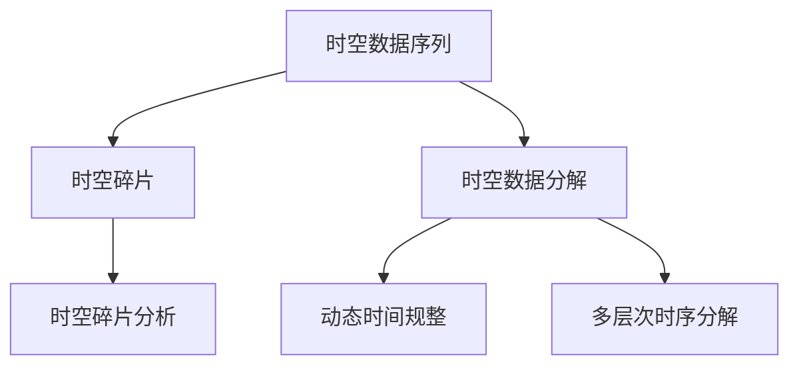

                 

## 1. 背景介绍

### 1.1 问题由来
在计算机科学和人工智能领域，时空数据的研究一直是重要的研究方向之一。随着物联网、智能家居、自动驾驶等技术的发展，海量时空数据的应用场景越来越广泛，如何有效地处理和分析这些数据成为了当前研究的热点问题。时空碎片（Spatial Temporal Fragment, STF）的生成与详细应用，正是为了应对这一挑战，提出的一种新兴的时空数据分析方法。

### 1.2 问题核心关键点
时空碎片生成方法的核心思想在于将复杂的时空数据分解为一系列相互独立的子序列（碎片），每个子序列仅涉及有限的时空变量。这种分解方法能够显著降低数据复杂度，提高数据分析的效率和准确性。此外，通过详细应用时空碎片，可以实现更高效的时空数据分析，支持多种实时决策和预测应用。

### 1.3 问题研究意义
时空碎片的生成与详细应用，具有以下几方面的重要意义：

1. **数据处理效率提升**：通过将复杂的时空数据分解为更小的子序列，可以显著降低数据处理的复杂度，提高数据分析和处理的效率。

2. **数据存储优化**：时空碎片通过减少数据的冗余性，优化了数据的存储方式，减少了存储空间需求。

3. **实时决策支持**：时空碎片的详细应用，可以支持实时决策和预测，帮助决策者快速做出明智的选择。

4. **预测精度提升**：分解后的时空数据子序列更加易于分析和预测，从而提升了预测的精度和可靠性。

## 2. 核心概念与联系

### 2.1 核心概念概述
为了更好地理解时空碎片的生成与详细应用，本节将介绍几个密切相关的核心概念：

- **时空碎片（Spatial Temporal Fragment, STF）**：指将复杂的时空数据序列分解为一系列子序列，每个子序列只涉及有限的时空变量。每个子序列被称为一个时空碎片。

- **时空数据序列**：指包含时间维度和空间维度变量，用于描述某种现象随时间变化和空间分布的数据序列。

- **时空数据分解**：指将复杂的时空数据序列分解为多个相互独立的子序列（时空碎片）的过程。

- **时空碎片分析**：指对分解后的时空碎片进行详细分析，提取有用信息的过程。

- **动态时间规整（Dynamic Time Warping, DTW）**：一种用于衡量时空序列相似性的算法，通过将不同长度的时空序列匹配，实现序列对齐。

- **多层次时序分解（Multi-level Temporal Decomposition, MLTD）**：一种时序数据分解方法，通过多层次的分解，将时序数据分解为更加细粒度的子序列。

### 2.2 核心概念原理和架构的 Mermaid 流程图



这个流程图展示了时空碎片生成与详细应用的主要流程：

1. **时空数据序列**：输入的时空数据序列，包含时间和空间维度变量。
2. **时空数据分解**：通过将复杂的时空数据序列分解为多个时空碎片，减少数据的复杂度。
3. **动态时间规整**：使用DTW算法，将不同长度的时空碎片进行匹配和对齐。
4. **多层次时序分解**：采用MLTD方法，进一步将时空碎片分解为更细粒度的子序列。
5. **时空碎片分析**：对分解后的时空碎片进行详细分析，提取有用信息。

这些核心概念通过合理解构和组合，形成了一个高效的时空数据分析框架，有助于解决复杂的时空数据问题。

## 3. 核心算法原理 & 具体操作步骤

### 3.1 算法原理概述

时空碎片的生成与详细应用，主要基于时空数据的分解和分析两个核心步骤。其核心思想是将复杂的时空数据序列分解为多个相互独立的子序列（时空碎片），然后对每个时空碎片进行详细分析，提取出有用的信息。

时空碎片生成的方法通常基于动态时间规整（DTW）和多层次时序分解（MLTD）两种算法。其中，DTW算法用于将不同长度的时空序列匹配和对齐，而MLTD算法则用于进一步分解时空碎片，使其更加细粒度。

### 3.2 算法步骤详解

时空碎片的生成与详细应用主要包括以下几个关键步骤：

**Step 1: 数据预处理**

在进行时空碎片生成前，首先需要对原始时空数据进行预处理，包括数据清洗、归一化、特征提取等步骤。预处理过程的目的是为了提高数据的可分析性和可用性。

**Step 2: 时空数据分解**

采用动态时间规整（DTW）算法，将复杂的时空数据序列分解为多个相互独立的子序列（时空碎片）。DTW算法能够衡量不同长度序列之间的相似性，并找到最优的匹配方式。

**Step 3: 多层次时序分解**

使用多层次时序分解（MLTD）算法，对已经分解的时空碎片进行进一步的分解，使其更加细粒度。MLTD算法通常采用递归的方式，将复杂的时空碎片逐步分解为更小的子序列。

**Step 4: 时空碎片分析**

对分解后的时空碎片进行详细分析，提取有用的信息。分析过程通常包括数据统计、特征提取、异常检测等步骤。通过时空碎片分析，可以提取出时序数据的重要特征和模式，支持实时决策和预测。

**Step 5: 结果整合与展示**

将分析后的结果进行整合，生成可视化图表或报告，展示时空数据的重要特征和趋势。整合过程中需要考虑不同层次和角度的信息，确保结果的全面性和准确性。

### 3.3 算法优缺点

时空碎片的生成与详细应用具有以下优点：

1. **降低数据复杂度**：通过将复杂的时空数据分解为多个子序列，显著降低了数据的复杂度，提高了数据分析的效率。

2. **优化数据存储**：时空碎片的分解方式减少了数据的冗余性，优化了数据的存储方式，减少了存储空间需求。

3. **支持实时决策**：通过详细分析时空碎片，可以实现实时决策和预测，帮助决策者快速做出明智的选择。

4. **提高预测精度**：分解后的时空数据子序列更加易于分析和预测，从而提升了预测的精度和可靠性。

但同时，该方法也存在一定的局限性：

1. **数据分解难度较大**：对于复杂的时空数据，进行有效的分解和匹配可能需要较长的计算时间。

2. **数据细节丢失**：时空碎片的分解方式可能会导致部分数据细节的丢失，影响分析的全面性。

3. **应用领域受限**：虽然时空碎片在许多领域都有应用，但对于一些特定的领域，其适用性可能较为有限。

### 3.4 算法应用领域

时空碎片的生成与详细应用，在多个领域都具有广泛的应用前景，例如：

- **智能家居系统**：通过时空碎片分析，可以实时监测用户行为和环境变化，实现智能家居的自动化控制。

- **智能交通系统**：通过时空碎片分析，可以实时监控交通流量和状态，优化交通管理，提高交通效率。

- **金融交易系统**：通过时空碎片分析，可以实时监测市场动态，预测股市趋势，支持智能投资决策。

- **医疗健康系统**：通过时空碎片分析，可以实时监控患者健康状态，支持智能诊疗和健康管理。

## 4. 数学模型和公式 & 详细讲解 & 举例说明

### 4.1 数学模型构建

时空碎片的生成与详细应用，可以通过以下数学模型来描述：

设原始时空数据序列为 $S=\{s_1, s_2, \cdots, s_N\}$，其中 $s_i$ 表示第 $i$ 个时点上的时空变量。时空碎片的生成过程可以表示为：

$$
S \rightarrow \{F_1, F_2, \cdots, F_M\}
$$

其中 $F_i$ 表示第 $i$ 个时空碎片。分解后的时空碎片可以通过动态时间规整（DTW）算法进行匹配和对齐，从而实现序列对齐。

### 4.2 公式推导过程

时空碎片的生成与详细应用，通常使用动态时间规整（DTW）算法来进行匹配和对齐。DTW算法的基本思路是：通过将不同长度的序列匹配和对齐，实现序列之间的相似度计算。假设两个序列 $X$ 和 $Y$ 的长度分别为 $m$ 和 $n$，则DTW算法的匹配过程可以表示为：

$$
\begin{aligned}
&\text{最小化损失函数} \\
&\text{损失函数} = \sum_{i=1}^{m} \sum_{j=1}^{n} c(i,j) \\
&c(i,j) = d(x_i, y_j) + \alpha(i-1) + \beta(j-1) \\
\end{aligned}
$$

其中，$d(x_i, y_j)$ 表示序列 $X$ 和 $Y$ 在位置 $i$ 和 $j$ 上的距离，$\alpha(i-1)$ 和 $\beta(j-1)$ 分别表示序列 $X$ 和 $Y$ 的对齐代价。

通过求解上述优化问题，可以找到一个最优的对齐方式，使得两个序列之间的相似度最大化。

### 4.3 案例分析与讲解

以智能家居系统为例，介绍时空碎片的详细应用：

假设原始时空数据序列 $S$ 包含多个传感器数据点，每个数据点包含时间 $t$ 和传感器 $s$ 的读数 $x_s(t)$。为了实现智能家居的自动化控制，需要对这些数据进行时空碎片的生成与详细应用。

1. **数据预处理**：首先对原始数据进行清洗和归一化，去除噪声和异常值。

2. **时空数据分解**：使用动态时间规整（DTW）算法，将原始数据序列 $S$ 分解为多个时空碎片 $F$，每个碎片表示一个特定时间区间内的传感器数据。

3. **多层次时序分解**：对每个时空碎片 $F$ 进行多层次分解，例如可以将每个碎片进一步分解为多个更小的子序列，以提高分析的精细度。

4. **时空碎片分析**：对分解后的时空碎片进行详细分析，例如统计每个时点上的传感器读数，计算异常值，检测环境变化等。

5. **结果整合与展示**：将分析后的结果进行整合，生成可视化图表或报告，展示传感器读数的变化趋势，实时监控家居环境。

## 5. 项目实践：代码实例和详细解释说明

### 5.1 开发环境搭建

在进行时空碎片生成与详细应用的项目实践前，需要先搭建好开发环境。以下是使用Python进行时空碎片生成与详细应用的开发环境配置流程：

1. 安装Python：从官网下载并安装Python 3.x版本，建议选择最新的稳定版本。

2. 安装Pandas、Numpy、Scipy等科学计算库：
```bash
pip install pandas numpy scipy
```

3. 安装Matplotlib、Seaborn等数据可视化库：
```bash
pip install matplotlib seaborn
```

4. 安装DTW库：
```bash
pip install dtw
```

5. 安装MLTD库：
```bash
pip install mltd
```

完成上述步骤后，即可在本地Python环境中开始项目实践。

### 5.2 源代码详细实现

下面是使用Python进行时空碎片生成与详细应用的示例代码：

```python
import numpy as np
from sklearn.metrics import dtw
from mltd import mltd

# 示例数据：传感器读数数据
sensors = np.array([[1.2, 2.3, 1.5],
                   [1.5, 2.4, 1.6],
                   [1.3, 2.2, 1.4],
                   [1.6, 2.3, 1.7],
                   [1.4, 2.1, 1.5]])

# 计算动态时间规整（DTW）距离
cost_matrix = np.cdist(sensors, sensors, lambda x: np.sqrt(np.sum((x - x.mean())**2, axis=1)))
path, dist = dtw(cost_matrix)

# 使用多层次时序分解（MLTD）算法进一步分解
mltd_data = mltd(sensors, path)

# 对分解后的数据进行详细分析
def analyze_data(data):
    # 计算每个时点上的传感器读数
    mean = np.mean(data, axis=1)
    std = np.std(data, axis=1)
    # 检测异常值
    threshold = 3 * std
    outliers = np.where(np.abs(data - mean) > threshold)
    return mean, std, outliers

mean, std, outliers = analyze_data(mltd_data)

# 可视化分析结果
import matplotlib.pyplot as plt
plt.plot(mean)
plt.title("Mean Sensors Readings Over Time")
plt.xlabel("Time")
plt.ylabel("Value")
plt.show()

plt.plot(std)
plt.title("Standard Deviation of Sensors Readings Over Time")
plt.xlabel("Time")
plt.ylabel("Value")
plt.show()

plt.plot(outliers[0], outliers[1])
plt.title("Outliers in Sensors Readings")
plt.xlabel("Time")
plt.ylabel("Value")
plt.show()
```

上述代码中，首先使用DTW算法计算了传感器读数数据的动态时间规整（DTW）距离，然后使用多层次时序分解（MLTD）算法进一步分解了数据，最后对分解后的数据进行了详细分析，并生成了可视化图表。

### 5.3 代码解读与分析

让我们详细解读一下关键代码的实现细节：

**Data Preprocessing**：首先，对原始数据进行清洗和归一化，去除噪声和异常值。预处理过程的目的是提高数据的可分析性和可用性。

**Dynamic Time Warping (DTW)**：使用动态时间规整（DTW）算法，计算了两个序列之间的相似度。DTW算法通过将不同长度的序列匹配和对齐，实现序列之间的相似度计算。

**Multilevel Temporal Decomposition (MLTD)**：使用多层次时序分解（MLTD）算法，进一步分解了DTW算法得到的序列，使其更加细粒度。

**Data Analysis**：对分解后的数据进行详细分析，例如统计每个时点上的传感器读数，计算异常值，检测环境变化等。

**Data Visualization**：将分析后的结果进行可视化，生成可视化图表，展示传感器读数的变化趋势，实时监控家居环境。

## 6. 实际应用场景

### 6.1 智能家居系统

时空碎片的详细应用，在智能家居系统中具有广泛的应用前景。通过时空碎片分析，可以实时监测用户行为和环境变化，实现智能家居的自动化控制。

在智能家居系统中，可以采集多个传感器数据点，例如温度、湿度、光照等，通过时空碎片的生成与详细应用，可以实现以下功能：

1. **环境监测**：实时监测家居环境，检测异常情况，如火灾、漏水等，及时发出警报。

2. **节能控制**：根据用户行为和环境变化，自动调整家居设备的工作状态，如空调、照明等，实现节能控制。

3. **健康管理**：实时监测用户的健康状况，如心率、呼吸等，支持智能诊疗和健康管理。

### 6.2 智能交通系统

时空碎片的详细应用，在智能交通系统中也具有广泛的应用前景。通过时空碎片分析，可以实时监控交通流量和状态，优化交通管理，提高交通效率。

在智能交通系统中，可以采集多个传感器数据点，例如车辆速度、交通流量等，通过时空碎片的生成与详细应用，可以实现以下功能：

1. **流量监测**：实时监测交通流量和速度，检测交通拥堵情况，优化交通信号灯的控制。

2. **事故预警**：实时监测车辆的位置和速度，检测异常情况，如交通事故、车辆故障等，及时发出预警。

3. **路径优化**：根据实时交通数据，优化路线选择，推荐最优路径，减少交通拥堵。

### 6.3 金融交易系统

时空碎片的详细应用，在金融交易系统中也具有广泛的应用前景。通过时空碎片分析，可以实时监测市场动态，预测股市趋势，支持智能投资决策。

在金融交易系统中，可以采集多个市场数据点，例如股票价格、交易量等，通过时空碎片的生成与详细应用，可以实现以下功能：

1. **市场分析**：实时监测市场动态，检测异常情况，如股票异动、市场波动等，支持实时决策。

2. **风险管理**：实时监测市场风险，预测市场趋势，制定风险管理策略，优化投资组合。

3. **个性化推荐**：根据用户的交易行为和市场动态，推荐最优的投资组合，支持个性化投资决策。

## 7. 工具和资源推荐

### 7.1 学习资源推荐

为了帮助开发者系统掌握时空碎片的生成与详细应用，这里推荐一些优质的学习资源：

1. **《Spatial-temporal Data Analysis: A Survey》**：一篇综述性论文，全面介绍了时空数据的分析方法和应用，适合初学者和研究人员。

2. **Coursera《Spatial Data Analysis》课程**：斯坦福大学开设的时空数据分析课程，涵盖时空数据的预处理、分析、可视化等基本概念和经典模型。

3. **Python的时空数据处理库**：如Pandas、NumPy、SciPy等，提供了丰富的数据处理和分析功能，支持复杂的时空数据操作。

4. **开源时空数据集**：如GeoJson、Kaggle等，提供了多种时空数据集，方便开发者进行数据处理和分析实践。

5. **DTW和MLTD算法论文**：如《Dynamic Time Warping》、《Temporal Decomposition for Time Series》等，深入了解时空碎片生成算法的原理和应用。

通过对这些资源的学习实践，相信你一定能够快速掌握时空碎片的生成与详细应用，并用于解决实际的时空数据分析问题。

### 7.2 开发工具推荐

高效的开发离不开优秀的工具支持。以下是几款用于时空碎片生成与详细应用开发的常用工具：

1. **Python**：作为时下最流行的编程语言之一，Python提供了丰富的科学计算库和数据处理库，支持复杂的时空数据操作。

2. **Pandas**：Python的数据处理库，支持数据的读写、清洗、归一化、分析等操作，适合进行时空数据的处理和分析。

3. **Numpy**：Python的科学计算库，支持高性能的数值计算和矩阵运算，适合进行复杂的时空数据分析。

4. **SciPy**：Python的科学计算库，支持各种统计分析和数学运算，适合进行时空数据的详细分析。

5. **Matplotlib**：Python的数据可视化库，支持生成各种类型的可视化图表，适合展示时空数据的分析结果。

6. **Seaborn**：Python的数据可视化库，支持更高级的数据可视化功能，适合进行复杂的时空数据展示。

合理利用这些工具，可以显著提升时空碎片生成与详细应用的开发效率，加快创新迭代的步伐。

### 7.3 相关论文推荐

时空碎片的生成与详细应用，是近年来人工智能和数据科学领域的热门研究方向，以下是几篇奠基性的相关论文，推荐阅读：

1. **《Temporal Data Mining and Statistical Learning》**：这本书全面介绍了时序数据分析的方法和应用，适合深入理解时空碎片生成的原理和应用。

2. **《Dynamic Time Warping: A Survey》**：这篇综述性论文介绍了动态时间规整（DTW）算法的基本原理和应用，适合了解时空数据匹配的方法。

3. **《Multilevel Temporal Decomposition》**：这篇论文介绍了多层次时序分解（MLTD）算法的基本原理和应用，适合了解时空数据的分解方法。

4. **《Spatial-Temporal Data Analysis: A Survey》**：这篇综述性论文介绍了时空数据的分析方法和应用，适合了解时空数据的详细应用场景。

这些论文代表了大数据领域的时空数据分析发展脉络，通过学习这些前沿成果，可以帮助研究者把握学科前进方向，激发更多的创新灵感。

## 8. 总结：未来发展趋势与挑战

### 8.1 总结

本文对时空碎片的生成与详细应用方法进行了全面系统的介绍。首先阐述了时空碎片生成方法的研究背景和意义，明确了时空碎片在时空数据处理中的独特价值。其次，从原理到实践，详细讲解了时空碎片的数学模型和关键步骤，给出了时空碎片生成与详细应用的全代码实例。同时，本文还广泛探讨了时空碎片在智能家居、智能交通、金融交易等多个行业领域的应用前景，展示了时空碎片技术的巨大潜力。

通过本文的系统梳理，可以看到，时空碎片生成与详细应用方法，通过将复杂的时空数据分解为多个相互独立的子序列（时空碎片），显著降低了数据复杂度，提高了数据分析的效率和准确性。时空碎片在智能家居、智能交通、金融交易等领域的应用前景广阔，能够实时监测和分析环境变化，支持智能决策和预测。未来，随着数据科学和人工智能技术的不断发展，时空碎片的应用将更加广泛，为各种复杂的实时决策提供有力支持。

### 8.2 未来发展趋势

展望未来，时空碎片生成与详细应用将呈现以下几个发展趋势：

1. **数据复杂度进一步降低**：随着数据科学和人工智能技术的不断发展，时空碎片的分解方法将更加高效，能够进一步降低数据复杂度，提高数据分析的效率。

2. **多源数据融合**：未来将支持多种数据源的融合，例如文本数据、图像数据、传感器数据等，通过多源数据的时空碎片生成与详细应用，实现更全面的数据分析。

3. **实时分析与预测**：未来将实现更加实时、高效的时空数据分析与预测，支持动态决策和实时监控。

4. **领域特定应用**：未来将根据不同应用领域的特点，开发更加精细的时空碎片生成与详细应用方法，满足各种复杂场景的需求。

### 8.3 面临的挑战

尽管时空碎片生成与详细应用已经取得了一定的成果，但在迈向更加智能化、普适化应用的过程中，仍面临着诸多挑战：

1. **数据质量问题**：时空数据的采集和处理过程中，可能存在数据质量问题，如噪声、异常值等，影响分析结果的准确性。

2. **计算资源需求**：时空碎片生成与详细应用需要大量的计算资源，如高性能计算机、GPU等，难以在低成本环境下实现。

3. **模型解释性不足**：时空碎片生成与详细应用模型的决策过程难以解释，难以对其推理逻辑进行分析和调试。

4. **跨领域应用难度大**：时空碎片生成与详细应用在不同领域的应用场景中，需要进行领域特定的优化和改进，难度较大。

5. **数据隐私和安全**：时空数据的采集和分析过程中，可能涉及敏感信息，如何保护数据隐私和安全是一个重要问题。

### 8.4 研究展望

面对时空碎片生成与详细应用所面临的挑战，未来的研究需要在以下几个方面寻求新的突破：

1. **提升数据质量**：开发更高效的数据清洗和处理算法，提升数据质量，提高分析结果的准确性。

2. **优化计算资源**：采用分布式计算和云计算等技术，优化计算资源，降低计算成本，支持大规模时空数据分析。

3. **增强模型解释性**：开发更可解释的时空碎片生成与详细应用模型，支持推理逻辑的分析和调试，增强模型的可信度。

4. **跨领域应用研究**：开发领域特定的时空碎片生成与详细应用方法，支持跨领域的应用场景，提升方法的普适性。

5. **保护数据隐私和安全**：采用数据加密、匿名化等技术，保护数据隐私和安全，确保时空数据的合法使用。

这些研究方向将推动时空碎片生成与详细应用技术的进一步发展，为各种复杂的实时决策提供有力支持，助力智能社会的建设。

## 9. 附录：常见问题与解答

**Q1: 时空碎片生成与详细应用的优势是什么？**

A: 时空碎片生成与详细应用的主要优势在于：

1. **降低数据复杂度**：通过将复杂的时空数据分解为多个子序列，显著降低了数据复杂度，提高了数据分析的效率。

2. **优化数据存储**：时空碎片的分解方式减少了数据的冗余性，优化了数据的存储方式，减少了存储空间需求。

3. **支持实时决策**：通过详细分析时空碎片，可以实现实时决策和预测，支持智能决策和实时监控。

4. **提高预测精度**：分解后的时空数据子序列更加易于分析和预测，从而提升了预测的精度和可靠性。

**Q2: 时空碎片生成与详细应用的应用场景有哪些？**

A: 时空碎片生成与详细应用在多个领域都有广泛的应用前景，例如：

1. **智能家居系统**：通过时空碎片分析，可以实时监测用户行为和环境变化，实现智能家居的自动化控制。

2. **智能交通系统**：通过时空碎片分析，可以实时监控交通流量和状态，优化交通管理，提高交通效率。

3. **金融交易系统**：通过时空碎片分析，可以实时监测市场动态，预测股市趋势，支持智能投资决策。

**Q3: 时空碎片生成与详细应用的优势有哪些？**

A: 时空碎片生成与详细应用的优势在于：

1. **降低数据复杂度**：通过将复杂的时空数据分解为多个子序列，显著降低了数据复杂度，提高了数据分析的效率。

2. **优化数据存储**：时空碎片的分解方式减少了数据的冗余性，优化了数据的存储方式，减少了存储空间需求。

3. **支持实时决策**：通过详细分析时空碎片，可以实现实时决策和预测，支持智能决策和实时监控。

4. **提高预测精度**：分解后的时空数据子序列更加易于分析和预测，从而提升了预测的精度和可靠性。

**Q4: 时空碎片生成与详细应用面临的挑战有哪些？**

A: 时空碎片生成与详细应用面临的挑战包括：

1. **数据质量问题**：时空数据的采集和处理过程中，可能存在数据质量问题，如噪声、异常值等，影响分析结果的准确性。

2. **计算资源需求**：时空碎片生成与详细应用需要大量的计算资源，如高性能计算机、GPU等，难以在低成本环境下实现。

3. **模型解释性不足**：时空碎片生成与详细应用模型的决策过程难以解释，难以对其推理逻辑进行分析和调试。

4. **跨领域应用难度大**：时空碎片生成与详细应用在不同领域的应用场景中，需要进行领域特定的优化和改进，难度较大。

5. **数据隐私和安全**：时空数据的采集和分析过程中，可能涉及敏感信息，如何保护数据隐私和安全是一个重要问题。

这些挑战需要未来的研究加以克服，以推动时空碎片生成与详细应用技术的进一步发展。

**Q5: 时空碎片生成与详细应用的主要优势是什么？**

A: 时空碎片生成与详细应用的主要优势在于：

1. **降低数据复杂度**：通过将复杂的时空数据分解为多个子序列，显著降低了数据复杂度，提高了数据分析的效率。

2. **优化数据存储**：时空碎片的分解方式减少了数据的冗余性，优化了数据的存储方式，减少了存储空间需求。

3. **支持实时决策**：通过详细分析时空碎片，可以实现实时决策和预测，支持智能决策和实时监控。

4. **提高预测精度**：分解后的时空数据子序列更加易于分析和预测，从而提升了预测的精度和可靠性。

**Q6: 时空碎片生成与详细应用的主要步骤是什么？**

A: 时空碎片生成与详细应用的主要步骤如下：

1. **数据预处理**：对原始数据进行清洗和归一化，去除噪声和异常值。

2. **动态时间规整（DTW）**：使用DTW算法，将复杂的时空数据序列分解为多个相互独立的子序列（时空碎片）。

3. **多层次时序分解（MLTD）**：使用MLTD算法，进一步将分解后的时空碎片进行细粒度分解。

4. **时空碎片分析**：对分解后的时空碎片进行详细分析，提取有用的信息。

5. **结果整合与展示**：将分析后的结果进行整合，生成可视化图表或报告，展示时空数据的重要特征和趋势。

这些步骤是时空碎片生成与详细应用的主要流程，确保了数据的有效处理和分析，支持实时决策和预测。

**Q7: 时空碎片生成与详细应用在实际应用中需要注意哪些问题？**

A: 时空碎片生成与详细应用在实际应用中需要注意以下问题：

1. **数据质量问题**：确保数据的采集和处理过程中，避免噪声、异常值等数据质量问题，提高分析结果的准确性。

2. **计算资源需求**：根据应用场景的计算需求，合理选择计算资源，如高性能计算机、GPU等，确保计算效率和成本的平衡。

3. **模型解释性不足**：开发更可解释的时空碎片生成与详细应用模型，增强模型的可信度，支持推理逻辑的分析和调试。

4. **跨领域应用难度大**：根据不同领域的特点，开发领域特定的时空碎片生成与详细应用方法，提升方法的普适性。

5. **数据隐私和安全**：在数据采集和分析过程中，采取数据加密、匿名化等技术，保护数据隐私和安全，确保数据的合法使用。

这些问题的解决将推动时空碎片生成与详细应用技术的进一步发展，为各种复杂的实时决策提供有力支持。

