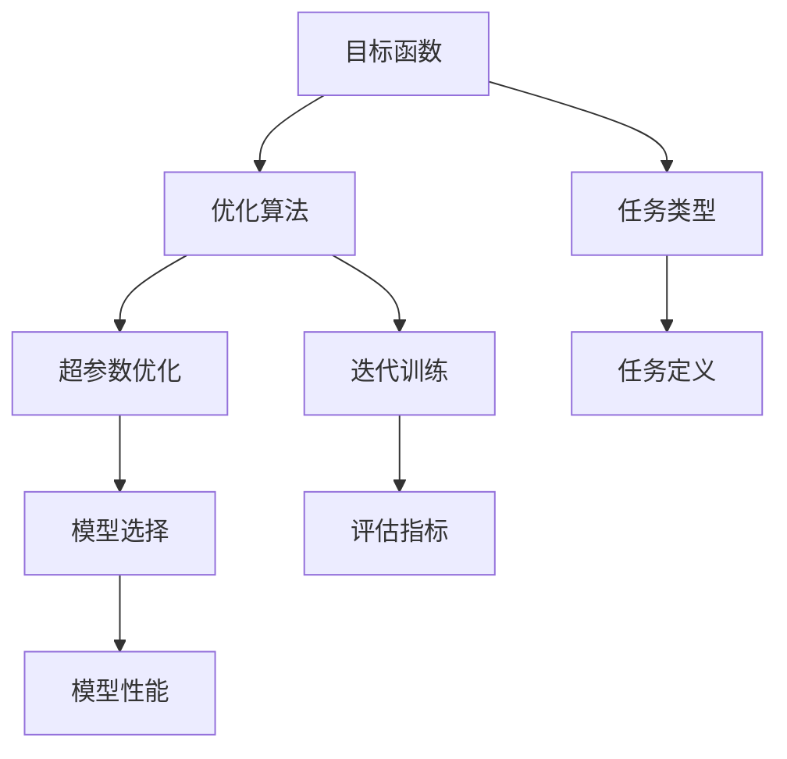

                 

# 明确目标函数:AI训练的关键

> 关键词：AI训练,目标函数,优化算法,超参数优化,自动机器学习,深度学习

## 1. 背景介绍

### 1.1 问题由来
在人工智能(AI)领域，模型的训练过程是通过优化目标函数实现的。目标函数描述了模型在特定任务上的性能评价，是衡量模型学习效果的依据。然而，目标函数的选择和设计往往是机器学习项目中最困难的部分之一，直接影响了模型的性能和训练效率。

当前，许多研究者和工程师在模型训练时，往往依赖于直觉和经验来选择目标函数，导致在实际应用中出现了诸多问题。目标函数设置不当，不仅可能无法有效地提升模型性能，还可能造成训练效率低下，甚至导致模型过拟合。因此，如何明确目标函数，使其更加科学、合理，成为了AI训练中亟待解决的问题。

### 1.2 问题核心关键点
本文聚焦于如何明确目标函数，以提升AI训练的效果和效率。具体来说，我们将重点探讨以下内容：
- 目标函数的定义和设计
- 优化算法在目标函数设计中的作用
- 目标函数优化中的超参数选择
- 自动化机器学习(AutoML)在目标函数优化中的应用
- 目标函数在深度学习中的具体应用

## 2. 核心概念与联系

### 2.1 核心概念概述

要明确目标函数，首先需要理解几个核心概念：

- 目标函数(Objective Function)：是评估模型在特定任务上性能的数学函数。目标函数的具体形式取决于任务类型，如分类、回归、生成等。
- 优化算法(Optimization Algorithm)：用于求解目标函数的最小值。常用的优化算法包括梯度下降、Adam、SGD等。
- 超参数(Hyperparameters)：在模型训练过程中需要手动设置的参数，如学习率、批次大小、迭代轮数等。
- 自动化机器学习(AutoML)：通过自动化的方法选择和优化超参数，以提升模型性能和训练效率。

这些概念之间存在紧密联系，通过合理设计目标函数和优化算法，并合理选择超参数，可以显著提升模型的训练效果和效率。接下来，我们将深入探讨这些概念之间的联系，并给出明确目标函数的策略。

### 2.2 核心概念原理和架构的 Mermaid 流程图(Mermaid 流程节点中不要有括号、逗号等特殊字符)



## 3. 核心算法原理 & 具体操作步骤

### 3.1 算法原理概述

目标函数的明确可以通过以下几个步骤实现：

1. **任务定义**：明确目标函数需要评估的任务类型，如分类、回归、生成等。
2. **任务定义**：根据任务类型选择合适的损失函数，如交叉熵损失、均方误差损失等。
3. **模型选择**：选择合适的预训练模型或新构建的模型，以满足任务的特定需求。
4. **超参数优化**：选择合适的超参数，如学习率、批次大小、迭代轮数等。
5. **优化算法选择**：选择合适的优化算法，如Adam、SGD等。
6. **迭代训练**：使用优化算法最小化目标函数，更新模型参数。
7. **模型评估**：在验证集上评估模型性能，调整目标函数和超参数。

### 3.2 算法步骤详解

#### 3.2.1 任务定义

目标函数的设计需要考虑具体的任务类型。以分类任务为例，目标函数通常是交叉熵损失函数：

$$
\mathcal{L}(y,\hat{y}) = -\sum_{i=1}^{N} y_i \log \hat{y}_i
$$

其中 $y$ 是真实标签向量，$\hat{y}$ 是模型预测的概率向量。

#### 3.2.2 任务定义

选择合适的损失函数后，需要将其应用到具体任务上。例如，对于二分类任务，可以采用二元交叉熵损失：

$$
\mathcal{L}(y,\hat{y}) = -(y\log \hat{y} + (1-y)\log (1-\hat{y}))
$$

#### 3.2.3 模型选择

选择合适的预训练模型或新构建的模型是目标函数设计的重要环节。以文本分类任务为例，可以使用BERT、GPT等预训练模型作为初始化参数。

#### 3.2.4 超参数优化

超参数的选择直接影响到模型训练的效果。通常，需要手动设置学习率、批次大小、迭代轮数等超参数。例如，对于学习率，通常建议从1e-5开始，逐步减小，直至收敛。

#### 3.2.5 优化算法选择

优化算法的选择也至关重要。常用的优化算法包括梯度下降、Adam、SGD等。在实际应用中，需要根据任务特点和数据分布选择合适的优化算法。

#### 3.2.6 迭代训练

使用优化算法最小化目标函数，更新模型参数。例如，对于梯度下降算法，每次迭代中需要计算目标函数的梯度，并根据梯度更新模型参数。

#### 3.2.7 模型评估

在验证集上评估模型性能，调整目标函数和超参数。例如，在二分类任务中，可以使用精确度、召回率、F1值等指标来评估模型性能。

### 3.3 算法优缺点

#### 3.3.1 优点

- 目标函数的明确使得模型训练更具科学性和合理性，避免了盲目依赖直觉和经验。
- 优化算法的选择和超参数的调整，可以显著提升模型的训练效率和效果。
- 目标函数的明确也有助于模型评估和调优，提升了模型的泛化性能。

#### 3.3.2 缺点

- 目标函数的设计需要深入理解任务特点和数据分布，对研究人员和工程师的要求较高。
- 超参数的选择和优化需要大量实验和调整，过程繁琐且耗时。
- 自动化机器学习的引入虽然可以部分缓解超参数优化的问题，但仍然需要大量的人工干预。

### 3.4 算法应用领域

目标函数在各个AI应用领域中都有广泛的应用，包括但不限于以下几个方面：

- 图像识别：使用交叉熵损失函数评估模型的分类性能。
- 自然语言处理：使用BLEU、ROUGE等评估模型的生成性能。
- 强化学习：使用奖励函数评估模型的决策性能。
- 推荐系统：使用点击率、平均评分等指标评估模型的推荐性能。

## 4. 数学模型和公式 & 详细讲解 & 举例说明

### 4.1 数学模型构建

目标函数的构建通常需要以下几个步骤：

1. **任务定义**：明确任务类型和评估指标。
2. **损失函数选择**：选择合适的损失函数。
3. **模型定义**：定义模型结构和参数。
4. **目标函数构建**：将损失函数应用到模型参数上。

### 4.2 公式推导过程

以二分类任务为例，推导交叉熵损失函数：

$$
\mathcal{L}(y,\hat{y}) = -\sum_{i=1}^{N} y_i \log \hat{y}_i
$$

其中 $y$ 是真实标签向量，$\hat{y}$ 是模型预测的概率向量。

### 4.3 案例分析与讲解

以文本分类任务为例，说明目标函数的设计和优化过程：

1. **任务定义**：文本分类任务的目标是将文本分类到不同的类别中。
2. **损失函数选择**：使用交叉熵损失函数。
3. **模型选择**：使用BERT等预训练模型作为初始化参数。
4. **超参数优化**：设置学习率为1e-5，批次大小为64，迭代轮数为100。
5. **优化算法选择**：使用Adam算法。
6. **迭代训练**：使用优化算法最小化交叉熵损失，更新BERT模型的参数。
7. **模型评估**：在验证集上评估模型性能，调整超参数和学习率。

## 5. 项目实践：代码实例和详细解释说明

### 5.1 开发环境搭建

在进行目标函数设计和优化实践前，我们需要准备好开发环境。以下是使用Python进行TensorFlow开发的环境配置流程：

1. 安装Anaconda：从官网下载并安装Anaconda，用于创建独立的Python环境。

2. 创建并激活虚拟环境：
```bash
conda create -n tf-env python=3.8 
conda activate tf-env
```

3. 安装TensorFlow：根据CUDA版本，从官网获取对应的安装命令。例如：
```bash
conda install tensorflow=2.6 -c tf
```

4. 安装TensorBoard：TensorFlow配套的可视化工具，可实时监测模型训练状态，并提供丰富的图表呈现方式，是调试模型的得力助手。

5. 安装Weights & Biases：模型训练的实验跟踪工具，可以记录和可视化模型训练过程中的各项指标，方便对比和调优。

完成上述步骤后，即可在`tf-env`环境中开始目标函数设计和优化实践。

### 5.2 源代码详细实现

下面是使用TensorFlow实现二分类目标函数设计和优化的代码实现：

```python
import tensorflow as tf
from tensorflow.keras.datasets import mnist
from tensorflow.keras.models import Sequential
from tensorflow.keras.layers import Dense, Dropout
from tensorflow.keras.optimizers import Adam
from tensorflow.keras.metrics import Accuracy

# 加载数据集
(x_train, y_train), (x_test, y_test) = mnist.load_data()

# 数据预处理
x_train = x_train.reshape(-1, 28*28) / 255.0
x_test = x_test.reshape(-1, 28*28) / 255.0
y_train = tf.keras.utils.to_categorical(y_train, num_classes=10)
y_test = tf.keras.utils.to_categorical(y_test, num_classes=10)

# 定义模型
model = Sequential()
model.add(Dense(256, activation='relu', input_shape=(28*28,)))
model.add(Dropout(0.4))
model.add(Dense(10, activation='softmax'))

# 编译模型
model.compile(loss='categorical_crossentropy', optimizer=Adam(learning_rate=1e-4), metrics=[Accuracy()])

# 训练模型
model.fit(x_train, y_train, batch_size=64, epochs=10, validation_data=(x_test, y_test))

# 评估模型
loss, acc = model.evaluate(x_test, y_test)
print(f'Test loss: {loss:.4f}')
print(f'Test accuracy: {acc:.4f}')
```

### 5.3 代码解读与分析

让我们再详细解读一下关键代码的实现细节：

**模型定义**：
- `Sequential`：定义线性堆叠的神经网络模型。
- `Dense`：定义全连接层，其中256个神经元使用ReLU激活函数。
- `Dropout`：随机丢弃部分神经元，防止过拟合。
- `softmax`：输出层使用softmax激活函数，适合多分类任务。

**模型编译**：
- `compile`：编译模型，设置损失函数、优化器和评估指标。

**模型训练**：
- `fit`：使用优化器Adam和交叉熵损失函数训练模型，设置批次大小和迭代轮数。

**模型评估**：
- `evaluate`：在测试集上评估模型性能，输出损失和准确率。

可以看到，通过TensorFlow的高级API，目标函数设计和优化过程变得非常简单高效。开发者可以将更多精力放在模型选择和超参数调整上，而不必过多关注底层实现细节。

## 6. 实际应用场景

### 6.1 图像识别

目标函数在图像识别任务中得到了广泛应用。以卷积神经网络(CNN)为例，常用的损失函数包括交叉熵损失、均方误差损失等。目标函数设计和优化过程如下：

1. **任务定义**：图像分类任务的目标是将图像分类到不同的类别中。
2. **损失函数选择**：使用交叉熵损失函数。
3. **模型选择**：使用卷积神经网络(CNN)作为初始化参数。
4. **超参数优化**：设置学习率为1e-3，批次大小为32，迭代轮数为100。
5. **优化算法选择**：使用Adam算法。
6. **迭代训练**：使用优化算法最小化交叉熵损失，更新CNN模型的参数。
7. **模型评估**：在验证集上评估模型性能，调整超参数和学习率。

### 6.2 自然语言处理

目标函数在自然语言处理(NLP)任务中也同样适用。以文本分类任务为例，常用的损失函数包括交叉熵损失、分类误差等。目标函数设计和优化过程如下：

1. **任务定义**：文本分类任务的目标是将文本分类到不同的类别中。
2. **损失函数选择**：使用交叉熵损失函数。
3. **模型选择**：使用BERT、GPT等预训练模型作为初始化参数。
4. **超参数优化**：设置学习率为1e-5，批次大小为64，迭代轮数为100。
5. **优化算法选择**：使用Adam算法。
6. **迭代训练**：使用优化算法最小化交叉熵损失，更新BERT模型的参数。
7. **模型评估**：在验证集上评估模型性能，调整超参数和学习率。

### 6.3 推荐系统

目标函数在推荐系统中的应用也非常广泛。以协同过滤推荐系统为例，常用的损失函数包括均方误差损失、平方误差损失等。目标函数设计和优化过程如下：

1. **任务定义**：推荐系统任务的目标是预测用户对物品的评分。
2. **损失函数选择**：使用均方误差损失函数。
3. **模型选择**：使用矩阵分解算法作为初始化参数。
4. **超参数优化**：设置学习率为1e-4，批次大小为64，迭代轮数为100。
5. **优化算法选择**：使用Adam算法。
6. **迭代训练**：使用优化算法最小化均方误差损失，更新矩阵分解模型的参数。
7. **模型评估**：在验证集上评估模型性能，调整超参数和学习率。

### 6.4 未来应用展望

随着目标函数设计和优化方法的不断进步，目标函数在AI训练中的应用将会更加广泛和深入。未来，我们可以预见以下发展趋势：

1. **目标函数自动化**：随着AutoML技术的发展，目标函数的自动化设计和优化将成为可能，进一步降低人工干预的成本。
2. **多目标优化**：未来的目标函数设计可能包含多个优化目标，如准确率、召回率、泛化性能等，以适应复杂的多任务场景。
3. **分布式优化**：随着大规模数据集和模型的出现，分布式优化算法将成为必要，以提升训练效率。
4. **自适应优化**：未来的优化算法可能具有自适应性，能够根据数据分布和模型性能动态调整超参数。

这些发展趋势将进一步提升目标函数在AI训练中的地位，使得目标函数设计和优化成为机器学习项目成功的关键。

## 7. 工具和资源推荐

### 7.1 学习资源推荐

为了帮助开发者系统掌握目标函数设计和优化的方法，这里推荐一些优质的学习资源：

1. 《深度学习》（Ian Goodfellow等著）：全面介绍了深度学习的基本原理和优化算法。
2. 《Python机器学习》（Sebastian Raschka等著）：介绍了Python在机器学习中的应用，包括目标函数设计和优化。
3. 《TensorFlow实战Google深度学习框架》（Manning出版社）：介绍了TensorFlow的使用方法，包括目标函数设计和优化。
4. 《PyTorch深度学习实战》（O'Reilly出版社）：介绍了PyTorch的使用方法，包括目标函数设计和优化。
5. 《AutoML：自动化机器学习》（O'Reilly出版社）：介绍了AutoML技术的应用，包括目标函数自动设计和优化。

通过对这些资源的学习实践，相信你一定能够快速掌握目标函数设计和优化的精髓，并用于解决实际的AI训练问题。

### 7.2 开发工具推荐

高效的开发离不开优秀的工具支持。以下是几款用于目标函数设计和优化的常用工具：

1. TensorFlow：基于Python的开源深度学习框架，灵活动态的计算图，适合快速迭代研究。
2. PyTorch：基于Python的开源深度学习框架，动态计算图，适合灵活实验和生产部署。
3. Keras：高级深度学习API，提供了简单易用的API，适合快速原型设计和实验。
4. XGBoost：基于决策树的梯度提升算法，适合处理大规模数据集和特征工程。
5. Scikit-learn：Python科学计算库，提供了丰富的机器学习算法和工具。

合理利用这些工具，可以显著提升目标函数设计和优化的效率，加快创新迭代的步伐。

### 7.3 相关论文推荐

目标函数设计和优化是一个长期研究的热点领域。以下是几篇奠基性的相关论文，推荐阅读：

1. "A Review of Gradient Descent Optimization Algorithms"（梯度下降优化算法综述）：综述了各种梯度下降优化算法，提供了选择优化算法的理论基础。
2. "A Survey of Deep Learning for Recommendation Systems"（深度学习推荐系统的综述）：综述了深度学习在推荐系统中的应用，包括目标函数设计和优化。
3. "Deep Learning for Natural Language Processing: A Survey"（深度学习在自然语言处理中的应用综述）：综述了深度学习在自然语言处理中的应用，包括目标函数设计和优化。
4. "A Survey of AutoML: Towards Automating Machine Learning"（自动化机器学习的综述）：综述了自动化机器学习的研究进展，包括目标函数自动设计和优化。
5. "Neural Architecture Search with Reinforcement Learning"（强化学习在神经网络架构搜索中的应用）：介绍了通过强化学习自动设计目标函数的方法。

这些论文代表了目标函数设计和优化领域的研究前沿，可以帮助研究者把握学科前进方向，激发更多的创新灵感。

## 8. 总结：未来发展趋势与挑战

### 8.1 总结

本文对目标函数的设计和优化方法进行了全面系统的介绍。首先阐述了目标函数在设计AI训练中的重要性，明确了目标函数设计和优化对模型性能和效率的关键影响。其次，从原理到实践，详细讲解了目标函数的设计和优化方法，给出了完整的代码实现和详细解读。同时，本文还广泛探讨了目标函数在图像识别、自然语言处理、推荐系统等多个AI应用领域的应用前景，展示了目标函数设计的广泛应用。

通过本文的系统梳理，可以看到，目标函数设计和优化技术在AI训练中具有重要的地位。目标函数的明确使得模型训练更具科学性和合理性，优化算法的选择和超参数的调整，可以显著提升模型的训练效率和效果。未来，随着目标函数自动设计和优化方法的发展，目标函数设计将更加高效和智能化，进一步推动AI训练技术的发展。

### 8.2 未来发展趋势

展望未来，目标函数设计和优化技术将呈现以下几个发展趋势：

1. **目标函数自动化**：随着AutoML技术的发展，目标函数的自动化设计和优化将成为可能，进一步降低人工干预的成本。
2. **多目标优化**：未来的目标函数设计可能包含多个优化目标，如准确率、召回率、泛化性能等，以适应复杂的多任务场景。
3. **分布式优化**：随着大规模数据集和模型的出现，分布式优化算法将成为必要，以提升训练效率。
4. **自适应优化**：未来的优化算法可能具有自适应性，能够根据数据分布和模型性能动态调整超参数。
5. **目标函数优化算法**：随着新算法的不断涌现，目标函数的优化算法将更加高效和智能化，进一步提升模型训练的效率和效果。

以上趋势凸显了目标函数设计和优化技术的广阔前景。这些方向的探索发展，必将进一步提升目标函数在AI训练中的地位，使得目标函数设计和优化成为机器学习项目成功的关键。

### 8.3 面临的挑战

尽管目标函数设计和优化技术已经取得了不少进展，但在迈向更加智能化、普适化应用的过程中，它仍面临诸多挑战：

1. **目标函数选择困难**：不同的任务类型和数据分布需要不同的目标函数，选择合适的目标函数需要深入理解任务特点和数据分布。
2. **超参数选择复杂**：超参数的选择和优化需要大量实验和调整，过程繁琐且耗时。
3. **模型复杂性增加**：随着目标函数的复杂性增加，模型的训练和优化变得更加困难。
4. **数据多样性问题**：不同领域和数据类型对目标函数的要求不同，如何统一处理多源数据成为一大难题。
5. **自动化程度不足**：尽管AutoML技术逐渐成熟，但目标函数的自动化设计和优化仍然需要大量人工干预。

正视目标函数设计和优化面临的这些挑战，积极应对并寻求突破，将是大语言模型微调走向成熟的必由之路。相信随着学界和产业界的共同努力，这些挑战终将一一被克服，目标函数设计必将在构建人机协同的智能时代中扮演越来越重要的角色。

### 8.4 研究展望

面对目标函数设计和优化所面临的种种挑战，未来的研究需要在以下几个方面寻求新的突破：

1. **目标函数自动化**：探索更加高效的目标函数自动化设计方法，减少人工干预。
2. **多目标优化**：研究多目标优化算法，提高模型在多任务场景下的性能。
3. **分布式优化**：研究分布式优化算法，提升大规模数据集和模型的训练效率。
4. **自适应优化**：研究自适应优化算法，提高模型的鲁棒性和泛化性能。
5. **目标函数优化算法**：探索更加高效的目标函数优化算法，提升模型训练的效率和效果。

这些研究方向的探索，必将引领目标函数设计和优化技术迈向更高的台阶，为构建安全、可靠、可解释、可控的智能系统铺平道路。面向未来，目标函数设计和优化技术还需要与其他人工智能技术进行更深入的融合，如知识表示、因果推理、强化学习等，多路径协同发力，共同推动自然语言理解和智能交互系统的进步。只有勇于创新、敢于突破，才能不断拓展目标函数设计的边界，让智能技术更好地造福人类社会。

## 9. 附录：常见问题与解答

**Q1：如何选择合适目标函数？**

A: 选择合适的目标函数需要深入理解任务特点和数据分布。一般可以从以下几个方面考虑：
1. **任务类型**：根据任务类型选择合适的损失函数。例如，分类任务可以选择交叉熵损失函数，回归任务可以选择均方误差损失函数。
2. **数据分布**：根据数据分布选择合适的损失函数。例如，数据分布不平衡的任务，可以选择Focal Loss等鲁棒性强的损失函数。
3. **模型复杂性**：根据模型复杂性选择合适的损失函数。例如，复杂的模型可能需要更复杂的损失函数，以避免过拟合。
4. **模型表现**：根据模型在验证集上的表现选择损失函数。例如，如果模型表现不佳，可能需要调整损失函数或进行超参数优化。

**Q2：如何设置合适的超参数？**

A: 超参数的选择需要根据具体任务和数据分布进行实验和调整。一般可以从以下几个方面考虑：
1. **学习率**：学习率通常从0.001开始，逐步减小，直至收敛。可以采用warmup策略，在开始阶段使用较小的学习率，再逐渐过渡到预设值。
2. **批次大小**：批次大小通常从16开始，逐步增大，直至模型收敛。可以根据内存大小和模型复杂度进行调整。
3. **迭代轮数**：迭代轮数通常从10开始，逐步增加，直至模型收敛。可以根据验证集性能进行调整。
4. **正则化系数**：正则化系数通常从0.01开始，逐步减小，直至模型收敛。可以采用L2正则、Dropout等方法进行正则化。

**Q3：如何处理大规模数据集？**

A: 处理大规模数据集需要采用分布式训练和数据增强等方法。具体可以从以下几个方面考虑：
1. **分布式训练**：使用分布式训练算法，如TPU、GPU集群等，提升训练效率。
2. **数据增强**：通过数据增强技术，如数据扰动、随机裁剪等，扩充训练集大小，提高模型泛化性能。
3. **模型裁剪**：使用模型裁剪技术，减少模型的参数量和计算量，提升训练速度。
4. **量化加速**：使用量化技术，将浮点模型转换为定点模型，减少内存占用和计算开销。

**Q4：如何提升模型泛化性能？**

A: 提升模型泛化性能需要从以下几个方面进行考虑：
1. **数据增强**：通过数据增强技术，扩充训练集大小，提高模型泛化性能。
2. **正则化**：采用L2正则、Dropout等正则化技术，防止过拟合，提高模型泛化性能。
3. **早停**：采用早停技术，防止过拟合，提高模型泛化性能。
4. **对抗训练**：采用对抗训练技术，提高模型鲁棒性，提升泛化性能。
5. **迁移学习**：通过迁移学习技术，利用预训练模型学到的知识，提升模型泛化性能。

**Q5：如何选择优化算法？**

A: 选择优化算法需要根据任务类型和数据分布进行综合考虑。一般可以从以下几个方面考虑：
1. **任务类型**：根据任务类型选择合适的优化算法。例如，分类任务可以使用Adam算法，回归任务可以使用SGD算法。
2. **数据分布**：根据数据分布选择合适的优化算法。例如，数据分布不平衡的任务，可以使用FTRL算法等鲁棒性强的优化算法。
3. **模型复杂性**：根据模型复杂性选择合适的优化算法。例如，复杂的模型可能需要更复杂的优化算法，以避免过拟合。
4. **计算资源**：根据计算资源选择合适的优化算法。例如，GPU集群可以使用Adam算法，CPU集群可以使用SGD算法。

通过这些问题的解答，相信你一定能够更好地理解和应用目标函数设计和优化的方法，提升AI训练的效果和效率。

