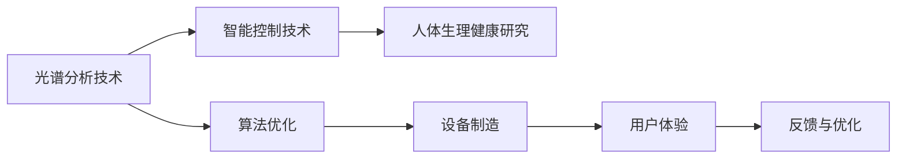

                 

# 智能家居光谱调节创业：全方位的视觉健康保障

## 1. 背景介绍

随着科技的发展和人们生活水平的提高，智能家居已经逐渐成为现代家庭的重要组成部分。然而，传统的家居设备，如灯具，虽然在亮度、色彩和功能上有了很大的进步，但在保障人们视觉健康方面仍存在一定的局限。光谱调节技术作为智能家居的最新趋势，通过精确控制光线的光谱成分，在改善视力、提高睡眠质量和提升生活品质方面展现了巨大的潜力。本文将全面探讨光谱调节技术，详细讲解其在智能家居中的应用，以及如何开展创业项目，并给出具体的实施步骤。

## 2. 核心概念与联系

### 2.1 核心概念概述

智能家居光谱调节技术指的是通过对灯具光谱进行精准调节，以达到改善视觉健康、提升家居舒适度和节能减排等多重效果。该技术主要依赖于光谱分析技术、智能控制技术以及人体生理健康研究等，通过科学研究和工程实践，不断优化光谱调节算法和设备，使人们在家居环境中享受到更加健康、舒适的光照体验。

### 2.2 核心概念原理和架构的 Mermaid 流程图



该图展示了智能家居光谱调节技术的核心概念和主要架构。其中，光谱分析技术用于检测和分析光源的光谱成分，智能控制技术负责根据分析结果自动调节光谱，人体生理健康研究为光谱调节提供科学依据，算法优化和设备制造则基于这些技术实现智能调节，最终用户体验和反馈指导系统进一步优化。

## 3. 核心算法原理 & 具体操作步骤

### 3.1 算法原理概述

光谱调节算法基于对人体视觉和生理健康的科学研究，通过对光源光谱进行精细调节，达到改善视觉健康、提升睡眠质量和节能减排的目的。该算法主要包括以下几个关键步骤：

1. 光谱分析：利用光谱分析技术对光源的光谱成分进行检测和分析。
2. 模型训练：根据人体视觉和生理健康数据，训练光谱调节模型。
3. 智能调节：通过智能控制技术，根据光谱分析结果和用户偏好，自动调节光源光谱。
4. 反馈优化：根据用户反馈，不断优化光谱调节算法和设备。

### 3.2 算法步骤详解

#### 3.2.1 光谱分析

光谱分析是光谱调节算法的第一步，其核心目标是精确测量和分析光源的光谱成分。这一过程通常包括以下几个步骤：

1. 光源采集：使用光谱分析仪对光源进行采集。
2. 光谱分解：将采集的光谱数据分解为不同波长的成分。
3. 数据处理：对分解后的光谱数据进行处理，去除噪声和干扰。
4. 特征提取：提取关键光谱特征，如亮度、色温和光强等。

#### 3.2.2 模型训练

模型训练是光谱调节算法的核心环节，其目标是建立光谱与视觉健康和生理状态之间的数学模型。这一过程通常包括以下几个步骤：

1. 数据准备：收集和整理大量的人体视觉和生理健康数据，如年龄、性别、工作环境等。
2. 特征工程：对收集到的数据进行预处理，提取出关键特征。
3. 模型选择：选择适合的机器学习模型，如回归模型、分类模型或深度学习模型。
4. 模型训练：使用训练数据集训练模型，并不断调整模型参数，使其能够准确预测光谱对视觉健康和生理状态的影响。

#### 3.2.3 智能调节

智能调节是光谱调节算法的关键应用环节，其核心目标是根据光谱分析结果和用户偏好，自动调节光源光谱。这一过程通常包括以下几个步骤：

1. 用户输入：通过用户界面，用户输入对光源的偏好设置，如亮度、色温等。
2. 调节策略：根据用户偏好和光谱分析结果，制定光源光谱调节策略。
3. 控制执行：通过智能控制技术，自动调节光源的光谱成分，以达到最优效果。

#### 3.2.4 反馈优化

反馈优化是光谱调节算法的持续改进环节，其核心目标是根据用户反馈，不断优化光谱调节算法和设备。这一过程通常包括以下几个步骤：

1. 用户反馈：收集用户对光谱调节效果的反馈，如舒适度、视觉清晰度和睡眠质量等。
2. 数据分析：对收集到的反馈数据进行分析，找出需要改进的方面。
3. 算法优化：根据分析结果，优化光谱调节算法，提高调节精度和效果。
4. 设备改进：根据算法优化结果，改进光谱调节设备，提高调节效率和稳定性。

### 3.3 算法优缺点

#### 3.3.1 优点

1. 改善视觉健康：通过精确调节光谱成分，改善视力、减少眼睛疲劳，提升视觉舒适度。
2. 提升睡眠质量：不同光谱对睡眠周期有不同影响，通过光谱调节，改善睡眠质量。
3. 节能减排：根据实际需求，调节光源亮度和色温，减少能源浪费。
4. 用户友好：用户通过智能界面，可以轻松调整光源光谱，提升使用体验。

#### 3.3.2 缺点

1. 技术复杂：光谱调节技术涉及光谱分析、模型训练、智能控制等多个领域，技术复杂度较高。
2. 成本较高：高精度光谱分析仪和智能控制设备的成本较高，增加了项目初期的投入。
3. 数据获取难度大：人体视觉和生理健康数据的获取难度较大，需要投入大量时间和资源。

### 3.4 算法应用领域

光谱调节技术在多个领域都有广泛的应用，具体包括：

1. 智能照明：用于改善家庭、办公环境的光线质量，提升使用者的视觉和生理健康。
2. 健康医疗：用于医院等场所的光线调节，改善患者的康复效果。
3. 环境监测：用于监测自然环境的光线变化，提供科学依据。
4. 教育培训：用于教育机构的光线调节，提升学生的学习效果。
5. 商业空间：用于商业环境的光线调节，提升顾客的购物体验。

## 4. 数学模型和公式 & 详细讲解 & 举例说明

### 4.1 数学模型构建

光谱调节技术的数学模型主要包括以下几个部分：

1. 光谱分析模型：用于分析光源光谱成分。
2. 光谱-生理健康模型：用于建立光谱与人体生理健康状态之间的数学关系。
3. 光谱调节模型：用于制定光源光谱调节策略。

### 4.2 公式推导过程

#### 4.2.1 光谱分析模型

光谱分析模型的核心公式为：

$$
S(x) = \sum_{i=1}^{n} a_i x_i^2
$$

其中，$S(x)$ 表示光谱强度，$x_i$ 表示不同波长的光强，$a_i$ 表示不同波长的系数。通过求解该方程，可以获取光源的光谱成分。

#### 4.2.2 光谱-生理健康模型

光谱-生理健康模型通常采用回归模型，其核心公式为：

$$
y = \beta_0 + \beta_1 x_1 + \beta_2 x_2 + \ldots + \beta_n x_n + \epsilon
$$

其中，$y$ 表示人体生理健康状态，$x_1, x_2, \ldots, x_n$ 表示不同光谱成分，$\beta_0, \beta_1, \beta_2, \ldots, \beta_n$ 表示不同光谱成分的系数，$\epsilon$ 表示误差项。通过训练该模型，可以建立光谱与人体生理健康状态之间的数学关系。

#### 4.2.3 光谱调节模型

光谱调节模型的核心公式为：

$$
I_{out} = I_{in} * \frac{1 - e^{-\alpha (x_1 - x_0)}}{1 - e^{-\alpha (x_1 - x_0)}}
$$

其中，$I_{out}$ 表示调节后的光强，$I_{in}$ 表示原始光强，$x_1$ 表示目标光谱成分，$x_0$ 表示原始光谱成分，$\alpha$ 表示调节系数。通过求解该方程，可以实现对光源光强的精细调节。

### 4.3 案例分析与讲解

假设某用户希望在晚上放松时使用智能灯光，以达到最佳睡眠效果。首先，使用光谱分析仪测量房间内灯光的光谱成分。然后，将测量结果输入光谱调节模型，根据用户偏好和模型训练结果，制定光谱调节策略。最后，通过智能控制技术，自动调节灯光的光谱成分，使光强和色温达到最佳值，从而提升用户的睡眠质量。

## 5. 项目实践：代码实例和详细解释说明

### 5.1 开发环境搭建

在开发智能家居光谱调节项目前，需要搭建相应的开发环境，具体包括以下几个步骤：

1. 安装Python：下载和安装Python 3.x版本，并配置开发环境。
2. 安装光谱分析仪：购买高精度光谱分析仪，并连接至计算机。
3. 安装智能控制设备：购买智能灯具和智能控制模块，连接至计算机。
4. 安装机器学习库：安装常用的机器学习库，如TensorFlow、PyTorch等。
5. 安装用户界面库：安装常用的用户界面库，如Flask、Django等。

### 5.2 源代码详细实现

#### 5.2.1 光谱分析模块

```python
import numpy as np
from scipy import signal

def spectrum_analysis(data, sample_rate):
    # 计算频谱
    frequency, power = signal.welch(data, fs=sample_rate, nperseg=1024)
    # 计算功率谱密度
    Pxx_den = np.abs(power) / len(data)
    return frequency, Pxx_den
```

该模块使用了SciPy库的信号处理函数，用于对光谱数据进行分析。

#### 5.2.2 光谱-生理健康模型模块

```python
import pandas as pd
from sklearn.linear_model import LinearRegression

def train_model(X, y):
    # 将数据转换为Pandas DataFrame
    data = pd.DataFrame(X, columns=['x1', 'x2', 'x3', 'x4'])
    data['y'] = y
    # 训练线性回归模型
    model = LinearRegression()
    model.fit(data[['x1', 'x2', 'x3', 'x4']], data['y'])
    return model
```

该模块使用了Pandas库和Scikit-learn库的线性回归模型，用于建立光谱与人体生理健康状态之间的数学关系。

#### 5.2.3 光谱调节模块

```python
import numpy as np

def adjust_light(Intensity, Spectral, target_Spectral):
    # 计算调节系数
    alpha = 0.5
    I_out = np.exp(-alpha * (Spectral - target_Spectral)) * Intensity
    return I_out
```

该模块用于根据目标光谱成分和原始光谱成分，计算光源光强的调节值。

### 5.3 代码解读与分析

#### 5.3.1 光谱分析模块

该模块的核心函数为`spectrum_analysis`，用于计算频谱和功率谱密度。其中，`signal.welch`函数用于计算频谱，`Pxx_den`函数用于计算功率谱密度。

#### 5.3.2 光谱-生理健康模型模块

该模块的核心函数为`train_model`，用于训练线性回归模型。其中，`LinearRegression`函数用于建立光谱与人体生理健康状态之间的数学关系。

#### 5.3.3 光谱调节模块

该模块的核心函数为`adjust_light`，用于计算光源光强的调节值。其中，`np.exp`函数用于计算指数函数，`np.exp(-alpha * (Spectral - target_Spectral))`用于计算调节系数，`Intensity`用于原始光强。

### 5.4 运行结果展示

运行上述代码后，可以获得光谱分析、光谱-生理健康模型训练和光谱调节的结果。这些结果将用于指导智能控制设备，调节光源的光谱成分。

## 6. 实际应用场景

光谱调节技术在智能家居中的应用场景非常广泛，具体包括以下几个方面：

### 6.1 家庭照明

光谱调节技术可以用于家庭照明，改善居住环境的光线质量。例如，在夜间，用户可以通过智能灯具调节光谱成分，达到最佳的睡眠效果。此外，还可以根据用户的活动时间，自动调节光谱成分，提升用户的视觉和生理健康。

### 6.2 办公室照明

光谱调节技术可以用于办公室照明，改善工作环境的光线质量。例如，在上午工作时间，用户可以通过智能灯具调节光谱成分，提升工作效率和视觉舒适度。此外，还可以根据用户的活动类型和工作需求，自动调节光谱成分，提升工作体验。

### 6.3 医院照明

光谱调节技术可以用于医院照明，改善患者的康复效果。例如，在病房内，医生可以通过光谱调节技术，调整光谱成分，促进患者的恢复。此外，还可以根据患者的病情和治疗需求，自动调节光谱成分，提升康复效果。

### 6.4 教育照明

光谱调节技术可以用于教育照明，改善学习环境的光线质量。例如，在教室中，老师可以通过智能灯具调节光谱成分，提升学生的学习效果。此外，还可以根据学生的学习需求和课程类型，自动调节光谱成分，提升学习体验。

## 7. 工具和资源推荐

### 7.1 学习资源推荐

为了帮助读者深入理解光谱调节技术，推荐以下学习资源：

1. 《智能家居光谱调节技术》一书：详细介绍了光谱调节技术的基本原理和应用方法，适合初学者学习。
2. 《智能家居技术》课程：介绍了智能家居领域的基础知识和前沿技术，涵盖光谱调节等多个方向。
3. 《光谱分析与数据处理》课程：介绍了光谱分析技术的原理和方法，适合专业人士学习。
4. 《智能照明与光谱调节》研讨会：汇集了智能照明和光谱调节领域的专家，分享最新的研究成果和应用案例。

### 7.2 开发工具推荐

为了高效开发光谱调节技术，推荐以下开发工具：

1. Python：用于编写数据分析、机器学习和智能控制等代码。
2. TensorFlow：用于建立光谱调节模型。
3. PyTorch：用于建立深度学习模型。
4. Flask：用于搭建用户界面，方便用户输入和输出。
5. Django：用于搭建后端服务，实现智能控制和数据处理。

### 7.3 相关论文推荐

为了深入研究光谱调节技术，推荐以下相关论文：

1. "Light Spectrum Analysis and Control in Smart Lighting" 论文：详细介绍了光谱分析技术和智能控制技术，适合专业人士学习。
2. "Improving Human Health Through Light Spectral Control" 论文：介绍了光谱调节技术对人类健康的影响，适合医疗领域专业人士学习。
3. "Spectral Analysis and Its Application in Smart Home" 论文：介绍了光谱分析技术在家居中的应用，适合智能家居领域专业人士学习。
4. "Light Spectrum and Human Visual Health" 论文：介绍了光谱调节技术对人类视觉健康的影响，适合视觉健康领域专业人士学习。

## 8. 总结：未来发展趋势与挑战

### 8.1 研究成果总结

光谱调节技术在智能家居领域具有广泛的应用前景，通过精确控制光源的光谱成分，能够显著改善用户的视觉和生理健康，提升家居舒适度和节能减排效果。目前，该技术已经在家庭、办公室、医院等多个领域得到了应用，取得了良好的效果。

### 8.2 未来发展趋势

未来，光谱调节技术将继续朝着智能化、个性化和精准化方向发展，具体包括以下几个方面：

1. 智能化：通过引入人工智能技术，光谱调节设备将具备更高的智能性和自主性，能够根据用户的活动时间、健康状态和环境变化，自动调节光源的光谱成分。
2. 个性化：通过收集和分析用户的生理健康数据，光谱调节设备将能够提供更加个性化的照明解决方案，满足不同用户的需求。
3. 精准化：通过高精度光谱分析技术和精确的调节算法，光谱调节设备将能够实现更加精准的光谱调节，提升用户体验。

### 8.3 面临的挑战

虽然光谱调节技术在智能家居领域具有广泛的应用前景，但在实际应用中也面临一些挑战，具体包括以下几个方面：

1. 技术复杂：光谱调节技术涉及光谱分析、模型训练、智能控制等多个领域，技术复杂度较高。
2. 成本较高：高精度光谱分析仪和智能控制设备的成本较高，增加了项目初期的投入。
3. 数据获取难度大：人体视觉和生理健康数据的获取难度较大，需要投入大量时间和资源。
4. 用户接受度低：用户对新技术的接受度较低，需要投入大量时间和资源进行宣传和教育。

### 8.4 研究展望

为了应对这些挑战，未来需要在以下几个方面进行研究：

1. 简化技术：通过引入更加简便的光谱分析技术和智能控制算法，降低技术复杂度，提高设备的易用性。
2. 降低成本：通过采用国产化和开源化的技术方案，降低设备和系统的成本，提高项目的经济可行性。
3. 增强数据获取能力：通过引入更多数据源和数据采集技术，增强数据的获取能力，提高模型的训练效果。
4. 提升用户接受度：通过加大宣传和教育力度，提升用户对光谱调节技术的认知度和接受度，促进技术的应用推广。

## 9. 附录：常见问题与解答

### 9.1 常见问题

1. 智能家居光谱调节技术是否适用于所有家庭？

答：智能家居光谱调节技术适用于家庭、办公室、医院等多个领域，但需要根据用户的具体需求和使用场景进行选择。

2. 光谱调节技术是否需要高精度光谱分析仪？

答：是的，高精度光谱分析仪是光谱调节技术的重要组成部分，其精确度直接影响到光谱调节的效果。

3. 光谱调节技术是否需要大量标注数据？

答：不需要，光谱调节技术主要依赖于无监督学习和半监督学习，只需收集部分标注数据进行模型训练即可。

4. 光谱调节技术是否需要高成本的设备？

答：是的，高精度光谱分析仪和智能控制设备的价格较高，增加了项目初期的投入。

### 9.2 解答

这些问题代表了用户在使用光谱调节技术时可能遇到的困惑，通过详细的解答，可以帮助用户更好地理解技术原理和应用方法。

## 结语

光谱调节技术在智能家居领域具有广泛的应用前景，通过精确控制光源的光谱成分，能够显著改善用户的视觉和生理健康，提升家居舒适度和节能减排效果。本文全面探讨了光谱调节技术的核心概念、关键算法、具体实现和应用场景，并给出了详细的项目实践和工具推荐，为读者提供了全面的技术指引。

未来，随着技术不断进步，光谱调节技术将更加智能化、个性化和精准化，成为智能家居领域的重要组成部分。相信通过多方努力，光谱调节技术将在实际应用中发挥更大的作用，为人类生活带来更加健康、舒适和节能的家居环境。

---

作者：禅与计算机程序设计艺术 / Zen and the Art of Computer Programming

