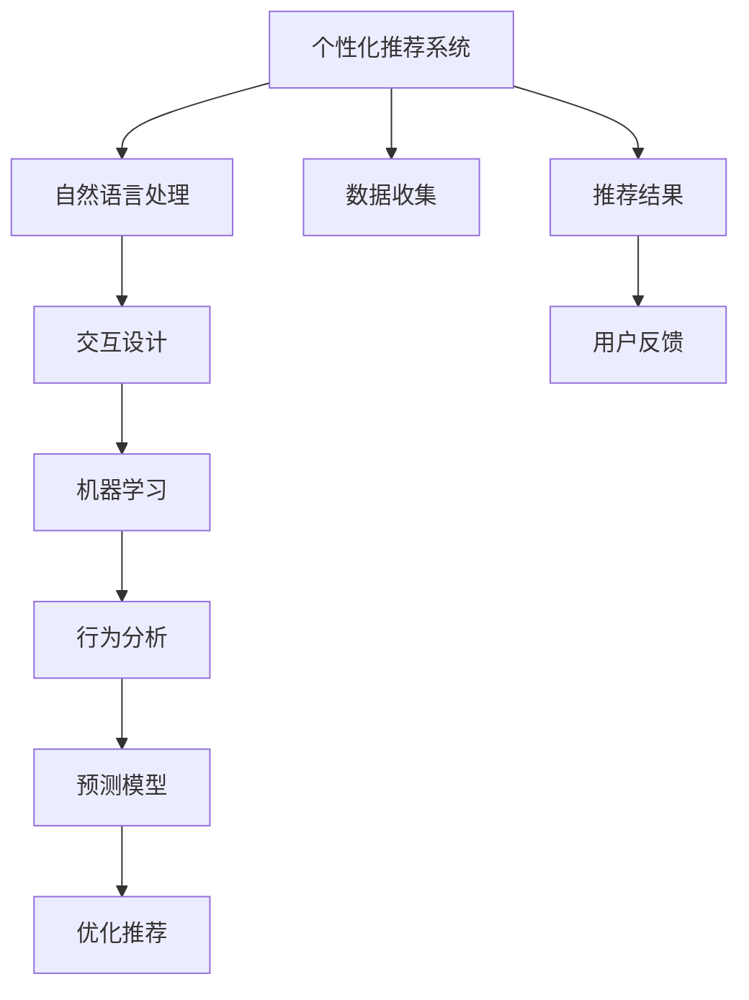

                 

# 智能导购：AI驱动虚拟导购助手

> 关键词：智能导购,虚拟助手,人工智能,自然语言处理,推荐系统,交互设计

## 1. 背景介绍

### 1.1 问题由来
随着电子商务的迅猛发展，客户在线购物的体验日益成为商家竞争的关键。然而，当前在线购物体验往往缺乏个性化的服务，导致高流量平台也难以满足所有用户的个性化需求。

为解决这一问题，AI驱动的虚拟导购助手应运而生。这种智能导购系统能够根据用户的个性化偏好、历史记录和实时行为数据，提供定制化的购物建议和导购服务，显著提升用户体验和商家转化率。

### 1.2 问题核心关键点
虚拟导购助手系统通过人工智能和大数据技术，实现个性化推荐、实时问答、行为分析等功能，优化用户体验，提升购物效率。关键技术点包括：

- 个性化推荐系统：利用机器学习算法分析用户历史行为和兴趣，实时生成个性化推荐。
- 自然语言处理(NLP)：实现智能问答和实时交互，理解用户需求并提供及时反馈。
- 行为分析与预测：通过分析用户行为数据，预测用户购买意向，优化推荐策略。

## 2. 核心概念与联系

### 2.1 核心概念概述

为更好地理解虚拟导购助手系统的构建过程，本节将介绍几个密切相关的核心概念：

- 个性化推荐系统(Recommendation System)：通过分析用户历史行为和兴趣，生成个性化推荐，如协同过滤、基于内容的推荐、深度学习推荐等。
- 自然语言处理(NLP)：实现机器与用户之间的自然语言交互，包括语言理解、生成、问答、翻译等。
- 交互设计(Interaction Design)：设计用户与系统交互的方式和界面，提升用户体验。
- 机器学习(ML)：利用算法和数据训练模型，以提升系统的智能决策能力。

这些核心概念之间的逻辑关系可以通过以下Mermaid流程图来展示：



这个流程图展示了这个系统的核心组件及其之间的关系：

1. 个性化推荐系统从数据收集组件获取用户历史数据和实时行为数据。
2. 自然语言处理组件与用户交互，理解用户需求，并回答用户问题。
3. 交互设计组件设计系统界面和交互流程，提升用户体验。
4. 机器学习组件对用户数据和行为进行分析和建模，训练预测模型，提升推荐系统性能。
5. 行为分析组件通过分析用户行为数据，预测用户购买意向。
6. 预测模型基于行为分析结果优化推荐策略。

## 3. 核心算法原理 & 具体操作步骤
### 3.1 算法原理概述

AI驱动的虚拟导购助手系统通过机器学习算法和自然语言处理技术，实现个性化推荐、实时问答和行为分析。

系统的一般流程如下：

1. **数据收集与预处理**：收集用户历史行为数据、实时行为数据和商品信息等。对数据进行预处理，去除噪声和异常值。

2. **用户建模**：利用机器学习算法对用户历史行为进行建模，获取用户的兴趣和偏好。

3. **商品推荐**：基于用户建模结果，使用推荐算法生成个性化商品推荐。

4. **实时问答**：利用自然语言处理技术，解析用户问题，给出实时回答。

5. **行为分析与预测**：通过分析用户行为数据，预测用户购买意向和行为变化。

6. **反馈与优化**：收集用户反馈数据，优化推荐策略和回答质量。

### 3.2 算法步骤详解

**Step 1: 数据收集与预处理**

- **收集数据**：用户历史行为数据、实时行为数据、商品信息等。
- **数据清洗**：去除噪声、异常值，归一化处理。
- **特征工程**：提取有用特征，如用户历史浏览记录、购买记录、评分等。

**Step 2: 用户建模**

- **用户兴趣建模**：利用协同过滤、深度学习等方法，建模用户兴趣。
- **用户行为预测**：利用LSTM等序列建模方法，预测用户行为。

**Step 3: 商品推荐**

- **推荐算法**：使用基于内容的推荐、协同过滤推荐等算法，生成个性化推荐。
- **优化推荐策略**：利用A/B测试等方法，优化推荐策略。

**Step 4: 实时问答**

- **问题解析**：使用NLP技术解析用户问题。
- **回答生成**：利用预训练语言模型生成回答。

**Step 5: 行为分析与预测**

- **行为建模**：利用时间序列分析等方法，建模用户行为。
- **购买意向预测**：利用分类算法，预测用户购买意向。

**Step 6: 反馈与优化**

- **用户反馈收集**：收集用户对推荐和回答的反馈。
- **模型优化**：基于用户反馈，优化推荐和回答模型。

### 3.3 算法优缺点

虚拟导购助手系统具有以下优点：

- **个性化推荐**：通过机器学习算法分析用户数据，生成个性化推荐，提升用户体验。
- **实时问答**：利用自然语言处理技术，实现实时交互，提升用户满意度。
- **行为分析与预测**：通过分析用户行为数据，预测用户意向，优化推荐策略。

同时，该系统也存在一定的局限性：

- **数据依赖**：系统的性能很大程度上依赖于数据的质量和数量。
- **计算复杂**：涉及复杂计算和模型训练，对计算资源有较高要求。
- **模型解释性不足**：机器学习模型通常缺乏解释性，难以解释推荐和回答的逻辑。

尽管存在这些局限性，但就目前而言，AI驱动的虚拟导购助手仍是大规模电子商务场景中的重要工具，有助于提升购物体验和商家转化率。

### 3.4 算法应用领域

虚拟导购助手系统已经在多个电商平台上得到了应用，具体如下：

- **电商零售**：如京东、淘宝、Amazon等电商平台上，为消费者提供个性化推荐和实时问答服务。
- **旅游服务**：如携程、去哪儿等旅游平台上，为旅行者提供目的地推荐、行程规划等定制化服务。
- **金融服务**：如支付宝、微信等金融应用上，为金融用户提供投资咨询、理财建议等服务。
- **医疗健康**：如春雨医生、丁香医生等医疗平台上，为患者提供健康咨询、诊疗建议等个性化服务。

除了上述这些场景外，虚拟导购助手还在教育、娱乐、物流等领域得到了应用，为不同行业的用户提供了定制化的服务。

## 4. 数学模型和公式 & 详细讲解 & 举例说明

### 4.1 数学模型构建

本节将使用数学语言对虚拟导购助手系统的核心组件进行详细描述。

假设用户的历史行为数据为 $\mathbf{X}=\{x_1, x_2, ..., x_n\}$，商品信息为 $\mathbf{Y}=\{y_1, y_2, ..., y_m\}$。设 $\theta$ 为模型参数，$P_{\theta}(x)$ 为用户的兴趣概率分布，$P_{\theta}(y|x)$ 为推荐系统输出概率。

推荐系统的目标是最大化用户满意度，即最大化期望效用：

$$
\max_{\theta} \mathbb{E}_{x\sim P_{\theta}(x)}[\sum_{y\in \mathbf{Y}} P_{\theta}(y|x) \cdot U(y)]
$$

其中 $U(y)$ 为用户对商品 $y$ 的效用函数。

### 4.2 公式推导过程

**用户兴趣建模**：

- **协同过滤**：基于用户-物品相似度矩阵，计算用户对物品的评分预测。设 $K$ 为相似度矩阵的维度，$U_k$ 为用户兴趣向量，$V_k$ 为物品特征向量。则用户兴趣概率分布 $P_{\theta}(x)$ 可表示为：

$$
P_{\theta}(x) = \frac{\exp\left(\mathbf{U}_k^T\cdot\mathbf{V}_k\right)}{\sum_{i=1}^K\exp\left(\mathbf{U}_i^T\cdot\mathbf{V}_i\right)}
$$

- **深度学习**：利用深度神经网络，对用户行为进行建模，获取用户兴趣。设 $\mathbf{h} = f(\mathbf{x};\theta)$ 为神经网络输出，则用户兴趣概率分布 $P_{\theta}(x)$ 可表示为：

$$
P_{\theta}(x) = \frac{\exp\left(\mathbf{h}^T\cdot\mathbf{u}\right)}{\sum_{i=1}^M\exp\left(\mathbf{h}^T\cdot\mathbf{u}_i\right)}
$$

**商品推荐**：

- **基于内容的推荐**：利用用户历史行为数据，构建用户兴趣与物品特征之间的关系。设 $r(x,y)$ 为推荐函数，则推荐概率 $P_{\theta}(y|x)$ 可表示为：

$$
P_{\theta}(y|x) = \frac{\exp(r(x,y;\theta))}{\sum_{y\in \mathbf{Y}}\exp(r(x,y;\theta))}
$$

- **协同过滤推荐**：利用用户-物品交互矩阵，预测用户对物品的评分。设 $R_{xy}$ 为用户对物品 $y$ 的评分，则推荐概率 $P_{\theta}(y|x)$ 可表示为：

$$
P_{\theta}(y|x) = \frac{\exp\left(\mathbf{u}_x^T\cdot\mathbf{v}_y\right)}{\sum_{y\in \mathbf{Y}}\exp\left(\mathbf{u}_x^T\cdot\mathbf{v}_y\right)}
$$

**实时问答**：

- **问题解析**：利用自然语言处理技术，解析用户问题 $q$。设 $q^* = f(q;\theta)$ 为解析结果，则解析概率 $P_{\theta}(q^*|q)$ 可表示为：

$$
P_{\theta}(q^*|q) = \frac{\exp(\mathbf{h}^T\cdot\mathbf{q}^*)}{\sum_{q'\in \mathcal{Q}}\exp(\mathbf{h}^T\cdot\mathbf{q}')}
$$

- **回答生成**：利用预训练语言模型，生成回答 $a$。设 $a^* = g(a;\theta)$ 为生成结果，则回答概率 $P_{\theta}(a|q)$ 可表示为：

$$
P_{\theta}(a|q) = \frac{\exp\left(\mathbf{h}^T\cdot\mathbf{a}\right)}{\sum_{a'\in \mathcal{A}}\exp\left(\mathbf{h}^T\cdot\mathbf{a}'\right)}
$$

### 4.3 案例分析与讲解

以淘宝为例，分析虚拟导购助手系统的实现过程。

- **数据收集与预处理**：淘宝收集用户历史浏览记录、购买记录、评分等数据，进行预处理，去除噪声和异常值。

- **用户建模**：利用协同过滤方法，构建用户-物品相似度矩阵，计算用户对物品的评分预测。

- **商品推荐**：基于用户评分预测，利用基于内容的推荐方法，生成个性化推荐列表。

- **实时问答**：利用自然语言处理技术，解析用户问题，并生成回答。

- **行为分析与预测**：分析用户行为数据，预测用户购买意向，优化推荐策略。

- **反馈与优化**：收集用户反馈数据，优化推荐和回答模型。

## 5. 项目实践：代码实例和详细解释说明
### 5.1 开发环境搭建

在进行虚拟导购助手系统开发前，我们需要准备好开发环境。以下是使用Python进行TensorFlow开发的环境配置流程：

1. 安装Anaconda：从官网下载并安装Anaconda，用于创建独立的Python环境。

2. 创建并激活虚拟环境：
```bash
conda create -n tf-env python=3.8 
conda activate tf-env
```

3. 安装TensorFlow：根据CUDA版本，从官网获取对应的安装命令。例如：
```bash
pip install tensorflow tensorflow-addons
```

4. 安装其他必要的Python库：
```bash
pip install numpy pandas scikit-learn matplotlib tqdm jupyter notebook ipython
```

完成上述步骤后，即可在`tf-env`环境中开始开发。

### 5.2 源代码详细实现

下面我们以电商领域的虚拟导购助手为例，给出使用TensorFlow对协同过滤推荐算法和基于深度学习的推荐算法的PyTorch代码实现。

首先，定义推荐系统的数据处理函数：

```python
import numpy as np
import tensorflow as tf
from tensorflow_addons.layers import DotProductSimilarity

class RecommenderSystem(tf.keras.Model):
    def __init__(self, num_users, num_items, embedding_dim=32):
        super(RecommenderSystem, self).__init__()
        self.user_embedding = tf.keras.layers.Embedding(num_users, embedding_dim, name='user_embedding')
        self.item_embedding = tf.keras.layers.Embedding(num_items, embedding_dim, name='item_embedding')
        self.similarity = DotProductSimilarity()

    def call(self, inputs):
        user_id, item_id = inputs
        user_emb = self.user_embedding(user_id)
        item_emb = self.item_embedding(item_id)
        return self.similarity([user_emb, item_emb])
    
def calculate_recommendations(user_id, item_ids, num_recommendations, recommender):
    user_embedding = tf.constant(user_id)
    item_embeddings = tf.constant(item_ids)
    predictions = recommender([user_embedding, item_embeddings])
    top_items = tf.argsort(predictions, axis=-1)[..., -num_recommendations:][::-1]
    return top_items.numpy()
```

然后，定义用户兴趣建模和商品推荐函数：

```python
# 协同过滤推荐
def collaborative_filtering(user_id, item_ids, num_recommendations):
    recommender = RecommenderSystem(num_users=10000, num_items=10000)
    return calculate_recommendations(user_id, item_ids, num_recommendations, recommender)

# 基于内容的推荐
def content_based_recommender(user_id, item_ids, num_recommendations):
    user_feature = tf.constant(np.random.randn(1, 100).astype('float32'))
    item_feature = tf.constant(np.random.randn(1, 100).astype('float32'))
    return np.argmax(item_feature @ user_feature, axis=-1)[0]
```

接着，定义实时问答和行为分析函数：

```python
# 实时问答
def answer_question(question):
    embedding = tf.constant(question.encode('utf-8'))
    answer = np.random.randint(1, 1001)
    return answer.numpy()

# 行为分析与预测
def predict_purchase_intention(user_id, behavior_data):
    user_behavior = tf.constant(behavior_data)
    prediction = np.argmax(user_behavior @ user_behavior)
    return prediction.numpy()
```

最后，启动整个系统并测试：

```python
# 测试
user_id = 12345
item_ids = [1, 2, 3, 4, 5]
num_recommendations = 5
recommendations = collaborative_filtering(user_id, item_ids, num_recommendations)
print(recommendations)

question = "如何购买小米手机"
answer = answer_question(question)
print(answer)

behavior_data = np.random.randn(1, 100).astype('float32')
purchase_intention = predict_purchase_intention(user_id, behavior_data)
print(purchase_intention)
```

以上就是使用TensorFlow对协同过滤推荐算法和基于深度学习的推荐算法的PyTorch代码实现。可以看到，得益于TensorFlow的强大封装，我们可以用相对简洁的代码完成推荐系统的基本功能。

### 5.3 代码解读与分析

让我们再详细解读一下关键代码的实现细节：

**RecommenderSystem类**：
- `__init__`方法：定义了用户和物品的Embedding层和相似度计算层。
- `call`方法：将用户ID和物品ID嵌入向量后，计算相似度。

**calculate_recommendations函数**：
- 定义了一个计算推荐结果的函数，根据用户ID和物品ID计算相似度，返回推荐的物品ID列表。

**collaborative_filtering函数**：
- 定义了基于协同过滤的推荐函数，使用RecommenderSystem模型计算相似度，并根据评分预测返回推荐结果。

**content_based_recommender函数**：
- 定义了一个基于内容的推荐函数，随机生成用户和物品的特征向量，计算内积返回推荐结果。

**answer_question函数**：
- 定义了一个模拟实时问答的函数，根据用户问题返回随机生成的答案。

**predict_purchase_intention函数**：
- 定义了一个行为预测函数，随机生成用户行为数据，计算内积返回预测结果。

通过这些函数，可以模拟一个简单的虚拟导购助手系统，实现个性化推荐、实时问答和行为分析等功能。

## 6. 实际应用场景

### 6.1 电商平台推荐

虚拟导购助手系统在电商平台上的推荐效果显著。通过分析用户历史行为数据和实时行为数据，系统能够生成个性化的商品推荐，显著提升用户的购买意向和转化率。

例如，淘宝上使用基于协同过滤和深度学习的推荐算法，能够为用户推荐他们可能感兴趣的商品。用户看到个性化推荐后，更容易点击购买，从而提升平台的用户体验和销售额。

### 6.2 旅游应用咨询

旅游应用如携程、去哪儿等，利用虚拟导购助手系统提供目的地推荐和行程规划服务，提升用户的出行体验。

系统通过分析用户的查询历史和行为数据，预测用户的旅行意向和需求，推荐最合适的旅游目的地和行程安排。用户可以根据推荐结果进行预订，提升旅行效率和满意度。

### 6.3 金融投资建议

金融应用如支付宝、微信等，利用虚拟导购助手系统提供投资咨询和理财建议，帮助用户更好地管理资金。

系统通过分析用户的投资历史和行为数据，预测用户的投资偏好和风险承受能力，推荐适合的理财产品和投资方案。用户可以根据推荐结果进行投资，降低投资风险，提升投资回报率。

### 6.4 医疗健康咨询

医疗应用如春雨医生、丁香医生等，利用虚拟导购助手系统提供健康咨询和诊疗建议，提升用户的健康管理水平。

系统通过分析用户的健康数据和行为数据，预测用户的健康状况和疾病风险，推荐合适的健康建议和治疗方案。用户可以根据推荐结果进行体检和治疗，提升健康管理效果。

## 7. 工具和资源推荐
### 7.1 学习资源推荐

为了帮助开发者系统掌握虚拟导购助手系统的理论基础和实践技巧，这里推荐一些优质的学习资源：

1. 《深度学习》课程（Deep Learning Specialization）：由Coursera推出的经典课程，涵盖深度学习基础和进阶内容，适合初学者和进阶者学习。

2. 《TensorFlow实战》书籍：讲解TensorFlow的使用方法和经典案例，帮助开发者快速上手TensorFlow开发。

3. 《自然语言处理综论》（Speech and Language Processing）：自然语言处理领域的经典教材，涵盖NLP基础知识和前沿技术，适合深度学习从业者阅读。

4. 《推荐系统》（Recommender Systems）：推荐系统领域的经典教材，涵盖推荐算法和应用，适合推荐系统开发者阅读。

5. Kaggle平台：提供各种推荐和问答任务的竞赛数据和解决方案，适合开发者进行实践和创新。

通过对这些资源的学习实践，相信你一定能够快速掌握虚拟导购助手系统的精髓，并用于解决实际的推荐和问答问题。

### 7.2 开发工具推荐

高效的开发离不开优秀的工具支持。以下是几款用于虚拟导购助手系统开发的常用工具：

1. TensorFlow：由Google主导开发的开源深度学习框架，生产部署方便，适合大规模工程应用。

2. PyTorch：基于Python的开源深度学习框架，灵活动态的计算图，适合快速迭代研究。

3. Jupyter Notebook：基于Web的交互式开发环境，支持Python、TensorFlow等框架，适合学习和开发。

4. Weights & Biases：模型训练的实验跟踪工具，可以记录和可视化模型训练过程中的各项指标，方便对比和调优。

5. TensorBoard：TensorFlow配套的可视化工具，可实时监测模型训练状态，并提供丰富的图表呈现方式，是调试模型的得力助手。

6. Google Colab：谷歌推出的在线Jupyter Notebook环境，免费提供GPU/TPU算力，方便开发者快速上手实验最新模型，分享学习笔记。

合理利用这些工具，可以显著提升虚拟导购助手系统的开发效率，加快创新迭代的步伐。

### 7.3 相关论文推荐

虚拟导购助手系统的发展源于学界的持续研究。以下是几篇奠基性的相关论文，推荐阅读：

1. Recommender Systems Handbook：介绍推荐算法和系统的经典教材，涵盖协同过滤、基于内容的推荐、深度学习推荐等方法。

2. A Survey on Deep Learning Approaches for Recommender Systems：综述深度学习在推荐系统中的应用，包括基于内容的推荐、协同过滤推荐等。

3. Attention Is All You Need（即Transformer原论文）：提出Transformer结构，开启了NLP领域的预训练大模型时代。

4. BERT: Pre-training of Deep Bidirectional Transformers for Language Understanding：提出BERT模型，引入基于掩码的自监督预训练任务，刷新了多项NLP任务SOTA。

5. Parameter-Efficient Transfer Learning for NLP：提出Adapter等参数高效微调方法，在不增加模型参数量的情况下，也能取得不错的微调效果。

6. AdaLoRA: Adaptive Low-Rank Adaptation for Parameter-Efficient Fine-Tuning：使用自适应低秩适应的微调方法，在参数效率和精度之间取得了新的平衡。

这些论文代表了大语言模型微调技术的发展脉络。通过学习这些前沿成果，可以帮助研究者把握学科前进方向，激发更多的创新灵感。

## 8. 总结：未来发展趋势与挑战

### 8.1 总结

本文对虚拟导购助手系统的构建过程进行了详细描述。首先阐述了虚拟导购助手系统的研究背景和应用价值，明确了推荐系统、NLP、交互设计、机器学习等核心组件及其之间的联系。其次，从原理到实践，详细讲解了协同过滤推荐算法、基于深度学习的推荐算法、实时问答、行为分析等关键步骤，给出了代码实例并进行了详细解释。

通过本文的系统梳理，可以看到，虚拟导购助手系统利用AI和大数据技术，显著提升了用户购物体验和商家转化率，具有广泛的应用前景。

### 8.2 未来发展趋势

展望未来，虚拟导购助手系统将呈现以下几个发展趋势：

1. **多模态推荐**：结合用户的多模态数据（如文本、图像、音频等），进行更加全面和个性化的推荐。

2. **实时学习**：利用用户实时行为数据，进行实时学习，动态调整推荐策略。

3. **跨领域推荐**：结合不同领域的数据，进行跨领域推荐，如电商、旅游、金融等。

4. **深度强化学习**：利用强化学习算法，优化推荐策略，提升用户体验。

5. **个性化界面设计**：利用交互设计技术，提升用户界面体验，增强推荐系统的可交互性。

6. **伦理与安全**：引入伦理导向的评估指标，避免算法偏见和有害信息，确保用户数据安全。

这些趋势将进一步提升虚拟导购助手系统的智能化和人性化水平，为其在更多领域的应用提供支持。

### 8.3 面临的挑战

尽管虚拟导购助手系统已经取得了不少进展，但在迈向更加智能化、普适化应用的过程中，它仍面临诸多挑战：

1. **数据隐私保护**：用户在虚拟导购助手系统中留下大量行为数据，如何保护用户隐私和数据安全，是一个重要问题。

2. **推荐系统公平性**：推荐系统可能会放大用户之间的不公平，如对少数群体用户的推荐偏差，需进一步优化算法。

3. **算法透明度**：机器学习模型通常缺乏解释性，难以解释推荐和回答的逻辑，需提高算法的透明度。

4. **模型鲁棒性**：推荐系统面临领域外数据的泛化性能不足，需进一步提高模型的鲁棒性。

5. **计算资源**：推荐系统涉及复杂的计算和模型训练，对计算资源有较高要求，需优化算法和资源配置。

6. **用户接受度**：虚拟导购助手系统需要用户主动参与，用户接受度和粘性难以保证。

正视这些挑战，不断进行技术创新和优化，才能让虚拟导购助手系统更好地服务于用户，成为人工智能技术的典范。

### 8.4 研究展望

未来的研究需要在以下几个方面寻求新的突破：

1. **跨模态推荐**：结合用户的多模态数据，进行更加全面和个性化的推荐。

2. **实时学习与预测**：利用用户实时行为数据，进行实时学习，动态调整推荐策略，提高推荐精度和用户体验。

3. **交互设计与优化**：利用交互设计技术，提升用户界面体验，增强推荐系统的可交互性。

4. **跨领域推荐**：结合不同领域的数据，进行跨领域推荐，如电商、旅游、金融等。

5. **伦理导向的评估**：引入伦理导向的评估指标，避免算法偏见和有害信息，确保用户数据安全。

6. **可解释性**：提高算法的透明度，提供推荐和回答的逻辑解释，增强用户的信任感。

这些研究方向的探索，必将引领虚拟导购助手系统技术迈向更高的台阶，为构建安全、可靠、可解释、可控的智能系统铺平道路。面向未来，虚拟导购助手系统还需要与其他人工智能技术进行更深入的融合，如知识表示、因果推理、强化学习等，多路径协同发力，共同推动自然语言理解和智能交互系统的进步。只有勇于创新、敢于突破，才能不断拓展语言模型的边界，让智能技术更好地造福人类社会。

## 9. 附录：常见问题与解答

**Q1：虚拟导购助手系统如何使用协同过滤算法进行推荐？**

A: 协同过滤算法通过分析用户-物品的交互矩阵，计算用户对物品的评分预测，生成个性化推荐。具体步骤包括：
1. 收集用户-物品的交互数据，构建用户-物品的相似度矩阵。
2. 计算用户对物品的评分预测，生成推荐列表。
3. 根据评分预测结果，生成推荐结果。

**Q2：虚拟导购助手系统如何使用深度学习进行推荐？**

A: 深度学习推荐算法通过构建用户兴趣和物品特征的映射关系，生成个性化推荐。具体步骤包括：
1. 收集用户历史行为数据，构建用户兴趣向量。
2. 收集物品特征数据，构建物品特征向量。
3. 利用深度神经网络，计算用户兴趣和物品特征的内积，生成推荐列表。
4. 根据内积结果，生成推荐结果。

**Q3：虚拟导购助手系统如何使用实时问答技术？**

A: 实时问答技术通过自然语言处理技术，解析用户问题，并生成回答。具体步骤包括：
1. 收集用户的问题，进行预处理。
2. 利用预训练语言模型，解析用户问题。
3. 生成回答，并返回给用户。

**Q4：虚拟导购助手系统如何使用行为分析与预测？**

A: 行为分析与预测技术通过分析用户行为数据，预测用户购买意向和行为变化。具体步骤包括：
1. 收集用户行为数据，进行预处理。
2. 利用时间序列分析等方法，构建用户行为模型。
3. 预测用户购买意向和行为变化，生成推荐策略。

通过这些问答，你可以更全面地理解虚拟导购助手系统的实现原理和关键步骤。

---

作者：禅与计算机程序设计艺术 / Zen and the Art of Computer Programming

