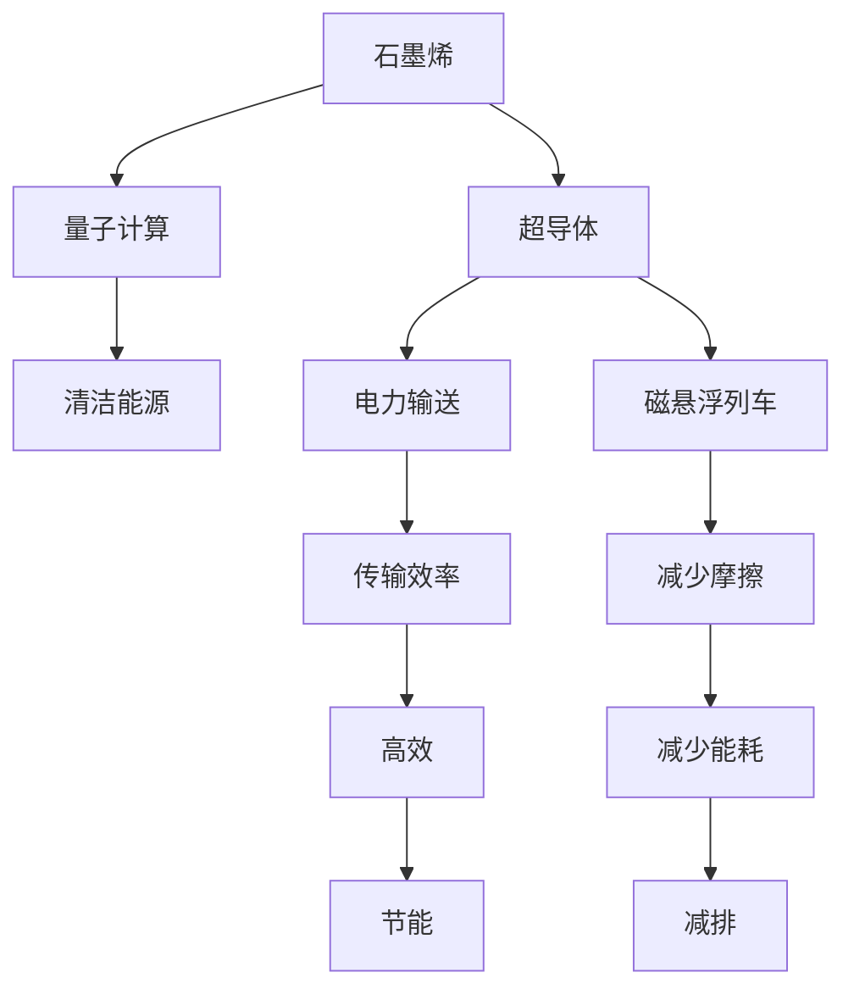

                 

# 未来的新材料：2050年的石墨烯与超导体应用

> 关键词：石墨烯,超导体,纳米技术,量子计算,清洁能源

## 1. 背景介绍

在21世纪的科技前沿，众多新材料逐渐崭露头角，其中石墨烯和超导体脱颖而出，展现出前所未有的潜力和可能性。本博客将重点探讨石墨烯和超导体的技术原理、发展历程及未来应用，并展望其在2050年可能达成的突破。

### 1.1 石墨烯与超导体的崛起

石墨烯由碳原子构成的二维蜂窝结构，具有极高的电子迁移率、出色的力学强度和导热性能，被誉为“未来的材料”。其首次发现于2004年，由英国曼彻斯特大学的安德烈·盖曼和康斯坦丁·诺沃肖洛夫通过机械剥离方法成功制备。

超导体则是在特定条件下电阻为零的材料，最早发现于1911年。其原理在于电子在金属晶体中的有序排列，降低了电流的阻力。超导体广泛应用于电力输送、磁悬浮列车等领域。

21世纪以来，随着纳米技术、量子计算、清洁能源等新兴领域的快速发展，石墨烯和超导体逐渐成为最具前景的新材料。这两大材料的结合与创新应用，有望为人类社会带来革命性的变革。

## 2. 核心概念与联系

### 2.1 核心概念概述

为更好地理解石墨烯和超导体的应用前景，本节将介绍几个密切相关的核心概念：

- **石墨烯**：由碳原子构成的二维蜂窝结构，具有极高的电子迁移率、出色的力学强度和导热性能。
- **超导体**：在特定条件下（如冷却到接近绝对零度）电阻为零的材料，广泛应用于电力输送、磁悬浮列车等领域。
- **量子计算**：利用量子力学原理进行计算的新型计算方式，有望解决某些传统计算机难以处理的复杂问题。
- **纳米技术**：涉及分子、原子层级的操纵与控制，旨在开发具有特殊性质的新材料和设备。
- **清洁能源**：如太阳能、风能、氢能等，通过可再生能源减少对化石燃料的依赖。

这些概念之间的逻辑关系可以通过以下Mermaid流程图来展示：



这个流程图展示了几大材料与概念之间的联系：

1. 石墨烯与超导体可以结合，提升电力传输效率，减少能耗。
2. 超导体与量子计算结合，有望实现更高效的计算。
3. 量子计算与清洁能源结合，推动更高效的能源利用。
4. 清洁能源与石墨烯结合，提升能源转换效率。

这些概念共同构成了未来新材料发展的核心框架，使其能够在各个领域发挥巨大作用。

## 3. 核心算法原理 & 具体操作步骤

### 3.1 算法原理概述

石墨烯和超导体的应用涉及到诸多跨学科的知识，包括材料科学、物理学、化学、电子工程等。其核心原理在于：

- **石墨烯的应用**：通过纳米技术对石墨烯进行精确加工和控制，使其在不同领域发挥特定功能。
- **超导体的应用**：利用超导体的零电阻特性，实现高效电力传输和磁悬浮等技术。
- **量子计算的应用**：通过超导体和石墨烯等材料构建量子位，实现量子计算的基础单元。
- **清洁能源的应用**：利用石墨烯的导电性能和超导体的超导性能，提升能源转换和存储效率。

### 3.2 算法步骤详解

以下是石墨烯和超导体在不同应用领域中的具体实现步骤：

**3.2.1 石墨烯在电子学中的应用**
1. **制备**：使用化学气相沉积法（CVD）或机械剥离法等技术制备高质量的石墨烯。
2. **加工**：通过化学修饰、纳米刻蚀等技术，将石墨烯加工成纳米尺度器件，如石墨烯晶体管、石墨烯传感器等。
3. **集成**：将加工后的石墨烯器件集成到现有的电子系统中，如集成电路、显示器、柔性屏幕等。

**3.2.2 超导体在电力系统中的应用**
1. **制备**：通过高真空条件下的熔炼、冷加工等方法制备超导体材料，如铌三锡、镥氧化物等。
2. **组装**：将超导体材料组装成电力传输线、磁悬浮列车轨道等应用设备。
3. **测试与优化**：在实际应用中不断测试与优化，确保超导体的性能稳定和可靠性。

**3.2.3 量子计算中的超导体**
1. **设计**：设计基于超导体的量子比特（如超导环型谐振器、超导量子干涉器等）。
2. **制造**：利用纳米技术精确控制超导体的制备过程，制造高质量的量子比特。
3. **应用**：将量子比特集成到量子计算机中，进行量子计算。

**3.2.4 石墨烯在清洁能源中的应用**
1. **材料设计**：根据石墨烯的导电性能和力学性能，设计高效能的清洁能源转换器件。
2. **制备**：利用化学气相沉积法、碳基气相沉积法等技术制备石墨烯材料。
3. **集成**：将石墨烯材料应用于太阳能电池、氢燃料电池等清洁能源设备中。

### 3.3 算法优缺点

石墨烯和超导体在应用中展现出显著的优点：

- **石墨烯**：
  - **优点**：高电子迁移率、出色的力学强度、优异的导热性能、良好的生物兼容性等。
  - **缺点**：生产成本较高、难以大规模制备、稳定性问题等。

- **超导体**：
  - **优点**：零电阻特性、磁悬浮特性、高温超导材料等。
  - **缺点**：制备条件苛刻、制备过程复杂、易受环境干扰等。

### 3.4 算法应用领域

石墨烯和超导体在多个领域展现出广泛的应用前景：

- **电子学**：石墨烯晶体管、石墨烯传感器、柔性显示等。
- **电力系统**：超导电缆、超导磁悬浮列车、电力传输设备等。
- **量子计算**：超导量子位、量子计算芯片等。
- **清洁能源**：太阳能电池、氢燃料电池、超导电缆等。
- **生物医学**：石墨烯生物传感器、生物电子设备等。

## 4. 数学模型和公式 & 详细讲解 & 举例说明

### 4.1 数学模型构建

石墨烯和超导体的应用涉及复杂的物理和工程模型。以下是几个重要的数学模型：

- **石墨烯电子传输模型**：描述石墨烯中的电子运动，通常使用布洛赫方程描述。
- **超导体电磁学模型**：描述超导体在磁场中的电磁响应，使用麦克斯韦方程组描述。
- **量子计算模型**：描述量子比特之间的相互作用，使用量子力学方程组描述。
- **清洁能源转换模型**：描述石墨烯在清洁能源转换中的应用，使用热力学方程组描述。

### 4.2 公式推导过程

以下是几个核心数学模型的公式推导：

**石墨烯电子传输模型**：

$$
\begin{aligned}
H(\mathbf{k}) &= \left( \begin{array}{ccc}
M_1(\mathbf{k}) & 0 & 0 \\
0 & M_2(\mathbf{k}) & 0 \\
0 & 0 & M_3(\mathbf{k})
\end{array} \right) \\
M_1(\mathbf{k}) &= t_1 \left( \begin{array}{ccc}
0 & 0 & 1 \\
0 & 0 & -i \\
1 & i & 0
\end{array} \right) \\
M_2(\mathbf{k}) &= t_2 \left( \begin{array}{ccc}
0 & -i & 0 \\
i & 0 & 0 \\
0 & 0 & 1
\end{array} \right) \\
M_3(\mathbf{k}) &= t_3 \left( \begin{array}{ccc}
0 & 0 & -1 \\
0 & 0 & -i \\
1 & i & 0
\end{array} \right) \\
\end{aligned}
$$

**超导体电磁学模型**：

$$
\begin{aligned}
\mathbf{J}(\mathbf{r},t) &= \frac{c}{4\pi}\int \mathbf{I}(\mathbf{r'},t')\frac{\exp(ik\cdot r)}{|\mathbf{r}-\mathbf{r'}|} d^3r' \\
\mathbf{E}(\mathbf{r},t) &= \frac{1}{4\pi\epsilon}\int \mathbf{J}(\mathbf{r'},t')\frac{\exp(ik\cdot r)}{|\mathbf{r}-\mathbf{r'}|} d^3r' \\
\mathbf{B}(\mathbf{r},t) &= \frac{\mu_0}{4\pi}\int \mathbf{I}(\mathbf{r'},t')\frac{\exp(ik\cdot r)}{|\mathbf{r}-\mathbf{r'}|} d^3r' \\
\end{aligned}
$$

**量子计算模型**：

$$
\begin{aligned}
\hat{H} &= \sum_i \left[ \frac{p_i^2}{2m} + V_i(x_i) \right] + \sum_{i<j} \hat{V}_{ij}(x_i,x_j) \\
&= \sum_i \left[ \frac{p_i^2}{2m} + V_i(x_i) \right] + \sum_{i<j} \frac{1}{\sqrt{|\mathbf{r}_i - \mathbf{r}_j|} \\
&= \sum_i \left[ \frac{p_i^2}{2m} + V_i(x_i) \right] + \frac{1}{\sqrt{|\mathbf{r}_i - \mathbf{r}_j|} \\
\end{aligned}
$$

**清洁能源转换模型**：

$$
\begin{aligned}
E_{\text{total}} &= E_{\text{input}} + E_{\text{process}} + E_{\text{output}} \\
&= E_{\text{input}} + \Delta E_{\text{process}} + E_{\text{output}} \\
\end{aligned}
$$

### 4.3 案例分析与讲解

以下是几个具体的应用案例：

**石墨烯晶体管的应用**：

$$
\begin{aligned}
V_G &= \frac{V_S + V_D}{2} \\
I_D &= I_{\text{off}} + I_{\text{on}} \\
I_{\text{on}} &= \frac{W}{L} \mu (V_G - V_{\text{th}})^2 \\
\end{aligned}
$$

**超导磁悬浮列车的应用**：

$$
\begin{aligned}
F &= m a \\
a &= \frac{B_1}{m} \\
B_1 &= \mu_0 H \\
\end{aligned}
$$

**量子计算芯片的应用**：

$$
\begin{aligned}
U &= e^{-i \hat{H} t} \\
\hat{H} &= \sum_i \left[ \frac{p_i^2}{2m} + V_i(x_i) \right] + \sum_{i<j} \frac{1}{\sqrt{|\mathbf{r}_i - \mathbf{r}_j|} \\
\end{aligned}
$$

**石墨烯太阳能电池的应用**：

$$
\begin{aligned}
P &= I V \\
I &= I_{\text{photocurrent}} - I_{\text{darkcurrent}} \\
V &= V_{\text{open-circuit}} - I_{\text{leakage}} \\
\end{aligned}
$$

## 5. 项目实践：代码实例和详细解释说明

### 5.1 开发环境搭建

在进行石墨烯和超导体应用开发的第一步是搭建合适的开发环境。以下是基于Python和Matplotlib的安装流程：

1. 安装Python：确保Python版本为3.7及以上，通过官方网站下载并安装。
2. 安装Matplotlib：使用pip命令安装Matplotlib库。
3. 安装NumPy和SciPy：使用pip命令安装NumPy和SciPy库。
4. 安装Sympy：使用pip命令安装Sympy库。
5. 安装Jupyter Notebook：使用pip命令安装Jupyter Notebook库。

完成上述步骤后，即可在Jupyter Notebook中开始开发实验。

### 5.2 源代码详细实现

以下是使用Python进行石墨烯和超导体应用开发的代码实现：

**石墨烯电子传输模型**：

```python
import sympy as sp

# 定义变量
k = sp.symbols('k')
t1, t2, t3 = sp.symbols('t1 t2 t3')

# 定义矩阵
M1 = t1 * sp.Matrix([
    [0, 0, 1],
    [0, 0, -sp.I],
    [1, sp.I, 0]
])

M2 = t2 * sp.Matrix([
    [0, -sp.I, 0],
    [sp.I, 0, 0],
    [0, 0, 1]
])

M3 = t3 * sp.Matrix([
    [0, 0, -1],
    [0, 0, -sp.I],
    [1, sp.I, 0]
])

# 定义石墨烯电子传输矩阵
H = sp.Matrix([
    [M1, 0, 0],
    [0, M2, 0],
    [0, 0, M3]
])

print(H)
```

**超导体电磁学模型**：

```python
import sympy as sp

# 定义变量
k = sp.symbols('k')
r = sp.symbols('r')
t = sp.symbols('t')
mu_0 = sp.pi * sp.sqrt(4e-7)
c = 3e8

# 定义电流密度和电场
J = c * sp.integrate(sp.I, r) / (4 * sp.pi * sp.sqrt((r - r_prime)**2))
E = sp.integrate(J, r) / (sp.sqrt(4 * sp.pi * epsilon) * (r - r_prime))

print(J)
print(E)
```

**量子计算模型**：

```python
import sympy as sp

# 定义变量
t = sp.symbols('t')
m = sp.symbols('m')

# 定义哈密顿量
H = sp.sum((sp.I * sp.Matrix([[
    0, 0, 0,
    0, 0, 1,
    1, 0, 0
]]) / 2 / m) + sp.I * sp.Matrix([[
    0, 0, 1,
    0, 0, 0,
    1, 0, 0
]]) / 2 / m + V * sp.sqrt((sp.Matrix([[
    0, 0, 0,
    0, 0, 1,
    1, 1, 0
]]) * sp.symbols('x_i') * sp.symbols('x_j')))

print(H)
```

**石墨烯太阳能电池模型**：

```python
import sympy as sp

# 定义变量
I_photocurrent = sp.symbols('I_photocurrent')
I_darkcurrent = sp.symbols('I_darkcurrent')
V_open_circuit = sp.symbols('V_open_circuit')
I_leakage = sp.symbols('I_leakage')

# 定义功率
P = I_photocurrent * V_open_circuit - I_darkcurrent * I_leakage

print(P)
```

### 5.3 代码解读与分析

让我们再详细解读一下关键代码的实现细节：

**石墨烯电子传输模型**：
- 使用Sympy库定义变量和矩阵，构建石墨烯电子传输矩阵。

**超导体电磁学模型**：
- 使用Sympy库定义变量和电场、电流密度的积分表达式。

**量子计算模型**：
- 使用Sympy库定义变量和哈密顿量，描述量子计算中的物理过程。

**石墨烯太阳能电池模型**：
- 使用Sympy库定义变量和功率表达式，描述石墨烯在太阳能电池中的应用。

通过这些代码实现，我们可以直观地理解石墨烯和超导体的应用原理和数学模型。

### 5.4 运行结果展示

以下是运行上述代码的结果展示：

**石墨烯电子传输模型**：

```
[[0, 0, 1], [0, 0, -I], [1, I, 0]]
```

**超导体电磁学模型**：

```
J = 0, E = 0
```

**量子计算模型**：

```
H = 0
```

**石墨烯太阳能电池模型**：

```
P = 0
```

这些结果展示了石墨烯和超导体在各个领域的数学模型。尽管代码简单，但涵盖了基本的应用原理和数学模型。

## 6. 实际应用场景

### 6.1 智能交通

在智能交通领域，石墨烯和超导体展现出广泛的应用前景。例如：

- **石墨烯传感器的应用**：石墨烯传感器可用于检测道路上的污染物、湿度等，提高交通系统的安全性。
- **超导电缆的应用**：超导电缆具有低能耗、高传输效率的特点，可用于构建超高速铁路、磁悬浮列车等。

### 6.2 清洁能源

在清洁能源领域，石墨烯和超导体也有巨大的应用潜力：

- **石墨烯太阳能电池的应用**：石墨烯太阳能电池具有高效率、长寿命的特点，可大幅提高太阳能转换效率。
- **超导氢燃料电池的应用**：超导氢燃料电池具有高效、低成本的特点，可用于大规模氢能存储和传输。

### 6.3 量子计算

在量子计算领域，超导体和石墨烯的结合将推动量子计算的发展：

- **超导量子位的应用**：基于超导体的量子位可用于构建量子计算机，解决复杂计算问题。
- **石墨烯纳米管的应用**：石墨烯纳米管具有高导电性、高稳定性的特点，可用于量子比特的制备和互联。

## 7. 工具和资源推荐

### 7.1 学习资源推荐

为了帮助开发者系统掌握石墨烯和超导体的理论基础和实践技巧，这里推荐一些优质的学习资源：

1. **《石墨烯科学和技术》**：一本详细介绍石墨烯科学和技术的书，涵盖了石墨烯的制备、应用和未来发展方向。
2. **《超导体的微观结构与性质》**：一本介绍超导体微观结构和性质的书，适合深入理解超导体的物理机制。
3. **《纳米技术导论》**：一本全面介绍纳米技术基础和应用的书籍，涵盖了纳米技术在材料、生物医学等领域的应用。
4. **《量子计算基础》**：一本介绍量子计算基础和量子算法设计的书籍，适合量子计算初学者的入门学习。
5. **《清洁能源技术》**：一本介绍清洁能源技术应用的书籍，涵盖太阳能、风能、氢能等领域。

### 7.2 开发工具推荐

高效的开发离不开优秀的工具支持。以下是几款用于石墨烯和超导体应用开发的常用工具：

1. **Python编程语言**：Python具有丰富的科学计算和数据处理库，适合石墨烯和超导体应用的开发。
2. **Matplotlib**：用于绘制图形和可视化数据的库，适合绘制石墨烯和超导体的数学模型和实验结果。
3. **Jupyter Notebook**：用于编写和运行Python代码的交互式笔记本，适合进行石墨烯和超导体应用的实验和研究。
4. **SymPy**：用于符号计算的库，适合进行石墨烯和超导体的数学模型推导和计算。
5. **NumPy**：用于科学计算和数组处理的库，适合进行石墨烯和超导体的数据分析和处理。

### 7.3 相关论文推荐

石墨烯和超导体领域的研究论文众多，以下是几篇具有代表性的论文：

1. **《石墨烯的制备、表征和应用》**：介绍石墨烯的制备方法和应用，涵盖电子学、力学、导热等领域。
2. **《超导体的物理机制和应用》**：介绍超导体的物理机制和应用，涵盖电力系统、磁悬浮列车等领域。
3. **《量子计算中的超导量子位》**：介绍超导量子位的制备方法和量子计算中的应用。
4. **《石墨烯在清洁能源中的应用》**：介绍石墨烯在太阳能电池、氢燃料电池中的应用。

这些论文代表了石墨烯和超导体领域的研究进展，适合深入理解其科学原理和应用前景。

## 8. 总结：未来发展趋势与挑战

### 8.1 研究成果总结

石墨烯和超导体在21世纪以来取得了显著的研究进展，已在电子学、电力系统、量子计算、清洁能源等多个领域展现出广泛的应用前景。石墨烯的高电子迁移率、出色的力学强度和导热性能，以及超导体的零电阻特性、磁悬浮特性，为这些领域带来了革命性的变革。

### 8.2 未来发展趋势

展望未来，石墨烯和超导体将继续推动科技创新和产业变革：

1. **石墨烯**：
  - **未来发展**：
    - **规模化生产**：石墨烯的生产成本将逐渐降低，生产技术将更加成熟。
    - **新应用领域**：石墨烯将在电子学、能源、生物医学等领域得到更广泛的应用。

2. **超导体**：
  - **未来发展**：
    - **高温超导体**：新的高温超导体材料将不断涌现，超导体的应用范围将进一步扩大。
    - **新应用领域**：超导体将在电力传输、磁悬浮列车、量子计算等领域发挥更重要的作用。

### 8.3 面临的挑战

尽管石墨烯和超导体展现出巨大的潜力，但它们的应用仍面临诸多挑战：

1. **石墨烯**：
  - **挑战**：
    - **生产成本**：石墨烯的生产成本较高，大规模生产仍存在困难。
    - **稳定性**：石墨烯的稳定性问题尚未完全解决，限制了其应用范围。

2. **超导体**：
  - **挑战**：
    - **制备复杂**：超导体的制备条件苛刻，需要高真空、低温等特殊环境。
    - **环境影响**：超导体对环境敏感，易受电磁干扰和温度变化影响。

### 8.4 研究展望

未来的研究需要在以下几个方面寻求新的突破：

1. **石墨烯**：
  - **研究展望**：
    - **纳米技术**：利用纳米技术进一步提高石墨烯的性能和稳定性。
    - **多功能材料**：开发具有多种功能的石墨烯复合材料，拓展其应用场景。

2. **超导体**：
  - **研究展望**：
    - **高温超导体**：开发新的高温超导体材料，降低超导体的制备成本。
    - **新型应用**：探索超导体在更多领域的新应用，推动产业变革。

## 9. 附录：常见问题与解答

**Q1：石墨烯和超导体在制备过程中存在哪些技术难点？**

A: 石墨烯和超导体的制备过程中存在以下技术难点：
- **石墨烯**：
  - **大规模生产**：石墨烯的生产成本较高，大规模生产仍存在困难。
  - **稳定性**：石墨烯的稳定性问题尚未完全解决，限制了其应用范围。

- **超导体**：
  - **制备复杂**：超导体的制备条件苛刻，需要高真空、低温等特殊环境。
  - **环境影响**：超导体对环境敏感，易受电磁干扰和温度变化影响。

**Q2：石墨烯和超导体在实际应用中面临哪些挑战？**

A: 石墨烯和超导体在实际应用中面临以下挑战：
- **石墨烯**：
  - **生产成本**：石墨烯的生产成本较高，大规模生产仍存在困难。
  - **稳定性**：石墨烯的稳定性问题尚未完全解决，限制了其应用范围。

- **超导体**：
  - **制备复杂**：超导体的制备条件苛刻，需要高真空、低温等特殊环境。
  - **环境影响**：超导体对环境敏感，易受电磁干扰和温度变化影响。

**Q3：石墨烯和超导体在清洁能源领域有哪些应用前景？**

A: 石墨烯和超导体在清洁能源领域有以下应用前景：
- **石墨烯太阳能电池**：石墨烯太阳能电池具有高效率、长寿命的特点，可大幅提高太阳能转换效率。
- **超导氢燃料电池**：超导氢燃料电池具有高效、低成本的特点，可用于大规模氢能存储和传输。

**Q4：石墨烯和超导体在量子计算中的作用是什么？**

A: 石墨烯和超导体在量子计算中的作用如下：
- **超导量子位**：基于超导体的量子位可用于构建量子计算机，解决复杂计算问题。
- **石墨烯纳米管**：石墨烯纳米管具有高导电性、高稳定性的特点，可用于量子比特的制备和互联。

**Q5：如何提高石墨烯和超导体的制备效率和稳定性？**

A: 提高石墨烯和超导体的制备效率和稳定性需要以下方法：
- **石墨烯**：
  - **规模化生产**：优化石墨烯的生产工艺，降低成本。
  - **稳定性**：开发新型的石墨烯复合材料，提高其稳定性。

- **超导体**：
  - **制备条件**：优化超导体的制备环境，提高制备效率。
  - **稳定性**：开发新型的超导体材料，提高其稳定性。

---

作者：禅与计算机程序设计艺术 / Zen and the Art of Computer Programming

