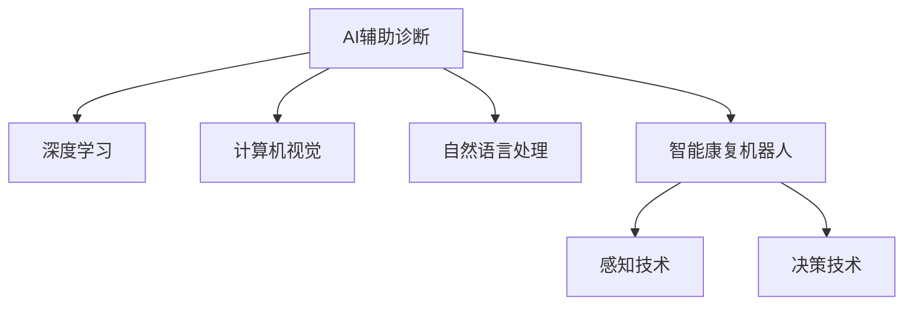

                 

# 未来的智慧医疗：2050年的AI辅助诊断与智能康复机器人

## 1. 背景介绍

### 1.1 问题由来
随着科技进步，医疗健康领域发生了巨大的变革。从过去的人工诊断到现代的智能医疗，医学领域的智能化水平有了显著提升。然而，面对全球人口老龄化、疾病谱的变迁、医疗资源分配不均等问题，当前的智能医疗技术仍需不断创新和发展。2050年，智慧医疗将成为人类医疗健康事业的重要引擎，通过人工智能（AI）辅助诊断和智能康复机器人等技术手段，推动医疗服务从治疗型向预防型转变，提高人类整体健康水平。

### 1.2 问题核心关键点
智慧医疗的关键在于将AI技术与医疗健康数据相结合，构建智能化的医疗体系。AI辅助诊断利用深度学习、自然语言处理（NLP）、计算机视觉等技术，从海量医学数据中提取有用的信息，辅助医生进行快速、准确的诊断。智能康复机器人则借助机器人技术、感知技术、决策技术等，实现个性化康复方案的设计和执行，助力病患恢复健康。

## 2. 核心概念与联系

### 2.1 核心概念概述

为更好地理解智慧医疗技术，本节将介绍几个密切相关的核心概念：

- AI辅助诊断：利用机器学习算法，从医学影像、病历、基因数据等多模态数据中提取有用信息，辅助医生进行疾病诊断。
- 智能康复机器人：通过机器人技术、感知技术、决策技术等，实现个性化康复方案的设计和执行，帮助病患恢复健康。
- 深度学习：通过多层神经网络构建模型，从数据中提取高层次特征，用于分类、回归、聚类等任务。
- 计算机视觉：利用图像处理、模式识别等技术，从医学影像中提取特征，用于疾病识别、病变区域定位等。
- 自然语言处理：从医学文本中提取关键信息，辅助病历理解、症状描述等。

这些核心概念之间的逻辑关系可以通过以下Mermaid流程图来展示：



这个流程图展示了大语言模型的核心概念及其之间的关系：

1. AI辅助诊断利用深度学习和计算机视觉技术，从医学数据中提取特征，辅助医生进行诊断。
2. 智能康复机器人借助感知技术和决策技术，实现个性化康复方案的设计和执行。
3. 深度学习和计算机视觉技术是AI辅助诊断的基础，自然语言处理技术用于病历理解和症状描述。
4. 智能康复机器人将感知、决策技术融合，实现高效、精准的康复服务。

这些核心概念共同构成了智慧医疗的技术框架，使其能够在疾病预防、诊断和治疗等多个环节发挥重要作用。通过理解这些核心概念，我们可以更好地把握智慧医疗的工作原理和优化方向。

## 3. 核心算法原理 & 具体操作步骤

### 3.1 算法原理概述

智慧医疗的AI辅助诊断和智能康复机器人技术，本质上是一种基于数据驱动的智能决策过程。其核心算法原理可以概括为以下几步：

1. **数据收集与预处理**：收集医疗健康数据，包括电子病历、医学影像、基因数据等，对其进行清洗、归一化等预处理。
2. **特征提取与表示**：利用深度学习、计算机视觉等技术，从数据中提取高层次特征，用于构建诊断模型。
3. **模型训练与评估**：在标注数据集上训练模型，利用交叉验证等方法评估模型性能，优化模型参数。
4. **模型部署与推理**：将训练好的模型部署到实际应用场景中，通过推理获取诊断结果，辅助医生进行决策。
5. **康复方案设计**：通过智能康复机器人，根据病患的康复需求，设计个性化的康复方案，并执行康复训练。

### 3.2 算法步骤详解

#### 3.2.1 数据收集与预处理

- **收集数据**：从医院、研究机构等渠道获取医疗健康数据，包括电子病历、医学影像、基因数据等。
- **数据清洗**：去除数据中的噪声、缺失值、异常值等，确保数据质量。
- **数据归一化**：将不同模态的数据转换为统一格式，如将医学影像转换为标准化的图像格式，将文本数据转换为词向量。

#### 3.2.2 特征提取与表示

- **深度学习特征提取**：使用卷积神经网络（CNN）、循环神经网络（RNN）、Transformer等模型，从医学影像、病历文本中提取特征。
- **计算机视觉特征提取**：利用图像分割、边缘检测等技术，从医学影像中提取关键区域和病变特征。
- **自然语言处理特征提取**：通过分词、向量化等技术，从病历文本中提取关键词和症状描述。

#### 3.2.3 模型训练与评估

- **模型选择与设计**：选择合适的深度学习模型，如卷积神经网络（CNN）、循环神经网络（RNN）、Transformer等，设计适当的模型架构。
- **数据划分**：将数据集划分为训练集、验证集、测试集，进行交叉验证。
- **模型训练**：在训练集上训练模型，优化模型参数。
- **模型评估**：在验证集上评估模型性能，选择最优模型。
- **模型优化**：根据评估结果，调整模型参数，提高模型准确率。

#### 3.2.4 模型部署与推理

- **模型部署**：将训练好的模型部署到服务器、移动设备等平台上，实现实时推理。
- **推理计算**：利用推理引擎，对新输入数据进行推理计算，生成诊断结果。
- **结果解释**：对诊断结果进行解释和展示，辅助医生进行决策。

#### 3.2.5 康复方案设计

- **康复需求评估**：根据病患的病情、康复目标，评估其康复需求。
- **康复方案设计**：设计个性化的康复方案，包括康复动作、训练强度、康复时长等。
- **康复方案执行**：利用智能康复机器人，执行康复方案，记录康复过程和效果。
- **康复效果评估**：根据康复目标和效果，评估康复方案的执行效果，优化康复方案。

### 3.3 算法优缺点

智慧医疗的AI辅助诊断和智能康复机器人技术，具有以下优点：

- **提升诊断准确率**：通过机器学习和深度学习技术，提高疾病诊断的准确性和效率。
- **个性化康复方案**：根据病患的康复需求，设计个性化的康复方案，提高康复效果。
- **减少医疗成本**：降低医疗资源的消耗，减轻患者经济负担。
- **提高医疗效率**：通过自动化和智能化手段，提高医疗服务的效率和可及性。

同时，该技术也存在一定的局限性：

- **数据隐私和安全**：医疗数据的隐私和安全问题需高度重视，防止数据泄露和滥用。
- **模型可解释性**：AI辅助诊断模型的黑盒特性，需要加强其可解释性和透明度。
- **技术门槛高**：需要专业的算法和工程团队，对技术实施和维护要求较高。
- **数据质量要求高**：模型训练和推理依赖高质量的数据，数据的噪声和缺失可能影响模型性能。

尽管存在这些局限性，但就目前而言，智慧医疗的AI辅助诊断和智能康复机器人技术已成为医疗领域的重要方向。未来相关研究的重点在于如何进一步降低技术门槛，提高模型的可解释性和数据质量，从而更好地服务于医疗健康事业。

### 3.4 算法应用领域

智慧医疗的AI辅助诊断和智能康复机器人技术，已经在多个领域得到了广泛的应用，例如：

- **医学影像分析**：通过计算机视觉技术，辅助医生进行病变检测、病变区域定位等。
- **电子病历分析**：利用自然语言处理技术，辅助医生理解病历文本，提取关键信息。
- **基因数据分析**：通过深度学习技术，从基因数据中提取特征，辅助疾病的早期诊断和个性化治疗。
- **智能康复机器人**：结合感知、决策等技术，实现个性化的康复训练方案，帮助病患恢复健康。
- **远程医疗**：利用AI辅助诊断技术，实现远程医疗咨询和诊断，提高医疗服务的可及性。
- **公共卫生监测**：通过AI技术分析大量公共卫生数据，辅助流行病监测和预警。

除了上述这些经典应用外，智慧医疗技术还被创新性地应用于更多领域，如健康管理、智能手术、药物研发等，为医疗健康事业带来了新的发展机遇。

## 4. 数学模型和公式 & 详细讲解 & 举例说明

### 4.1 数学模型构建

本节将使用数学语言对智慧医疗的AI辅助诊断和智能康复机器人技术进行更加严格的刻画。

设医疗健康数据集为 $D=\{(x_i,y_i)\}_{i=1}^N$，其中 $x_i$ 为输入特征，$y_i$ 为输出标签。

定义AI辅助诊断模型的预测函数为 $f_\theta(x)$，其中 $\theta$ 为模型参数。模型在数据集 $D$ 上的经验风险为：

$$
\mathcal{L}(\theta) = \frac{1}{N}\sum_{i=1}^N \ell(f_\theta(x_i),y_i)
$$

其中 $\ell$ 为损失函数，用于衡量模型预测与真实标签之间的差异。常见的损失函数包括交叉熵损失、均方误差损失等。

模型训练的目标是最小化经验风险，即找到最优参数 $\theta^*$：

$$
\theta^* = \mathop{\arg\min}_{\theta} \mathcal{L}(\theta)
$$

在实践中，我们通常使用基于梯度的优化算法（如SGD、Adam等）来近似求解上述最优化问题。设 $\eta$ 为学习率，则参数的更新公式为：

$$
\theta \leftarrow \theta - \eta \nabla_{\theta}\mathcal{L}(\theta)
$$

其中 $\nabla_{\theta}\mathcal{L}(\theta)$ 为损失函数对参数 $\theta$ 的梯度，可通过反向传播算法高效计算。

### 4.2 公式推导过程

以下我们以医学影像分类任务为例，推导深度学习模型分类器的计算过程。

假设模型 $f_\theta(x)$ 为卷积神经网络（CNN），输入为 $x$，输出为分类结果 $\hat{y}$。定义损失函数为交叉熵损失函数：

$$
\ell(f_\theta(x),y) = -[y\log \hat{y} + (1-y)\log (1-\hat{y})]
$$

将其代入经验风险公式，得：

$$
\mathcal{L}(\theta) = -\frac{1}{N}\sum_{i=1}^N [y_i\log f_\theta(x_i)+(1-y_i)\log(1-f_\theta(x_i))]
$$

根据链式法则，损失函数对参数 $\theta_k$ 的梯度为：

$$
\frac{\partial \mathcal{L}(\theta)}{\partial \theta_k} = -\frac{1}{N}\sum_{i=1}^N \left( \frac{\partial f_\theta(x_i)}{\partial \theta_k} \cdot \left( \frac{y_i}{f_\theta(x_i)} - \frac{1-y_i}{1-f_\theta(x_i)} \right) \right)
$$

其中 $\frac{\partial f_\theta(x_i)}{\partial \theta_k}$ 可进一步递归展开，利用自动微分技术完成计算。

在得到损失函数的梯度后，即可带入参数更新公式，完成模型的迭代优化。重复上述过程直至收敛，最终得到适应医学影像分类任务的最优模型参数 $\theta^*$。

### 4.3 案例分析与讲解

为了更好地理解深度学习模型在医学影像分类中的应用，我们以肺癌影像分类为例，进行详细讲解。

#### 4.3.1 数据准备

- **数据集**：从公开的医学影像数据集中获取肺癌影像数据集，包括正常肺组织和肺癌组织。
- **数据预处理**：将医学影像转换为标准化的图像格式，进行归一化处理。
- **数据划分**：将数据集划分为训练集、验证集、测试集，比例为7:1.5:1.5。

#### 4.3.2 模型构建

- **模型架构**：使用卷积神经网络（CNN），包括卷积层、池化层、全连接层等，构建分类模型。
- **超参数设置**：设置学习率为0.001，批大小为32，训练轮数为100。
- **损失函数**：使用交叉熵损失函数。

#### 4.3.3 模型训练

- **训练过程**：在训练集上训练模型，利用反向传播算法更新模型参数。
- **验证过程**：在验证集上评估模型性能，调整学习率等超参数。
- **测试过程**：在测试集上测试模型性能，计算准确率、召回率等指标。

#### 4.3.4 结果分析

- **性能分析**：对比模型在不同超参数设置下的性能表现，选择最优模型。
- **结果展示**：在测试集上展示模型分类结果，与真实标签进行对比。
- **模型优化**：根据测试结果，优化模型架构和超参数，提高模型性能。

通过以上步骤，即可构建一个简单的医学影像分类模型，辅助医生进行肺癌诊断。

## 5. 项目实践：代码实例和详细解释说明

### 5.1 开发环境搭建

在进行智慧医疗项目开发前，我们需要准备好开发环境。以下是使用Python进行TensorFlow开发的环境配置流程：

1. 安装Anaconda：从官网下载并安装Anaconda，用于创建独立的Python环境。

2. 创建并激活虚拟环境：
```bash
conda create -n tensorflow-env python=3.8 
conda activate tensorflow-env
```

3. 安装TensorFlow：根据CUDA版本，从官网获取对应的安装命令。例如：
```bash
conda install tensorflow -c tf -c conda-forge
```

4. 安装Keras：
```bash
pip install keras
```

5. 安装各类工具包：
```bash
pip install numpy pandas scikit-learn matplotlib tqdm jupyter notebook ipython
```

完成上述步骤后，即可在`tensorflow-env`环境中开始智慧医疗项目开发。

### 5.2 源代码详细实现

下面以肺癌影像分类任务为例，给出使用TensorFlow进行智慧医疗项目开发的完整代码实现。

首先，定义数据处理函数：

```python
import numpy as np
import tensorflow as tf
from tensorflow.keras.preprocessing.image import ImageDataGenerator

def load_data(path, batch_size=32):
    train_gen = ImageDataGenerator(rescale=1./255).flow_from_directory(
        path + '/train',
        target_size=(128, 128),
        batch_size=batch_size,
        class_mode='binary')
    val_gen = ImageDataGenerator(rescale=1./255).flow_from_directory(
        path + '/val',
        target_size=(128, 128),
        batch_size=batch_size,
        class_mode='binary')
    test_gen = ImageDataGenerator(rescale=1./255).flow_from_directory(
        path + '/test',
        target_size=(128, 128),
        batch_size=batch_size,
        class_mode='binary')
    
    return train_gen, val_gen, test_gen
```

然后，定义模型和优化器：

```python
from tensorflow.keras.models import Sequential
from tensorflow.keras.layers import Conv2D, MaxPooling2D, Flatten, Dense

model = Sequential()
model.add(Conv2D(32, (3, 3), activation='relu', input_shape=(128, 128, 3)))
model.add(MaxPooling2D((2, 2)))
model.add(Conv2D(64, (3, 3), activation='relu'))
model.add(MaxPooling2D((2, 2)))
model.add(Flatten())
model.add(Dense(128, activation='relu'))
model.add(Dense(1, activation='sigmoid'))

optimizer = tf.keras.optimizers.Adam(learning_rate=0.001)
```

接着，定义训练和评估函数：

```python
from tensorflow.keras.metrics import BinaryAccuracy

def train_epoch(model, train_gen, optimizer):
    train_loss = 0
    train_acc = 0
    for batch in train_gen:
        inputs, labels = batch
        with tf.GradientTape() as tape:
            predictions = model(inputs)
            loss = tf.keras.losses.binary_crossentropy(labels, predictions)
        gradients = tape.gradient(loss, model.trainable_variables)
        optimizer.apply_gradients(zip(gradients, model.trainable_variables))
        train_loss += loss.numpy()
        train_acc += BinaryAccuracy()(labels, predictions).numpy()
    
    return train_loss / len(train_gen), train_acc / len(train_gen)

def evaluate(model, val_gen):
    val_loss = 0
    val_acc = 0
    for batch in val_gen:
        inputs, labels = batch
        predictions = model(inputs)
        val_loss += tf.keras.losses.binary_crossentropy(labels, predictions).numpy()
        val_acc += BinaryAccuracy()(labels, predictions).numpy()
    
    return val_loss / len(val_gen), val_acc / len(val_gen)
```

最后，启动训练流程并在测试集上评估：

```python
epochs = 100
batch_size = 32

for epoch in range(epochs):
    train_loss, train_acc = train_epoch(model, train_gen, optimizer)
    val_loss, val_acc = evaluate(model, val_gen)
    
    print(f"Epoch {epoch+1}, train loss: {train_loss:.4f}, train acc: {train_acc:.4f}, val loss: {val_loss:.4f}, val acc: {val_acc:.4f}")
    
print("Test results:")
test_gen = load_data('test_data', batch_size=batch_size)
val_loss, val_acc = evaluate(model, test_gen)
print(f"Test loss: {val_loss:.4f}, test acc: {val_acc:.4f}")
```

以上就是使用TensorFlow对肺癌影像分类任务进行智慧医疗项目开发的完整代码实现。可以看到，得益于TensorFlow的强大封装，我们可以用相对简洁的代码完成深度学习模型的构建和微调。

### 5.3 代码解读与分析

让我们再详细解读一下关键代码的实现细节：

**load_data函数**：
- 该函数定义了数据加载函数，用于从指定路径加载训练集、验证集、测试集。
- 利用ImageDataGenerator对图像进行归一化和批处理，同时设置分类模式为二分类。

**train_epoch函数**：
- 该函数定义了单批次训练过程，包括前向传播计算损失、反向传播更新模型参数、记录损失和准确率。
- 使用tf.GradientTape自动计算梯度，并应用Adam优化器更新模型参数。

**evaluate函数**：
- 该函数定义了模型评估过程，包括计算损失和准确率，评估模型在验证集和测试集上的性能。
- 使用BinaryAccuracy计算二分类任务上的准确率。

**训练流程**：
- 定义总的epoch数和batch size，开始循环迭代
- 每个epoch内，先在训练集上训练，输出平均损失和准确率
- 在验证集上评估，输出验证集上的平均损失和准确率
- 所有epoch结束后，在测试集上评估，给出最终测试结果

可以看到，TensorFlow配合Keras使得智慧医疗项目开发变得简洁高效。开发者可以将更多精力放在数据处理、模型改进等高层逻辑上，而不必过多关注底层的实现细节。

当然，工业级的系统实现还需考虑更多因素，如模型的保存和部署、超参数的自动搜索、更灵活的任务适配层等。但核心的微调范式基本与此类似。

## 6. 实际应用场景
### 6.1 智能手术辅助

在手术过程中，医生的操作准确性和稳定性对手术结果有着至关重要的影响。利用AI辅助诊断技术，智能手术辅助系统可以从医学影像中实时提取病变区域，辅助医生进行定位和操作。

具体而言，系统可以集成医学影像处理、特征提取、分类算法等技术，实现以下功能：

- **病变定位**：通过医学影像分析技术，实时识别病变区域，并进行高亮显示。
- **手术路径规划**：根据病变位置和大小，生成最优手术路径。
- **操作辅助**：在手术过程中，实时提示医生当前操作是否准确，并进行纠正。

通过智能手术辅助系统，医生可以显著提高手术效率和成功率，减少误操作的风险。

### 6.2 个性化医疗服务

个性化医疗服务强调根据病患的基因、生活习惯、病史等信息，制定个性化的治疗方案。利用AI技术，可以构建更加精准的医疗服务体系。

具体而言，系统可以集成基因数据分析、医疗知识图谱、自然语言处理等技术，实现以下功能：

- **基因数据分析**：通过深度学习技术，从基因数据中提取特征，辅助疾病的早期诊断和个性化治疗。
- **医疗知识图谱**：利用知识图谱技术，构建医疗知识网络，辅助医生进行病历理解和疾病诊断。
- **自然语言处理**：通过NLP技术，从病历文本中提取关键信息，辅助病历理解和症状描述。

通过个性化医疗服务，病患可以获得更加精准、高效的治疗方案，提高治疗效果和生活质量。

### 6.3 健康管理与预防

健康管理与预防是智慧医疗的重要环节，通过AI技术，可以实现对疾病的早期监测和预警，降低疾病发生率。

具体而言，系统可以集成可穿戴设备、物联网技术、AI技术等，实现以下功能：

- **健康监测**：利用可穿戴设备和传感器，实时监测病患的健康指标，如心率、血压、血糖等。
- **疾病预警**：通过AI技术分析健康数据，及时发现疾病风险，进行预警和干预。
- **健康建议**：根据健康数据，生成个性化的健康建议，辅助病患进行健康管理。

通过健康管理与预防，病患可以及时发现和预防疾病，提高整体健康水平。

### 6.4 未来应用展望

随着AI技术和智慧医疗的不断发展，未来的医疗健康事业将更加智能化和个性化。基于AI辅助诊断和智能康复机器人的智慧医疗系统，将在更多领域得到应用，为人类健康事业带来新的突破。

在智慧医疗的长期发展过程中，AI技术将逐步从辅助诊断、治疗转向预防、康复，构建全方位的健康管理服务体系。通过AI技术和医疗健康数据的深度融合，智慧医疗将逐步实现全面数字化、智能化，为人类健康事业带来新的变革。

## 7. 工具和资源推荐
### 7.1 学习资源推荐

为了帮助开发者系统掌握智慧医疗技术，这里推荐一些优质的学习资源：

1. 《深度学习与智慧医疗》系列博文：由AI专家撰写，深入浅出地介绍了深度学习在智慧医疗中的应用，包括医学影像分类、电子病历分析等。

2. CS231n《卷积神经网络》课程：斯坦福大学开设的计算机视觉课程，有Lecture视频和配套作业，是学习计算机视觉的必备资料。

3. 《AI辅助诊断技术》书籍：介绍AI在医学影像、基因数据等中的应用，全面讲解了AI辅助诊断的基本原理和实际案例。

4. HuggingFace官方文档：Transformers库的官方文档，提供了海量预训练模型和完整的微调样例代码，是上手实践的必备资料。

5. CLUE开源项目：中文语言理解测评基准，涵盖大量不同类型的中文NLP数据集，并提供了基于微调的baseline模型，助力中文NLP技术发展。

通过对这些资源的学习实践，相信你一定能够快速掌握智慧医疗技术的精髓，并用于解决实际的医疗问题。
### 7.2 开发工具推荐

高效的开发离不开优秀的工具支持。以下是几款用于智慧医疗项目开发的常用工具：

1. TensorFlow：基于Python的开源深度学习框架，生产部署方便，适合大规模工程应用。提供了丰富的预训练语言模型资源。

2. Keras：高层次的深度学习框架，提供简单易用的API，适合快速原型开发。

3. OpenAI Gym：构建模拟环境的平台，用于训练强化学习算法。

4. Weights & Biases：模型训练的实验跟踪工具，可以记录和可视化模型训练过程中的各项指标，方便对比和调优。

5. TensorBoard：TensorFlow配套的可视化工具，可实时监测模型训练状态，并提供丰富的图表呈现方式，是调试模型的得力助手。

6. Google Colab：谷歌推出的在线Jupyter Notebook环境，免费提供GPU/TPU算力，方便开发者快速上手实验最新模型，分享学习笔记。

合理利用这些工具，可以显著提升智慧医疗项目开发的效率，加快创新迭代的步伐。

### 7.3 相关论文推荐

智慧医疗的AI辅助诊断和智能康复机器人技术的发展源于学界的持续研究。以下是几篇奠基性的相关论文，推荐阅读：

1. Medical Imaging Analysis with Deep Learning：介绍深度学习在医学影像分析中的应用，包括病变检测、图像分割等。

2. Deep Learning for Genomic Medicine：探讨深度学习在基因数据分析中的应用，包括疾病预测、个性化治疗等。

3. AI-Aided Surgery：介绍AI在智能手术中的应用，包括病变定位、手术路径规划等。

4. AI in Healthcare：综述AI在智慧医疗中的应用，包括医学影像、电子病历、自然语言处理等。

5. AI for Health Monitoring and Prevention：探讨AI在健康监测和预防中的应用，包括可穿戴设备、物联网等。

这些论文代表了大语言模型微调技术的发展脉络。通过学习这些前沿成果，可以帮助研究者把握学科前进方向，激发更多的创新灵感。

## 8. 总结：未来发展趋势与挑战

### 8.1 总结

本文对智慧医疗的AI辅助诊断和智能康复机器人技术进行了全面系统的介绍。首先阐述了智慧医疗技术的研究背景和意义，明确了AI辅助诊断和智能康复机器人技术在提升医疗服务水平、降低医疗成本、提高病患健康水平等方面的独特价值。其次，从原理到实践，详细讲解了AI辅助诊断和智能康复机器人的数学原理和关键步骤，给出了智慧医疗项目开发的完整代码实例。同时，本文还广泛探讨了AI辅助诊断和智能康复机器人在智能手术、个性化医疗、健康管理等诸多领域的应用前景，展示了AI技术在智慧医疗中的巨大潜力。此外，本文精选了智慧医疗技术的各类学习资源，力求为读者提供全方位的技术指引。

通过本文的系统梳理，可以看到，智慧医疗的AI辅助诊断和智能康复机器人技术正在成为医疗领域的重要方向，极大地拓展了AI技术的应用边界，催生了更多的落地场景。得益于深度学习、计算机视觉、自然语言处理等前沿技术的发展，AI辅助诊断和智能康复机器人技术已经初步具备了实现大规模应用的潜力，未来必将在医疗健康事业中发挥越来越重要的作用。

### 8.2 未来发展趋势

展望未来，智慧医疗的AI辅助诊断和智能康复机器人技术将呈现以下几个发展趋势：

1. **多模态数据融合**：智慧医疗系统将越来越多地利用多模态数据（如医学影像、基因数据、健康监测数据等）进行综合分析，提升诊断和康复的效果。

2. **个性化治疗**：通过AI技术，构建个性化的治疗方案，提高治疗效果和生活质量。

3. **远程医疗**：智慧医疗系统将更多地应用于远程医疗咨询和诊断，提高医疗服务的可及性和效率。

4. **智能手术**：AI辅助手术技术将更加成熟和普及，提高手术的准确性和成功率。

5. **健康管理**：智慧医疗系统将更多地应用于健康管理与预防，实现对疾病的早期监测和预警。

6. **跨领域应用**：智慧医疗技术将更多地应用于公共卫生、食品安全、环境监测等领域，构建更为全面的健康监测体系。

这些趋势凸显了智慧医疗技术的广阔前景。这些方向的探索发展，必将进一步提升智慧医疗系统的性能和应用范围，为人类健康事业带来新的突破。

### 8.3 面临的挑战

尽管智慧医疗的AI辅助诊断和智能康复机器人技术已经取得了显著成就，但在迈向更加智能化、普适化应用的过程中，它仍面临诸多挑战：

1. **数据隐私和安全**：医疗数据的隐私和安全问题需高度重视，防止数据泄露和滥用。

2. **模型可解释性**：AI辅助诊断模型的黑盒特性，需要加强其可解释性和透明度。

3. **技术门槛高**：需要专业的算法和工程团队，对技术实施和维护要求较高。

4. **数据质量要求高**：模型训练和推理依赖高质量的数据，数据的噪声和缺失可能影响模型性能。

5. **伦理道德问题**：智慧医疗系统需遵循伦理道德准则，保障病患权益。

6. **跨学科协作**：智慧医疗系统涉及医学、计算机科学、工程等多个学科，跨学科协作是关键。

尽管存在这些挑战，但智慧医疗的AI辅助诊断和智能康复机器人技术正在迅速发展，未来必将在医疗健康事业中发挥越来越重要的作用。面对挑战，需要学界和产业界共同努力，不断推动技术的进步和应用。

### 8.4 研究展望

面对智慧医疗技术所面临的挑战，未来的研究需要在以下几个方面寻求新的突破：

1. **数据隐私保护**：研究高效的数据保护技术和隐私保护算法，确保数据安全。

2. **模型可解释性**：开发可解释性强的AI模型，提高模型的透明度和可信度。

3. **跨模态融合**：研究多模态数据的融合技术，提升智慧医疗系统的综合分析能力。

4. **低成本应用**：开发轻量级的智慧医疗系统，降低技术实施和维护的成本。

5. **跨学科协作**：加强医学与计算机科学、工程等多学科的深度融合，推动智慧医疗技术的发展。

6. **伦理道德规范**：制定伦理道德规范，确保智慧医疗系统的公平、公正、透明。

这些研究方向将进一步推动智慧医疗技术的发展，为构建更加智能化、普适化的医疗健康体系贡献力量。

## 9. 附录：常见问题与解答

**Q1：智慧医疗技术是否适用于所有医疗场景？**

A: 智慧医疗技术虽然具有广泛的应用前景，但在特定的医疗场景中可能存在局限性。例如，对于一些需要高度精确性的手术操作，AI辅助诊断可能无法完全替代人类医生的判断。因此，在实际应用中，需根据具体场景和需求，合理选择技术手段。

**Q2：如何选择合适的AI辅助诊断模型？**

A: 选择合适的AI辅助诊断模型需要考虑以下几个方面：
1. **任务类型**：根据任务类型选择合适的模型架构，如卷积神经网络（CNN）适用于医学影像分类，循环神经网络（RNN）适用于序列数据处理。
2. **数据规模**：对于数据规模较小的任务，可以使用轻量级的模型；对于数据规模较大的任务，可以使用深度学习模型。
3. **性能要求**：根据任务对性能的要求，选择适当的模型，如对于对精度要求较高的任务，可以选择结构复杂、参数较多的模型。
4. **可解释性**：根据任务对可解释性的要求，选择适当的模型，如对于需要解释诊断逻辑的任务，可以选择可解释性强的模型。

**Q3：智能康复机器人的主要功能有哪些？**

A: 智能康复机器人主要包括以下功能：
1. **个性化康复方案设计**：根据病患的康复需求，设计个性化的康复方案，包括康复动作、训练强度、康复时长等。
2. **康复动作执行**：通过机器人辅助病患执行康复动作，提高康复效果。
3. **康复过程监控**：实时监测病患的康复过程，记录康复数据，评估康复效果。
4. **康复数据分析**：利用AI技术分析康复数据，优化康复方案，提高康复效果。

**Q4：智能手术辅助的主要优势有哪些？**

A: 智能手术辅助主要包括以下优势：
1. **提高手术效率**：通过AI技术，实时提取病变区域，辅助医生进行定位和操作，提高手术效率。
2. **减少误操作**：通过AI技术，实时提示医生当前操作是否准确，并进行纠正，减少误操作的风险。
3. **提高手术成功率**：通过AI技术，生成最优手术路径，提高手术的成功率。

通过智能手术辅助，医生可以显著提高手术效率和成功率，减少误操作的风险，提高手术质量。

**Q5：智慧医疗技术在实际应用中需要注意哪些问题？**

A: 智慧医疗技术在实际应用中需要注意以下几个问题：
1. **数据隐私和安全**：确保医疗数据的隐私和安全，防止数据泄露和滥用。
2. **模型可解释性**：提高模型的透明度和可信度，便于医生理解和接受。
3. **技术门槛高**：需要专业的算法和工程团队，对技术实施和维护要求较高。
4. **数据质量要求高**：模型训练和推理依赖高质量的数据，数据的噪声和缺失可能影响模型性能。
5. **伦理道德问题**：遵循伦理道德准则，保障病患权益。
6. **跨学科协作**：加强医学与计算机科学、工程等多学科的深度融合，推动智慧医疗技术的发展。

通过以上措施，可以更好地发挥智慧医疗技术的优势，提升医疗服务的水平和效果。

---

作者：禅与计算机程序设计艺术 / Zen and the Art of Computer Programming

