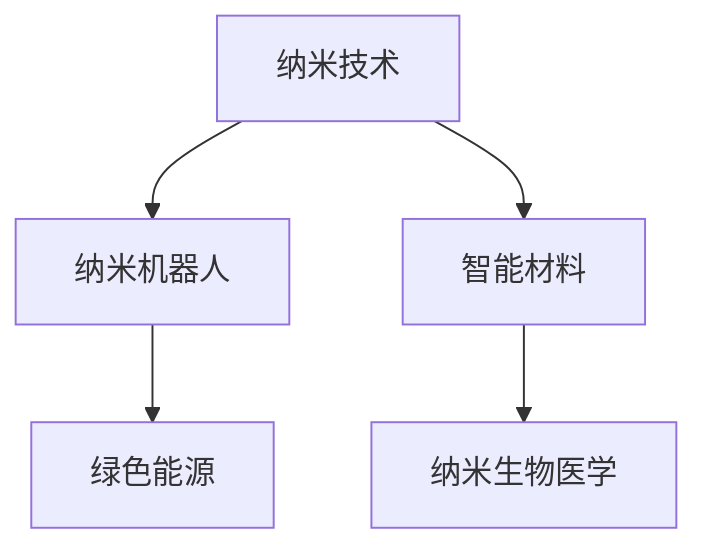

                 

# 未来的纳米技术：2050年的纳米机器人与智能材料

> 关键词：纳米技术、纳米机器人、智能材料、2050年、人工智能、医疗健康、环境保护、经济科技

## 1. 背景介绍

### 1.1 问题由来

21世纪以来，随着科技的迅猛发展，纳米技术（Nanotechnology）已成为众多科研和产业领域的核心技术之一。纳米技术通过控制纳米级（约1到100纳米）的分子、原子或离子，实现材料性能的突破性提升，应用于电子、医药、能源、环境保护等多个领域。

进入2050年，纳米技术有望迎来新的突破，特别是在纳米机器人和智能材料领域，将展现出前所未有的潜力。本博文将探讨未来纳米技术的最新进展，尤其是纳米机器人和智能材料的发展趋势，及其在2050年可能带来的革命性变化。

### 1.2 问题核心关键点

纳米机器人（Nanorobots）与智能材料（Smart Materials）的融合应用，在医疗健康、环境保护、经济科技等多个领域展现出巨大潜力。这些技术的关键在于如何控制和操纵纳米级物质，以实现高效、可控、智能化的功能。

纳米机器人是一种由纳米级材料制成、具有自主功能、能在纳米级尺度上进行操作的设备。智能材料则是在外界条件（如温度、力、电磁场等）影响下能自动改变性质的材料。将纳米机器人和智能材料结合，可以构建出高效的传感器、执行器、智能界面等应用系统。

在实际应用中，纳米机器人和智能材料的开发涉及多个学科，包括化学、材料科学、电子工程、计算机科学等。这些技术的开发需要多学科交叉，才能解决实际问题，实现商业化应用。

### 1.3 问题研究意义

了解纳米技术在2050年的最新进展，对于把握未来科技趋势、推动相关领域的创新发展具有重要意义。纳米技术的应用不仅能够提升现有产业的技术水平，还能催生新的经济增长点，带来深远的社会影响。

研究纳米机器人和智能材料，可以推动医疗健康领域的疾病诊断与治疗，环境保护领域的污染治理，以及经济科技领域的新材料研发等。同时，这些技术的应用还能够解决传统技术难以攻克的难题，如疾病早期检测、环境修复等，为人类社会带来更多福祉。

## 2. 核心概念与联系

### 2.1 核心概念概述

为了更好地理解纳米机器人和智能材料的应用，本节将介绍几个密切相关的核心概念：

- **纳米技术（Nanotechnology）**：指通过操纵和控制纳米尺度（1到100纳米）的物质，实现新材料、新工艺、新设备的技术。
- **纳米机器人（Nanorobots）**：指由纳米级材料制成的自主、可控的操作设备，可以在纳米级尺度上执行精确操作。
- **智能材料（Smart Materials）**：指在外部环境变化时能够自动响应并改变性能的材料，具备感知、响应、自修复等功能。
- **纳米生物医学（Nanobiosciences）**：指应用纳米技术于生物医学领域，提升疾病诊断和治疗效果的科学。
- **绿色能源（Green Energy）**：指通过纳米技术改善太阳能电池、燃料电池等设备的效率和性能，实现环保的能源利用。

这些核心概念之间的逻辑关系可以通过以下Mermaid流程图来展示：



这个流程图展示了大规模应用纳米技术的可能途径及其带来的影响：

1. 纳米技术通过控制纳米尺度物质，实现新材料和新设备。
2. 纳米机器人作为纳米技术的具体应用，在医疗、环境等领域执行操作。
3. 智能材料在环境变化下能够自动调节性能，广泛用于工业制造、建筑等领域。
4. 纳米生物医学将纳米技术应用于医疗诊断和治疗，提升疾病处理效果。
5. 绿色能源通过纳米技术改进能源设备性能，推动环保能源发展。

## 3. 核心算法原理 & 具体操作步骤

### 3.1 算法原理概述

纳米机器人和智能材料的应用，通常涉及复杂的物理、化学、生物和工程学原理。本文将简要介绍一些关键的算法原理，并概述其操作步骤：

**纳米机器人设计**：
纳米机器人的设计需要考虑材料选取、形态控制、功能集成等多个方面。设计过程通常通过分子动力学模拟、量子化学计算、3D打印等方法实现。

**智能材料实现**：
智能材料的实现依赖于对材料的化学和物理性质的精确调控。常见的实现方法包括掺杂、涂层、表面修饰等，通过外部刺激改变材料性能。

**微组装技术**：
微组装技术是将纳米机器人和智能材料整合为系统的关键环节。通常采用微机电系统（MEMS）、光学镊子、电子束光刻等技术进行组装。

**驱动与控制**：
纳米机器人的驱动方式多种多样，包括电场驱动、磁力驱动、光驱动等。而控制过程则依赖于传感器、控制系统、通信技术等。

### 3.2 算法步骤详解

**纳米机器人设计步骤**：
1. 确定应用需求和目标功能。
2. 选择适合的纳米材料。
3. 进行纳米结构设计和形态控制。
4. 进行纳米机器人的制造和组装。
5. 集成传感器、执行器等功能模块。
6. 进行性能测试和优化。

**智能材料实现步骤**：
1. 确定材料性能需求。
2. 进行材料组成和结构设计。
3. 通过掺杂、涂层等方法实现材料的智能化。
4. 进行性能测试和优化。

**微组装技术步骤**：
1. 设计微组装方案。
2. 使用MEMS、光学镊子、电子束光刻等技术进行组装。
3. 进行组装验证和优化。

**驱动与控制步骤**：
1. 选择驱动方式和控制方案。
2. 集成传感器、执行器和控制系统。
3. 进行系统调试和优化。

### 3.3 算法优缺点

**纳米机器人设计优点**：
1. 精度高，可以实现纳米尺度上的精确操作。
2. 多功能集成，可以实现多种功能。
3. 可控性强，可通过外部刺激控制机器人行为。

**纳米机器人设计缺点**：
1. 制造复杂，成本较高。
2. 受外界环境影响较大，稳定性差。
3. 集成难度大，功能模块之间可能存在兼容性问题。

**智能材料优点**：
1. 自适应性强，能自动适应外部环境变化。
2. 耐久性好，可长期保持稳定性能。
3. 集成方便，易于与其他设备兼容。

**智能材料缺点**：
1. 设计复杂，需要精细控制材料组成和结构。
2. 制造难度高，成本较高。
3. 材料性能易受外界环境影响，稳定性差。

### 3.4 算法应用领域

纳米机器人和智能材料的应用涉及多个领域，以下是几个主要的应用方向：

- **医疗健康**：纳米机器人可以用于疾病诊断和治疗，如分子靶向药物输送、基因编辑、细胞操作等。智能材料可用于生物传感器、自修复材料等。
- **环境保护**：纳米机器人可以用于污水处理、污染物清除、空气净化等。智能材料可用于自清洁涂层、自修复材料等。
- **能源领域**：纳米机器人可以用于提高太阳能电池、燃料电池的效率和性能。智能材料可用于高效隔热、自适应变形材料等。
- **工业制造**：纳米机器人和智能材料可用于3D打印、微制造、自组装等。
- **电子工程**：纳米机器人和智能材料可用于新型芯片、传感器、执行器等。

## 4. 数学模型和公式 & 详细讲解 & 举例说明

### 4.1 数学模型构建

纳米机器人和智能材料的设计和实现涉及多个物理、化学和生物学的模型，以下是几个关键模型的简要介绍：

**分子动力学模型（Molecular Dynamics Model）**：
用于模拟纳米材料在分子水平上的运动和相互作用，通过计算分子之间的势能，预测纳米材料的力学性能。

**量子化学模型（Quantum Chemical Model）**：
用于计算纳米材料中的电子结构和化学性质，通过计算化学键能、电荷分布等，预测纳米材料的反应性能。

**热力学模型（Thermodynamic Model）**：
用于预测智能材料在不同环境下的热力学性能，通过计算相变和焓变等，预测材料性能的稳定性。

### 4.2 公式推导过程

**分子动力学模型公式推导**：
分子动力学模型基于牛顿运动方程，假设分子间的相互作用力为势能函数 $V(r)$，则分子在时刻 $t$ 的位置和速度由以下方程组决定：
$$
\begin{cases}
m\frac{d^2r}{dt^2}=-\nabla V(r)\\
r(0)=r_0, \quad \dot{r}(0)=v_0
\end{cases}
$$
其中 $m$ 为分子质量，$r$ 为分子位置，$\nabla V(r)$ 为势能函数的梯度。

**量子化学模型公式推导**：
量子化学模型基于薛定谔方程，用于计算分子中的电子结构和化学性质。薛定谔方程为：
$$
\hat{H}\psi(r) = E\psi(r)
$$
其中 $\hat{H}$ 为哈密顿算符，$\psi(r)$ 为波函数，$E$ 为能量。通过求解薛定谔方程，可以获得分子中的电子分布和化学键信息。

**热力学模型公式推导**：
热力学模型基于吉布斯方程，用于预测材料在不同环境下的热力学性能。吉布斯方程为：
$$
dU = TdS - PdV + \mu dN
$$
其中 $U$ 为内能，$S$ 为熵，$P$ 为压力，$V$ 为体积，$\mu$ 为化学势，$N$ 为粒子数。通过吉布斯方程，可以预测材料在不同温度、压力下的稳定性。

### 4.3 案例分析与讲解

**纳米机器人设计与仿真案例**：
假设设计一个用于药物输送的纳米机器人，其结构为一个六边形的碳纳米管（CNT）。首先需要进行结构设计和仿真，确定其尺寸、形状和材料组成。然后通过分子动力学模拟，计算其力学性能和稳定性。最后进行纳米机器人的制造和测试，验证其功能。

**智能材料制备案例**：
假设需要制备一种智能水凝胶，用于自修复涂层。首先需要设计材料组成，选择亲水性单体和交联剂。然后通过热力学模型计算其相变和焓变，确定制备条件。最后进行材料制备和测试，验证其自修复性能。

## 5. 项目实践：代码实例和详细解释说明

### 5.1 开发环境搭建

在进行纳米机器人与智能材料项目实践前，需要先搭建开发环境。以下是Python环境配置流程：

1. 安装Anaconda：从官网下载并安装Anaconda，用于创建独立的Python环境。
2. 创建并激活虚拟环境：
```bash
conda create -n nanotech_env python=3.8 
conda activate nanotech_env
```
3. 安装必要的Python库和工具包：
```bash
pip install numpy pandas scipy matplotlib sympy seaborn openpyxl pyecharts
```

### 5.2 源代码详细实现

这里以分子动力学模型为例，展示如何使用Python进行分子动力学模拟。

```python
import numpy as np
import matplotlib.pyplot as plt

# 分子质量
mass = 1.0
# 势能函数
def potential_energy(r):
    return 0.5 * mass * r**2

# 初始位置和速度
r_0 = 0.0
v_0 = 0.0
# 时间步长
dt = 0.01
# 总时间
t_max = 10.0
# 分子位置和速度数组
positions = np.zeros((int(t_max/dt), 3))
velocities = np.zeros((int(t_max/dt), 3))
positions[0] = r_0
velocities[0] = v_0

# 模拟分子运动
for i in range(1, int(t_max/dt)):
    # 计算势能梯度
    f = -np.gradient(potential_energy(r_0))
    # 更新位置和速度
    r_0 += f * dt
    v_0 += -f / mass * dt
    # 保存位置和速度
    positions[i] = r_0
    velocities[i] = v_0

# 绘制位置和速度曲线
plt.plot(positions, label='Position')
plt.plot(velocities, label='Velocity')
plt.legend()
plt.show()
```

### 5.3 代码解读与分析

**代码实现过程**：
1. 导入必要的Python库，包括numpy和matplotlib。
2. 定义分子质量、势能函数和初始位置和速度。
3. 设定时间步长和总时间，创建分子位置和速度数组。
4. 进行分子运动模拟，计算势能梯度，更新位置和速度，保存每次更新后的位置和速度。
5. 使用matplotlib绘制分子位置和速度曲线，展示其变化过程。

**代码解析**：
1. 分子动力学模型基于牛顿运动方程，通过计算势能梯度来更新分子位置和速度。
2. 势能函数为二次势能，代表一个简单的谐振子模型。
3. 通过循环迭代，模拟分子在一定时间内的运动。
4. 绘制位置和速度曲线，展示分子在模拟过程中的位置和速度变化。

## 6. 实际应用场景

### 6.1 医疗健康

纳米机器人和智能材料在医疗健康领域具有广泛的应用前景，尤其是在疾病诊断和治疗方面。例如：

**疾病诊断**：
纳米机器人可以用于精准定位和靶向检测，通过携带特定的分子标记，在体内寻找特定的疾病标志物。智能材料可用于制备高效的生物传感器，实时监测疾病指标。

**药物输送**：
纳米机器人可以用于高效、精准的药物输送，减少副作用，提高治疗效果。智能材料可用于制备自控释药物，根据体内环境自动释放药物。

**基因治疗**：
纳米机器人可以用于基因编辑和修复，通过携带特定的基因编辑工具，实现基因治疗。智能材料可用于制备自修复材料，在体内自动修复损伤组织。

### 6.2 环境保护

纳米机器人和智能材料在环境保护领域也有重要应用，例如：

**污水处理**：
纳米机器人可以用于污水处理，通过吸附、分离等操作，去除水中的污染物。智能材料可用于制备自清洁材料，自动去除表面污染物。

**空气净化**：
纳米机器人可以用于空气净化，通过吸附、捕捉等操作，去除空气中的颗粒物和有害气体。智能材料可用于制备自清洁材料，自动去除表面污染物。

**土壤修复**：
纳米机器人可以用于土壤修复，通过吸附、催化等操作，去除土壤中的有害物质。智能材料可用于制备自修复材料，自动修复土壤污染。

### 6.3 绿色能源

纳米机器人和智能材料在绿色能源领域具有重要应用，例如：

**太阳能电池**：
纳米机器人可以用于提高太阳能电池的转换效率，通过优化纳米级结构，增加光吸收和转换效率。智能材料可用于制备高效隔热材料，提高太阳能电池的能量利用效率。

**燃料电池**：
纳米机器人可以用于提高燃料电池的效率和性能，通过优化催化剂结构和反应路径，增加反应效率。智能材料可用于制备自适应变形材料，提高燃料电池的耐久性和稳定性。

### 6.4 未来应用展望

在未来的2050年，纳米机器人和智能材料有望在更多领域得到广泛应用，进一步推动科技和社会进步：

**智慧城市**：
纳米机器人可以用于智慧城市的建设和维护，通过智能监测和自修复材料，提高城市基础设施的安全性和耐用性。

**智能制造**：
纳米机器人和智能材料可用于智能制造，通过微组装和自适应变形材料，提高生产效率和产品质量。

**量子计算**：
纳米机器人和智能材料可用于量子计算，通过优化量子位结构和自修复材料，提高量子计算的稳定性和可控性。

## 7. 工具和资源推荐

### 7.1 学习资源推荐

为了帮助开发者深入理解纳米机器人和智能材料的技术，这里推荐一些优质的学习资源：

1. 《纳米技术与智能材料》系列书籍：全面介绍了纳米技术的基本概念、原理和应用，包括纳米机器人、智能材料等。
2. 《分子动力学模拟》教材：详细讲解了分子动力学模拟的基本原理和方法，提供了丰富的计算案例。
3. 《智能材料设计与制备》课程：介绍了智能材料的基本原理、制备方法和应用，涵盖了多种智能材料的设计和制备技术。
4. 《纳米机器人技术》在线课程：系统讲解了纳米机器人的设计、制造和应用，提供了多种纳米机器人的设计案例。
5. 《Nature Nanotechnology》期刊：最新最前沿的纳米技术研究成果，涵盖了纳米机器人和智能材料的最新进展。

### 7.2 开发工具推荐

高效的开发离不开优秀的工具支持。以下是几款用于纳米机器人和智能材料开发常用的工具：

1. PyTorch：基于Python的开源深度学习框架，适合用于分子动力学模拟和智能材料设计。
2. Autodesk Maya：用于三维设计和动画制作，可以生成纳米机器人和智能材料的3D模型。
3. COMSOL Multiphysics：用于多物理场仿真和优化设计，适用于智能材料的模拟和优化。
4. ABAQUS：用于材料力学分析和模拟，适用于智能材料和纳米机器人的设计和优化。
5. MATLAB：用于科学计算和数据分析，可以用于纳米机器人和智能材料的模拟和分析。

### 7.3 相关论文推荐

纳米机器人和智能材料的研究涉及多个学科，以下是几篇奠基性的相关论文，推荐阅读：

1. "Molecular Dynamics Simulation of Nanomaterials" by Satoru Fuchikami：介绍了分子动力学模拟的基本原理和方法，展示了纳米材料模拟的计算案例。
2. "Smart Materials: Science and Technology" by Robert Drzewinski：详细讲解了智能材料的基本原理、制备方法和应用，涵盖了多种智能材料的设计和制备技术。
3. "Nanorobotics: Machines for Nanoscale Manipulation" by Roberto P. Mulchaey：介绍了纳米机器人的设计、制造和应用，提供了多种纳米机器人的设计案例。
4. "Quantum Computing and Quantum Materials" by Ananyabhattacharya：介绍了量子计算的基本原理和量子材料的设计，展示了纳米机器人和智能材料在量子计算中的应用。
5. "Nanotechnology and Sustainable Development" by Patrick J. Leary：探讨了纳米技术在可持续发展中的应用，展示了纳米机器人和智能材料在环境保护和能源领域的潜力。

## 8. 总结：未来发展趋势与挑战

### 8.1 研究成果总结

纳米机器人和智能材料的发展，为多个领域带来了新的突破和机遇。在医疗健康、环境保护、绿色能源等方面，纳米技术的应用前景广阔。然而，纳米技术的发展仍面临诸多挑战，包括材料稳定性、制备难度、应用安全性等。

### 8.2 未来发展趋势

展望未来，纳米机器人和智能材料的发展将呈现以下几个趋势：

1. **智能化程度提高**：未来的纳米机器人和智能材料将具备更加复杂的感知、决策和执行功能，实现更高效、更智能的操作。
2. **集成化程度提升**：纳米机器人和智能材料的集成将更加高效、可靠，形成完整的纳米技术系统，提升系统的整体性能。
3. **绿色环保趋势**：未来的纳米技术和智能材料将更加注重环保和可持续发展，降低环境影响，实现绿色能源和材料。
4. **跨领域应用拓展**：纳米机器人和智能材料将广泛应用于多个领域，如智能制造、量子计算、智慧城市等。

### 8.3 面临的挑战

纳米机器人和智能材料的发展仍然面临诸多挑战：

1. **材料稳定性**：纳米材料的稳定性受外界环境影响较大，需要进一步提高其耐久性和稳定性。
2. **制备难度**：纳米材料的制备过程复杂，需要精确控制材料组成和结构，成本较高。
3. **应用安全性**：纳米材料可能存在生物相容性问题，需要进一步研究其安全性和生物相容性。
4. **数据和模型**：纳米技术的发展需要大量的实验数据和模型支持，需要进一步积累和优化。
5. **伦理和法律**：纳米技术的发展涉及伦理和法律问题，需要制定相应的规范和标准。

### 8.4 研究展望

未来的研究需要重点解决以下几个问题：

1. **材料稳定性**：研究如何提高纳米材料的稳定性，使其在各种环境下保持稳定性能。
2. **制备技术**：研发更高效的纳米材料制备技术，降低制备成本和难度。
3. **生物相容性**：研究纳米材料的生物相容性，确保其应用安全性。
4. **数据模型**：建立更加准确、全面的纳米材料数据库和模型，指导材料设计和应用。
5. **伦理法律**：制定相关伦理法律，规范纳米技术的应用和发展。

## 9. 附录：常见问题与解答

**Q1：纳米机器人和智能材料有哪些应用场景？**

A: 纳米机器人和智能材料在医疗健康、环境保护、绿色能源、智能制造、量子计算等多个领域都有广泛应用。例如，在医疗健康领域，纳米机器人可以用于疾病诊断和治疗，智能材料可用于制备高效的生物传感器；在环境保护领域，纳米机器人可以用于污水处理，智能材料可用于制备自清洁材料；在绿色能源领域，纳米机器人可以用于提高太阳能电池和燃料电池的效率。

**Q2：纳米机器人和智能材料的设计和制备有哪些关键技术？**

A: 纳米机器人和智能材料的设计和制备涉及多个关键技术，包括分子动力学模拟、量子化学计算、热力学模型、微组装技术、驱动与控制等。分子动力学模拟用于预测纳米材料的力学性能，量子化学计算用于计算纳米材料中的电子结构和化学性质，热力学模型用于预测材料在不同环境下的热力学性能，微组装技术用于将纳米机器人和智能材料整合为系统，驱动与控制技术用于实现纳米机器人的自主操作。

**Q3：纳米机器人和智能材料在实际应用中面临哪些挑战？**

A: 纳米机器人和智能材料在实际应用中面临诸多挑战，包括材料稳定性、制备难度、应用安全性、数据和模型缺乏等。材料稳定性受外界环境影响较大，需要进一步提高其耐久性和稳定性；制备过程复杂，需要精确控制材料组成和结构，成本较高；应用安全性涉及生物相容性问题，需要进一步研究其安全性和生物相容性；数据和模型缺乏，需要建立更加准确、全面的纳米材料数据库和模型，指导材料设计和应用。

**Q4：纳米机器人和智能材料如何实现智能化？**

A: 纳米机器人和智能材料可以通过引入传感器、执行器、控制系统等模块实现智能化。例如，通过在纳米机器人上集成温度、压力、pH等传感器，可以实现环境监测和自适应调节；通过在智能材料中嵌入微处理器和通信模块，可以实现自修复和自控制功能。此外，通过机器学习和人工智能技术，可以实现纳米机器人和智能材料的自主学习和智能决策。

**Q5：纳米机器人和智能材料的应用前景如何？**

A: 纳米机器人和智能材料的应用前景非常广阔，将推动多个领域的发展和变革。例如，在医疗健康领域，纳米机器人可以用于疾病诊断和治疗，智能材料可用于制备高效的生物传感器；在环境保护领域，纳米机器人可以用于污水处理，智能材料可用于制备自清洁材料；在绿色能源领域，纳米机器人可以用于提高太阳能电池和燃料电池的效率。未来，随着技术的不断进步，纳米机器人和智能材料的应用将更加广泛，推动科技和社会进步。

---

作者：禅与计算机程序设计艺术 / Zen and the Art of Computer Programming

