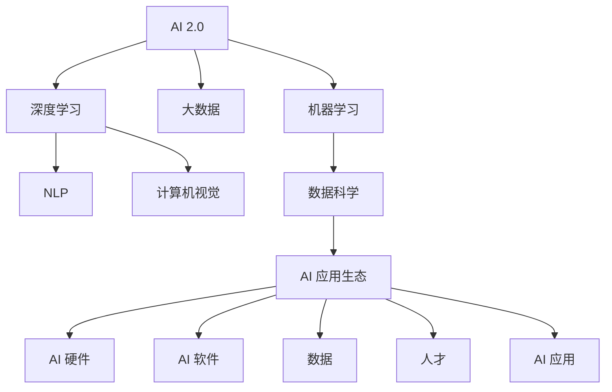

                 

# 李开复：AI 2.0 时代的市场

> 关键词：人工智能, AI 2.0, 人工智能市场, AI 应用, 数据科学, 大数据, 深度学习, 人工智能伦理

## 1. 背景介绍

### 1.1 问题由来

自20世纪90年代以来，人工智能（AI）经历了数次重大突破和应用普及。从最初基于规则的专家系统，到后来以知识为基础的推理系统，再到21世纪初的机器学习与深度学习大行其道，AI 技术正以前所未有的速度和规模改变着各行各业。

当前，AI 正迈向一个新的阶段：AI 2.0，这是一个以数据科学、机器学习、深度学习为核心的时代。AI 2.0 不再依赖于专家知识，而是通过大量数据和计算能力来发现规律，并自我学习与优化。这一阶段，AI 技术已经深入到日常生活的各个方面，包括医疗、金融、教育、制造业、交通运输等领域。

### 1.2 问题核心关键点

AI 2.0 时代的市场呈现出一些独特的特征与趋势：

1. **数据与算力为核心竞争力**：AI 2.0 的核心在于数据与算力，它们是驱动AI技术进步与创新的关键因素。
2. **算法与模型多样化**：AI 2.0 中使用的算法与模型种类繁多，从传统的线性回归、支持向量机到复杂的分层神经网络与深度学习框架。
3. **跨领域应用广泛**：AI 2.0 不仅限于传统的科技领域，如金融、医疗、教育，还在更多传统行业中得到应用，如农业、物流、零售等。
4. **伦理与社会影响深刻**：AI 2.0 在带来便利与效率的同时，也引发了关于隐私、伦理、就业等诸多社会问题。
5. **开放与合作为主导**：AI 2.0 市场正从封闭走向开放，企业与学术界的合作更加紧密。

### 1.3 问题研究意义

研究AI 2.0 时代的市场，有助于全面理解当前及未来AI技术的发展趋势与商业应用模式。通过分析AI市场现状与挑战，能够为从业者提供更有价值的洞察与建议，指导AI技术的应用与投资决策。

## 2. 核心概念与联系

### 2.1 核心概念概述

为更好地理解AI 2.0 市场的整体框架，本节将介绍几个核心概念及其相互关联：

- **AI 2.0**：AI 2.0 时代，以数据科学、机器学习、深度学习为核心的AI技术，强调通过大量数据与计算能力来发现规律与自我学习。
- **深度学习**：一种基于多层神经网络模型，利用大量数据进行训练，具有强大的特征提取与表达能力的AI技术。
- **大数据**：指规模庞大的数据集，通常超过传统数据库管理工具的容量限制。大数据技术为深度学习等AI应用提供了坚实的基础。
- **机器学习**：通过让机器从数据中学习规律，使机器具备自主决策与预测的能力。机器学习算法主要包括监督学习、无监督学习和强化学习等。
- **自然语言处理（NLP）**：使机器能够理解与生成人类语言的技术，是AI 2.0 中的重要应用领域之一。
- **计算机视觉**：使机器能够识别与理解图像与视频的技术，广泛应用于自动驾驶、医学影像分析等领域。
- **数据科学**：研究数据的收集、清洗、处理、分析与应用，为AI 2.0 提供强有力的数据支持。
- **AI 应用生态**：包括AI硬件、软件、数据、人才、应用等多个方面，形成完整的生态系统。

这些概念通过以下Mermaid流程图连接起来：



## 3. 核心算法原理 & 具体操作步骤
### 3.1 算法原理概述

AI 2.0 中的核心算法原理主要围绕着深度学习与机器学习展开。深度学习通过多层神经网络对复杂数据进行建模与预测，具有强大的泛化能力与表现力。机器学习则通过训练模型，使其从数据中学习规律，并进行预测或分类。

AI 2.0 中常用的算法包括：

- **监督学习**：利用有标签的数据进行训练，使模型能够预测新的未知标签数据。
- **无监督学习**：处理无标签的数据，发现数据中的结构与模式。
- **强化学习**：通过与环境的互动，优化策略，实现自动决策与控制。

### 3.2 算法步骤详解

AI 2.0 中的算法步骤主要包括数据准备、模型训练、评估与优化、应用部署等环节。

1. **数据准备**：收集、清洗、标注数据集，确保数据的质量与多样性。
2. **模型训练**：选择合适的算法与模型，利用数据集进行训练，优化模型参数。
3. **评估与优化**：在测试集上评估模型性能，根据结果进行调整与优化。
4. **应用部署**：将训练好的模型部署到实际应用中，进行持续监控与更新。

### 3.3 算法优缺点

AI 2.0 中的算法优点包括：

- **高精度与泛化能力**：深度学习与机器学习算法在处理复杂数据时具有较高的精度与泛化能力。
- **自动化与自适应**：通过学习数据规律，AI 算法能够实现自动化决策与自适应优化。
- **可扩展性与可重用性**：算法与模型通常具有良好的可扩展性与可重用性，可以在不同场景中进行复用。

同时，这些算法也存在一些局限：

- **数据依赖性强**：算法效果高度依赖于数据质量与量，高质量数据的获取成本较高。
- **计算资源需求高**：深度学习算法通常需要大量的计算资源与存储空间。
- **模型复杂度**：深度学习模型复杂度较高，训练与优化过程耗时较长。
- **可解释性不足**：部分算法的决策过程缺乏透明性与可解释性，难以理解其内部逻辑。

### 3.4 算法应用领域

AI 2.0 算法在多个领域中得到了广泛应用，主要包括以下几个方面：

1. **自然语言处理**：包括机器翻译、情感分析、文本生成、问答系统等。
2. **计算机视觉**：包括图像识别、目标检测、人脸识别、自动驾驶等。
3. **智能推荐**：包括电商推荐、内容推荐、广告推荐等。
4. **医疗健康**：包括影像诊断、药物研发、个性化治疗等。
5. **金融服务**：包括信用评分、风险管理、投资分析等。
6. **制造业**：包括智能制造、质量控制、供应链优化等。
7. **智慧城市**：包括智能交通、环境监测、公共安全等。

## 4. 数学模型和公式 & 详细讲解 & 举例说明
### 4.1 数学模型构建

AI 2.0 中常用的数学模型主要包括线性回归、支持向量机、神经网络等。这里以线性回归模型为例进行详细讲解。

假设数据集为 $(x_i, y_i)$，其中 $x_i$ 为自变量，$y_i$ 为因变量。线性回归模型的目标是通过拟合一个线性函数 $f(x)=\theta_0+\theta_1x+\epsilon$，最小化预测误差 $\epsilon$。模型的损失函数为均方误差：

$$
\mathcal{L}(\theta)=\frac{1}{2N}\sum_{i=1}^N(y_i-f(x_i))^2
$$

其中 $N$ 为样本数量，$\theta_0$ 与 $\theta_1$ 为模型参数。

### 4.2 公式推导过程

线性回归模型的参数估计可以通过最小二乘法求解。推导过程如下：

1. 计算预测误差平方和：

$$
J(\theta)=\frac{1}{2N}\sum_{i=1}^N(y_i-f(x_i))^2=\frac{1}{2N}\sum_{i=1}^N(y_i-\theta_0-\theta_1x_i)^2
$$

2. 对 $\theta_0$ 与 $\theta_1$ 求偏导数：

$$
\frac{\partial J}{\partial \theta_0}=-\frac{1}{N}\sum_{i=1}^N(y_i-\theta_0-\theta_1x_i)=-\bar{y}+\theta_0+\theta_1\bar{x}=0
$$

$$
\frac{\partial J}{\partial \theta_1}=-\frac{1}{N}\sum_{i=1}^N(y_i-\theta_0-\theta_1x_i)x_i=-\bar{x}\bar{y}+\theta_0+\theta_1\bar{x}^2=0
$$

3. 求解线性方程组：

$$
\left\{
\begin{aligned}
\bar{y}-\theta_0-\theta_1\bar{x}&=0\\
-\bar{x}\bar{y}+\theta_0+\theta_1\bar{x}^2&=0
\end{aligned}
\right.
$$

求解得：

$$
\theta_0=\bar{y}-\theta_1\bar{x}, \quad \theta_1=\frac{\sum_{i=1}^N(x_i-\bar{x})(y_i-\bar{y})}{\sum_{i=1}^N(x_i-\bar{x})^2}
$$

### 4.3 案例分析与讲解

以下通过一个简单的例子来说明线性回归模型的应用。

假设我们有一组数据集，其中 $x$ 表示学生的学习时间，$y$ 表示学生的考试成绩。我们希望通过线性回归模型来预测学生的成绩。

```python
import numpy as np
from sklearn.linear_model import LinearRegression

# 构造数据集
X = np.array([[1, 2], [2, 4], [3, 6], [4, 8], [5, 10]])
y = np.array([10, 20, 30, 40, 50])

# 创建线性回归模型
model = LinearRegression()

# 拟合模型
model.fit(X, y)

# 预测新数据
X_new = np.array([[6, 12]])
y_new = model.predict(X_new)

print("预测值：", y_new)
```

通过上述代码，我们可以得到模型的参数 $\theta_0$ 与 $\theta_1$，从而预测新数据点 $X_{new}=[6, 12]$ 的成绩。

## 5. 项目实践：代码实例和详细解释说明
### 5.1 开发环境搭建

在进行AI 2.0 实践前，我们需要准备好开发环境。以下是使用Python进行Scikit-Learn与TensorFlow开发的常见环境配置流程：

1. 安装Anaconda：从官网下载并安装Anaconda，用于创建独立的Python环境。

2. 创建并激活虚拟环境：
```bash
conda create -n py-env python=3.7 
conda activate py-env
```

3. 安装必要的库：
```bash
pip install numpy pandas scikit-learn tensorflow
```

4. 安装TensorBoard与Weights & Biases：
```bash
pip install tensorboard
pip install wandb
```

5. 安装Jupyter Notebook：
```bash
conda install jupyterlab
```

完成上述步骤后，即可在`py-env`环境中开始AI 2.0实践。

### 5.2 源代码详细实现

这里以一个简单的文本分类任务为例，给出使用Scikit-Learn进行线性回归的代码实现。

首先，定义数据集：

```python
from sklearn.datasets import load_iris
from sklearn.model_selection import train_test_split

iris = load_iris()
X, y = iris.data, iris.target
X_train, X_test, y_train, y_test = train_test_split(X, y, test_size=0.2, random_state=42)
```

然后，定义线性回归模型并进行训练：

```python
from sklearn.linear_model import LinearRegression

model = LinearRegression()
model.fit(X_train, y_train)
```

接着，评估模型性能：

```python
from sklearn.metrics import accuracy_score

y_pred = model.predict(X_test)
accuracy = accuracy_score(y_test, y_pred)
print("准确率：", accuracy)
```

最后，可视化模型训练过程：

```python
from sklearn.linear_model import LinearRegression
from sklearn.metrics import mean_squared_error
from sklearn.model_selection import train_test_split
from sklearn.datasets import load_boston
import matplotlib.pyplot as plt

# 加载数据集
boston = load_boston()

# 分割数据集
X_train, X_test, y_train, y_test = train_test_split(boston.data, boston.target, test_size=0.2, random_state=42)

# 创建线性回归模型
model = LinearRegression()

# 训练模型
model.fit(X_train, y_train)

# 评估模型
y_pred = model.predict(X_test)
rmse = mean_squared_error(y_test, y_pred, squared=False)

# 可视化训练过程
plt.plot(model.coef_)
plt.title('系数随迭代次数变化')
plt.xlabel('迭代次数')
plt.ylabel('系数值')
plt.show()
```

以上就是使用Scikit-Learn进行线性回归的完整代码实现。

### 5.3 代码解读与分析

这里我们详细解读一下关键代码的实现细节：

- **数据集加载**：使用Scikit-Learn内置的`load_iris`函数加载鸢尾花数据集，分割数据集为训练集与测试集。
- **模型创建与训练**：创建线性回归模型，使用训练集进行拟合。
- **模型评估**：使用测试集进行预测，计算准确率。
- **可视化训练过程**：使用Matplotlib库绘制线性回归模型的训练过程，观察系数随迭代次数的变化。

## 6. 实际应用场景

### 6.1 智能推荐系统

AI 2.0 技术在智能推荐系统中得到了广泛应用。传统的推荐系统主要依赖用户的浏览历史、购买记录等行为数据进行推荐。而AI 2.0 中的深度学习模型能够从文本描述、图片、视频等多种数据源中提取信息，进行综合推荐，提供更加个性化的用户体验。

例如，电商推荐系统可以通过分析用户的商品评价、产品详情页信息等，进行精准推荐，提升用户满意度与购买转化率。

### 6.2 医疗健康

AI 2.0 在医疗健康领域的应用也逐渐增多。通过深度学习模型，可以分析医学影像、基因数据、电子病历等信息，辅助医生进行诊断、治疗、药物研发等工作。

例如，基于图像识别的AI模型可以自动识别X光片中的肺部结节，辅助放射科医生进行诊断。通过基因组分析，AI模型可以预测患病风险，为个性化治疗提供科学依据。

### 6.3 金融服务

AI 2.0 在金融服务中的应用同样广泛。通过深度学习模型，可以对金融市场数据进行预测与分析，辅助金融决策与风险控制。

例如，使用神经网络模型可以对股票价格进行预测，辅助投资决策。通过情感分析技术，可以实时监控社交媒体对某事件的情绪反应，评估市场情绪与风险。

### 6.4 未来应用展望

随着AI 2.0 技术的不断成熟，未来的应用前景将更加广阔。以下列举几个未来可能的趋势：

1. **跨模态智能**：AI 2.0 技术将进一步融合视觉、语音、文本等多种模态信息，实现跨模态智能。例如，通过融合视觉与文本信息，可以提升自动驾驶的安全性与智能化水平。

2. **泛在智能**：AI 2.0 将逐渐普及到更多消费品中，形成泛在智能系统。例如，智能家居、智能音箱、智能手表等产品，将更加智能化与便捷化。

3. **人机协同**：AI 2.0 技术将与人类更加紧密地协作，提升工作效率与创新能力。例如，智能客服、智能创作助手等产品，将进一步提升人类的工作效率与创新能力。

4. **伦理与隐私**：AI 2.0 技术的应用将更加注重伦理与隐私保护。例如，在人脸识别、语音识别等领域，需要加强对用户隐私的保护，防止数据滥用。

## 7. 工具和资源推荐
### 7.1 学习资源推荐

为帮助开发者系统掌握AI 2.0的理论基础与实践技巧，这里推荐一些优质的学习资源：

1. 《深度学习》（Goodfellow et al.）：经典深度学习教材，全面介绍深度学习的基本概念与算法。
2. 《Python机器学习》（Raschka et al.）：实用Python机器学习指南，涵盖从数据预处理到模型训练的完整流程。
3. 《统计学习方法》（李航）：系统介绍机器学习的基本原理与算法，包括监督学习、无监督学习、半监督学习等。
4. 《TensorFlow官方文档》：TensorFlow的官方文档，提供详细的API介绍与案例实践。
5. Kaggle：数据科学竞赛平台，提供大量实际案例与竞赛机会，帮助你提升实战能力。

通过对这些资源的学习实践，相信你一定能够快速掌握AI 2.0的精髓，并用于解决实际的AI问题。

### 7.2 开发工具推荐

高效的开发离不开优秀的工具支持。以下是几款用于AI 2.0开发的常用工具：

1. Jupyter Notebook：交互式Python开发环境，支持代码编写、数据可视化与实验记录。
2. PyTorch：基于Python的深度学习框架，具有动态计算图与丰富的API支持。
3. TensorFlow：Google开发的深度学习框架，支持分布式计算与GPU加速。
4. Scikit-Learn：Python数据科学库，包含丰富的机器学习算法与工具。
5. Weights & Biases：模型训练的实验跟踪工具，记录与可视化模型训练过程。
6. TensorBoard：TensorFlow配套的可视化工具，实时监测模型训练状态。

合理利用这些工具，可以显著提升AI 2.0开发的效率，加快创新迭代的步伐。

### 7.3 相关论文推荐

AI 2.0 的发展离不开学界的持续研究。以下是几篇奠基性的相关论文，推荐阅读：

1. AlexNet：首次在ImageNet数据集上取得优异表现的深度学习模型，奠定了深度学习在计算机视觉领域的应用基础。
2. ResNet：通过残差连接解决深度网络训练中的梯度消失问题，推动了深度学习的进一步发展。
3. VGGNet：提出了VGG网络结构，使深度学习在图像分类、目标检测等领域取得突破。
4. LSTM：解决循环神经网络中的梯度消失问题，提升了深度学习在自然语言处理等领域的效果。
5. GAN：生成对抗网络，提出了一种新型的生成模型，实现了高质量的图像生成与数据增强。

这些论文代表了大数据、深度学习与机器学习的发展脉络。通过学习这些前沿成果，可以帮助研究者把握学科前进方向，激发更多的创新灵感。

## 8. 总结：未来发展趋势与挑战
### 8.1 总结

本文对AI 2.0时代的市场进行了全面系统的介绍。首先阐述了AI 2.0的定义与核心竞争力，明确了AI 2.0在数据科学、机器学习、深度学习等方面的重要性。其次，从原理到实践，详细讲解了AI 2.0的算法原理与具体操作步骤，给出了AI 2.0任务开发的完整代码实例。同时，本文还广泛探讨了AI 2.0在推荐系统、医疗健康、金融服务等多个领域的应用前景，展示了AI 2.0范式的巨大潜力。此外，本文精选了AI 2.0技术的各类学习资源，力求为读者提供全方位的技术指引。

通过本文的系统梳理，可以看到，AI 2.0技术正在成为各行各业的重要驱动力，极大地提升了数据处理、决策分析与智能交互的能力。未来，伴随AI 2.0技术的不断演进，AI 2.0技术将在更多领域得到应用，为人类生产生活方式带来深远影响。

### 8.2 未来发展趋势

展望未来，AI 2.0技术将呈现以下几个发展趋势：

1. **技术融合**：AI 2.0技术将与更多前沿技术融合，如量子计算、区块链、物联网等，形成更强大的智能系统。
2. **应用普及**：AI 2.0技术将逐步普及到更多消费品与传统行业，形成泛在智能生态。
3. **伦理治理**：AI 2.0技术的应用将更加注重伦理与隐私保护，防止数据滥用与算法歧视。
4. **开放合作**：AI 2.0技术将更加开放与合作，推动跨领域、跨学科的研究与应用。

以上趋势凸显了AI 2.0技术的广阔前景。这些方向的探索发展，将进一步推动AI 2.0技术向更高层次演进，为人类认知智能的进化带来新的可能性。

### 8.3 面临的挑战

尽管AI 2.0技术已经取得了瞩目成就，但在迈向更加智能化、普适化应用的过程中，它仍面临着诸多挑战：

1. **数据隐私**：AI 2.0技术的应用需要大量数据，但数据隐私保护问题日益凸显，如何保护用户隐私是重要挑战。
2. **算法透明**：AI 2.0算法的决策过程通常缺乏透明性与可解释性，难以理解其内部逻辑，这也是一个重要问题。
3. **计算资源**：AI 2.0算法通常需要大量的计算资源与存储空间，如何在有限的资源下提升模型效果是难点之一。
4. **模型泛化**：AI 2.0模型在不同数据集上的泛化能力有限，如何提高模型的泛化性能是当前研究的热点。
5. **伦理安全**：AI 2.0技术在应用过程中可能引发伦理安全问题，如数据滥用、算法歧视等，需要更多的伦理保障措施。

### 8.4 研究展望

面对AI 2.0面临的诸多挑战，未来的研究需要在以下几个方面寻求新的突破：

1. **数据隐私保护**：开发更加高效、可靠的数据隐私保护技术，保护用户数据安全。
2. **模型透明性**：提升AI 2.0算法的透明性与可解释性，增强用户信任。
3. **资源优化**：优化AI 2.0算法的计算图与模型结构，提升资源利用效率。
4. **模型泛化**：开发更加鲁棒的AI 2.0模型，提升在不同数据集上的泛化能力。
5. **伦理治理**：建立AI 2.0技术的伦理治理框架，确保其应用符合伦理与安全要求。

这些研究方向的探索，将有助于推动AI 2.0技术向更加智能化、普适化、可信化方向发展，为人类生产生活方式带来更深刻的变革。

## 9. 附录：常见问题与解答

**Q1：AI 2.0与AI 1.0有什么区别？**

A: AI 2.0与AI 1.0的主要区别在于，AI 2.0不再依赖于专家知识，而是通过大量数据与计算能力来发现规律，自我学习与优化。AI 1.0更侧重于规则与符号化的专家知识，缺乏数据驱动的学习能力。

**Q2：AI 2.0中深度学习与传统机器学习的区别是什么？**

A: 深度学习与传统机器学习的区别在于，深度学习模型具有更强的非线性表达能力，能够处理高维、复杂的数据结构。深度学习模型通常包含多层的神经网络，通过大量数据进行训练，实现自动特征提取与表达。而传统机器学习模型通常包含较少的特征，需要人工选择与提取特征。

**Q3：AI 2.0中常用的深度学习框架有哪些？**

A: AI 2.0中常用的深度学习框架包括TensorFlow、PyTorch、Keras等。这些框架具有灵活的API设计、高效的计算图优化、丰富的预训练模型资源，是进行深度学习任务开发的利器。

**Q4：AI 2.0在医疗健康中的应用前景如何？**

A: AI 2.0在医疗健康中的应用前景广阔，可以应用于医学影像分析、基因组分析、电子病历处理等领域。通过深度学习模型，可以提升医疗诊断的准确性与效率，辅助医生进行个性化治疗与药物研发。

**Q5：AI 2.0的开发过程中需要注意哪些问题？**

A: AI 2.0的开发过程中需要注意以下问题：
1. 数据准备：收集、清洗、标注数据集，确保数据的质量与多样性。
2. 模型选择：选择合适的算法与模型，进行模型选择与调参。
3. 模型训练：优化模型参数，防止过拟合与欠拟合。
4. 模型评估：在测试集上评估模型性能，根据结果进行调整与优化。
5. 模型部署：将训练好的模型部署到实际应用中，进行持续监控与更新。

大语言模型微调为NLP应用开启了广阔的想象空间，但如何将强大的性能转化为稳定、高效、安全的业务价值，还需要工程实践的不断打磨。相信通过持续的研究与实践，AI 2.0技术将在更多领域得到应用，为人类认知智能的进化带来新的可能性。

---

作者：禅与计算机程序设计艺术 / Zen and the Art of Computer Programming

